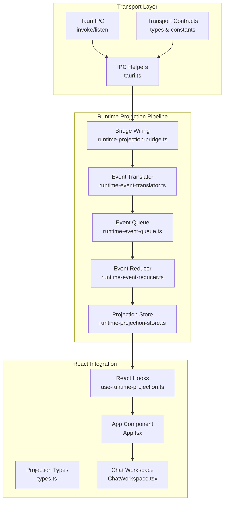
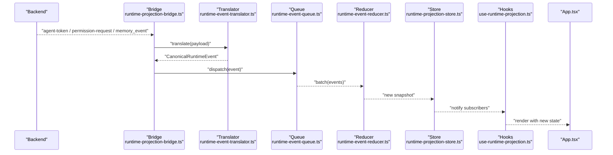
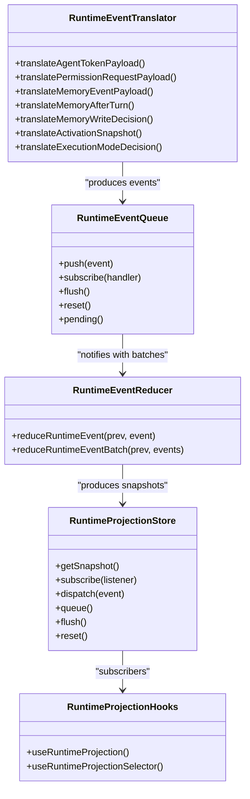
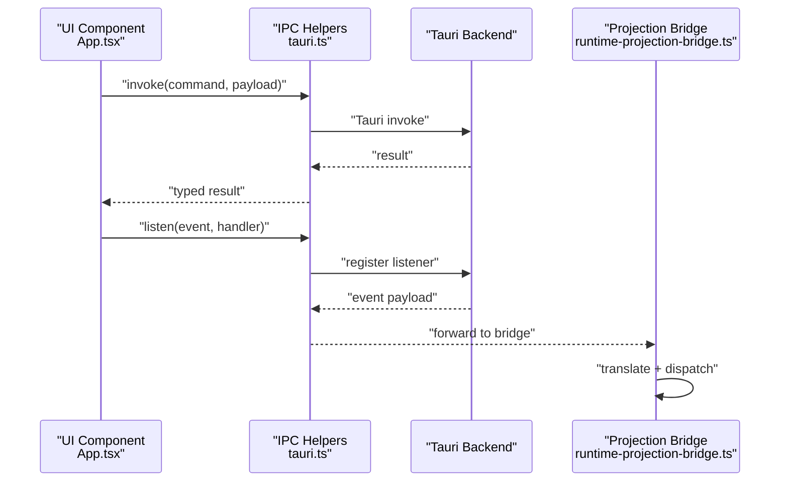
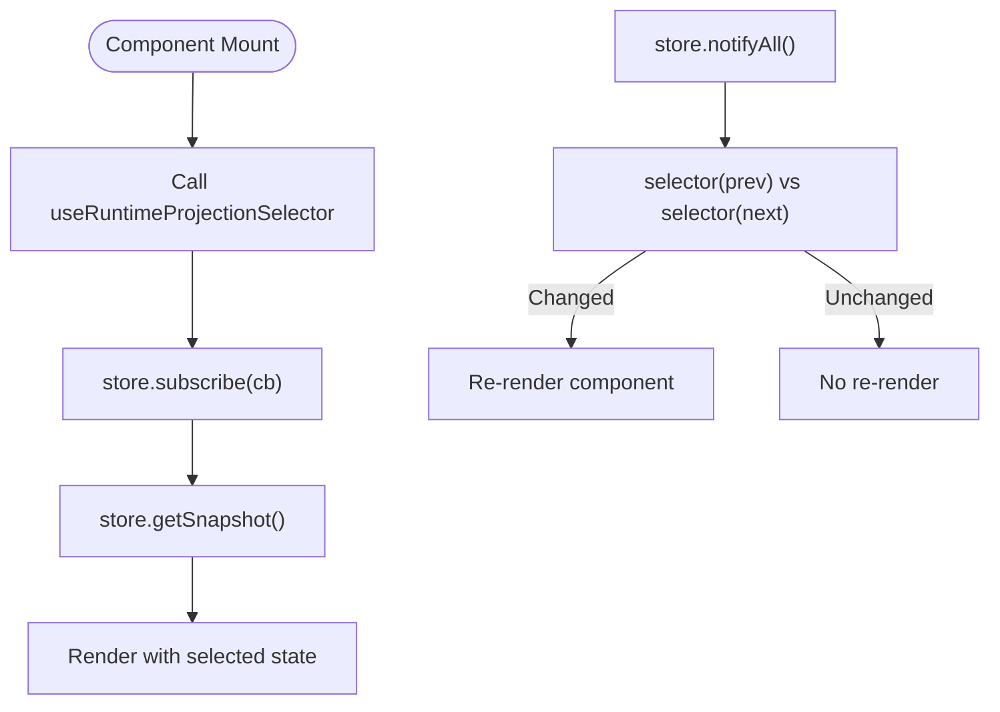
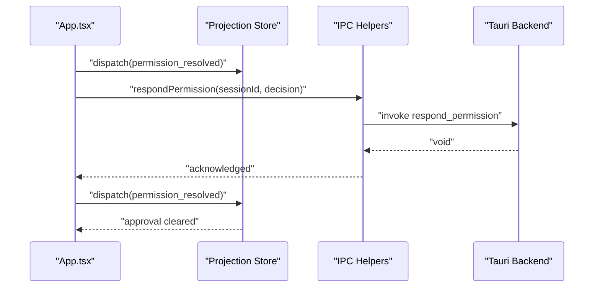
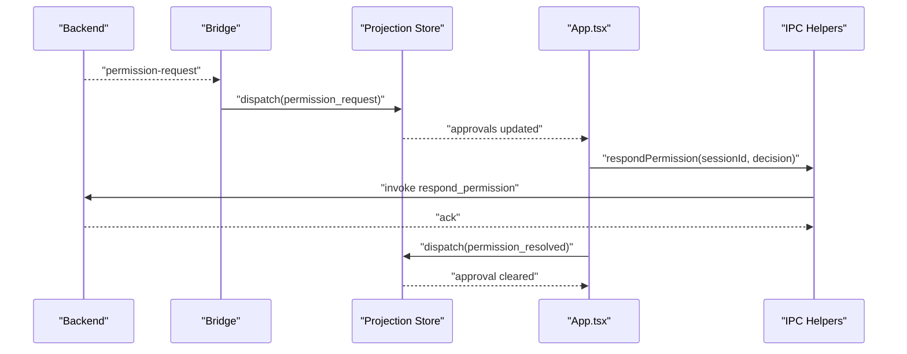
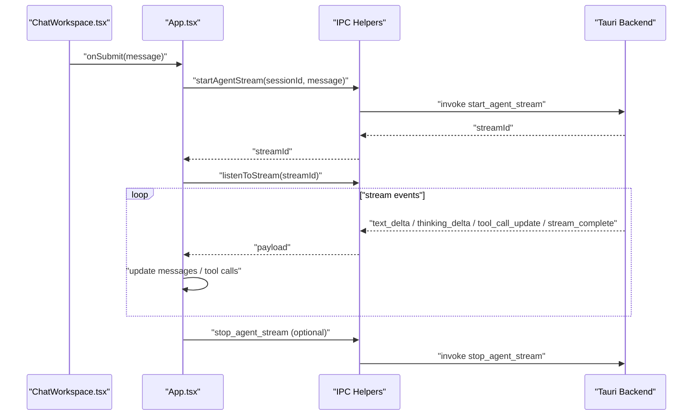
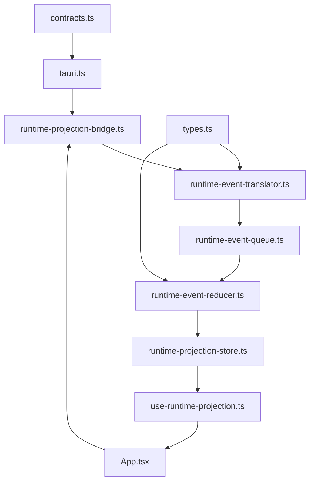

# Component Communication Patterns

<cite>
**Referenced Files in This Document**
- [index.ts](file://src/runtime-projection/index.ts)
- [use-runtime-projection.ts](file://src/runtime-projection/use-runtime-projection.ts)
- [runtime-projection-store.ts](file://src/runtime-projection/runtime-projection-store.ts)
- [runtime-projection-bridge.ts](file://src/runtime-projection/runtime-projection-bridge.ts)
- [runtime-event-translator.ts](file://src/runtime-projection/runtime-event-translator.ts)
- [runtime-event-reducer.ts](file://src/runtime-projection/runtime-event-reducer.ts)
- [runtime-event-queue.ts](file://src/runtime-projection/runtime-event-queue.ts)
- [types.ts](file://src/runtime-projection/types.ts)
- [tauri.ts](file://src/lib/tauri.ts)
- [contracts.ts](file://src/transport/contracts.ts)
- [App.tsx](file://src/App.tsx)
- [ChatWorkspace.tsx](file://src/modules/chat/components/ChatWorkspace.tsx)
</cite>

## Table of Contents
1. [Introduction](#introduction)
2. [Project Structure](#project-structure)
3. [Core Components](#core-components)
4. [Architecture Overview](#architecture-overview)
5. [Detailed Component Analysis](#detailed-component-analysis)
6. [Dependency Analysis](#dependency-analysis)
7. [Performance Considerations](#performance-considerations)
8. [Troubleshooting Guide](#troubleshooting-guide)
9. [Conclusion](#conclusion)

## Introduction
This document explains how components communicate within the React application, focusing on two primary pathways:
- Event-driven communication via the runtime projection system, which synchronizes state across the UI from backend events and IPC commands.
- Direct component-to-backend communication through Tauri IPC commands encapsulated in a dedicated transport layer.

The runtime projection system provides a canonical pipeline for normalizing backend events (agent streams, memory lifecycle, permission requests) into immutable snapshots that React components can subscribe to efficiently. Components also interact with the backend using typed IPC helpers that wrap Tauri invocations and listeners.

## Project Structure
The communication architecture spans several layers:
- Transport layer: Tauri IPC wrappers and canonical transport contracts.
- Runtime projection pipeline: Queue, translator, reducer, and store that produce a global immutable snapshot.
- React integration: Hooks that subscribe to the projection store and UI components that render and orchestrate user actions.
- UI orchestration: App.tsx coordinates bootstrapping, IPC listeners, and orchestrates chat flows.

**Diagram sources**
- [tauri.ts:1-800](file://src/lib/tauri.ts#L1-L800)
- [contracts.ts:1-539](file://src/transport/contracts.ts#L1-L539)
- [runtime-projection-bridge.ts:1-253](file://src/runtime-projection/runtime-projection-bridge.ts#L1-L253)
- [runtime-event-translator.ts:1-277](file://src/runtime-projection/runtime-event-translator.ts#L1-L277)
- [runtime-event-queue.ts:1-124](file://src/runtime-projection/runtime-event-queue.ts#L1-L124)
- [runtime-event-reducer.ts:1-361](file://src/runtime-projection/runtime-event-reducer.ts#L1-L361)
- [runtime-projection-store.ts:1-134](file://src/runtime-projection/runtime-projection-store.ts#L1-L134)
- [use-runtime-projection.ts:1-51](file://src/runtime-projection/use-runtime-projection.ts#L1-L51)
- [types.ts:1-454](file://src/runtime-projection/types.ts#L1-L454)
- [App.tsx:1-800](file://src/App.tsx#L1-L800)
- [ChatWorkspace.tsx:1-401](file://src/modules/chat/components/ChatWorkspace.tsx#L1-L401)

**Section sources**
- [index.ts:1-15](file://src/runtime-projection/index.ts#L1-L15)
- [tauri.ts:1-800](file://src/lib/tauri.ts#L1-L800)
- [contracts.ts:1-539](file://src/transport/contracts.ts#L1-L539)

## Core Components
- Transport contracts and IPC helpers: Define canonical wire shapes and provide typed wrappers around Tauri invoke/listen.
- Runtime projection bridge: Subscribes to backend event sources and dispatches normalized events into the projection pipeline.
- Event queue: Batches and schedules event flushes to decouple event generation from rendering.
- Translator: Normalizes backend payloads into canonical event types.
- Reducer: Pure function that transforms canonical events into immutable snapshots.
- Projection store: Global store exposing getSnapshot and subscribe for React integration.
- React hooks: Adapters to useSyncExternalStore for subscribing to the store and selecting subsets of the snapshot.
- App orchestration: Coordinates IPC listeners, wires the projection bridge, and manages UI state transitions.

**Section sources**
- [runtime-projection-bridge.ts:1-253](file://src/runtime-projection/runtime-projection-bridge.ts#L1-L253)
- [runtime-event-translator.ts:1-277](file://src/runtime-projection/runtime-event-translator.ts#L1-L277)
- [runtime-event-queue.ts:1-124](file://src/runtime-projection/runtime-event-queue.ts#L1-L124)
- [runtime-event-reducer.ts:1-361](file://src/runtime-projection/runtime-event-reducer.ts#L1-L361)
- [runtime-projection-store.ts:1-134](file://src/runtime-projection/runtime-projection-store.ts#L1-L134)
- [use-runtime-projection.ts:1-51](file://src/runtime-projection/use-runtime-projection.ts#L1-L51)
- [types.ts:1-454](file://src/runtime-projection/types.ts#L1-L454)
- [App.tsx:755-766](file://src/App.tsx#L755-L766)

## Architecture Overview
The runtime projection system establishes a unidirectional data flow:
- Backend emits events (agent-token, permission-request, memory_event, memory_after_turn).
- The bridge subscribes broadly to these events and translates them into canonical events.
- The queue batches events and notifies subscribers (the reducer).
- The reducer produces a new immutable snapshot.
- The store notifies React subscribers via useSyncExternalStore.
- Components subscribe via hooks and re-render only when relevant parts of the snapshot change.

**Diagram sources**
- [runtime-projection-bridge.ts:88-194](file://src/runtime-projection/runtime-projection-bridge.ts#L88-L194)
- [runtime-event-translator.ts:45-132](file://src/runtime-projection/runtime-event-translator.ts#L45-L132)
- [runtime-event-queue.ts:97-122](file://src/runtime-projection/runtime-event-queue.ts#L97-L122)
- [runtime-event-reducer.ts:289-300](file://src/runtime-projection/runtime-event-reducer.ts#L289-L300)
- [runtime-projection-store.ts:97-124](file://src/runtime-projection/runtime-projection-store.ts#L97-L124)
- [use-runtime-projection.ts:25-50](file://src/runtime-projection/use-runtime-projection.ts#L25-L50)
- [App.tsx:755-766](file://src/App.tsx#L755-L766)

## Detailed Component Analysis

### Runtime Projection Pipeline
The pipeline ensures predictable, efficient state synchronization:
- Queue: Batches events and flushes them via microtasks by default, with optional synchronous mode for tests.
- Translator: Converts backend payloads into canonical event types without side effects.
- Reducer: Pure transformation of events into immutable snapshots; maintains rolling rings for memory events and decisions.
- Store: Exposes getSnapshot and subscribe; notifies listeners on snapshot replacement.
- Hooks: Provide two subscription strategies—full snapshot and selector-based—using useSyncExternalStore.

**Diagram sources**
- [runtime-event-queue.ts:27-41](file://src/runtime-projection/runtime-event-queue.ts#L27-L41)
- [runtime-event-translator.ts:45-276](file://src/runtime-projection/runtime-event-translator.ts#L45-L276)
- [runtime-event-reducer.ts:40-287](file://src/runtime-projection/runtime-event-reducer.ts#L40-L287)
- [runtime-projection-store.ts:32-54](file://src/runtime-projection/runtime-projection-store.ts#L32-L54)
- [use-runtime-projection.ts:25-50](file://src/runtime-projection/use-runtime-projection.ts#L25-L50)

**Section sources**
- [runtime-event-queue.ts:1-124](file://src/runtime-projection/runtime-event-queue.ts#L1-L124)
- [runtime-event-translator.ts:1-277](file://src/runtime-projection/runtime-event-translator.ts#L1-L277)
- [runtime-event-reducer.ts:1-361](file://src/runtime-projection/runtime-event-reducer.ts#L1-L361)
- [runtime-projection-store.ts:1-134](file://src/runtime-projection/runtime-projection-store.ts#L1-L134)
- [use-runtime-projection.ts:1-51](file://src/runtime-projection/use-runtime-projection.ts#L1-L51)
- [types.ts:1-454](file://src/runtime-projection/types.ts#L1-L454)

### Tauri IPC Integration
Components interact with the backend through typed IPC helpers:
- Transport contracts define canonical wire shapes and event names.
- IPC helpers wrap invoke and listen, providing strongly-typed signatures for commands and event channels.
- App.tsx wires the runtime projection bridge and listens to chat prefill events, among others.

**Diagram sources**
- [tauri.ts:1-800](file://src/lib/tauri.ts#L1-L800)
- [contracts.ts:385-397](file://src/transport/contracts.ts#L385-L397)
- [runtime-projection-bridge.ts:88-194](file://src/runtime-projection/runtime-projection-bridge.ts#L88-L194)
- [App.tsx:755-785](file://src/App.tsx#L755-L785)

**Section sources**
- [tauri.ts:1-800](file://src/lib/tauri.ts#L1-L800)
- [contracts.ts:1-539](file://src/transport/contracts.ts#L1-L539)
- [App.tsx:755-785](file://src/App.tsx#L755-L785)

### Component Subscription Patterns
React components subscribe to the runtime projection store using two hooks:
- useRuntimeProjection: Subscribes to the entire snapshot; triggers re-renders on any change.
- useRuntimeProjectionSelector: Subscribes to a selected slice; re-renders only when the selector returns a different value.

These hooks integrate with useSyncExternalStore, ensuring predictable subscriptions and avoiding unnecessary renders.

**Diagram sources**
- [use-runtime-projection.ts:25-50](file://src/runtime-projection/use-runtime-projection.ts#L25-L50)
- [runtime-projection-store.ts:97-124](file://src/runtime-projection/runtime-projection-store.ts#L97-L124)

**Section sources**
- [use-runtime-projection.ts:1-51](file://src/runtime-projection/use-runtime-projection.ts#L1-L51)
- [runtime-projection-store.ts:1-134](file://src/runtime-projection/runtime-projection-store.ts#L1-L134)

### Bidirectional Communication Patterns
- Backend-to-Frontend: Events are broadcast via Tauri listeners and fed into the projection pipeline.
- Frontend-to-Backend: Components invoke commands (e.g., responding to permission requests, stopping streams).
- UI orchestration: App.tsx orchestrates chat flows, manages session state, and integrates with the projection store for permission prompts and execution mode previews.

**Diagram sources**
- [App.tsx:1286-1310](file://src/App.tsx#L1286-L1310)
- [tauri.ts:281-292](file://src/lib/tauri.ts#L281-L292)
- [runtime-projection-store.ts:97-124](file://src/runtime-projection/runtime-projection-store.ts#L97-L124)

**Section sources**
- [App.tsx:1286-1310](file://src/App.tsx#L1286-L1310)
- [tauri.ts:281-292](file://src/lib/tauri.ts#L281-L292)

### Permission Request Handling
The system centralizes permission handling through the projection store:
- Backend emits permission-request events.
- Bridge translates and dispatches to the store.
- App.tsx reads pending approvals via selectors and presents a single prompt.
- After user decision, App.tsx invokes respondPermission and dispatches permission_resolved to clear the prompt.

**Diagram sources**
- [runtime-projection-bridge.ts:127-132](file://src/runtime-projection/runtime-projection-bridge.ts#L127-L132)
- [runtime-event-translator.ts:138-150](file://src/runtime-projection/runtime-event-translator.ts#L138-L150)
- [runtime-event-reducer.ts:137-148](file://src/runtime-projection/runtime-event-reducer.ts#L137-L148)
- [App.tsx:1286-1310](file://src/App.tsx#L1286-L1310)
- [tauri.ts:281-292](file://src/lib/tauri.ts#L281-L292)

**Section sources**
- [runtime-projection-bridge.ts:1-253](file://src/runtime-projection/runtime-projection-bridge.ts#L1-L253)
- [runtime-event-translator.ts:1-277](file://src/runtime-projection/runtime-event-translator.ts#L1-L277)
- [runtime-event-reducer.ts:1-361](file://src/runtime-projection/runtime-event-reducer.ts#L1-L361)
- [App.tsx:1286-1310](file://src/App.tsx#L1286-L1310)
- [tauri.ts:268-292](file://src/lib/tauri.ts#L268-L292)

### Chat Flow Orchestration
The ChatWorkspace and App.tsx coordinate streaming interactions:
- App.tsx creates assistant messages, accumulates deltas, and updates UI state.
- It listens to stream events and updates messages, tool calls, and completion status.
- It integrates with the projection store for permission prompts and execution mode previews.

**Diagram sources**
- [ChatWorkspace.tsx:1-401](file://src/modules/chat/components/ChatWorkspace.tsx#L1-L401)
- [App.tsx:1316-2134](file://src/App.tsx#L1316-L2134)
- [tauri.ts:221-265](file://src/lib/tauri.ts#L221-L265)

**Section sources**
- [ChatWorkspace.tsx:1-401](file://src/modules/chat/components/ChatWorkspace.tsx#L1-L401)
- [App.tsx:1316-2134](file://src/App.tsx#L1316-L2134)
- [tauri.ts:221-265](file://src/lib/tauri.ts#L221-L265)

## Dependency Analysis
The runtime projection system exhibits low coupling and high cohesion:
- The translator and reducer are pure and independent of React.
- The store exposes a minimal API and is decoupled from UI concerns.
- The bridge is the only place where backend event sources are subscribed; UI components do not translate payloads themselves.
- IPC helpers centralize transport concerns and provide a single import surface for backend interactions.

**Diagram sources**
- [contracts.ts:1-539](file://src/transport/contracts.ts#L1-L539)
- [tauri.ts:1-800](file://src/lib/tauri.ts#L1-L800)
- [runtime-projection-bridge.ts:1-253](file://src/runtime-projection/runtime-projection-bridge.ts#L1-L253)
- [runtime-event-translator.ts:1-277](file://src/runtime-projection/runtime-event-translator.ts#L1-L277)
- [runtime-event-queue.ts:1-124](file://src/runtime-projection/runtime-event-queue.ts#L1-L124)
- [runtime-event-reducer.ts:1-361](file://src/runtime-projection/runtime-event-reducer.ts#L1-L361)
- [runtime-projection-store.ts:1-134](file://src/runtime-projection/runtime-projection-store.ts#L1-L134)
- [use-runtime-projection.ts:1-51](file://src/runtime-projection/use-runtime-projection.ts#L1-L51)
- [types.ts:1-454](file://src/runtime-projection/types.ts#L1-L454)
- [App.tsx:1-800](file://src/App.tsx#L1-L800)

**Section sources**
- [index.ts:1-15](file://src/runtime-projection/index.ts#L1-L15)
- [runtime-projection-bridge.ts:1-253](file://src/runtime-projection/runtime-projection-bridge.ts#L1-L253)
- [runtime-event-translator.ts:1-277](file://src/runtime-projection/runtime-event-translator.ts#L1-L277)
- [runtime-event-reducer.ts:1-361](file://src/runtime-projection/runtime-event-reducer.ts#L1-L361)
- [runtime-projection-store.ts:1-134](file://src/runtime-projection/runtime-projection-store.ts#L1-L134)
- [use-runtime-projection.ts:1-51](file://src/runtime-projection/use-runtime-projection.ts#L1-L51)
- [types.ts:1-454](file://src/runtime-projection/types.ts#L1-L454)
- [tauri.ts:1-800](file://src/lib/tauri.ts#L1-L800)
- [contracts.ts:1-539](file://src/transport/contracts.ts#L1-L539)
- [App.tsx:1-800](file://src/App.tsx#L1-L800)

## Performance Considerations
- Event batching: The queue flushes via microtasks to batch rapid events (e.g., text_delta) without introducing frame latency.
- Selector-based subscriptions: useRuntimeProjectionSelector minimizes re-renders by only re-rendering when the selector result changes.
- Immutable snapshots: Structural sharing ensures shallow equality checks remain fast across large snapshots.
- Controlled listener lifecycles: The bridge tracks and cleans up listeners to prevent leaks and redundant work.
- UI-level batching: Chat orchestration accumulates deltas and flushes them via requestAnimationFrame to balance responsiveness and performance.

[No sources needed since this section provides general guidance]

## Troubleshooting Guide
Common issues and strategies:
- Listener registration failures: The bridge logs registration failures without throwing, allowing other listeners to succeed.
- Listener cleanup: Always use the returned disposer from wireRuntimeProjectionListeners to detach listeners on unmount.
- Permission prompt persistence: Ensure permission_resolved events are dispatched after respondPermission to clear pending prompts.
- Error handling in chat flows: App.tsx catches stream errors, updates messages with error states, and attempts auto-resume when appropriate.
- Storage failures: UI state persistence uses try/catch to avoid crashing the main workspace on storage errors.

**Section sources**
- [runtime-projection-bridge.ts:108-115](file://src/runtime-projection/runtime-projection-bridge.ts#L108-L115)
- [App.tsx:1286-1310](file://src/App.tsx#L1286-L1310)
- [App.tsx:1656-1665](file://src/App.tsx#L1656-L1665)
- [App.tsx:1950-1959](file://src/App.tsx#L1950-L1959)

## Conclusion
The React application employs a robust, event-driven architecture:
- A canonical runtime projection pipeline ensures consistent state synchronization from backend events.
- Typed IPC helpers encapsulate backend interactions, improving reliability and maintainability.
- React hooks provide efficient, selective subscriptions to the projection store.
- The bridge pattern centralizes backend integration, keeping UI components focused on rendering and user interaction.
- Bidirectional communication is handled cleanly: backend events flow into the store, while UI actions trigger IPC commands and store updates.

[No sources needed since this section summarizes without analyzing specific files]