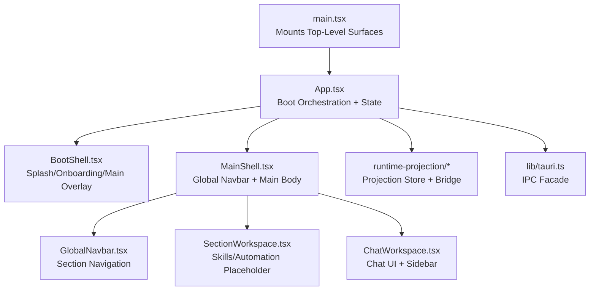
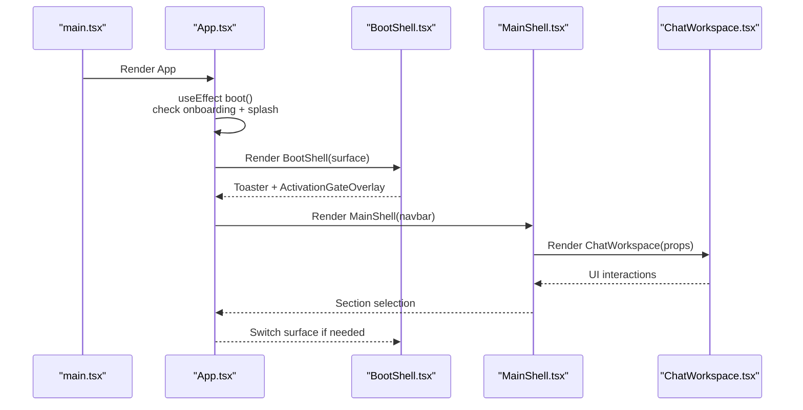
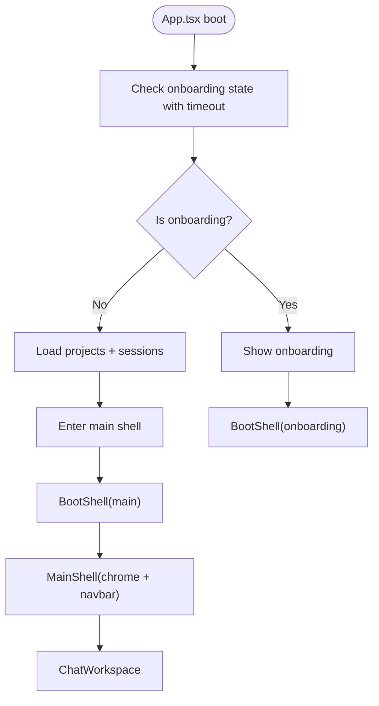
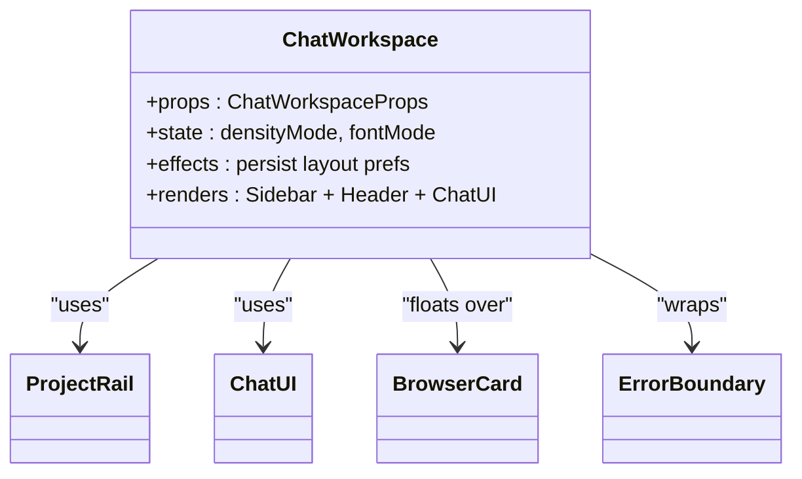
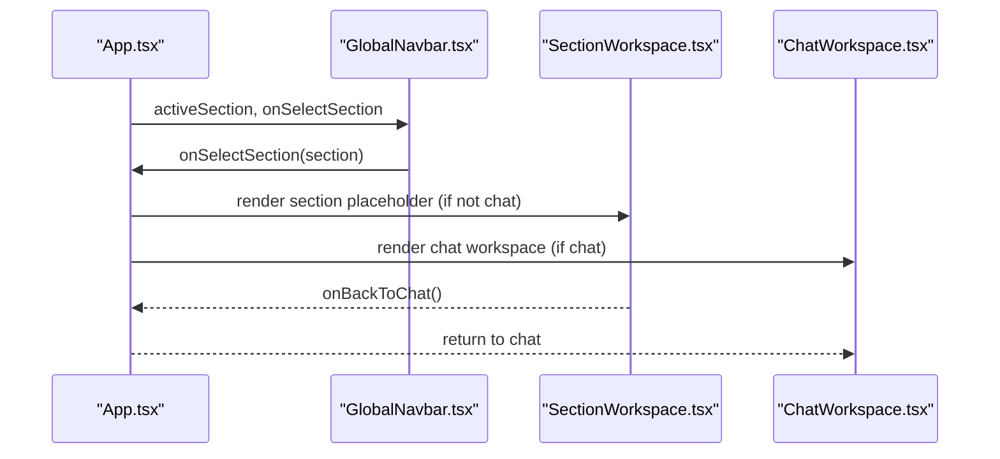
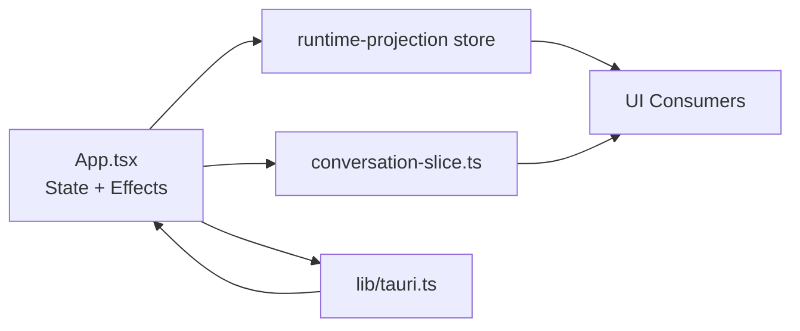
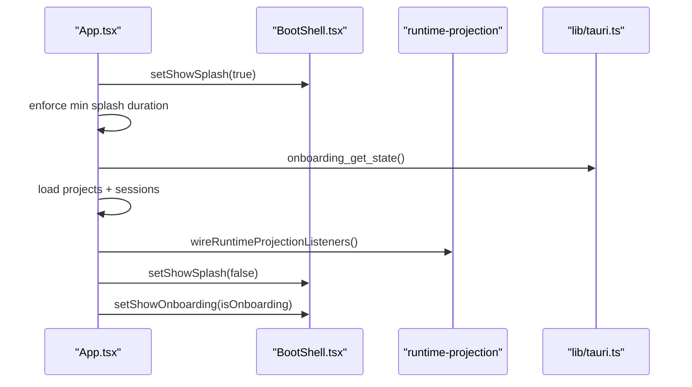
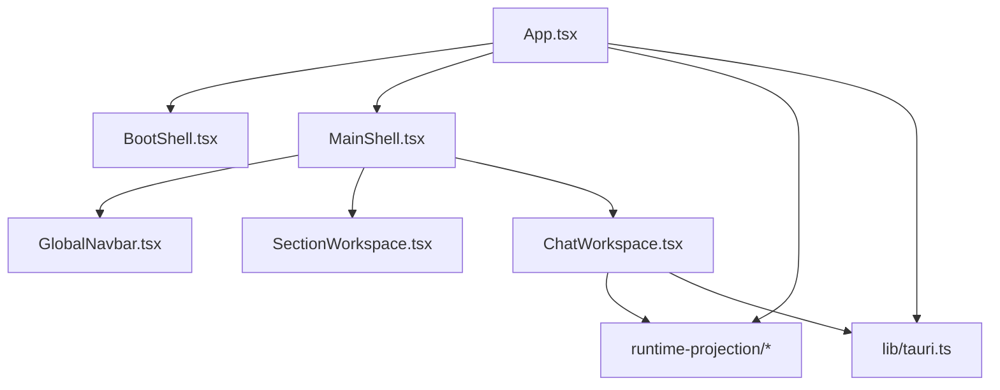

# Component Hierarchy and Composition

<cite>
**Referenced Files in This Document**
- [App.tsx](file://src/App.tsx)
- [main.tsx](file://src/main.tsx)
- [BootShell.tsx](file://src/boot/BootShell.tsx)
- [MainShell.tsx](file://src/shell/MainShell.tsx)
- [ChatWorkspace.tsx](file://src/modules/chat/components/ChatWorkspace.tsx)
- [SectionWorkspace.tsx](file://src/modules/app-shell/components/SectionWorkspace.tsx)
- [GlobalNavbar.tsx](file://src/modules/app-shell/components/GlobalNavbar.tsx)
- [types.ts](file://src/modules/app-shell/types.ts)
- [index.ts](file://src/modules/skills/index.ts)
- [use-boot-route.ts](file://src/boot/use-boot-route.ts)
- [runtime-projection/index.ts](file://src/runtime-projection/index.ts)
- [conversation-slice.ts](file://src/stores/conversation-slice.ts)
- [tauri.ts](file://src/lib/tauri.ts)
</cite>

## Table of Contents
1. [Introduction](#introduction)
2. [Project Structure](#project-structure)
3. [Core Components](#core-components)
4. [Architecture Overview](#architecture-overview)
5. [Detailed Component Analysis](#detailed-component-analysis)
6. [Dependency Analysis](#dependency-analysis)
7. [Performance Considerations](#performance-considerations)
8. [Troubleshooting Guide](#troubleshooting-guide)
9. [Conclusion](#conclusion)

## Introduction
This document explains the React application’s component hierarchy and composition patterns with a focus on how App.tsx orchestrates the entire application state, including the boot process and shell switching between BootShell and MainShell. It documents how different sections (chat, skills, automation) are integrated, how state is managed, and how components communicate. It also covers lifecycle management, prop drilling patterns, and runtime state handling during initialization and ongoing operation.

## Project Structure
The application entry point is mounted in main.tsx, which selects among multiple top-level surfaces (main App, settings window, browser viewer) and wraps them in theme and tooltip providers. App.tsx owns the boot orchestration and application-wide state, then delegates rendering to BootShell and MainShell depending on the current boot route. The chat workspace is composed of modular components, and the app shell integrates navigation and section routing.

**Diagram sources**
- [main.tsx:16-43](file://src/main.tsx#L16-L43)
- [App.tsx:89-197](file://src/App.tsx#L89-L197)
- [BootShell.tsx:52-82](file://src/boot/BootShell.tsx#L52-L82)
- [MainShell.tsx:52-85](file://src/shell/MainShell.tsx#L52-L85)
- [GlobalNavbar.tsx:6-99](file://src/modules/app-shell/components/GlobalNavbar.tsx#L6-L99)
- [SectionWorkspace.tsx:5-40](file://src/modules/app-shell/components/SectionWorkspace.tsx#L5-L40)
- [ChatWorkspace.tsx:92-401](file://src/modules/chat/components/ChatWorkspace.tsx#L92-L401)
- [runtime-projection/index.ts:1-15](file://src/runtime-projection/index.ts#L1-L15)
- [tauri.ts:14-34](file://src/lib/tauri.ts#L14-L34)

**Section sources**
- [main.tsx:16-43](file://src/main.tsx#L16-L43)
- [App.tsx:89-197](file://src/App.tsx#L89-L197)

## Core Components
- App.tsx: Central orchestrator for boot, project/session data, active session state, permission mode, and runtime projection integration. Manages splash/onboarding visibility, loads project/session metadata, and wires runtime projection listeners.
- BootShell.tsx: Minimal boot shell container that switches between splash, onboarding, and main surfaces, and hosts global overlays (toasts, activation gate).
- MainShell.tsx: Minimal main shell wrapper that hosts the global navbar, execution mode pill, and the main content area.
- ChatWorkspace.tsx: Primary chat UI surface with sidebar, header controls, and chat UI; coordinates with browser store and error boundaries.
- SectionWorkspace.tsx: Placeholder for non-chat sections (skills, automation, memory) with a back-to-chat action.
- GlobalNavbar.tsx: Left-side navigation that selects active section and opens settings.
- runtime-projection: Canonical store and bridge for runtime events; App.tsx consumes it via selectors and effects.
- tauri.ts: Thin IPC facade for backend commands and event listeners.

**Section sources**
- [App.tsx:89-766](file://src/App.tsx#L89-L766)
- [BootShell.tsx:52-82](file://src/boot/BootShell.tsx#L52-L82)
- [MainShell.tsx:52-85](file://src/shell/MainShell.tsx#L52-L85)
- [ChatWorkspace.tsx:92-401](file://src/modules/chat/components/ChatWorkspace.tsx#L92-L401)
- [SectionWorkspace.tsx:5-40](file://src/modules/app-shell/components/SectionWorkspace.tsx#L5-L40)
- [GlobalNavbar.tsx:6-99](file://src/modules/app-shell/components/GlobalNavbar.tsx#L6-L99)
- [runtime-projection/index.ts:1-15](file://src/runtime-projection/index.ts#L1-L15)
- [tauri.ts:14-34](file://src/lib/tauri.ts#L14-L34)

## Architecture Overview
The application follows a layered composition:
- Entry layer: main.tsx selects the top-level surface and applies theme/provider wrappers.
- Boot layer: App.tsx runs a coordinated boot sequence (splash duration + onboarding check), then decides whether to show onboarding or enter the main shell. BootShell renders the appropriate surface and overlays.
- Main layer: MainShell hosts the global navbar and routes content to either the chat workspace or section placeholders. App.tsx passes props down to these surfaces.
- Data and events: App.tsx maintains application state and wires runtime projection listeners; tauri.ts provides IPC helpers.

**Diagram sources**
- [main.tsx:16-43](file://src/main.tsx#L16-L43)
- [App.tsx:103-197](file://src/App.tsx#L103-L197)
- [BootShell.tsx:52-82](file://src/boot/BootShell.tsx#L52-L82)
- [MainShell.tsx:52-85](file://src/shell/MainShell.tsx#L52-L85)
- [ChatWorkspace.tsx:92-401](file://src/modules/chat/components/ChatWorkspace.tsx#L92-L401)

## Detailed Component Analysis

### Boot and Shell Switching
- Boot orchestration: App.tsx runs a boot sequence that checks onboarding state with a timeout and ensures a minimum splash duration. After boot, it loads projects and sessions and decides whether to show onboarding or the main shell.
- Boot route derivation: use-boot-route.ts computes a 4-state route (splash, onboarding, activation gate, main shell) based on local flags and the runtime projection activation snapshot. bootRouteToSurface maps this to BootShell’s 3-state surface prop.
- BootShell: Renders splash, onboarding, or main content and always mounts global overlays (toasts and activation gate overlay).
- MainShell: Wraps the main content with global chrome (version watermark, execution mode pill, global navbar) and delegates the main body to children.

**Diagram sources**
- [App.tsx:103-197](file://src/App.tsx#L103-L197)
- [use-boot-route.ts:61-91](file://src/boot/use-boot-route.ts#L61-L91)
- [BootShell.tsx:52-82](file://src/boot/BootShell.tsx#L52-L82)
- [MainShell.tsx:52-85](file://src/shell/MainShell.tsx#L52-L85)

**Section sources**
- [App.tsx:103-197](file://src/App.tsx#L103-L197)
- [use-boot-route.ts:61-91](file://src/boot/use-boot-route.ts#L61-L91)
- [BootShell.tsx:52-82](file://src/boot/BootShell.tsx#L52-L82)
- [MainShell.tsx:52-85](file://src/shell/MainShell.tsx#L52-L85)

### Chat Workspace Composition
- ChatWorkspace composes the left sidebar (ProjectRail), header controls, and the main chat UI. It manages layout state (pane collapse, widths), font/density preferences, and integrates with the browser store to reflect AI browser activity.
- It exposes a comprehensive prop interface for parent components to control selection, creation, renaming, and streaming behavior.
- Error boundaries wrap critical areas to maintain usability when parts fail.

**Diagram sources**
- [ChatWorkspace.tsx:92-401](file://src/modules/chat/components/ChatWorkspace.tsx#L92-L401)

**Section sources**
- [ChatWorkspace.tsx:92-401](file://src/modules/chat/components/ChatWorkspace.tsx#L92-L401)

### Section Routing and Navigation
- Active section is maintained in App.tsx and persisted to localStorage. GlobalNavbar drives selection and forwards to App.tsx, which then renders the appropriate content.
- SectionWorkspace.tsx provides placeholder surfaces for skills and automation with a back-to-chat action. The active section type is defined centrally.

**Diagram sources**
- [GlobalNavbar.tsx:6-99](file://src/modules/app-shell/components/GlobalNavbar.tsx#L6-L99)
- [SectionWorkspace.tsx:5-40](file://src/modules/app-shell/components/SectionWorkspace.tsx#L5-L40)
- [types.ts:1-2](file://src/modules/app-shell/types.ts#L1-L2)

**Section sources**
- [GlobalNavbar.tsx:6-99](file://src/modules/app-shell/components/GlobalNavbar.tsx#L6-L99)
- [SectionWorkspace.tsx:5-40](file://src/modules/app-shell/components/SectionWorkspace.tsx#L5-L40)
- [types.ts:1-2](file://src/modules/app-shell/types.ts#L1-L2)

### State Management Patterns
- Application state: App.tsx holds project/session metadata, active session, input, loading flags, conversations, permission mode, and runtime projection approvals. It also maintains refs for stable access in async callbacks.
- Runtime projection: App.tsx wires the canonical projection bridge and reads from the store via selectors. This enables decoupled UI reactions to activation, execution mode, and permission requests.
- Conversation store: conversation-slice.ts provides a module-level singleton with external store semantics, enabling mutations from event handlers and subscriptions.

**Diagram sources**
- [App.tsx:262-274](file://src/App.tsx#L262-L274)
- [App.tsx:763-766](file://src/App.tsx#L763-L766)
- [conversation-slice.ts:245-247](file://src/stores/conversation-slice.ts#L245-L247)
- [runtime-projection/index.ts:1-15](file://src/runtime-projection/index.ts#L1-L15)
- [tauri.ts:14-34](file://src/lib/tauri.ts#L14-L34)

**Section sources**
- [App.tsx:262-274](file://src/App.tsx#L262-L274)
- [App.tsx:763-766](file://src/App.tsx#L763-L766)
- [conversation-slice.ts:245-247](file://src/stores/conversation-slice.ts#L245-L247)
- [runtime-projection/index.ts:1-15](file://src/runtime-projection/index.ts#L1-L15)
- [tauri.ts:14-34](file://src/lib/tauri.ts#L14-L34)

### Component Lifecycle and Initialization
- Splash and onboarding: App.tsx enforces a minimum splash duration and performs an onboarding check with a timeout to avoid indefinite blocking. It then decides whether to show onboarding or proceed to main shell.
- Data loading: During non-onboarding boot, App.tsx ensures a default workdir, lists projects and sessions, and initializes active project/session state.
- Runtime projection: App.tsx wires the projection listeners once and cleans them up on unmount. It also listens to chat prefill events and global shortcuts.
- Chat lifecycle: ChatWorkspace persists layout preferences to localStorage and uses error boundaries to degrade gracefully.

**Diagram sources**
- [App.tsx:103-197](file://src/App.tsx#L103-L197)
- [BootShell.tsx:52-82](file://src/boot/BootShell.tsx#L52-L82)
- [runtime-projection/index.ts:1-15](file://src/runtime-projection/index.ts#L1-L15)
- [tauri.ts:14-34](file://src/lib/tauri.ts#L14-L34)

**Section sources**
- [App.tsx:103-197](file://src/App.tsx#L103-L197)
- [BootShell.tsx:52-82](file://src/boot/BootShell.tsx#L52-L82)
- [runtime-projection/index.ts:1-15](file://src/runtime-projection/index.ts#L1-L15)
- [tauri.ts:14-34](file://src/lib/tauri.ts#L14-L34)

### Prop Drilling and Composition Strategies
- App.tsx drills props deep into ChatWorkspace and other surfaces, including project/session data, selection callbacks, streaming controls, and UI state. This minimizes cross-cutting concerns and keeps data near its owner.
- MainShell acts as a container that forwards navigation props to GlobalNavbar and delegates the main content area to children, preserving App.tsx’s ownership of data flow.
- SectionWorkspace is a small, focused component that receives a section type and a back-to-chat callback, avoiding unnecessary complexity.

**Section sources**
- [ChatWorkspace.tsx:92-138](file://src/modules/chat/components/ChatWorkspace.tsx#L92-L138)
- [MainShell.tsx:36-50](file://src/shell/MainShell.tsx#L36-L50)
- [SectionWorkspace.tsx:5-11](file://src/modules/app-shell/components/SectionWorkspace.tsx#L5-L11)

### Relationship Between App.tsx and Child Components
- App.tsx owns boot state, project/session state, and runtime projection integration. It passes props to BootShell and MainShell, and MainShell passes navigation props to GlobalNavbar.
- ChatWorkspace receives all chat-related state and callbacks, enabling centralized control of messaging, selection, and streaming.
- SectionWorkspace is a lightweight placeholder for non-chat sections, with a simple back-to-chat interaction.

**Section sources**
- [App.tsx:89-766](file://src/App.tsx#L89-L766)
- [ChatWorkspace.tsx:92-401](file://src/modules/chat/components/ChatWorkspace.tsx#L92-L401)
- [SectionWorkspace.tsx:5-40](file://src/modules/app-shell/components/SectionWorkspace.tsx#L5-L40)

## Dependency Analysis
- App.tsx depends on BootShell and MainShell for shell-level composition, on runtime-projection for canonical state, and on tauri.ts for IPC.
- BootShell depends on activation gate overlay and global toasts; MainShell depends on global navbar and execution mode pill.
- ChatWorkspace depends on ProjectRail, ChatUI, BrowserCard, and error boundaries.
- SectionWorkspace depends on UI primitives and a back-to-chat callback.

**Diagram sources**
- [App.tsx:89-766](file://src/App.tsx#L89-L766)
- [BootShell.tsx:52-82](file://src/boot/BootShell.tsx#L52-L82)
- [MainShell.tsx:52-85](file://src/shell/MainShell.tsx#L52-L85)
- [ChatWorkspace.tsx:92-401](file://src/modules/chat/components/ChatWorkspace.tsx#L92-L401)
- [GlobalNavbar.tsx:6-99](file://src/modules/app-shell/components/GlobalNavbar.tsx#L6-L99)
- [SectionWorkspace.tsx:5-40](file://src/modules/app-shell/components/SectionWorkspace.tsx#L5-L40)
- [runtime-projection/index.ts:1-15](file://src/runtime-projection/index.ts#L1-L15)
- [tauri.ts:14-34](file://src/lib/tauri.ts#L14-L34)

**Section sources**
- [App.tsx:89-766](file://src/App.tsx#L89-L766)
- [BootShell.tsx:52-82](file://src/boot/BootShell.tsx#L52-L82)
- [MainShell.tsx:52-85](file://src/shell/MainShell.tsx#L52-L85)
- [ChatWorkspace.tsx:92-401](file://src/modules/chat/components/ChatWorkspace.tsx#L92-L401)
- [GlobalNavbar.tsx:6-99](file://src/modules/app-shell/components/GlobalNavbar.tsx#L6-L99)
- [SectionWorkspace.tsx:5-40](file://src/modules/app-shell/components/SectionWorkspace.tsx#L5-L40)
- [runtime-projection/index.ts:1-15](file://src/runtime-projection/index.ts#L1-L15)
- [tauri.ts:14-34](file://src/lib/tauri.ts#L14-L34)

## Performance Considerations
- Memoization: App.tsx uses useMemo for derived values (e.g., recent sessions, active messages) to prevent unnecessary re-renders.
- Stable refs: Refs capture mutable values for async callbacks (e.g., sessionLoading, sessionTitleStates) to avoid stale closures.
- Local storage: Persisting layout and preferences reduces re-computation and improves perceived responsiveness.
- Error boundaries: ChatWorkspace isolates failures in sidebar and main content to keep the UI usable.

[No sources needed since this section provides general guidance]

## Troubleshooting Guide
- Boot hangs or onboarding never completes: Verify the onboarding check timeout and splash enforcement logic in App.tsx boot effect.
- Permission prompts not appearing: Ensure the runtime projection bridge is wired and that App.tsx reads approvals via selectors.
- Chat UI not updating: Confirm that tauri IPC listeners are registered and that conversation state is updated through the conversation store or App.tsx state setters.
- Section navigation issues: Check that GlobalNavbar invokes the callback passed by App.tsx and that SectionWorkspace returns to chat properly.

**Section sources**
- [App.tsx:103-197](file://src/App.tsx#L103-L197)
- [App.tsx:763-766](file://src/App.tsx#L763-L766)
- [conversation-slice.ts:245-247](file://src/stores/conversation-slice.ts#L245-L247)
- [GlobalNavbar.tsx:6-99](file://src/modules/app-shell/components/GlobalNavbar.tsx#L6-L99)
- [SectionWorkspace.tsx:5-40](file://src/modules/app-shell/components/SectionWorkspace.tsx#L5-L40)

## Conclusion
App.tsx orchestrates a clean separation of concerns: it owns boot and application state, delegates shell composition to BootShell and MainShell, and composes feature surfaces like ChatWorkspace. The runtime projection pipeline and tauri IPC facade enable decoupled, canonical state updates and reliable communication with the backend. Prop drilling remains intentional and scoped to maintain centralized control, while error boundaries and memoization improve resilience and performance.