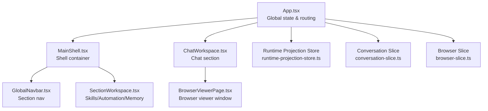
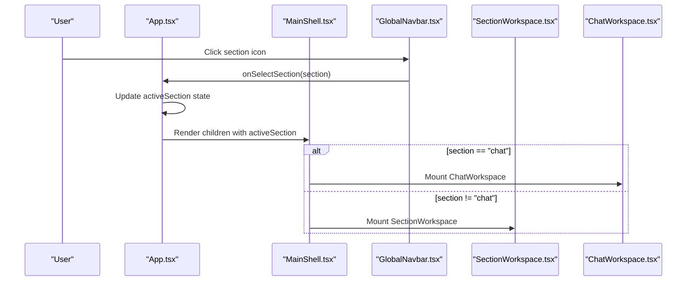
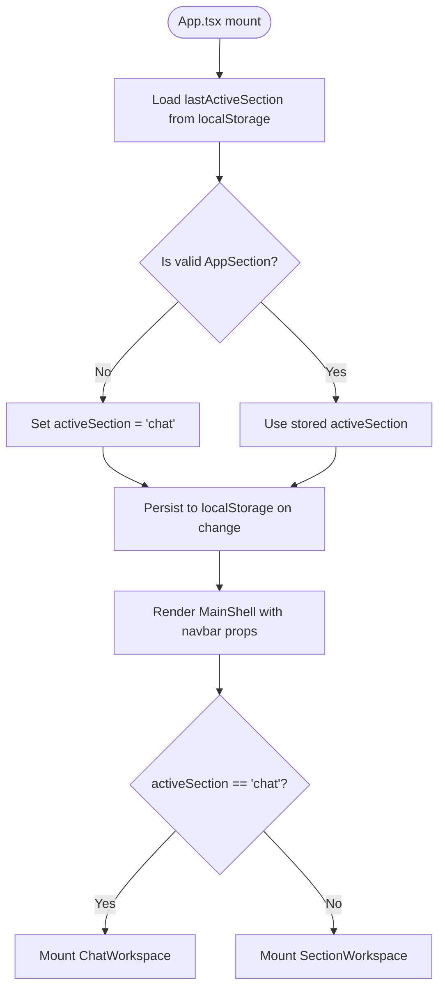
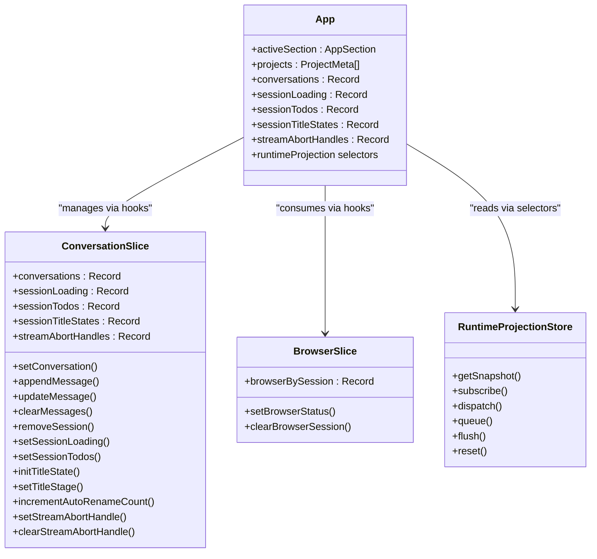
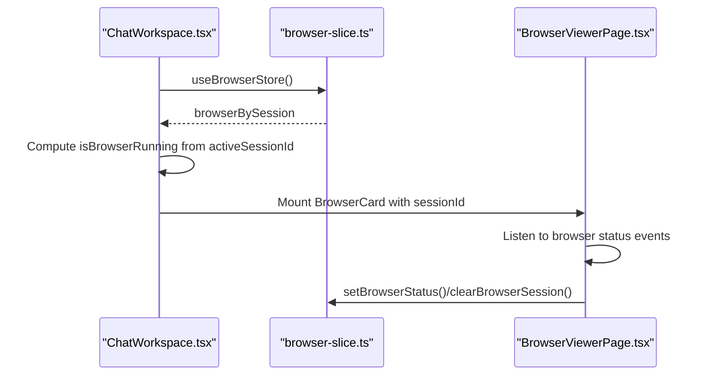
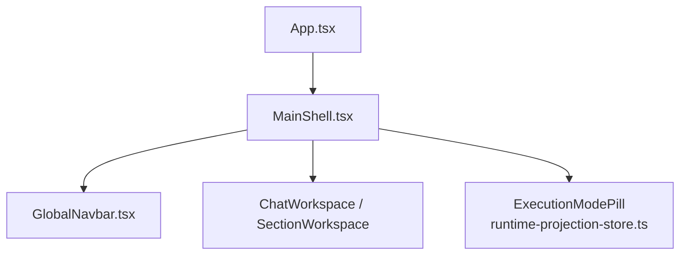
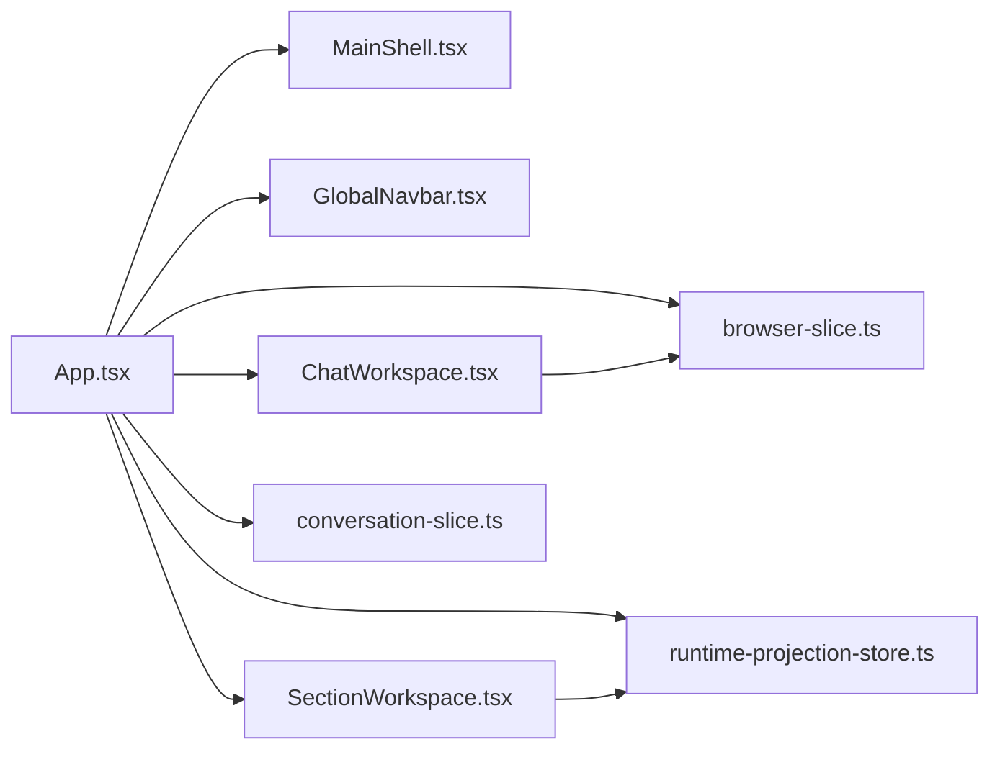

# Modular Section Structure

<cite>
**Referenced Files in This Document**
- [SectionWorkspace.tsx](file://src/modules/app-shell/components/SectionWorkspace.tsx)
- [types.ts](file://src/modules/app-shell/types.ts)
- [MainShell.tsx](file://src/shell/MainShell.tsx)
- [App.tsx](file://src/App.tsx)
- [GlobalNavbar.tsx](file://src/modules/app-shell/components/GlobalNavbar.tsx)
- [ChatWorkspace.tsx](file://src/modules/chat/components/ChatWorkspace.tsx)
- [BrowserViewerPage.tsx](file://src/modules/browser-viewer/BrowserViewerPage.tsx)
- [conversation-slice.ts](file://src/stores/conversation-slice.ts)
- [browser-slice.ts](file://src/stores/browser-slice.ts)
- [runtime-projection-store.ts](file://src/runtime-projection/runtime-projection-store.ts)
- [use-runtime-projection.ts](file://src/runtime-projection/use-runtime-projection.ts)
</cite>

## Table of Contents
1. [Introduction](#introduction)
2. [Project Structure](#project-structure)
3. [Core Components](#core-components)
4. [Architecture Overview](#architecture-overview)
5. [Detailed Component Analysis](#detailed-component-analysis)
6. [Dependency Analysis](#dependency-analysis)
7. [Performance Considerations](#performance-considerations)
8. [Troubleshooting Guide](#troubleshooting-guide)
9. [Conclusion](#conclusion)

## Introduction
This document explains the modular section structure of the application, focusing on how the system is organized into distinct functional areas (chat, skills, automation, memory) using the SectionWorkspace pattern. It details the routing mechanism between sections, the state management model that isolates section-specific concerns while integrating with global application state, and the integration patterns between sections and the main application shell. The document also covers how new sections can be added and how components within sections maintain their own state.

## Project Structure
The modular section structure centers around:
- A global active section state controlled in the root application.
- A shell that hosts the global navigation and routes the main content area.
- Section-specific workspaces that encapsulate UI and state for each functional area.
- Stores that manage section-specific state independently from the global app state.



**Diagram sources**
- [App.tsx](file://src/App.tsx)
- [MainShell.tsx](file://src/shell/MainShell.tsx)
- [GlobalNavbar.tsx](file://src/modules/app-shell/components/GlobalNavbar.tsx)
- [SectionWorkspace.tsx](file://src/modules/app-shell/components/SectionWorkspace.tsx)
- [ChatWorkspace.tsx](file://src/modules/chat/components/ChatWorkspace.tsx)
- [BrowserViewerPage.tsx](file://src/modules/browser-viewer/BrowserViewerPage.tsx)
- [runtime-projection-store.ts](file://src/runtime-projection/runtime-projection-store.ts)
- [conversation-slice.ts](file://src/stores/conversation-slice.ts)
- [browser-slice.ts](file://src/stores/browser-slice.ts)

**Section sources**
- [App.tsx](file://src/App.tsx)
- [MainShell.tsx](file://src/shell/MainShell.tsx)
- [GlobalNavbar.tsx](file://src/modules/app-shell/components/GlobalNavbar.tsx)
- [SectionWorkspace.tsx](file://src/modules/app-shell/components/SectionWorkspace.tsx)
- [ChatWorkspace.tsx](file://src/modules/chat/components/ChatWorkspace.tsx)
- [BrowserViewerPage.tsx](file://src/modules/browser-viewer/BrowserViewerPage.tsx)
- [runtime-projection-store.ts](file://src/runtime-projection/runtime-projection-store.ts)
- [conversation-slice.ts](file://src/stores/conversation-slice.ts)
- [browser-slice.ts](file://src/stores/browser-slice.ts)

## Core Components
- App.tsx: Manages global state, including active section, projects, sessions, conversations, and runtime projection integration. It controls routing between sections and persists user preferences.
- MainShell.tsx: Provides the shell container with global chrome, execution mode indicator, and routes children into the main content area.
- GlobalNavbar.tsx: Renders the left-side navigation with section selection callbacks and settings access.
- SectionWorkspace.tsx: A placeholder workspace for non-chat sections (skills, automation, memory) with a back-to-chat action.
- ChatWorkspace.tsx: The primary chat section workspace, managing UI state, layout controls, and integration with browser and runtime projection.
- Runtime Projection Store: A global store that normalizes and reduces runtime events into immutable snapshots consumed by UI.
- Conversation Slice: A module-level store for per-session conversation state, decoupled from App.tsx.
- Browser Slice: A module-level store for AI-controlled browser session status, enabling cross-component coordination.
- BrowserViewerPage.tsx: A dedicated viewer window toolbar for the AI browser, coordinating with the browser slice.

**Section sources**
- [App.tsx](file://src/App.tsx)
- [MainShell.tsx](file://src/shell/MainShell.tsx)
- [GlobalNavbar.tsx](file://src/modules/app-shell/components/GlobalNavbar.tsx)
- [SectionWorkspace.tsx](file://src/modules/app-shell/components/SectionWorkspace.tsx)
- [ChatWorkspace.tsx](file://src/modules/chat/components/ChatWorkspace.tsx)
- [runtime-projection-store.ts](file://src/runtime-projection/runtime-projection-store.ts)
- [conversation-slice.ts](file://src/stores/conversation-slice.ts)
- [browser-slice.ts](file://src/stores/browser-slice.ts)
- [BrowserViewerPage.tsx](file://src/modules/browser-viewer/BrowserViewerPage.tsx)

## Architecture Overview
The SectionWorkspace pattern separates UI and state by section:
- Active section is a global state in App.tsx, persisted to localStorage.
- MainShell.tsx passes the active section and navigation callbacks to GlobalNavbar.tsx.
- ChatWorkspace.tsx is mounted for the chat section; SectionWorkspace.tsx is mounted for skills/automation/memory.
- Stores (conversation-slice.ts, browser-slice.ts) encapsulate section-specific state and expose hooks for components.
- Runtime projection integrates with the global store to provide reactive UI feedback without duplicating state in App.tsx.



**Diagram sources**
- [App.tsx](file://src/App.tsx)
- [MainShell.tsx](file://src/shell/MainShell.tsx)
- [GlobalNavbar.tsx](file://src/modules/app-shell/components/GlobalNavbar.tsx)
- [SectionWorkspace.tsx](file://src/modules/app-shell/components/SectionWorkspace.tsx)
- [ChatWorkspace.tsx](file://src/modules/chat/components/ChatWorkspace.tsx)

## Detailed Component Analysis

### Section Types and Navigation
- Section types are defined as a union type and include chat, skills, automation, and memory.
- Navigation occurs via GlobalNavbar.tsx, which calls onSelectSection with the chosen AppSection.
- App.tsx manages activeSection state and persists it to localStorage for continuity across reloads.
- Routing is explicit: ChatWorkspace is rendered when activeSection equals "chat"; otherwise, SectionWorkspace is rendered for skills/automation/memory.

```mermaid
classDiagram
class AppSection {
<<union>>
"chat"
"skills"
"automation"
"memory"
}
class GlobalNavbar {
+activeSection : AppSection
+onSelectSection(section)
+onOpenSettings()
+onStartWindowDrag(event)
}
class MainShell {
+navbar : MainShellNavbarProps
+children : ReactNode
}
class SectionWorkspace {
+section : Exclude<AppSection, "chat">
+onBackToChat()
}
class ChatWorkspace {
+props...
}
GlobalNavbar --> AppSection : "selects"
MainShell --> GlobalNavbar : "renders"
MainShell --> ChatWorkspace : "mounts when chat"
MainShell --> SectionWorkspace : "mounts otherwise"
```

**Diagram sources**
- [types.ts](file://src/modules/app-shell/types.ts)
- [GlobalNavbar.tsx](file://src/modules/app-shell/components/GlobalNavbar.tsx)
- [MainShell.tsx](file://src/shell/MainShell.tsx)
- [SectionWorkspace.tsx](file://src/modules/app-shell/components/SectionWorkspace.tsx)
- [ChatWorkspace.tsx](file://src/modules/chat/components/ChatWorkspace.tsx)

**Section sources**
- [types.ts](file://src/modules/app-shell/types.ts)
- [GlobalNavbar.tsx](file://src/modules/app-shell/components/GlobalNavbar.tsx)
- [App.tsx](file://src/App.tsx)
- [MainShell.tsx](file://src/shell/MainShell.tsx)
- [SectionWorkspace.tsx](file://src/modules/app-shell/components/SectionWorkspace.tsx)
- [ChatWorkspace.tsx](file://src/modules/chat/components/ChatWorkspace.tsx)

### Section Routing Mechanism
- App.tsx initializes activeSection from localStorage and ensures it defaults to "chat" if invalid.
- onSelectSection updates activeSection and persists it.
- MainShell.tsx receives navbar props with activeSection and onSelectSection and forwards them to GlobalNavbar.
- The main content area conditionally renders ChatWorkspace or SectionWorkspace based on activeSection.



**Diagram sources**
- [App.tsx](file://src/App.tsx)
- [MainShell.tsx](file://src/shell/MainShell.tsx)
- [GlobalNavbar.tsx](file://src/modules/app-shell/components/GlobalNavbar.tsx)
- [SectionWorkspace.tsx](file://src/modules/app-shell/components/SectionWorkspace.tsx)
- [ChatWorkspace.tsx](file://src/modules/chat/components/ChatWorkspace.tsx)

**Section sources**
- [App.tsx](file://src/App.tsx)
- [MainShell.tsx](file://src/shell/MainShell.tsx)
- [GlobalNavbar.tsx](file://src/modules/app-shell/components/GlobalNavbar.tsx)
- [SectionWorkspace.tsx](file://src/modules/app-shell/components/SectionWorkspace.tsx)
- [ChatWorkspace.tsx](file://src/modules/chat/components/ChatWorkspace.tsx)

### State Management Model
- Global state in App.tsx includes projects, sessions, conversations, input, permission mode, and runtime projection integration.
- Section-specific state is isolated:
  - Conversation slice manages per-session conversations, loading flags, todos, title stages, and stream abort handles.
  - Browser slice tracks AI-controlled browser status per session.
- Runtime projection store provides a global, immutable snapshot of runtime events, consumed via selectors to avoid unnecessary re-renders.



**Diagram sources**
- [App.tsx](file://src/App.tsx)
- [conversation-slice.ts](file://src/stores/conversation-slice.ts)
- [browser-slice.ts](file://src/stores/browser-slice.ts)
- [runtime-projection-store.ts](file://src/runtime-projection/runtime-projection-store.ts)

**Section sources**
- [App.tsx](file://src/App.tsx)
- [conversation-slice.ts](file://src/stores/conversation-slice.ts)
- [browser-slice.ts](file://src/stores/browser-slice.ts)
- [runtime-projection-store.ts](file://src/runtime-projection/runtime-projection-store.ts)
- [use-runtime-projection.ts](file://src/runtime-projection/use-runtime-projection.ts)

### Chat Section Composition and Integration
- ChatWorkspace.tsx composes the chat UI, sidebar, and browser integration.
- It reads from the browser slice to show a running indicator when the AI browser is active for the current session.
- It exposes numerous callbacks for project/session selection, sending messages, resizing panes, and toggling panels.
- The component maintains its own layout state (density mode, font mode) in localStorage to persist user preferences.



**Diagram sources**
- [ChatWorkspace.tsx](file://src/modules/chat/components/ChatWorkspace.tsx)
- [browser-slice.ts](file://src/stores/browser-slice.ts)
- [BrowserViewerPage.tsx](file://src/modules/browser-viewer/BrowserViewerPage.tsx)

**Section sources**
- [ChatWorkspace.tsx](file://src/modules/chat/components/ChatWorkspace.tsx)
- [browser-slice.ts](file://src/stores/browser-slice.ts)
- [BrowserViewerPage.tsx](file://src/modules/browser-viewer/BrowserViewerPage.tsx)

### Section-Specific State Management Examples
- Conversation slice demonstrates per-session state isolation:
  - Upserting conversations, appending/updating messages, clearing messages, removing sessions.
  - Managing session loading flags, todos, title stages, and stream abort handles.
- Browser slice demonstrates live session status:
  - Merging partial updates for running state, URL, and thumbnails.
  - Clearing entries when the browser stops.

These slices are consumed by components via hooks and can be mutated from non-React contexts (e.g., Tauri event handlers), ensuring separation of concerns and predictable updates.

**Section sources**
- [conversation-slice.ts](file://src/stores/conversation-slice.ts)
- [browser-slice.ts](file://src/stores/browser-slice.ts)

### Integration Patterns Between Sections and the Main Application Shell
- MainShell.tsx acts as a container, forwarding navbar props to GlobalNavbar and rendering children based on activeSection.
- The shell does not perform specialized routing; it relies on App.tsx to decide which section to render.
- Execution mode indicator is integrated directly into the shell as a projection consumer, gated by the presence of a snapshot.



**Diagram sources**
- [App.tsx](file://src/App.tsx)
- [MainShell.tsx](file://src/shell/MainShell.tsx)
- [GlobalNavbar.tsx](file://src/modules/app-shell/components/GlobalNavbar.tsx)
- [runtime-projection-store.ts](file://src/runtime-projection/runtime-projection-store.ts)

**Section sources**
- [MainShell.tsx](file://src/shell/MainShell.tsx)
- [App.tsx](file://src/App.tsx)
- [runtime-projection-store.ts](file://src/runtime-projection/runtime-projection-store.ts)

### Adding New Sections
To add a new section:
1. Extend the AppSection union in the types file to include the new section identifier.
2. Add a navigation entry in GlobalNavbar for the new section, mapping to onSelectSection.
3. In App.tsx, handle the new section in the activeSection routing logic to mount the appropriate workspace component.
4. Implement the new section workspace component under the app-shell components directory or a dedicated module.
5. If the new section requires persistent state, introduce a new slice similar to conversation-slice.ts or browser-slice.ts and consume it via hooks.
6. Integrate any runtime projection dependencies via the runtime projection store and selectors.

**Section sources**
- [types.ts](file://src/modules/app-shell/types.ts)
- [GlobalNavbar.tsx](file://src/modules/app-shell/components/GlobalNavbar.tsx)
- [App.tsx](file://src/App.tsx)

## Dependency Analysis
The section structure exhibits low coupling and high cohesion:
- App.tsx depends on shell, navbar, and workspace components but delegates section rendering to the shell.
- Stores are independent modules that can be imported by any component without coupling to App.tsx.
- Runtime projection store is a global dependency consumed via selectors, avoiding duplication of state in App.tsx.



**Diagram sources**
- [App.tsx](file://src/App.tsx)
- [MainShell.tsx](file://src/shell/MainShell.tsx)
- [GlobalNavbar.tsx](file://src/modules/app-shell/components/GlobalNavbar.tsx)
- [SectionWorkspace.tsx](file://src/modules/app-shell/components/SectionWorkspace.tsx)
- [ChatWorkspace.tsx](file://src/modules/chat/components/ChatWorkspace.tsx)
- [conversation-slice.ts](file://src/stores/conversation-slice.ts)
- [browser-slice.ts](file://src/stores/browser-slice.ts)
- [runtime-projection-store.ts](file://src/runtime-projection/runtime-projection-store.ts)

**Section sources**
- [App.tsx](file://src/App.tsx)
- [MainShell.tsx](file://src/shell/MainShell.tsx)
- [GlobalNavbar.tsx](file://src/modules/app-shell/components/GlobalNavbar.tsx)
- [SectionWorkspace.tsx](file://src/modules/app-shell/components/SectionWorkspace.tsx)
- [ChatWorkspace.tsx](file://src/modules/chat/components/ChatWorkspace.tsx)
- [conversation-slice.ts](file://src/stores/conversation-slice.ts)
- [browser-slice.ts](file://src/stores/browser-slice.ts)
- [runtime-projection-store.ts](file://src/runtime-projection/runtime-projection-store.ts)

## Performance Considerations
- Prefer selectors over subscribing to the entire runtime projection snapshot to minimize re-renders.
- Use module-level slices for section-specific state to avoid bloating App.tsx and to enable fine-grained updates.
- Persist user preferences (e.g., chat density mode, font mode) in localStorage to avoid recomputation on each render.
- Keep navigation callbacks stable to prevent unnecessary prop updates in child components.

## Troubleshooting Guide
- If a section does not render:
  - Verify activeSection is set correctly and persisted in localStorage.
  - Confirm GlobalNavbar invokes onSelectSection and MainShell forwards the props.
- If browser indicators do not appear:
  - Ensure the browser slice is updated by event handlers and that ChatWorkspace consumes useBrowserStore.
- If runtime projection UI does not update:
  - Confirm the projection bridge is wired and that components use selectors to read the snapshot.

**Section sources**
- [App.tsx](file://src/App.tsx)
- [GlobalNavbar.tsx](file://src/modules/app-shell/components/GlobalNavbar.tsx)
- [browser-slice.ts](file://src/stores/browser-slice.ts)
- [runtime-projection-store.ts](file://src/runtime-projection/runtime-projection-store.ts)

## Conclusion
The modular section structure leverages a clean separation of concerns: App.tsx orchestrates global state and routing, MainShell.tsx provides the shell container, and section workspaces encapsulate UI and state per functional area. Stores isolate section-specific concerns, while the runtime projection store enables reactive UI without duplicating state. This design supports extensibility, maintainability, and predictable performance as new sections are introduced.