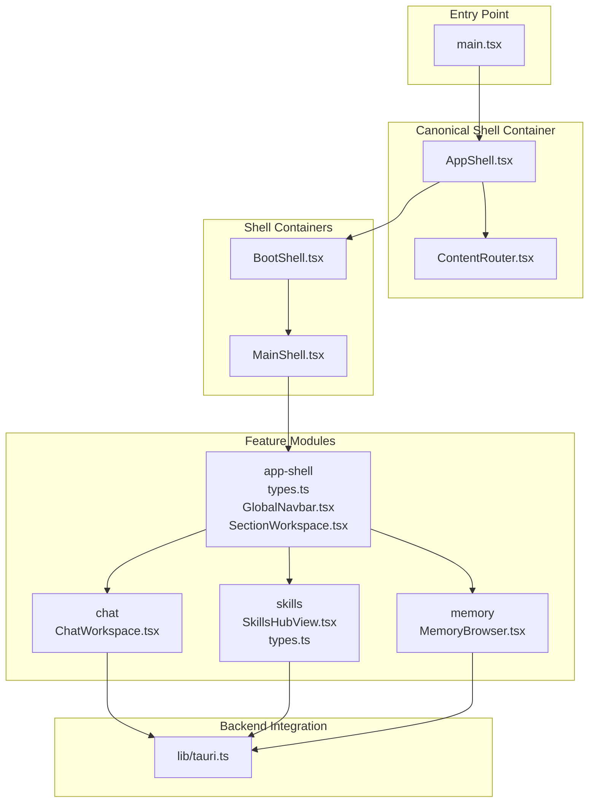
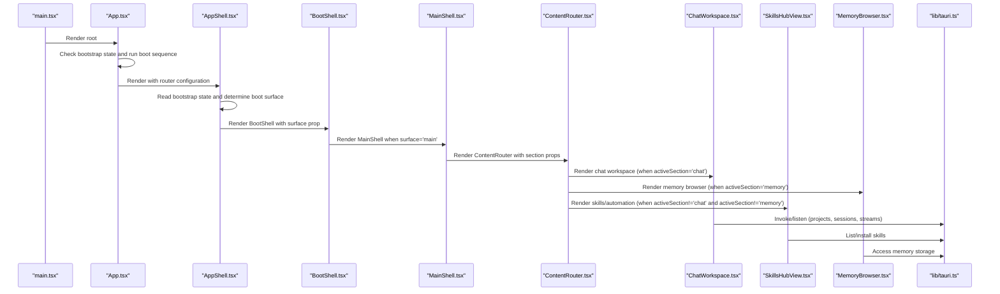
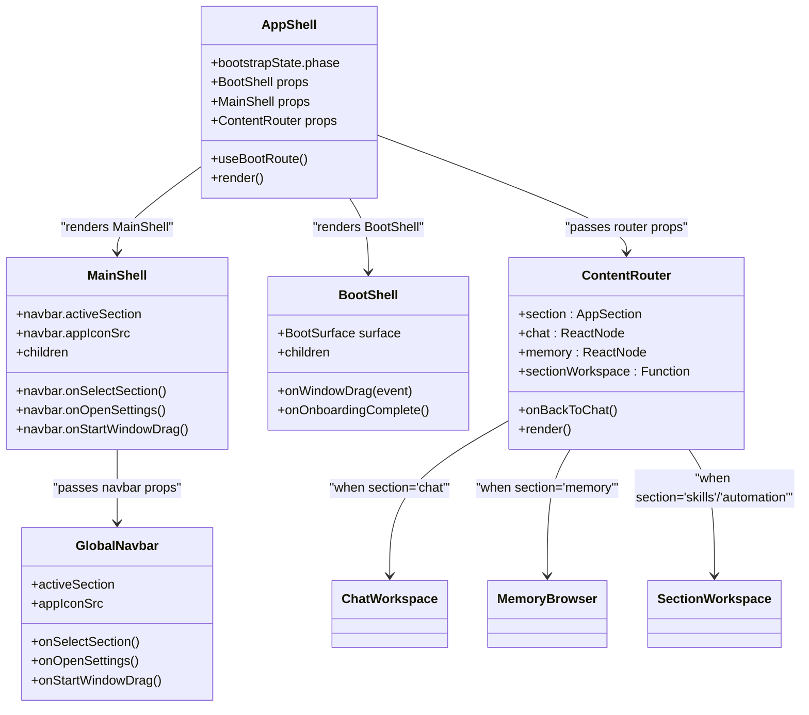
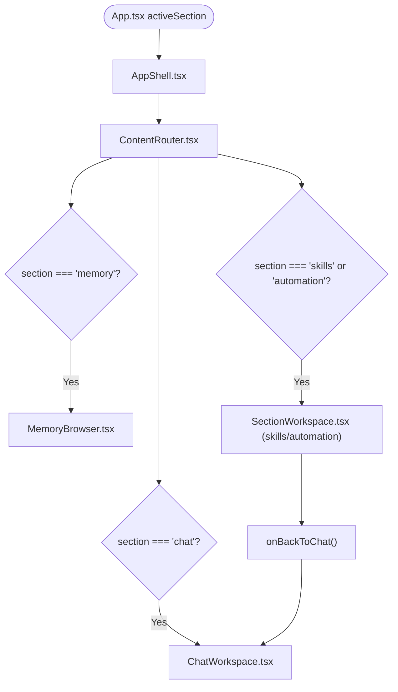
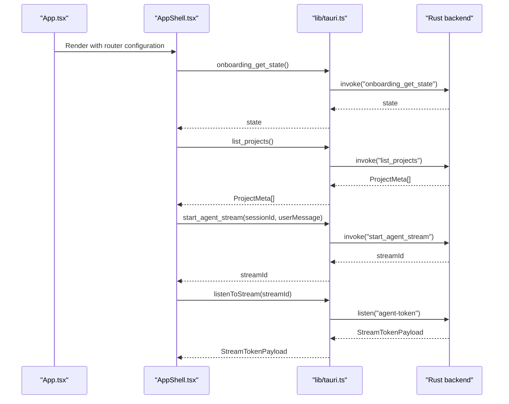
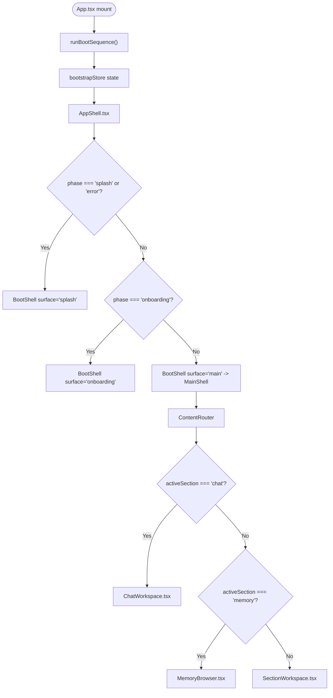
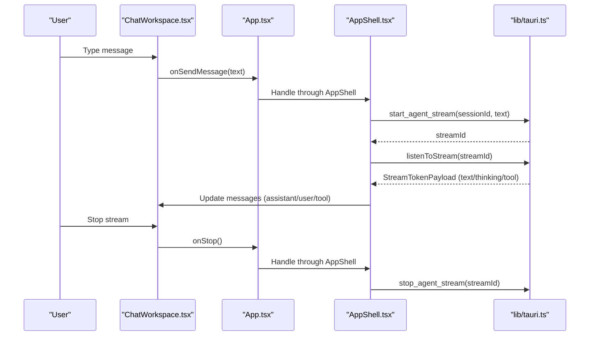
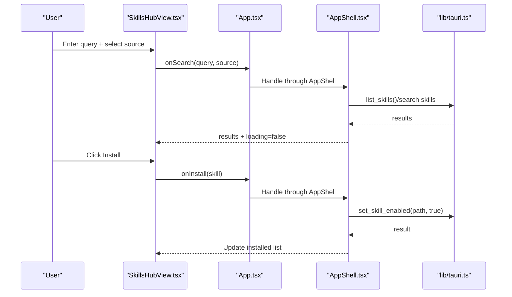
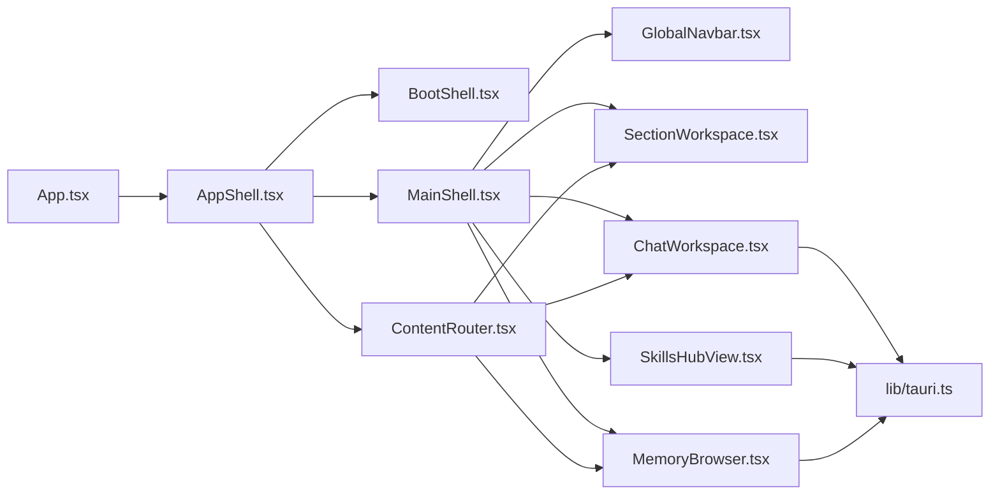

# React Component Architecture

<cite>
**Referenced Files in This Document**
- [App.tsx](file://src/App.tsx)
- [AppShell.tsx](file://src/app/AppShell.tsx)
- [ContentRouter.tsx](file://src/app/ContentRouter.tsx)
- [BootShell.tsx](file://src/boot/BootShell.tsx)
- [MainShell.tsx](file://src/shell/MainShell.tsx)
- [main.tsx](file://src/main.tsx)
- [tauri.ts](file://src/lib/tauri.ts)
- [types.ts](file://src/modules/app-shell/types.ts)
- [ChatWorkspace.tsx](file://src/modules/chat/components/ChatWorkspace.tsx)
- [SkillsHubView.tsx](file://src/modules/skills/SkillsHubView.tsx)
- [types.ts](file://src/modules/skills/types.ts)
- [SectionWorkspace.tsx](file://src/modules/app-shell/components/SectionWorkspace.tsx)
- [GlobalNavbar.tsx](file://src/modules/app-shell/components/GlobalNavbar.tsx)
</cite>

## Update Summary
**Changes Made**
- Updated to reflect new AppShell and ContentRouter components as canonical top-level containers
- Added documentation for the new shell pattern with distinct responsibilities for layout management and route-based content rendering
- Updated component hierarchy to show AppShell replacing the previous single-file approach
- Enhanced documentation for bootstrapping process and shell orchestration patterns

## Table of Contents
1. [Introduction](#introduction)
2. [Project Structure](#project-structure)
3. [Core Components](#core-components)
4. [Architecture Overview](#architecture-overview)
5. [Detailed Component Analysis](#detailed-component-analysis)
6. [Dependency Analysis](#dependency-analysis)
7. [Performance Considerations](#performance-considerations)
8. [Troubleshooting Guide](#troubleshooting-guide)
9. [Conclusion](#conclusion)

## Introduction
This document explains the React component architecture of the application, focusing on the component hierarchy starting from the root entry point, the orchestration between the new AppShell and ContentRouter components, the modular sections (chat, skills, automation, memory), and the integration with Tauri IPC for backend communication. The architecture now features a clean separation between shell containers (BootShell, MainShell) and content routing (ContentRouter), with AppShell serving as the canonical top-level container that coordinates bootstrapping, shell orchestration, and content routing.

## Project Structure
The application follows a layered structure with the new AppShell as the canonical top-level container:
- Entry point initializes the React root and theme providers.
- App component orchestrates bootstrapping, state management, and renders AppShell.
- AppShell serves as the canonical container combining BootShell, MainShell, and ContentRouter.
- BootShell handles splash, onboarding, and activation gating overlays.
- MainShell provides the main application chrome and navigation.
- ContentRouter manages section-based content routing with pure render props.
- Modules encapsulate features (chat, skills, memory) with dedicated components and types.

**Diagram sources**
- [main.tsx:16-43](file://src/main.tsx#L16-L43)
- [AppShell.tsx:58-106](file://src/app/AppShell.tsx#L58-L106)
- [ContentRouter.tsx:42-53](file://src/app/ContentRouter.tsx#L42-L53)
- [BootShell.tsx:52-82](file://src/boot/BootShell.tsx#L52-L82)
- [MainShell.tsx:52-85](file://src/shell/MainShell.tsx#L52-L85)
- [types.ts:1-2](file://src/modules/app-shell/types.ts#L1-L2)
- [GlobalNavbar.tsx:6-99](file://src/modules/app-shell/components/GlobalNavbar.tsx#L6-L99)
- [SectionWorkspace.tsx:5-40](file://src/modules/app-shell/components/SectionWorkspace.tsx#L5-L40)
- [ChatWorkspace.tsx:92-401](file://src/modules/chat/components/ChatWorkspace.tsx#L92-L401)
- [SkillsHubView.tsx:62-425](file://src/modules/skills/SkillsHubView.tsx#L62-L425)
- [tauri.ts:14-80](file://src/lib/tauri.ts#L14-L80)

**Section sources**
- [main.tsx:16-43](file://src/main.tsx#L16-L43)
- [AppShell.tsx:1-107](file://src/app/AppShell.tsx#L1-L107)
- [ContentRouter.tsx:1-54](file://src/app/ContentRouter.tsx#L1-L54)
- [BootShell.tsx:31-82](file://src/boot/BootShell.tsx#L31-L82)
- [MainShell.tsx:29-85](file://src/shell/MainShell.tsx#L29-L85)

## Core Components
- App.tsx: Data-flow host that orchestrates bootstrapping, manages global state (projects, sessions, active selections, permission mode, runtime projection approvals), and renders AppShell with router configuration.
- AppShell.tsx: **New** Canonical top-level container that combines BootShell, MainShell, and ContentRouter. It reads bootstrap state, handles boot routing, and delegates content selection to ContentRouter.
- ContentRouter.tsx: **New** Pure content router that decides which section content to render based on active section, accepting already-constructed render props for each section.
- BootShell.tsx: Minimal boot shell that renders splash, onboarding, or main content and hosts global overlays (toasts and activation gate).
- MainShell.tsx: Minimal main shell that hosts the app chrome, version watermark, execution mode pill, and global navigation.
- Feature modules:
  - App shell types and navigation define the active section and section workspace.
  - Chat workspace composes the left sidebar, header controls, and chat UI.
  - Skills hub provides a searchable, filterable view for discovering and installing skills.
  - Memory browser provides access to memory storage and retrieval.

**Section sources**
- [App.tsx:102-154](file://src/App.tsx#L102-L154)
- [AppShell.tsx:58-106](file://src/app/AppShell.tsx#L58-L106)
- [ContentRouter.tsx:42-53](file://src/app/ContentRouter.tsx#L42-L53)
- [BootShell.tsx:31-82](file://src/boot/BootShell.tsx#L31-L82)
- [MainShell.tsx:29-85](file://src/shell/MainShell.tsx#L29-L85)
- [types.ts:1-2](file://src/modules/app-shell/types.ts#L1-L2)
- [ChatWorkspace.tsx:92-401](file://src/modules/chat/components/ChatWorkspace.tsx#L92-L401)
- [SkillsHubView.tsx:62-425](file://src/modules/skills/SkillsHubView.tsx#L62-L425)

## Architecture Overview
The architecture now features a clean separation of concerns across three distinct layers:
- **Boot Layer**: AppShell orchestrates bootstrapping, reads bootstrap state, and renders appropriate boot surface.
- **Shell Layer**: AppShell composes BootShell and MainShell, managing global chrome and navigation.
- **Content Layer**: ContentRouter handles section-based content routing with pure render props.

**Diagram sources**
- [main.tsx:16-43](file://src/main.tsx#L16-L43)
- [App.tsx:126-154](file://src/App.tsx#L126-L154)
- [AppShell.tsx:66-77](file://src/app/AppShell.tsx#L66-L77)
- [BootShell.tsx:52-82](file://src/boot/BootShell.tsx#L52-L82)
- [MainShell.tsx:52-85](file://src/shell/MainShell.tsx#L52-L85)
- [ContentRouter.tsx:42-53](file://src/app/ContentRouter.tsx#L42-L53)
- [ChatWorkspace.tsx:92-401](file://src/modules/chat/components/ChatWorkspace.tsx#L92-L401)
- [SkillsHubView.tsx:62-425](file://src/modules/skills/SkillsHubView.tsx#L62-L425)
- [tauri.ts:202-321](file://src/lib/tauri.ts#L202-L321)

## Detailed Component Analysis

### AppShell and ContentRouter Orchestration
AppShell serves as the canonical top-level container that:
- Reads bootstrap state from the bootstrap store to determine boot surface.
- Uses useBootRoute hook to add activation-gate layer on top of canonical phase transitions.
- Composes BootShell, MainShell, and ContentRouter into a single cohesive shell.
- Accepts router configuration as render props for each section.
- Manages global overlays and chat section-specific overlays.

ContentRouter is a pure content router that:
- Receives already-constructed render props for each section.
- Makes simple conditional decisions based on active section.
- Maintains separation of concerns by not importing API clients or state.
- Provides a single source of truth for section-to-content mapping.

**Diagram sources**
- [AppShell.tsx:58-106](file://src/app/AppShell.tsx#L58-L106)
- [ContentRouter.tsx:42-53](file://src/app/ContentRouter.tsx#L42-L53)
- [BootShell.tsx:40-82](file://src/boot/BootShell.tsx#L40-L82)
- [MainShell.tsx:36-50](file://src/shell/MainShell.tsx#L36-L50)
- [GlobalNavbar.tsx:6-99](file://src/modules/app-shell/components/GlobalNavbar.tsx#L6-L99)

**Section sources**
- [AppShell.tsx:58-106](file://src/app/AppShell.tsx#L58-L106)
- [ContentRouter.tsx:42-53](file://src/app/ContentRouter.tsx#L42-L53)
- [BootShell.tsx:31-82](file://src/boot/BootShell.tsx#L31-L82)
- [MainShell.tsx:29-85](file://src/shell/MainShell.tsx#L29-L85)
- [GlobalNavbar.tsx:6-99](file://src/modules/app-shell/components/GlobalNavbar.tsx#L6-L99)

### Modular Sections: Chat, Skills, Automation, Memory
The new ContentRouter pattern provides a clean separation of concerns:
- Active section is managed in App.tsx and forwarded to AppShell and MainShell.
- ContentRouter accepts pre-constructed render props for each section.
- ChatWorkspace and MemoryBrowser receive only necessary props for their specific sections.
- SectionWorkspace provides a fallback for skills and automation sections.

**Diagram sources**
- [types.ts:1-2](file://src/modules/app-shell/types.ts#L1-L2)
- [ContentRouter.tsx:42-53](file://src/app/ContentRouter.tsx#L42-L53)
- [SectionWorkspace.tsx:5-40](file://src/modules/app-shell/components/SectionWorkspace.tsx#L5-L40)
- [ChatWorkspace.tsx:92-401](file://src/modules/chat/components/ChatWorkspace.tsx#L92-L401)

**Section sources**
- [types.ts:1-2](file://src/modules/app-shell/types.ts#L1-L2)
- [ContentRouter.tsx:42-53](file://src/app/ContentRouter.tsx#L42-L53)
- [SectionWorkspace.tsx:5-40](file://src/modules/app-shell/components/SectionWorkspace.tsx#L5-L40)
- [GlobalNavbar.tsx:54-79](file://src/modules/app-shell/components/GlobalNavbar.tsx#L54-L79)

### Component Composition Patterns and Prop Drilling
The new architecture significantly reduces prop drilling by:
- App.tsx maintains global state and passes only necessary props down the tree.
- AppShell centralizes shell orchestration and delegates content routing to ContentRouter.
- ContentRouter accepts pre-constructed render props, eliminating the need for inline ternary chains.
- MainShell forwards navigation props to GlobalNavbar and renders children (feature workspaces).
- ChatWorkspace composes ProjectRail, ChatUI, and optional BrowserCard, receiving handlers for all actions.
- SkillsHubView and MemoryBrowser receive only their specific props.

This pattern minimizes prop drilling by centralizing state in App.tsx and passing only necessary props down the tree, with AppShell handling the complex orchestration.

**Section sources**
- [App.tsx:102-154](file://src/App.tsx#L102-L154)
- [AppShell.tsx:58-106](file://src/app/AppShell.tsx#L58-L106)
- [ContentRouter.tsx:18-40](file://src/app/ContentRouter.tsx#L18-L40)
- [MainShell.tsx:52-85](file://src/shell/MainShell.tsx#L52-L85)
- [ChatWorkspace.tsx:92-138](file://src/modules/chat/components/ChatWorkspace.tsx#L92-L138)
- [SkillsHubView.tsx:24-42](file://src/modules/skills/SkillsHubView.tsx#L24-L42)

### Tauri IPC Integration
App.tsx integrates with Tauri via lib/tauri.ts:
- Bootstrapping: onboarding_get_state, ensure_default_workdir, list_projects, list_project_sessions.
- Runtime projection: wireRuntimeProjectionListeners, useRuntimeProjectionSelector.
- Chat and sessions: create_session, get_session, list_project_sessions, rename_session, delete_session, set_session_pinned.
- Streaming: start_agent_stream, listenToStream, listenToAgentTokenStream, stop_agent_stream.
- Permissions: listenToPermissionRequests, respondPermission.
- Settings and windows: open_settings_window, close_settings_window.
- Tools and skills: list_tools, get_tool_definitions, execute_tool, list_skills, set_skill_enabled, execute_slash_command, resolve_skill_slash.

**Diagram sources**
- [App.tsx:126-154](file://src/App.tsx#L126-L154)
- [AppShell.tsx:66-77](file://src/app/AppShell.tsx#L66-L77)
- [tauri.ts:202-321](file://src/lib/tauri.ts#L202-L321)
- [tauri.ts:248-265](file://src/lib/tauri.ts#L248-L265)

**Section sources**
- [tauri.ts:14-80](file://src/lib/tauri.ts#L14-L80)
- [App.tsx:126-154](file://src/App.tsx#L126-L154)
- [AppShell.tsx:66-77](file://src/app/AppShell.tsx#L66-L77)
- [tauri.ts:202-321](file://src/lib/tauri.ts#L202-L321)

### Bootstrapping Process and Onboarding vs. Main Application
The boot process now flows through AppShell:
- App.tsx runs the boot sequence using runBootSequence from boot-orchestrator.
- AppShell reads bootstrap state and determines boot surface using useBootRoute.
- BootShell renders splash, onboarding, or main content depending on the surface prop.
- MainShell renders the navigation and feature workspace through ContentRouter.
- ContentRouter handles section-based content routing with pure render props.

**Diagram sources**
- [App.tsx:126-154](file://src/App.tsx#L126-L154)
- [AppShell.tsx:66-77](file://src/app/AppShell.tsx#L66-L77)
- [BootShell.tsx:52-82](file://src/boot/BootShell.tsx#L52-L82)
- [MainShell.tsx:52-85](file://src/shell/MainShell.tsx#L52-L85)
- [ContentRouter.tsx:42-53](file://src/app/ContentRouter.tsx#L42-L53)

**Section sources**
- [App.tsx:126-154](file://src/App.tsx#L126-L154)
- [AppShell.tsx:66-77](file://src/app/AppShell.tsx#L66-L77)
- [BootShell.tsx:52-82](file://src/boot/BootShell.tsx#L52-L82)

### Chat Workspace Interaction
ChatWorkspace continues to compose:
- Left sidebar (ProjectRail) and resizable divider.
- Header with window drag, session title, and style controls.
- ChatUI for message rendering and input.
- Optional BrowserCard floating overlay when AI browser is active.
- Handlers for project/session selection, new chat/thread, sending messages, stopping streams, and permission mode changes.

**Diagram sources**
- [ChatWorkspace.tsx:92-401](file://src/modules/chat/components/ChatWorkspace.tsx#L92-L401)
- [App.tsx:2400-2408](file://src/App.tsx#L2400-L2408)
- [AppShell.tsx:95-101](file://src/app/AppShell.tsx#L95-L101)
- [tauri.ts:221-265](file://src/lib/tauri.ts#L221-L265)

**Section sources**
- [ChatWorkspace.tsx:92-401](file://src/modules/chat/components/ChatWorkspace.tsx#L92-L401)
- [App.tsx:2400-2408](file://src/App.tsx#L2400-L2408)
- [AppShell.tsx:95-101](file://src/app/AppShell.tsx#L95-L101)
- [tauri.ts:221-265](file://src/lib/tauri.ts#L221-L265)

### Skills and Memory Integration
SkillsHubView and MemoryBrowser provide:
- SkillsHubView: Search bar, source filters, loading/error states, install actions, and detail modal with Tauri integration for listing and enabling skills.
- MemoryBrowser: Access to memory storage, retrieval, and management with project/session context.

**Diagram sources**
- [SkillsHubView.tsx:62-425](file://src/modules/skills/SkillsHubView.tsx#L62-L425)
- [types.ts:79-94](file://src/modules/skills/types.ts#L79-L94)
- [tauri.ts:787-800](file://src/lib/tauri.ts#L787-L800)

**Section sources**
- [SkillsHubView.tsx:62-425](file://src/modules/skills/SkillsHubView.tsx#L62-L425)
- [types.ts:79-94](file://src/modules/skills/types.ts#L79-L94)
- [tauri.ts:787-800](file://src/lib/tauri.ts#L787-L800)

## Dependency Analysis
The new architecture creates clear dependency boundaries:
- App.tsx depends on AppShell for shell orchestration and on lib/tauri.ts for backend integration.
- AppShell depends on BootShell, MainShell, and ContentRouter for shell composition.
- ContentRouter depends only on AppSection types and accepts pre-constructed render props.
- MainShell depends on GlobalNavbar for navigation and on SectionWorkspace for non-chat sections.
- ChatWorkspace depends on ProjectRail, ChatUI, and BrowserCard; it triggers Tauri IPC for session and streaming operations.
- SkillsHubView and MemoryBrowser depend on Tauri for their respective integrations.

**Diagram sources**
- [App.tsx:102-154](file://src/App.tsx#L102-L154)
- [AppShell.tsx:25-31](file://src/app/AppShell.tsx#L25-L31)
- [BootShell.tsx:33-36](file://src/boot/BootShell.tsx#L33-L36)
- [MainShell.tsx:31-33](file://src/shell/MainShell.tsx#L31-L33)
- [GlobalNavbar.tsx:2-4](file://src/modules/app-shell/components/GlobalNavbar.tsx#L2-L4)
- [SectionWorkspace.tsx:3](file://src/modules/app-shell/components/SectionWorkspace.tsx#L3)
- [ChatWorkspace.tsx:14-21](file://src/modules/chat/components/ChatWorkspace.tsx#L14-L21)
- [SkillsHubView.tsx:7-22](file://src/modules/skills/SkillsHubView.tsx#L7-L22)
- [tauri.ts:14-34](file://src/lib/tauri.ts#L14-L34)

**Section sources**
- [App.tsx:102-154](file://src/App.tsx#L102-L154)
- [AppShell.tsx:25-31](file://src/app/AppShell.tsx#L25-L31)
- [BootShell.tsx:33-36](file://src/boot/BootShell.tsx#L33-L36)
- [MainShell.tsx:31-33](file://src/shell/MainShell.tsx#L31-L33)
- [GlobalNavbar.tsx:2-4](file://src/modules/app-shell/components/GlobalNavbar.tsx#L2-L4)
- [SectionWorkspace.tsx:3](file://src/modules/app-shell/components/SectionWorkspace.tsx#L3)
- [ChatWorkspace.tsx:14-21](file://src/modules/chat/components/ChatWorkspace.tsx#L14-L21)
- [SkillsHubView.tsx:7-22](file://src/modules/skills/SkillsHubView.tsx#L7-L22)
- [tauri.ts:14-34](file://src/lib/tauri.ts#L14-L34)

## Performance Considerations
- AppShell and ContentRouter are designed as pure render functions to minimize re-renders.
- ContentRouter accepts pre-constructed render props, avoiding unnecessary recomputation.
- AppShell centralizes boot routing logic, reducing prop drilling and improving performance.
- Minimize re-renders by keeping heavy computations memoized (e.g., derived lists and selectors).
- Use stable callbacks and refs for streaming updates to avoid unnecessary effect reruns.
- Debounce or throttle UI interactions (e.g., resizing, search) to reduce layout thrash.
- Prefer lazy-loading feature workspaces to defer expensive initialization until needed.

## Troubleshooting Guide
- Boot failures: Verify bootstrap store state and runBootSequence execution; ensure default work directory creation succeeds.
- AppShell routing issues: Check bootstrap state transitions and useBootRoute configuration.
- ContentRouter problems: Ensure router props are properly constructed and passed to AppShell.
- Streaming issues: Confirm streamId handling and listener cleanup; check stop_agent_stream invocations.
- Permission prompts: Ensure runtime projection bridge is wired and approvals are cleared after resolution.
- IPC errors: Wrap Tauri calls with try/catch and surface user-friendly errors via toasts.

**Section sources**
- [App.tsx:126-154](file://src/App.tsx#L126-L154)
- [AppShell.tsx:66-77](file://src/app/AppShell.tsx#L66-L77)
- [AppShell.tsx:95-101](file://src/app/AppShell.tsx#L95-L101)
- [ContentRouter.tsx:42-53](file://src/app/ContentRouter.tsx#L42-L53)
- [App.tsx:2421-2492](file://src/App.tsx#L2421-L2492)

## Conclusion
The component architecture now features a clean separation between shell containers and content routing through the new AppShell and ContentRouter pattern. AppShell serves as the canonical top-level container that orchestrates bootstrapping, shell composition, and content routing, while ContentRouter provides a pure, predictable way to handle section-based content selection. This design maintains clear boundaries, reduces prop drilling, and supports future expansion of automation and memory sections while preserving the existing chat and skills functionality. The architecture cleanly separates concerns across boot layer, shell layer, and content layer, making the system more maintainable and extensible.