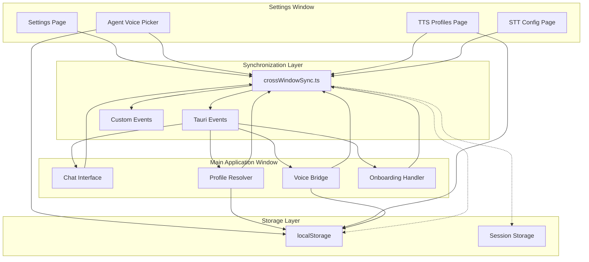
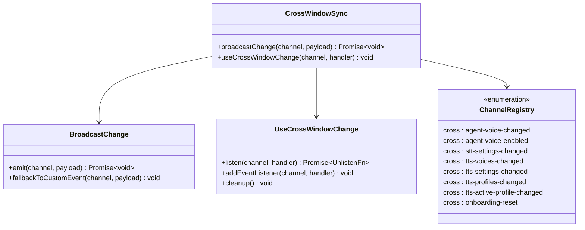
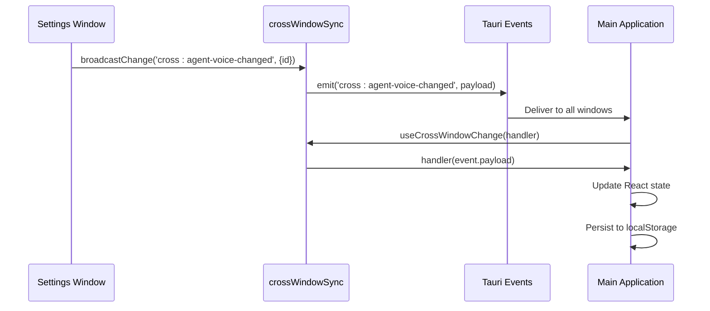
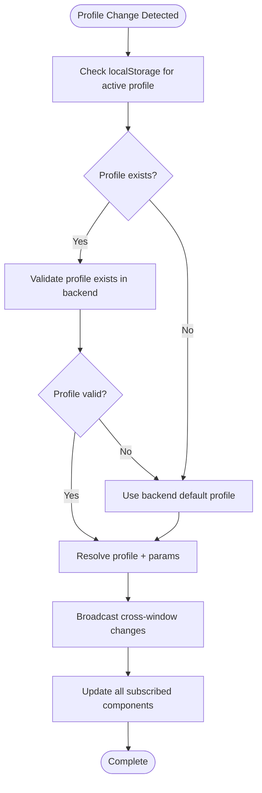
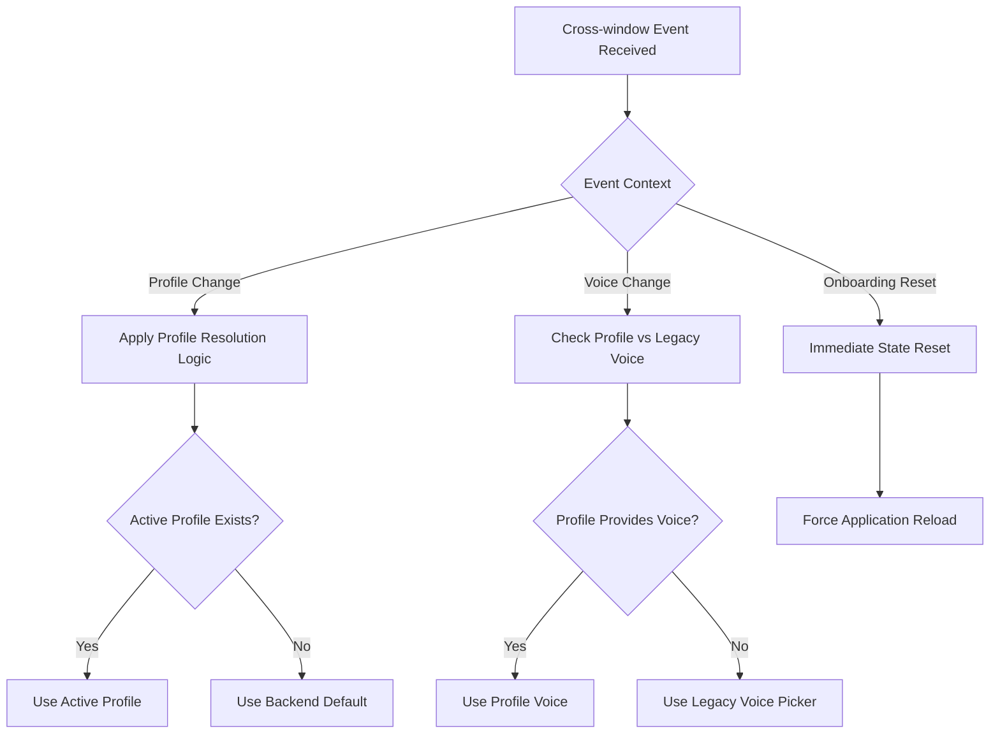
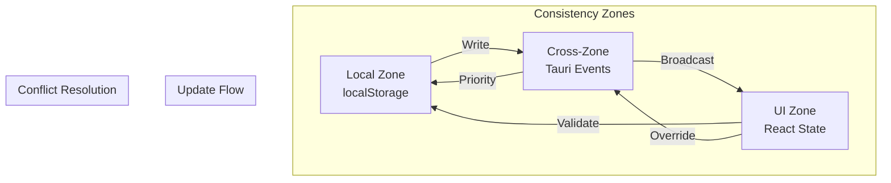
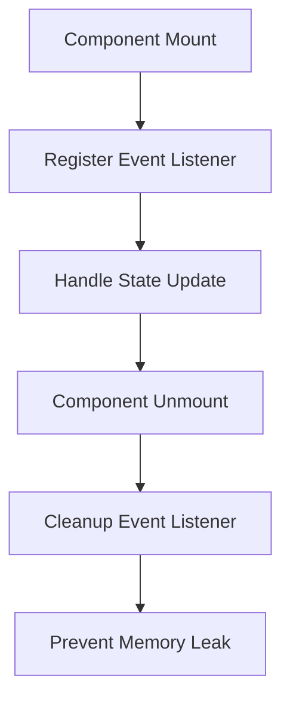
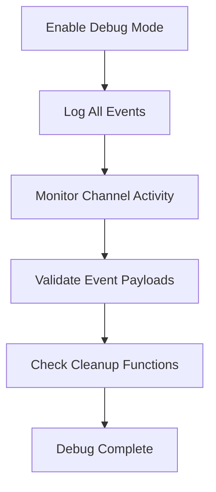

# Cross-Window Synchronization

<cite>
**Referenced Files in This Document**
- [crossWindowSync.ts](file://src/lib/crossWindowSync.ts)
- [activeTtsProfile.ts](file://src/modules/chat/activeTtsProfile.ts)
- [useAgentVoiceBridge.ts](file://src/modules/chat/useAgentVoiceBridge.ts)
- [AgentVoicePicker.tsx](file://src/modules/settings/pages/AgentVoicePicker.tsx)
- [TtsProfilesPage.tsx](file://src/modules/settings/pages/TtsProfilesPage.tsx)
- [SttConfigPage.tsx](file://src/modules/settings/pages/SttConfigPage.tsx)
- [AboutSettingsPage.tsx](file://src/modules/settings/pages/AboutSettingsPage.tsx)
- [App.tsx](file://src/App.tsx)
</cite>

## Table of Contents
1. [Introduction](#introduction)
2. [System Architecture](#system-architecture)
3. [Core Components](#core-components)
4. [Implementation Patterns](#implementation-patterns)
5. [Event Broadcasting Mechanisms](#event-broadcasting-mechanisms)
6. [Conflict Resolution Strategies](#conflict-resolution-strategies)
7. [Data Consistency Guarantees](#data-consistency-guarantees)
8. [Performance Considerations](#performance-considerations)
9. [Usage Examples](#usage-examples)
10. [Troubleshooting Guide](#troubleshooting-guide)
11. [Conclusion](#conclusion)

## Introduction

The cross-window synchronization system in If2Ai enables seamless state sharing across multiple browser windows and tabs, particularly crucial for the application's Settings window architecture. This system addresses the challenge of maintaining consistent state when users interact with settings in a separate Tauri window while the main application continues running in another window.

The system leverages Tauri's native event broadcasting capabilities to ensure that state changes made in one window are immediately reflected in all other windows, providing a cohesive user experience across the entire application ecosystem.

## System Architecture

The cross-window synchronization system is built on three fundamental pillars:



**Diagram sources**
- [crossWindowSync.ts:1-112](file://src/lib/crossWindowSync.ts#L1-L112)
- [AgentVoicePicker.tsx:1-527](file://src/modules/settings/pages/AgentVoicePicker.tsx#L1-L527)
- [useAgentVoiceBridge.ts:1-352](file://src/modules/chat/useAgentVoiceBridge.ts#L1-L352)

The architecture ensures that:

1. **Centralized Event Management**: All cross-window communication flows through the `crossWindowSync.ts` module
2. **Dual Transport Layer**: Uses both Tauri native events and CustomEvents for fallback compatibility
3. **State Persistence**: Maintains localStorage synchronization alongside real-time event broadcasting
4. **Decoupled Components**: Each component can independently subscribe to relevant channels without tight coupling

## Core Components

### CrossWindowSync Module

The heart of the synchronization system is the `crossWindowSync.ts` module, which provides two primary functions:



**Diagram sources**
- [crossWindowSync.ts:37-46](file://src/lib/crossWindowSync.ts#L37-L46)
- [crossWindowSync.ts:53-68](file://src/lib/crossWindowSync.ts#L53-L68)
- [crossWindowSync.ts:79-111](file://src/lib/crossWindowSync.ts#L79-L111)

**Section sources**
- [crossWindowSync.ts:1-112](file://src/lib/crossWindowSync.ts#L1-L112)

### Channel Types and Contracts

The system defines a strict contract for cross-window communication through typed channels:

| Channel Name | Payload Type | Purpose | Trigger Source |
|--------------|--------------|---------|----------------|
| `cross:agent-voice-changed` | `{ id: string \| null }` | Agent voice selection change | Settings window |
| `cross:agent-voice-enabled` | `{ enabled: boolean }` | Voice synthesis toggle | Settings window |
| `cross:stt-settings-changed` | `{ openflow_ready: boolean }` | STT model availability | STT configuration |
| `cross:tts-voices-changed` | `{ id?: string \| null }` | Voice asset modifications | TTS profiles |
| `cross:tts-settings-changed` | `unknown` | General TTS settings update | TTS configuration |
| `cross:tts-profiles-changed` | `{ id?: string \| null }` | Profile list modifications | TTS profiles |
| `cross:tts-active-profile-changed` | `{ id?: string \| null }` | Active profile selection | Profile management |
| `cross:onboarding-reset` | `{}` | Reset onboarding state | About settings |

**Section sources**
- [crossWindowSync.ts:37-46](file://src/lib/crossWindowSync.ts#L37-L46)

## Implementation Patterns

### Pattern 1: Settings-to-Application Synchronization

The most common pattern involves settings changes in the Settings window triggering immediate updates in the main application:



**Diagram sources**
- [AgentVoicePicker.tsx:42-54](file://src/modules/settings/pages/AgentVoicePicker.tsx#L42-L54)
- [useAgentVoiceBridge.ts:124-134](file://src/modules/chat/useAgentVoiceBridge.ts#L124-L134)

### Pattern 2: Profile-Based State Management

The system implements a sophisticated profile resolution mechanism that combines local storage with cross-window synchronization:



**Diagram sources**
- [activeTtsProfile.ts:61-79](file://src/modules/chat/activeTtsProfile.ts#L61-L79)
- [useAgentVoiceBridge.ts:80-98](file://src/modules/chat/useAgentVoiceBridge.ts#L80-L98)

**Section sources**
- [activeTtsProfile.ts:1-80](file://src/modules/chat/activeTtsProfile.ts#L1-L80)
- [useAgentVoiceBridge.ts:1-352](file://src/modules/chat/useAgentVoiceBridge.ts#L1-L352)

## Event Broadcasting Mechanisms

### Primary Transport: Tauri Native Events

The system primarily relies on Tauri's native event broadcasting capabilities, which automatically deliver events to all windows:

```mermaid
graph LR
subgraph "Event Flow"
BC[broadcastChange] --> E[emit(channel, payload)]
E --> TE[Tauri Event System]
TE --> LW[Listening Window]
TE --> MW[Main Window]
TE --> SW[Settings Window]
end
subgraph "Fallback Mechanism"
E --> |Failure| CE[CustomEvent]
CE --> LW
CE --> MW
CE --> SW
end
```

**Diagram sources**
- [crossWindowSync.ts:57-67](file://src/lib/crossWindowSync.ts#L57-L67)

### Fallback Transport: Custom Events

When Tauri runtime is unavailable (e.g., testing environments), the system automatically falls back to browser-native CustomEvents:

**Section sources**
- [crossWindowSync.ts:57-67](file://src/lib/crossWindowSync.ts#L57-L67)

## Conflict Resolution Strategies

### Priority-Based Resolution

The system implements a clear priority hierarchy for resolving conflicts between local state and cross-window events:



**Diagram sources**
- [useAgentVoiceBridge.ts:115-134](file://src/modules/chat/useAgentVoiceBridge.ts#L115-L134)
- [activeTtsProfile.ts:61-79](file://src/modules/chat/activeTtsProfile.ts#L61-L79)

### State Synchronization Guards

The system implements several guards to prevent inconsistent state:

1. **Mount State Tracking**: Ensures cleanup handlers are properly registered and cleaned up
2. **Event Payload Validation**: Validates incoming event payloads before applying changes
3. **Graceful Degradation**: Continues operation even when cross-window communication fails
4. **State Consistency Checks**: Verifies state integrity after cross-window updates

**Section sources**
- [crossWindowSync.ts:83-110](file://src/lib/crossWindowSync.ts#L83-L110)

## Data Consistency Guarantees

### Atomic Updates

The system ensures atomicity through coordinated update sequences:

1. **Local Storage First**: Changes are written to localStorage before cross-window broadcasting
2. **Cross-Window Broadcast**: Events are sent to all windows simultaneously
3. **State Validation**: Components validate received state against local storage
4. **Fallback Recovery**: Automatic recovery if cross-window updates fail

### Consistency Boundaries

The system maintains consistency through well-defined boundaries:



**Diagram sources**
- [activeTtsProfile.ts:33-44](file://src/modules/chat/activeTtsProfile.ts#L33-L44)
- [useAgentVoiceBridge.ts:146-162](file://src/modules/chat/useAgentVoiceBridge.ts#L146-L162)

## Performance Considerations

### Optimized Event Handling

The system implements several performance optimizations:

1. **Efficient Cleanup**: Proper cleanup of event listeners prevents memory leaks
2. **Conditional Updates**: Components only update when necessary
3. **Batched Operations**: Related state changes are batched together
4. **Lazy Initialization**: Event listeners are initialized only when needed

### Memory Management



**Diagram sources**
- [crossWindowSync.ts:103-107](file://src/lib/crossWindowSync.ts#L103-L107)

### Scalability Considerations

The system scales efficiently across multiple windows:

- **Linear Complexity**: Each additional window adds constant overhead
- **Event Deduplication**: Prevents redundant processing of identical events
- **Selective Listening**: Components only listen to relevant channels
- **Resource Pooling**: Shared resources minimize memory footprint

## Usage Examples

### Example 1: Agent Voice Configuration

**Settings Window (Writer)**
```typescript
// Settings window - writes to localStorage and broadcasts changes
setAgentVoiceId(id: string | null): void {
  localStorage.setItem('if2ai.tts.agentVoiceId', id || '')
  broadcastChange('cross:agent-voice-changed', { id })
}
```

**Main Window (Reader)**
```typescript
// Main window - listens for voice changes
useCrossWindowChange('cross:agent-voice-changed', (payload) => {
  const id = payload?.id ?? getAgentVoiceId()
  setVoiceIdState(id)
  voiceIdRef.current = id
})
```

### Example 2: TTS Profile Management

**Profile Creation/Modification**
```typescript
// Settings window - broadcasts profile changes
await broadcastChange('cross:tts-profiles-changed', { id: saved.id })

// Main window - refreshes active profile
useCrossWindowChange('cross:tts-profiles-changed', () => {
  void applyActiveProfile()
})
```

### Example 3: Onboarding Reset

**Settings Window (Trigger)**
```typescript
// About settings page - triggers onboarding reset
void broadcastChange('cross:onboarding-reset', {})
```

**Main Window (Handler)**
```typescript
// Main application - handles reset
useCrossWindowChange('cross:onboarding-reset', () => {
  setShowOnboarding(true)
})
```

**Section sources**
- [AgentVoicePicker.tsx:42-71](file://src/modules/settings/pages/AgentVoicePicker.tsx#L42-L71)
- [TtsProfilesPage.tsx:136-184](file://src/modules/settings/pages/TtsProfilesPage.tsx#L136-L184)
- [AboutSettingsPage.tsx:120-129](file://src/modules/settings/pages/AboutSettingsPage.tsx#L120-L129)
- [App.tsx:96-100](file://src/App.tsx#L96-L100)

## Troubleshooting Guide

### Common Issues and Solutions

#### Issue 1: Events Not Received
**Symptoms**: State changes in Settings window don't appear in main window
**Causes**: 
- Tauri runtime unavailable
- Incorrect channel names
- Missing event listeners

**Solutions**:
1. Verify Tauri event registration
2. Check channel name prefixes (`cross:`)
3. Ensure proper cleanup of event listeners

#### Issue 2: Stale State Values
**Symptoms**: Components show outdated values after cross-window changes
**Causes**:
- Stale closures in React components
- Improper state synchronization

**Solutions**:
1. Use refs for latest values in callbacks
2. Implement proper cleanup in useEffect
3. Validate state against localStorage

#### Issue 3: Memory Leaks
**Symptoms**: Application performance degrades over time
**Causes**:
- Unregistered event listeners
- Missing cleanup functions

**Solutions**:
1. Always return cleanup functions from useEffect
2. Store unlisten functions and call them on unmount
3. Use proper dependency arrays in hooks

### Debugging Tools

The system includes built-in debugging capabilities:



**Section sources**
- [crossWindowSync.ts:92-94](file://src/lib/crossWindowSync.ts#L92-L94)

## Conclusion

The cross-window synchronization system in If2Ai provides a robust, scalable solution for maintaining consistent state across multiple browser windows and tabs. Through its dual-transport architecture, priority-based conflict resolution, and comprehensive error handling, the system ensures reliable state synchronization while maintaining excellent performance characteristics.

Key strengths of the implementation include:

- **Reliable Communication**: Dual transport layer ensures communication resilience
- **Type Safety**: Strict channel typing prevents runtime errors
- **Performance Optimization**: Efficient event handling and memory management
- **Developer Experience**: Clean APIs and comprehensive debugging support
- **Scalability**: Designed to handle multiple windows and complex state hierarchies

The system successfully addresses the unique challenges of multi-window applications, particularly in desktop environments where users expect seamless state synchronization across all application contexts.