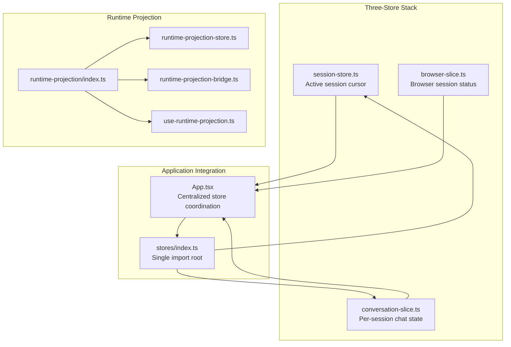
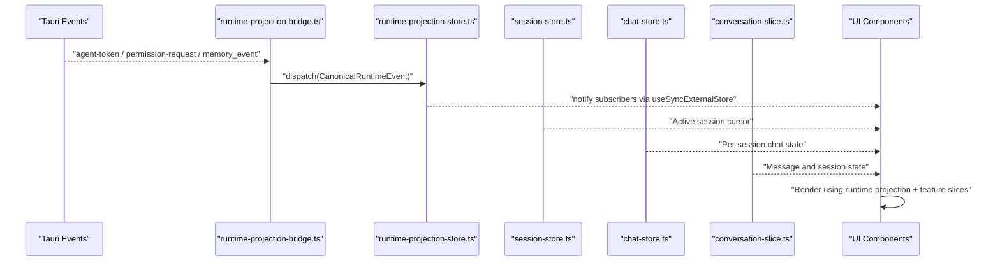
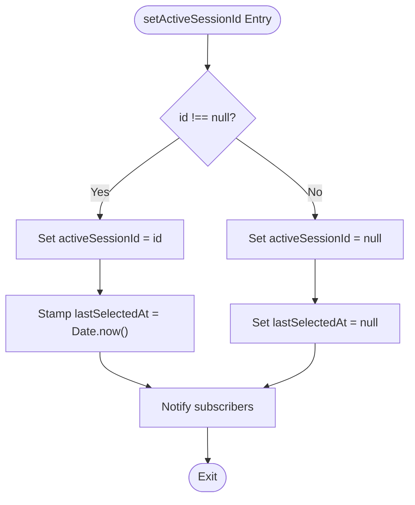
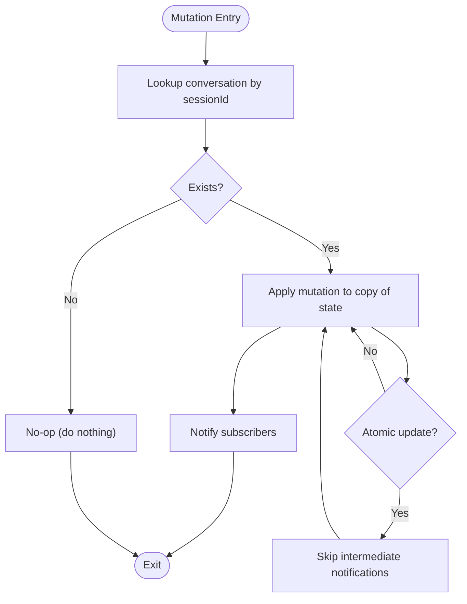
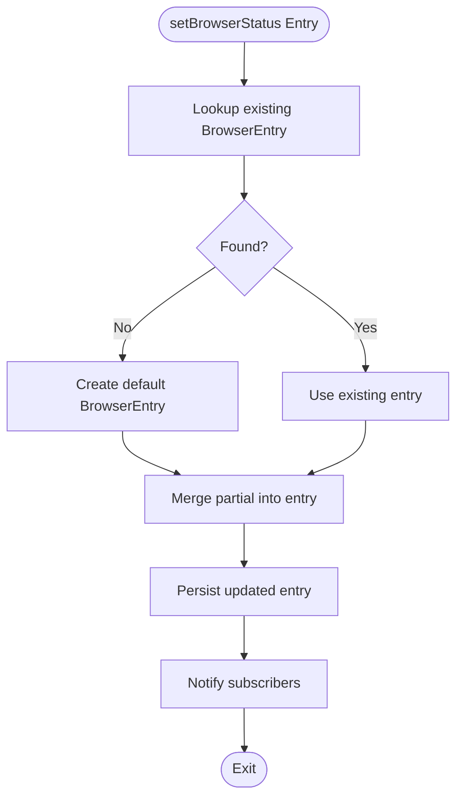
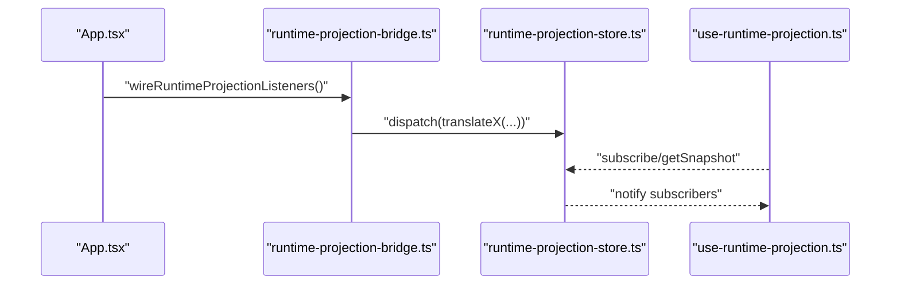
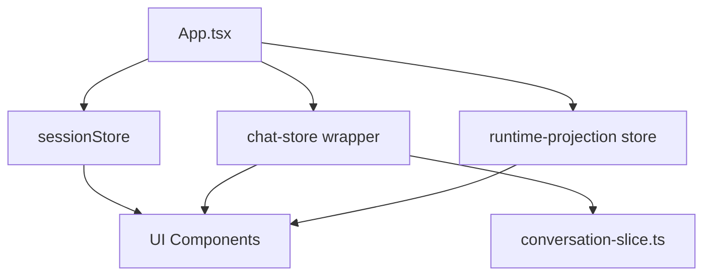
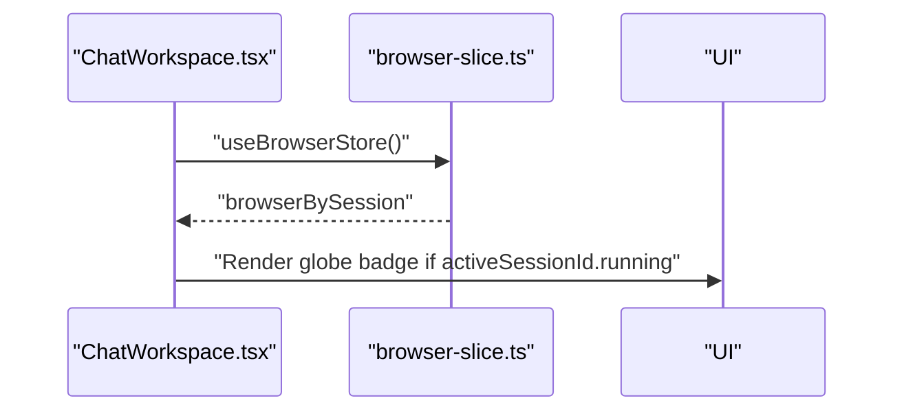
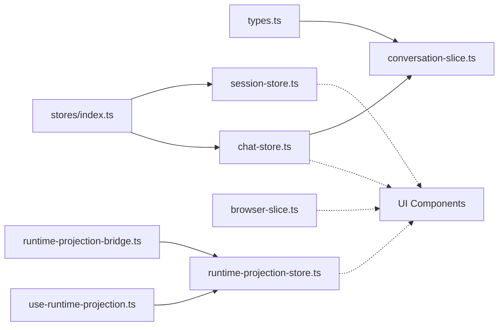

# Feature State Slices

<cite>
**Referenced Files in This Document**
- [conversation-slice.ts](file://src/stores/conversation-slice.ts)
- [browser-slice.ts](file://src/stores/browser-slice.ts)
- [chat-store.ts](file://src/stores/chat-store.ts)
- [session-store.ts](file://src/stores/session-store.ts)
- [types.ts](file://src/modules/chat/types.ts)
- [index.ts](file://src/stores/index.ts)
- [index.ts](file://src/runtime-projection/index.ts)
- [runtime-projection-store.ts](file://src/runtime-projection/runtime-projection-store.ts)
- [runtime-projection-bridge.ts](file://src/runtime-projection/runtime-projection-bridge.ts)
- [use-runtime-projection.ts](file://src/runtime-projection/use-runtime-projection.ts)
- [ChatWorkspace.tsx](file://src/modules/chat/components/ChatWorkspace.tsx)
- [App.tsx](file://src/App.tsx)
</cite>

## Update Summary
**Changes Made**
- Added documentation for the new three-store stack architecture introduced in MIG-014
- Updated conversation slice documentation to include the new setTitleState() function
- Enhanced App.tsx integration documentation to show migration from component-level state to centralized store system
- Added comprehensive coverage of chat-store.ts and session-store.ts as foundational components
- Updated architectural diagrams to reflect the new store hierarchy

## Table of Contents
1. [Introduction](#introduction)
2. [Three-Store Stack Architecture](#three-store-stack-architecture)
3. [Project Structure](#project-structure)
4. [Core Components](#core-components)
5. [Architecture Overview](#architecture-overview)
6. [Detailed Component Analysis](#detailed-component-analysis)
7. [Dependency Analysis](#dependency-analysis)
8. [Performance Considerations](#performance-considerations)
9. [Troubleshooting Guide](#troubleshooting-guide)
10. [Conclusion](#conclusion)
11. [Appendices](#appendices)

## Introduction
This document explains the per-feature UI session state slices that complement the runtime projection system. The architecture has evolved to a three-store stack following MIG-014, which introduces:
- The conversation slice for managing chat session state
- The session store for managing active session cursor
- The browser slice for active browser sessions

It clarifies why these slices are separate from the canonical runtime projection store, outlines their responsibilities, and describes how they interact with the runtime projection system. It also provides usage examples, state update patterns, and the migration trajectory toward eventual consolidation or retirement.

## Three-Store Stack Architecture
The MIG-014 introduced a three-store stack that provides clear separation of concerns:



**Diagram sources**
- [session-store.ts:1-110](file://src/stores/session-store.ts#L1-L110)
- [conversation-slice.ts:1-269](file://src/stores/conversation-slice.ts#L1-L269)
- [browser-slice.ts:1-103](file://src/stores/browser-slice.ts#L1-L103)
- [chat-store.ts:1-112](file://src/stores/chat-store.ts#L1-L112)
- [index.ts:1-11](file://src/stores/index.ts#L1-L11)

**Section sources**
- [session-store.ts:1-110](file://src/stores/session-store.ts#L1-L110)
- [chat-store.ts:1-112](file://src/stores/chat-store.ts#L1-L112)
- [index.ts:1-11](file://src/stores/index.ts#L1-L11)

## Project Structure
The relevant parts of the project are organized by feature and runtime projection concerns:
- Feature state slices: located under src/stores
- Runtime projection pipeline: located under src/runtime-projection
- Feature-specific types: located under src/modules/chat/types
- UI components that consume these slices: under src/modules/chat/components

```mermaid
graph TB
subgraph "Stores"
SS["session-store.ts"]
CS["conversation-slice.ts"]
BS["browser-slice.ts"]
CSFacade["chat-store.ts"]
end
subgraph "Runtime Projection"
RPIndex["runtime-projection/index.ts"]
Store["runtime-projection-store.ts"]
Bridge["runtime-projection-bridge.ts"]
Hook["use-runtime-projection.ts"]
end
subgraph "Chat UI"
CW["ChatWorkspace.tsx"]
Types["types.ts"]
end
subgraph "App"
App["App.tsx"]
Barrel["stores/index.ts"]
end
CW --> BS
App --> Barrel
Barrel --> SS
Barrel --> CSFacade
RPIndex --> Store
RPIndex --> Bridge
RPIndex --> Hook
CSFacade --> CS
CS --> Types
```

**Diagram sources**
- [session-store.ts:1-110](file://src/stores/session-store.ts#L1-L110)
- [conversation-slice.ts:1-269](file://src/stores/conversation-slice.ts#L1-L269)
- [browser-slice.ts:1-103](file://src/stores/browser-slice.ts#L1-L103)
- [chat-store.ts:1-112](file://src/stores/chat-store.ts#L1-L112)
- [index.ts:1-11](file://src/stores/index.ts#L1-L11)
- [index.ts:1-15](file://src/runtime-projection/index.ts#L1-L15)
- [runtime-projection-store.ts:1-134](file://src/runtime-projection/runtime-projection-store.ts#L1-L134)
- [runtime-projection-bridge.ts:1-253](file://src/runtime-projection/runtime-projection-bridge.ts#L1-L253)
- [use-runtime-projection.ts:1-51](file://src/runtime-projection/use-runtime-projection.ts#L1-L51)
- [ChatWorkspace.tsx:1-200](file://src/modules/chat/components/ChatWorkspace.tsx#L1-L200)
- [types.ts:1-147](file://src/modules/chat/types.ts#L1-L147)
- [App.tsx:1-200](file://src/App.tsx#L1-L200)

**Section sources**
- [session-store.ts:1-110](file://src/stores/session-store.ts#L1-L110)
- [conversation-slice.ts:1-269](file://src/stores/conversation-slice.ts#L1-L269)
- [browser-slice.ts:1-103](file://src/stores/browser-slice.ts#L1-L103)
- [chat-store.ts:1-112](file://src/stores/chat-store.ts#L1-L112)
- [index.ts:1-11](file://src/stores/index.ts#L1-L11)
- [index.ts:1-15](file://src/runtime-projection/index.ts#L1-L15)
- [runtime-projection-store.ts:1-134](file://src/runtime-projection/runtime-projection-store.ts#L1-L134)
- [runtime-projection-bridge.ts:1-253](file://src/runtime-projection/runtime-projection-bridge.ts#L1-L253)
- [use-runtime-projection.ts:1-51](file://src/runtime-projection/use-runtime-projection.ts#L1-L51)
- [ChatWorkspace.tsx:1-200](file://src/modules/chat/components/ChatWorkspace.tsx#L1-L200)
- [types.ts:1-147](file://src/modules/chat/types.ts#L1-L147)
- [App.tsx:1-200](file://src/App.tsx#L1-L200)

## Core Components
- **Session Store**: Manages the active session cursor and lightweight per-session metadata that is too granular for the bootstrap store but too cross-cutting for per-component useState.
- **Conversation Slice**: Manages per-session chat state (messages, loading flags, todos, title stages, stream abort handles) and exposes imperative mutation functions suitable for Tauri event handlers.
- **Chat Store Facade**: Provides a single canonical import root for per-session chat runtime state, wrapping the conversation slice with a stable surface for future consumers.
- **Browser Slice**: Tracks per-session browser status (running, URL, thumbnail) and exposes imperative mutation functions for updates and cleanup.
- **Runtime Projection Store**: A global, immutable snapshot store fed by a translator/queue/reducer pipeline and bridged from Tauri events.

Key responsibilities:
- **Session Store**: Canonical active session cursor management with timestamp tracking for recency highlighting.
- **Conversation Slice**: UI-facing, session-scoped chat state; supports message append/update/clear and session lifecycle.
- **Chat Store Facade**: Public re-export surface that preserves React's setState API shape while centralizing state management.
- **Browser Slice**: UI-facing, session-scoped browser status; supports partial updates and cleanup.
- **Runtime Projection Store**: Canonical, normalized runtime state for permissions, memory, execution mode, and run projections; decoupled from UI rendering.

**Section sources**
- [session-store.ts:1-110](file://src/stores/session-store.ts#L1-L110)
- [conversation-slice.ts:1-269](file://src/stores/conversation-slice.ts#L1-L269)
- [chat-store.ts:1-112](file://src/stores/chat-store.ts#L1-L112)
- [browser-slice.ts:1-103](file://src/stores/browser-slice.ts#L1-L103)
- [runtime-projection-store.ts:1-134](file://src/runtime-projection/runtime-projection-store.ts#L1-L134)

## Architecture Overview
The runtime projection system is the canonical source of truth for runtime events. The per-feature UI slices are complementary and UI-focused, with the new three-store stack providing clear separation of concerns.



**Diagram sources**
- [runtime-projection-bridge.ts:1-253](file://src/runtime-projection/runtime-projection-bridge.ts#L1-L253)
- [runtime-projection-store.ts:1-134](file://src/runtime-projection/runtime-projection-store.ts#L1-L134)
- [use-runtime-projection.ts:1-51](file://src/runtime-projection/use-runtime-projection.ts#L1-L51)
- [session-store.ts:1-110](file://src/stores/session-store.ts#L1-L110)
- [chat-store.ts:1-112](file://src/stores/chat-store.ts#L1-L112)
- [conversation-slice.ts:1-269](file://src/stores/conversation-slice.ts#L1-L269)

## Detailed Component Analysis

### Session Store
Responsibilities:
- Manage the active session cursor (currently focused session id)
- Track last selection timestamp for recency highlighting
- Provide imperative mutation functions for session selection and reset

State model:
- activeSessionId: string | null (currently focused session id)
- lastSelectedAt: number | null (timestamp of last explicit selection)

Mutation patterns:
- setActiveSessionId(id: string | null): Set active session and stamp timestamp
- reset(): Hard reset to initial state
- subscribe(listener): React-compatible subscription for UI updates

Usage example (conceptual):
- A project navigation handler calls setActiveSessionId(sessionId) when user selects a session
- A session lifecycle handler calls reset() during onboarding reset



**Diagram sources**
- [session-store.ts:76-84](file://src/stores/session-store.ts#L76-L84)

**Section sources**
- [session-store.ts:1-110](file://src/stores/session-store.ts#L1-L110)

### Conversation Slice
Responsibilities:
- Maintain a full conversation object per session ID
- Track session loading state, session todos, title state, and stream abort handles
- Provide imperative mutation functions callable from anywhere (including Tauri event handlers)
- **Enhanced** with setTitleState() function for atomic title state updates

State model:
- conversations: map of session ID to Conversation
- sessionLoading: map of session ID to boolean
- sessionTodos: map of session ID to TodoItem[]
- sessionTitleStates: map of session ID to SessionTitleState
- streamAbortHandles: map of session ID to handle ID

Mutation patterns:
- Upsert a conversation
- Append/update/remove messages
- Clear messages
- Remove session and all related per-session state
- Toggle loading flag
- Set/clear session todos
- Initialize/set title stage and increment auto-rename count
- **New** setTitleState(): Replace title state wholesale for atomic updates
- Register/clear stream abort handles

**Updated** The setTitleState() function addresses critical state management issues by allowing wholesale replacement of SessionTitleState, enabling both stage and autoRenameCount to be synchronized atomically. This prevents race conditions where separate setTitleStage() and incrementAutoRenameCount() calls would emit multiple notifications and require interleaved reads.

Usage example (conceptual):
- A Tauri agent-token stream handler calls appendMessage(sessionId, message) to add streamed tokens as a new message
- A session lifecycle handler calls removeSession(sessionId) to clean up state when a session ends
- **New** A title synchronization handler calls setTitleState(sessionId, state) to atomically update both stage and autoRenameCount



**Diagram sources**
- [conversation-slice.ts:211-218](file://src/stores/conversation-slice.ts#L211-L218)

**Section sources**
- [conversation-slice.ts:1-269](file://src/stores/conversation-slice.ts#L1-L269)
- [types.ts:76-89](file://src/modules/chat/types.ts#L76-L89)

### Chat Store Facade
Responsibilities:
- Provide a single canonical import root for per-session chat runtime state
- Wrap the conversation slice with a stable surface for future consumers
- Preserve React's setState API shape so existing call sites continue to compile unchanged
- Expose selectors for common read patterns

Key features:
- **Public surface re-export**: Exposes all conversation slice mutations with identical signatures
- **Selector layer**: Provides useChatStore(), useChatSelector(), useConversation(), and useSessionIsLoading()
- **Wrapper functions**: Diff against previous records and dispatch canonical actions
- **Backward compatibility**: Maintains Dispatch<SetStateAction<T>> API shape

Mutation patterns:
- **Wrapper functions**: setConversations(), setSessionLoading(), setSessionTodos(), setSessionTitleStates(), setStreamAbortHandles()
- **Direct exports**: All conversation slice mutations are re-exported verbatim
- **Selectors**: useChatStore(), useChatSelector(), useConversation(), useSessionIsLoading()

**Updated** The chat-store.ts facade deliberately does NOT replace conversation-slice.ts. The slice stays the authoritative implementation; chat-store is the public re-export + a small selector layer on top. This design ensures backward compatibility while providing a stable surface for future consumers.

**Section sources**
- [chat-store.ts:1-112](file://src/stores/chat-store.ts#L1-L112)

### Browser Slice
Responsibilities:
- Track per-session browser status: running flag, current URL, viewport thumbnail
- Provide imperative functions to merge partial updates and clear entries

State model:
- browserBySession: map of session ID to BrowserEntry

Mutation patterns:
- Merge partial updates into a BrowserEntry (creating if missing)
- Clear a session's browser entry

Usage example (conceptual):
- A browser control handler calls setBrowserStatus(sessionId, { running: true, url }) when the browser starts
- A cleanup handler calls clearBrowserSession(sessionId) when the browser stops



**Diagram sources**
- [browser-slice.ts:53-67](file://src/stores/browser-slice.ts#L53-L67)

**Section sources**
- [browser-slice.ts:1-103](file://src/stores/browser-slice.ts#L1-L103)

### Runtime Projection Store and Bridge
Responsibilities:
- Canonical runtime state: runs, approvals, memory rolling projections, activation, execution mode
- Bridge: translates Tauri events into canonical events and dispatches them into the store
- Hooks: expose selectors to subscribe to parts of the snapshot

Key points:
- The store is process-global and immutable; reducers produce new snapshots
- The bridge wires three Tauri event sources and optionally fetches activation and execution-mode decisions
- UI components can subscribe to the full snapshot or use selectors for targeted updates



**Diagram sources**
- [App.tsx:1-200](file://src/App.tsx#L1-L200)
- [runtime-projection-bridge.ts:88-194](file://src/runtime-projection/runtime-projection-bridge.ts#L88-L194)
- [runtime-projection-store.ts:66-125](file://src/runtime-projection/runtime-projection-store.ts#L66-L125)
- [use-runtime-projection.ts:25-50](file://src/runtime-projection/use-runtime-projection.ts#L25-L50)

**Section sources**
- [index.ts:1-15](file://src/runtime-projection/index.ts#L1-L15)
- [runtime-projection-store.ts:1-134](file://src/runtime-projection/runtime-projection-store.ts#L1-L134)
- [runtime-projection-bridge.ts:1-253](file://src/runtime-projection/runtime-projection-bridge.ts#L1-L253)
- [use-runtime-projection.ts:1-51](file://src/runtime-projection/use-runtime-projection.ts#L1-L51)

### UI Integration Example: App.tsx Centralized Store System
The App.tsx demonstrates the migration from component-level state to centralized store system, showcasing how the three-store stack coordinates state management.

Key integration patterns:
- **Active session management**: Uses sessionStore.getSnapshot().activeSessionId and sessionStore.setActiveSessionId()
- **Chat state management**: Uses chatStore wrapper functions that diff against previous records and dispatch canonical actions
- **Permission handling**: Now reads from runtime-projection store approvals rather than local state
- **Store coordination**: Single import root via '@/stores' barrel export

**Updated** The App.tsx integration demonstrates the migration from component-level state to centralized store system. The wrapper functions preserve React's setState API shape while diffing against previous records and dispatching canonical actions. This approach maintains backward compatibility for existing call sites while centralizing state management.



**Diagram sources**
- [App.tsx:257-268](file://src/App.tsx#L257-L268)
- [App.tsx:281-311](file://src/App.tsx#L281-L311)
- [App.tsx:324-345](file://src/App.tsx#L324-L345)
- [App.tsx:360-381](file://src/App.tsx#L360-L381)
- [App.tsx:383-413](file://src/App.tsx#L383-L413)
- [App.tsx:439-463](file://src/App.tsx#L439-L463)

**Section sources**
- [App.tsx:1-200](file://src/App.tsx#L1-L200)
- [App.tsx:257-268](file://src/App.tsx#L257-L268)
- [App.tsx:281-311](file://src/App.tsx#L281-L311)
- [App.tsx:324-345](file://src/App.tsx#L324-L345)
- [App.tsx:360-381](file://src/App.tsx#L360-L381)
- [App.tsx:383-413](file://src/App.tsx#L383-L413)
- [App.tsx:439-463](file://src/App.tsx#L439-L463)

### UI Integration Example: Chat Workspace
The ChatWorkspace consumes the browser slice to reflect browser activity in the UI (e.g., a globe badge in the header when the AI browser is running for the active session).



**Diagram sources**
- [ChatWorkspace.tsx:138-144](file://src/modules/chat/components/ChatWorkspace.tsx#L138-L144)
- [browser-slice.ts:95-102](file://src/stores/browser-slice.ts#L95-L102)

**Section sources**
- [ChatWorkspace.tsx:1-200](file://src/modules/chat/components/ChatWorkspace.tsx#L1-L200)
- [browser-slice.ts:1-103](file://src/stores/browser-slice.ts#L1-L103)

## Dependency Analysis
- The conversation slice depends on chat types for Message and Conversation structures.
- The chat-store facade depends on conversation-slice.ts for the authoritative implementation.
- The session-store is independent of runtime projection types and only depends on React's useSyncExternalStore.
- The browser slice is independent of runtime projection types and only depends on React's useSyncExternalStore.
- The runtime projection pipeline is independent from feature slices; it is the canonical source of truth for runtime events.
- UI components depend on both feature slices (for session state) and runtime projection hooks (for canonical runtime state).



**Diagram sources**
- [types.ts:1-147](file://src/modules/chat/types.ts#L1-L147)
- [conversation-slice.ts:1-269](file://src/stores/conversation-slice.ts#L1-L269)
- [chat-store.ts:1-112](file://src/stores/chat-store.ts#L1-L112)
- [session-store.ts:1-110](file://src/stores/session-store.ts#L1-L110)
- [browser-slice.ts:1-103](file://src/stores/browser-slice.ts#L1-L103)
- [runtime-projection-store.ts:1-134](file://src/runtime-projection/runtime-projection-store.ts#L1-L134)
- [runtime-projection-bridge.ts:1-253](file://src/runtime-projection/runtime-projection-bridge.ts#L1-L253)
- [use-runtime-projection.ts:1-51](file://src/runtime-projection/use-runtime-projection.ts#L1-L51)
- [index.ts:1-11](file://src/stores/index.ts#L1-L11)

**Section sources**
- [types.ts:1-147](file://src/modules/chat/types.ts#L1-L147)
- [conversation-slice.ts:1-269](file://src/stores/conversation-slice.ts#L1-L269)
- [chat-store.ts:1-112](file://src/stores/chat-store.ts#L1-L112)
- [session-store.ts:1-110](file://src/stores/session-store.ts#L1-L110)
- [browser-slice.ts:1-103](file://src/stores/browser-slice.ts#L1-L103)
- [runtime-projection-store.ts:1-134](file://src/runtime-projection/runtime-projection-store.ts#L1-L134)
- [runtime-projection-bridge.ts:1-253](file://src/runtime-projection/runtime-projection-bridge.ts#L1-L253)
- [use-runtime-projection.ts:1-51](file://src/runtime-projection/use-runtime-projection.ts#L1-L51)
- [index.ts:1-11](file://src/stores/index.ts#L1-L11)

## Performance Considerations
- Both feature slices use useSyncExternalStore with internal listener sets; mutations trigger notifications to subscribed components.
- The runtime projection store batches events via a queue and reduces them immutably; this minimizes re-renders and ensures consistent state transitions.
- **New** The chat-store wrapper functions implement efficient diffing against previous records to minimize unnecessary mutations.
- **New** The session-store stamps timestamps on every selection, enabling recency highlighting without re-querying the backend.
- Prefer using selectors (useRuntimeProjectionSelector) to limit re-renders when subscribing to parts of the runtime snapshot.

## Troubleshooting Guide
Common issues and remedies:
- **Conversation updates not reflected in UI**:
  - Ensure the component subscribes to the conversation slice via its hook and that mutations are invoked (e.g., from Tauri event handlers).
  - Confirm that the session ID matches the active session.
  - **New** Verify that setTitleState() is used instead of separate setTitleStage() and incrementAutoRenameCount() calls for atomic updates.
- **Browser status not updating**:
  - Verify setBrowserStatus is called with the correct session ID and that the component reads from useBrowserStore().
- **Runtime projection not updating**:
  - Confirm wireRuntimeProjectionListeners is called and that the bridge receives Tauri events.
  - Check that dispatch is called and that listeners are not being unsubscribed prematurely.
- **Session cursor not updating**:
  - **New** Verify setActiveSessionId() is called and that the component reads from useSessionSelector().
  - Check that the sessionStore singleton is being used consistently across the application.
- **Chat state wrapper functions not working**:
  - **New** Ensure wrapper functions are used instead of direct slice mutations for backward compatibility.
  - Verify that the diffing logic is correctly identifying changes between previous and next values.

**Section sources**
- [conversation-slice.ts:51-61](file://src/stores/conversation-slice.ts#L51-L61)
- [browser-slice.ts:40-46](file://src/stores/browser-slice.ts#L40-L46)
- [runtime-projection-store.ts:74-95](file://src/runtime-projection/runtime-projection-store.ts#L74-L95)
- [runtime-projection-bridge.ts:88-194](file://src/runtime-projection/runtime-projection-bridge.ts#L88-L194)
- [session-store.ts:76-84](file://src/stores/session-store.ts#L76-L84)
- [chat-store.ts:27-45](file://src/stores/chat-store.ts#L27-L45)

## Conclusion
The conversation, session, and browser slices serve UI-focused, session-scoped state complementary to the runtime projection system. The MIG-014 three-store stack provides clear separation of concerns: session-store manages the active session cursor, chat-store facade provides a stable surface for per-session chat state, and browser-slice handles browser-related session state. They remain separate from the canonical runtime store to keep UI concerns encapsulated and to enable imperative updates from Tauri event handlers. Over time, the migration plan aims to progressively consolidate UI consumers onto the runtime projection pipeline, allowing for the eventual retirement or consolidation of these feature slices.

## Appendices

### Migration Trajectory and Consolidation Notes
- The runtime projection bridge currently subscribes broadly to agent-token streams and permission requests, enabling parallel operation with the existing chat UI rendering. Future phases will gradually migrate UI consumers to the projection store, after which per-stream listeners can retire.
- The bridge also fetches activation and execution-mode decisions on demand, aligning UI behavior with canonical runtime state without altering the agent loop routing.
- **New** The three-store stack design follows pack §8 guardrail 1: "store 不能只是把 useState 平移成另一个全局 god store". Each store has non-overlapping responsibilities by design.
- **New** The chat-store facade preserves React's setState API shape while centralizing state management, enabling gradual migration of existing call sites.

**Section sources**
- [runtime-projection-bridge.ts:13-20](file://src/runtime-projection/runtime-projection-bridge.ts#L13-L20)
- [runtime-projection-bridge.ts:172-252](file://src/runtime-projection/runtime-projection-bridge.ts#L172-L252)
- [session-store.ts:13-15](file://src/stores/session-store.ts#L13-L15)
- [chat-store.ts:14-25](file://src/stores/chat-store.ts#L14-L25)