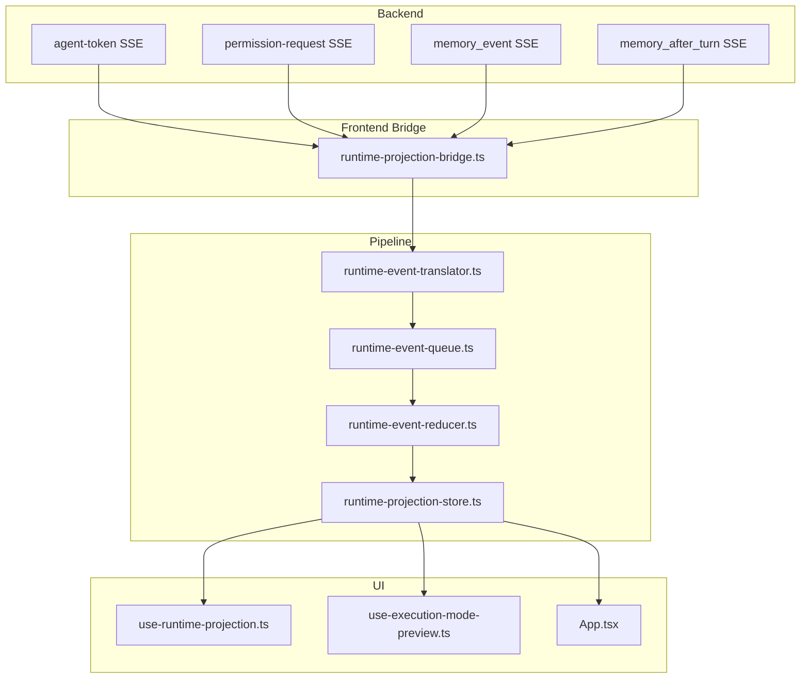
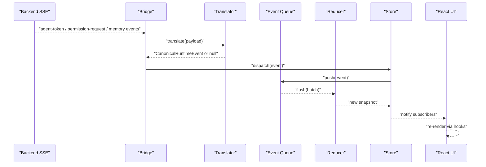
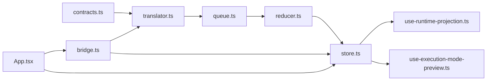

# Runtime Projection System

<cite>
**Referenced Files in This Document**
- [index.ts](file://src/runtime-projection/index.ts)
- [types.ts](file://src/runtime-projection/types.ts)
- [runtime-event-translator.ts](file://src/runtime-projection/runtime-event-translator.ts)
- [runtime-event-queue.ts](file://src/runtime-projection/runtime-event-queue.ts)
- [runtime-event-reducer.ts](file://src/runtime-projection/runtime-event-reducer.ts)
- [runtime-projection-bridge.ts](file://src/runtime-projection/runtime-projection-bridge.ts)
- [runtime-projection-store.ts](file://src/runtime-projection/runtime-projection-store.ts)
- [use-runtime-projection.ts](file://src/runtime-projection/use-runtime-projection.ts)
- [use-execution-mode-preview.ts](file://src/runtime-projection/use-execution-mode-preview.ts)
- [contracts.ts](file://src/transport/contracts.ts)
- [App.tsx](file://src/App.tsx)
</cite>

## Table of Contents
1. [Introduction](#introduction)
2. [Project Structure](#project-structure)
3. [Core Components](#core-components)
4. [Architecture Overview](#architecture-overview)
5. [Detailed Component Analysis](#detailed-component-analysis)
6. [Dependency Analysis](#dependency-analysis)
7. [Performance Considerations](#performance-considerations)
8. [Troubleshooting Guide](#troubleshooting-guide)
9. [Conclusion](#conclusion)

## Introduction
This document describes the runtime projection system that serves as the canonical single source of truth for backend event projections in the frontend. The system transforms backend events into a normalized, immutable UI state through a strict append-only pipeline. It enforces hard rules to prevent double-sourcing of truth, ensures predictable state updates, and provides a clear migration trajectory toward replacing legacy UI rendering paths.

Key goals:
- Maintain a single source of truth for runtime events and UI state
- Normalize heterogeneous backend payloads into a unified event family
- Batch and order events predictably to avoid UI thrashing
- Provide reducers and selectors that are free of side effects and React dependencies
- Support incremental migration from legacy UI rendering to the projection store

## Project Structure
The runtime projection system is organized into a small, cohesive set of modules that form a pipeline:
- Types define the canonical event family and projection state shapes
- Translator converts backend wire payloads into canonical events
- Queue batches events and flushes them efficiently
- Reducer applies events to produce immutable snapshots
- Store manages global snapshot state and subscribers
- Bridge wires real Tauri event sources to the store
- React adapters expose the store to UI components

**Diagram sources**
- [runtime-projection-bridge.ts:88-194](file://src/runtime-projection/runtime-projection-bridge.ts#L88-L194)
- [runtime-event-translator.ts:45-132](file://src/runtime-projection/runtime-event-translator.ts#L45-L132)
- [runtime-event-queue.ts:54-123](file://src/runtime-projection/runtime-event-queue.ts#L54-L123)
- [runtime-event-reducer.ts:40-287](file://src/runtime-projection/runtime-event-reducer.ts#L40-L287)
- [runtime-projection-store.ts:66-133](file://src/runtime-projection/runtime-projection-store.ts#L66-L133)
- [use-runtime-projection.ts:27-50](file://src/runtime-projection/use-runtime-projection.ts#L27-L50)
- [use-execution-mode-preview.ts:48-86](file://src/runtime-projection/use-execution-mode-preview.ts#L48-L86)
- [App.tsx:37-41](file://src/App.tsx#L37-L41)

**Section sources**
- [index.ts:1-15](file://src/runtime-projection/index.ts#L1-L15)
- [types.ts:1-454](file://src/runtime-projection/types.ts#L1-L454)
- [runtime-event-translator.ts:1-277](file://src/runtime-projection/runtime-event-translator.ts#L1-L277)
- [runtime-event-queue.ts:1-124](file://src/runtime-projection/runtime-event-queue.ts#L1-L124)
- [runtime-event-reducer.ts:1-361](file://src/runtime-projection/runtime-event-reducer.ts#L1-L361)
- [runtime-projection-store.ts:1-134](file://src/runtime-projection/runtime-projection-store.ts#L1-L134)
- [runtime-projection-bridge.ts:1-253](file://src/runtime-projection/runtime-projection-bridge.ts#L1-L253)
- [use-runtime-projection.ts:1-51](file://src/runtime-projection/use-runtime-projection.ts#L1-L51)
- [use-execution-mode-preview.ts:1-87](file://src/runtime-projection/use-execution-mode-preview.ts#L1-L87)
- [contracts.ts:1-539](file://src/transport/contracts.ts#L1-L539)
- [App.tsx:1-200](file://src/App.tsx#L1-L200)

## Core Components
- Canonical event types and state shapes: Defines the frontend-facing event family and projection models, preserving semantics from backend payloads while renaming and grouping fields.
- Translator: Converts backend wire payloads into canonical events without side effects or React dependencies.
- Event queue: Batches events via microtasks to avoid UI thrashing while preserving ordering guarantees.
- Reducer: Pure function that applies events to produce immutable snapshots, enforcing hard rules to maintain single source of truth.
- Store: Global, immutable snapshot container with subscribers, designed for useSyncExternalStore.
- Bridge: Subscribes to real Tauri event sources and dispatches translated events into the store.
- React adapters: Hooks that expose the store to UI components with minimal overhead.

**Section sources**
- [types.ts:46-453](file://src/runtime-projection/types.ts#L46-L453)
- [runtime-event-translator.ts:45-276](file://src/runtime-projection/runtime-event-translator.ts#L45-L276)
- [runtime-event-queue.ts:27-123](file://src/runtime-projection/runtime-event-queue.ts#L27-L123)
- [runtime-event-reducer.ts:40-360](file://src/runtime-projection/runtime-event-reducer.ts#L40-L360)
- [runtime-projection-store.ts:32-133](file://src/runtime-projection/runtime-projection-store.ts#L32-L133)
- [runtime-projection-bridge.ts:88-252](file://src/runtime-projection/runtime-projection-bridge.ts#L88-L252)
- [use-runtime-projection.ts:27-50](file://src/runtime-projection/use-runtime-projection.ts#L27-L50)
- [use-execution-mode-preview.ts:48-86](file://src/runtime-projection/use-execution-mode-preview.ts#L48-L86)

## Architecture Overview
The system follows an append-only pattern: backend events are translated into canonical events, queued, and applied to an immutable snapshot via a reducer. The store exposes the snapshot to React components through useSyncExternalStore-compatible hooks.

**Diagram sources**
- [runtime-projection-bridge.ts:117-170](file://src/runtime-projection/runtime-projection-bridge.ts#L117-L170)
- [runtime-event-translator.ts:45-132](file://src/runtime-projection/runtime-event-translator.ts#L45-L132)
- [runtime-event-queue.ts:97-122](file://src/runtime-projection/runtime-event-queue.ts#L97-L122)
- [runtime-event-reducer.ts:289-300](file://src/runtime-projection/runtime-event-reducer.ts#L289-L300)
- [runtime-projection-store.ts:88-95](file://src/runtime-projection/runtime-projection-store.ts#L88-L95)

## Detailed Component Analysis

### Event Types and State Shapes
- CanonicalRuntimeEvent: Discriminated union of all frontend-facing event variants, including stream tokens, thinking deltas, tool-call updates, final text override, completion/error signals, permission prompts/resolutions, memory lifecycle and write decisions, activation snapshots, and execution-mode decisions.
- Projection models: RunProjection, ToolCallProjection, PermissionApprovalProjection, MemoryRollingProjection, ActivationProjection, ExecutionModeProjection, and RuntimeProjectionSnapshot define the immutable state structure.

Hard rules enforced by design:
- Naming and semantics preserved from backend payloads; translator only renames and groups.
- Discriminated unions ensure exhaustive handling of event kinds.
- Immutable snapshots enable shallow equality-based re-renders.

**Section sources**
- [types.ts:46-453](file://src/runtime-projection/types.ts#L46-L453)

### Translator Functions
Responsibilities:
- Convert backend wire payloads into CanonicalRuntimeEvent
- Preserve field semantics; renaming and grouping only
- Return null for unwired or unknown event types to avoid pipeline crashes
- Timestamp events with receivedAt for ordering and diagnostics

Coverage includes:
- Agent token payloads (text_delta, thinking_start/delta, tool_call_update, final_text_override, stream_complete, stream_error)
- Permission requests
- Memory lifecycle events
- Activation snapshots (via fetch seam)
- Memory write decisions (via fetch seam)
- Memory after-turn batch envelope
- Execution-mode decisions (via fetch seam)

**Section sources**
- [runtime-event-translator.ts:45-276](file://src/runtime-projection/runtime-event-translator.ts#L45-L276)
- [contracts.ts:338-377](file://src/transport/contracts.ts#L338-L377)
- [contracts.ts:455-481](file://src/transport/contracts.ts#L455-L481)
- [contracts.ts:483-518](file://src/transport/contracts.ts#L483-L518)

### Event Queue Mechanism
- FIFO buffering with microtask scheduling to batch bursts of events
- Synchronous fallback for tests and dev tools
- Subscriber snapshotting to tolerate handlers that unsubscribe mid-notification
- Pending inspection and reset APIs for hot-reload scenarios

Design notes:
- queueMicrotask ensures bursts of text_delta events are batched without introducing frame latency
- flushMode option enables immediate flushing for deterministic tests

**Section sources**
- [runtime-event-queue.ts:27-123](file://src/runtime-projection/runtime-event-queue.ts#L27-L123)

### Reducer Patterns
Pure transformations keyed by event.kind:
- Stream text/thinking deltas concatenate content and mark streaming
- Tool-call updates last-write-win with defensive merging
- Final text override replaces content deterministically
- Completion/error events set status and outcome, and populate resume info and context budget
- Permission prompts add approvals; resolutions remove them
- Memory events maintain rolling rings with caps
- Execution-mode decisions and manual overrides synthesize coherent UI state

Hard rules:
- No inference or backfilling outside the event payload
- No side effects (localStorage/network/React)
- Same inputs → same outputs

**Section sources**
- [runtime-event-reducer.ts:40-287](file://src/runtime-projection/runtime-event-reducer.ts#L40-L287)

### Store and React Adapters
- Global store with immutable snapshots and shallow equality semantics
- useSyncExternalStore-compatible hooks for efficient re-renders
- Optional selector hook to minimize re-renders by choosing subsets
- Preview hook for on-demand classifier evaluation without routing the agent

Integration:
- App.tsx wires listeners and consumes the store via hooks
- Preview hook debounces classifier calls and forwards correlation hints

**Section sources**
- [runtime-projection-store.ts:32-133](file://src/runtime-projection/runtime-projection-store.ts#L32-L133)
- [use-runtime-projection.ts:27-50](file://src/runtime-projection/use-runtime-projection.ts#L27-L50)
- [use-execution-mode-preview.ts:48-86](file://src/runtime-projection/use-execution-mode-preview.ts#L48-L86)
- [App.tsx:37-41](file://src/App.tsx#L37-L41)

### Bridge Wiring
- Subscribes to real Tauri event sources: agent-token, permission-request, memory_event, memory_after_turn
- Fan-out behavior for memory_after_turn: dispatches batch envelope and per-decision events
- Fetch seams for activation snapshot and execution-mode decisions
- Idempotent wiring with cleanup; logs registration failures without blocking

**Section sources**
- [runtime-projection-bridge.ts:88-194](file://src/runtime-projection/runtime-projection-bridge.ts#L88-L194)
- [runtime-projection-bridge.ts:206-252](file://src/runtime-projection/runtime-projection-bridge.ts#L206-L252)

## Dependency Analysis
The pipeline exhibits low coupling and high cohesion:
- Translator depends only on backend contracts and types
- Queue is transport-agnostic and only knows about CanonicalRuntimeEvent
- Reducer depends solely on types and pure helpers
- Store composes queue and reducer; UI depends only on store APIs
- Bridge is the only frontend code that interacts with Tauri event sources

**Diagram sources**
- [contracts.ts:338-377](file://src/transport/contracts.ts#L338-L377)
- [runtime-event-translator.ts:16-34](file://src/runtime-projection/runtime-event-translator.ts#L16-L34)
- [runtime-event-queue.ts:21-47](file://src/runtime-projection/runtime-event-queue.ts#L21-L47)
- [runtime-event-reducer.ts:20-26](file://src/runtime-projection/runtime-event-reducer.ts#L20-L26)
- [runtime-projection-store.ts:25-28](file://src/runtime-projection/runtime-projection-store.ts#L25-L28)
- [runtime-projection-bridge.ts:51-73](file://src/runtime-projection/runtime-projection-bridge.ts#L51-L73)
- [App.tsx:37-41](file://src/App.tsx#L37-L41)

**Section sources**
- [contracts.ts:1-539](file://src/transport/contracts.ts#L1-L539)
- [runtime-event-translator.ts:1-277](file://src/runtime-projection/runtime-event-translator.ts#L1-L277)
- [runtime-event-queue.ts:1-124](file://src/runtime-projection/runtime-event-queue.ts#L1-L124)
- [runtime-event-reducer.ts:1-361](file://src/runtime-projection/runtime-event-reducer.ts#L1-L361)
- [runtime-projection-store.ts:1-134](file://src/runtime-projection/runtime-projection-store.ts#L1-L134)
- [runtime-projection-bridge.ts:1-253](file://src/runtime-projection/runtime-projection-bridge.ts#L1-L253)
- [App.tsx:1-200](file://src/App.tsx#L1-L200)

## Performance Considerations
- Micro-batch flushing minimizes UI thrashing while preserving event ordering
- Immutable snapshots enable shallow equality re-renders
- Rolling rings are capped to bound memory growth
- Selectors help components avoid unnecessary re-renders
- Debounced classifier previews reduce backend load

## Troubleshooting Guide
Common issues and remedies:
- Events not appearing in UI
  - Verify bridge wiring and that translator returns non-null events
  - Check queue pending() for buffered events
  - Ensure store.getSnapshot() reference changes after dispatch
- UI thrashing or delayed updates
  - Confirm flushMode defaults to microtask; use sync mode for tests
  - Avoid rendering on every event; prefer selectors
- Permission dialogs not clearing
  - Ensure permission_resolved events are dispatched and reducer removes approvals
- Execution-mode preview not updating
  - Confirm useExecutionModePreview options (debounce, min length) and that refreshExecutionModeDecision is called
- Memory after-turn signals missing
  - Bridge fan-out ensures both batch envelope and per-decision events; verify both are handled

**Section sources**
- [runtime-projection-bridge.ts:141-170](file://src/runtime-projection/runtime-projection-bridge.ts#L141-L170)
- [runtime-event-reducer.ts:137-148](file://src/runtime-projection/runtime-event-reducer.ts#L137-L148)
- [use-execution-mode-preview.ts:66-85](file://src/runtime-projection/use-execution-mode-preview.ts#L66-L85)

## Conclusion
The runtime projection system establishes a strict, append-only pipeline that transforms backend events into a single, immutable source of truth for the frontend. By enforcing hard rules—no inference, no side effects, no React dependencies—the system prevents double-sourcing of truth and enables predictable, testable UI updates. The bridge, translator, queue, reducer, and store collectively provide a robust foundation for incremental migration away from legacy rendering paths, while the React adapters offer flexible integration for UI components.