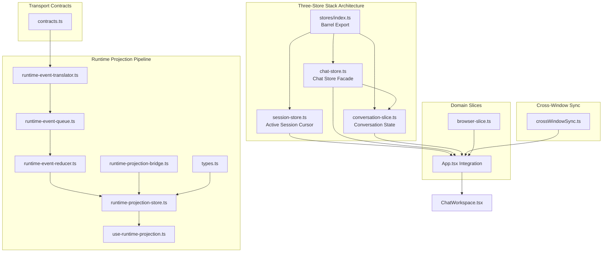
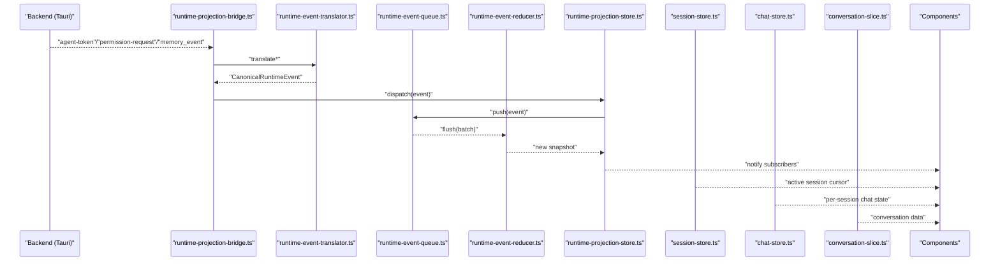
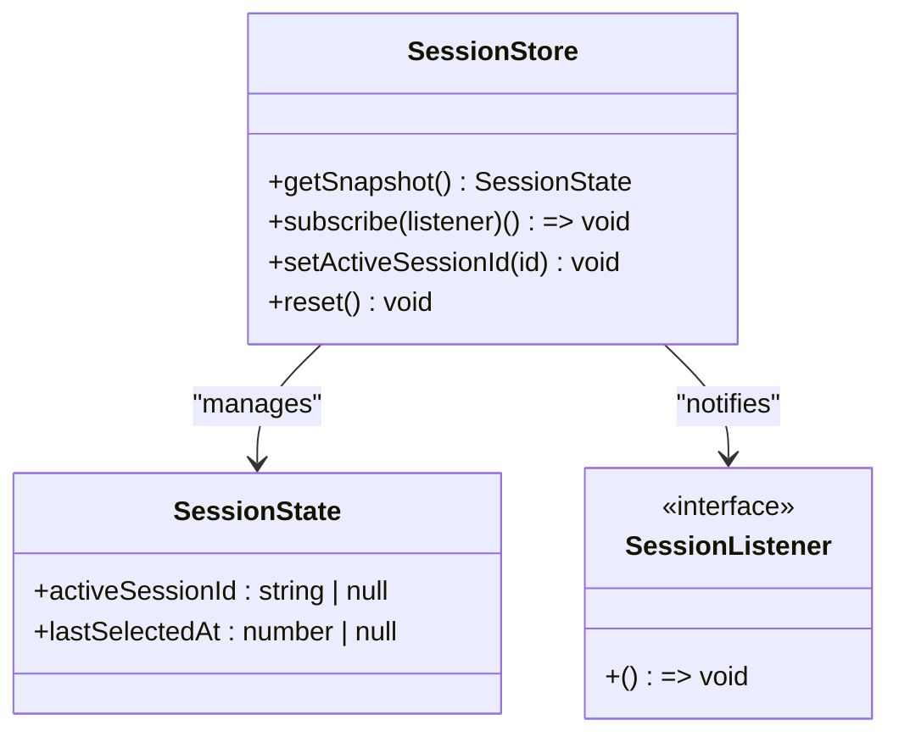
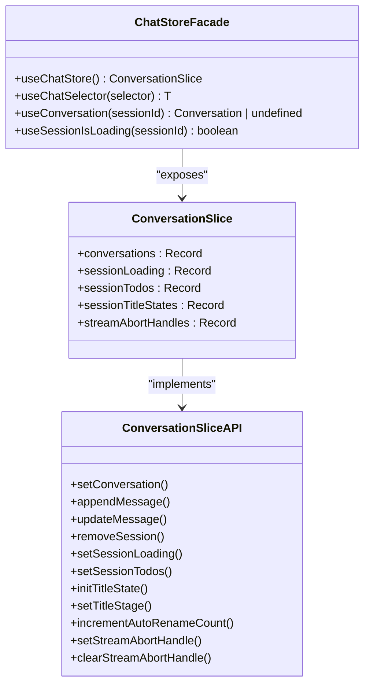
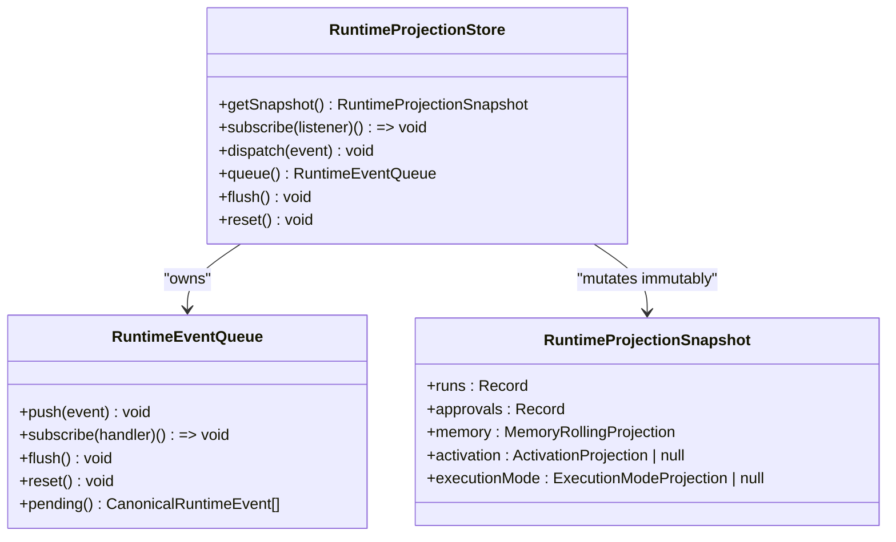
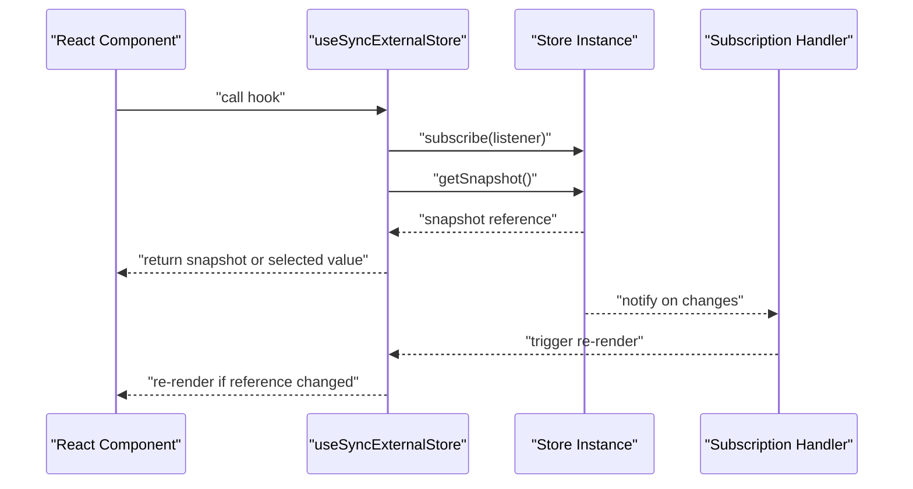
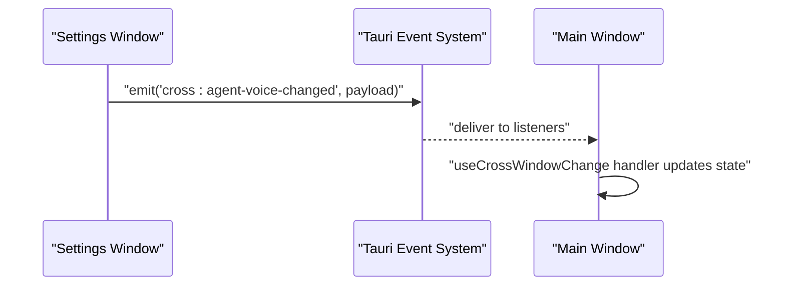
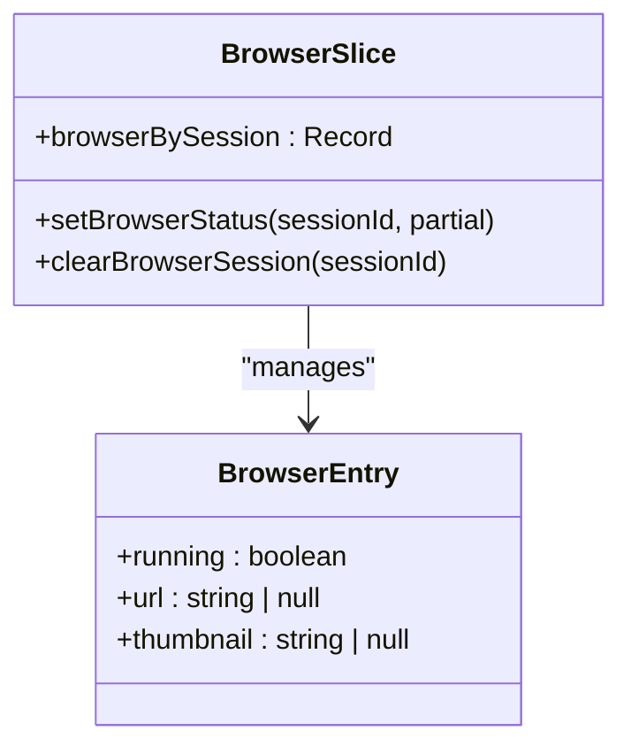
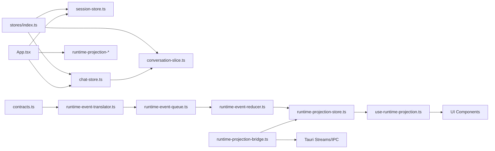

# State Management

<cite>
**Referenced Files in This Document**
- [index.ts](file://src/runtime-projection/index.ts)
- [runtime-projection-store.ts](file://src/runtime-projection/runtime-projection-store.ts)
- [use-runtime-projection.ts](file://src/runtime-projection/use-runtime-projection.ts)
- [runtime-event-translator.ts](file://src/runtime-projection/runtime-event-translator.ts)
- [runtime-event-reducer.ts](file://src/runtime-projection/runtime-event-reducer.ts)
- [types.ts](file://src/runtime-projection/types.ts)
- [runtime-projection-bridge.ts](file://src/runtime-projection/runtime-projection-bridge.ts)
- [runtime-event-queue.ts](file://src/runtime-projection/runtime-event-queue.ts)
- [crossWindowSync.ts](file://src/lib/crossWindowSync.ts)
- [contracts.ts](file://src/transport/contracts.ts)
- [App.tsx](file://src/App.tsx)
- [ChatWorkspace.tsx](file://src/modules/chat/components/ChatWorkspace.tsx)
- [conversation-slice.ts](file://src/stores/conversation-slice.ts)
- [browser-slice.ts](file://src/stores/browser-slice.ts)
- [use-execution-mode-preview.ts](file://src/runtime-projection/use-execution-mode-preview.ts)
- [stores/index.ts](file://src/stores/index.ts)
- [session-store.ts](file://src/stores/session-store.ts)
- [chat-store.ts](file://src/stores/chat-store.ts)
- [session-store.test.ts](file://src/stores/session-store.test.ts)
</cite>

## Update Summary
**Changes Made**
- Added comprehensive documentation for the new three-store stack architecture established by MIG-014
- Documented the centralized store system with session-store.ts, chat-store.ts, and conversation-slice.ts
- Updated architecture diagrams to reflect the new store stack pattern
- Added detailed coverage of the stores/index.ts barrel export system
- Enhanced integration patterns showing how the three-store system works with runtime projection
- Updated dependency analysis to show the new store relationships

## Table of Contents
1. [Introduction](#introduction)
2. [Three-Store Stack Architecture](#three-store-stack-architecture)
3. [Centralized Store System](#centralized-store-system)
4. [Core Components](#core-components)
5. [Architecture Overview](#architecture-overview)
6. [Detailed Component Analysis](#detailed-component-analysis)
7. [Dependency Analysis](#dependency-analysis)
8. [Performance Considerations](#performance-considerations)
9. [Troubleshooting Guide](#troubleshooting-guide)
10. [Conclusion](#conclusion)

## Introduction
This document explains the frontend state management architecture centered on a runtime projection system built with React hooks and a custom store. The system has evolved to a three-store stack architecture established by MIG-014, featuring centralized store management through session-store.ts, chat-store.ts, and conversation-slice.ts. It covers how runtime events from the backend are translated, batched, reduced into immutable snapshots, and subscribed to via React hooks. It also documents cross-window synchronization, selector-based subscriptions, and how the frontend state relates to backend application state.

## Three-Store Stack Architecture
The state management system now operates on a three-store stack architecture designed to eliminate scattered state management and establish clear separation of concerns:

- **Session Store**: Manages the active session cursor and per-session metadata
- **Chat Store**: Facade for per-session chat runtime state with selector layer
- **Conversation Slice**: Module-level singleton for conversation state management
- **Runtime Projection Store**: Global immutable snapshot store for backend events
- **Transport Contracts**: Canonical shapes for backend wire payloads
- **Cross-window Synchronization**: Tauri-based broadcast and listener utilities
- **Browser Slice**: Domain-specific state for browser session management

**Diagram sources**
- [session-store.ts:1-110](file://src/stores/session-store.ts#L1-L110)
- [chat-store.ts:1-112](file://src/stores/chat-store.ts#L1-L112)
- [conversation-slice.ts:1-269](file://src/stores/conversation-slice.ts#L1-L269)
- [stores/index.ts:1-11](file://src/stores/index.ts#L1-L11)
- [runtime-projection-store.ts:1-134](file://src/runtime-projection/runtime-projection-store.ts#L1-L134)
- [use-runtime-projection.ts:1-51](file://src/runtime-projection/use-runtime-projection.ts#L1-L51)
- [runtime-event-translator.ts:1-277](file://src/runtime-projection/runtime-event-translator.ts#L1-L277)
- [runtime-event-queue.ts:1-124](file://src/runtime-projection/runtime-event-queue.ts#L1-L124)
- [runtime-event-reducer.ts:1-361](file://src/runtime-projection/runtime-event-reducer.ts#L1-L361)
- [runtime-projection-bridge.ts:1-253](file://src/runtime-projection/runtime-projection-bridge.ts#L1-L253)
- [types.ts:1-454](file://src/runtime-projection/types.ts#L1-L454)
- [contracts.ts:1-539](file://src/transport/contracts.ts#L1-L539)
- [crossWindowSync.ts:1-112](file://src/lib/crossWindowSync.ts#L1-L112)
- [browser-slice.ts:1-103](file://src/stores/browser-slice.ts#L1-L103)
- [App.tsx:68-79](file://src/App.tsx#L68-L79)

**Section sources**
- [session-store.ts:1-110](file://src/stores/session-store.ts#L1-L110)
- [chat-store.ts:1-112](file://src/stores/chat-store.ts#L1-L112)
- [conversation-slice.ts:1-269](file://src/stores/conversation-slice.ts#L1-L269)
- [stores/index.ts:1-11](file://src/stores/index.ts#L1-L11)
- [App.tsx:68-79](file://src/App.tsx#L68-L79)

## Centralized Store System
The new centralized store system consolidates imports through a barrel export pattern, establishing a single import root for all chat, session, and browser store functionality:

### Stores Barrel Export
The `stores/index.ts` barrel export provides a unified import interface:
- Single import path: `import { useChatStore, sessionStore, ... } from '@/stores'`
- Eliminates scattered imports across the codebase
- Maintains backward compatibility while centralizing store access

### Session Store
Manages the canonical "which session is the user currently looking at?" cursor:
- Immutable session-cursor snapshot with activeSessionId and lastSelectedAt
- Lightweight per-session metadata storage
- Integration with React via useSyncExternalStore pattern
- Production singleton accessible as sessionStore

### Chat Store Facade
Provides a stable surface for per-session chat runtime state:
- Wraps conversation-slice.ts while exposing a stable public interface
- Includes selector layer for fine-grained re-render control
- Maintains separation of concerns between store implementation and public API
- Preserves existing call sites through wrapper functions

### Conversation Slice
Module-level singleton backed by useSyncExternalStore:
- All per-session data management in a single cohesive unit
- Plain mutation functions for non-React usage
- React hooks for component integration
- Structured state with conversations, loading flags, todos, and title states

**Section sources**
- [stores/index.ts:1-11](file://src/stores/index.ts#L1-L11)
- [session-store.ts:1-110](file://src/stores/session-store.ts#L1-L110)
- [chat-store.ts:1-112](file://src/stores/chat-store.ts#L1-L112)
- [conversation-slice.ts:1-269](file://src/stores/conversation-slice.ts#L1-L269)

## Core Components
The state management system now encompasses five distinct store categories:

### Three-Store Stack
- **Session Store**: Active session cursor management with useSyncExternalStore pattern
- **Chat Store**: Facade layer over conversation-slice with selector integration
- **Conversation Slice**: Comprehensive per-session state management with structured mutations

### Runtime Projection System
- Runtime projection store: global immutable snapshot store with queue and reducer
- React adapters: hooks for full snapshot and selector-based subscriptions
- Translator: backend event normalization into canonical events
- Queue: micro-batch event processing for performance optimization
- Reducer: pure function mapping events to immutable snapshots
- Bridge: Tauri event source integration and IPC communication

### Cross-Window Synchronization
- Tauri-based broadcast and listener utilities for multi-window state coordination
- Settings and UI state propagation across separate Tauri windows
- Progressive fallback to CustomEvent when Tauri is unavailable

### Domain-Specific Slices
- Browser slice: AI-controlled browser session state management
- Conversation slice: chat conversation state with message management
- Integration with React via useSyncExternalStore pattern

**Section sources**
- [session-store.ts:1-110](file://src/stores/session-store.ts#L1-L110)
- [chat-store.ts:1-112](file://src/stores/chat-store.ts#L1-L112)
- [conversation-slice.ts:1-269](file://src/stores/conversation-slice.ts#L1-L269)
- [runtime-projection-store.ts:1-134](file://src/runtime-projection/runtime-projection-store.ts#L1-L134)
- [use-runtime-projection.ts:1-51](file://src/runtime-projection/use-runtime-projection.ts#L1-L51)
- [runtime-event-translator.ts:1-277](file://src/runtime-projection/runtime-event-translator.ts#L1-L277)
- [runtime-event-queue.ts:1-124](file://src/runtime-projection/runtime-event-queue.ts#L1-L124)
- [runtime-event-reducer.ts:1-361](file://src/runtime-projection/runtime-event-reducer.ts#L1-L361)
- [runtime-projection-bridge.ts:1-253](file://src/runtime-projection/runtime-projection-bridge.ts#L1-L253)
- [crossWindowSync.ts:1-112](file://src/lib/crossWindowSync.ts#L1-L112)
- [browser-slice.ts:1-103](file://src/stores/browser-slice.ts#L1-L103)

## Architecture Overview
The three-store stack architecture transforms backend events into UI state through a coordinated system of specialized stores:

### Store Responsibilities
- **Session Store**: Owns the active session cursor and per-session metadata
- **Chat Store**: Manages per-session chat runtime state with selector integration
- **Conversation Slice**: Handles comprehensive conversation state with structured mutations
- **Runtime Projection Store**: Processes backend events into immutable UI snapshots

### Integration Flow

**Diagram sources**
- [runtime-projection-bridge.ts:88-194](file://src/runtime-projection/runtime-projection-bridge.ts#L88-L194)
- [runtime-event-translator.ts:45-132](file://src/runtime-projection/runtime-event-translator.ts#L45-L132)
- [runtime-event-queue.ts:54-123](file://src/runtime-projection/runtime-event-queue.ts#L54-L123)
- [runtime-event-reducer.ts:289-300](file://src/runtime-projection/runtime-event-reducer.ts#L289-L300)
- [runtime-projection-store.ts:88-95](file://src/runtime-projection/runtime-projection-store.ts#L88-L95)
- [session-store.ts:68-85](file://src/stores/session-store.ts#L68-L85)
- [chat-store.ts:77-79](file://src/stores/chat-store.ts#L77-L79)
- [conversation-slice.ts:266-268](file://src/stores/conversation-slice.ts#L266-L268)

## Detailed Component Analysis

### Session Store Implementation
The session store manages the active session cursor with immutable state patterns:

**Diagram sources**
- [session-store.ts:24-50](file://src/stores/session-store.ts#L24-L50)
- [session-store.ts:68-85](file://src/stores/session-store.ts#L68-L85)

Key features include:
- Immutable session-cursor snapshots with structural sharing
- Automatic timestamp stamping for session selection
- React integration via useSyncExternalStore pattern
- Testable factory function for isolated store instances
- Production singleton for global state access

**Section sources**
- [session-store.ts:1-110](file://src/stores/session-store.ts#L1-L110)

### Chat Store Facade Pattern
The chat store provides a stable public interface over the conversation slice:

**Diagram sources**
- [chat-store.ts:49-95](file://src/stores/chat-store.ts#L49-L95)
- [conversation-slice.ts:19-31](file://src/stores/conversation-slice.ts#L19-L31)
- [conversation-slice.ts:68-156](file://src/stores/conversation-slice.ts#L68-L156)

The facade pattern provides:
- Stable public surface for future-proofing
- Selector layer for fine-grained re-render control
- Wrapper functions that preserve existing React patterns
- Clear separation between implementation and interface

**Section sources**
- [chat-store.ts:1-112](file://src/stores/chat-store.ts#L1-L112)

### Conversation Slice State Management
The conversation slice manages comprehensive per-session state:

```mermaid
flowchart TD
State["ConversationSlice State"] --> Conv["conversations<br/>Record<string, Conversation>"]
State --> Loading["sessionLoading<br/>Record<string, boolean>"]
State --> Todos["sessionTodos<br/>Record<string, TodoItem[]>"]
State --> Titles["sessionTitleStates<br/>Record<string, SessionTitleState>"]
State --> Abort["streamAbortHandles<br/>Record<string, string>"]
Conv --> Messages["messages<br/>Message[]"]
Conv --> Metadata["updatedAt<br/>Date"]
Mutations["Mutation Functions"] --> SetConv["setConversation()"]
Mutations --> AppendMsg["appendMessage()"]
Mutations --> UpdateMsg["updateMessage()"]
Mutations --> ClearMsg["clearMessages()"]
Mutations --> RemoveSess["removeSession()"]
Mutations --> SetLoading["setSessionLoading()"]
Mutations --> SetTodos["setSessionTodos()"]
Mutations --> InitTitle["initTitleState()"]
Mutations --> SetTitle["setTitleStage()"]
Mutations --> IncAuto["incrementAutoRenameCount()"]
Mutations --> SetAbort["setStreamAbortHandle()"]
Mutations --> ClearAbort["clearStreamAbortHandle()"]
```

**Diagram sources**
- [conversation-slice.ts:19-31](file://src/stores/conversation-slice.ts#L19-L31)
- [conversation-slice.ts:68-156](file://src/stores/conversation-slice.ts#L68-L156)

Key capabilities include:
- Structured state management with immutable updates
- Comprehensive conversation lifecycle management
- Session-specific state isolation
- Efficient mutation patterns with structural sharing
- React integration via useSyncExternalStore

**Section sources**
- [conversation-slice.ts:1-269](file://src/stores/conversation-slice.ts#L1-L269)

### Runtime Projection Store Integration
The runtime projection store maintains global immutable snapshots:

**Diagram sources**
- [runtime-projection-store.ts:32-54](file://src/runtime-projection/runtime-projection-store.ts#L32-L54)
- [runtime-event-queue.ts:27-41](file://src/runtime-projection/runtime-event-queue.ts#L27-L41)
- [types.ts:426-436](file://src/runtime-projection/types.ts#L426-L436)

**Section sources**
- [runtime-projection-store.ts:1-134](file://src/runtime-projection/runtime-projection-store.ts#L1-L134)

### React Adapters and Selector Patterns
Both the runtime projection and store systems provide selector-based subscriptions:

**Diagram sources**
- [use-runtime-projection.ts:25-50](file://src/runtime-projection/use-runtime-projection.ts#L25-L50)
- [runtime-projection-store.ts:98-106](file://src/runtime-projection/runtime-projection-store.ts#L98-L106)
- [session-store.ts:95-109](file://src/stores/session-store.ts#L95-L109)
- [chat-store.ts:77-95](file://src/stores/chat-store.ts#L77-L95)

**Section sources**
- [use-runtime-projection.ts:1-51](file://src/runtime-projection/use-runtime-projection.ts#L1-L51)
- [session-store.ts:91-110](file://src/stores/session-store.ts#L91-L110)
- [chat-store.ts:71-112](file://src/stores/chat-store.ts#L71-L112)

### Cross-Window Synchronization
Multi-window state coordination through Tauri events:

**Diagram sources**
- [crossWindowSync.ts:53-111](file://src/lib/crossWindowSync.ts#L53-L111)

**Section sources**
- [crossWindowSync.ts:1-112](file://src/lib/crossWindowSync.ts#L1-L112)

### Browser Slice Integration
Independent domain-specific state management:

**Diagram sources**
- [browser-slice.ts:16-34](file://src/stores/browser-slice.ts#L16-L34)
- [browser-slice.ts:49-78](file://src/stores/browser-slice.ts#L49-L78)

**Section sources**
- [browser-slice.ts:1-103](file://src/stores/browser-slice.ts#L1-L103)

## Dependency Analysis
The three-store stack architecture creates a well-defined dependency hierarchy:

**Diagram sources**
- [stores/index.ts:6-10](file://src/stores/index.ts#L6-L10)
- [chat-store.ts:29-45](file://src/stores/chat-store.ts#L29-L45)
- [App.tsx:68-79](file://src/App.tsx#L68-L79)
- [contracts.ts:1-539](file://src/transport/contracts.ts#L1-L539)
- [runtime-event-translator.ts:1-277](file://src/runtime-projection/runtime-event-translator.ts#L1-L277)
- [runtime-event-queue.ts:1-124](file://src/runtime-projection/runtime-event-queue.ts#L1-L124)
- [runtime-event-reducer.ts:1-361](file://src/runtime-projection/runtime-event-reducer.ts#L1-L361)
- [runtime-projection-store.ts:1-134](file://src/runtime-projection/runtime-projection-store.ts#L1-L134)
- [runtime-projection-bridge.ts:1-253](file://src/runtime-projection/runtime-projection-bridge.ts#L1-L253)
- [use-runtime-projection.ts:1-51](file://src/runtime-projection/use-runtime-projection.ts#L1-L51)

The dependency analysis reveals:
- **Centralized Import Path**: All stores accessed through single barrel export
- **Store Layering**: Chat store wraps conversation slice, session store provides cursor
- **Runtime Integration**: Runtime projection store operates independently
- **Component Integration**: App.tsx coordinates all three store systems
- **External Dependencies**: Minimal coupling to transport contracts and Tauri

**Section sources**
- [stores/index.ts:1-11](file://src/stores/index.ts#L1-L11)
- [App.tsx:68-79](file://src/App.tsx#L68-L79)

## Performance Considerations
The three-store stack architecture optimizes performance through several mechanisms:

### Store-Level Optimizations
- **Immutable Updates**: All stores use immutable state patterns for efficient React updates
- **Structural Sharing**: Conversation slice employs structural sharing to minimize object creation
- **Selector-Based Subscriptions**: Both runtime and store systems support selector-based subscriptions
- **Micro-batch Processing**: Runtime projection uses micro-batch event processing for burst coalescing

### Integration Benefits
- **Reduced Re-renders**: Three-store system enables fine-grained subscription patterns
- **Efficient State Access**: Centralized store access eliminates redundant state queries
- **Predictable Performance**: Clear separation of concerns prevents performance bottlenecks
- **Test Isolation**: Factory functions enable isolated testing without global state interference

### Memory Management
- **Rolling Rings**: Runtime projection maintains bounded memory for event histories
- **Selective Cleanup**: Conversation slice provides targeted cleanup for session removal
- **Automatic GC**: Immutable patterns enable predictable garbage collection

## Troubleshooting Guide
Common issues and remedies for the three-store stack architecture:

### Store Integration Issues
- **Session Store Not Updating**
  - Verify sessionStore.getSnapshot() returns expected values
  - Check setActiveSessionId() calls and subscription listeners
  - Confirm useSessionSelector() hook receives correct store instance

- **Chat Store State Not Persisting**
  - Validate conversation-slice mutations are properly dispatched
  - Check useChatStore() hook subscription patterns
  - Ensure session-specific state keys match expected session IDs

- **Runtime Projection Events Not Processing**
  - Verify runtime-projection-bridge is properly wired
  - Confirm translator returns non-null for payload types
  - Check queue flush behavior and micro-batch timing

### Integration Problems
- **Store Imports Not Working**
  - Verify stores/index.ts barrel export includes all required exports
  - Check import paths and module resolution configuration
  - Ensure test environment loads proper path aliases

- **Cross-Window State Synchronization Failures**
  - Confirm broadcastChange() calls are properly invoked
  - Verify useCrossWindowChange() listeners are registered
  - Check Tauri availability and fallback to CustomEvent

### Performance Issues
- **Excessive Re-renders**
  - Prefer selector-based subscriptions over full store subscriptions
  - Implement memoization for expensive selector computations
  - Use store-specific hooks for targeted state access

- **Memory Leaks**
  - Ensure subscription cleanup in useEffect return functions
  - Validate store reset procedures in test environments
  - Monitor conversation slice cleanup for removed sessions

**Section sources**
- [session-store.ts:76-85](file://src/stores/session-store.ts#L76-L85)
- [chat-store.ts:77-95](file://src/stores/chat-store.ts#L77-L95)
- [runtime-projection-bridge.ts:180-194](file://src/runtime-projection/runtime-projection-bridge.ts#L180-L194)
- [crossWindowSync.ts:79-111](file://src/lib/crossWindowSync.ts#L79-L111)

## Conclusion
The three-store stack architecture established by MIG-014 provides a robust, scalable foundation for frontend state management:

### Key Achievements
- **Centralized Store System**: Single import root through stores/index.ts eliminates scattered state management
- **Clear Separation of Concerns**: Session, chat, and conversation stores each handle distinct responsibilities
- **Future-Proof Design**: Facade pattern in chat-store enables evolution without breaking changes
- **Performance Optimization**: Immutable patterns and selector-based subscriptions minimize re-renders
- **Integration Flexibility**: Runtime projection store operates independently while coordinating with store system

### Architectural Benefits
- **Maintainable Codebase**: Well-defined store boundaries prevent state management complexity
- **Testable Components**: Factory functions and selector patterns enable comprehensive testing
- **Scalable Foundation**: Three-store system supports complex chat UI and agent orchestration
- **Type Safety**: Strong typing throughout the store system prevents runtime errors
- **Developer Experience**: Centralized imports and clear patterns improve development workflow

The three-store stack architecture successfully transforms scattered state management into a centralized, maintainable system while preserving the reactive event-driven approach essential for real-time chat applications. This foundation supports both current chat functionality and future enhancements planned for the application ecosystem.