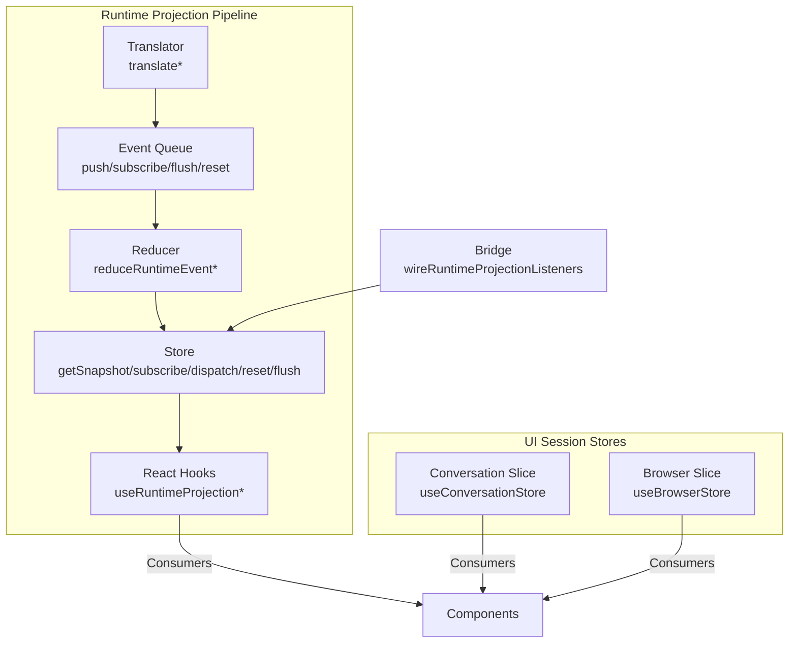
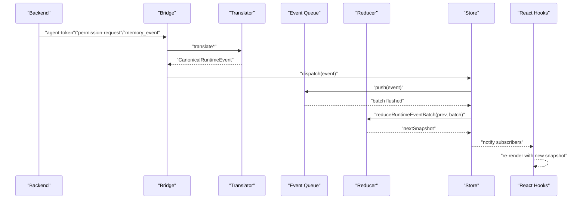
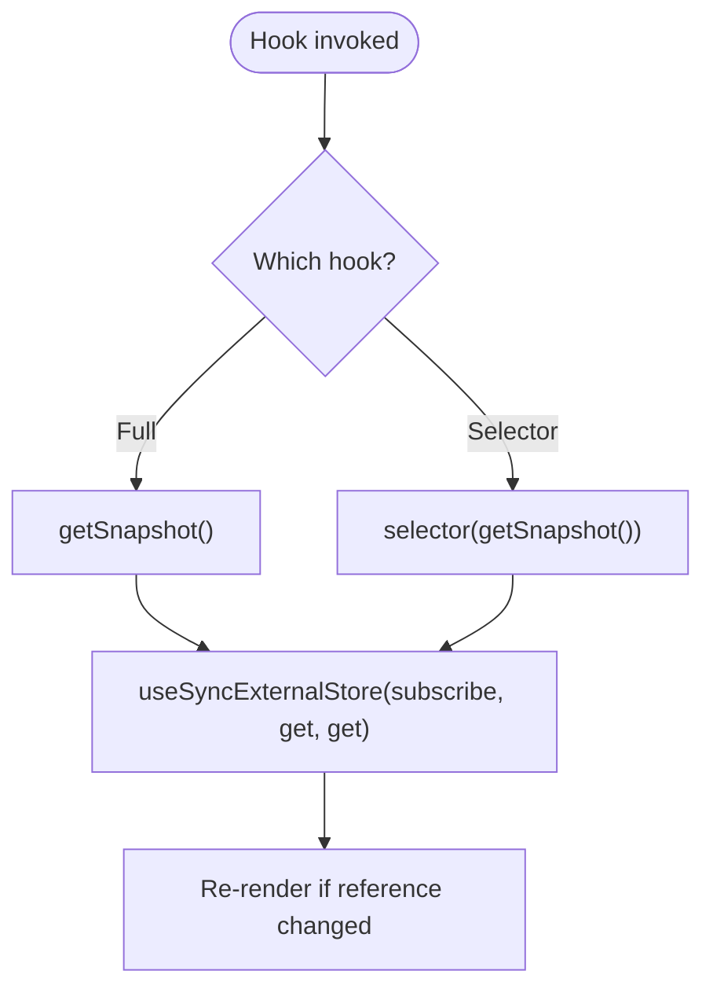
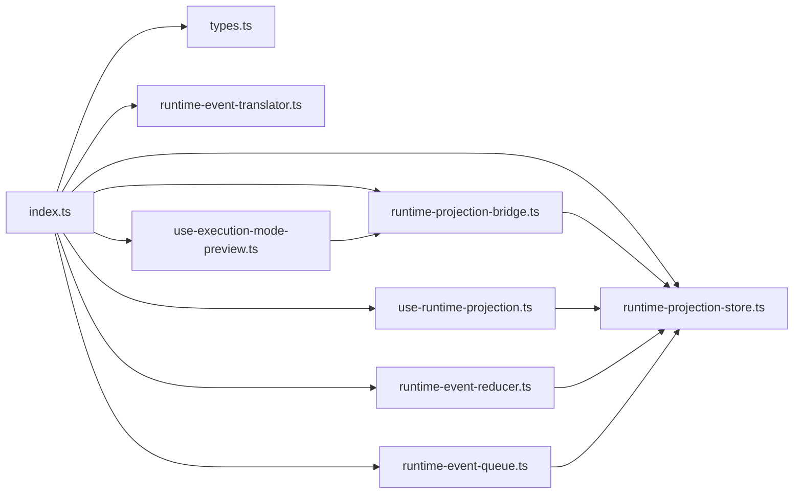

# State Utilities and Helpers

<cite>
**Referenced Files in This Document**
- [index.ts](file://src/runtime-projection/index.ts)
- [use-runtime-projection.ts](file://src/runtime-projection/use-runtime-projection.ts)
- [runtime-projection-store.ts](file://src/runtime-projection/runtime-projection-store.ts)
- [types.ts](file://src/runtime-projection/types.ts)
- [runtime-event-queue.ts](file://src/runtime-projection/runtime-event-queue.ts)
- [runtime-event-reducer.ts](file://src/runtime-projection/runtime-event-reducer.ts)
- [runtime-event-translator.ts](file://src/runtime-projection/runtime-event-translator.ts)
- [runtime-projection-bridge.ts](file://src/runtime-projection/runtime-projection-bridge.ts)
- [use-execution-mode-preview.ts](file://src/runtime-projection/use-execution-mode-preview.ts)
- [conversation-slice.ts](file://src/stores/conversation-slice.ts)
- [browser-slice.ts](file://src/stores/browser-slice.ts)
- [README.md](file://src/stores/README.md)
- [App.tsx](file://src/App.tsx)
</cite>

## Table of Contents
1. [Introduction](#introduction)
2. [Project Structure](#project-structure)
3. [Core Components](#core-components)
4. [Architecture Overview](#architecture-overview)
5. [Detailed Component Analysis](#detailed-component-analysis)
6. [Dependency Analysis](#dependency-analysis)
7. [Performance Considerations](#performance-considerations)
8. [Troubleshooting Guide](#troubleshooting-guide)
9. [Conclusion](#conclusion)

## Introduction
This document explains the state management utilities and helper patterns used across the runtime projection system and complementary UI session stores. It focuses on:
- Custom React hooks for consuming runtime projections
- Utility functions for state manipulation and event translation
- Patterns for state access, updates, selectors, and derivations
- Performance optimization techniques and common pitfalls

The system is split into two layers:
- A canonical runtime projection store for backend-driven state
- Per-feature UI session stores for UI-centric session state

## Project Structure
The state management spans a runtime projection pipeline and several small, focused stores:
- Runtime projection pipeline: translator → queue → reducer → store → React hooks
- UI session stores: conversation and browser slices

**Diagram sources**
- [runtime-event-translator.ts:1-277](file://src/runtime-projection/runtime-event-translator.ts#L1-L277)
- [runtime-event-queue.ts:1-124](file://src/runtime-projection/runtime-event-queue.ts#L1-L124)
- [runtime-event-reducer.ts:1-361](file://src/runtime-projection/runtime-event-reducer.ts#L1-L361)
- [runtime-projection-store.ts:1-134](file://src/runtime-projection/runtime-projection-store.ts#L1-L134)
- [use-runtime-projection.ts:1-51](file://src/runtime-projection/use-runtime-projection.ts#L1-L51)
- [runtime-projection-bridge.ts:1-253](file://src/runtime-projection/runtime-projection-bridge.ts#L1-L253)
- [conversation-slice.ts:1-248](file://src/stores/conversation-slice.ts#L1-L248)
- [browser-slice.ts:1-103](file://src/stores/browser-slice.ts#L1-L103)

**Section sources**
- [README.md:1-70](file://src/stores/README.md#L1-L70)

## Core Components
- Runtime projection types and shapes define the canonical event and snapshot contracts.
- The translator normalizes backend payloads into canonical events.
- The queue batches and schedules event delivery.
- The reducer produces immutable snapshots from event batches.
- The store exposes a global, React-compatible subscription surface.
- React hooks provide ergonomic consumption of the store.
- The bridge wires real Tauri event sources into the pipeline.
- Preview hooks trigger classifier decisions without altering the agent loop.
- UI session stores manage UI-centric session state separate from the projection.

Key exports and entry points:
- Pipeline barrel: re-exports types, translator, queue, reducer, store, and hooks.
- Store creation and singleton export.
- Hook definitions for full snapshot and selector-based subscriptions.
- Bridge wiring and helper functions for classifier decisions.

**Section sources**
- [index.ts:1-15](file://src/runtime-projection/index.ts#L1-L15)
- [types.ts:1-454](file://src/runtime-projection/types.ts#L1-L454)
- [runtime-event-translator.ts:1-277](file://src/runtime-projection/runtime-event-translator.ts#L1-L277)
- [runtime-event-queue.ts:1-124](file://src/runtime-projection/runtime-event-queue.ts#L1-L124)
- [runtime-event-reducer.ts:1-361](file://src/runtime-projection/runtime-event-reducer.ts#L1-L361)
- [runtime-projection-store.ts:1-134](file://src/runtime-projection/runtime-projection-store.ts#L1-L134)
- [use-runtime-projection.ts:1-51](file://src/runtime-projection/use-runtime-projection.ts#L1-L51)
- [runtime-projection-bridge.ts:1-253](file://src/runtime-projection/runtime-projection-bridge.ts#L1-L253)
- [use-execution-mode-preview.ts:1-87](file://src/runtime-projection/use-execution-mode-preview.ts#L1-L87)

## Architecture Overview
The runtime projection pipeline enforces a strict separation of concerns:
- Translation: normalize backend payloads into canonical events.
- Batching: collect events efficiently and flush in micro-batches.
- Derivation: compute immutable snapshots from ordered events.
- Subscription: expose a stable snapshot and notify subscribers.
- Consumption: React hooks subscribe and re-render only when the snapshot changes.

**Diagram sources**
- [runtime-projection-bridge.ts:88-194](file://src/runtime-projection/runtime-projection-bridge.ts#L88-L194)
- [runtime-event-translator.ts:45-132](file://src/runtime-projection/runtime-event-translator.ts#L45-L132)
- [runtime-event-queue.ts:97-122](file://src/runtime-projection/runtime-event-queue.ts#L97-L122)
- [runtime-event-reducer.ts:289-300](file://src/runtime-projection/runtime-event-reducer.ts#L289-L300)
- [runtime-projection-store.ts:88-95](file://src/runtime-projection/runtime-projection-store.ts#L88-L95)
- [use-runtime-projection.ts:27-50](file://src/runtime-projection/use-runtime-projection.ts#L27-L50)

## Detailed Component Analysis

### Runtime Projection Hooks
Two React adapters wrap the store for consumption:
- Full snapshot subscription: returns the entire snapshot.
- Selector subscription: returns a derived value and only re-renders when the selector result changes.

Patterns:
- Use selector hooks for targeted reads to minimize re-renders.
- Keep selectors pure and efficient; expensive computations should be memoized upstream.

**Diagram sources**
- [use-runtime-projection.ts:27-50](file://src/runtime-projection/use-runtime-projection.ts#L27-L50)

**Section sources**
- [use-runtime-projection.ts:1-51](file://src/runtime-projection/use-runtime-projection.ts#L1-L51)

### Runtime Projection Store
Responsibilities:
- Owns the current immutable snapshot.
- Subscribes listeners and notifies them on snapshot changes.
- Dispatches canonical events into the internal queue.
- Exposes a borrowable queue for advanced wiring and a flush/reset API.

Design notes:
- Immutable snapshots enable shallow equality checks for efficient re-renders.
- Listeners are snapshotted during notifications to avoid skipping siblings when unsubscribing mid-notification.

**Section sources**
- [runtime-projection-store.ts:32-125](file://src/runtime-projection/runtime-projection-store.ts#L32-L125)

### Event Queue
Responsibilities:
- Buffer events and flush them in micro-batches.
- Support synchronous mode for tests and dev tools.
- Provide subscription to flushed batches.

Design notes:
- Micro-task scheduling batches bursts without adding latency.
- Pending events can be inspected for diagnostics.

**Section sources**
- [runtime-event-queue.ts:27-122](file://src/runtime-projection/runtime-event-queue.ts#L27-L122)

### Event Reducer
Responsibilities:
- Pure function mapping previous snapshot and event to a new snapshot.
- Maintains immutable structures and bounded rolling rings for memory events and decisions.
- Derives run completion status from task outcomes.

Patterns:
- Use a mergeRun helper to update run-level state and chain additional transformations.
- Keep reducer pure and free of side effects.

**Section sources**
- [runtime-event-reducer.ts:40-287](file://src/runtime-projection/runtime-event-reducer.ts#L40-L287)

### Event Translator
Responsibilities:
- Normalize backend payloads into canonical events.
- Preserve semantics and field names; avoid business logic.
- Return null for unhandled variants to allow progressive wiring.

Patterns:
- Centralize translation to prevent duplication across components.
- Use receivedAt timestamps to track freshness.

**Section sources**
- [runtime-event-translator.ts:45-132](file://src/runtime-projection/runtime-event-translator.ts#L45-L132)

### Runtime Projection Bridge
Responsibilities:
- Wire real Tauri event sources to the store.
- Translate and dispatch events.
- Provide helper functions to refresh activation and execution-mode decisions via fetch seams.

Patterns:
- Broad listening for agent-token streams while preserving existing per-stream listeners.
- Fan-out memory_after_turn into both batch envelope and per-decision events.

**Section sources**
- [runtime-projection-bridge.ts:88-194](file://src/runtime-projection/runtime-projection-bridge.ts#L88-L194)
- [runtime-projection-bridge.ts:206-252](file://src/runtime-projection/runtime-projection-bridge.ts#L206-L252)

### Execution Mode Preview Hook
Responsibilities:
- Debounced classifier evaluation for draft messages.
- Dispatches decisions into the projection store without routing the agent.

Patterns:
- Use options to configure debounce, min length, and contextual identifiers.
- Last decision persists until a new non-empty draft supersedes it.

**Section sources**
- [use-execution-mode-preview.ts:48-86](file://src/runtime-projection/use-execution-mode-preview.ts#L48-L86)

### UI Session Stores
Conversation slice:
- Manages per-session conversation state, loading flags, todos, title stages, and stream abort handles.
- Exposes mutation functions callable from non-React contexts.

Browser slice:
- Tracks browser session status (running, URL, thumbnail).
- Exposes mutation functions and a selector hook.

Patterns:
- UseSyncExternalStore wiring mirrors the projection store pattern.
- Keep UI session stores separate from the projection to avoid double-sources of truth.

**Section sources**
- [conversation-slice.ts:69-247](file://src/stores/conversation-slice.ts#L69-L247)
- [browser-slice.ts:53-102](file://src/stores/browser-slice.ts#L53-L102)

### Type System and Shapes
- CanonicalRuntimeEvent discriminates on kind and carries run/session identifiers and timestamps.
- RuntimeProjectionSnapshot aggregates runs, approvals, memory, activation, and executionMode.
- RunProjection and ToolCallProjection capture streaming state and tool-call lifecycles.
- Memory projections maintain bounded rolling rings for events and decisions.

**Section sources**
- [types.ts:46-453](file://src/runtime-projection/types.ts#L46-L453)

## Dependency Analysis
The runtime projection pipeline composes small, focused modules with explicit boundaries. The barrel export centralizes imports for consumers.

**Diagram sources**
- [index.ts:7-14](file://src/runtime-projection/index.ts#L7-L14)

**Section sources**
- [index.ts:1-15](file://src/runtime-projection/index.ts#L1-L15)

## Performance Considerations
- Prefer selector hooks for targeted reads to avoid full-snapshot re-renders.
- Keep selectors pure and fast; memoize expensive computations.
- Use the micro-task queue to batch bursts of events; avoid synchronous flush except in tests.
- Immutable snapshots enable shallow equality checks; ensure consumers rely on reference changes.
- Limit the size of rolling memory rings to bound memory growth.
- Debounce classifier previews to reduce unnecessary evaluations.

[No sources needed since this section provides general guidance]

## Troubleshooting Guide
Common issues and remedies:
- Unexpected re-renders: Switch from full snapshot hook to selector hook for targeted reads.
- Slow UI updates: Verify selectors are not doing heavy work on every notification; memoize upstream.
- Lost updates: Ensure listeners are not unsubscribing mid-notification; the store snapshots listeners internally.
- Classifier errors: Preview hook swallows errors; check console logs for failures.
- Memory leaks: Confirm bridge unwiring is called on unmount to detach listeners.

**Section sources**
- [runtime-projection-store.ts:74-86](file://src/runtime-projection/runtime-projection-store.ts#L74-L86)
- [runtime-projection-bridge.ts:180-193](file://src/runtime-projection/runtime-projection-bridge.ts#L180-L193)
- [use-execution-mode-preview.ts:243-251](file://src/runtime-projection/use-execution-mode-preview.ts#L243-L251)

## Conclusion
The state management system separates backend-driven canonical state from UI session state, using a strict pipeline of translation, batching, reduction, and subscription. Custom React hooks provide ergonomic consumption, while selector-based reads minimize re-renders. The bridge and preview utilities integrate real event sources and classifier decisions without side-stepping the canonical store. Following the hard rules and patterns outlined ensures predictable performance and maintainability.