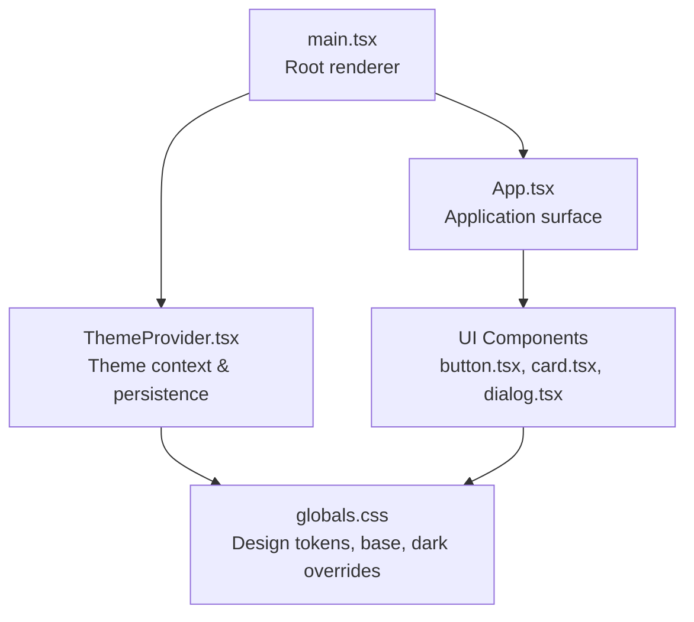
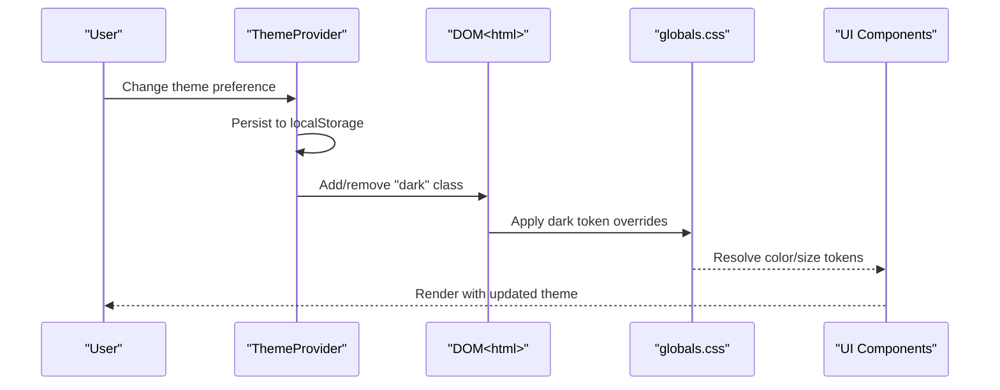
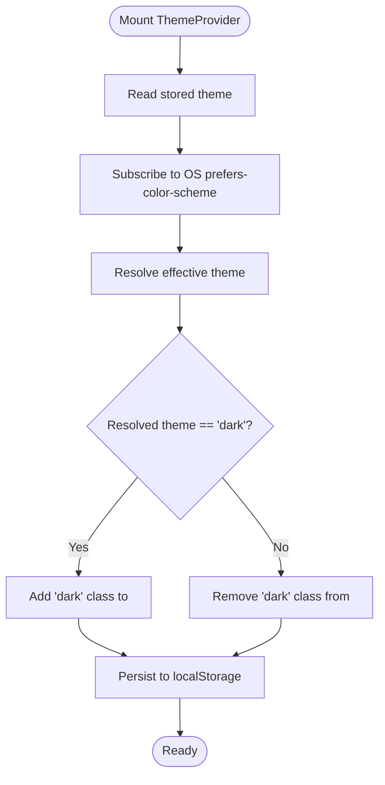
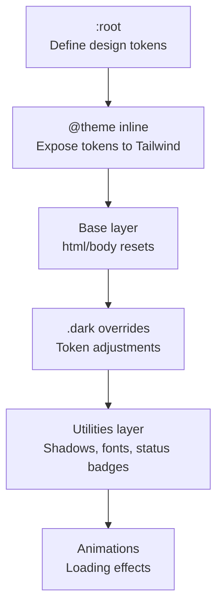
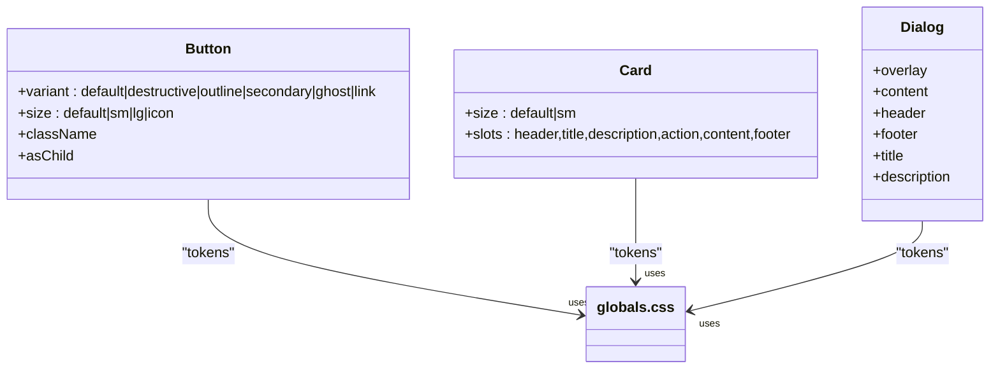
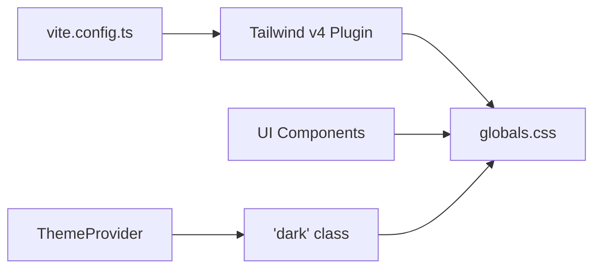

# Styling and Theming

<cite>
**Referenced Files in This Document**
- [globals.css](file://src/styles/globals.css)
- [ThemeProvider.tsx](file://src/components/theme/ThemeProvider.tsx)
- [package.json](file://package.json)
- [vite.config.ts](file://vite.config.ts)
- [components.json](file://components.json)
- [button.tsx](file://src/components/ui/button.tsx)
- [card.tsx](file://src/components/ui/card.tsx)
- [dialog.tsx](file://src/components/ui/dialog.tsx)
- [main.tsx](file://src/main.tsx)
- [App.tsx](file://src/App.tsx)
</cite>

## Table of Contents
1. [Introduction](#introduction)
2. [Project Structure](#project-structure)
3. [Core Components](#core-components)
4. [Architecture Overview](#architecture-overview)
5. [Detailed Component Analysis](#detailed-component-analysis)
6. [Dependency Analysis](#dependency-analysis)
7. [Performance Considerations](#performance-considerations)
8. [Troubleshooting Guide](#troubleshooting-guide)
9. [Conclusion](#conclusion)

## Introduction
This document explains the styling and theming architecture built with Tailwind CSS and a custom theme provider. It covers the global design token system, dark/light mode implementation, component-level styling using shadcn/ui primitives, and responsive patterns. It also provides practical guidance for maintaining consistent styling across the application and integrating with design system components.

## Project Structure
The styling system is organized around:
- A single global stylesheet that defines design tokens and base styles
- A theme provider that manages system-aware light/dark mode
- Tailwind v4 configured via Vite and shadcn/ui component library
- Reusable UI components that consume design tokens and variants

**Diagram sources**
- [main.tsx:16-43](file://src/main.tsx#L16-L43)
- [ThemeProvider.tsx:53-95](file://src/components/theme/ThemeProvider.tsx#L53-L95)
- [globals.css:12-94](file://src/styles/globals.css#L12-L94)
- [button.tsx:6-34](file://src/components/ui/button.tsx#L6-L34)
- [card.tsx:5-21](file://src/components/ui/card.tsx#L5-L21)
- [dialog.tsx:6-24](file://src/components/ui/dialog.tsx#L6-L24)

**Section sources**
- [main.tsx:16-43](file://src/main.tsx#L16-L43)
- [vite.config.ts:12-16](file://vite.config.ts#L12-L16)
- [components.json:6-12](file://components.json#L6-L12)

## Core Components
- ThemeProvider: Manages theme state, persists user choice, and toggles the dark class on the root element.
- globals.css: Defines a comprehensive design token system (colors, typography, spacing, shadows) and applies dark mode overrides.
- UI components: Built with shadcn/ui and Tailwind utilities, consuming design tokens via CSS variables.

Key responsibilities:
- ThemeProvider resolves and stores theme preferences, listens to OS changes, and updates the DOM class for dark mode.
- globals.css centralizes design tokens mapped to Tailwind color tokens and exposes utility classes for shadows, fonts, and status badges.
- UI components encapsulate variants and sizes while inheriting from the design system.

**Section sources**
- [ThemeProvider.tsx:14-101](file://src/components/theme/ThemeProvider.tsx#L14-L101)
- [globals.css:12-94](file://src/styles/globals.css#L12-L94)
- [button.tsx:6-34](file://src/components/ui/button.tsx#L6-L34)
- [card.tsx:5-21](file://src/components/ui/card.tsx#L5-L21)
- [dialog.tsx:6-24](file://src/components/ui/dialog.tsx#L6-L24)

## Architecture Overview
The theming architecture combines a design token system with a theme provider and Tailwind v4. The provider sets a class on the root element, enabling dark mode variants. Components use design tokens via CSS variables and Tailwind utilities.

**Diagram sources**
- [ThemeProvider.tsx:53-95](file://src/components/theme/ThemeProvider.tsx#L53-L95)
- [globals.css:276-378](file://src/styles/globals.css#L276-L378)
- [button.tsx:6-34](file://src/components/ui/button.tsx#L6-L34)

## Detailed Component Analysis

### ThemeProvider
- Purpose: Provide a system-aware theme with persistent user preference and dark mode support.
- Behavior:
  - Reads stored preference from localStorage or defaults to system.
  - Listens to OS color-scheme media query changes.
  - Applies/removes the "dark" class on the root element to activate dark mode variants.
  - Exposes a hook to read and update the theme.

**Diagram sources**
- [ThemeProvider.tsx:53-95](file://src/components/theme/ThemeProvider.tsx#L53-L95)

**Section sources**
- [ThemeProvider.tsx:14-101](file://src/components/theme/ThemeProvider.tsx#L14-L101)

### Global Styles and Design Tokens (globals.css)
- Design token system:
  - Maps CSS variables to Tailwind color tokens for seamless integration.
  - Defines typography scales, weights, line heights, and letter spacings.
  - Establishes spacing scale, border radius tokens, and shadow system.
  - Provides brand and status color palettes.
- Dark mode overrides:
  - When the "dark" class is present, tokens shift to maintain contrast and brand aesthetics.
- Base styles:
  - Sets up root color-scheme, background/foreground, and global typography.
  - Provides utility classes for shadows, fonts, scrollbars, status badges, and glass surfaces.
- Animations:
  - Includes loading and glitch animations for the application’s splash and loading states.

**Diagram sources**
- [globals.css:100-269](file://src/styles/globals.css#L100-L269)
- [globals.css:12-94](file://src/styles/globals.css#L12-L94)
- [globals.css:383-585](file://src/styles/globals.css#L383-L585)
- [globals.css:276-378](file://src/styles/globals.css#L276-L378)
- [globals.css:590-679](file://src/styles/globals.css#L590-L679)

**Section sources**
- [globals.css:12-94](file://src/styles/globals.css#L12-L94)
- [globals.css:100-269](file://src/styles/globals.css#L100-L269)
- [globals.css:276-378](file://src/styles/globals.css#L276-L378)
- [globals.css:383-585](file://src/styles/globals.css#L383-L585)
- [globals.css:590-679](file://src/styles/globals.css#L590-L679)

### UI Components and Variants
Components are built with shadcn/ui and class variance authority (CVA), ensuring consistent variants and sizes while leveraging design tokens.

- Button:
  - Variants: default, destructive, outline, secondary, ghost, link.
  - Sizes: default, sm, lg, icon.
  - Uses primary/accent/muted tokens and ring for focus states.
- Card:
  - Slots for header, title, description, action, content, footer.
  - Supports size variants and ring/foreground/opacity tokens for borders.
- Dialog:
  - Overlay/backdrop with blur and fade transitions.
  - Content container with ring/shadow tokens and centered layout.

**Diagram sources**
- [button.tsx:6-34](file://src/components/ui/button.tsx#L6-L34)
- [card.tsx:5-21](file://src/components/ui/card.tsx#L5-L21)
- [dialog.tsx:6-24](file://src/components/ui/dialog.tsx#L6-L24)
- [globals.css:12-94](file://src/styles/globals.css#L12-L94)

**Section sources**
- [button.tsx:6-34](file://src/components/ui/button.tsx#L6-L34)
- [card.tsx:5-21](file://src/components/ui/card.tsx#L5-L21)
- [dialog.tsx:6-24](file://src/components/ui/dialog.tsx#L6-L24)

### Integration Points
- Root rendering:
  - ThemeProvider wraps the entire app; TooltipProvider ensures interactive tooltips inherit theme.
- Component usage:
  - Components import design utilities and variants; they automatically adapt to theme changes via CSS variables.

**Section sources**
- [main.tsx:37-43](file://src/main.tsx#L37-L43)
- [App.tsx:59-67](file://src/App.tsx#L59-L67)

## Dependency Analysis
- Tailwind v4 is enabled via the Vite plugin and configured through the project’s Tailwind settings.
- shadcn/ui is integrated with the project’s CSS path and uses CSS variables for tokens.
- ThemeProvider depends on localStorage for persistence and media queries for OS preference.

**Diagram sources**
- [vite.config.ts:12-16](file://vite.config.ts#L12-L16)
- [components.json:6-12](file://components.json#L6-L12)
- [globals.css:12-94](file://src/styles/globals.css#L12-L94)
- [ThemeProvider.tsx:72-79](file://src/components/theme/ThemeProvider.tsx#L72-L79)

**Section sources**
- [package.json:59-82](file://package.json#L59-L82)
- [vite.config.ts:12-16](file://vite.config.ts#L12-L16)
- [components.json:6-12](file://components.json#L6-L12)

## Performance Considerations
- CSS variables minimize cascade and enable efficient dark mode switching without reprocessing stylesheets.
- Utility-first classes keep component styles concise and reduce duplication.
- Prefer token-based utilities (e.g., shadow-token-* and text-token-*) to avoid ad-hoc values and maintain consistency.

## Troubleshooting Guide
- Theme does not persist:
  - Verify localStorage availability and that the storage key matches the provider’s key.
- Dark mode not applying:
  - Ensure the "dark" class is present on the root element and that dark overrides are defined in the stylesheet.
- Tokens appear inconsistent:
  - Confirm that design tokens are defined in :root and exposed via @theme inline.
- Component colors look incorrect:
  - Check that components use Tailwind utilities bound to CSS variables (e.g., bg-primary, text-foreground).

**Section sources**
- [ThemeProvider.tsx:33-45](file://src/components/theme/ThemeProvider.tsx#L33-L45)
- [globals.css:12-94](file://src/styles/globals.css#L12-L94)
- [globals.css:276-378](file://src/styles/globals.css#L276-L378)

## Conclusion
The styling and theming architecture centers on a robust design token system, a system-aware theme provider, and shadcn/ui components that consume tokens consistently. By leveraging CSS variables and Tailwind v4, the system delivers a cohesive, maintainable, and responsive UI that adapts seamlessly to light and dark modes.