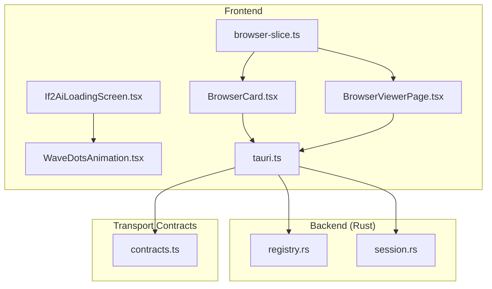
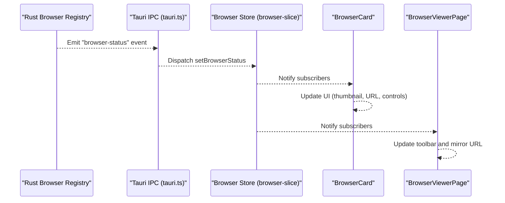
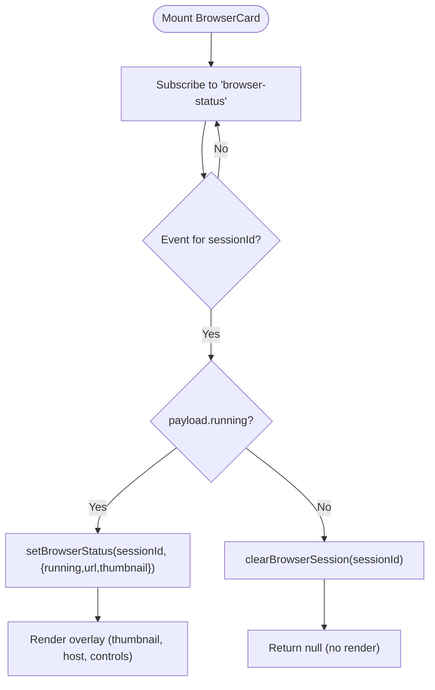
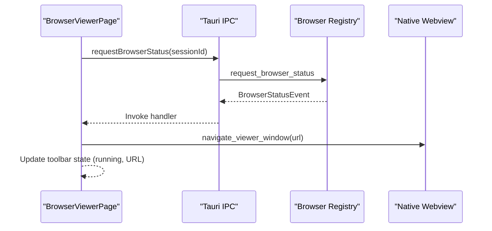
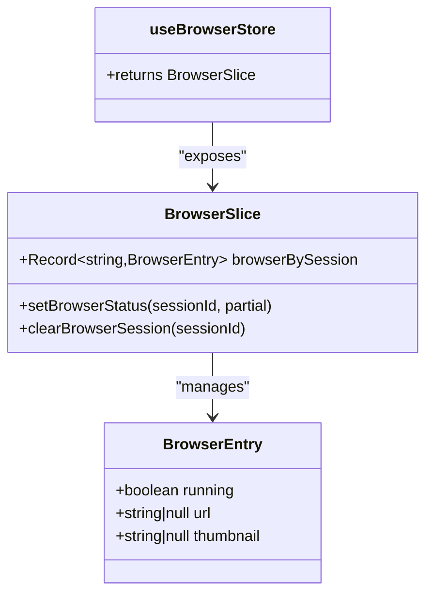
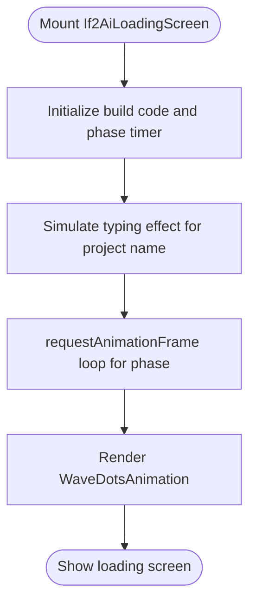
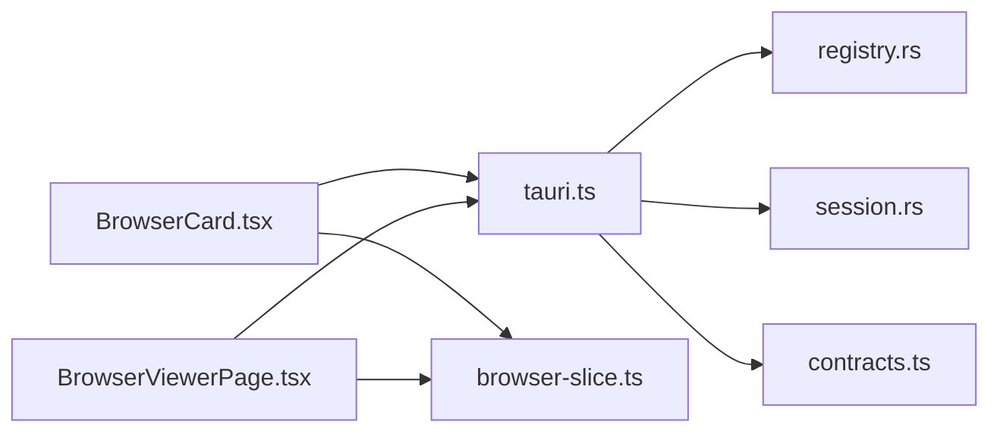

# Browser Automation Components

<cite>
**Referenced Files in This Document**
- [BrowserCard.tsx](file://src/components/browser/BrowserCard.tsx)
- [BrowserViewerPage.tsx](file://src/modules/browser-viewer/BrowserViewerPage.tsx)
- [browser-slice.ts](file://src/stores/browser-slice.ts)
- [tauri.ts](file://src/lib/tauri.ts)
- [WaveDotsAnimation.tsx](file://src/components/loading/WaveDotsAnimation.tsx)
- [If2AiLoadingScreen.tsx](file://src/components/loading/If2AiLoadingScreen.tsx)
- [registry.rs](file://src-tauri/src/modules/browser/registry.rs)
- [session.rs](file://src-tauri/src/modules/browser/session.rs)
- [contracts.ts](file://src/transport/contracts.ts)
</cite>

## Table of Contents
1. [Introduction](#introduction)
2. [Project Structure](#project-structure)
3. [Core Components](#core-components)
4. [Architecture Overview](#architecture-overview)
5. [Detailed Component Analysis](#detailed-component-analysis)
6. [Dependency Analysis](#dependency-analysis)
7. [Performance Considerations](#performance-considerations)
8. [Troubleshooting Guide](#troubleshooting-guide)
9. [Conclusion](#conclusion)

## Introduction
This document explains the browser automation and loading components that power AI-driven web browsing within the application. It focuses on:
- BrowserCard: a floating overlay that visualizes and controls an AI-controlled browser session
- BrowserViewerPage: a dedicated viewer window for observing and interacting with the live browser
- Loading components: animated screens and progress indicators that communicate system state to users
- Integration with the browser automation subsystem and Tauri IPC

The goal is to help developers and designers understand how browser sessions are visualized, controlled, and represented to users, while maintaining a responsive and transparent UX.

## Project Structure
The browser automation system spans frontend React components, a lightweight Tauri IPC wrapper, a browser state store, and backend Rust modules that manage the Chromium-based browser sessions.

**Diagram sources**
- [BrowserCard.tsx:1-280](file://src/components/browser/BrowserCard.tsx#L1-L280)
- [BrowserViewerPage.tsx:1-284](file://src/modules/browser-viewer/BrowserViewerPage.tsx#L1-L284)
- [browser-slice.ts:1-103](file://src/stores/browser-slice.ts#L1-L103)
- [tauri.ts:1319-1364](file://src/lib/tauri.ts#L1319-L1364)
- [registry.rs:170-275](file://src-tauri/src/modules/browser/registry.rs#L170-L275)
- [session.rs:262-287](file://src-tauri/src/modules/browser/session.rs#L262-L287)
- [If2AiLoadingScreen.tsx:1-190](file://src/components/loading/If2AiLoadingScreen.tsx#L1-L190)
- [WaveDotsAnimation.tsx:1-194](file://src/components/loading/WaveDotsAnimation.tsx#L1-L194)
- [contracts.ts:1-539](file://src/transport/contracts.ts#L1-L539)

**Section sources**
- [BrowserCard.tsx:1-280](file://src/components/browser/BrowserCard.tsx#L1-L280)
- [BrowserViewerPage.tsx:1-284](file://src/modules/browser-viewer/BrowserViewerPage.tsx#L1-L284)
- [browser-slice.ts:1-103](file://src/stores/browser-slice.ts#L1-L103)
- [tauri.ts:1319-1364](file://src/lib/tauri.ts#L1319-L1364)
- [registry.rs:170-275](file://src-tauri/src/modules/browser/registry.rs#L170-L275)
- [session.rs:262-287](file://src-tauri/src/modules/browser/session.rs#L262-L287)
- [If2AiLoadingScreen.tsx:1-190](file://src/components/loading/If2AiLoadingScreen.tsx#L1-L190)
- [WaveDotsAnimation.tsx:1-194](file://src/components/loading/WaveDotsAnimation.tsx#L1-L194)
- [contracts.ts:1-539](file://src/transport/contracts.ts#L1-L539)

## Core Components
- BrowserCard: displays a live thumbnail, current URL host, and interactive controls for a single AI browser session. It listens to Tauri browser-status events and updates the browser store accordingly.
- BrowserViewerPage: a toolbar-only viewer window that mirrors the AI's current URL and exposes navigation controls. It also integrates with the backend to reflect the AI's navigation in a native webview.
- Browser Store (browser-slice): a module-level store using useSyncExternalStore to track per-session browser state and notify React components.
- Tauri IPC Wrapper (tauri.ts): typed helpers for browser commands, event subscription, and viewer window control.
- Loading Components: If2AiLoadingScreen provides a branded startup animation with WaveDotsAnimation for progress-like feedback.

Key responsibilities:
- Real-time browser state visualization and user control
- Seamless handoff between AI-controlled and user-controlled modes
- Consistent loading and progress communication

**Section sources**
- [BrowserCard.tsx:54-280](file://src/components/browser/BrowserCard.tsx#L54-L280)
- [BrowserViewerPage.tsx:46-284](file://src/modules/browser-viewer/BrowserViewerPage.tsx#L46-L284)
- [browser-slice.ts:14-102](file://src/stores/browser-slice.ts#L14-L102)
- [tauri.ts:1203-1364](file://src/lib/tauri.ts#L1203-L1364)
- [If2AiLoadingScreen.tsx:13-167](file://src/components/loading/If2AiLoadingScreen.tsx#L13-L167)
- [WaveDotsAnimation.tsx:23-89](file://src/components/loading/WaveDotsAnimation.tsx#L23-L89)

## Architecture Overview
The browser automation system follows a unidirectional data flow:
- Backend Rust modules manage browser sessions and emit "browser-status" events
- Frontend Tauri IPC wrapper subscribes to events and updates the browser store
- React components read from the store and render UI overlays and viewer windows

**Diagram sources**
- [tauri.ts:1319-1326](file://src/lib/tauri.ts#L1319-L1326)
- [browser-slice.ts:53-78](file://src/stores/browser-slice.ts#L53-L78)
- [BrowserCard.tsx:80-94](file://src/components/browser/BrowserCard.tsx#L80-L94)
- [BrowserViewerPage.tsx:65-94](file://src/modules/browser-viewer/BrowserViewerPage.tsx#L65-L94)

## Detailed Component Analysis

### BrowserCard: Floating Overlay for Browser Sessions
BrowserCard renders a compact, floating overlay that:
- Displays a live viewport thumbnail (base-64 JPEG)
- Shows the current page hostname
- Provides a "running" pulse indicator
- Offers emergency stop, takeover/release, and viewer controls

Behavior highlights:
- Subscribes to the global "browser-status" Tauri event and filters by sessionId
- Updates the browser store with running state, URL, and thumbnail
- Disappears when the browser stops
- Supports user takeover to temporarily hand control to a visible Chrome window

**Diagram sources**
- [BrowserCard.tsx:68-112](file://src/components/browser/BrowserCard.tsx#L68-L112)
- [browser-slice.ts:53-78](file://src/stores/browser-slice.ts#L53-L78)

**Section sources**
- [BrowserCard.tsx:54-280](file://src/components/browser/BrowserCard.tsx#L54-L280)
- [browser-slice.ts:14-102](file://src/stores/browser-slice.ts#L14-L102)

### BrowserViewerPage: Viewer Toolbar and Native Webview Mirror
BrowserViewerPage provides:
- A minimal toolbar with back/forward/reload and URL input
- A running indicator synchronized with the AI's activity
- Controls to stop the AI browser and open the system browser
- Mirrors the AI's current URL into a native webview beneath the toolbar

Integration details:
- Subscribes to "browser-status" and mirrors URL into the native content area
- Requests initial status to bootstrap UI without waiting for the next AI action
- Invokes backend commands to navigate, go back/forward, and reload within the viewer

**Diagram sources**
- [BrowserViewerPage.tsx:65-94](file://src/modules/browser-viewer/BrowserViewerPage.tsx#L65-L94)
- [tauri.ts:1342-1344](file://src/lib/tauri.ts#L1342-L1344)
- [tauri.ts:1347-1349](file://src/lib/tauri.ts#L1347-L1349)

**Section sources**
- [BrowserViewerPage.tsx:46-284](file://src/modules/browser-viewer/BrowserViewerPage.tsx#L46-L284)
- [tauri.ts:1319-1364](file://src/lib/tauri.ts#L1319-L1364)

### Browser Store: Module-Level State Management
The browser store uses useSyncExternalStore to maintain:
- A map from sessionId to BrowserEntry (running, url, thumbnail)
- Functions to merge partial updates and clear entries
- Automatic React re-rendering on mutations

Design benefits:
- Centralized, predictable state for browser UI components
- No third-party state library overhead
- Efficient updates via external store notifications

**Diagram sources**
- [browser-slice.ts:16-34](file://src/stores/browser-slice.ts#L16-L34)
- [browser-slice.ts:95-102](file://src/stores/browser-slice.ts#L95-L102)

**Section sources**
- [browser-slice.ts:1-103](file://src/stores/browser-slice.ts#L1-L103)

### Tauri IPC Wrapper: Typed Browser Commands and Events
The IPC wrapper centralizes:
- Event subscription for "browser-status"
- Browser control commands (close, takeover, viewer window)
- Viewer navigation commands (navigate, go back/forward, reload)
- Helper to request immediate status emission

These functions are used by both BrowserCard and BrowserViewerPage to coordinate with the backend.

**Section sources**
- [tauri.ts:1203-1364](file://src/lib/tauri.ts#L1203-L1364)

### Loading Components: Progress and Feedback
If2AiLoadingScreen provides:
- Branded startup visuals with animated typography and grid
- WaveDotsAnimation for dynamic progress-like feedback
- Stage label and build metadata

WaveDotsAnimation:
- Renders animated dots with wave motion and color transitions
- Configurable amplitude, radius, count, delay, and colors
- Uses requestAnimationFrame for smooth animation

**Diagram sources**
- [If2AiLoadingScreen.tsx:22-55](file://src/components/loading/If2AiLoadingScreen.tsx#L22-L55)
- [WaveDotsAnimation.tsx:37-45](file://src/components/loading/WaveDotsAnimation.tsx#L37-L45)

**Section sources**
- [If2AiLoadingScreen.tsx:1-190](file://src/components/loading/If2AiLoadingScreen.tsx#L1-L190)
- [WaveDotsAnimation.tsx:1-194](file://src/components/loading/WaveDotsAnimation.tsx#L1-L194)

## Dependency Analysis
BrowserCard and BrowserViewerPage depend on:
- Tauri IPC for event subscription and commands
- The browser store for reactive state updates
- Transport contracts for event typing and schema versioning

Backend dependencies:
- Browser registry manages sessions, navigation, and status emission
- Session encapsulates the underlying Chromium page and state

**Diagram sources**
- [BrowserCard.tsx:20-31](file://src/components/browser/BrowserCard.tsx#L20-L31)
- [BrowserViewerPage.tsx:20-27](file://src/modules/browser-viewer/BrowserViewerPage.tsx#L20-L27)
- [tauri.ts:1319-1364](file://src/lib/tauri.ts#L1319-L1364)
- [registry.rs:170-275](file://src-tauri/src/modules/browser/registry.rs#L170-L275)
- [session.rs:262-287](file://src-tauri/src/modules/browser/session.rs#L262-L287)
- [contracts.ts:1-539](file://src/transport/contracts.ts#L1-L539)
- [browser-slice.ts:1-103](file://src/stores/browser-slice.ts#L1-L103)

**Section sources**
- [BrowserCard.tsx:20-31](file://src/components/browser/BrowserCard.tsx#L20-L31)
- [BrowserViewerPage.tsx:20-27](file://src/modules/browser-viewer/BrowserViewerPage.tsx#L20-L27)
- [tauri.ts:1319-1364](file://src/lib/tauri.ts#L1319-L1364)
- [registry.rs:170-275](file://src-tauri/src/modules/browser/registry.rs#L170-L275)
- [session.rs:262-287](file://src-tauri/src/modules/browser/session.rs#L262-L287)
- [contracts.ts:1-539](file://src/transport/contracts.ts#L1-L539)
- [browser-slice.ts:1-103](file://src/stores/browser-slice.ts#L1-L103)

## Performance Considerations
- Event filtering: Both BrowserCard and BrowserViewerPage filter incoming "browser-status" events by sessionId to minimize unnecessary re-renders.
- Animation efficiency: WaveDotsAnimation uses requestAnimationFrame and transforms for smooth rendering; avoid excessive count or radius values to prevent layout thrashing.
- Thumbnail handling: Thumbnails are base-64 images; consider lazy-loading or debouncing updates to reduce memory pressure.
- Store updates: The browser store consolidates partial updates and notifies listeners efficiently via useSyncExternalStore.

## Troubleshooting Guide
Common issues and remedies:
- Overlay not appearing
  - Verify the "browser-status" event is emitted for the sessionId and that the component is subscribed
  - Confirm the backend reports running state and includes thumbnail data
- Viewer window not updating
  - Ensure requestBrowserStatus is called on mount to bootstrap state
  - Confirm navigate_viewer_window is invoked when URL changes
- Takeover/release failures
  - Check backend logs for takeover errors and confirm the session is eligible for headed mode
- Memory leaks
  - Ensure unlisten functions are called on component unmount
  - Avoid stale references in event handlers

**Section sources**
- [BrowserCard.tsx:76-112](file://src/components/browser/BrowserCard.tsx#L76-L112)
- [BrowserViewerPage.tsx:57-107](file://src/modules/browser-viewer/BrowserViewerPage.tsx#L57-L107)
- [tauri.ts:1319-1326](file://src/lib/tauri.ts#L1319-L1326)

## Conclusion
The browser automation components provide a cohesive, user-friendly way to visualize and control AI-driven web browsing. BrowserCard and BrowserViewerPage offer complementary views—one floating overlay and one dedicated viewer—while the browser store and Tauri IPC ensure reliable, real-time synchronization. Combined with thoughtful loading components, the system delivers transparency and responsiveness during browser sessions.