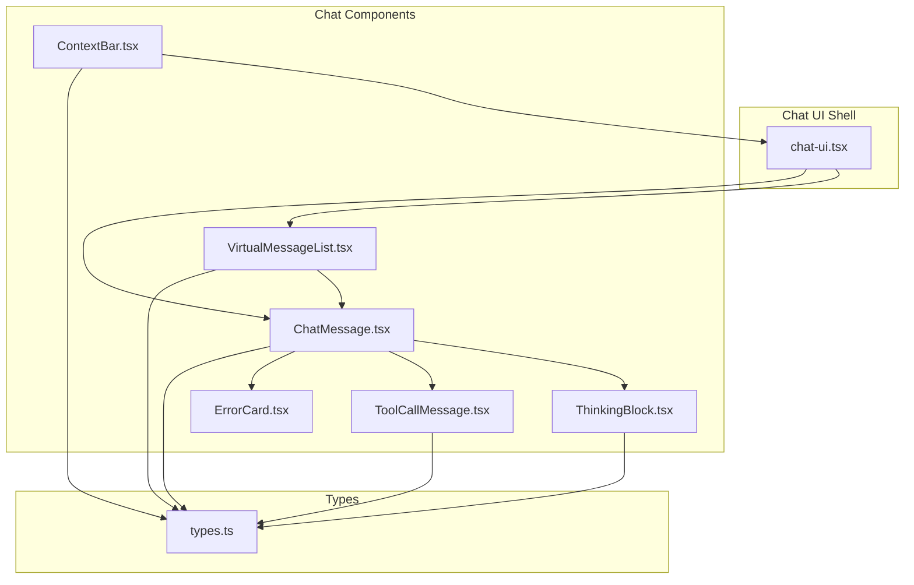
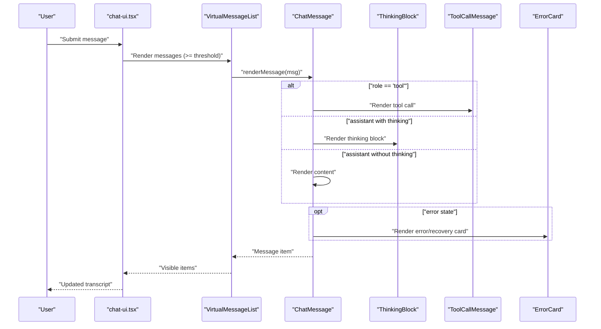
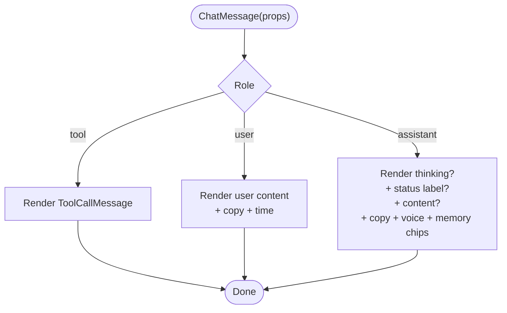
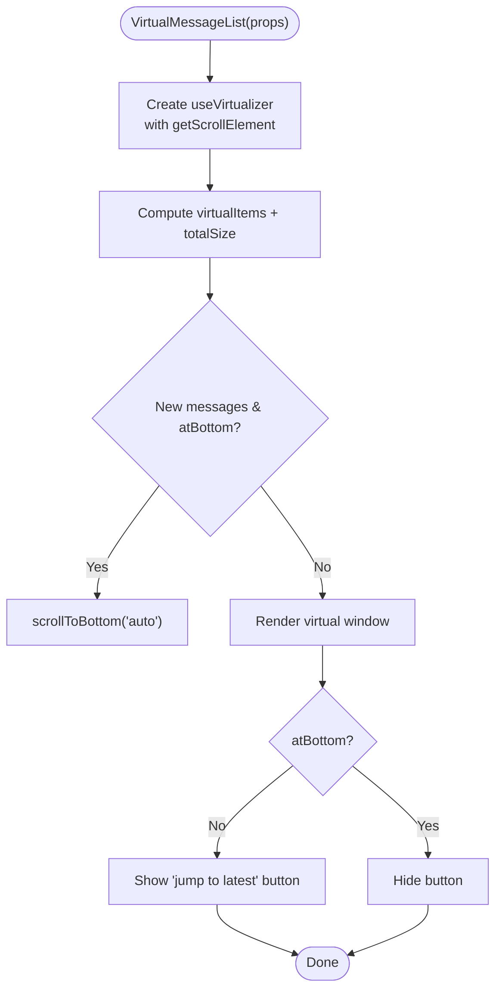
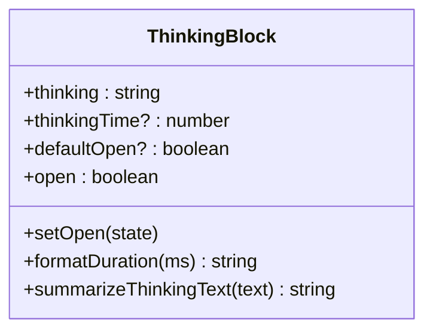
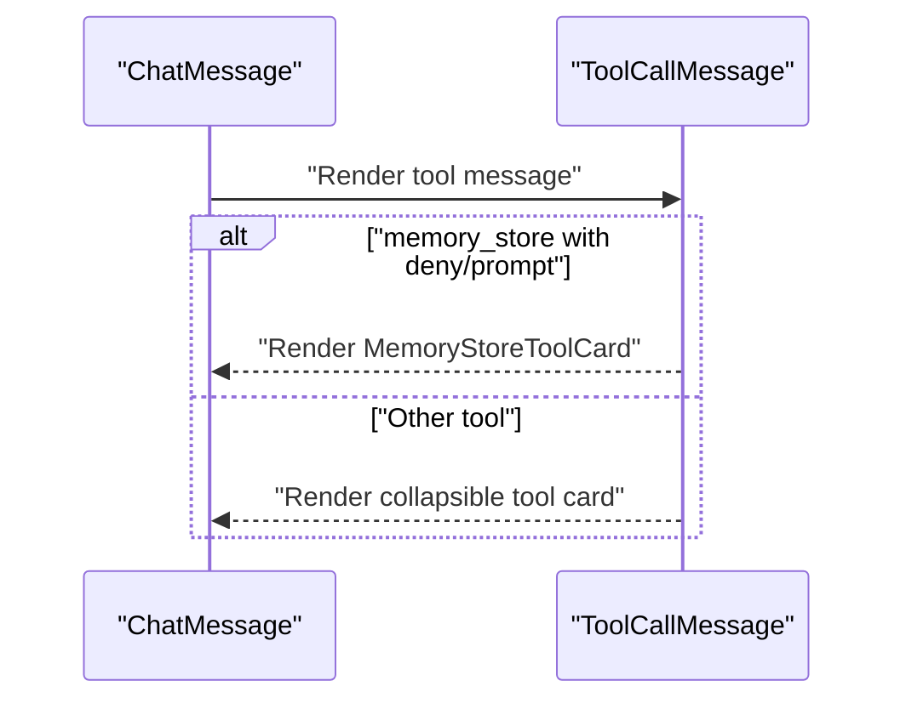
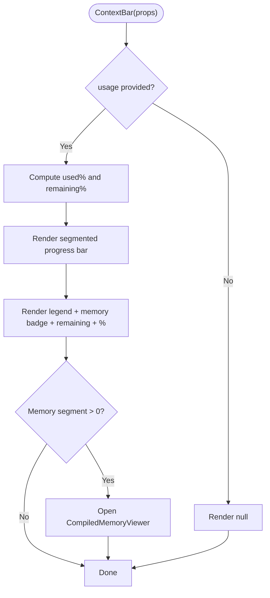
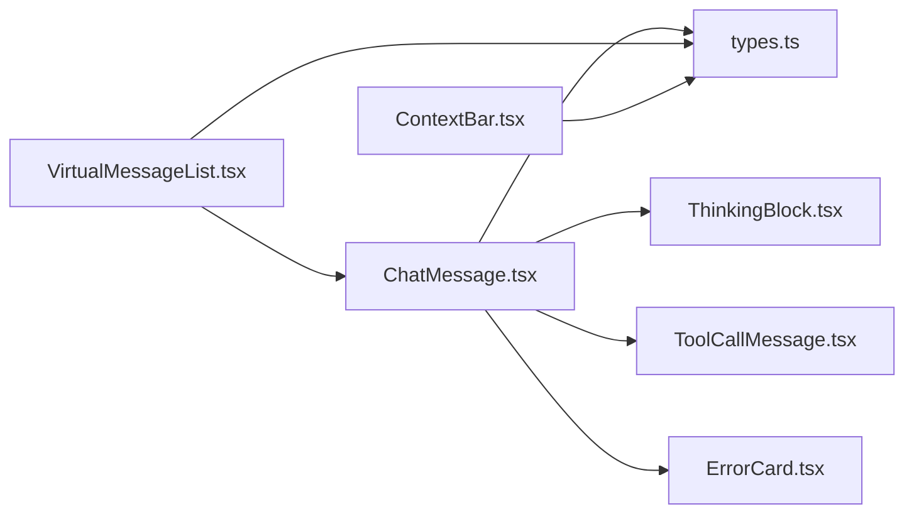

# Chat Interface Components

<cite>
**Referenced Files in This Document**
- [ChatMessage.tsx](file://src/components/chat/ChatMessage.tsx)
- [VirtualMessageList.tsx](file://src/components/chat/VirtualMessageList.tsx)
- [ThinkingBlock.tsx](file://src/components/chat/ThinkingBlock.tsx)
- [ToolCallMessage.tsx](file://src/components/chat/ToolCallMessage.tsx)
- [ContextBar.tsx](file://src/components/chat/ContextBar.tsx)
- [types.ts](file://src/modules/chat/types.ts)
- [chat-ui.tsx](file://src/components/ui/chat-ui.tsx)
- [ErrorCard.tsx](file://src/components/chat/ErrorCard.tsx)
</cite>

## Table of Contents
1. [Introduction](#introduction)
2. [Project Structure](#project-structure)
3. [Core Components](#core-components)
4. [Architecture Overview](#architecture-overview)
5. [Detailed Component Analysis](#detailed-component-analysis)
6. [Dependency Analysis](#dependency-analysis)
7. [Performance Considerations](#performance-considerations)
8. [Troubleshooting Guide](#troubleshooting-guide)
9. [Conclusion](#conclusion)

## Introduction
This document explains the chat interface components that power conversational UIs in the project. It focuses on five key components: ChatMessage, VirtualMessageList, ThinkingBlock, ToolCallMessage, and ContextBar. It covers chat interaction patterns, message rendering, virtualization techniques, component props, event handling, state management, performance optimizations for large message lists and streaming responses, and accessibility considerations.

## Project Structure
The chat UI is composed of modular components under src/components/chat and integrates with shared types and the main chat UI implementation.

**Diagram sources**
- [chat-ui.tsx](file://src/components/ui/chat-ui.tsx)
- [VirtualMessageList.tsx](file://src/components/chat/VirtualMessageList.tsx)
- [ChatMessage.tsx](file://src/components/chat/ChatMessage.tsx)
- [ThinkingBlock.tsx](file://src/components/chat/ThinkingBlock.tsx)
- [ToolCallMessage.tsx](file://src/components/chat/ToolCallMessage.tsx)
- [ContextBar.tsx](file://src/components/chat/ContextBar.tsx)
- [types.ts](file://src/modules/chat/types.ts)
- [ErrorCard.tsx](file://src/components/chat/ErrorCard.tsx)

**Section sources**
- [chat-ui.tsx](file://src/components/ui/chat-ui.tsx)
- [VirtualMessageList.tsx](file://src/components/chat/VirtualMessageList.tsx)
- [ChatMessage.tsx](file://src/components/chat/ChatMessage.tsx)
- [ThinkingBlock.tsx](file://src/components/chat/ThinkingBlock.tsx)
- [ToolCallMessage.tsx](file://src/components/chat/ToolCallMessage.tsx)
- [ContextBar.tsx](file://src/components/chat/ContextBar.tsx)
- [types.ts](file://src/modules/chat/types.ts)
- [ErrorCard.tsx](file://src/components/chat/ErrorCard.tsx)

## Core Components
- ChatMessage: Renders a single message with role-specific behavior, optional thinking blocks, streaming indicators, status labels, memory chips, copy actions, and voice playback affordances.
- VirtualMessageList: A virtualized list that renders only visible messages, auto-scrolls to the bottom, and supports external scroll containers to avoid nested scrolling.
- ThinkingBlock: Collapsible assistant chain-of-thought display with duration labeling and expand/collapse behavior.
- ToolCallMessage: Renders tool invocation messages with status glyphs, collapsible details, copy actions, and special handling for memory_store decisions.
- ContextBar: Token budget visualization above the composer, showing system, memory, history, output reserve, and remaining tokens, plus a memory viewer trigger.

**Section sources**
- [ChatMessage.tsx](file://src/components/chat/ChatMessage.tsx)
- [VirtualMessageList.tsx](file://src/components/chat/VirtualMessageList.tsx)
- [ThinkingBlock.tsx](file://src/components/chat/ThinkingBlock.tsx)
- [ToolCallMessage.tsx](file://src/components/chat/ToolCallMessage.tsx)
- [ContextBar.tsx](file://src/components/chat/ContextBar.tsx)
- [types.ts](file://src/modules/chat/types.ts)

## Architecture Overview
The chat UI composes VirtualMessageList to efficiently render large histories, delegates per-message rendering to ChatMessage, and integrates ThinkingBlock and ToolCallMessage for specialized content. ContextBar displays contextual token usage and memory insights.

**Diagram sources**
- [chat-ui.tsx](file://src/components/ui/chat-ui.tsx)
- [VirtualMessageList.tsx](file://src/components/chat/VirtualMessageList.tsx)
- [ChatMessage.tsx](file://src/components/chat/ChatMessage.tsx)
- [ThinkingBlock.tsx](file://src/components/chat/ThinkingBlock.tsx)
- [ToolCallMessage.tsx](file://src/components/chat/ToolCallMessage.tsx)
- [ErrorCard.tsx](file://src/components/chat/ErrorCard.tsx)

## Detailed Component Analysis

### ChatMessage
- Purpose: Central renderer for user, assistant, and tool messages. Handles thinking blocks, streaming indicators, status labels, memory chips, copy actions, and voice playback.
- Key props:
  - message: Message object from types.ts
  - onCopyMessage: Callback invoked with the message when copy is requested
  - onResumeFromCursor?: Callback for resuming from a recovery cursor
  - isCopied: Controls copy feedback visibility
  - defaultWorkdir?: Default working directory for tool call display
  - isPrimaryThinkingMessage?: Whether to render the full ThinkingBlock
  - densityMode: 'comfortable' | 'compact'
  - fontMode: 'sans' | 'serif'
- Rendering logic:
  - Tool messages delegate to ToolCallMessage.
  - Assistant messages may render ThinkingBlock (primary) or ThinkingSummaryNode (others).
  - Streaming assistant messages show a loading indicator.
  - Status labels and memory chips are conditionally rendered.
  - Copy button and voice button are included for non-streaming assistant messages.
- Accessibility:
  - Uses semantic roles and labels for interactive elements.
  - Screen-reader-friendly labels for thinking, tool calls, and copy actions.
- Performance:
  - Memoized with deep prop comparison to avoid re-rendering unchanged messages.
  - Markdown content is normalized and memoized to reduce expensive re-renders.

**Diagram sources**
- [ChatMessage.tsx](file://src/components/chat/ChatMessage.tsx)
- [ToolCallMessage.tsx](file://src/components/chat/ToolCallMessage.tsx)
- [ThinkingBlock.tsx](file://src/components/chat/ThinkingBlock.tsx)
- [ErrorCard.tsx](file://src/components/chat/ErrorCard.tsx)

**Section sources**
- [ChatMessage.tsx](file://src/components/chat/ChatMessage.tsx)
- [types.ts](file://src/modules/chat/types.ts)
- [ErrorCard.tsx](file://src/components/chat/ErrorCard.tsx)

### VirtualMessageList
- Purpose: Efficiently render large message lists by virtualizing only visible items, auto-scrolling to the bottom, and supporting external scroll containers.
- Key props:
  - messages: Message[]
  - renderMessage: (message, index) => ReactNode
  - estimatedItemSize?: number (default 72)
  - overscan?: number (default 10)
  - className?: string
  - scrollElementRef?: Ref to an external scroll container
- Behavior:
  - Uses @tanstack/react-virtual with dynamic measurement (except Firefox).
  - Auto-scrolls to bottom when new messages arrive and user is at bottom.
  - Provides a sticky "jump to latest" button when scrolled up.
  - Integrates with an external scroll container to prevent nested scroll regions.
- Accessibility:
  - Announces the message list as a log region with polite live updates.
  - Provides keyboard-accessible jump button.

**Diagram sources**
- [VirtualMessageList.tsx](file://src/components/chat/VirtualMessageList.tsx)

**Section sources**
- [VirtualMessageList.tsx](file://src/components/chat/VirtualMessageList.tsx)
- [chat-ui.tsx](file://src/components/ui/chat-ui.tsx)

### ThinkingBlock
- Purpose: Collapsible assistant chain-of-thought panel with optional duration display and expand/collapse affordance.
- Key props:
  - thinking: string
  - thinkingTime?: number (milliseconds)
  - defaultOpen?: boolean
- Behavior:
  - Maintains local open state with effect-driven resets.
  - Formats durations and summarizes long thinking text for summary nodes.
  - Uses accessible ARIA attributes for expanded state and labels.

**Diagram sources**
- [ThinkingBlock.tsx](file://src/components/chat/ThinkingBlock.tsx)

**Section sources**
- [ThinkingBlock.tsx](file://src/components/chat/ThinkingBlock.tsx)

### ToolCallMessage
- Purpose: Renders tool invocation messages with status glyphs, collapsible details, copy actions, and special handling for memory_store decisions.
- Key props:
  - message: Message (role must be 'tool')
  - defaultWorkdir?: string (used for path display)
- Behavior:
  - Special-case for memory_store with deny/prompt decisions renders a dedicated card.
  - Normal tool calls show a collapsible block with details and menu actions (copy summary/result/diagnostics, expand/collapse).
  - Includes a banner for web_search without a configured key.

**Diagram sources**
- [ToolCallMessage.tsx](file://src/components/chat/ToolCallMessage.tsx)
- [chat-ui.tsx](file://src/components/ui/chat-ui.tsx)

**Section sources**
- [ToolCallMessage.tsx](file://src/components/chat/ToolCallMessage.tsx)
- [chat-ui.tsx](file://src/components/ui/chat-ui.tsx)

### ContextBar
- Purpose: Displays token budget usage above the composer, including system prompt, memory, history, output reserve, and remaining tokens. Optionally shows a memory viewer trigger and sliding window size.
- Key props:
  - usage?: ContextBudgetUsage (from StreamTokenPayload)
  - windowSize?: number (current sliding window size)
  - className?: string
- Behavior:
  - Renders a segmented progress bar with color-coded segments.
  - Shows a legend with formatted token counts and remaining percentage.
  - Opens CompiledMemoryViewer modal when memory segment is active.
  - Uses role=status and aria-label for accessibility.

**Diagram sources**
- [ContextBar.tsx](file://src/components/chat/ContextBar.tsx)

**Section sources**
- [ContextBar.tsx](file://src/components/chat/ContextBar.tsx)
- [types.ts](file://src/modules/chat/types.ts)

## Dependency Analysis
- ChatMessage depends on:
  - ThinkingBlock for assistant thinking
  - ToolCallMessage for tool messages
  - ErrorCard for error/recovery states
  - Message type definitions from types.ts
- VirtualMessageList depends on:
  - Message type definitions
  - @tanstack/react-virtual for virtualization
- ContextBar depends on:
  - ContextBudgetUsage type
  - CompiledMemoryViewer modal

**Diagram sources**
- [ChatMessage.tsx](file://src/components/chat/ChatMessage.tsx)
- [VirtualMessageList.tsx](file://src/components/chat/VirtualMessageList.tsx)
- [ThinkingBlock.tsx](file://src/components/chat/ThinkingBlock.tsx)
- [ToolCallMessage.tsx](file://src/components/chat/ToolCallMessage.tsx)
- [ErrorCard.tsx](file://src/components/chat/ErrorCard.tsx)
- [ContextBar.tsx](file://src/components/chat/ContextBar.tsx)
- [types.ts](file://src/modules/chat/types.ts)

**Section sources**
- [ChatMessage.tsx](file://src/components/chat/ChatMessage.tsx)
- [VirtualMessageList.tsx](file://src/components/chat/VirtualMessageList.tsx)
- [ThinkingBlock.tsx](file://src/components/chat/ThinkingBlock.tsx)
- [ToolCallMessage.tsx](file://src/components/chat/ToolCallMessage.tsx)
- [ErrorCard.tsx](file://src/components/chat/ErrorCard.tsx)
- [ContextBar.tsx](file://src/components/chat/ContextBar.tsx)
- [types.ts](file://src/modules/chat/types.ts)

## Performance Considerations
- Virtualization:
  - VirtualMessageList uses @tanstack/react-virtual with dynamic measurement and overscan to minimize DOM nodes and layout thrash during fast scrolling.
  - Auto-scrolling is gated to avoid fighting external scroll containers.
- Memoization:
  - ChatMessage and MarkdownContent are memoized with stable prop comparisons to avoid unnecessary re-renders.
  - Markdown normalization cache limits growth and evicts oldest entries.
- Streaming UX:
  - Assistant messages show a loading indicator during streaming and defer voice controls until content is finalized.
- Large histories:
  - VirtualMessageList thresholds kick in at a high-enough count to keep the transcript responsive even with hundreds of messages.

[No sources needed since this section provides general guidance]

## Troubleshooting Guide
- Messages not appearing at bottom:
  - Ensure the scroll container is either internal (owning) or external (parent-managed) as intended. VirtualMessageList auto-scrolls only when owning the container.
- Thinking block not expanding:
  - Confirm isPrimaryThinkingMessage is set for the latest assistant message requiring full expansion.
- Tool call details missing:
  - Verify defaultWorkdir is provided for path-aware tool calls and that the tool message includes details.
- Context bar not visible:
  - Confirm usage ContextBudgetUsage is provided; otherwise the component renders nothing.
- Error/recovery cards not showing:
  - Check message.error fields and taskOutcome/resumeCursor to ensure proper classification and recovery flow.

**Section sources**
- [VirtualMessageList.tsx](file://src/components/chat/VirtualMessageList.tsx)
- [ChatMessage.tsx](file://src/components/chat/ChatMessage.tsx)
- [ToolCallMessage.tsx](file://src/components/chat/ToolCallMessage.tsx)
- [ContextBar.tsx](file://src/components/chat/ContextBar.tsx)
- [ErrorCard.tsx](file://src/components/chat/ErrorCard.tsx)

## Conclusion
The chat interface leverages modular components to deliver a responsive, accessible, and extensible conversational UI. VirtualMessageList ensures smooth performance for large histories, ChatMessage centralizes rendering logic with specialized subcomponents, ThinkingBlock enhances transparency into assistant reasoning, ToolCallMessage provides rich tool interaction details, and ContextBar offers contextual token awareness. Together, these components support robust chat workflows and maintain high usability across diverse interaction patterns.