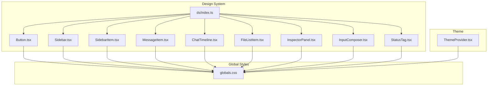
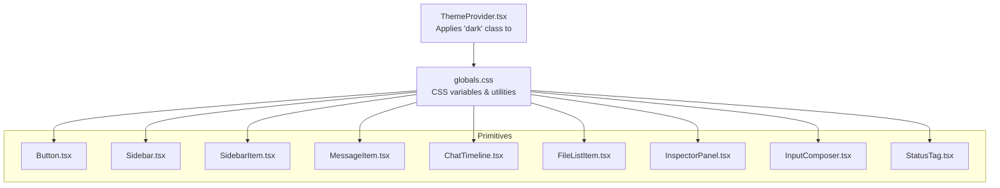
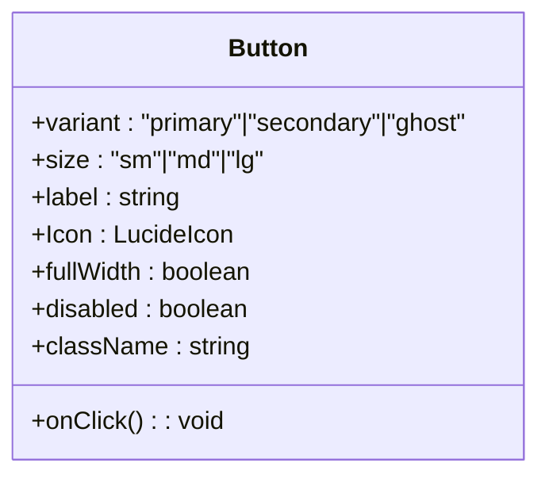
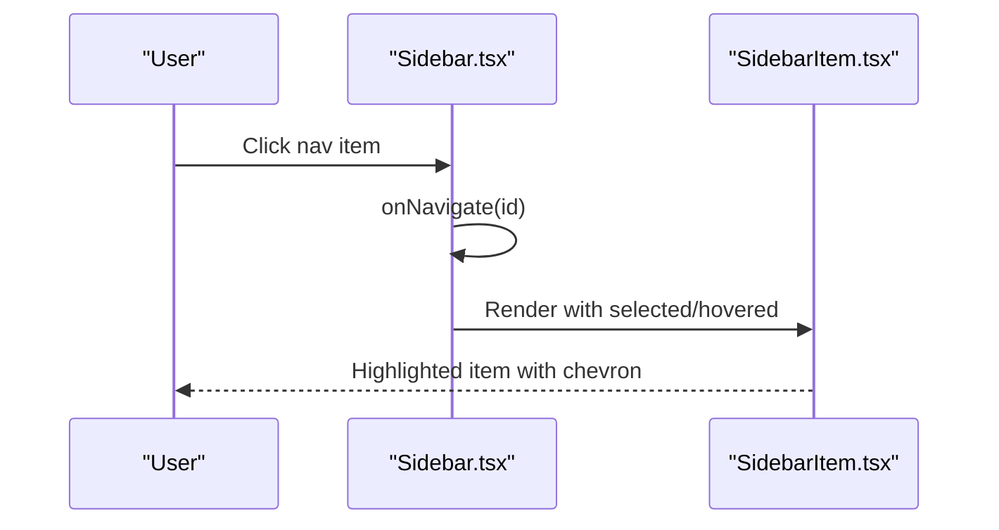
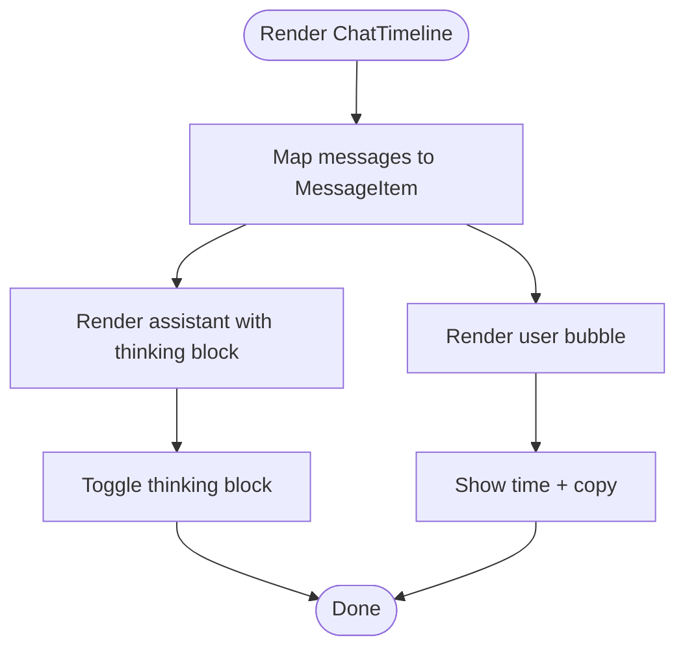
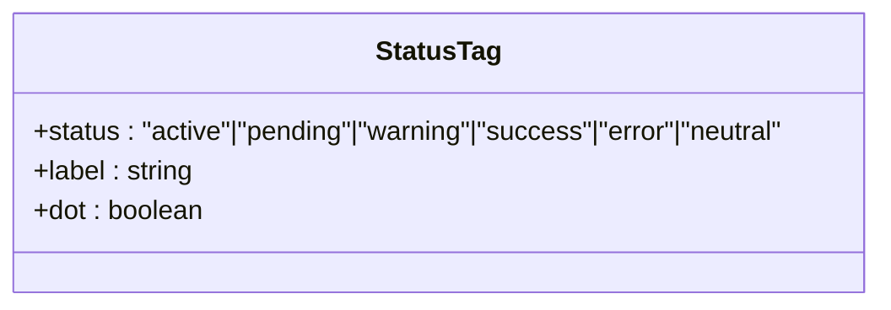
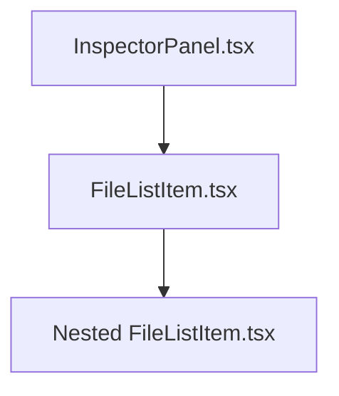
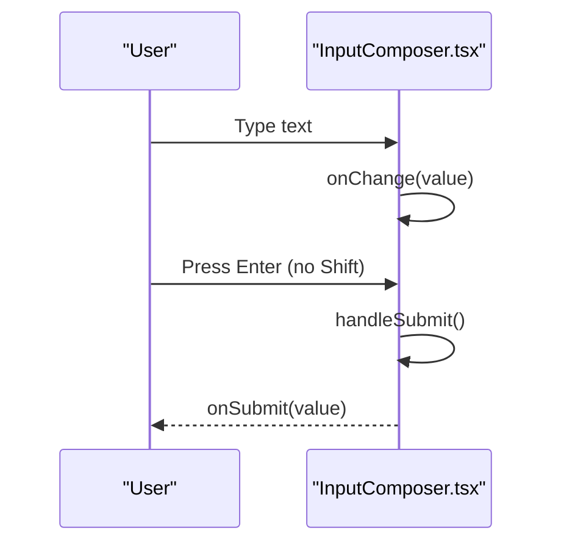
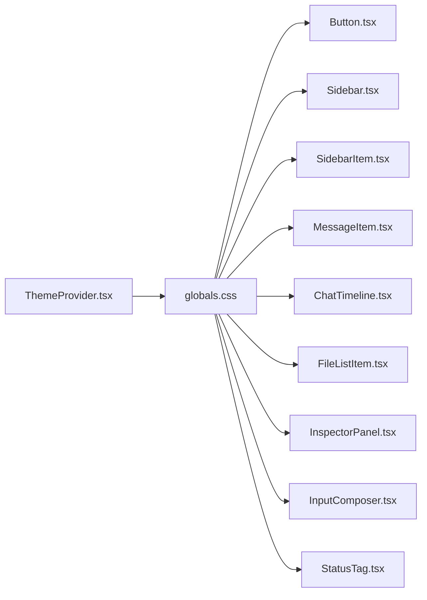

# Design System Primitives

<cite>
**Referenced Files in This Document**
- [index.ts](file://src/components/ds/index.ts)
- [Button.tsx](file://src/components/ds/Button.tsx)
- [Sidebar.tsx](file://src/components/ds/Sidebar.tsx)
- [SidebarItem.tsx](file://src/components/ds/SidebarItem.tsx)
- [MessageItem.tsx](file://src/components/ds/MessageItem.tsx)
- [StatusTag.tsx](file://src/components/ds/StatusTag.tsx)
- [ChatTimeline.tsx](file://src/components/ds/ChatTimeline.tsx)
- [FileListItem.tsx](file://src/components/ds/FileListItem.tsx)
- [InspectorPanel.tsx](file://src/components/ds/InspectorPanel.tsx)
- [InputComposer.tsx](file://src/components/ds/InputComposer.tsx)
- [globals.css](file://src/styles/globals.css)
- [ThemeProvider.tsx](file://src/components/theme/ThemeProvider.tsx)
</cite>

## Table of Contents
1. [Introduction](#introduction)
2. [Project Structure](#project-structure)
3. [Core Components](#core-components)
4. [Architecture Overview](#architecture-overview)
5. [Detailed Component Analysis](#detailed-component-analysis)
6. [Dependency Analysis](#dependency-analysis)
7. [Performance Considerations](#performance-considerations)
8. [Troubleshooting Guide](#troubleshooting-guide)
9. [Conclusion](#conclusion)
10. [Appendices](#appendices)

## Introduction
This document describes the Design System Primitives used across the application. It explains the design tokens, spacing system, and color scheme, and documents each primitive component’s props, variants, and styling approach. It also provides usage patterns, composition guidelines, and guidance on when to use each primitive to maintain consistency across the application.

The primitives are built on a cohesive design token system that leverages CSS variables for colors, typography, spacing, radius, and shadows. They are theme-aware and adapt to light/dark modes through a system-aware provider.

## Project Structure
The design system primitives live under the design-system directory and are re-exported from a central index for easy consumption. The global CSS defines the design tokens and utility classes that all primitives consume.

**Diagram sources**
- [index.ts:1-32](file://src/components/ds/index.ts#L1-L32)
- [Button.tsx:1-69](file://src/components/ds/Button.tsx#L1-L69)
- [Sidebar.tsx:1-170](file://src/components/ds/Sidebar.tsx#L1-L170)
- [SidebarItem.tsx:1-93](file://src/components/ds/SidebarItem.tsx#L1-L93)
- [MessageItem.tsx:1-128](file://src/components/ds/MessageItem.tsx#L1-L128)
- [ChatTimeline.tsx:1-63](file://src/components/ds/ChatTimeline.tsx#L1-L63)
- [FileListItem.tsx:1-94](file://src/components/ds/FileListItem.tsx#L1-L94)
- [InspectorPanel.tsx:1-99](file://src/components/ds/InspectorPanel.tsx#L1-L99)
- [InputComposer.tsx:1-147](file://src/components/ds/InputComposer.tsx#L1-L147)
- [StatusTag.tsx:1-64](file://src/components/ds/StatusTag.tsx#L1-L64)
- [globals.css:1-680](file://src/styles/globals.css#L1-L680)
- [ThemeProvider.tsx:1-101](file://src/components/theme/ThemeProvider.tsx#L1-L101)

**Section sources**
- [index.ts:1-32](file://src/components/ds/index.ts#L1-L32)
- [globals.css:1-680](file://src/styles/globals.css#L1-L680)
- [ThemeProvider.tsx:1-101](file://src/components/theme/ThemeProvider.tsx#L1-L101)

## Core Components
This section summarizes the primitives and their primary roles:

- Button: Action primitives with variants and sizes, supporting icons and full-width layout.
- Sidebar and SidebarItem: Navigation shell and individual items with selection, hover, and badges.
- MessageItem and ChatTimeline: Chat message rendering with assistant thinking blocks and user bubbles.
- StatusTag: Semantic status indicators using design tokens.
- FileListItem and InspectorPanel: File tree and inspector panel with sorting and metadata.
- InputComposer: Chat input with attachments, voice, send, and metadata controls.

Each component consumes design tokens via CSS variables and Tailwind utilities, ensuring consistent visuals across light and dark themes.

**Section sources**
- [Button.tsx:1-69](file://src/components/ds/Button.tsx#L1-L69)
- [Sidebar.tsx:1-170](file://src/components/ds/Sidebar.tsx#L1-L170)
- [SidebarItem.tsx:1-93](file://src/components/ds/SidebarItem.tsx#L1-L93)
- [MessageItem.tsx:1-128](file://src/components/ds/MessageItem.tsx#L1-L128)
- [ChatTimeline.tsx:1-63](file://src/components/ds/ChatTimeline.tsx#L1-L63)
- [StatusTag.tsx:1-64](file://src/components/ds/StatusTag.tsx#L1-L64)
- [FileListItem.tsx:1-94](file://src/components/ds/FileListItem.tsx#L1-L94)
- [InspectorPanel.tsx:1-99](file://src/components/ds/InspectorPanel.tsx#L1-L99)
- [InputComposer.tsx:1-147](file://src/components/ds/InputComposer.tsx#L1-L147)

## Architecture Overview
The primitives rely on a shared design token system defined in global CSS and a theme provider that toggles dark mode. Components compose small, reusable pieces and avoid hardcoding colors or spacing.

**Diagram sources**
- [ThemeProvider.tsx:53-94](file://src/components/theme/ThemeProvider.tsx#L53-L94)
- [globals.css:12-94](file://src/styles/globals.css#L12-L94)
- [Button.tsx:18-31](file://src/components/ds/Button.tsx#L18-L31)
- [Sidebar.tsx:80-82](file://src/components/ds/Sidebar.tsx#L80-L82)
- [SidebarItem.tsx:57-63](file://src/components/ds/SidebarItem.tsx#L57-L63)
- [MessageItem.tsx:46-80](file://src/components/ds/MessageItem.tsx#L46-L80)
- [ChatTimeline.tsx:40-46](file://src/components/ds/ChatTimeline.tsx#L40-L46)
- [FileListItem.tsx:50-56](file://src/components/ds/FileListItem.tsx#L50-L56)
- [InspectorPanel.tsx:37-40](file://src/components/ds/InspectorPanel.tsx#L37-L40)
- [InputComposer.tsx:67-71](file://src/components/ds/InputComposer.tsx#L67-L71)
- [StatusTag.tsx:47-62](file://src/components/ds/StatusTag.tsx#L47-L62)

## Detailed Component Analysis

### Button
- Purpose: Standard action control with three variants and three sizes.
- Props:
  - variant: primary | secondary | ghost
  - size: sm | md | lg
  - label: string
  - Icon: Lucide icon component
  - fullWidth: boolean
  - onClick: function
  - disabled: boolean
  - className: string
- Variants and sizes are mapped to CSS classes and inline styles for consistent sizing and spacing.
- Uses CSS variables for background, text, border, and hover states.

**Diagram sources**
- [Button.tsx:5-16](file://src/components/ds/Button.tsx#L5-L16)

**Section sources**
- [Button.tsx:1-69](file://src/components/ds/Button.tsx#L1-L69)

### Sidebar and SidebarItem
- Sidebar:
  - Provides a fixed-width left navigation with logo, navigation items, studio info, notifications, settings, and user card.
  - Accepts callbacks for navigation and displays active section.
- SidebarItem:
  - Renders a single navigation item with icon, label, optional badge, and selection/hover states.
  - Uses CSS variables for sidebar-specific colors and transitions.

**Diagram sources**
- [Sidebar.tsx:67-118](file://src/components/ds/Sidebar.tsx#L67-L118)
- [SidebarItem.tsx:39-91](file://src/components/ds/SidebarItem.tsx#L39-L91)

**Section sources**
- [Sidebar.tsx:1-170](file://src/components/ds/Sidebar.tsx#L1-L170)
- [SidebarItem.tsx:1-93](file://src/components/ds/SidebarItem.tsx#L1-L93)

### MessageItem and ChatTimeline
- MessageItem:
  - Renders assistant messages with optional collapsible “thinking” block and user messages with rounded bubbles.
  - Supports time metadata and copy actions.
- ChatTimeline:
  - Container for chat messages with a centered max width and scrollable area.
  - Manages per-message “thinking” expansion state.

**Diagram sources**
- [ChatTimeline.tsx:29-61](file://src/components/ds/ChatTimeline.tsx#L29-L61)
- [MessageItem.tsx:32-98](file://src/components/ds/MessageItem.tsx#L32-L98)

**Section sources**
- [MessageItem.tsx:1-128](file://src/components/ds/MessageItem.tsx#L1-L128)
- [ChatTimeline.tsx:1-63](file://src/components/ds/ChatTimeline.tsx#L1-L63)

### StatusTag
- Purpose: Semantic status badges with optional dot indicator.
- Props:
  - status: active | pending | warning | success | error | neutral
  - label: string
  - dot: boolean
- Uses CSS variables for background and text color, ensuring consistent status semantics.

**Diagram sources**
- [StatusTag.tsx:3-18](file://src/components/ds/StatusTag.tsx#L3-L18)

**Section sources**
- [StatusTag.tsx:1-64](file://src/components/ds/StatusTag.tsx#L1-L64)

### FileListItem and InspectorPanel
- FileListItem:
  - Renders files and folders with icons, indentation, and recursive expansion.
  - Supports file-type-specific icons and hover states.
- InspectorPanel:
  - Right-side panel with project header, skills badge, sort controls, and file tree.
  - Uses inspector-specific CSS variables for background and borders.

**Diagram sources**
- [InspectorPanel.tsx:28-96](file://src/components/ds/InspectorPanel.tsx#L28-L96)
- [FileListItem.tsx:42-92](file://src/components/ds/FileListItem.tsx#L42-L92)

**Section sources**
- [FileListItem.tsx:1-94](file://src/components/ds/FileListItem.tsx#L1-L94)
- [InspectorPanel.tsx:1-99](file://src/components/ds/InspectorPanel.tsx#L1-L99)

### InputComposer
- Purpose: Chat input with attachment, voice, send, and metadata controls.
- Props:
  - value: controlled input
  - onChange: value change handler
  - onSubmit: submit handler
  - placeholder: string
  - modelName: string
  - branchName: string
  - disabled: boolean
- States:
  - Empty: send button muted
  - Has-text: send button uses brand color
  - Focused: container border and ring shadow

**Diagram sources**
- [InputComposer.tsx:35-64](file://src/components/ds/InputComposer.tsx#L35-L64)

**Section sources**
- [InputComposer.tsx:1-147](file://src/components/ds/InputComposer.tsx#L1-L147)

## Dependency Analysis
The primitives depend on:
- CSS variables from globals.css for colors, typography, spacing, radius, and shadows.
- Tailwind utilities for layout and transitions.
- ThemeProvider.tsx for applying dark mode via a class on the root element.

**Diagram sources**
- [ThemeProvider.tsx:72-79](file://src/components/theme/ThemeProvider.tsx#L72-L79)
- [globals.css:12-94](file://src/styles/globals.css#L12-L94)
- [Button.tsx:52-61](file://src/components/ds/Button.tsx#L52-L61)
- [Sidebar.tsx:80-82](file://src/components/ds/Sidebar.tsx#L80-L82)
- [SidebarItem.tsx:57-63](file://src/components/ds/SidebarItem.tsx#L57-L63)
- [MessageItem.tsx:46-80](file://src/components/ds/MessageItem.tsx#L46-L80)
- [ChatTimeline.tsx:40-46](file://src/components/ds/ChatTimeline.tsx#L40-L46)
- [FileListItem.tsx:50-56](file://src/components/ds/FileListItem.tsx#L50-L56)
- [InspectorPanel.tsx:37-40](file://src/components/ds/InspectorPanel.tsx#L37-L40)
- [InputComposer.tsx:67-71](file://src/components/ds/InputComposer.tsx#L67-L71)
- [StatusTag.tsx:47-62](file://src/components/ds/StatusTag.tsx#L47-L62)

**Section sources**
- [globals.css:12-94](file://src/styles/globals.css#L12-L94)
- [ThemeProvider.tsx:53-94](file://src/components/theme/ThemeProvider.tsx#L53-L94)

## Performance Considerations
- Prefer CSS variables and Tailwind utilities over inline styles for consistent caching and minimal reflow.
- Keep component props shallow and memoized when composing lists (e.g., ChatTimeline messages).
- Avoid unnecessary re-renders by controlling state locally where appropriate (e.g., InputComposer internal state).
- Use CSS transitions and transforms for animations to leverage GPU acceleration.

## Troubleshooting Guide
- Colors appear incorrect in dark mode:
  - Ensure the ThemeProvider is mounted at the root and the dark class is applied to the html element.
- Tokens not applied:
  - Verify CSS variables are defined in globals.css and that components use the variables rather than hardcoded values.
- Layout shifts:
  - Confirm consistent use of spacing tokens and avoid mixing absolute units with fluid tokens.
- Accessibility:
  - Ensure interactive elements have sufficient contrast and focus states are visible.

**Section sources**
- [ThemeProvider.tsx:72-79](file://src/components/theme/ThemeProvider.tsx#L72-L79)
- [globals.css:12-94](file://src/styles/globals.css#L12-L94)

## Conclusion
The design system primitives are built around a robust token system and theme-aware CSS variables. By consistently using these tokens and utilities, components remain visually coherent across light and dark modes while enabling flexible composition. Follow the documented props, variants, and composition patterns to maintain consistency and improve maintainability.

## Appendices

### Design Tokens and Spacing System
- Color tokens:
  - Core: background, foreground, primary, secondary, muted, accent, destructive, border, input, ring
  - Brand palette: jade, brand orange, teal/celadon/mist, sand/stone/ink
  - Status colors: active, pending, warning, success, error, neutral (with paired background tokens)
  - Sidebar and inspector palettes: dedicated tokens for backgrounds, accents, and borders
- Typography tokens:
  - Font families, sizes, weights, line heights, and letter spacings
- Spacing tokens:
  - --space-1 to --space-16 for consistent gutters and margins
- Radius and shadow tokens:
  - Base radius and multiple shadow levels for depth
- Utilities:
  - tag-pill, status-* helpers, scrollbar-thin, shadow-token-* classes

**Section sources**
- [globals.css:100-269](file://src/styles/globals.css#L100-L269)
- [globals.css:589-679](file://src/styles/globals.css#L589-L679)

### Component Composition Patterns
- Use Button for actions; choose variant and size based on prominence and context.
- Compose Sidebar with SidebarItem for navigation; pass selection and hover handlers for consistent highlighting.
- Render MessageItem inside ChatTimeline; manage thinking expansion state at the timeline level.
- Use StatusTag for status indicators; pair with dot for emphasis when needed.
- Build InspectorPanel with FileListItem for hierarchical file browsing; keep widths consistent with inspector tokens.
- Use InputComposer for chat input; wire onChange and onSubmit to your state/store.

**Section sources**
- [Button.tsx:18-31](file://src/components/ds/Button.tsx#L18-L31)
- [Sidebar.tsx:105-121](file://src/components/ds/Sidebar.tsx#L105-L121)
- [SidebarItem.tsx:57-63](file://src/components/ds/SidebarItem.tsx#L57-L63)
- [ChatTimeline.tsx:33-37](file://src/components/ds/ChatTimeline.tsx#L33-L37)
- [MessageItem.tsx:48-75](file://src/components/ds/MessageItem.tsx#L48-L75)
- [StatusTag.tsx:47-62](file://src/components/ds/StatusTag.tsx#L47-L62)
- [InspectorPanel.tsx:91-95](file://src/components/ds/InspectorPanel.tsx#L91-L95)
- [FileListItem.tsx:84-91](file://src/components/ds/FileListItem.tsx#L84-L91)
- [InputComposer.tsx:47-57](file://src/components/ds/InputComposer.tsx#L47-L57)