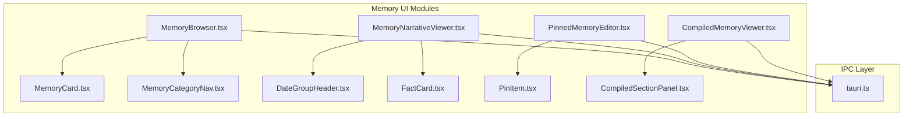
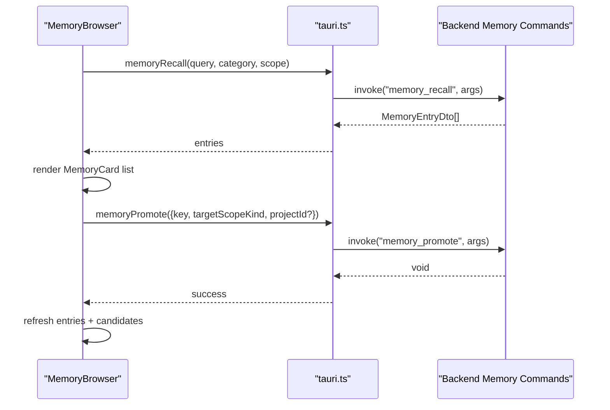
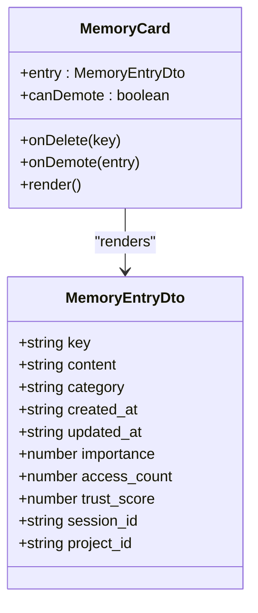
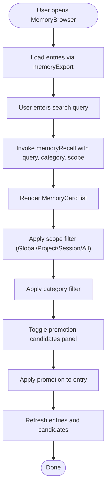
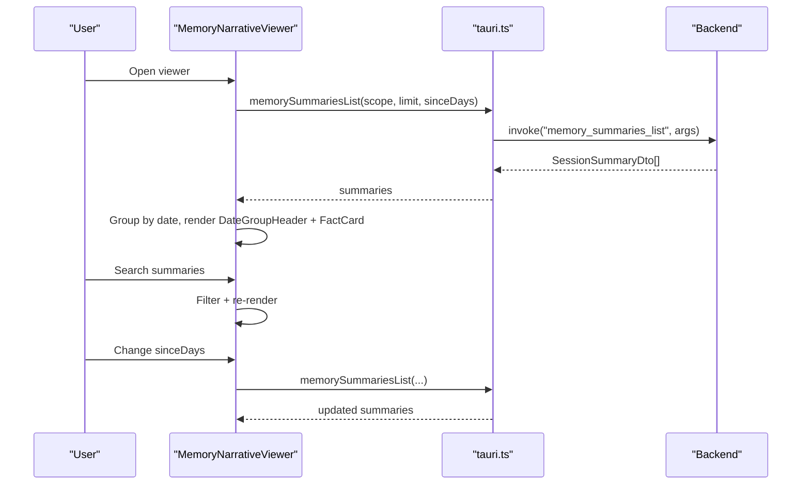
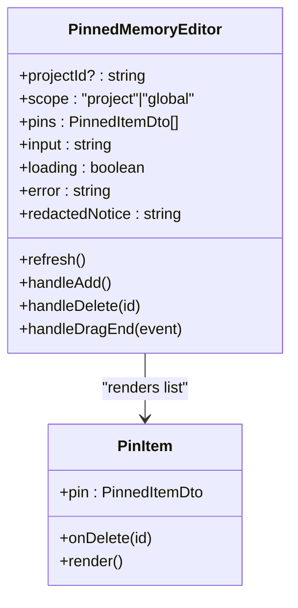
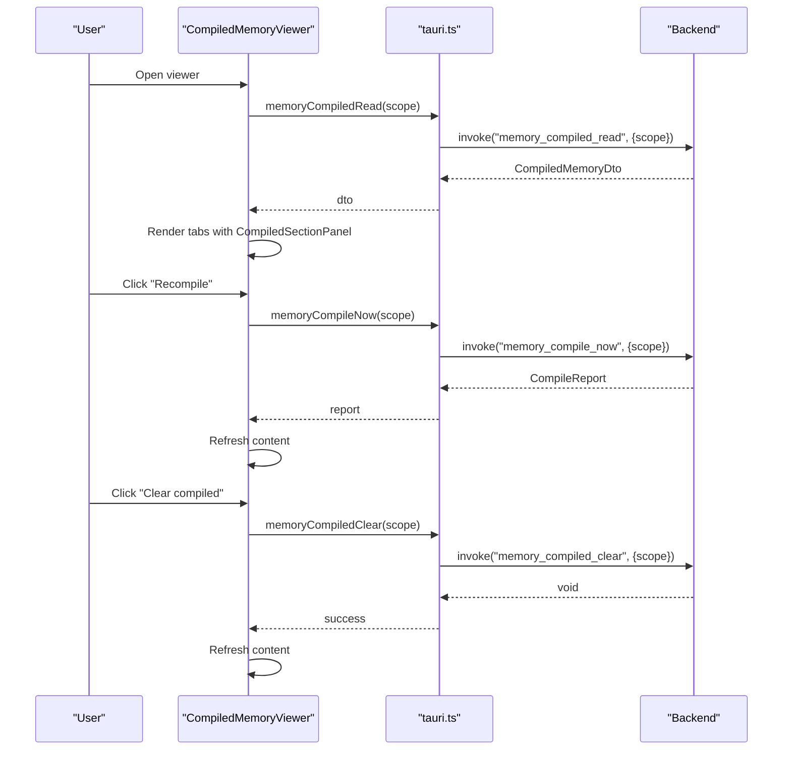
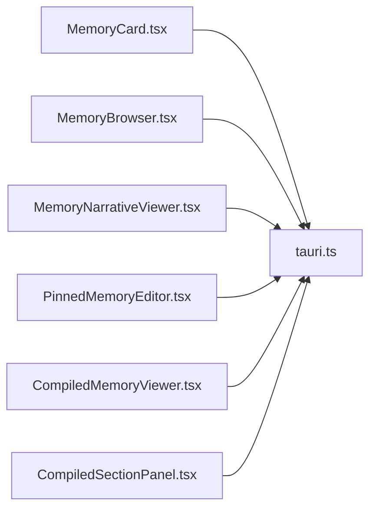

# Memory Management Components

<cite>
**Referenced Files in This Document**
- [MemoryCard.tsx](file://src/components/memory/MemoryCard.tsx)
- [MemoryBrowser.tsx](file://src/components/memory/MemoryBrowser.tsx)
- [MemoryNarrativeViewer.tsx](file://src/components/memory/narrative/MemoryNarrativeViewer.tsx)
- [PinnedMemoryEditor.tsx](file://src/components/memory/pinned/PinnedMemoryEditor.tsx)
- [CompiledMemoryViewer.tsx](file://src/components/memory/compiled/CompiledMemoryViewer.tsx)
- [CompiledSectionPanel.tsx](file://src/components/memory/compiled/CompiledSectionPanel.tsx)
- [MemoryCategoryNav.tsx](file://src/components/memory/MemoryCategoryNav.tsx)
- [PinItem.tsx](file://src/components/memory/pinned/PinItem.tsx)
- [DateGroupHeader.tsx](file://src/components/memory/narrative/DateGroupHeader.tsx)
- [FactCard.tsx](file://src/components/memory/narrative/FactCard.tsx)
- [tauri.ts](file://src/lib/tauri.ts)
</cite>

## Table of Contents
1. [Introduction](#introduction)
2. [Project Structure](#project-structure)
3. [Core Components](#core-components)
4. [Architecture Overview](#architecture-overview)
5. [Detailed Component Analysis](#detailed-component-analysis)
6. [Dependency Analysis](#dependency-analysis)
7. [Performance Considerations](#performance-considerations)
8. [Troubleshooting Guide](#troubleshooting-guide)
9. [Conclusion](#conclusion)

## Introduction
This document provides comprehensive documentation for the memory management components in the if2Ai project. It covers MemoryCard, MemoryBrowser, MemoryNarrativeViewer, PinnedMemoryEditor, and compiled memory viewers. The documentation explains memory visualization patterns, search interfaces, and organization components. It details component props, filtering options, interaction patterns, examples of memory workflows, and component composition. Performance considerations for large memory datasets and real-time updates are included.

## Project Structure
The memory management UI is organized into several cohesive modules:
- Core memory browsing and editing: MemoryBrowser, MemoryCard, MemoryCategoryNav
- Narrative timeline: MemoryNarrativeViewer, DateGroupHeader, FactCard
- Pinned memory curation: PinnedMemoryEditor, PinItem
- Compiled memory viewer: CompiledMemoryViewer, CompiledSectionPanel
- IPC integration: tauri.ts (backend commands and DTOs)

**Diagram sources**
- [MemoryBrowser.tsx:60-496](file://src/components/memory/MemoryBrowser.tsx#L60-L496)
- [MemoryCard.tsx:112-191](file://src/components/memory/MemoryCard.tsx#L112-L191)
- [MemoryCategoryNav.tsx:26-50](file://src/components/memory/MemoryCategoryNav.tsx#L26-L50)
- [MemoryNarrativeViewer.tsx:45-226](file://src/components/memory/narrative/MemoryNarrativeViewer.tsx#L45-L226)
- [DateGroupHeader.tsx:17-26](file://src/components/memory/narrative/DateGroupHeader.tsx#L17-L26)
- [FactCard.tsx:19-59](file://src/components/memory/narrative/FactCard.tsx#L19-L59)
- [PinnedMemoryEditor.tsx:59-338](file://src/components/memory/pinned/PinnedMemoryEditor.tsx#L59-L338)
- [PinItem.tsx:18-58](file://src/components/memory/pinned/PinItem.tsx#L18-L58)
- [CompiledMemoryViewer.tsx:53-255](file://src/components/memory/compiled/CompiledMemoryViewer.tsx#L53-L255)
- [CompiledSectionPanel.tsx:45-75](file://src/components/memory/compiled/CompiledSectionPanel.tsx#L45-L75)
- [tauri.ts:1438-1711](file://src/lib/tauri.ts#L1438-L1711)

**Section sources**
- [MemoryBrowser.tsx:1-496](file://src/components/memory/MemoryBrowser.tsx#L1-L496)
- [MemoryCard.tsx:1-191](file://src/components/memory/MemoryCard.tsx#L1-L191)
- [MemoryNarrativeViewer.tsx:1-226](file://src/components/memory/narrative/MemoryNarrativeViewer.tsx#L1-L226)
- [PinnedMemoryEditor.tsx:1-338](file://src/components/memory/pinned/PinnedMemoryEditor.tsx#L1-L338)
- [CompiledMemoryViewer.tsx:1-255](file://src/components/memory/compiled/CompiledMemoryViewer.tsx#L1-L255)
- [tauri.ts:1438-1711](file://src/lib/tauri.ts#L1438-L1711)

## Core Components
This section documents the primary memory management components and their responsibilities.

- MemoryCard: Displays individual memory entries with metadata, trust score, importance, and scope indicators. Provides actions for deletion and demotion.
- MemoryBrowser: Main memory management interface with search, category filtering, scope selection, and promotion/demotion controls.
- MemoryNarrativeViewer: Timeline-based viewer for session summaries grouped by date with search and time range filters.
- PinnedMemoryEditor: Curates pinned memory entries with drag-to-reorder, character limits, and scope selection.
- CompiledMemoryViewer: Modal viewer for compiled memory sections (today, week, longterm, facts) with recompile and clear actions.
- Supporting components: MemoryCategoryNav, DateGroupHeader, FactCard, PinItem, CompiledSectionPanel.

Key props and behaviors:
- MemoryCard: entry, onDelete, onDemote, canDemote
- MemoryBrowser: onStartWindowDrag, activeProjectId, activeSessionId
- MemoryNarrativeViewer: open, onClose, scope
- PinnedMemoryEditor: projectId
- CompiledMemoryViewer: open, onClose, scope

**Section sources**
- [MemoryCard.tsx:30-49](file://src/components/memory/MemoryCard.tsx#L30-L49)
- [MemoryBrowser.tsx:44-51](file://src/components/memory/MemoryBrowser.tsx#L44-L51)
- [MemoryNarrativeViewer.tsx:22-32](file://src/components/memory/narrative/MemoryNarrativeViewer.tsx#L22-L32)
- [PinnedMemoryEditor.tsx:54-57](file://src/components/memory/pinned/PinnedMemoryEditor.tsx#L54-L57)
- [CompiledMemoryViewer.tsx:27-37](file://src/components/memory/compiled/CompiledMemoryViewer.tsx#L27-L37)

## Architecture Overview
The memory system follows a layered architecture:
- UI components (React) handle presentation and user interactions
- IPC layer (tauri.ts) bridges to backend commands
- Backend executes memory operations (recall, export, promote, demote, compile)
- Real-time updates via Tauri events

**Diagram sources**
- [MemoryBrowser.tsx:126-250](file://src/components/memory/MemoryBrowser.tsx#L126-L250)
- [tauri.ts:1468-1547](file://src/lib/tauri.ts#L1468-L1547)

**Section sources**
- [MemoryBrowser.tsx:1-496](file://src/components/memory/MemoryBrowser.tsx#L1-L496)
- [tauri.ts:1438-1591](file://src/lib/tauri.ts#L1438-L1591)

## Detailed Component Analysis

### MemoryCard Analysis
MemoryCard renders a single memory entry with:
- Key, category, and scope indicators (global/project/session)
- Content preview with line clamping
- Metadata: created time, access count, trust score with color-coded labels
- Importance progress bar
- Action buttons: demote (conditional), delete

**Diagram sources**
- [MemoryCard.tsx:15-49](file://src/components/memory/MemoryCard.tsx#L15-L49)

**Section sources**
- [MemoryCard.tsx:1-191](file://src/components/memory/MemoryCard.tsx#L1-L191)

### MemoryBrowser Analysis
MemoryBrowser provides:
- Search interface with Enter-key support
- Category navigation (Core/Daily/Conversation/All)
- Scope segmentation (Global/Project/Session/All)
- Promotion candidates panel with refresh and apply actions
- Deletion and demotion workflows with context-aware validation

**Diagram sources**
- [MemoryBrowser.tsx:111-250](file://src/components/memory/MemoryBrowser.tsx#L111-L250)

**Section sources**
- [MemoryBrowser.tsx:1-496](file://src/components/memory/MemoryBrowser.tsx#L1-L496)

### MemoryNarrativeViewer Analysis
MemoryNarrativeViewer presents session summaries as a timeline:
- Modal interface with refresh/close controls
- Search by summary text or session_id
- Time range selector (7/30/90/365 days)
- Grouping by date with sticky headers
- Fact cards with source type and message count

**Diagram sources**
- [MemoryNarrativeViewer.tsx:55-114](file://src/components/memory/narrative/MemoryNarrativeViewer.tsx#L55-L114)
- [tauri.ts:1701-1711](file://src/lib/tauri.ts#L1701-L1711)

**Section sources**
- [MemoryNarrativeViewer.tsx:1-226](file://src/components/memory/narrative/MemoryNarrativeViewer.tsx#L1-L226)

### PinnedMemoryEditor Analysis
PinnedMemoryEditor manages curated memory injected into system prompts:
- Scope tabs: Project/Global with context-aware disabling
- Project picker with localStorage fallback
- Drag-and-drop reordering via @dnd-kit
- Character counter and capacity checks
- Optimistic updates with server-side validation

**Diagram sources**
- [PinnedMemoryEditor.tsx:59-122](file://src/components/memory/pinned/PinnedMemoryEditor.tsx#L59-L122)
- [PinItem.tsx:18-58](file://src/components/memory/pinned/PinItem.tsx#L18-L58)

**Section sources**
- [PinnedMemoryEditor.tsx:1-338](file://src/components/memory/pinned/PinnedMemoryEditor.tsx#L1-L338)
- [PinItem.tsx:1-58](file://src/components/memory/pinned/PinItem.tsx#L1-L58)

### CompiledMemoryViewer Analysis
CompiledMemoryViewer displays the assembled memory.md and compiled sections:
- Modal with tabbed interface (memory.md, today, week, longterm, facts)
- Rebuild and clear actions with confirmation
- Relative timestamps and character counts
- Integrated with CompiledSectionPanel for rendering

**Diagram sources**
- [CompiledMemoryViewer.tsx:65-132](file://src/components/memory/compiled/CompiledMemoryViewer.tsx#L65-L132)
- [CompiledSectionPanel.tsx:45-75](file://src/components/memory/compiled/CompiledSectionPanel.tsx#L45-L75)
- [tauri.ts:1646-1671](file://src/lib/tauri.ts#L1646-L1671)

**Section sources**
- [CompiledMemoryViewer.tsx:1-255](file://src/components/memory/compiled/CompiledMemoryViewer.tsx#L1-L255)
- [CompiledSectionPanel.tsx:1-75](file://src/components/memory/compiled/CompiledSectionPanel.tsx#L1-L75)

## Dependency Analysis
The components depend on shared IPC functions and TypeScript DTOs defined in tauri.ts. The dependency graph shows how UI components interact with backend commands.

**Diagram sources**
- [MemoryCard.tsx:1-191](file://src/components/memory/MemoryCard.tsx#L1-L191)
- [MemoryBrowser.tsx:1-496](file://src/components/memory/MemoryBrowser.tsx#L1-L496)
- [MemoryNarrativeViewer.tsx:1-226](file://src/components/memory/narrative/MemoryNarrativeViewer.tsx#L1-L226)
- [PinnedMemoryEditor.tsx:1-338](file://src/components/memory/pinned/PinnedMemoryEditor.tsx#L1-L338)
- [CompiledMemoryViewer.tsx:1-255](file://src/components/memory/compiled/CompiledMemoryViewer.tsx#L1-L255)
- [CompiledSectionPanel.tsx:1-75](file://src/components/memory/compiled/CompiledSectionPanel.tsx#L1-L75)
- [tauri.ts:1438-1711](file://src/lib/tauri.ts#L1438-L1711)

**Section sources**
- [tauri.ts:1438-1711](file://src/lib/tauri.ts#L1438-L1711)

## Performance Considerations
- Large dataset pagination: MemoryBrowser uses a fixed page size for export/search results. Consider implementing virtualized lists for very large libraries.
- Debounced search: Implement debouncing for memoryRecall to reduce backend load during rapid typing.
- Efficient filtering: MemoryNarrativeViewer filters in-memory; for large timelines, consider backend-side filtering or pagination.
- Compiled cache: CompiledMemoryViewer leverages cached compiled sections; recompile only when necessary and monitor elapsed_ms for user feedback.
- Real-time updates: Use Tauri events to refresh views without polling. MemoryBrowser listens for memory lifecycle events to keep the UI current.
- Rendering optimization: Use React.memo for list items and useMemo for derived data (e.g., grouped narratives) to minimize re-renders.

## Troubleshooting Guide
Common issues and resolutions:
- Scope context errors: MemoryBrowser validates activeProjectId and activeSessionId before enabling scope-specific actions. Ensure proper context is provided when using project/session scopes.
- Promotion/demotion failures: Errors are surfaced via toast notifications. Verify that target scopes and required IDs are available before attempting promotions/demotions.
- Narrator timeline empty: MemoryNarrativeViewer may show empty state if no summaries exist. Trigger RollingSummarizer to populate session summaries.
- Pinned memory limits: PinnedMemoryEditor enforces MAX_CHARS (500) and MAX_PINS (50). Exceeding limits disables add actions.
- Compiled viewer errors: CompiledMemoryViewer handles backend errors with toast notifications. Use "Clear compiled" to reset cache if corruption occurs.

**Section sources**
- [MemoryBrowser.tsx:193-232](file://src/components/memory/MemoryBrowser.tsx#L193-L232)
- [MemoryNarrativeViewer.tsx:84-94](file://src/components/memory/narrative/MemoryNarrativeViewer.tsx#L84-L94)
- [PinnedMemoryEditor.tsx:132-163](file://src/components/memory/pinned/PinnedMemoryEditor.tsx#L132-L163)
- [CompiledMemoryViewer.tsx:116-132](file://src/components/memory/compiled/CompiledMemoryViewer.tsx#L116-L132)

## Conclusion
The memory management components provide a comprehensive toolkit for browsing, organizing, and visualizing memory data. The modular design allows users to switch between key-value browsing, narrative timelines, pinned memory curation, and compiled memory inspection. Robust IPC integration ensures reliable backend communication, while thoughtful UI patterns support efficient workflows. Performance considerations and troubleshooting guidance help maintain responsiveness and reliability for large datasets and real-time updates.