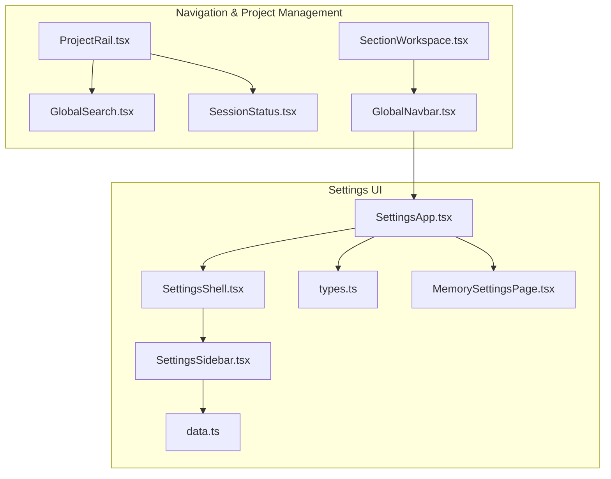
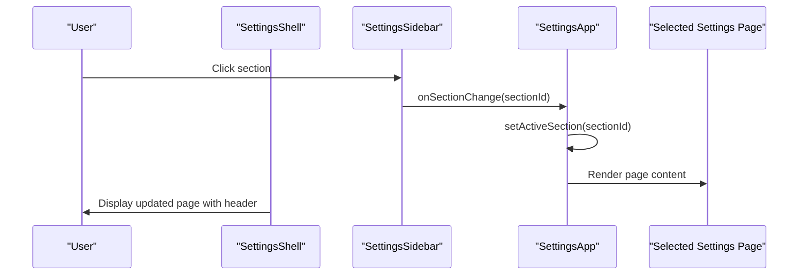
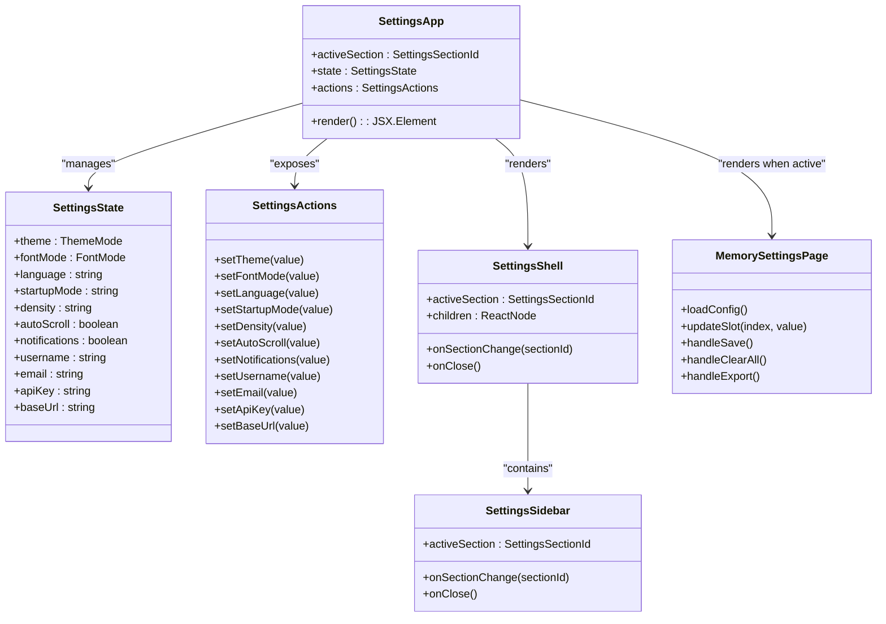
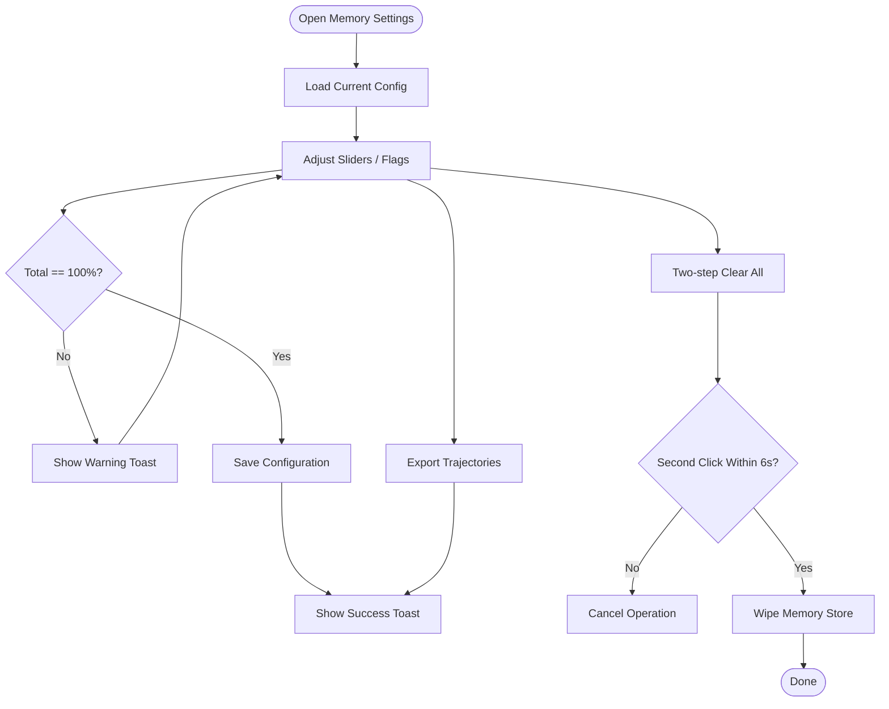
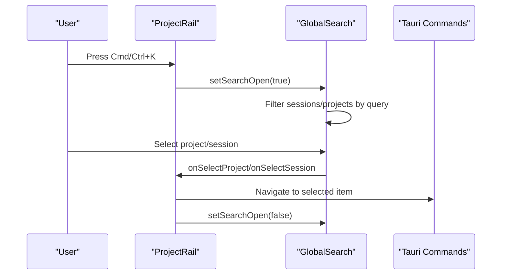
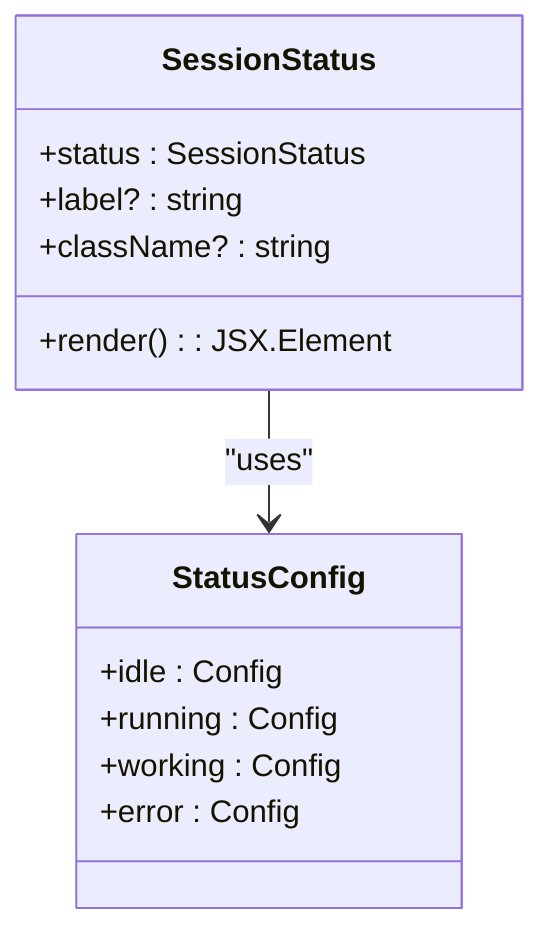
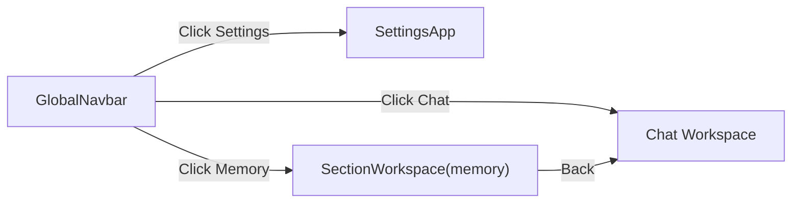
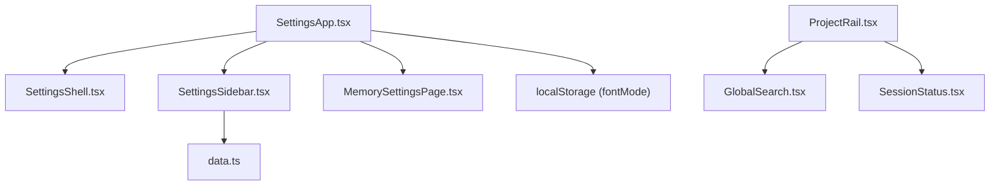

# Settings and Navigation

<cite>
**Referenced Files in This Document**
- [SettingsApp.tsx](file://src/modules/settings/SettingsApp.tsx)
- [MemorySettingsPage.tsx](file://src/modules/settings/pages/MemorySettingsPage.tsx)
- [ProjectRail.tsx](file://src/components/ProjectRail.tsx)
- [GlobalSearch.tsx](file://src/components/GlobalSearch.tsx)
- [SessionStatus.tsx](file://src/components/SessionStatus.tsx)
- [SettingsShell.tsx](file://src/modules/settings/components/SettingsShell.tsx)
- [SettingsSidebar.tsx](file://src/modules/settings/components/SettingsSidebar.tsx)
- [data.ts](file://src/modules/settings/data.ts)
- [types.ts](file://src/modules/settings/types.ts)
- [GlobalNavbar.tsx](file://src/modules/app-shell/components/GlobalNavbar.tsx)
- [SectionWorkspace.tsx](file://src/modules/app-shell/components/SectionWorkspace.tsx)
</cite>

## Table of Contents
1. [Introduction](#introduction)
2. [Project Structure](#project-structure)
3. [Core Components](#core-components)
4. [Architecture Overview](#architecture-overview)
5. [Detailed Component Analysis](#detailed-component-analysis)
6. [Dependency Analysis](#dependency-analysis)
7. [Performance Considerations](#performance-considerations)
8. [Troubleshooting Guide](#troubleshooting-guide)
9. [Conclusion](#conclusion)

## Introduction
This document explains the settings and navigation systems in the application, focusing on SettingsApp, MemorySettings, ProjectRail, GlobalSearch, and SessionStatus. It covers the settings interface patterns, navigation hierarchies, project management components, integration with application state and user preferences, accessibility features, and keyboard navigation support. It also provides examples of settings workflows and navigation patterns to help developers and users understand how to configure and operate the system effectively.

## Project Structure
The settings and navigation features are organized into two primary areas:
- Settings UI: Implemented under src/modules/settings with a shell, sidebar, and modular pages.
- Navigation and project management: Implemented under src/components and integrated into the application shell.

**Diagram sources**
- [SettingsApp.tsx:1-230](file://src/modules/settings/SettingsApp.tsx#L1-L230)
- [SettingsShell.tsx:1-70](file://src/modules/settings/components/SettingsShell.tsx#L1-L70)
- [SettingsSidebar.tsx:1-93](file://src/modules/settings/components/SettingsSidebar.tsx#L1-L93)
- [data.ts:1-110](file://src/modules/settings/data.ts#L1-L110)
- [types.ts:1-63](file://src/modules/settings/types.ts#L1-L63)
- [MemorySettingsPage.tsx:1-629](file://src/modules/settings/pages/MemorySettingsPage.tsx#L1-L629)
- [ProjectRail.tsx:1-1002](file://src/components/ProjectRail.tsx#L1-L1002)
- [GlobalSearch.tsx:1-246](file://src/components/GlobalSearch.tsx#L1-L246)
- [SessionStatus.tsx:1-52](file://src/components/SessionStatus.tsx#L1-L52)
- [GlobalNavbar.tsx:1-100](file://src/modules/app-shell/components/GlobalNavbar.tsx#L1-L100)
- [SectionWorkspace.tsx:1-41](file://src/modules/app-shell/components/SectionWorkspace.tsx#L1-L41)

**Section sources**
- [SettingsApp.tsx:1-230](file://src/modules/settings/SettingsApp.tsx#L1-L230)
- [SettingsShell.tsx:1-70](file://src/modules/settings/components/SettingsShell.tsx#L1-L70)
- [SettingsSidebar.tsx:1-93](file://src/modules/settings/components/SettingsSidebar.tsx#L1-L93)
- [data.ts:1-110](file://src/modules/settings/data.ts#L1-L110)
- [types.ts:1-63](file://src/modules/settings/types.ts#L1-L63)
- [MemorySettingsPage.tsx:1-629](file://src/modules/settings/pages/MemorySettingsPage.tsx#L1-L629)
- [ProjectRail.tsx:1-1002](file://src/components/ProjectRail.tsx#L1-L1002)
- [GlobalSearch.tsx:1-246](file://src/components/GlobalSearch.tsx#L1-L246)
- [SessionStatus.tsx:1-52](file://src/components/SessionStatus.tsx#L1-L52)
- [GlobalNavbar.tsx:1-100](file://src/modules/app-shell/components/GlobalNavbar.tsx#L1-L100)
- [SectionWorkspace.tsx:1-41](file://src/modules/app-shell/components/SectionWorkspace.tsx#L1-L41)

## Core Components
- SettingsApp: Central orchestrator for the settings UI. Manages active section, state, actions, and page rendering. Integrates with local storage for persistent preferences and Tauri commands for skills and memory operations.
- MemorySettingsPage: Dedicated page for memory configuration, including token budget allocation, control plane toggles, promotion thresholds, trajectory export, and destructive clear-all actions with confirmation flows.
- ProjectRail: Project and session navigation rail with sorting, filtering, pinning, inline renaming, and keyboard shortcuts. Integrates with GlobalSearch for unified navigation.
- GlobalSearch: Modal command palette for quick access to projects and sessions, with recent activity and search suggestions.
- SessionStatus: Status indicator for session lifecycle states with distinct icons, labels, and optional animation.

**Section sources**
- [SettingsApp.tsx:36-227](file://src/modules/settings/SettingsApp.tsx#L36-L227)
- [MemorySettingsPage.tsx:45-629](file://src/modules/settings/pages/MemorySettingsPage.tsx#L45-L629)
- [ProjectRail.tsx:79-373](file://src/components/ProjectRail.tsx#L79-L373)
- [GlobalSearch.tsx:44-246](file://src/components/GlobalSearch.tsx#L44-L246)
- [SessionStatus.tsx:41-52](file://src/components/SessionStatus.tsx#L41-L52)

## Architecture Overview
The settings architecture follows a shell-and-pages pattern:
- SettingsShell hosts the sidebar and page content area, handles window dragging, and integrates toast notifications.
- SettingsSidebar lists all sections with icons and labels, driven by a centralized data definition.
- SettingsApp manages state, actions, and routes to the appropriate page component based on the active section.

**Diagram sources**
- [SettingsShell.tsx:27-68](file://src/modules/settings/components/SettingsShell.tsx#L27-L68)
- [SettingsSidebar.tsx:31-92](file://src/modules/settings/components/SettingsSidebar.tsx#L31-L92)
- [SettingsApp.tsx:36-227](file://src/modules/settings/SettingsApp.tsx#L36-L227)
- [data.ts:17-110](file://src/modules/settings/data.ts#L17-L110)

**Section sources**
- [SettingsShell.tsx:1-70](file://src/modules/settings/components/SettingsShell.tsx#L1-L70)
- [SettingsSidebar.tsx:1-93](file://src/modules/settings/components/SettingsSidebar.tsx#L1-L93)
- [SettingsApp.tsx:1-230](file://src/modules/settings/SettingsApp.tsx#L1-L230)
- [data.ts:1-110](file://src/modules/settings/data.ts#L1-L110)

## Detailed Component Analysis

### SettingsApp and Settings Pages
SettingsApp centralizes state and actions, exposes a consistent SettingsState/SettingsActions contract, and renders the active page. It persists font mode to local storage and toggles a body class accordingly. It also manages skills lifecycle and memory operations via Tauri commands.

**Diagram sources**
- [SettingsApp.tsx:36-227](file://src/modules/settings/SettingsApp.tsx#L36-L227)
- [types.ts:30-61](file://src/modules/settings/types.ts#L30-L61)
- [SettingsShell.tsx:27-68](file://src/modules/settings/components/SettingsShell.tsx#L27-L68)
- [SettingsSidebar.tsx:31-92](file://src/modules/settings/components/SettingsSidebar.tsx#L31-L92)
- [MemorySettingsPage.tsx:45-629](file://src/modules/settings/pages/MemorySettingsPage.tsx#L45-L629)

**Section sources**
- [SettingsApp.tsx:36-227](file://src/modules/settings/SettingsApp.tsx#L36-L227)
- [types.ts:1-63](file://src/modules/settings/types.ts#L1-L63)
- [SettingsShell.tsx:1-70](file://src/modules/settings/components/SettingsShell.tsx#L1-L70)
- [SettingsSidebar.tsx:1-93](file://src/modules/settings/components/SettingsSidebar.tsx#L1-L93)
- [MemorySettingsPage.tsx:1-629](file://src/modules/settings/pages/MemorySettingsPage.tsx#L1-L629)

### MemorySettingsPage
MemorySettingsPage provides:
- Token budget configuration with percentage sliders and validation.
- Control plane toggles for recall mode and policy enforcement.
- Promotion thresholds for session-to-project and project-to-global upgrades.
- Compiled memory viewer and narrative timeline accessors.
- Trajectory export and a two-step destructive clear-all operation.

**Diagram sources**
- [MemorySettingsPage.tsx:80-185](file://src/modules/settings/pages/MemorySettingsPage.tsx#L80-L185)

**Section sources**
- [MemorySettingsPage.tsx:45-629](file://src/modules/settings/pages/MemorySettingsPage.tsx#L45-L629)

### ProjectRail and GlobalSearch
ProjectRail provides:
- Project grouping with expand/collapse and inline renaming.
- Session lists with pin/unpin, rename, delete, and running indicators.
- Sorting by recency or alphabet, and hiding empty projects.
- Keyboard shortcut to open GlobalSearch (Cmd/Ctrl+K).
- Pinned sessions section with accessible hover/keyboard interactions.

GlobalSearch offers:
- Unified command palette for projects and sessions.
- Recent sessions fallback when no query is present.
- Search by session title and project name.
- Keyboard hints for navigation and selection.

**Diagram sources**
- [ProjectRail.tsx:109-119](file://src/components/ProjectRail.tsx#L109-L119)
- [ProjectRail.tsx:361-370](file://src/components/ProjectRail.tsx#L361-L370)
- [GlobalSearch.tsx:89-97](file://src/components/GlobalSearch.tsx#L89-L97)

**Section sources**
- [ProjectRail.tsx:79-373](file://src/components/ProjectRail.tsx#L79-L373)
- [GlobalSearch.tsx:44-246](file://src/components/GlobalSearch.tsx#L44-L246)

### SessionStatus
SessionStatus displays the current session state with:
- Distinct icons and labels for idle, running, working, and error.
- Optional spin animation for running state.
- CSS variable-based color theming.

**Diagram sources**
- [SessionStatus.tsx:41-52](file://src/components/SessionStatus.tsx#L41-L52)

**Section sources**
- [SessionStatus.tsx:1-52](file://src/components/SessionStatus.tsx#L1-L52)

### Navigation Integration
GlobalNavbar provides top-level navigation to Chat, Memory, and Settings. SectionWorkspace serves as a placeholder for future sections (Skills, Automation) with a back-to-chat action.

**Diagram sources**
- [GlobalNavbar.tsx:6-99](file://src/modules/app-shell/components/GlobalNavbar.tsx#L6-L99)
- [SectionWorkspace.tsx:5-41](file://src/modules/app-shell/components/SectionWorkspace.tsx#L5-L41)

**Section sources**
- [GlobalNavbar.tsx:1-100](file://src/modules/app-shell/components/GlobalNavbar.tsx#L1-L100)
- [SectionWorkspace.tsx:1-41](file://src/modules/app-shell/components/SectionWorkspace.tsx#L1-L41)

## Dependency Analysis
- SettingsApp depends on SettingsShell and SettingsSidebar for layout and navigation, and on individual page components for content.
- SettingsSidebar depends on SETTINGS_SECTIONS for items and icons.
- ProjectRail depends on GlobalSearch and SessionStatus for integrated UX.
- GlobalSearch depends on Command components for the palette UI.
- SettingsApp persists font mode via localStorage and toggles a body class for themeing.

**Diagram sources**
- [SettingsApp.tsx:1-230](file://src/modules/settings/SettingsApp.tsx#L1-L230)
- [SettingsShell.tsx:1-70](file://src/modules/settings/components/SettingsShell.tsx#L1-L70)
- [SettingsSidebar.tsx:1-93](file://src/modules/settings/components/SettingsSidebar.tsx#L1-L93)
- [data.ts:1-110](file://src/modules/settings/data.ts#L1-L110)
- [MemorySettingsPage.tsx:1-629](file://src/modules/settings/pages/MemorySettingsPage.tsx#L1-L629)
- [ProjectRail.tsx:1-1002](file://src/components/ProjectRail.tsx#L1-L1002)
- [GlobalSearch.tsx:1-246](file://src/components/GlobalSearch.tsx#L1-L246)
- [SessionStatus.tsx:1-52](file://src/components/SessionStatus.tsx#L1-L52)

**Section sources**
- [SettingsApp.tsx:1-230](file://src/modules/settings/SettingsApp.tsx#L1-L230)
- [SettingsSidebar.tsx:1-93](file://src/modules/settings/components/SettingsSidebar.tsx#L1-L93)
- [data.ts:1-110](file://src/modules/settings/data.ts#L1-L110)
- [ProjectRail.tsx:1-1002](file://src/components/ProjectRail.tsx#L1-L1002)
- [GlobalSearch.tsx:1-246](file://src/components/GlobalSearch.tsx#L1-L246)
- [SessionStatus.tsx:1-52](file://src/components/SessionStatus.tsx#L1-L52)

## Performance Considerations
- ProjectRail uses memoization for derived data (e.g., pinned sessions, sorted projects) to minimize re-renders during frequent updates.
- GlobalSearch filters sessions lazily and limits recent results when no query is present.
- SettingsApp defers skills loading until the skills section is opened to reduce initial overhead.
- Local storage reads/writes for font mode are lightweight and debounced via effect hooks.

[No sources needed since this section provides general guidance]

## Troubleshooting Guide
- Settings not saving: Verify localStorage availability and that SettingsApp writes to localStorage for font mode. Check toast notifications for errors during save operations.
- Skills not updating: Ensure the active section is 'skills' so that refresh is triggered. Confirm network connectivity for Tauri commands.
- Memory clear-all unintended: The destructive action requires a two-step confirmation within a short window; ensure the UI reflects the armed state and that the user completes the second click promptly.
- GlobalSearch not opening: Confirm the Cmd/Ctrl+K keyboard shortcut is pressed and that the listener is attached to the window.

**Section sources**
- [SettingsApp.tsx:121-137](file://src/modules/settings/SettingsApp.tsx#L121-L137)
- [MemorySettingsPage.tsx:150-171](file://src/modules/settings/pages/MemorySettingsPage.tsx#L150-L171)
- [ProjectRail.tsx:109-119](file://src/components/ProjectRail.tsx#L109-L119)

## Conclusion
The settings and navigation system combines a robust shell-and-pages architecture with practical project and session management. SettingsApp centralizes state and actions, while dedicated pages like MemorySettingsPage provide deep configuration controls. ProjectRail and GlobalSearch streamline navigation across projects and sessions, and SessionStatus communicates session state clearly. Together, these components deliver a coherent, accessible, and performant user experience.