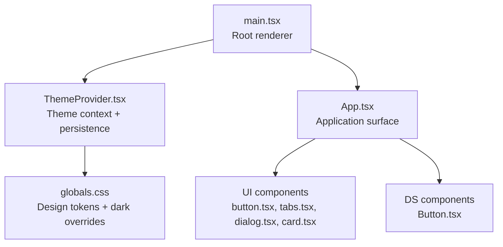
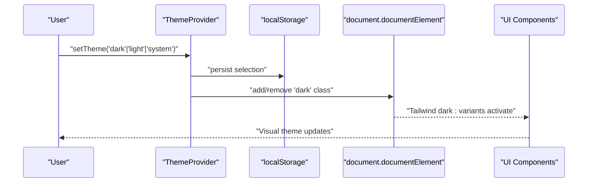
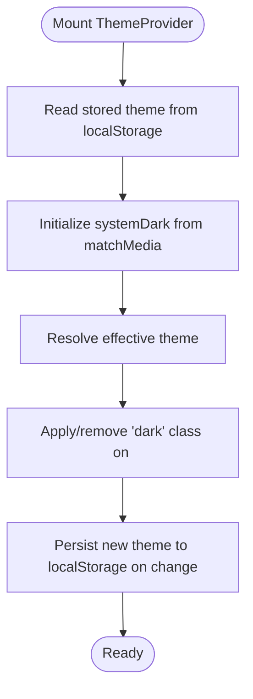
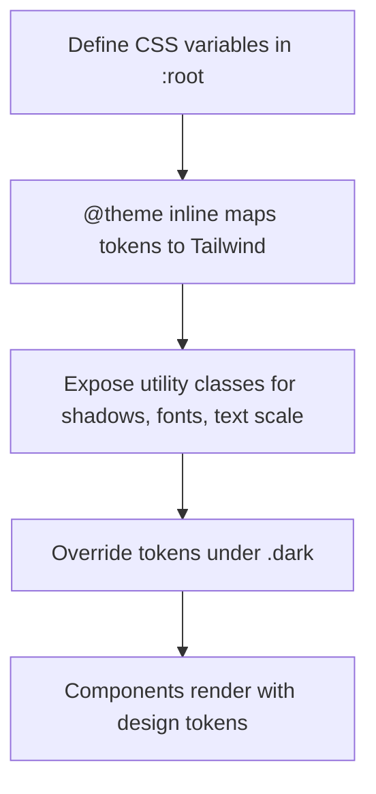
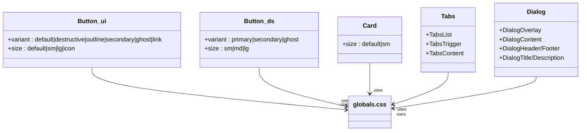
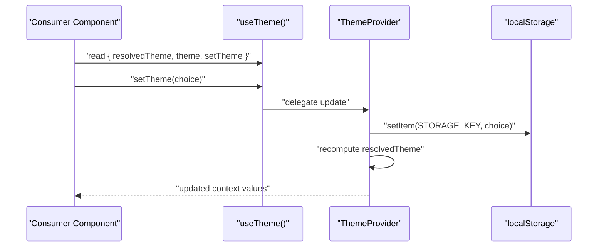
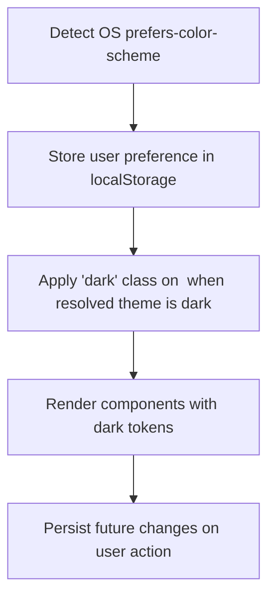
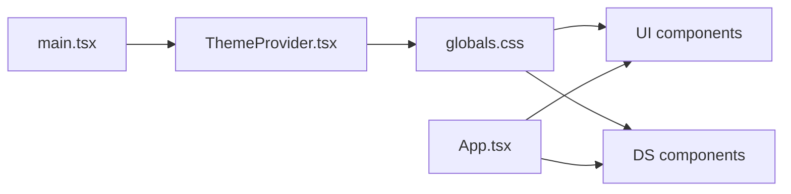

# Theming and Styling

<cite>
**Referenced Files in This Document**
- [ThemeProvider.tsx](file://src/components/theme/ThemeProvider.tsx)
- [globals.css](file://src/styles/globals.css)
- [main.tsx](file://src/main.tsx)
- [App.tsx](file://src/App.tsx)
- [button.tsx](file://src/components/ui/button.tsx)
- [tabs.tsx](file://src/components/ui/tabs.tsx)
- [dialog.tsx](file://src/components/ui/dialog.tsx)
- [card.tsx](file://src/components/ui/card.tsx)
- [Button.tsx](file://src/components/ds/Button.tsx)
</cite>

## Table of Contents
1. [Introduction](#introduction)
2. [Project Structure](#project-structure)
3. [Core Components](#core-components)
4. [Architecture Overview](#architecture-overview)
5. [Detailed Component Analysis](#detailed-component-analysis)
6. [Dependency Analysis](#dependency-analysis)
7. [Performance Considerations](#performance-considerations)
8. [Troubleshooting Guide](#troubleshooting-guide)
9. [Conclusion](#conclusion)
10. [Appendices](#appendices)

## Introduction
This document explains the theming and styling system used across the application. It covers how themes are initialized and switched, how design tokens are organized and applied, and how components are styled using Tailwind CSS and shadcn/ui primitives. It also documents dark/light mode behavior, accessibility considerations, and practical examples for customization.

## Project Structure
The styling system is built around:
- A root ThemeProvider that manages theme state and persists preferences
- A global CSS stylesheet that defines design tokens and Tailwind-based utilities
- UI components that consume design tokens and Tailwind utilities
- Optional DS (“design system”) components that provide additional styling patterns

**Diagram sources**
- [main.tsx:37-43](file://src/main.tsx#L37-L43)
- [ThemeProvider.tsx:52-95](file://src/components/theme/ThemeProvider.tsx#L52-L95)
- [globals.css:12-94](file://src/styles/globals.css#L12-L94)
- [App.tsx:89-800](file://src/App.tsx#L89-L800)
- [button.tsx:1-57](file://src/components/ui/button.tsx#L1-L57)
- [tabs.tsx:1-53](file://src/components/ui/tabs.tsx#L1-L53)
- [dialog.tsx:1-112](file://src/components/ui/dialog.tsx#L1-L112)
- [card.tsx:1-104](file://src/components/ui/card.tsx#L1-L104)
- [Button.tsx:1-69](file://src/components/ds/Button.tsx#L1-L69)

**Section sources**
- [main.tsx:37-43](file://src/main.tsx#L37-L43)
- [globals.css:12-94](file://src/styles/globals.css#L12-L94)

## Core Components
- ThemeProvider: Manages theme preference, system color-scheme detection, persistence, and applies the dark class to the document root.
- globals.css: Defines the design token system (typography, spacing, radius, shadows, colors) and provides dark-mode overrides.
- UI components: Built with Tailwind and shadcn/ui primitives, consuming design tokens via CSS variables.
- DS components: Provide additional component-level styling patterns using design tokens.

**Section sources**
- [ThemeProvider.tsx:14-100](file://src/components/theme/ThemeProvider.tsx#L14-L100)
- [globals.css:100-378](file://src/styles/globals.css#L100-L378)
- [button.tsx:6-34](file://src/components/ui/button.tsx#L6-L34)
- [Button.tsx:18-31](file://src/components/ds/Button.tsx#L18-L31)

## Architecture Overview
The theming architecture combines React context for state with CSS custom properties and Tailwind variants.

**Diagram sources**
- [ThemeProvider.tsx:52-95](file://src/components/theme/ThemeProvider.tsx#L52-L95)
- [globals.css:276-378](file://src/styles/globals.css#L276-L378)

## Detailed Component Analysis

### ThemeProvider
- Purpose: Centralizes theme state, integrates OS color-scheme detection, persists user choice, and toggles the dark class on the document element.
- Key behaviors:
  - Reads stored preference from localStorage with a fallback to system
  - Subscribes to OS media query changes for dark mode
  - Computes resolved theme and updates the HTML class accordingly
  - Exposes a hook to read and update theme

**Diagram sources**
- [ThemeProvider.tsx:52-95](file://src/components/theme/ThemeProvider.tsx#L52-L95)

**Section sources**
- [ThemeProvider.tsx:14-100](file://src/components/theme/ThemeProvider.tsx#L14-L100)

### Design Token System (CSS Variables)
- Tokens are defined in :root and mapped into Tailwind’s @theme system for use across components.
- Tokens include:
  - Typography: fonts, sizes, weights, line heights, letter spacings
  - Spacing and radii
  - Shadow system
  - Color palette: background, foreground, primary, secondary, muted, accent, destructive, borders, rings, and brand colors
  - Specialized tokens: sidebar, inspector, status colors, chart palette, surface layers
- Dark mode overrides adjust tokens under .dark to preserve the intended aesthetic on darker backgrounds.

**Diagram sources**
- [globals.css:12-94](file://src/styles/globals.css#L12-L94)
- [globals.css:276-378](file://src/styles/globals.css#L276-L378)

**Section sources**
- [globals.css:100-378](file://src/styles/globals.css#L100-L378)

### Component Styling Approaches
- Tailwind + shadcn/ui primitives: Components like Button, Tabs, Dialog, and Card use Tailwind utilities and shadcn/ui slots to compose styles consistently.
- Variants and sizes: Buttons define variant and size variants via class composition for consistent styling.
- DS Button: Provides explicit variant and size mappings using design tokens for a cohesive DS look.

**Diagram sources**
- [button.tsx:6-34](file://src/components/ui/button.tsx#L6-L34)
- [Button.tsx:18-31](file://src/components/ds/Button.tsx#L18-L31)
- [card.tsx:5-19](file://src/components/ui/card.tsx#L5-L19)
- [tabs.tsx:7-35](file://src/components/ui/tabs.tsx#L7-L35)
- [dialog.tsx:11-51](file://src/components/ui/dialog.tsx#L11-L51)

**Section sources**
- [button.tsx:6-34](file://src/components/ui/button.tsx#L6-L34)
- [Button.tsx:18-31](file://src/components/ds/Button.tsx#L18-L31)
- [card.tsx:5-19](file://src/components/ui/card.tsx#L5-L19)
- [tabs.tsx:7-35](file://src/components/ui/tabs.tsx#L7-L35)
- [dialog.tsx:11-51](file://src/components/ui/dialog.tsx#L11-L51)

### Theme Switching Mechanism
- Consumers call the useTheme hook to read or update the theme.
- The hook returns resolvedTheme, theme, and setTheme.
- setTheme persists the new preference and triggers DOM updates.

**Diagram sources**
- [ThemeProvider.tsx:97-100](file://src/components/theme/ThemeProvider.tsx#L97-L100)
- [ThemeProvider.tsx:81-88](file://src/components/theme/ThemeProvider.tsx#L81-L88)

**Section sources**
- [ThemeProvider.tsx:97-100](file://src/components/theme/ThemeProvider.tsx#L97-L100)
- [ThemeProvider.tsx:81-88](file://src/components/theme/ThemeProvider.tsx#L81-L88)

### Dark/Light Mode Support
- System-aware: ThemeProvider detects OS preference and respects user overrides.
- Persistence: User selections are saved to localStorage and restored on mount.
- Tailwind dark: The dark class on <html> enables dark variants and activates .dark token overrides.

**Diagram sources**
- [ThemeProvider.tsx:52-95](file://src/components/theme/ThemeProvider.tsx#L52-L95)
- [globals.css:276-378](file://src/styles/globals.css#L276-L378)

**Section sources**
- [ThemeProvider.tsx:52-95](file://src/components/theme/ThemeProvider.tsx#L52-L95)
- [globals.css:276-378](file://src/styles/globals.css#L276-L378)

### Accessibility Considerations
- Color scheme awareness: The html element declares color-scheme: light dark to help browsers and assistive technologies interpret theme changes.
- Contrast and readability: Design tokens define foreground/background pairs and muted/accent colors to maintain legibility across modes.
- Focus states: Components include focus-visible outlines and ring utilities to improve keyboard navigation visibility.
- Semantic markup: Components use proper roles and labels (e.g., sr-only text for controls) to aid screen readers.

**Section sources**
- [globals.css:384-406](file://src/styles/globals.css#L384-L406)
- [dialog.tsx:43-48](file://src/components/ui/dialog.tsx#L43-L48)
- [button.tsx:6-34](file://src/components/ui/button.tsx#L6-L34)

### Examples of Theme Customization and Component Styling
- Customize a button:
  - Use UI button variants and sizes for standard cases
  - Use DS Button for brand-specific primary/secondary/ghost styles
- Apply dark mode:
  - Toggle theme via useTheme().setTheme
  - Rely on .dark token overrides for consistent visuals
- Extend design tokens:
  - Add new CSS variables in :root
  - Map them into @theme inline
  - Consume via Tailwind utilities or component props

**Section sources**
- [button.tsx:6-34](file://src/components/ui/button.tsx#L6-L34)
- [Button.tsx:18-31](file://src/components/ds/Button.tsx#L18-L31)
- [globals.css:12-94](file://src/styles/globals.css#L12-L94)

## Dependency Analysis
The styling system depends on:
- ThemeProvider for theme state and persistence
- globals.css for design tokens and dark overrides
- UI components for rendering with Tailwind/shadcn/ui
- DS components for additional design system patterns

**Diagram sources**
- [main.tsx:37-43](file://src/main.tsx#L37-L43)
- [ThemeProvider.tsx:52-95](file://src/components/theme/ThemeProvider.tsx#L52-L95)
- [globals.css:12-94](file://src/styles/globals.css#L12-L94)
- [App.tsx:89-800](file://src/App.tsx#L89-L800)

**Section sources**
- [main.tsx:37-43](file://src/main.tsx#L37-L43)
- [App.tsx:89-800](file://src/App.tsx#L89-L800)

## Performance Considerations
- CSS variable lookups are efficient; avoid excessive re-computation of styles in components.
- Prefer Tailwind utilities for common patterns to reduce CSS bundle size.
- Keep dark overrides minimal and focused on necessary adjustments.

## Troubleshooting Guide
- Theme does not persist:
  - Verify localStorage availability and absence of storage errors
  - Confirm ThemeProvider writes to localStorage on setTheme
- Dark mode not applying:
  - Ensure the 'dark' class is present on <html> when resolved theme is dark
  - Confirm .dark token overrides are defined and not overridden elsewhere
- Visual regressions after changes:
  - Check that new tokens are mapped via @theme inline
  - Validate Tailwind utilities and variant usage

**Section sources**
- [ThemeProvider.tsx:81-88](file://src/components/theme/ThemeProvider.tsx#L81-L88)
- [globals.css:276-378](file://src/styles/globals.css#L276-L378)

## Conclusion
The theming and styling system centers on a robust ThemeProvider, a comprehensive design token layer, and UI components that consistently consume tokens via Tailwind and shadcn/ui. Dark/light mode is system-aware, persistent, and visually coherent thanks to carefully curated token overrides.

## Appendices
- Example: Switching theme programmatically
  - Call useTheme().setTheme('dark' | 'light' | 'system')
- Example: Creating a new DS component with design tokens
  - Define variant mappings using design tokens
  - Compose with Tailwind utilities for layout and spacing