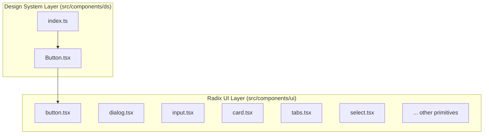
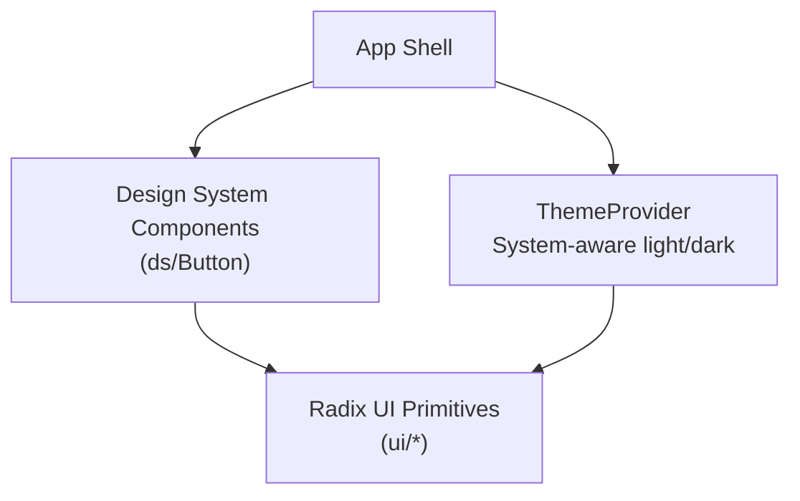
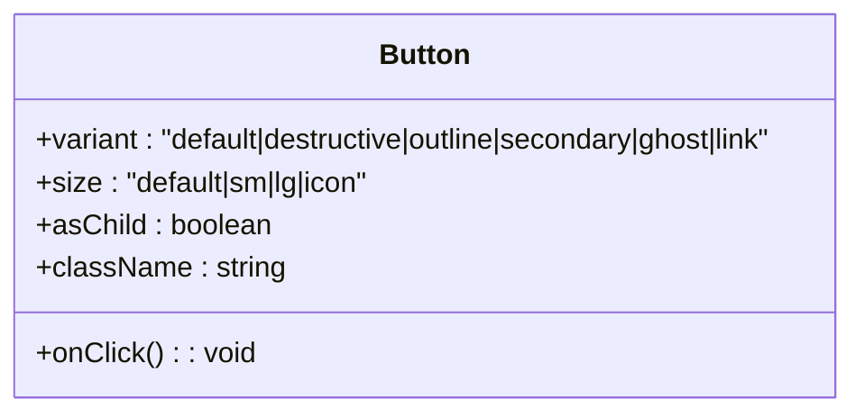
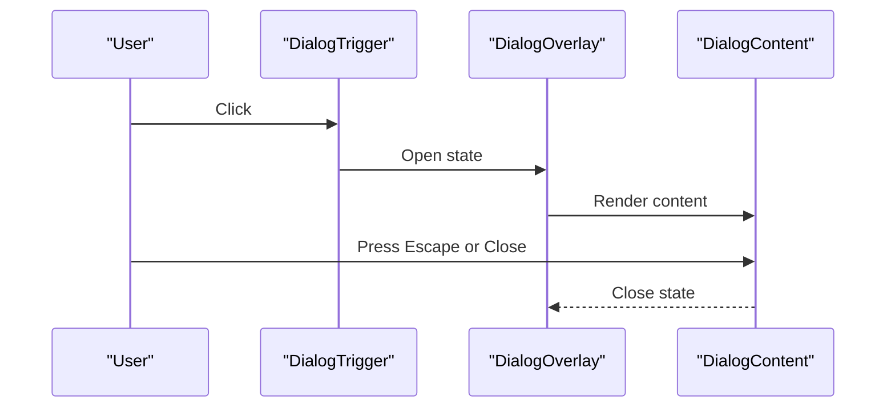
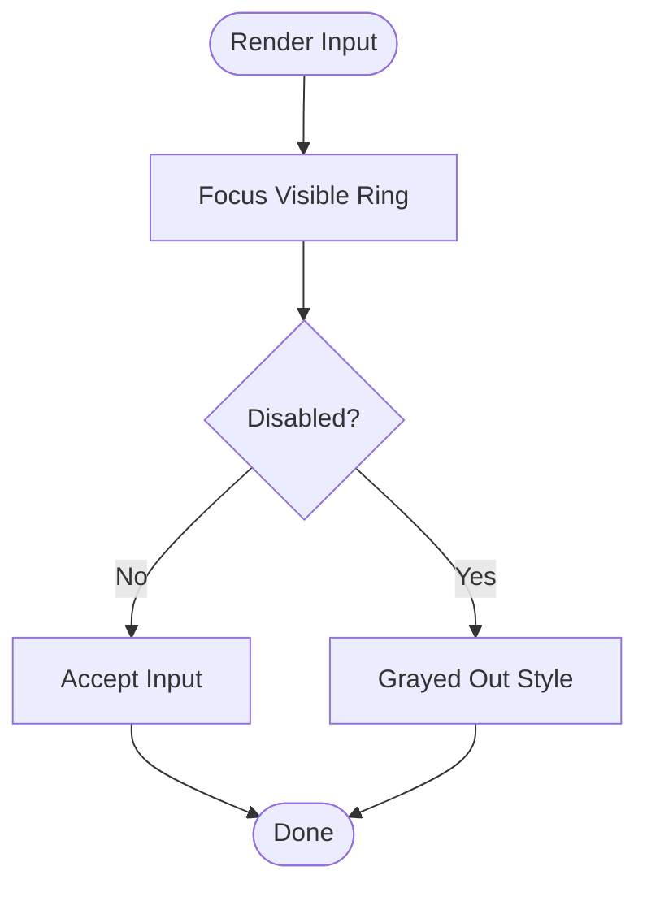
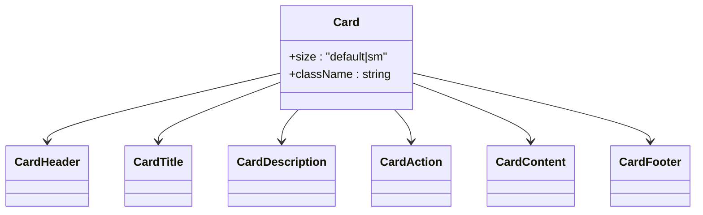
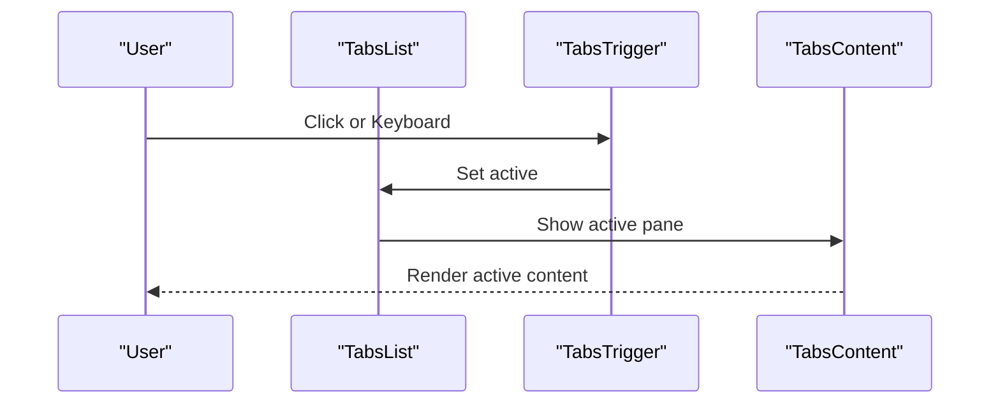
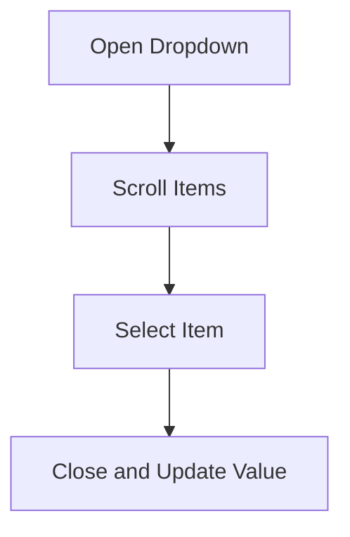
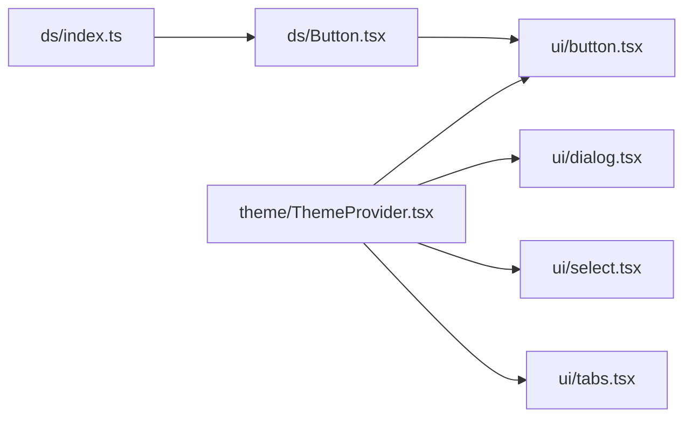
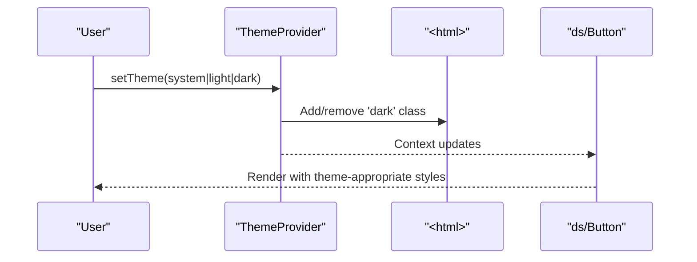

# UI Component Library

<cite>
**Referenced Files in This Document**
- [button.tsx](file://src/components/ui/button.tsx)
- [dialog.tsx](file://src/components/ui/dialog.tsx)
- [input.tsx](file://src/components/ui/input.tsx)
- [card.tsx](file://src/components/ui/card.tsx)
- [tabs.tsx](file://src/components/ui/tabs.tsx)
- [select.tsx](file://src/components/ui/select.tsx)
- [avatar.tsx](file://src/components/ui/avatar.tsx)
- [badge.tsx](file://src/components/ui/badge.tsx)
- [label.tsx](file://src/components/ui/label.tsx)
- [separator.tsx](file://src/components/ui/separator.tsx)
- [switch.tsx](file://src/components/ui/switch.tsx)
- [textarea.tsx](file://src/components/ui/textarea.tsx)
- [tooltip.tsx](file://src/components/ui/tooltip.tsx)
- [ThemeProvider.tsx](file://src/components/theme/ThemeProvider.tsx)
- [index.ts](file://src/components/ds/index.ts)
- [Button.tsx](file://src/components/ds/Button.tsx)
</cite>

## Table of Contents
1. [Introduction](#introduction)
2. [Project Structure](#project-structure)
3. [Core Components](#core-components)
4. [Architecture Overview](#architecture-overview)
5. [Detailed Component Analysis](#detailed-component-analysis)
6. [Dependency Analysis](#dependency-analysis)
7. [Performance Considerations](#performance-considerations)
8. [Accessibility Features](#accessibility-features)
9. [Styling and Theming](#styling-and-theming)
10. [Troubleshooting Guide](#troubleshooting-guide)
11. [Conclusion](#conclusion)

## Introduction
This document describes the UI component library built on Radix UI primitives. It covers the component interfaces, props, customization options, accessibility features, keyboard navigation, screen reader support, composition patterns, and integration with the design system. Practical usage guidance is included via code snippet paths to the relevant source files.

## Project Structure
The UI library is organized into two primary areas:
- Radix-based primitives under src/components/ui
- A separate design system layer under src/components/ds

Key characteristics:
- Each primitive is a thin wrapper around Radix UI, adding Tailwind-based styling and optional convenience props.
- The design system layer provides higher-level components (e.g., Button) with explicit variants and sizes, decoupled from Radix internals.

**Diagram sources**
- [button.tsx:1-57](file://src/components/ui/button.tsx#L1-L57)
- [dialog.tsx:1-112](file://src/components/ui/dialog.tsx#L1-L112)
- [input.tsx:1-24](file://src/components/ui/input.tsx#L1-L24)
- [card.tsx:1-104](file://src/components/ui/card.tsx#L1-L104)
- [tabs.tsx:1-53](file://src/components/ui/tabs.tsx#L1-L53)
- [select.tsx:1-139](file://src/components/ui/select.tsx#L1-L139)
- [index.ts:1-32](file://src/components/ds/index.ts#L1-L32)
- [Button.tsx:1-69](file://src/components/ds/Button.tsx#L1-L69)

**Section sources**
- [button.tsx:1-57](file://src/components/ui/button.tsx#L1-L57)
- [dialog.tsx:1-112](file://src/components/ui/dialog.tsx#L1-L112)
- [input.tsx:1-24](file://src/components/ui/input.tsx#L1-L24)
- [card.tsx:1-104](file://src/components/ui/card.tsx#L1-L104)
- [tabs.tsx:1-53](file://src/components/ui/tabs.tsx#L1-L53)
- [select.tsx:1-139](file://src/components/ui/select.tsx#L1-L139)
- [index.ts:1-32](file://src/components/ds/index.ts#L1-L32)
- [Button.tsx:1-69](file://src/components/ds/Button.tsx#L1-L69)

## Core Components
This section summarizes the primary components and their roles in the UI library.

- Button: Radix-based button with variant and size scales; supports rendering as a child element.
- Dialog: Modal overlay system with overlay, content, header/footer, title, and description slots.
- Input: Text input with focus ring and disabled state styling.
- Card: Composite layout container with header, title, description, action, content, and footer slots and responsive sizing.
- Tabs: Tab list, trigger, and content with active state styling.
- Select: Single-select dropdown with scroll area, labels, items, and separators.
- Additional primitives: Avatar, Badge, Label, Separator, Switch, Textarea, Tooltip.

Each component exposes a clear prop interface and integrates with the design system’s theming and Tailwind utilities.

**Section sources**
- [button.tsx:36-54](file://src/components/ui/button.tsx#L36-L54)
- [dialog.tsx:100-112](file://src/components/ui/dialog.tsx#L100-L112)
- [input.tsx:4-23](file://src/components/ui/input.tsx#L4-L23)
- [card.tsx:5-103](file://src/components/ui/card.tsx#L5-L103)
- [tabs.tsx:5-52](file://src/components/ui/tabs.tsx#L5-L52)
- [select.tsx:6-138](file://src/components/ui/select.tsx#L6-L138)
- [avatar.tsx:5-47](file://src/components/ui/avatar.tsx#L5-L47)
- [badge.tsx:5-42](file://src/components/ui/badge.tsx#L5-L42)
- [label.tsx:5-20](file://src/components/ui/label.tsx#L5-L20)
- [separator.tsx:5-28](file://src/components/ui/separator.tsx#L5-L28)
- [switch.tsx:5-22](file://src/components/ui/switch.tsx#L5-L22)
- [textarea.tsx:5-18](file://src/components/ui/textarea.tsx#L5-L18)
- [tooltip.tsx:5-27](file://src/components/ui/tooltip.tsx#L5-L27)

## Architecture Overview
The UI library follows a layered architecture:
- Radix UI primitives provide accessible base behaviors.
- Styled wrappers add Tailwind classes and optional convenience props.
- The design system layer offers higher-level components with explicit variants and sizes.

**Diagram sources**
- [ThemeProvider.tsx:52-95](file://src/components/theme/ThemeProvider.tsx#L52-L95)
- [Button.tsx:33-67](file://src/components/ds/Button.tsx#L33-L67)
- [button.tsx:42-53](file://src/components/ui/button.tsx#L42-L53)

**Section sources**
- [ThemeProvider.tsx:1-101](file://src/components/theme/ThemeProvider.tsx#L1-L101)
- [Button.tsx:1-69](file://src/components/ds/Button.tsx#L1-L69)
- [button.tsx:1-57](file://src/components/ui/button.tsx#L1-L57)

## Detailed Component Analysis

### Button
- Purpose: Base button with variant and size scales; supports rendering as a child element via asChild.
- Props:
  - variant: default, destructive, outline, secondary, ghost, link
  - size: default, sm, lg, icon
  - asChild: renders the underlying Radix Slot instead of a button
  - Inherits standard button attributes
- Events: Standard click handlers; focus-visible ring and disabled state handled internally.
- Accessibility: Focus ring via focus-visible utilities; disabled state prevents interaction.
- Composition: Use asChild to wrap links or other interactive elements while preserving styling.

**Diagram sources**
- [button.tsx:36-54](file://src/components/ui/button.tsx#L36-L54)

**Section sources**
- [button.tsx:6-34](file://src/components/ui/button.tsx#L6-L34)
- [button.tsx:36-54](file://src/components/ui/button.tsx#L36-L54)

### Dialog
- Purpose: Modal overlay system with portal rendering for overlay and content.
- Props:
  - DialogContent: showCloseButton toggle for close button visibility
  - DialogOverlay: animated overlay with backdrop blur
  - DialogHeader/Footer: layout containers
  - DialogTitle/Description: semantic labeling
- Events: Close via Radix Close or Escape key; Portal ensures proper stacking.
- Accessibility: Uses Radix Dialog semantics; sr-only “Close” text for screen readers.
- Composition: Combine DialogTrigger, DialogContent, and optional DialogHeader/DialogFooter.

**Diagram sources**
- [dialog.tsx:6-52](file://src/components/ui/dialog.tsx#L6-L52)

**Section sources**
- [dialog.tsx:11-24](file://src/components/ui/dialog.tsx#L11-L24)
- [dialog.tsx:26-52](file://src/components/ui/dialog.tsx#L26-L52)
- [dialog.tsx:54-74](file://src/components/ui/dialog.tsx#L54-L74)
- [dialog.tsx:76-98](file://src/components/ui/dialog.tsx#L76-L98)

### Input
- Purpose: Text input with focus ring and disabled state styling.
- Props: Inherits standard input attributes; styled with rounded borders and ring focus.
- Accessibility: Standard input semantics; focus-visible ring for keyboard navigation.
- Composition: Use with Label for accessible form controls.

**Diagram sources**
- [input.tsx:6-21](file://src/components/ui/input.tsx#L6-L21)

**Section sources**
- [input.tsx:4-23](file://src/components/ui/input.tsx#L4-L23)

### Card
- Purpose: Composite layout container with named slots for header, title, description, action, content, and footer.
- Props:
  - size: default or sm for responsive spacing and padding
- Accessibility: Uses semantic divs with data-slot attributes for targeting styles.
- Composition: Arrange children in predefined slots; footer and header adapt to size.

**Diagram sources**
- [card.tsx:5-21](file://src/components/ui/card.tsx#L5-L21)
- [card.tsx:23-34](file://src/components/ui/card.tsx#L23-L34)
- [card.tsx:36-47](file://src/components/ui/card.tsx#L36-L47)
- [card.tsx:49-57](file://src/components/ui/card.tsx#L49-L57)
- [card.tsx:59-69](file://src/components/ui/card.tsx#L59-L69)
- [card.tsx:72-80](file://src/components/ui/card.tsx#L72-L80)
- [card.tsx:82-93](file://src/components/ui/card.tsx#L82-L93)

**Section sources**
- [card.tsx:5-103](file://src/components/ui/card.tsx#L5-L103)

### Tabs
- Purpose: Tabbed interface with list, triggers, and content panes.
- Props: Inherits Radix Tabs semantics; active trigger receives distinct styling.
- Accessibility: Keyboard navigation via Arrow keys; active tab receives focus.
- Composition: Use TabsList for triggers; TabsContent for pane content.

**Diagram sources**
- [tabs.tsx:7-35](file://src/components/ui/tabs.tsx#L7-L35)
- [tabs.tsx:37-49](file://src/components/ui/tabs.tsx#L37-L49)

**Section sources**
- [tabs.tsx:5-52](file://src/components/ui/tabs.tsx#L5-L52)

### Select
- Purpose: Single-select dropdown with scrollable viewport and item indicators.
- Props:
  - SelectTrigger: styled trigger with icon
  - SelectContent: portal-rendered content with positioning
  - SelectItem: selectable option with indicator
  - SelectLabel/SelectSeparator: grouping and separation
- Accessibility: Keyboard navigation; focus management inside portal; scroll buttons for long lists.
- Composition: Group items with SelectLabel; use SelectSeparator for groups.

**Diagram sources**
- [select.tsx:9-27](file://src/components/ui/select.tsx#L9-L27)
- [select.tsx:57-81](file://src/components/ui/select.tsx#L57-L81)
- [select.tsx:95-115](file://src/components/ui/select.tsx#L95-L115)

**Section sources**
- [select.tsx:6-138](file://src/components/ui/select.tsx#L6-L138)

### Additional Primitives
- Avatar: Image with fallback and root container.
- Badge: Status-like indicator with variant palette.
- Label: Associates text with form controls.
- Separator: Decorative or structural divider.
- Switch: Toggle with checked/unchecked states.
- Textarea: Multi-line text input with focus ring and invalid states.
- Tooltip: Tooltip provider, trigger, and content with portal rendering.

**Section sources**
- [avatar.tsx:5-47](file://src/components/ui/avatar.tsx#L5-L47)
- [badge.tsx:5-42](file://src/components/ui/badge.tsx#L5-L42)
- [label.tsx:5-20](file://src/components/ui/label.tsx#L5-L20)
- [separator.tsx:5-28](file://src/components/ui/separator.tsx#L5-L28)
- [switch.tsx:5-22](file://src/components/ui/switch.tsx#L5-L22)
- [textarea.tsx:5-18](file://src/components/ui/textarea.tsx#L5-L18)
- [tooltip.tsx:5-27](file://src/components/ui/tooltip.tsx#L5-L27)

## Dependency Analysis
The design system components depend on the Radix UI primitives and share styling utilities.

**Diagram sources**
- [index.ts:30-31](file://src/components/ds/index.ts#L30-L31)
- [Button.tsx:33-67](file://src/components/ds/Button.tsx#L33-L67)
- [button.tsx:42-53](file://src/components/ui/button.tsx#L42-L53)
- [ThemeProvider.tsx:52-95](file://src/components/theme/ThemeProvider.tsx#L52-L95)

**Section sources**
- [index.ts:1-32](file://src/components/ds/index.ts#L1-L32)
- [Button.tsx:1-69](file://src/components/ds/Button.tsx#L1-L69)
- [button.tsx:1-57](file://src/components/ui/button.tsx#L1-L57)
- [ThemeProvider.tsx:1-101](file://src/components/theme/ThemeProvider.tsx#L1-L101)

## Performance Considerations
- Prefer Radix portals for overlays (Dialog, Select) to avoid layout thrashing and ensure correct stacking.
- Use minimal re-renders by passing stable refs and avoiding unnecessary prop churn.
- Keep animation classes scoped to enter/exit states to prevent heavy transitions on large DOM trees.
- Leverage Tailwind utilities for atomic styling to reduce CSS bundle size.

## Accessibility Features
- Focus management: Components consistently apply focus-visible rings and preserve keyboard navigation.
- Semantic roles: Dialog, Tabs, Select, Tooltip, and Label use Radix primitives that expose accessible ARIA roles and states.
- Screen reader support: Dialog includes an sr-only “Close” label; Select items include indicators; Tooltip content is rendered in a portal for reliable focus trapping.
- Keyboard navigation: Tabs and Select support arrow keys and Enter/Escape; Dialog supports Escape to close.

**Section sources**
- [dialog.tsx:43-48](file://src/components/ui/dialog.tsx#L43-L48)
- [select.tsx:99-114](file://src/components/ui/select.tsx#L99-L114)
- [tooltip.tsx:9-25](file://src/components/ui/tooltip.tsx#L9-L25)

## Styling and Theming
- ThemeProvider: Applies system-aware light/dark mode by toggling the dark class on the root element and persisting user preference in local storage.
- Design system Button: Provides explicit variants and sizes mapped to CSS variables and Tailwind classes.
- Utility classes: Components use cn for conditional class merging and Tailwind utilities for responsive and stateful styling.

**Diagram sources**
- [ThemeProvider.tsx:52-95](file://src/components/theme/ThemeProvider.tsx#L52-L95)
- [Button.tsx:33-67](file://src/components/ds/Button.tsx#L33-L67)

**Section sources**
- [ThemeProvider.tsx:1-101](file://src/components/theme/ThemeProvider.tsx#L1-L101)
- [Button.tsx:18-31](file://src/components/ds/Button.tsx#L18-L31)

## Troubleshooting Guide
- Dialog does not close on Escape:
  - Ensure DialogTrigger is used correctly and that the DialogContent is rendered within a Portal.
  - Verify focus is inside the dialog when pressing Escape.
- Select items not visible:
  - Confirm SelectContent is rendered via a Portal and that the viewport is sized appropriately.
  - Check that SelectItem is placed within SelectContent.
- Button styles not applying:
  - Verify variant and size props are passed correctly; ensure Tailwind utilities are built and available.
- Theme not switching:
  - Confirm ThemeProvider wraps the app and that local storage is accessible.
  - Check that CSS variables for dark mode are defined in global styles.

**Section sources**
- [dialog.tsx:32-51](file://src/components/ui/dialog.tsx#L32-L51)
- [select.tsx:61-79](file://src/components/ui/select.tsx#L61-L79)
- [button.tsx:42-53](file://src/components/ui/button.tsx#L42-L53)
- [ThemeProvider.tsx:52-95](file://src/components/theme/ThemeProvider.tsx#L52-L95)

## Conclusion
The UI component library leverages Radix UI primitives to deliver accessible, composable components with a consistent design system. By combining Radix’s semantics with Tailwind-based styling and a dedicated design system layer, developers can compose robust interfaces with strong accessibility guarantees, predictable keyboard navigation, and flexible theming.