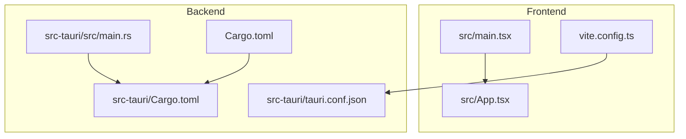

# Getting Started

<cite>
**Referenced Files in This Document**
- [package.json](file://package.json)
- [vite.config.ts](file://vite.config.ts)
- [tauri.conf.json](file://src-tauri/tauri.conf.json)
- [Cargo.toml](file://Cargo.toml)
- [src-tauri/Cargo.toml](file://src-tauri/Cargo.toml)
- [src-tauri/.cargo/config.toml](file://src-tauri/.cargo/config.toml)
- [src-tauri/src/main.rs](file://src-tauri/src/main.rs)
- [src/main.tsx](file://src/main.tsx)
- [DEVELOPER_GUIDE.md](file://DEVELOPER_GUIDE.md)
- [QUICKSTART.md](file://QUICKSTART.md)
</cite>

## Table of Contents
1. [Introduction](#introduction)
2. [Prerequisites and Environment Setup](#prerequisites-and-environment-setup)
3. [Installation Steps](#installation-steps)
4. [Initial Project Configuration](#initial-project-configuration)
5. [Development Workflow](#development-workflow)
6. [Build and Run Commands](#build-and-run-commands)
7. [Project Structure Overview](#project-structure-overview)
8. [Verification Checklist](#verification-checklist)
9. [Platform-Specific Considerations](#platform-specific-considerations)
10. [Environment Variables Reference](#environment-variables-reference)
11. [Troubleshooting Guide](#troubleshooting-guide)
12. [Production Build Process](#production-build-process)
13. [Conclusion](#conclusion)

## Introduction
This guide helps you set up a complete development environment for If2Ai, a desktop application built with Tauri, Rust, and React. It covers prerequisite software requirements, step-by-step installation, initial configuration, development workflow, and verification steps to ensure everything works correctly.

## Prerequisites and Environment Setup
Before starting, ensure your system meets the following requirements:
- Node.js: Version 18 or higher
- Rust: Version 1.60 or higher
- Platform-specific Tauri prerequisites:
  - macOS: Minimum system version 11.0
  - Windows/Linux: Follow Tauri's platform requirements for bundling and runtime

Key configuration references:
- Tauri build configuration defines the frontend build command, development URL, and bundling resources.
- Vite configuration sets the development server port and build output directory.
- Cargo workspace configuration controls Rust build profiles and dependency resolution.

**Section sources**
- [tauri.conf.json:1-57](file://src-tauri/tauri.conf.json#L1-L57)
- [vite.config.ts:1-35](file://vite.config.ts#L1-L35)
- [Cargo.toml:1-48](file://Cargo.toml#L1-L48)
- [src-tauri/Cargo.toml:1-161](file://src-tauri/Cargo.toml#L1-L161)

## Installation Steps
Follow these steps to install and configure the If2Ai development environment:

1. Install Node.js and Rust
   - Verify Node.js version (≥ 18) and npm version
   - Verify Rust toolchain (≥ 1.60) and Cargo

2. Clone and prepare the repository
   - Navigate to the project directory
   - Install JavaScript dependencies using npm

3. Build the backend
   - Change to the Rust workspace directory
   - Build the backend using Cargo

4. Verify the setup
   - Run the development server using the Tauri development command
   - Confirm the application launches in the browser and Tauri window

**Section sources**
- [QUICKSTART.md:9-30](file://QUICKSTART.md#L9-L30)
- [DEVELOPER_GUIDE.md:232-253](file://DEVELOPER_GUIDE.md#L232-L253)

## Initial Project Configuration
Configure the project for development:

- Frontend development server
  - Vite runs on port 9527 as defined in the configuration
  - The dev URL is set to http://localhost:9527

- Backend integration
  - Tauri is configured to build the web frontend before launching the development server
  - The frontend distribution path is set to ../dist

- Rust build settings
  - The workspace uses resolver version 2
  - Development profile disables incremental compilation for improved caching with sccache

**Section sources**
- [vite.config.ts:22-24](file://vite.config.ts#L22-L24)
- [tauri.conf.json:5-10](file://src-tauri/tauri.conf.json#L5-L10)
- [Cargo.toml:9-24](file://Cargo.toml#L9-L24)

## Development Workflow
The recommended development workflow:

1. Start the frontend development server
   - Use the npm script for development mode

2. Launch the Tauri application
   - Use the Tauri development command to run the desktop app

3. Hot reloading behavior
   - Frontend changes trigger Vite hot reload
   - Rust changes require a full process restart

4. Testing and validation
   - Run unit tests for the backend using Cargo
   - Use Harness tests for integration validation

**Section sources**
- [DEVELOPER_GUIDE.md:244-266](file://DEVELOPER_GUIDE.md#L244-L266)
- [src-tauri/src/main.rs:406-437](file://src-tauri/src/main.rs#L406-L437)

## Build and Run Commands
Use the following commands for development and testing:

- Development
  - Start the frontend dev server: npm run dev
  - Start Tauri development: npm run tauri dev

- Build
  - Build the web frontend: npm run build:web
  - Build the Tauri application: npm run build

- Testing
  - Run backend tests: cargo test --all
  - Run Harness tests: python -m harness runner suite --suite default

- Preview
  - Preview the built application: npm run preview

**Section sources**
- [package.json:6-16](file://package.json#L6-L16)
- [DEVELOPER_GUIDE.md:244-266](file://DEVELOPER_GUIDE.md#L244-L266)

## Project Structure Overview
The project follows a hybrid architecture with separate frontend and backend components:

- Frontend (React + Vite)
  - Entry point: src/main.tsx
  - Application root: src/App.tsx
  - Window routing and demos handled in the main entry

- Backend (Rust + Tauri)
  - Main entry: src-tauri/src/main.rs
  - Workspace configuration: src-tauri/Cargo.toml
  - Tauri configuration: src-tauri/tauri.conf.json

- Shared configuration
  - Package management: package.json
  - Build tooling: vite.config.ts
  - Rust workspace: Cargo.toml

**Diagram sources**
- [src/main.tsx:1-44](file://src/main.tsx#L1-L44)
- [vite.config.ts:1-35](file://vite.config.ts#L1-L35)
- [src-tauri/src/main.rs:1-10](file://src-tauri/src/main.rs#L1-L10)
- [src-tauri/tauri.conf.json:1-10](file://src-tauri/tauri.conf.json#L1-L10)
- [Cargo.toml:1-10](file://Cargo.toml#L1-L10)
- [src-tauri/Cargo.toml:1-10](file://src-tauri/Cargo.toml#L1-L10)

**Section sources**
- [src/main.tsx:16-35](file://src/main.tsx#L16-L35)
- [src-tauri/src/main.rs:1-10](file://src-tauri/src/main.rs#L1-L10)

## Verification Checklist
Complete these checks to verify a successful installation:

- Environment verification
  - Node.js version check (≥ 18)
  - Rust version check (≥ 1.60)
  - Cargo workspace compiles successfully

- Frontend verification
  - Vite dev server starts on port 9527
  - Application loads in the browser
  - Hot reload responds to file changes

- Backend verification
  - Tauri application launches
  - Main window displays with expected dimensions
  - Logging shows backend initialization messages

- Build verification
  - Web build completes without errors
  - Tauri build succeeds
  - Application bundles with required resources

**Section sources**
- [QUICKSTART.md:17-29](file://QUICKSTART.md#L17-L29)
- [tauri.conf.json:12-29](file://src-tauri/tauri.conf.json#L12-L29)
- [src-tauri/src/main.rs:429-437](file://src-tauri/src/main.rs#L429-L437)

## Platform-Specific Considerations
Platform-specific requirements and configurations:

- macOS
  - Minimum system version: 11.0
  - Deployment target is pinned to 11.0 for native dependencies
  - Xcode Command Line Tools required for development

- Windows/Linux
  - Follow Tauri's platform-specific prerequisites
  - Ensure bundler compatibility and runtime dependencies

- Environment variables
  - IF2AI_HRR_ENABLED: Enables hybrid memory provider (experimental)
  - IF2AI_HARNESS_ENABLED: Enables harness for agent loop testing
  - IF2AI_SESSIONS_DIR: Overrides sessions directory location
  - IF2AI_PROJECTS_DIR: Overrides projects directory location

**Section sources**
- [src-tauri/.cargo/config.toml:3-12](file://src-tauri/.cargo/config.toml#L3-L12)
- [src-tauri/src/main.rs:265-267](file://src-tauri/src/main.rs#L265-L267)
- [src-tauri/src/main.rs:489-499](file://src-tauri/src/main.rs#L489-L499)

## Environment Variables Reference
Key environment variables for If2Ai:

- IF2AI_HRR_ENABLED
  - Purpose: Enable hybrid memory provider (HRR + Vector)
  - Values: "1" or "true" to enable, otherwise disabled
  - Effect: Changes memory provider initialization behavior

- IF2AI_HARNESS_ENABLED
  - Purpose: Enable harness for agent loop testing
  - Values: "1" to enable, otherwise disabled by default
  - Effect: Activates trace collection and testing infrastructure

- IF2AI_SESSIONS_DIR
  - Purpose: Override sessions directory location
  - Default: ~/.if2ai/sessions if not set
  - Effect: Changes where session data is stored

- IF2AI_PROJECTS_DIR
  - Purpose: Override projects directory location
  - Default: ~/.if2ai/projects if not set
  - Effect: Changes where project data is stored

**Section sources**
- [src-tauri/src/main.rs:265-267](file://src-tauri/src/main.rs#L265-L267)
- [src-tauri/src/main.rs:489-499](file://src-tauri/src/main.rs#L489-L499)

## Troubleshooting Guide
Common setup and runtime issues:

- Compilation failures
  - Clear Cargo cache and rebuild
  - Update dependencies using Cargo update
  - Verify Rust version meets minimum requirements

- Tauri-specific issues
  - Validate tauri.conf.json syntax and paths
  - Clean target directory and rebuild
  - Check platform-specific prerequisites

- Frontend build problems
  - Verify Node.js version compatibility
  - Clear node_modules and reinstall dependencies
  - Check Vite configuration and port availability

- Memory provider initialization
  - Hybrid provider requires sufficient system resources
  - Fallback to SQLite provider if vector database initialization fails
  - Check environment variable IF2AI_HRR_ENABLED value

- Harness testing issues
  - Ensure IF2AI_HARNESS_ENABLED is set to "1"
  - Verify trace directory permissions
  - Check Python environment for Harness framework

**Section sources**
- [QUICKSTART.md:209-232](file://QUICKSTART.md#L209-L232)
- [src-tauri/src/main.rs:269-326](file://src-tauri/src/main.rs#L269-L326)

## Production Build Process
For production builds:

1. Prepare the build environment
   - Ensure all dependencies are installed
   - Verify environment variables for production settings

2. Build the web frontend
   - Run the web build script to generate optimized assets

3. Build the Tauri application
   - Execute the Tauri build command for platform-specific packaging

4. Bundle resources
   - Tauri automatically includes bundled skills and voice resources
   - Icons and platform-specific configurations are included based on tauri.conf.json

5. Distribution
   - Platform-specific installers are generated by Tauri bundler
   - Verify bundle integrity and signing requirements

**Section sources**
- [tauri.conf.json:38-55](file://src-tauri/tauri.conf.json#L38-L55)
- [package.json:8-12](file://package.json#L8-L12)

## Conclusion
You now have the complete setup for developing If2Ai applications. The environment combines modern frontend tooling (React/Vite) with a robust backend (Rust/Tauri) and comprehensive testing frameworks. Use the verification checklist to confirm your setup, and refer to the troubleshooting guide for common issues. For production deployments, follow the production build process outlined above.