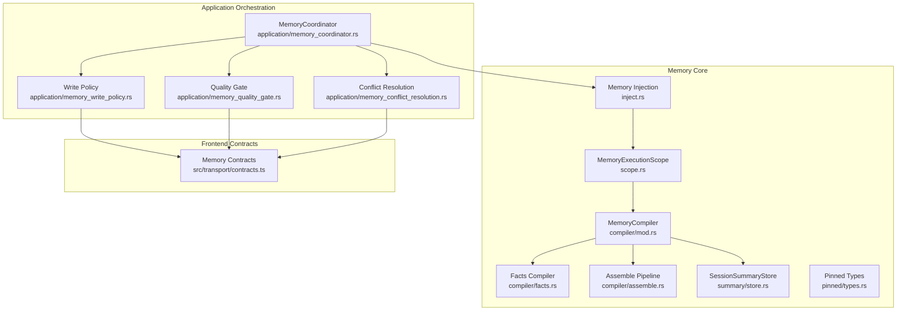
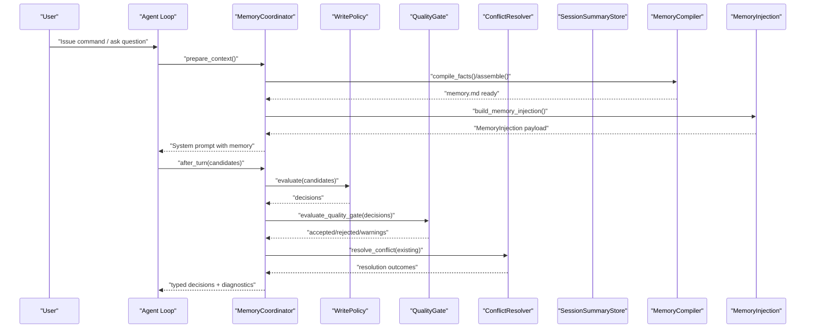
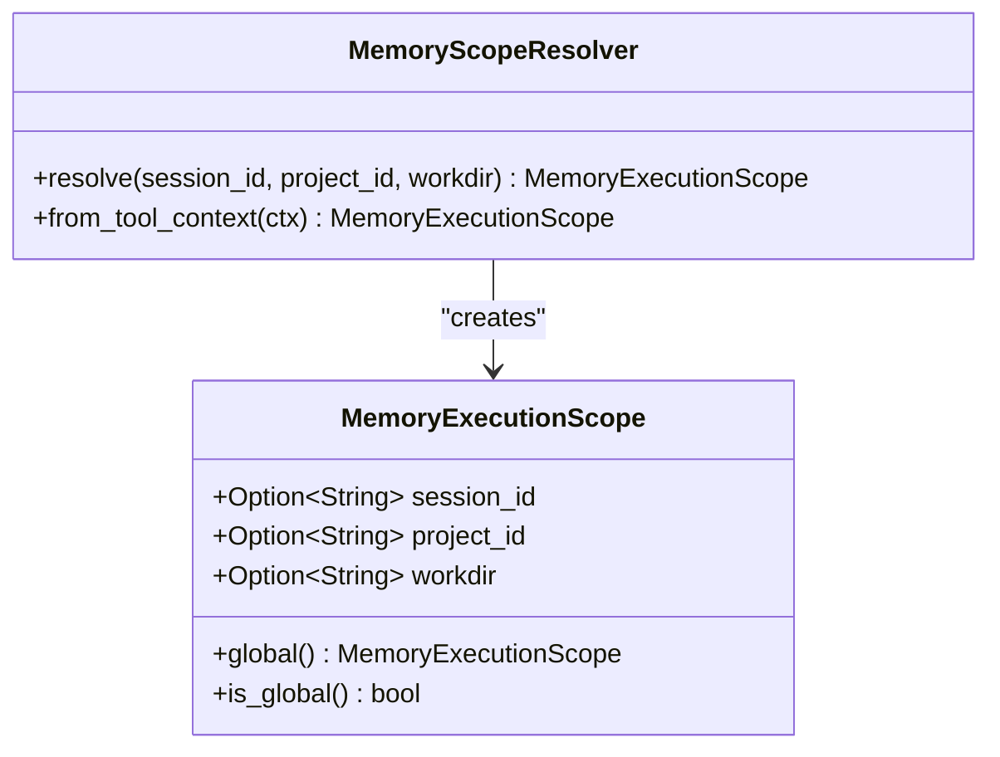
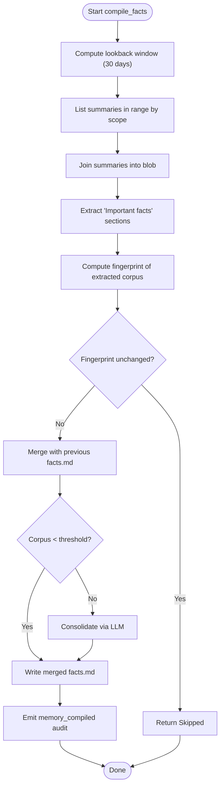
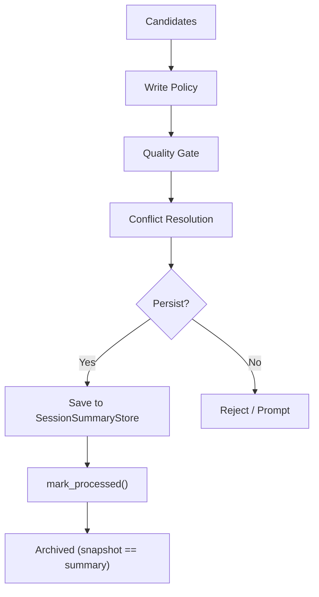
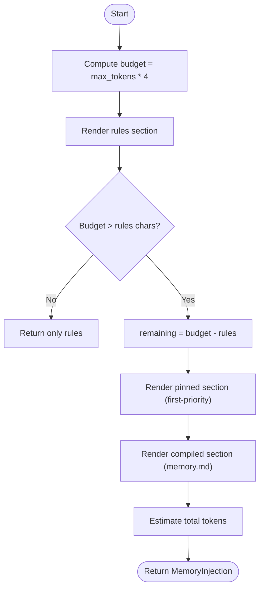
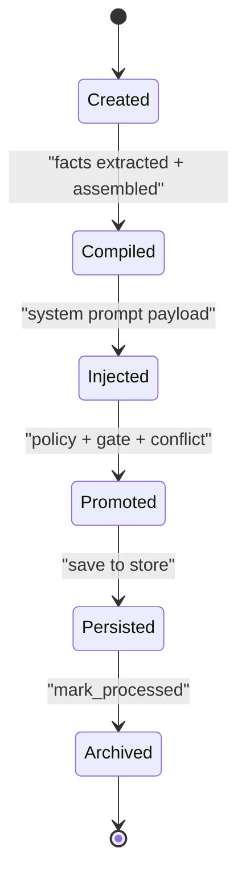
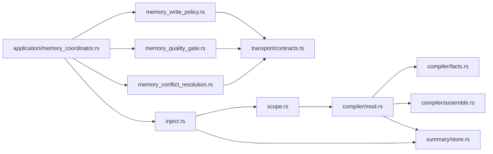

# Memory Organization and Lifecycle

<cite>
**Referenced Files in This Document**
- [scope.rs](file://src-tauri/src/modules/memory/scope.rs)
- [mod.rs](file://src-tauri/src/modules/memory/compiler/mod.rs)
- [facts.rs](file://src-tauri/src/modules/memory/compiler/facts.rs)
- [assemble.rs](file://src-tauri/src/modules/memory/compiler/assemble.rs)
- [inject.rs](file://src-tauri/src/modules/memory/inject.rs)
- [memory_coordinator.rs](file://src-tauri/src/modules/application/memory_coordinator.rs)
- [memory_write_policy.rs](file://src-tauri/src/modules/application/memory_write_policy.rs)
- [memory_quality_gate.rs](file://src-tauri/src/modules/application/memory_quality_gate.rs)
- [memory_conflict_resolution.rs](file://src-tauri/src/modules/application/memory_conflict_resolution.rs)
- [store.rs](file://src-tauri/src/modules/memory/summary/store.rs)
- [types.rs](file://src-tauri/src/modules/memory/pinned/types.rs)
- [contracts.ts](file://src/transport/contracts.ts)
- [memory-system.md](file://docs/design-docs/memory-system.md)
</cite>

## Table of Contents
1. [Introduction](#introduction)
2. [Project Structure](#project-structure)
3. [Core Components](#core-components)
4. [Architecture Overview](#architecture-overview)
5. [Detailed Component Analysis](#detailed-component-analysis)
6. [Dependency Analysis](#dependency-analysis)
7. [Performance Considerations](#performance-considerations)
8. [Troubleshooting Guide](#troubleshooting-guide)
9. [Conclusion](#conclusion)
10. [Appendices](#appendices)

## Introduction
This document explains memory organization and lifecycle management in If2Ai. It covers hierarchical memory scopes (session, project, global), the memory compilation process (facts extraction and narrative assembly), the write pipeline from working memory to long-term storage, quality gates and conflict resolution, memory injection strategies, and lifecycle stages from creation to archival. Practical patterns and lifecycle optimization techniques are included to help teams organize memory effectively across sessions and projects.

## Project Structure
Memory-related logic is organized across Rust modules and front-end contracts:
- Memory execution scope and scoping utilities
- Compiler orchestrating daily compilation and assembly
- Injection service preparing memory for the system prompt
- Application-level coordinator for recall, write policy, quality gate, and conflict resolution
- Summary store for rolling session summaries
- Pinned memory types and scope model
- Front-end contracts for memory decisions and scope tiers

**Diagram sources**
- [scope.rs:25-58](file://src-tauri/src/modules/memory/scope.rs#L25-L58)
- [mod.rs:113-266](file://src-tauri/src/modules/memory/compiler/mod.rs#L113-L266)
- [facts.rs:103-206](file://src-tauri/src/modules/memory/compiler/facts.rs#L103-L206)
- [assemble.rs:42-82](file://src-tauri/src/modules/memory/compiler/assemble.rs#L42-L82)
- [inject.rs:88-133](file://src-tauri/src/modules/memory/inject.rs#L88-L133)
- [store.rs:39-69](file://src-tauri/src/modules/memory/summary/store.rs#L39-L69)
- [types.rs:19-47](file://src-tauri/src/modules/memory/pinned/types.rs#L19-L47)
- [memory_coordinator.rs:62-178](file://src-tauri/src/modules/application/memory_coordinator.rs#L62-L178)
- [memory_write_policy.rs:65-115](file://src-tauri/src/modules/application/memory_write_policy.rs#L65-L115)
- [memory_quality_gate.rs:113-226](file://src-tauri/src/modules/application/memory_quality_gate.rs#L113-L226)
- [memory_conflict_resolution.rs:111-186](file://src-tauri/src/modules/application/memory_conflict_resolution.rs#L111-L186)
- [contracts.ts:231-257](file://src/transport/contracts.ts#L231-L257)

**Section sources**
- [scope.rs:1-143](file://src-tauri/src/modules/memory/scope.rs#L1-L143)
- [mod.rs:1-412](file://src-tauri/src/modules/memory/compiler/mod.rs#L1-L412)
- [inject.rs:1-463](file://src-tauri/src/modules/memory/inject.rs#L1-L463)
- [memory_coordinator.rs:1-335](file://src-tauri/src/modules/application/memory_coordinator.rs#L1-L335)
- [memory_write_policy.rs:1-153](file://src-tauri/src/modules/application/memory_write_policy.rs#L1-L153)
- [memory_quality_gate.rs:1-348](file://src-tauri/src/modules/application/memory_quality_gate.rs#L1-L348)
- [memory_conflict_resolution.rs:1-300](file://src-tauri/src/modules/application/memory_conflict_resolution.rs#L1-L300)
- [store.rs:1-685](file://src-tauri/src/modules/memory/summary/store.rs#L1-L685)
- [types.rs:1-93](file://src-tauri/src/modules/memory/pinned/types.rs#L1-L93)
- [contracts.ts:231-257](file://src/transport/contracts.ts#L231-L257)

## Core Components
- MemoryExecutionScope: Enforces session/project/global isolation for memory operations and supports global fallback semantics.
- MemoryCompiler: Orchestrates daily compilation (today, week, longterm, facts) and assembles memory.md.
- Facts Compiler: Extracts “important facts” from recent session summaries and consolidates with previous facts.md.
- Assemble Pipeline: Concatenates compiled sections into memory.md with bilingual titles and budget-aware truncation.
- Memory Injection: Builds the memory payload injected into the system prompt, enforcing budgets and prioritizing pinned memory.
- Application Coordinator: Coordinates recall, write policy, quality gate, and conflict resolution per turn.
- Write Policy: Evaluates candidates and returns typed decisions with reason codes.
- Quality Gate: Filters duplicates, flags weak evidence, and annotates ambiguous kinds.
- Conflict Resolution: Resolves inter-candidate and existing-record conflicts with deterministic outcomes.
- SessionSummaryStore: Persists rolling summaries with SQLite and JSON sidecars.
- Pinned Types: Defines pin scope (project/global), provenance, and item shape.
- Front-end Contracts: Define MemoryScope and MemoryDecisionVerdict for UI and evaluation.

**Section sources**
- [scope.rs:25-58](file://src-tauri/src/modules/memory/scope.rs#L25-L58)
- [mod.rs:113-266](file://src-tauri/src/modules/memory/compiler/mod.rs#L113-L266)
- [facts.rs:103-206](file://src-tauri/src/modules/memory/compiler/facts.rs#L103-L206)
- [assemble.rs:42-82](file://src-tauri/src/modules/memory/compiler/assemble.rs#L42-L82)
- [inject.rs:88-133](file://src-tauri/src/modules/memory/inject.rs#L88-L133)
- [memory_coordinator.rs:62-178](file://src-tauri/src/modules/application/memory_coordinator.rs#L62-L178)
- [memory_write_policy.rs:65-115](file://src-tauri/src/modules/application/memory_write_policy.rs#L65-L115)
- [memory_quality_gate.rs:113-226](file://src-tauri/src/modules/application/memory_quality_gate.rs#L113-L226)
- [memory_conflict_resolution.rs:111-186](file://src-tauri/src/modules/application/memory_conflict_resolution.rs#L111-L186)
- [store.rs:39-69](file://src-tauri/src/modules/memory/summary/store.rs#L39-L69)
- [types.rs:19-47](file://src-tauri/src/modules/memory/pinned/types.rs#L19-L47)
- [contracts.ts:231-257](file://src/transport/contracts.ts#L231-L257)

## Architecture Overview
The memory lifecycle spans three major phases:
- Compilation: Facts extraction and assembly into memory.md
- Injection: Prompt construction with pinned and compiled memory
- Write Pipeline: Policy evaluation, quality gating, conflict resolution, persistence, and archival

**Diagram sources**
- [memory_coordinator.rs:105-178](file://src-tauri/src/modules/application/memory_coordinator.rs#L105-L178)
- [memory_write_policy.rs:99-115](file://src-tauri/src/modules/application/memory_write_policy.rs#L99-L115)
- [memory_quality_gate.rs:113-226](file://src-tauri/src/modules/application/memory_quality_gate.rs#L113-L226)
- [memory_conflict_resolution.rs:111-186](file://src-tauri/src/modules/application/memory_conflict_resolution.rs#L111-L186)
- [store.rs:41-69](file://src-tauri/src/modules/memory/summary/store.rs#L41-L69)
- [mod.rs:234-266](file://src-tauri/src/modules/memory/compiler/mod.rs#L234-L266)
- [inject.rs:88-133](file://src-tauri/src/modules/memory/inject.rs#L88-L133)

## Detailed Component Analysis

### Hierarchical Memory Scopes
- MemoryExecutionScope defines session, project, and workdir dimensions. Global scope is used for backward compatibility and policy/emitter operations.
- MemoryScopeResolver resolves scope from runtime context or ToolContext, enabling strict isolation across sessions and projects.

**Diagram sources**
- [scope.rs:25-108](file://src-tauri/src/modules/memory/scope.rs#L25-L108)

**Section sources**
- [scope.rs:25-108](file://src-tauri/src/modules/memory/scope.rs#L25-L108)
- [memory-system.md:39-58](file://docs/design-docs/memory-system.md#L39-L58)

### Memory Compilation and Narrative Assembly
- MemoryCompiler orchestrates daily compilation and assembly:
  - compile_today, compile_week, compile_longterm, compile_facts
  - assemble concatenates sections into memory.md with bilingual titles and budget-aware truncation
- Facts compilation:
  - Extracts “important facts” from recent summaries (30-day lookback)
  - Merges with previous facts.md
  - Writes directly when corpus is small (< threshold), otherwise uses LLM to consolidate
- Assembly:
  - Ensures facts section is never truncated
  - Truncates longest section (longterm) first when exceeding 5000 chars
  - Emits audit event on success

**Diagram sources**
- [facts.rs:103-206](file://src-tauri/src/modules/memory/compiler/facts.rs#L103-L206)
- [assemble.rs:42-82](file://src-tauri/src/modules/memory/compiler/assemble.rs#L42-L82)

**Section sources**
- [mod.rs:158-266](file://src-tauri/src/modules/memory/compiler/mod.rs#L158-L266)
- [facts.rs:103-206](file://src-tauri/src/modules/memory/compiler/facts.rs#L103-L206)
- [assemble.rs:42-156](file://src-tauri/src/modules/memory/compiler/assemble.rs#L42-L156)

### Memory Promotion Pipeline: Working to Long-term
- Promotion follows a staged pipeline:
  - Write Policy: Initial disposition (allow/deny) with reason codes
  - Quality Gate: Detects duplicates, weak evidence, ambiguous kinds; downgrades to prompt when needed
  - Conflict Resolution: Inter-candidate and existing-record conflicts (scope collision, same fact diff value, preference polarity)
  - Persistence: Summary store persists rolling summaries with dual-write (SQLite + JSON sidecar)
  - Archival: mark_processed snapshots and clears dirty flag

**Diagram sources**
- [memory_coordinator.rs:148-178](file://src-tauri/src/modules/application/memory_coordinator.rs#L148-L178)
- [memory_write_policy.rs:99-115](file://src-tauri/src/modules/application/memory_write_policy.rs#L99-L115)
- [memory_quality_gate.rs:113-226](file://src-tauri/src/modules/application/memory_quality_gate.rs#L113-L226)
- [memory_conflict_resolution.rs:111-186](file://src-tauri/src/modules/application/memory_conflict_resolution.rs#L111-L186)
- [store.rs:433-452](file://src-tauri/src/modules/memory/summary/store.rs#L433-L452)

**Section sources**
- [memory_coordinator.rs:126-178](file://src-tauri/src/modules/application/memory_coordinator.rs#L126-L178)
- [memory_write_policy.rs:65-115](file://src-tauri/src/modules/application/memory_write_policy.rs#L65-L115)
- [memory_quality_gate.rs:113-226](file://src-tauri/src/modules/application/memory_quality_gate.rs#L113-L226)
- [memory_conflict_resolution.rs:111-186](file://src-tauri/src/modules/application/memory_conflict_resolution.rs#L111-L186)
- [store.rs:268-452](file://src-tauri/src/modules/memory/summary/store.rs#L268-L452)

### Memory Injection Strategies and Budgeting
- build_memory_injection computes a budget from max_tokens and allocates:
  - Pinned section (highest priority, unconditional allocation)
  - Compiled section (memory.md) truncated to remaining budget
  - Rules section (always included, locale-aware)
- Budget enforcement uses a 4-char-per-token estimate; truncation uses ellipsis to preserve CJK safety.

**Diagram sources**
- [inject.rs:88-133](file://src-tauri/src/modules/memory/inject.rs#L88-L133)

**Section sources**
- [inject.rs:88-133](file://src-tauri/src/modules/memory/inject.rs#L88-L133)

### Scope-Based Organization and Lifecycle Stages
- Scope tiers:
  - Session: temporary, task-specific facts and conclusions
  - Project: reusable engineering knowledge and preferences
  - Global: long-term user identity and cross-project habits
- Lifecycle stages:
  - Creation: rolling summaries saved to SQLite with JSON sidecar
  - Compilation: facts extraction and assembly into memory.md
  - Injection: memory payload prepared for system prompt
  - Promotion: policy evaluation, quality gate, conflict resolution
  - Persistence: summary store upserts and snapshot updates
  - Archival: mark_processed snapshots and clears dirty flag

**Diagram sources**
- [store.rs:268-452](file://src-tauri/src/modules/memory/summary/store.rs#L268-L452)
- [mod.rs:234-266](file://src-tauri/src/modules/memory/compiler/mod.rs#L234-L266)
- [inject.rs:88-133](file://src-tauri/src/modules/memory/inject.rs#L88-L133)
- [memory_coordinator.rs:148-178](file://src-tauri/src/modules/application/memory_coordinator.rs#L148-L178)

**Section sources**
- [memory-system.md:39-58](file://docs/design-docs/memory-system.md#L39-L58)
- [store.rs:268-452](file://src-tauri/src/modules/memory/summary/store.rs#L268-L452)
- [mod.rs:234-266](file://src-tauri/src/modules/memory/compiler/mod.rs#L234-L266)
- [inject.rs:88-133](file://src-tauri/src/modules/memory/inject.rs#L88-L133)
- [memory_coordinator.rs:148-178](file://src-tauri/src/modules/application/memory_coordinator.rs#L148-L178)

### Practical Patterns and Lifecycle Optimization
- Prefer default session writes for transient insights; promote to project/global only when repeated and stable.
- Use pinned memory for high-confidence, always-applicable facts; they receive unconditional budget priority.
- Monitor quality gate warnings (duplicate, weak evidence, ambiguous kind) and address via user prompts or reclassification.
- Apply conflict resolution rules: narrower scope wins, stable facts beat weak evidence, opposite polarities prompt user.
- Optimize assembly budget: keep facts intact; longterm is truncated first to maintain narrative coherence.
- Ensure safe filenames for JSON sidecars and handle degraded mode gracefully with NullSessionSummaryStore.

**Section sources**
- [memory-system.md:39-58](file://docs/design-docs/memory-system.md#L39-L58)
- [memory_conflict_resolution.rs:111-186](file://src-tauri/src/modules/application/memory_conflict_resolution.rs#L111-L186)
- [assemble.rs:97-126](file://src-tauri/src/modules/memory/compiler/assemble.rs#L97-L126)
- [store.rs:503-685](file://src-tauri/src/modules/memory/summary/store.rs#L503-L685)

## Dependency Analysis
- Cohesion: Each module encapsulates a distinct responsibility—scope, compilation, injection, orchestration, and persistence.
- Coupling: Application coordinator composes policy, gate, and resolution; compiler depends on scope and summary store; injection depends on pinned store and compiled memory.
- External dependencies: SQLite for persistence, regex for facts extraction, JobRunner for LLM scheduling, and runtime locale for bilingual rendering.

**Diagram sources**
- [scope.rs:25-108](file://src-tauri/src/modules/memory/scope.rs#L25-L108)
- [mod.rs:113-266](file://src-tauri/src/modules/memory/compiler/mod.rs#L113-L266)
- [facts.rs:103-206](file://src-tauri/src/modules/memory/compiler/facts.rs#L103-L206)
- [assemble.rs:42-82](file://src-tauri/src/modules/memory/compiler/assemble.rs#L42-L82)
- [inject.rs:88-133](file://src-tauri/src/modules/memory/inject.rs#L88-L133)
- [store.rs:39-69](file://src-tauri/src/modules/memory/summary/store.rs#L39-L69)
- [memory_coordinator.rs:62-178](file://src-tauri/src/modules/application/memory_coordinator.rs#L62-L178)
- [memory_write_policy.rs:65-115](file://src-tauri/src/modules/application/memory_write_policy.rs#L65-L115)
- [memory_quality_gate.rs:113-226](file://src-tauri/src/modules/application/memory_quality_gate.rs#L113-L226)
- [memory_conflict_resolution.rs:111-186](file://src-tauri/src/modules/application/memory_conflict_resolution.rs#L111-L186)
- [contracts.ts:231-257](file://src/transport/contracts.ts#L231-L257)

**Section sources**
- [scope.rs:25-108](file://src-tauri/src/modules/memory/scope.rs#L25-L108)
- [mod.rs:113-266](file://src-tauri/src/modules/memory/compiler/mod.rs#L113-L266)
- [inject.rs:88-133](file://src-tauri/src/modules/memory/inject.rs#L88-L133)
- [memory_coordinator.rs:62-178](file://src-tauri/src/modules/application/memory_coordinator.rs#L62-L178)
- [memory_write_policy.rs:65-115](file://src-tauri/src/modules/application/memory_write_policy.rs#L65-L115)
- [memory_quality_gate.rs:113-226](file://src-tauri/src/modules/application/memory_quality_gate.rs#L113-L226)
- [memory_conflict_resolution.rs:111-186](file://src-tauri/src/modules/application/memory_conflict_resolution.rs#L111-L186)
- [store.rs:39-69](file://src-tauri/src/modules/memory/summary/store.rs#L39-L69)
- [contracts.ts:231-257](file://src/transport/contracts.ts#L231-L257)

## Performance Considerations
- Facts extraction avoids LLM when corpus is small, saving tokens and latency.
- Assembly truncation prioritizes higher-priority sections (facts) and uses predictable budget caps.
- Injection budgeting prevents oversized prompts; pinned memory receives unconditional allocation.
- SQLite dual-write (atomic tmp+rename) ensures durability without blocking primary write path.
- Regex-based facts extraction is efficient and cached via OnceLock.

[No sources needed since this section provides general guidance]

## Troubleshooting Guide
- Facts not updating:
  - Verify fingerprint unchanged vs. empty input; confirm JobRunner retries and quotas.
  - Check locale-dependent prompt variants and character budgets.
- memory.md not assembled:
  - Confirm assemble() reads all four sections and applies truncation from lowest priority.
  - Ensure atomic write succeeded and audit emitted.
- Injection missing compiled memory:
  - Confirm compiled_path exists and is readable; missing files are handled gracefully.
  - Verify budget allocation allows compiled section after pinned and rules.
- Write pipeline blocked:
  - Review quality gate warnings (duplicate, weak evidence, ambiguous kind).
  - Inspect conflict resolution outcomes (keep existing, require prompt, reject).
- Persistence issues:
  - Validate safe session filename and JSON sidecar cleanup.
  - Check degraded mode with NullSessionSummaryStore.

**Section sources**
- [facts.rs:140-206](file://src-tauri/src/modules/memory/compiler/facts.rs#L140-L206)
- [assemble.rs:42-156](file://src-tauri/src/modules/memory/compiler/assemble.rs#L42-L156)
- [inject.rs:88-133](file://src-tauri/src/modules/memory/inject.rs#L88-L133)
- [memory_quality_gate.rs:113-226](file://src-tauri/src/modules/application/memory_quality_gate.rs#L113-L226)
- [memory_conflict_resolution.rs:111-186](file://src-tauri/src/modules/application/memory_conflict_resolution.rs#L111-L186)
- [store.rs:220-331](file://src-tauri/src/modules/memory/summary/store.rs#L220-L331)

## Conclusion
If2Ai’s memory system combines strict scope enforcement, efficient compilation and assembly, and a robust write pipeline with policy, quality gates, and conflict resolution. By organizing memory across session, project, and global scopes, and by optimizing injection budgets and assembly truncation, teams can achieve reliable, high-quality memory reuse while maintaining safety and performance.

[No sources needed since this section summarizes without analyzing specific files]

## Appendices

### Front-end Contracts: Scope and Decisions
- MemoryScope: session | project | global
- MemoryDecisionVerdict: persisted | held_in_working | rejected | promoted | demoted | expired

**Section sources**
- [contracts.ts:231-257](file://src/transport/contracts.ts#L231-L257)