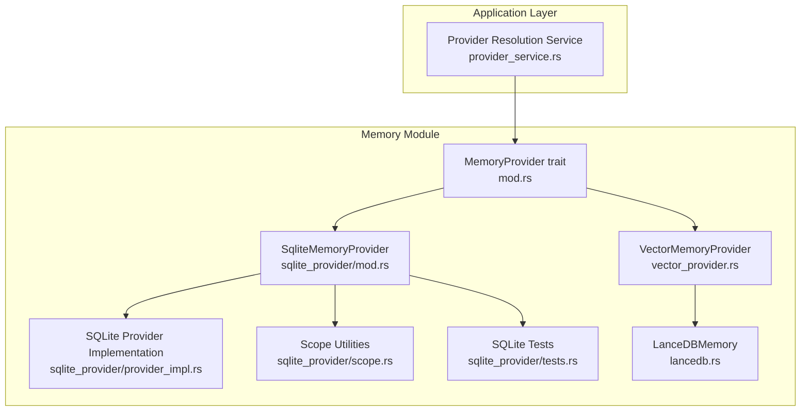
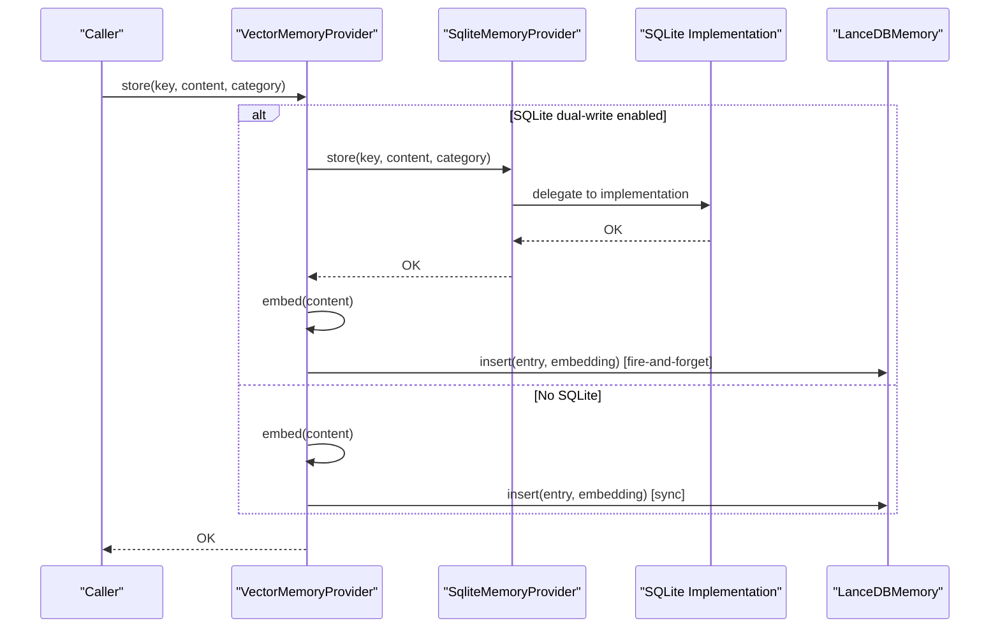
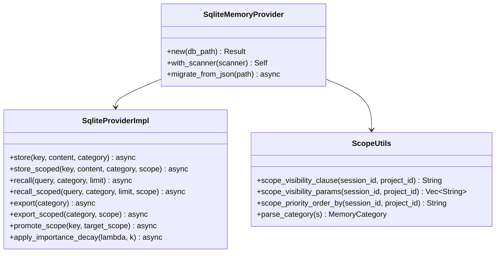
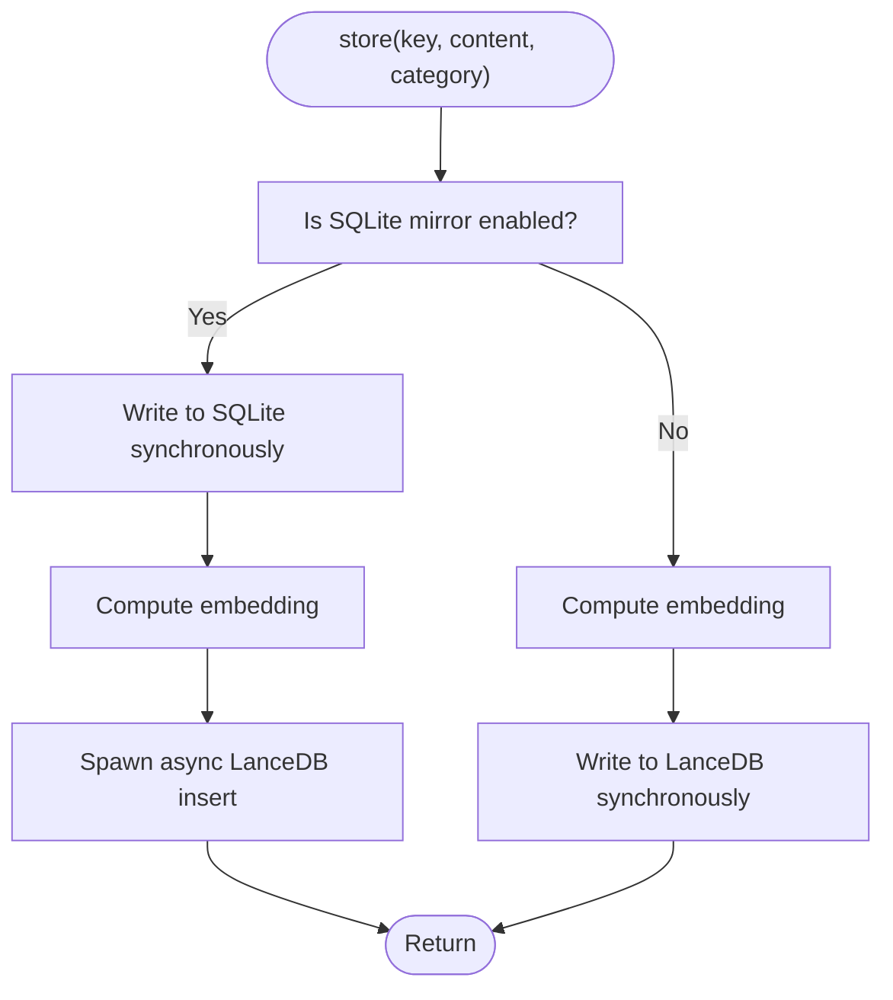
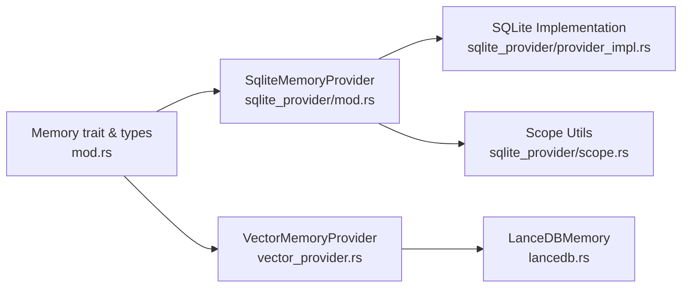

# Memory Provider Architecture

<cite>
**Referenced Files in This Document**
- [mod.rs](file://src-tauri/src/modules/memory/providers/sqlite_provider/mod.rs)
- [provider_impl.rs](file://src-tauri/src/modules/memory/providers/sqlite_provider/provider_impl.rs)
- [scope.rs](file://src-tauri/src/modules/memory/providers/sqlite_provider/scope.rs)
- [tests.rs](file://src-tauri/src/modules/memory/providers/sqlite_provider/tests.rs)
- [vector_provider.rs](file://src-tauri/src/modules/memory/providers/vector_provider.rs)
- [lancedb.rs](file://src-tauri/src/modules/memory/providers/lancedb.rs)
- [mod.rs](file://src-tauri/src/modules/memory/mod.rs)
- [provider_service.rs](file://src-tauri/src/modules/application/provider_service.rs)
</cite>

## Update Summary
**Changes Made**
- Updated SQLite provider file paths from monolithic structure to modular directory structure
- Added documentation for the new modular SQLite provider organization
- Updated file references to reflect the new directory layout (sqlite_provider/)
- Maintained all existing functionality while documenting the structural improvements

## Table of Contents
1. [Introduction](#introduction)
2. [Project Structure](#project-structure)
3. [Core Components](#core-components)
4. [Architecture Overview](#architecture-overview)
5. [Detailed Component Analysis](#detailed-component-analysis)
6. [Dependency Analysis](#dependency-analysis)
7. [Performance Considerations](#performance-considerations)
8. [Troubleshooting Guide](#troubleshooting-guide)
9. [Conclusion](#conclusion)

## Introduction
This document explains the memory provider architecture in If2Ai with a focus on the hybrid provider pattern that supports both SQLite and LanceDB backends. The architecture has been enhanced with improved modularity, particularly for the SQLite provider which has been restructured into a modular directory structure for better maintainability and separation of concerns. It details the dual-write strategy for data consistency, provider selection and initialization, configuration options, and practical examples for registration and synchronization. It also covers performance characteristics, provider-specific optimizations, limitations, and migration strategies.

## Project Structure
The memory subsystem is implemented in Rust under the Tauri application layer. The key components are organized into modular directories for better maintainability:

- A generic MemoryProvider trait that abstracts storage operations
- A SQLite-backed provider with modular structure (sqlite_provider/) for durable, scope-aware, and importance-decay-capable storage
- A vector-backed provider that wraps LanceDB with FastEmbed for semantic search
- A LanceDB vector store wrapper with ANN index management
- Application-level provider resolution service for other provider types (external APIs)

**Diagram sources**
- [mod.rs:201-380](file://src-tauri/src/modules/memory/mod.rs#L201-L380)
- [sqlite_provider/mod.rs:24-38](file://src-tauri/src/modules/memory/providers/sqlite_provider/mod.rs#L24-L38)
- [sqlite_provider/provider_impl.rs:18-595](file://src-tauri/src/modules/memory/providers/sqlite_provider/provider_impl.rs#L18-L595)
- [sqlite_provider/scope.rs:1-111](file://src-tauri/src/modules/memory/providers/sqlite_provider/scope.rs#L1-L111)
- [sqlite_provider/tests.rs:1-644](file://src-tauri/src/modules/memory/providers/sqlite_provider/tests.rs#L1-L644)
- [vector_provider.rs:98-117](file://src-tauri/src/modules/memory/providers/vector_provider.rs#L98-L117)
- [lancedb.rs:108-145](file://src-tauri/src/modules/memory/providers/lancedb.rs#L108-L145)
- [provider_service.rs:31-46](file://src-tauri/src/modules/application/provider_service.rs#L31-L46)

**Section sources**
- [mod.rs:1-120](file://src-tauri/src/modules/memory/mod.rs#L1-L120)
- [sqlite_provider/mod.rs:1-269](file://src-tauri/src/modules/memory/providers/sqlite_provider/mod.rs#L1-L269)
- [sqlite_provider/provider_impl.rs:1-595](file://src-tauri/src/modules/memory/providers/sqlite_provider/provider_impl.rs#L1-L595)
- [sqlite_provider/scope.rs:1-111](file://src-tauri/src/modules/memory/providers/sqlite_provider/scope.rs#L1-L111)
- [sqlite_provider/tests.rs:1-644](file://src-tauri/src/modules/memory/providers/sqlite_provider/tests.rs#L1-L644)
- [vector_provider.rs:1-767](file://src-tauri/src/modules/memory/providers/vector_provider.rs#L1-L767)
- [lancedb.rs:1-559](file://src-tauri/src/modules/memory/providers/lancedb.rs#L1-L559)
- [provider_service.rs:1-66](file://src-tauri/src/modules/application/provider_service.rs#L1-L66)

## Core Components
- MemoryProvider trait: Defines the contract for store/recall/delete/purge/export and scope-aware operations. It also provides default implementations for backward compatibility.
- SqliteMemoryProvider: Modular provider with separate files for implementation, scope utilities, and tests. Provides persistent, scope-aware, and importance-decay capable storage with robust indexing for category and scope filters.
- VectorMemoryProvider: Hybrid provider that dual-writes to SQLite (when configured) and asynchronously writes to LanceDB for vector search.
- LanceDBMemory: Wrapper around LanceDB with Arrow schema, vector search, FTS-like filtering, and optional IVF-PQ index creation.

Key responsibilities:
- Consistency: SQLite acts as the authoritative source; LanceDB mirrors data asynchronously.
- Scope isolation: SQLite enforces three-tier visibility rules (session, project, global) with modular scope utilities.
- Decay: SQLite supports Weibull importance decay; Vector provider delegates decay to SQLite when dual-write is enabled.

**Section sources**
- [mod.rs:201-380](file://src-tauri/src/modules/memory/mod.rs#L201-L380)
- [sqlite_provider/mod.rs:24-38](file://src-tauri/src/modules/memory/providers/sqlite_provider/mod.rs#L24-L38)
- [sqlite_provider/provider_impl.rs:18-595](file://src-tauri/src/modules/memory/providers/sqlite_provider/provider_impl.rs#L18-L595)
- [sqlite_provider/scope.rs:1-111](file://src-tauri/src/modules/memory/providers/sqlite_provider/scope.rs#L1-L111)
- [vector_provider.rs:98-117](file://src-tauri/src/modules/memory/providers/vector_provider.rs#L98-L117)
- [lancedb.rs:108-145](file://src-tauri/src/modules/memory/providers/lancedb.rs#L108-L145)

## Architecture Overview
The hybrid architecture couples a durable, scope-aware provider (SQLite) with a vector search engine (LanceDB). The SQLite provider has been restructured into a modular directory structure for better maintainability. Writes are dual-homed when SQLite is enabled, ensuring immediate durability and metadata correctness while enabling fast semantic search via LanceDB.

**Diagram sources**
- [vector_provider.rs:314-376](file://src-tauri/src/modules/memory/providers/vector_provider.rs#L314-L376)
- [sqlite_provider/provider_impl.rs:18-595](file://src-tauri/src/modules/memory/providers/sqlite_provider/provider_impl.rs#L18-L595)
- [sqlite_provider/mod.rs:40-105](file://src-tauri/src/modules/memory/providers/sqlite_provider/mod.rs#L40-L105)
- [lancedb.rs:147-164](file://src-tauri/src/modules/memory/providers/lancedb.rs#L147-L164)

**Section sources**
- [vector_provider.rs:314-376](file://src-tauri/src/modules/memory/providers/vector_provider.rs#L314-L376)
- [sqlite_provider/provider_impl.rs:18-595](file://src-tauri/src/modules/memory/providers/sqlite_provider/provider_impl.rs#L18-L595)
- [sqlite_provider/mod.rs:40-105](file://src-tauri/src/modules/memory/providers/sqlite_provider/mod.rs#L40-L105)
- [lancedb.rs:147-164](file://src-tauri/src/modules/memory/providers/lancedb.rs#L147-L164)

## Detailed Component Analysis

### MemoryProvider Trait
Defines the unified interface for memory operations:
- Basic CRUD: store, recall, delete, purge_category, export
- Scope-aware variants: store_scoped, recall_scoped, export_scoped, promote_scope, demote_scope
- Bulk operations: clear_all with optimized overrides where available
- Importance decay hook: apply_importance_decay with default no-op

Behavioral notes:
- Default implementations delegate to non-scope variants for backward compatibility.
- clear_all is optimized by providers that support fast bulk deletion (e.g., SQLite).
- Scope operations require providers that persist scope metadata.

**Section sources**
- [mod.rs:201-380](file://src-tauri/src/modules/memory/mod.rs#L201-L380)

### SqliteMemoryProvider (Modular Structure)
The SQLite provider has been restructured into a modular directory structure for improved maintainability:

**Main Provider Module** (`sqlite_provider/mod.rs`):
- Contains the main SqliteMemoryProvider struct definition and initialization logic
- Handles database connection management and schema initialization
- Provides builder pattern with ThreatScanner integration
- Manages migration from legacy JSON format

**Implementation Module** (`sqlite_provider/provider_impl.rs`):
- Contains the MemoryProvider trait implementation
- Implements all CRUD operations with proper async/await patterns
- Handles scope-aware queries with three-tier visibility rules
- Provides importance decay calculations and persistence
- Manages category parsing and row conversion

**Scope Utilities** (`sqlite_provider/scope.rs`):
- Contains helper functions for scope-aware SQL operations
- Provides SQL WHERE clause construction for visibility rules
- Implements parameter binding for scope filters
- Handles ranking logic for scope priority ordering

**Test Module** (`sqlite_provider/tests.rs`):
- Comprehensive test suite covering all provider functionality
- Tests scope isolation, visibility rules, and three-tier hierarchy
- Validates migration from legacy JSON format
- Includes importance decay testing and export functionality

Key implementation details:
- Schema includes category, timestamps, importance, access_count, trust_score, and optional session_id/project_id for scope
- Modular scope utilities handle complex visibility rules and parameter binding
- Separate test module ensures comprehensive coverage without bloating the main implementation
- spawn_blocking wrappers for SQLite operations maintain async ergonomics

**Diagram sources**
- [sqlite_provider/mod.rs:24-38](file://src-tauri/src/modules/memory/providers/sqlite_provider/mod.rs#L24-L38)
- [sqlite_provider/provider_impl.rs:18-595](file://src-tauri/src/modules/memory/providers/sqlite_provider/provider_impl.rs#L18-L595)
- [sqlite_provider/scope.rs:15-111](file://src-tauri/src/modules/memory/providers/sqlite_provider/scope.rs#L15-L111)

**Section sources**
- [sqlite_provider/mod.rs:24-38](file://src-tauri/src/modules/memory/providers/sqlite_provider/mod.rs#L24-L38)
- [sqlite_provider/provider_impl.rs:18-595](file://src-tauri/src/modules/memory/providers/sqlite_provider/provider_impl.rs#L18-L595)
- [sqlite_provider/scope.rs:15-111](file://src-tauri/src/modules/memory/providers/sqlite_provider/scope.rs#L15-L111)
- [sqlite_provider/tests.rs:1-644](file://src-tauri/src/modules/memory/providers/sqlite_provider/tests.rs#L1-L644)

### VectorMemoryProvider
Responsibilities:
- Hybrid provider combining FastEmbed and LanceDB
- Optional dual-write to SQLite for durability and metadata consistency
- Scope-aware operations that delegate to SQLite mirror
- Importance decay delegation to SQLite when enabled
- Hybrid search combining vector and full-text search with Reciprocal Rank Fusion

Initialization and configuration:
- VectorProviderConfig controls LanceDB path, vector search enablement, and optional SQLite dual-write path
- New() initializes FastEmbed, creates/open LanceDB table, attempts to create IVF-PQ index, and optionally constructs SQLite provider
- Scanner integration for PII redaction before writing to both stores

Dual-write strategy:
- SQLite-first synchronous write ensures durability and metadata correctness
- LanceDB insert is fire-and-forget when SQLite is present; synchronous when SQLite is absent
- Errors in LanceDB writes are logged but do not fail the overall operation

**Diagram sources**
- [vector_provider.rs:314-376](file://src-tauri/src/modules/memory/providers/vector_provider.rs#L314-L376)
- [vector_provider.rs:351-373](file://src-tauri/src/modules/memory/providers/vector_provider.rs#L351-L373)

**Section sources**
- [vector_provider.rs:55-96](file://src-tauri/src/modules/memory/providers/vector_provider.rs#L55-L96)
- [vector_provider.rs:119-178](file://src-tauri/src/modules/memory/providers/vector_provider.rs#L119-L178)
- [vector_provider.rs:314-376](file://src-tauri/src/modules/memory/providers/vector_provider.rs#L314-L376)

### LanceDBMemory
Responsibilities:
- Manage LanceDB connection and table lifecycle
- Insert entries with embeddings and Arrow schema
- Vector search with optional category filter
- Full-text search via client-side filtering
- Export all entries and count rows
- Ensure IVF-PQ index with soft-failure behavior

Optimizations:
- IVF-PQ index creation guarded by minimum row thresholds and idempotent checks
- Batched Arrow RecordBatches for efficient inserts
- Optional FTS-like filtering when full-text index is not configured

**Section sources**
- [lancedb.rs:108-145](file://src-tauri/src/modules/memory/providers/lancedb.rs#L108-L145)
- [lancedb.rs:283-342](file://src-tauri/src/modules/memory/providers/lancedb.rs#L283-L342)
- [lancedb.rs:147-265](file://src-tauri/src/modules/memory/providers/lancedb.rs#L147-L265)

### Provider Registration and Initialization
- Memory providers are registered behind the MemoryProvider trait. The application's default provider is SQLite-backed.
- VectorMemoryProvider is constructed with VectorProviderConfig, enabling dual-write by setting sqlite_path.
- Provider resolution service exists for external LLM providers; it is orthogonal to the memory provider architecture.

Practical examples (paths only):
- Construct Vector provider with dual-write: [vector_provider.rs:119-178](file://src-tauri/src/modules/memory/providers/vector_provider.rs#L119-L178)
- Enable SQLite mirror via config builder: [vector_provider.rs:86-96](file://src-tauri/src/modules/memory/providers/vector_provider.rs#L86-L96)
- Default SQLite provider creation: [mod.rs:493-516](file://src-tauri/src/modules/memory/mod.rs#L493-L516)

**Section sources**
- [vector_provider.rs:86-96](file://src-tauri/src/modules/memory/providers/vector_provider.rs#L86-L96)
- [vector_provider.rs:119-178](file://src-tauri/src/modules/memory/providers/vector_provider.rs#L119-L178)
- [mod.rs:493-516](file://src-tauri/src/modules/memory/mod.rs#L493-L516)

## Dependency Analysis
The memory providers depend on shared types and traits defined in the memory module. VectorMemoryProvider composes SQLite and LanceDB providers, while the modular SQLite provider encapsulates all persistence logic into separate, focused modules.

**Diagram sources**
- [mod.rs:201-380](file://src-tauri/src/modules/memory/mod.rs#L201-L380)
- [sqlite_provider/mod.rs:24-38](file://src-tauri/src/modules/memory/providers/sqlite_provider/mod.rs#L24-L38)
- [sqlite_provider/provider_impl.rs:18-595](file://src-tauri/src/modules/memory/providers/sqlite_provider/provider_impl.rs#L18-L595)
- [sqlite_provider/scope.rs:15-111](file://src-tauri/src/modules/memory/providers/sqlite_provider/scope.rs#L15-L111)
- [vector_provider.rs:98-117](file://src-tauri/src/modules/memory/providers/vector_provider.rs#L98-L117)
- [lancedb.rs:108-145](file://src-tauri/src/modules/memory/providers/lancedb.rs#L108-L145)

**Section sources**
- [mod.rs:201-380](file://src-tauri/src/modules/memory/mod.rs#L201-L380)
- [sqlite_provider/mod.rs:24-38](file://src-tauri/src/modules/memory/providers/sqlite_provider/mod.rs#L24-L38)
- [sqlite_provider/provider_impl.rs:18-595](file://src-tauri/src/modules/memory/providers/sqlite_provider/provider_impl.rs#L18-L595)
- [sqlite_provider/scope.rs:15-111](file://src-tauri/src/modules/memory/providers/sqlite_provider/scope.rs#L15-L111)
- [vector_provider.rs:98-117](file://src-tauri/src/modules/memory/providers/vector_provider.rs#L98-L117)
- [lancedb.rs:108-145](file://src-tauri/src/modules/memory/providers/lancedb.rs#L108-L145)

## Performance Considerations
- SQLite provider:
  - Excellent for scope-aware queries and importance-based ranking due to targeted indexes.
  - Good for small to medium datasets; performance scales with index coverage and query complexity.
  - Bulk operations like clear_all are optimized via single DELETE statements.
  - Modular structure improves maintainability and allows for targeted optimization of specific components.
- Vector provider:
  - Fast vector search with optional IVF-PQ index; index creation is soft-failed to avoid blocking startup.
  - Hybrid search fuses vector and full-text results; parallel search improves latency.
  - Asynchronous LanceDB writes reduce write latency at the cost of eventual consistency.
- Cross-store consistency:
  - SQLite-first dual-write ensures durability and metadata correctness; LanceDB lag is acceptable for semantic search.

## Troubleshooting Guide
Common issues and remedies:
- Vector provider fails to dual-write to SQLite:
  - Symptom: Vector writes succeed but no metadata persistence.
  - Cause: SQLite initialization failure or path misconfiguration.
  - Remedy: Verify sqlite_path existence and permissions; check logs for SQLite init warnings.
  - Reference: [vector_provider.rs:150-169](file://src-tauri/src/modules/memory/providers/vector_provider.rs#L150-L169)
- Vector provider embedding failures:
  - Symptom: store fails with embedding error.
  - Cause: FastEmbed model load or dimension mismatch.
  - Remedy: Ensure model availability and correct embedding dimension.
  - Reference: [vector_provider.rs:332-335](file://src-tauri/src/modules/memory/providers/vector_provider.rs#L332-L335)
- LanceDB insert errors:
  - Symptom: Async LanceDB insert warnings.
  - Cause: Dimension mismatch or transient storage error.
  - Remedy: Validate embedding dimension and retry; check IVF-PQ index creation logs.
  - Reference: [lancedb.rs:147-164](file://src-tauri/src/modules/memory/providers/lancedb.rs#L147-L164)
- Scope visibility anomalies:
  - Symptom: Entries visible outside intended scope.
  - Cause: Missing or incorrect scope metadata.
  - Remedy: Use store_scoped to persist scope; verify recall_scoped filters.
  - Reference: [sqlite_provider/provider_impl.rs:111-232](file://src-tauri/src/modules/memory/providers/sqlite_provider/provider_impl.rs#L111-L232)
- Importance decay not applied:
  - Symptom: Importance scores unchanged.
  - Cause: Vector provider not configured with SQLite dual-write.
  - Remedy: Enable sqlite_path to delegate decay to SQLite.
  - Reference: [vector_provider.rs:476-492](file://src-tauri/src/modules/memory/providers/vector_provider.rs#L476-L492)

**Section sources**
- [vector_provider.rs:150-169](file://src-tauri/src/modules/memory/providers/vector_provider.rs#L150-L169)
- [vector_provider.rs:332-335](file://src-tauri/src/modules/memory/providers/vector_provider.rs#L332-L335)
- [lancedb.rs:147-164](file://src-tauri/src/modules/memory/providers/lancedb.rs#L147-L164)
- [sqlite_provider/provider_impl.rs:111-232](file://src-tauri/src/modules/memory/providers/sqlite_provider/provider_impl.rs#L111-L232)
- [vector_provider.rs:476-492](file://src-tauri/src/modules/memory/providers/vector_provider.rs#L476-L492)

## Conclusion
The memory provider architecture in If2Ai leverages a hybrid pattern to balance durability, scope isolation, and semantic search performance. The SQLite provider has been enhanced with a modular directory structure that improves maintainability while preserving all existing functionality. SQLite provides authoritative metadata and decay, while LanceDB accelerates vector search. The dual-write strategy ensures consistency and resilience, with graceful degradation when components fail. Proper configuration, monitoring, and understanding of scope and decay semantics are essential for reliable operation. The modular structure of the SQLite provider demonstrates good software engineering practices with clear separation of concerns and comprehensive test coverage.