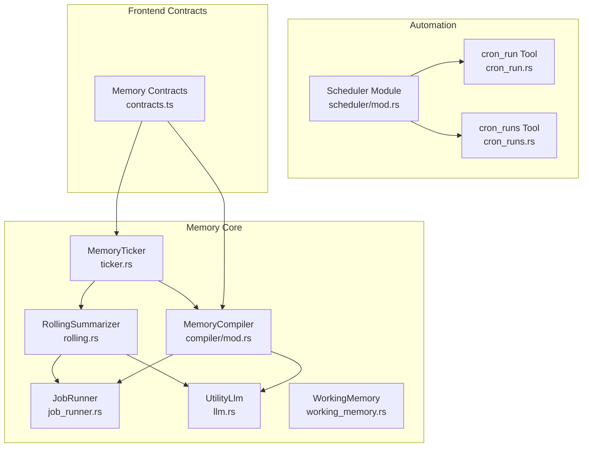
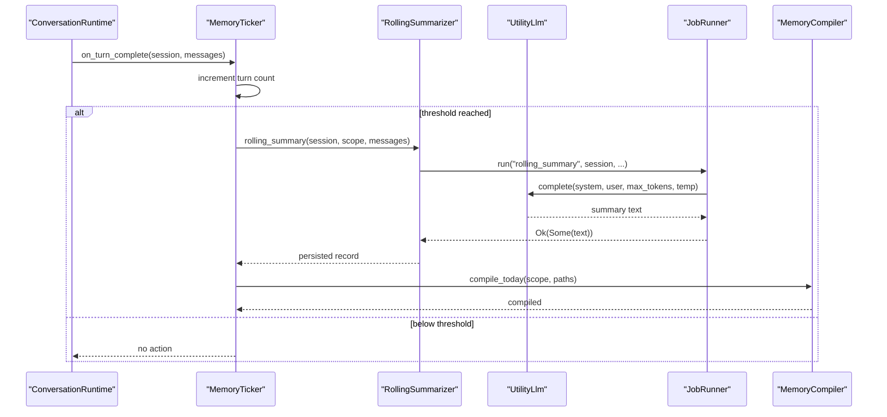
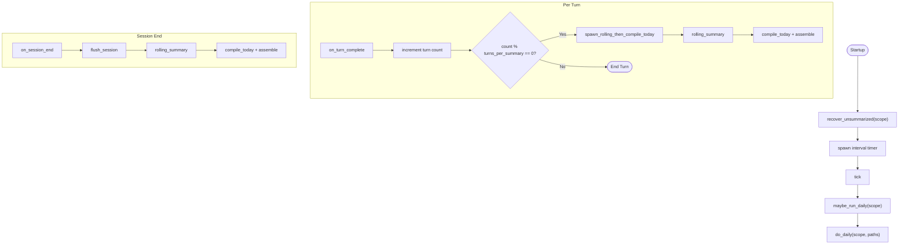
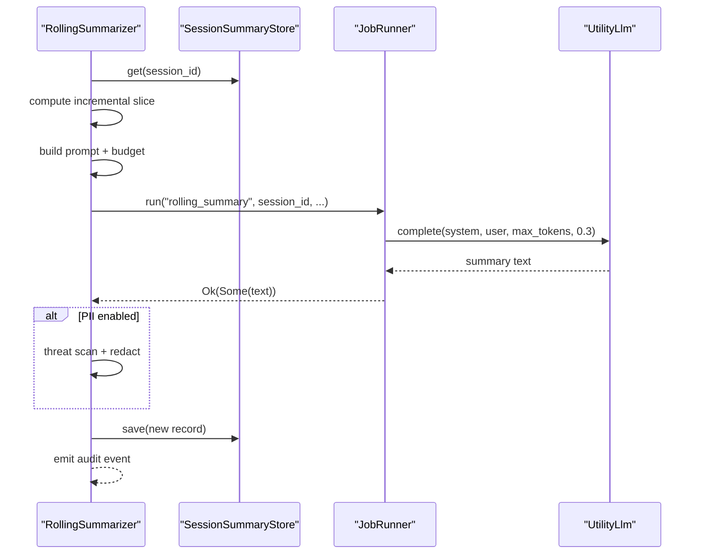
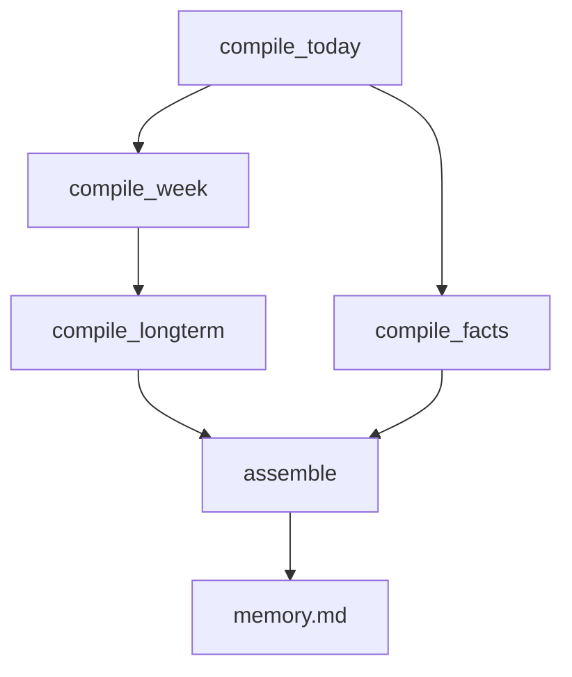
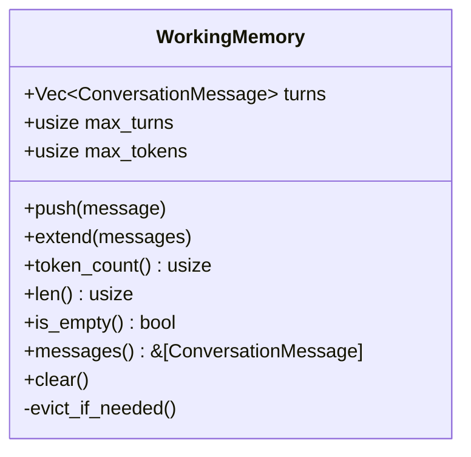
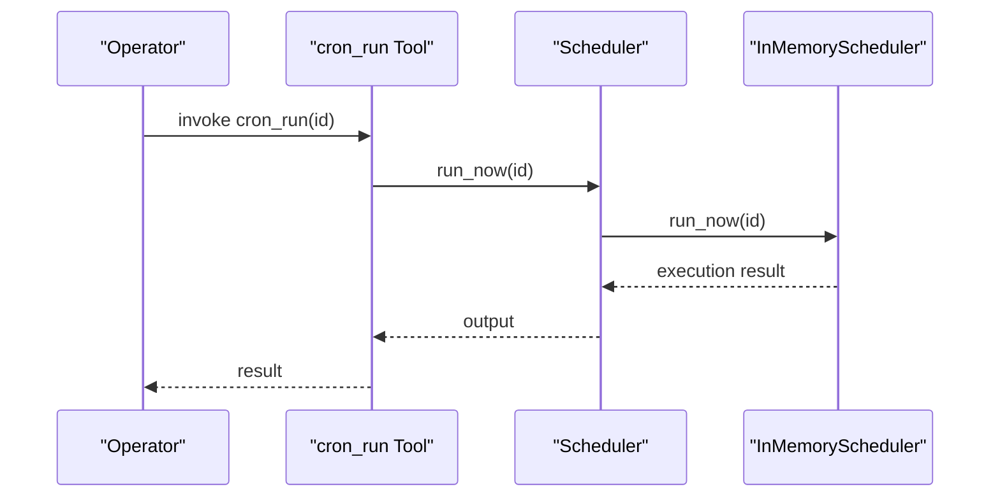
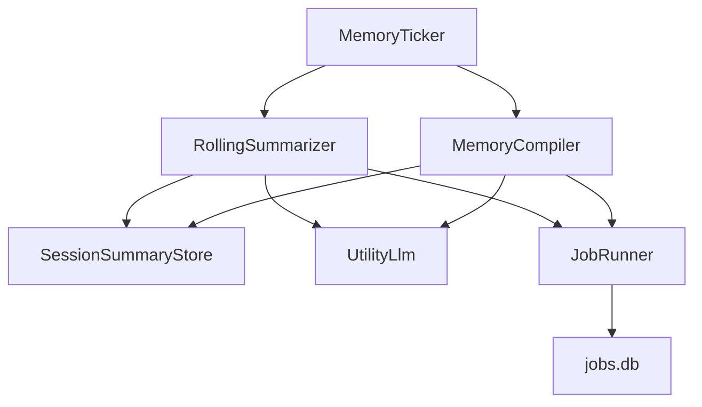

# Memory Summary and Automation

<cite>
**Referenced Files in This Document**
- [ticker.rs](file://src-tauri/src/modules/memory/ticker.rs)
- [job_runner.rs](file://src-tauri/src/modules/memory/job_runner.rs)
- [rolling.rs](file://src-tauri/src/modules/memory/summary/rolling.rs)
- [working_memory.rs](file://src-tauri/src/modules/memory/working_memory.rs)
- [mod.rs (memory)](file://src-tauri/src/modules/memory/mod.rs)
- [compiler/mod.rs](file://src-tauri/src/modules/memory/compiler/mod.rs)
- [today.rs](file://src-tauri/src/modules/memory/compiler/today.rs)
- [week.rs](file://src-tauri/src/modules/memory/compiler/week.rs)
- [longterm.rs](file://src-tauri/src/modules/memory/compiler/longterm.rs)
- [facts.rs](file://src-tauri/src/modules/memory/compiler/facts.rs)
- [llm.rs](file://src-tauri/src/modules/memory/llm.rs)
- [contracts.ts](file://src/transport/contracts.ts)
- [scheduler/mod.rs](file://src-tauri/src/modules/scheduler/mod.rs)
- [cron_run.rs](file://src-tauri/src/modules/tools/builtin/cron_run.rs)
- [cron_runs.rs](file://src-tauri/src/modules/tools/builtin/cron_runs.rs)
</cite>

## Table of Contents
1. [Introduction](#introduction)
2. [Project Structure](#project-structure)
3. [Core Components](#core-components)
4. [Architecture Overview](#architecture-overview)
5. [Detailed Component Analysis](#detailed-component-analysis)
6. [Dependency Analysis](#dependency-analysis)
7. [Performance Considerations](#performance-considerations)
8. [Troubleshooting Guide](#troubleshooting-guide)
9. [Conclusion](#conclusion)

## Introduction
This document explains the memory summary and automation features in If2Ai. It covers the rolling summary system for automatic content summarization, working memory management for short-term processing, and automated job scheduling for memory maintenance tasks. It details the summary generation pipeline, LLM-assisted summarization, and temporal organization of memories. It also describes the ticker system for periodic memory operations, the job runner for background tasks, and workflow automation patterns. Practical examples illustrate summary generation, working memory optimization, and automated maintenance schedules.

## Project Structure
The memory subsystem is implemented primarily in Rust under the memory module, with supporting components for scheduling, tools, and front-end contracts. The key areas include:
- Memory ticker and scheduler for turn-based and daily automation
- Rolling summarizer and LLM integration
- Memory compiler for daily/weekly/long-term aggregation
- Job runner for retry and idempotent background tasks
- Working memory for short-term conversation retention
- Scheduler module and tools for cron-based automation



**Diagram sources**
- [ticker.rs:134-170](file://src-tauri/src/modules/memory/ticker.rs#L134-L170)
- [rolling.rs:85-112](file://src-tauri/src/modules/memory/summary/rolling.rs#L85-L112)
- [compiler/mod.rs:113-150](file://src-tauri/src/modules/memory/compiler/mod.rs#L113-L150)
- [job_runner.rs:140-147](file://src-tauri/src/modules/memory/job_runner.rs#L140-L147)
- [llm.rs:42-54](file://src-tauri/src/modules/memory/llm.rs#L42-L54)
- [working_memory.rs:9-28](file://src-tauri/src/modules/memory/working_memory.rs#L9-L28)
- [scheduler/mod.rs:51-78](file://src-tauri/src/modules/scheduler/mod.rs#L51-L78)
- [cron_run.rs:37-59](file://src-tauri/src/modules/tools/builtin/cron_run.rs#L37-L59)
- [cron_runs.rs:75-101](file://src-tauri/src/modules/tools/builtin/cron_runs.rs#L75-L101)
- [contracts.ts:231-257](file://src/transport/contracts.ts#L231-L257)

**Section sources**
- [mod.rs (memory):1-120](file://src-tauri/src/modules/memory/mod.rs#L1-L120)
- [contracts.ts:231-257](file://src/transport/contracts.ts#L231-L257)

## Core Components
- MemoryTicker: Drives rolling summaries and daily compilation cycles, coordinates per-turn and session-end actions, and manages recovery and periodic execution.
- RollingSummarizer: Orchestrates per-session rolling summaries using LLMs, with safety checks and audit emission.
- MemoryCompiler: Coordinates daily/weekly/long-term compilation and assembly of memory artifacts.
- JobRunner: Provides bounded retries, concurrency control, and persistence for background memory jobs.
- WorkingMemory: Sliding window for short-term conversation retention with turn and token budget controls.
- Scheduler and Tools: Cron-based scheduling and manual trigger tools for memory maintenance.

**Section sources**
- [ticker.rs:134-170](file://src-tauri/src/modules/memory/ticker.rs#L134-L170)
- [rolling.rs:85-112](file://src-tauri/src/modules/memory/summary/rolling.rs#L85-L112)
- [compiler/mod.rs:113-150](file://src-tauri/src/modules/memory/compiler/mod.rs#L113-L150)
- [job_runner.rs:140-147](file://src-tauri/src/modules/memory/job_runner.rs#L140-L147)
- [working_memory.rs:9-28](file://src-tauri/src/modules/memory/working_memory.rs#L9-L28)
- [scheduler/mod.rs:51-78](file://src-tauri/src/modules/scheduler/mod.rs#L51-L78)
- [cron_run.rs:37-59](file://src-tauri/src/modules/tools/builtin/cron_run.rs#L37-L59)
- [cron_runs.rs:75-101](file://src-tauri/src/modules/tools/builtin/cron_runs.rs#L75-L101)

## Architecture Overview
The memory automation architecture integrates turn-based and daily workflows:
- Turn-based: MemoryTicker increments per-session turn counts and triggers rolling summaries and daily compilation at configured intervals.
- Session-end: Forces a final rolling summary and compiles daily artifacts.
- Daily: Runs a topological sequence of compilation steps (today → week → longterm → facts → assemble), with idempotency and per-step tracking.
- Background: JobRunner enforces retry budgets, concurrency limits, and persistence for all memory mutations.



**Diagram sources**
- [ticker.rs:750-800](file://src-tauri/src/modules/memory/ticker.rs#L750-L800)
- [rolling.rs:137-310](file://src-tauri/src/modules/memory/summary/rolling.rs#L137-L310)
- [job_runner.rs:293-348](file://src-tauri/src/modules/memory/job_runner.rs#L293-L348)
- [llm.rs:42-54](file://src-tauri/src/modules/memory/llm.rs#L42-L54)
- [compiler/mod.rs:163-179](file://src-tauri/src/modules/memory/compiler/mod.rs#L163-L179)

## Detailed Component Analysis

### MemoryTicker: Turn-Based Scheduler and Daily Orchestration
- Responsibilities:
  - Per-turn: Track user turns per session and trigger rolling summary and daily compilation when thresholds are met.
  - Session-end: Force final rolling summary and compile daily artifacts synchronously.
  - Daily: Execute a topological sequence of compilation steps with idempotency and per-step completion tracking.
  - Startup: Recover unsummarized sessions and start a periodic timer for daily kicks.
- Key mechanisms:
  - Configurable turns per summary and daily check interval.
  - State tracking for in-progress summaries and daily step completion.
  - Atomic file writes and audit emissions.



**Diagram sources**
- [ticker.rs:435-465](file://src-tauri/src/modules/memory/ticker.rs#L435-L465)
- [ticker.rs:382-409](file://src-tauri/src/modules/memory/ticker.rs#L382-L409)
- [ticker.rs:366-372](file://src-tauri/src/modules/memory/ticker.rs#L366-L372)
- [ticker.rs:210-261](file://src-tauri/src/modules/memory/ticker.rs#L210-L261)
- [ticker.rs:277-338](file://src-tauri/src/modules/memory/ticker.rs#L277-L338)

**Section sources**
- [ticker.rs:56-80](file://src-tauri/src/modules/memory/ticker.rs#L56-L80)
- [ticker.rs:107-128](file://src-tauri/src/modules/memory/ticker.rs#L107-L128)
- [ticker.rs:340-372](file://src-tauri/src/modules/memory/ticker.rs#L340-L372)
- [ticker.rs:411-465](file://src-tauri/src/modules/memory/ticker.rs#L411-L465)

### RollingSummarizer: LLM-Assisted Per-Session Summaries
- Pipeline:
  - Read existing summary record and compute incremental message slice.
  - Format conversation text and compute budget based on user turns.
  - Build prompt and invoke LLM through JobRunner with bounded retries.
  - PII scrub (optional) and persist new summary record.
  - Emit audit event for telemetry.
- Safety and UX:
  - Short-circuits for empty inputs, recent compact summaries, and JobRunner quarantine.
  - Deterministic temperature for stability across re-runs.



**Diagram sources**
- [rolling.rs:137-310](file://src-tauri/src/modules/memory/summary/rolling.rs#L137-L310)
- [job_runner.rs:293-348](file://src-tauri/src/modules/memory/job_runner.rs#L293-L348)
- [llm.rs:42-54](file://src-tauri/src/modules/memory/llm.rs#L42-L54)

**Section sources**
- [rolling.rs:10-42](file://src-tauri/src/modules/memory/summary/rolling.rs#L10-L42)
- [rolling.rs:121-310](file://src-tauri/src/modules/memory/summary/rolling.rs#L121-L310)
- [llm.rs:42-54](file://src-tauri/src/modules/memory/llm.rs#L42-L54)

### MemoryCompiler: Daily Compilation and Assembly
- Responsibilities:
  - compile_today: Consolidate daily rolling summaries into today.md with fingerprint caching.
  - compile_week: Aggregate last 7 days into week.md with fingerprint caching.
  - compile_longterm: Fold week.md into longterm.md with bilingual prompt.
  - compile_facts: Extract structured facts from rolling/daily summaries.
  - assemble: Concatenate outputs into memory.md.
- Idempotency and retry:
  - Uses JobRunner for each step with distinct job kinds.
  - Fingerprint-based caching avoids unnecessary LLM calls.



**Diagram sources**
- [compiler/mod.rs:163-266](file://src-tauri/src/modules/memory/compiler/mod.rs#L163-L266)
- [today.rs:64-158](file://src-tauri/src/modules/memory/compiler/today.rs#L64-L158)
- [week.rs:37-127](file://src-tauri/src/modules/memory/compiler/week.rs#L37-L127)
- [longterm.rs:41-136](file://src-tauri/src/modules/memory/compiler/longterm.rs#L41-L136)
- [facts.rs:103-111](file://src-tauri/src/modules/memory/compiler/facts.rs#L103-L111)

**Section sources**
- [compiler/mod.rs:47-105](file://src-tauri/src/modules/memory/compiler/mod.rs#L47-L105)
- [today.rs:53-158](file://src-tauri/src/modules/memory/compiler/today.rs#L53-L158)
- [week.rs:35-127](file://src-tauri/src/modules/memory/compiler/week.rs#L35-L127)
- [longterm.rs:36-136](file://src-tauri/src/modules/memory/compiler/longterm.rs#L36-L136)
- [facts.rs:92-111](file://src-tauri/src/modules/memory/compiler/facts.rs#L92-L111)

### JobRunner: Retry, Concurrency, and Persistence
- Guarantees:
  - Bounded retries per job kind and target.
  - Concurrency cap via semaphore.
  - Audit emission and persistence of job attempts in jobs.db.
- Operations:
  - run: Executes closure under retry/concurrency envelope.
  - reset: Re-activate a previously skipped job.
  - current_attempt: Inspect current status and attempt count.

```mermaid
flowchart TD
Start([run(kind, target)]) --> Acquire["acquire semaphore"]
Acquire --> Read["read current attempt"]
Read --> Skipped{"status == Skipped?"}
Skipped --> |Yes| ReturnNone["return Ok(None)"]
Skipped --> |No| Exec["execute closure"]
Exec --> Ok{"result Ok?"}
Ok --> |Yes| Done["persist Done + reset attempt"]
Ok --> |No| Err{"attempt < max?"}
Err --> |Yes| Active["persist Active + inc attempt"]
Err --> |No| SkippedPersist["persist Skipped + emit skip audit"]
Done --> ReturnSome["return Ok(Some)"]
Active --> ReturnGeneric["return Err(Generic)"]
SkippedPersist --> ReturnNone
```

**Diagram sources**
- [job_runner.rs:293-348](file://src-tauri/src/modules/memory/job_runner.rs#L293-L348)
- [job_runner.rs:412-452](file://src-tauri/src/modules/memory/job_runner.rs#L412-L452)

**Section sources**
- [job_runner.rs:116-138](file://src-tauri/src/modules/memory/job_runner.rs#L116-L138)
- [job_runner.rs:277-348](file://src-tauri/src/modules/memory/job_runner.rs#L277-L348)

### WorkingMemory: Short-Term Conversation Retention
- Sliding window eviction by turn count and token budget.
- Estimates token counts per message and maintains bounded memory footprint.
- Supports push, extend, clear, and inspection APIs.



**Diagram sources**
- [working_memory.rs:9-28](file://src-tauri/src/modules/memory/working_memory.rs#L9-L28)
- [working_memory.rs:81-91](file://src-tauri/src/modules/memory/working_memory.rs#L81-L91)

**Section sources**
- [working_memory.rs:9-91](file://src-tauri/src/modules/memory/working_memory.rs#L9-L91)

### Scheduler and Tools: Automated Maintenance Schedules
- Scheduler trait provides cron job management (add, remove, list, run_now, get_runs, set_status).
- InMemoryScheduler offers a lightweight implementation for testing and development.
- Tools:
  - cron_run: Immediately run a named cron job.
  - cron_runs: Retrieve run history for a job.



**Diagram sources**
- [scheduler/mod.rs:51-78](file://src-tauri/src/modules/scheduler/mod.rs#L51-L78)
- [cron_run.rs:37-59](file://src-tauri/src/modules/tools/builtin/cron_run.rs#L37-L59)
- [cron_runs.rs:75-101](file://src-tauri/src/modules/tools/builtin/cron_runs.rs#L75-L101)

**Section sources**
- [scheduler/mod.rs:11-78](file://src-tauri/src/modules/scheduler/mod.rs#L11-L78)
- [cron_run.rs:32-77](file://src-tauri/src/modules/tools/builtin/cron_run.rs#L32-L77)
- [cron_runs.rs:75-119](file://src-tauri/src/modules/tools/builtin/cron_runs.rs#L75-L119)

### Practical Examples

- Example: Summary Generation
  - Trigger: After every N user turns, MemoryTicker spawns rolling_summary and compile_today.
  - Behavior: RollingSummarizer formats conversation slice, computes budget, builds prompt, and persists summary via JobRunner.
  - Output: today.md updated and memory.md assembled.

  **Section sources**
  - [ticker.rs:210-261](file://src-tauri/src/modules/memory/ticker.rs#L210-L261)
  - [rolling.rs:137-310](file://src-tauri/src/modules/memory/summary/rolling.rs#L137-L310)
  - [today.rs:64-158](file://src-tauri/src/modules/memory/compiler/today.rs#L64-L158)

- Example: Working Memory Optimization
  - Scenario: High conversation volume with strict token budget.
  - Action: Adjust WorkingMemory max_turns and max_tokens to maintain responsiveness.
  - Effect: Automatic eviction of oldest messages when limits are exceeded.

  **Section sources**
  - [working_memory.rs:81-91](file://src-tauri/src/modules/memory/working_memory.rs#L81-L91)

- Example: Automated Maintenance Schedule
  - Setup: Add a cron job via Scheduler.add with a standard cron expression.
  - Execution: Use cron_run to immediately execute a job; inspect history with cron_runs.
  - Recovery: On startup, MemoryTicker recovers unsummarized sessions and schedules daily runs.

  **Section sources**
  - [scheduler/mod.rs:98-131](file://src-tauri/src/modules/scheduler/mod.rs#L98-L131)
  - [cron_run.rs:37-59](file://src-tauri/src/modules/tools/builtin/cron_run.rs#L37-L59)
  - [cron_runs.rs:75-101](file://src-tauri/src/modules/tools/builtin/cron_runs.rs#L75-L101)
  - [ticker.rs:494-584](file://src-tauri/src/modules/memory/ticker.rs#L494-L584)

## Dependency Analysis
- Cohesion and coupling:
  - MemoryTicker depends on RollingSummarizer, MemoryCompiler, SessionSummaryStore, and JobRunner.
  - RollingSummarizer depends on SessionSummaryStore, UtilityLlm, and JobRunner.
  - MemoryCompiler depends on SessionSummaryStore, UtilityLlm, JobRunner, and CompilePaths.
  - JobRunner is a standalone coordinator with SQLite persistence and audit emission.
- External integrations:
  - UtilityLlm provides a trait boundary to LLM providers, enabling pluggable providers.
  - Scheduler module and tools integrate cron-based automation with the broader system.



**Diagram sources**
- [ticker.rs:134-170](file://src-tauri/src/modules/memory/ticker.rs#L134-L170)
- [rolling.rs:85-112](file://src-tauri/src/modules/memory/summary/rolling.rs#L85-L112)
- [compiler/mod.rs:113-150](file://src-tauri/src/modules/memory/compiler/mod.rs#L113-L150)
- [job_runner.rs:140-147](file://src-tauri/src/modules/memory/job_runner.rs#L140-L147)

**Section sources**
- [mod.rs (memory):32-87](file://src-tauri/src/modules/memory/mod.rs#L32-L87)
- [llm.rs:42-54](file://src-tauri/src/modules/memory/llm.rs#L42-L54)

## Performance Considerations
- Bounded retries and concurrency:
  - JobRunner caps concurrent LLM calls and prevents thundering herds after sleep/boots.
- Fingerprint caching:
  - compile_today, compile_week, and compile_longterm avoid LLM calls when fingerprints match.
- Atomic writes:
  - Atomic file rename minimizes contention and ensures consistent reads.
- Budget-aware prompts:
  - Token budget clamping prevents extreme truncation or provider limits.

[No sources needed since this section provides general guidance]

## Troubleshooting Guide
- Rolling summary not triggering:
  - Verify turns_per_summary threshold and that session_id is not sentinel.
  - Check JobRunner status for the "rolling_summary" kind and target.
- Daily compilation stuck:
  - Inspect daily step completion and last_daily_job_date in MemoryTicker state.
  - Review per-step audits for failures and retry counts.
- LLM throttling or quota exceeded:
  - JobRunner transitions jobs to Skipped after max_retries; use reset to re-enable.
- Scheduler jobs not running:
  - Confirm cron expressions and job status; use cron_run to force immediate execution and cron_runs to inspect history.

**Section sources**
- [ticker.rs:611-725](file://src-tauri/src/modules/memory/ticker.rs#L611-L725)
- [job_runner.rs:241-275](file://src-tauri/src/modules/memory/job_runner.rs#L241-L275)
- [scheduler/mod.rs:150-183](file://src-tauri/src/modules/scheduler/mod.rs#L150-L183)

## Conclusion
If2Ai’s memory system combines a robust rolling summary pipeline, daily compilation orchestration, and reliable background job execution to deliver autonomous memory maintenance. MemoryTicker coordinates turn-based and daily workflows, RollingSummarizer ensures safe and auditable LLM-assisted summaries, and MemoryCompiler aggregates temporal memories into coherent artifacts. JobRunner provides resilience through bounded retries and persistence, while WorkingMemory optimizes short-term processing. Together, these components enable scalable, observable, and maintainable memory automation.