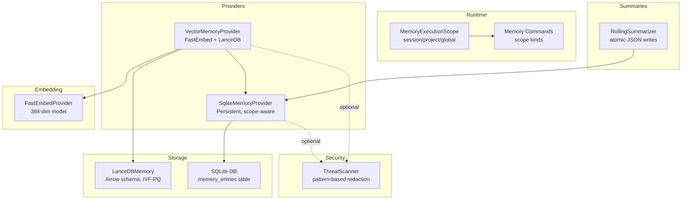
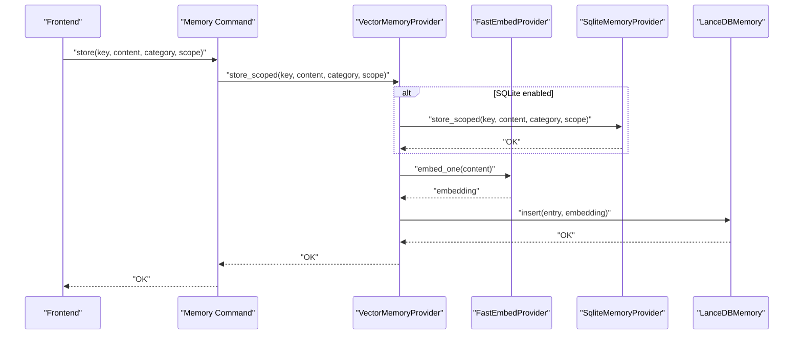
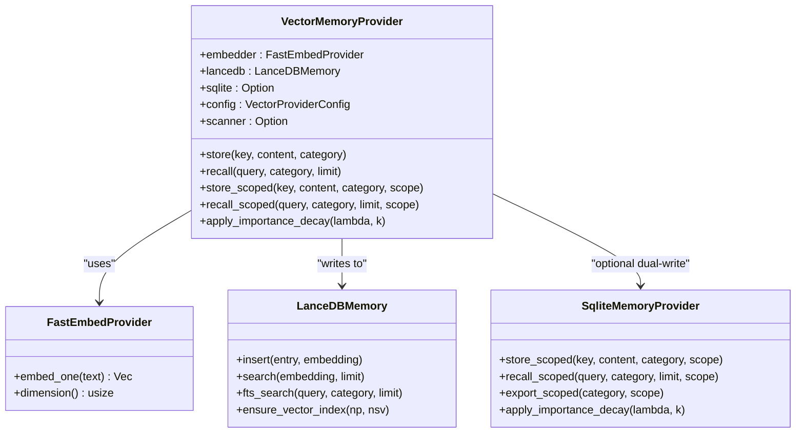
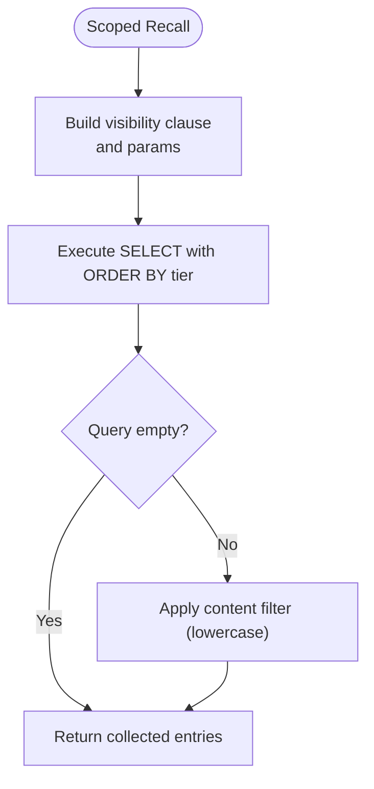
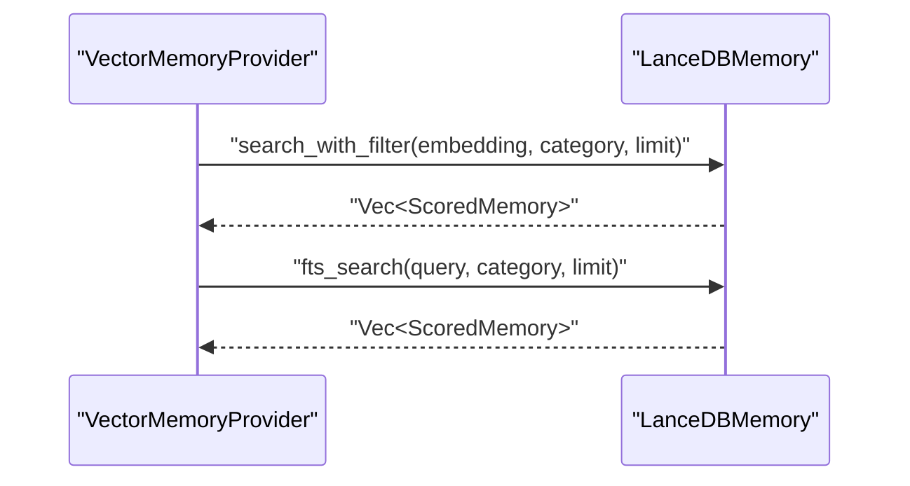
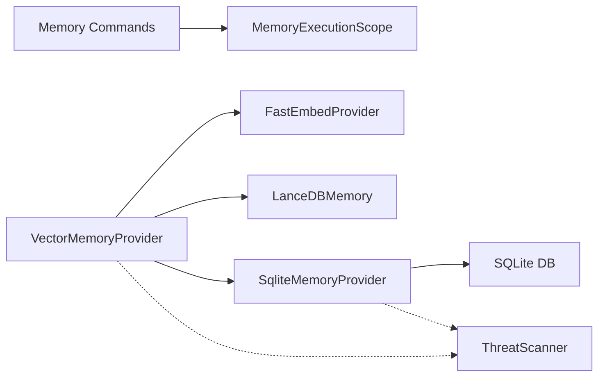

# Memory System

<cite>
**Referenced Files in This Document**
- [vector_provider.rs](file://src-tauri/src/modules/memory/providers/vector_provider.rs)
- [lancedb.rs](file://src-tauri/src/modules/memory/providers/lancedb.rs)
- [sqlite_provider.rs](file://src-tauri/src/modules/memory/providers/sqlite_provider.rs)
- [fastembed.rs](file://src-tauri/src/modules/memory/embedding/fastembed.rs)
- [scope.rs](file://src-tauri/src/modules/memory/scope.rs)
- [mod.rs](file://src-tauri/src/modules/memory/mod.rs)
- [memory.rs](file://src-tauri/src/commands/memory.rs)
- [if2Ai-Memory-Autonomous-Learning-Architecture-Report.md](file://docs/design-docs/postCLI/if2Ai-Memory-Autonomous-Learning-Architecture-Report.md)
- [ADR-003-FastEmbed-LanceDB-Selection.md](file://docs/design-docs/postCLI/ADR/ADR-003-FastEmbed-LanceDB-Selection.md)
- [ADR-013-High-Gaps-BACKLOG.md](file://docs/design-docs/postCLI/ADR/backlog/ADR-013-High-Gaps-BACKLOG.md)
- [memory-enhancement-from-openhanako-v1.md](file://docs/design-docs/postCLI/memory-enhancement-from-openhanako-v1.md)
- [today.rs](file://src-tauri/src/modules/memory/compiler/today.rs)
- [memory-store.rs](file://src-tauri/src/modules/tools/builtin/memory_store.rs)
- [memory-system.md](file://docs/design-docs/memory-system.md)
- [MIG-005-real-memory-lifecycle.md](file://docs/packs/feature/migration-core/MIG-005-real-memory-lifecycle.md)
- [01-usage-guide.md](file://docs/staff-remediation/gap-modules/memory-write-recall-lifecycle/01-usage-guide.md)
- [02-implementation.md](file://docs/staff-remediation/gap-modules/memory-write-recall-lifecycle/02-implementation.md)
</cite>

## Table of Contents
1. [Introduction](#introduction)
2. [Project Structure](#project-structure)
3. [Core Components](#core-components)
4. [Architecture Overview](#architecture-overview)
5. [Detailed Component Analysis](#detailed-component-analysis)
6. [Dependency Analysis](#dependency-analysis)
7. [Performance Considerations](#performance-considerations)
8. [Troubleshooting Guide](#troubleshooting-guide)
9. [Conclusion](#conclusion)
10. [Appendices](#appendices)

## Introduction
This document describes If2Ai’s vector-based memory architecture with a hybrid provider design that supports both SQLite (persistent, scope-aware, importance decay) and LanceDB (vector search, approximate nearest-neighbor). It explains the dual-write strategy for data consistency, threat scanning integration for security, automatic summarization capabilities, hierarchical memory scopes (session, project, global), retrieval via FastEmbed embeddings, and the memory lifecycle from creation to archival. Practical configuration options, quality gates, conflict resolution, and security/access control are covered.

## Project Structure
The memory system spans Rust modules under the Tauri backend and complementary documentation and design artifacts:
- Providers: VectorMemoryProvider (FastEmbed + LanceDB), SqliteMemoryProvider
- Embedding: FastEmbedProvider
- Scope: MemoryExecutionScope and resolver
- Commands: Memory command API with scope kinds
- Design docs: ADRs, architecture report, lifecycle migration plans
- Security: ThreatScanner integration points
- Summaries: Session rolling summaries and atomic file writes

**Diagram sources**
- [vector_provider.rs:107-117](file://src-tauri/src/modules/memory/providers/vector_provider.rs#L107-L117)
- [lancedb.rs:112-144](file://src-tauri/src/modules/memory/providers/lancedb.rs#L112-L144)
- [sqlite_provider.rs:22-32](file://src-tauri/src/modules/memory/providers/sqlite_provider.rs#L22-L32)
- [fastembed.rs:35-58](file://src-tauri/src/modules/memory/embedding/fastembed.rs#L35-L58)
- [scope.rs:25-33](file://src-tauri/src/modules/memory/scope.rs#L25-L33)
- [memory.rs:97-103](file://src-tauri/src/commands/memory.rs#L97-L103)
- [today.rs:188-203](file://src-tauri/src/modules/memory/compiler/today.rs#L188-L203)

**Section sources**
- [mod.rs:1-73](file://src-tauri/src/modules/memory/mod.rs#L1-L73)
- [memory-system.md:39-58](file://docs/design-docs/memory-system.md#L39-L58)

## Core Components
- VectorMemoryProvider: Combines FastEmbed (offline, multilingual) with LanceDB (vector + FTS). Supports dual-write to SQLite for durability and importance decay. Implements hybrid search (vector + FTS) with reciprocal rank fusion.
- SqliteMemoryProvider: Persistent, scope-aware, with indexes for category and scope filters. Supports scoped recall/export and importance decay via Weibull.
- FastEmbedProvider: 384-dimension embeddings using a multilingual model; cached locally.
- LanceDBMemory: Arrow schema with fixed-size float32 embeddings; IVF-PQ index creation guardrails; vector and FTS search.
- MemoryExecutionScope: Enforces session/project/global isolation; resolver constructs scope from runtime context.
- Memory commands: Frontend-facing scope kinds (Global, Project, Session) mapped to execution scope.
- ThreatScanner: Pattern-based detection and redaction integrated at provider boundaries.
- Session summaries: Rolling summarization with atomic file writes and dual-write to SQLite.

**Section sources**
- [vector_provider.rs:98-117](file://src-tauri/src/modules/memory/providers/vector_provider.rs#L98-L117)
- [sqlite_provider.rs:18-32](file://src-tauri/src/modules/memory/providers/sqlite_provider.rs#L18-L32)
- [fastembed.rs:31-58](file://src-tauri/src/modules/memory/embedding/fastembed.rs#L31-L58)
- [lancedb.rs:108-144](file://src-tauri/src/modules/memory/providers/lancedb.rs#L108-L144)
- [scope.rs:20-33](file://src-tauri/src/modules/memory/scope.rs#L20-L33)
- [memory.rs:97-132](file://src-tauri/src/commands/memory.rs#L97-L132)
- [today.rs:188-203](file://src-tauri/src/modules/memory/compiler/today.rs#L188-L203)

## Architecture Overview
The hybrid provider architecture separates concerns:
- SQLite: authoritative, durable, scope-aware, supports importance decay and Weibull aging.
- LanceDB: vector search engine with IVF-PQ index; FTS fallback; hybrid recall with RRF.
- FastEmbed: offline, CPU-friendly embeddings; dimension 384.
- ThreatScanner: optional, applied once at the provider boundary to redact sensitive content before persistence.
- Scope enforcement: enforced at recall/export time via SQL filters and command-layer mapping.

**Diagram sources**
- [vector_provider.rs:503-576](file://src-tauri/src/modules/memory/providers/vector_provider.rs#L503-L576)
- [sqlite_provider.rs:394-447](file://src-tauri/src/modules/memory/providers/sqlite_provider.rs#L394-L447)
- [lancedb.rs:147-164](file://src-tauri/src/modules/memory/providers/lancedb.rs#L147-L164)
- [fastembed.rs:82-101](file://src-tauri/src/modules/memory/embedding/fastembed.rs#L82-L101)
- [memory.rs:112-132](file://src-tauri/src/commands/memory.rs#L112-L132)

## Detailed Component Analysis

### VectorMemoryProvider
- Dual-write strategy: SQLite first (authoritative), then asynchronous LanceDB insert. When SQLite is absent, LanceDB is synchronous.
- Hybrid search: Parallel vector and FTS search with RRF fusion; optional category filter.
- Scope-awareness: Delegates scoped store/recall/export to SQLite when enabled; warns and falls back when disabled.
- Threat scanning: Optional shared scanner invoked once per write to redact sensitive content before dual-write.
- Importance decay: Delegated to SQLite provider when enabled; otherwise no-op.

**Diagram sources**
- [vector_provider.rs:98-117](file://src-tauri/src/modules/memory/providers/vector_provider.rs#L98-L117)
- [fastembed.rs:35-106](file://src-tauri/src/modules/memory/embedding/fastembed.rs#L35-L106)
- [lancedb.rs:108-144](file://src-tauri/src/modules/memory/providers/lancedb.rs#L108-L144)
- [sqlite_provider.rs:22-32](file://src-tauri/src/modules/memory/providers/sqlite_provider.rs#L22-L32)

**Section sources**
- [vector_provider.rs:308-492](file://src-tauri/src/modules/memory/providers/vector_provider.rs#L308-L492)
- [ADR-013-High-Gaps-BACKLOG.md:130-184](file://docs/design-docs/postCLI/ADR/backlog/ADR-013-High-Gaps-BACKLOG.md#L130-L184)

### SqliteMemoryProvider
- Schema: memory_entries with primary key, content, category, timestamps, importance, access_count, trust_score, plus optional session_id and project_id for scope.
- Indexes: category, created_at, and partial indexes for session_id/project_id to optimize scope queries.
- Scoped recall/export: SQL WHERE clauses and ORDER BY tiering (session > project > global) with importance/access_count/recency weighting.
- Migration: Import legacy JSON (claw-cli format) into SQLite within a transaction.
- Threat scanning: Optional scanner attached at construction to redact content before INSERT.

**Diagram sources**
- [sqlite_provider.rs:449-570](file://src-tauri/src/modules/memory/providers/sqlite_provider.rs#L449-L570)

**Section sources**
- [sqlite_provider.rs:18-99](file://src-tauri/src/modules/memory/providers/sqlite_provider.rs#L18-L99)
- [sqlite_provider.rs:261-344](file://src-tauri/src/modules/memory/providers/sqlite_provider.rs#L261-L344)
- [sqlite_provider.rs:394-447](file://src-tauri/src/modules/memory/providers/sqlite_provider.rs#L394-L447)

### LanceDBMemory
- Schema: key, content, category, embedding (FixedSizeList<Float32, 384>), created_at.
- Operations: insert, vector search, category-filtered vector search, FTS-like client-side filtering, export_all, delete, count.
- Indexing: IVF-PQ creation guarded by row count threshold and idempotency checks; logs warnings on failure.

**Diagram sources**
- [lancedb.rs:166-202](file://src-tauri/src/modules/memory/providers/lancedb.rs#L166-L202)
- [lancedb.rs:211-239](file://src-tauri/src/modules/memory/providers/lancedb.rs#L211-L239)

**Section sources**
- [lancedb.rs:59-106](file://src-tauri/src/modules/memory/providers/lancedb.rs#L59-L106)
- [lancedb.rs:267-342](file://src-tauri/src/modules/memory/providers/lancedb.rs#L267-L342)

### FastEmbedProvider
- Model: Multilingual E5-small (384-dimension).
- Methods: embed_one, embed, dimension.
- Error handling: Empty text, dimension mismatch, model errors.

**Section sources**
- [fastembed.rs:31-106](file://src-tauri/src/modules/memory/embedding/fastembed.rs#L31-L106)
- [ADR-003-FastEmbed-LanceDB-Selection.md:46-74](file://docs/design-docs/postCLI/ADR/ADR-003-FastEmbed-LanceDB-Selection.md#L46-L74)

### Memory Execution Scope and Commands
- MemoryExecutionScope: session_id, project_id, workdir; global() convenience; is_global().
- MemoryScopeKind (Global, Project, Session) mapped to scope construction in commands.
- Scope enforcement: SQL WHERE clauses and default filter logic for export_scoped.

**Section sources**
- [scope.rs:20-59](file://src-tauri/src/modules/memory/scope.rs#L20-L59)
- [scope.rs:61-108](file://src-tauri/src/modules/memory/scope.rs#L61-L108)
- [memory.rs:86-132](file://src-tauri/src/commands/memory.rs#L86-L132)
- [mod.rs:170-199](file://src-tauri/src/modules/memory/mod.rs#L170-L199)

### Threat Scanning Integration
- VectorMemoryProvider: Optional ThreatScanner attached via with_scanner; applied once per write to clean content before dual-write.
- SqliteMemoryProvider: Optional ThreatScanner attached via with_scanner; defense-in-depth for direct provider callers.
- Tool layer: Built-in scanner used prior to policy evaluation; audit events emitted on matches.

**Section sources**
- [vector_provider.rs:113-117](file://src-tauri/src/modules/memory/providers/vector_provider.rs#L113-L117)
- [sqlite_provider.rs:24-31](file://src-tauri/src/modules/memory/providers/sqlite_provider.rs#L24-L31)
- [memory-store.rs:271-296](file://src-tauri/src/modules/tools/builtin/memory_store.rs#L271-L296)

### Automatic Summarization
- Rolling summaries: SessionSummaryStore dual-write (SQLite authoritative, JSON sidecar best-effort).
- Atomic file writes: tmp + rename for reliability.
- Budget computation and prompts: Per-turn budget scaling and fixed-output constraints.

**Section sources**
- [mod.rs:1-31](file://src-tauri/src/modules/memory/summary/mod.rs#L1-L31)
- [memory-enhancement-from-openhanako-v1.md:868-883](file://docs/design-docs/postCLI/memory-enhancement-from-openhanako-v1.md#L868-L883)
- [today.rs:188-203](file://src-tauri/src/modules/memory/compiler/today.rs#L188-L203)

### Memory Lifecycle, Quality Gates, and Conflict Resolution
- Lifecycle: Real memory lifecycle migration targets打通 write policy, quality gate, conflict resolution, and persistence into a single pipeline.
- Quality gates and conflict resolution: Integrated in harness-grade evaluation and grading modules.
- Gap remediation: Memory write/recall lifecycle gaps documented with implementation plans.

**Section sources**
- [MIG-005-real-memory-lifecycle.md:47-69](file://docs/packs/feature/migration-core/MIG-005-real-memory-lifecycle.md#L47-L69)
- [01-usage-guide.md:1-20](file://docs/staff-remediation/gap-modules/memory-write-recall-lifecycle/01-usage-guide.md#L1-L20)
- [02-implementation.md:1-26](file://docs/staff-remediation/gap-modules/memory-write-recall-lifecycle/02-implementation.md#L1-L26)

## Dependency Analysis
- VectorMemoryProvider depends on FastEmbedProvider and LanceDBMemory; optionally on SqliteMemoryProvider.
- SqliteMemoryProvider depends on rusqlite and implements MemoryProvider trait.
- Memory commands depend on MemoryExecutionScope and scope kinds.
- ThreatScanner is optional and injected into providers.

**Diagram sources**
- [memory.rs:97-132](file://src-tauri/src/commands/memory.rs#L97-L132)
- [vector_provider.rs:98-117](file://src-tauri/src/modules/memory/providers/vector_provider.rs#L98-L117)
- [sqlite_provider.rs:22-32](file://src-tauri/src/modules/memory/providers/sqlite_provider.rs#L22-L32)

**Section sources**
- [mod.rs:201-380](file://src-tauri/src/modules/memory/mod.rs#L201-L380)

## Performance Considerations
- Vector search acceleration: IVF-PQ index creation guarded by minimum row thresholds; soft failure logs warnings and continues with brute-force scan.
- Hybrid search: Parallel vector and FTS; RRF fusion aggregates results.
- SQLite scope queries: Partial indexes on session_id/project_id reduce index size and improve selectivity.
- Asynchronous LanceDB writes: Fire-and-forget background inserts when dual-write is enabled, minimizing latency for the primary SQLite write.
- Embedding dimension: 384-dimension embeddings balance multilingual coverage and CPU efficiency.

**Section sources**
- [lancedb.rs:267-342](file://src-tauri/src/modules/memory/providers/lancedb.rs#L267-L342)
- [vector_provider.rs:241-275](file://src-tauri/src/modules/memory/providers/vector_provider.rs#L241-L275)
- [sqlite_provider.rs:80-93](file://src-tauri/src/modules/memory/providers/sqlite_provider.rs#L80-L93)

## Troubleshooting Guide
- Vector search disabled: Hybrid search falls back to FTS; verify vector_search_enabled flag.
- Index creation failures: Ensure sufficient rows and retry; warnings are logged and brute-force scan is used.
- Dimension mismatch: Embedding dimension must match LanceDB expectation (384).
- Scope visibility: Without SQLite dual-write, scoped metadata is dropped; enable sqlite_path to honor session/project/global tiers.
- Threat scanner redactions: When flagged, audit events are emitted; content is cleaned before persistence.
- Clear all memories: SQLite first (authoritative), then best-effort LanceDB deletion; counts differ when dual-write is enabled.

**Section sources**
- [vector_provider.rs:231-239](file://src-tauri/src/modules/memory/providers/vector_provider.rs#L231-L239)
- [lancedb.rs:283-342](file://src-tauri/src/modules/memory/providers/lancedb.rs#L283-L342)
- [lancedb.rs:147-154](file://src-tauri/src/modules/memory/providers/lancedb.rs#L147-L154)
- [vector_provider.rs:514-524](file://src-tauri/src/modules/memory/providers/vector_provider.rs#L514-L524)
- [vector_provider.rs:407-439](file://src-tauri/src/modules/memory/providers/vector_provider.rs#L407-L439)

## Conclusion
If2Ai’s memory system combines SQLite and LanceDB to deliver durable, scope-aware, and vector-powered recall. The dual-write strategy ensures consistency, while optional threat scanning protects sensitive content. Automatic summarization and lifecycle improvements are being integrated to form a robust, secure, and high-performance memory architecture.

## Appendices

### Configuration Options
- VectorProviderConfig
  - db_path: LanceDB directory path
  - vector_search_enabled: Enable/disable vector search
  - sqlite_path: Optional SQLite dual-write path
- VectorMemoryProvider
  - with_scanner: Attach shared ThreatScanner
  - is_enabled/dimension helpers exposed for diagnostics

**Section sources**
- [vector_provider.rs:55-96](file://src-tauri/src/modules/memory/providers/vector_provider.rs#L55-L96)
- [vector_provider.rs:189-193](file://src-tauri/src/modules/memory/providers/vector_provider.rs#L189-L193)
- [vector_provider.rs:277-281](file://src-tauri/src/modules/memory/providers/vector_provider.rs#L277-L281)

### Practical Examples
- Store scoped memory with session/project/global visibility
- Recall with category and limit; hybrid search with RRF fusion
- Clear all memories (SQLite authoritative, best-effort LanceDB)
- Apply importance decay (Weibull) via SQLite provider

**Section sources**
- [vector_provider.rs:503-576](file://src-tauri/src/modules/memory/providers/vector_provider.rs#L503-L576)
- [vector_provider.rs:378-390](file://src-tauri/src/modules/memory/providers/vector_provider.rs#L378-L390)
- [vector_provider.rs:407-439](file://src-tauri/src/modules/memory/providers/vector_provider.rs#L407-L439)
- [sqlite_provider.rs:668-685](file://src-tauri/src/modules/memory/providers/sqlite_provider.rs#L668-L685)

### Security and Access Control
- ThreatScanner: Pattern-based detection and redaction applied at provider boundaries
- Scope enforcement: SQL-based visibility rules (tiered ordering) and command-layer mapping
- Audit events: Emitted for PII redaction and write decisions

**Section sources**
- [vector_provider.rs:113-117](file://src-tauri/src/modules/memory/providers/vector_provider.rs#L113-L117)
- [sqlite_provider.rs:24-31](file://src-tauri/src/modules/memory/providers/sqlite_provider.rs#L24-L31)
- [memory-store.rs:271-296](file://src-tauri/src/modules/tools/builtin/memory_store.rs#L271-L296)
- [mod.rs:170-199](file://src-tauri/src/modules/memory/mod.rs#L170-L199)