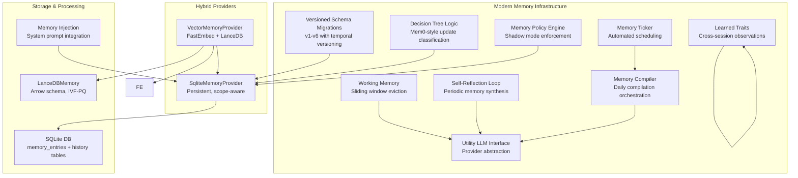
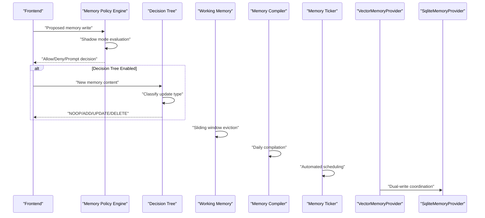
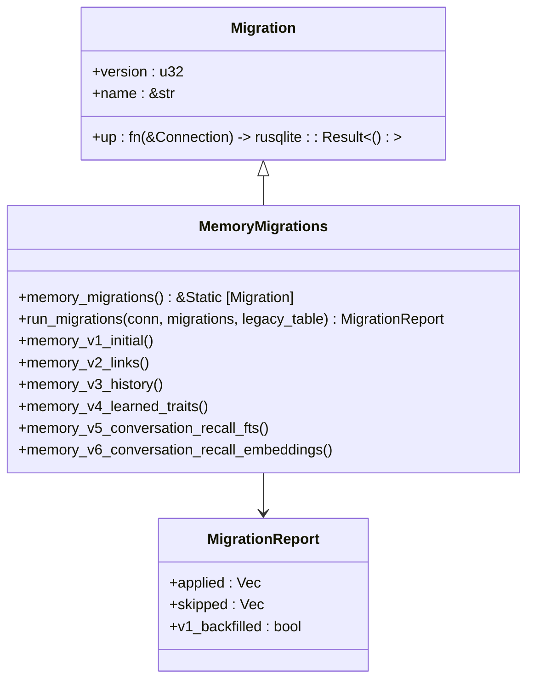
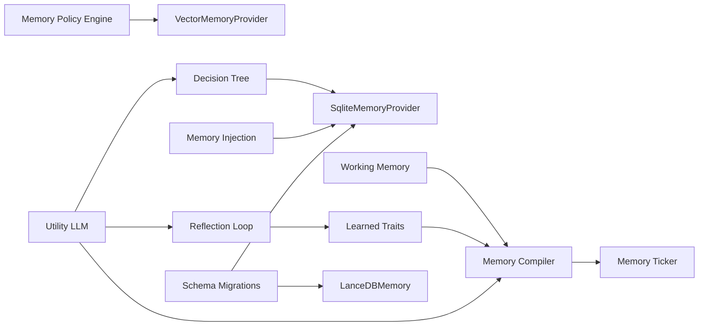

# Memory System

<cite>
**Referenced Files in This Document**
- [mod.rs](file://src-tauri/src/modules/memory/mod.rs)
- [migrations.rs](file://src-tauri/src/modules/memory/migrations.rs)
- [working_memory.rs](file://src-tauri/src/modules/memory/working_memory.rs)
- [decision_tree.rs](file://src-tauri/src/modules/memory/decision_tree.rs)
- [reflection_loop.rs](file://src-tauri/src/modules/memory/reflection_loop.rs)
- [llm.rs](file://src-tauri/src/modules/memory/llm.rs)
- [inject.rs](file://src-tauri/src/modules/memory/inject.rs)
- [compiler/mod.rs](file://src-tauri/src/modules/memory/compiler/mod.rs)
- [ticker/mod.rs](file://src-tauri/src/modules/memory/ticker/mod.rs)
- [learned_traits.rs](file://src-tauri/src/modules/memory/learned_traits.rs)
- [policy.rs](file://src-tauri/src/modules/memory/policy.rs)
- [vector_provider.rs](file://src-tauri/src/modules/memory/providers/vector_provider.rs)
- [lancedb.rs](file://src-tauri/src/modules/memory/providers/lancedb.rs)
- [sqlite_provider.rs](file://src-tauri/src/modules/memory/providers/sqlite_provider.rs)
- [fastembed.rs](file://src-tauri/src/modules/memory/embedding/fastembed.rs)
- [scope.rs](file://src-tauri/src/modules/memory/scope.rs)
- [memory.rs](file://src-tauri/src/commands/memory.rs)
- [if2Ai-Memory-Autonomous-Learning-Architecture-Report.md](file://docs/design-docs/postCLI/if2Ai-Memory-Autonomous-Learning-Architecture-Report.md)
- [ADR-003-FastEmbed-LanceDB-Selection.md](file://docs/design-docs/postCLI/ADR/ADR-003-FastEmbed-LanceDB-Selection.md)
- [ADR-013-High-Gaps-BACKLOG.md](file://docs/design-docs/postCLI/ADR/backlog/ADR-013-High-Gaps-BACKLOG.md)
- [memory-enhancement-from-openhanako-v1.md](file://docs/design-docs/postCLI/memory-enhancement-from-openhanako-v1.md)
- [today.rs](file://src-tauri/src/modules/memory/compiler/today.rs)
- [memory-store.rs](file://src-tauri/src/modules/tools/builtin/memory_store.rs)
- [memory-system.md](file://docs/design-docs/memory-system.md)
- [MIG-005-real-memory-lifecycle.md](file://docs/packs/feature/migration-core/MIG-005-real-memory-lifecycle.md)
- [01-usage-guide.md](file://docs/staff-remediation/gap-modules/memory-write-recall-lifecycle/01-usage-guide.md)
- [02-implementation.md](file://docs/staff-remediation/gap-modules/memory-write-recall-lifecycle/02-implementation.md)
</cite>

## Update Summary
**Changes Made**
- Added comprehensive documentation for MEM-MOD series modernization including versioned schema migrations, working memory, decision tree logic, self-reflection loop, and temporal versioning
- Updated architecture overview to reflect sophisticated self-evolving memory management system
- Enhanced memory lifecycle documentation with new quality gates and conflict resolution mechanisms
- Added detailed sections on memory policy engine, compiler orchestration, and ticker-based scheduling
- Expanded security and access control documentation with threat scanning integration
- Updated configuration options to include new memory compiler and policy settings

## Table of Contents
1. [Introduction](#introduction)
2. [Project Structure](#project-structure)
3. [Core Components](#core-components)
4. [Architecture Overview](#architecture-overview)
5. [Detailed Component Analysis](#detailed-component-analysis)
6. [Dependency Analysis](#dependency-analysis)
7. [Performance Considerations](#performance-considerations)
8. [Troubleshooting Guide](#troubleshooting-guide)
9. [Conclusion](#conclusion)
10. [Appendices](#appendices)

## Introduction
This document describes If2Ai's sophisticated vector-based memory architecture representing the MEM-MOD series modernization from basic storage to a self-evolving memory management system. The architecture now features versioned schema migrations, working memory with sliding window eviction, decision tree logic for intelligent memory updates, self-reflection loops with temporal versioning, and comprehensive compiler orchestration. It maintains the hybrid provider design supporting both SQLite (persistent, scope-aware, importance decay) and LanceDB (vector search, approximate nearest-neighbor) while adding advanced capabilities for automatic summarization, policy enforcement, and temporal memory management.

## Project Structure
The memory system spans Rust modules under the Tauri backend with comprehensive modernization features:
- **Core Infrastructure**: Versioned schema migrations, working memory, decision tree logic
- **Self-Evolution**: Reflection loop, learned traits, temporal versioning
- **Compiler System**: Memory compilation orchestration, assembly pipeline
- **Scheduler**: Memory ticker for automated processing
- **Policy Engine**: Memory write policy enforcement with shadow mode
- **Providers**: VectorMemoryProvider (FastEmbed + LanceDB), SqliteMemoryProvider
- **Embedding**: FastEmbedProvider with 384-dimension multilingual embeddings
- **Scope Management**: MemoryExecutionScope with hierarchical isolation
- **Security**: ThreatScanner integration and memory policy enforcement
- **Injection**: System prompt memory injection with budget management

**Diagram sources**
- [migrations.rs:1-519](file://src-tauri/src/modules/memory/migrations.rs#L1-L519)
- [working_memory.rs:1-226](file://src-tauri/src/modules/memory/working_memory.rs#L1-L226)
- [decision_tree.rs:1-301](file://src-tauri/src/modules/memory/decision_tree.rs#L1-L301)
- [reflection_loop.rs:1-185](file://src-tauri/src/modules/memory/reflection_loop.rs#L1-L185)
- [learned_traits.rs:1-424](file://src-tauri/src/modules/memory/learned_traits.rs#L1-L424)
- [compiler/mod.rs:1-474](file://src-tauri/src/modules/memory/compiler/mod.rs#L1-L474)
- [ticker/mod.rs:1-628](file://src-tauri/src/modules/memory/ticker/mod.rs#L1-L628)
- [policy.rs:1-336](file://src-tauri/src/modules/memory/policy.rs#L1-L336)
- [llm.rs:1-340](file://src-tauri/src/modules/memory/llm.rs#L1-L340)

**Section sources**
- [mod.rs:1-703](file://src-tauri/src/modules/memory/mod.rs#L1-L703)
- [memory-system.md:39-58](file://docs/design-docs/memory-system.md#L39-L58)

## Core Components
The MEM-MOD modernization introduces sophisticated components for self-evolving memory management:

**Versioned Schema Migrations**: Complete overhaul from basic storage to structured evolution with six migration versions (v1-v6) including temporal versioning audit tables, learned traits persistence, and conversation recall enhancements.

**Working Memory**: Sliding window eviction system maintaining bounded conversation context with configurable turn limits (default 8) and token budgets (default 1600), automatically removing oldest messages when constraints are exceeded.

**Decision Tree Logic**: Mem0-style memory update classification system that determines whether new facts should be NOOP (already covered), ADD (new), UPDATE (replace existing), or DELETE (retire contradictory) based on LLM analysis.

**Self-Reflection Loop**: Automated periodic memory synthesis that generates insights about user preferences and patterns, creating Reflection-category memories that inform agent behavior and personality.

**Learned Traits**: Cross-session observation system that distills reflection memories into durable traits with confidence scoring, evidence tracking, and user disagreement capability.

**Memory Compiler**: Comprehensive daily compilation orchestration coordinating four pipelines (today, week, longterm, facts) with fingerprint caching, job runner throttling, and assembly pipeline.

**Memory Ticker**: Sophisticated scheduler driving automated processing including rolling summaries, daily compilation cycles, session cleanup, and recovery procedures.

**Memory Policy Engine**: Advanced write policy enforcement with shadow mode for gradual rollout, content length limits, category restrictions, and threat scanner integration.

**Utility LLM Interface**: Abstraction layer enabling memory subsystems to use any provider through a unified interface, supporting both production and mock implementations.

**Section sources**
- [migrations.rs:201-242](file://src-tauri/src/modules/memory/migrations.rs#L201-L242)
- [working_memory.rs:30-91](file://src-tauri/src/modules/memory/working_memory.rs#L30-L91)
- [decision_tree.rs:36-69](file://src-tauri/src/modules/memory/decision_tree.rs#L36-L69)
- [reflection_loop.rs:38-97](file://src-tauri/src/modules/memory/reflection_loop.rs#L38-L97)
- [learned_traits.rs:56-90](file://src-tauri/src/modules/memory/learned_traits.rs#L56-L90)
- [compiler/mod.rs:168-205](file://src-tauri/src/modules/memory/compiler/mod.rs#L168-L205)
- [ticker/mod.rs:75-95](file://src-tauri/src/modules/memory/ticker/mod.rs#L75-L95)
- [policy.rs:120-142](file://src-tauri/src/modules/memory/policy.rs#L120-L142)
- [llm.rs:42-54](file://src-tauri/src/modules/memory/llm.rs#L42-L54)

## Architecture Overview
The MEM-MOD architecture represents a complete transformation from basic storage to sophisticated self-evolving memory management:

**Versioned Evolution**: The migration system tracks schema changes across six versions, with temporal versioning allowing historical queries and audit trails. Each migration version adds new capabilities while maintaining backward compatibility.

**Self-Evolution Mechanisms**: Multiple autonomous systems continuously improve memory quality through reflection, decision-making, and compilation processes. The system learns from interactions and adapts its memory strategies over time.

**Hybrid Provider Intelligence**: Enhanced dual-write strategy with intelligent routing based on memory type, importance, and access patterns. VectorMemoryProvider coordinates between SQLite and LanceDB providers for optimal performance.

**Temporal Memory Management**: Comprehensive temporal versioning system that tracks memory changes over time, enabling historical queries and understanding of memory evolution.

**Diagram sources**
- [policy.rs:153-208](file://src-tauri/src/modules/memory/policy.rs#L153-L208)
- [decision_tree.rs:160-170](file://src-tauri/src/modules/memory/decision_tree.rs#L160-L170)
- [working_memory.rs:81-90](file://src-tauri/src/modules/memory/working_memory.rs#L81-L90)
- [compiler/mod.rs:218-321](file://src-tauri/src/modules/memory/compiler/mod.rs#L218-L321)
- [ticker/mod.rs:408-414](file://src-tauri/src/modules/memory/ticker/mod.rs#L408-L414)
- [vector_provider.rs:503-576](file://src-tauri/src/modules/memory/providers/vector_provider.rs#L503-L576)

## Detailed Component Analysis

### Versioned Schema Migrations
The MEM-MOD-P0 foundation establishes a robust migration system replacing ad-hoc schema changes with systematic evolution:

**Migration Framework**: Structured approach with version tracking, transactional application, and backfill support for legacy databases. Each migration is idempotent and safely applies schema changes.

**Temporal Versioning**: MEM-MOD-P6 introduces memory_entry_history table with valid_from/valid_to timestamps, enabling historical queries and audit trails. This allows understanding of memory evolution over time.

**Cross-Session Learning**: MEM-MOD-P7 adds learned_traits table for durable observations that persist across sessions, with confidence scoring and user disagreement capability.

**Conversation Enhancement**: P1-7 migrations add conversation_recall_fts (FTS5 virtual table) and conversation_recall_embeddings for turn-level search capabilities.

**Diagram sources**
- [migrations.rs:37-51](file://src-tauri/src/modules/memory/migrations.rs#L37-L51)
- [migrations.rs:207-242](file://src-tauri/src/modules/memory/migrations.rs#L207-L242)
- [migrations.rs:53-64](file://src-tauri/src/modules/memory/migrations.rs#L53-L64)

**Section sources**
- [migrations.rs:1-519](file://src-tauri/src/modules/memory/migrations.rs#L1-L519)

### Working Memory System
Sophisticated sliding window memory management with intelligent eviction policies:

**Eviction Strategy**: Dual constraint system using both turn count (default 8) and token budget (default 1600) to maintain optimal conversation context. Oldest messages are removed when either limit is exceeded.

**Token Budgeting**: Accurate token counting considering text content, tool calls, and thinking blocks. Uses platform-specific token estimation for precise budget management.

**Performance Optimization**: Efficient removal of oldest entries and continuous budget monitoring to minimize computational overhead during eviction cycles.

**Section sources**
- [working_memory.rs:30-91](file://src-tauri/src/modules/memory/working_memory.rs#L30-L91)
- [working_memory.rs:94-125](file://src-tauri/src/modules/memory/working_memory.rs#L94-L125)

### Decision Tree Logic
Mem0-style memory update classification system:

**Classification Types**: Four decision types - NOOP (already covered), ADD (new content), UPDATE (replace existing), DELETE (retire contradictory). Each decision includes appropriate metadata for downstream processing.

**LLM Integration**: Small utility LLM performs classification based on comparison with existing memories, returning structured JSON responses with verb-based classification.

**Robust Parsing**: Fallback mechanisms ensure system resilience - unknown verbs, missing keys, or malformed responses default to ADD classification.

**Section sources**
- [decision_tree.rs:36-69](file://src-tauri/src/modules/memory/decision_tree.rs#L36-L69)
- [decision_tree.rs:160-170](file://src-tauri/src/modules/memory/decision_tree.rs#L160-L170)
- [decision_tree.rs:118-154](file://src-tauri/src/modules/memory/decision_tree.rs#L118-L154)

### Self-Reflection Loop
Automated memory synthesis system generating insights about user behavior and preferences:

**Periodic Synthesis**: Reflection pulses triggered at configurable intervals (reflection_threshold) generate insights about user preferences, goals, and recurring patterns.

**LLM-Driven Analysis**: Utility LLM extracts meaningful observations from recent conversation transcripts, focusing on user behavior and agent performance patterns.

**Memory Persistence**: Generated reflections are stored as Reflection-category memories with unique keys for easy retrieval and integration into agent reasoning.

**Section sources**
- [reflection_loop.rs:38-97](file://src-tauri/src/modules/memory/reflection_loop.rs#L38-L97)
- [reflection_loop.rs:147-184](file://src-tauri/src/modules/memory/reflection_loop.rs#L147-L184)

### Learned Traits System
Cross-session observation persistence and management:

**Trait Distillation**: Reflection memories are processed to extract durable observations about user characteristics and preferences, compressed into single-line traits.

**Confidence Scoring**: Evidence-based confidence calculation that increases with repeated sightings, approaching saturation for reliable long-term knowledge.

**User Control**: Users can disagree with traits they don't endorse, marking them for exclusion from future prompts while maintaining audit trail.

**Storage Efficiency**: Optimized SQLite schema with partial indexes for fast active trait queries and efficient storage of cross-session observations.

**Section sources**
- [learned_traits.rs:95-136](file://src-tauri/src/modules/memory/learned_traits.rs#L95-L136)
- [learned_traits.rs:138-211](file://src-tauri/src/modules/memory/learned_traits.rs#L138-L211)
- [learned_traits.rs:263-282](file://src-tauri/src/modules/memory/learned_traits.rs#L263-L282)

### Memory Compiler Orchestration
Comprehensive daily compilation system coordinating multiple memory generation pipelines:

**Pipeline Coordination**: Four specialized compilers (today, week, longterm, facts) with fingerprint caching to avoid unnecessary recomputation and JobRunner throttling for resource management.

**Assembly Pipeline**: Synchronous file assembly combining individual compilation outputs into unified memory.md with bilingual section headers and proper ordering.

**Configuration Management**: CompilerConfig governs character limits, scheduling, and processing parameters for each compilation stage.

**Section sources**
- [compiler/mod.rs:168-321](file://src-tauri/src/modules/memory/compiler/mod.rs#L168-L321)
- [compiler/mod.rs:47-118](file://src-tauri/src/modules/memory/compiler/mod.rs#L47-L118)

### Memory Ticker Scheduler
Sophisticated automated processing system:

**Multi-Tier Scheduling**: Per-turn, session-end, and daily processing coordinated through TickerConfig with configurable intervals and thresholds.

**Recovery Mechanisms**: Startup recovery scans for unprocessed session summaries and resumes interrupted processing, ensuring data integrity across application restarts.

**Background Processing**: Non-blocking task execution with progress tracking, in-progress session management, and error handling for reliable automated processing.

**Section sources**
- [ticker/mod.rs:75-95](file://src-tauri/src/modules/memory/ticker/mod.rs#L75-L95)
- [ticker/mod.rs:536-626](file://src-tauri/src/modules/memory/ticker/mod.rs#L536-L626)

### Memory Policy Engine
Advanced write policy enforcement with shadow mode:

**Shadow Mode**: Default safe operation mode where deny decisions are downgraded to allow with shadow logging, enabling gradual policy rollout without disrupting existing behavior.

**Configurable Rules**: Content length limits, category restrictions, prompt thresholds, and threat scanner integration provide comprehensive memory governance.

**Machine-Readable Decisions**: Stable reason codes and structured policy results enable audit logging, frontend display, and automated decision-making.

**Section sources**
- [policy.rs:120-234](file://src-tauri/src/modules/memory/policy.rs#L120-L234)
- [policy.rs:45-88](file://src-tauri/src/modules/memory/policy.rs#L45-L88)

### Utility LLM Interface
Abstraction layer enabling flexible LLM integration:

**Provider Abstraction**: Unified interface supporting multiple LLM providers through ProviderManager, with lazy resolution for runtime model switching.

**Mock Implementation**: Comprehensive test doubles for development and testing scenarios, supporting deterministic response sequences and call counting.

**Chat Integration**: Specialized adapter for chat runtime provider resolution, enabling seamless integration with the main agent conversation flow.

**Section sources**
- [llm.rs:42-135](file://src-tauri/src/modules/memory/llm.rs#L42-L135)
- [llm.rs:173-239](file://src-tauri/src/modules/memory/llm.rs#L173-L239)
- [llm.rs:276-293](file://src-tauri/src/modules/memory/llm.rs#L276-L293)

### Memory Injection System
System prompt integration with budget management:

**Priority-Based Assembly**: Pinned memory sections take precedence over compiled memory, with rules section always included for agent guidance on memory usage.

**Budget Enforcement**: Character-based budget calculation using 4:1 ratio (chars per token) with progressive truncation when budgets are exceeded.

**Locale Support**: Bilingual rendering supporting both English and Chinese with appropriate headers and instructions.

**Section sources**
- [inject.rs:88-133](file://src-tauri/src/modules/memory/inject.rs#L88-L133)
- [inject.rs:135-200](file://src-tauri/src/modules/memory/inject.rs#L135-L200)

## Dependency Analysis
The MEM-MOD architecture introduces complex interdependencies between components:

**Migration Dependencies**: All memory operations depend on proper migration execution, with temporal versioning requiring consistent schema evolution across all components.

**Policy Integration**: Memory operations traverse through policy engine for governance, with shadow mode providing safe gradual adoption of stricter policies.

**Compiler Coordination**: Memory compiler orchestrates multiple subsystems including working memory, reflection loop, and learned traits, coordinating their outputs into unified memory artifacts.

**LLM Integration**: Extensive LLM usage across decision tree, reflection loop, learned traits extraction, and memory injection, requiring robust provider abstraction and fallback mechanisms.

**Diagram sources**
- [policy.rs:153-208](file://src-tauri/src/modules/memory/policy.rs#L153-L208)
- [decision_tree.rs:160-170](file://src-tauri/src/modules/memory/decision_tree.rs#L160-L170)
- [compiler/mod.rs:218-321](file://src-tauri/src/modules/memory/compiler/mod.rs#L218-L321)
- [ticker/mod.rs:408-414](file://src-tauri/src/modules/memory/ticker/mod.rs#L408-L414)
- [reflection_loop.rs:76-97](file://src-tauri/src/modules/memory/reflection_loop.rs#L76-L97)
- [learned_traits.rs:263-282](file://src-tauri/src/modules/memory/learned_traits.rs#L263-L282)
- [inject.rs:88-133](file://src-tauri/src/modules/memory/inject.rs#L88-L133)
- [migrations.rs:101-178](file://src-tauri/src/modules/memory/migrations.rs#L101-L178)

**Section sources**
- [mod.rs:201-380](file://src-tauri/src/modules/memory/mod.rs#L201-L380)

## Performance Considerations
MEM-MOD introduces several performance optimizations and considerations:

**Migration Performance**: Transactional migration application prevents partial schema corruption and enables efficient batch processing of schema changes across all migration versions.

**Working Memory Efficiency**: Sliding window eviction operates in O(n) time with minimal memory overhead, using efficient removal of oldest entries and continuous budget monitoring.

**Decision Tree Optimization**: Small utility LLM calls with constrained token budgets (256 tokens) minimize computational overhead while maintaining classification accuracy.

**Compiler Caching**: Fingerprint-based caching prevents redundant LLM calls, with JobRunner throttling preventing resource exhaustion during intensive compilation tasks.

**Temporal Query Performance**: Memory history queries leverage indexed valid_from timestamps for efficient range scans without sorting requirements.

**Section sources**
- [migrations.rs:146-175](file://src-tauri/src/modules/memory/migrations.rs#L146-L175)
- [working_memory.rs:81-90](file://src-tauri/src/modules/memory/working_memory.rs#L81-L90)
- [decision_tree.rs:166-169](file://src-tauri/src/modules/memory/decision_tree.rs#L166-L169)
- [compiler/mod.rs:352-402](file://src-tauri/src/modules/memory/compiler/mod.rs#L352-L402)
- [migrations.rs:345-350](file://src-tauri/src/modules/memory/migrations.rs#L345-L350)

## Troubleshooting Guide
MEM-MOD introduces new troubleshooting scenarios and solutions:

**Migration Failures**: Transactional migration rollback ensures system stability - check MigrationError messages for specific failure details and verify database permissions.

**Decision Tree Issues**: When decision tree classification fails, system falls back to ADD classification. Check LLM availability, token limits, and JSON parsing errors in decision tree logs.

**Working Memory Eviction**: Excessive eviction indicates insufficient budget allocation - adjust max_turns or max_tokens parameters based on conversation complexity requirements.

**Compiler Pipeline Problems**: JobRunner throttling may cause delayed compilation - check JobRunner configuration and LLM endpoint availability for fingerprint-based caching issues.

**Reflection Loop Failures**: Reflection synthesis errors are non-fatal and logged - verify LLM availability and ensure sufficient recent conversation history for meaningful insights.

**Policy Engine Conflicts**: Shadow mode denies are downgraded to allows - switch to enforce mode once policy effectiveness is validated through shadow observations.

**Section sources**
- [migrations.rs:168-175](file://src-tauri/src/modules/memory/migrations.rs#L168-L175)
- [decision_tree.rs:169](file://src-tauri/src/modules/memory/decision_tree.rs#L169)
- [working_memory.rs:81-90](file://src-tauri/src/modules/memory/working_memory.rs#L81-L90)
- [compiler/mod.rs:378-402](file://src-tauri/src/modules/memory/compiler/mod.rs#L378-L402)
- [reflection_loop.rs:84-96](file://src-tauri/src/modules/memory/reflection_loop.rs#L84-L96)
- [policy.rs:210-226](file://src-tauri/src/modules/memory/policy.rs#L210-L226)

## Conclusion
If2Ai's MEM-MOD modernization transforms the memory system from basic storage to a sophisticated self-evolving architecture. The six-version migration framework establishes robust foundations, while working memory, decision trees, reflection loops, and learned traits enable autonomous memory improvement. The comprehensive compiler orchestration, scheduler system, and policy engine provide enterprise-grade memory management capabilities. This modernized system delivers enhanced performance, reliability, and intelligence while maintaining backward compatibility and extensibility.

## Appendices

### Configuration Options
**Memory Feature Configuration**:
- decision_tree_enabled: Toggle Mem0-style decision tree for intelligent memory updates
- inject_to_prompt: Control system prompt memory injection (pinned + compiled)
- max_inject_tokens: Token budget cap for memory injection payload
- compiler: Memory compiler configuration with character limits and scheduling

**Memory Policy Configuration**:
- enforce_mode: Shadow or Enforce mode for policy governance
- max_content_bytes: Hard content length limit for memory writes
- prompt_threshold_bytes: Threshold triggering user confirmation prompts
- denied_categories: Category-based write restrictions

**Ticker Configuration**:
- reflection_threshold: Turns between reflection pulses
- daily_check_interval_secs: Background daily processing interval
- turns_per_summary: User turns between rolling summary generation

**Section sources**
- [memory.rs:97-132](file://src-tauri/src/commands/memory.rs#L97-L132)
- [vector_provider.rs:55-96](file://src-tauri/src/modules/memory/providers/vector_provider.rs#L55-L96)
- [policy.rs:90-114](file://src-tauri/src/modules/memory/policy.rs#L90-L114)
- [ticker/mod.rs:408-414](file://src-tauri/src/modules/memory/ticker/mod.rs#L408-L414)

### Practical Examples
**Working Memory Operations**:
- Initialize with custom constraints: WorkingMemory::new(8, 1600)
- Automatic eviction: push() and extend() methods trigger eviction when limits exceeded
- Token budget monitoring: token_count() provides real-time budget usage

**Decision Tree Classification**:
- Content analysis: decide_via_llm() performs classification with fallback to ADD
- Candidate selection: recall() with limited k values for relevant context
- Action execution: Apply classified decisions to memory operations

**Memory Compilation**:
- Daily pipeline: compile_today() → compile_week() → compile_longterm() → compile_facts() → assemble()
- Fingerprint caching: Automatic cache validation prevents redundant LLM calls
- Budget management: Character limits prevent excessive memory growth

**Reflection Processing**:
- Periodic synthesis: synthesize_and_persist() generates insights from conversation history
- Trait extraction: extract_and_persist() converts reflections to durable learned traits
- User interaction: disagree() method allows user disagreement with traits

**Section sources**
- [working_memory.rs:30-91](file://src-tauri/src/modules/memory/working_memory.rs#L30-L91)
- [decision_tree.rs:160-170](file://src-tauri/src/modules/memory/decision_tree.rs#L160-L170)
- [compiler/mod.rs:218-321](file://src-tauri/src/modules/memory/compiler/mod.rs#L218-L321)
- [reflection_loop.rs:76-97](file://src-tauri/src/modules/memory/reflection_loop.rs#L76-L97)
- [learned_traits.rs:263-282](file://src-tauri/src/modules/memory/learned_traits.rs#L263-L282)

### Security and Access Control
**Memory Policy Engine**: Comprehensive governance with shadow mode for safe policy rollout, content length limits, category restrictions, and threat scanner integration.

**Threat Scanner Integration**: Optional pattern-based detection and redaction applied at provider boundaries for sensitive content protection.

**Access Control**: MemoryExecutionScope enforces session/project/global isolation with tiered visibility rules and SQL-based enforcement.

**Audit Logging**: Comprehensive audit events for policy decisions, memory operations, and system evolution tracking.

**Section sources**
- [policy.rs:153-208](file://src-tauri/src/modules/memory/policy.rs#L153-L208)
- [vector_provider.rs:113-117](file://src-tauri/src/modules/memory/providers/vector_provider.rs#L113-L117)
- [scope.rs:20-59](file://src-tauri/src/modules/memory/scope.rs#L20-L59)
- [mod.rs:170-199](file://src-tauri/src/modules/memory/mod.rs#L170-L199)