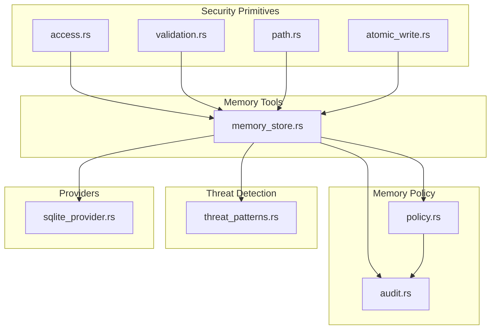
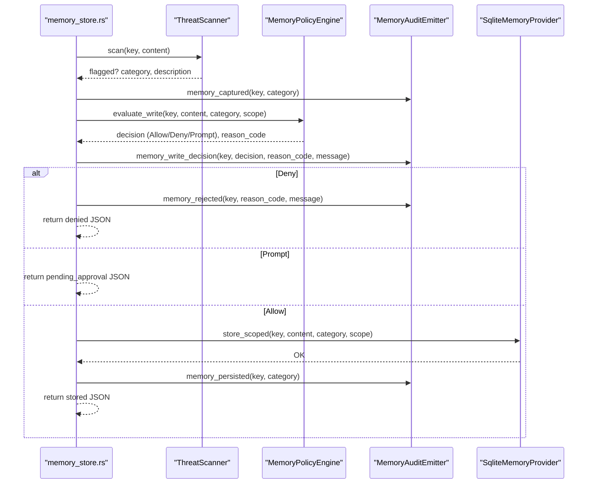
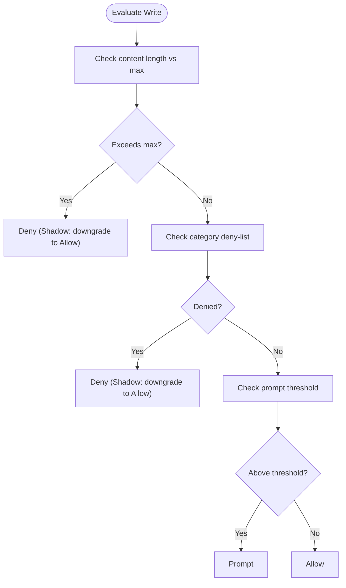
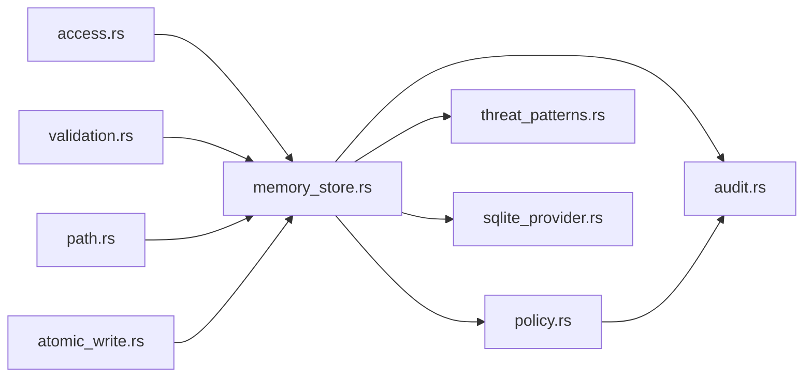

# Security and Threat Detection

<cite>
**Referenced Files in This Document**
- [policy.rs](file://src-tauri/src/modules/memory/policy.rs)
- [memory_store.rs](file://src-tauri/src/modules/tools/builtin/memory_store.rs)
- [threat_patterns.rs](file://src-tauri/src/modules/skills/guard/threat_patterns.rs)
- [audit.rs](file://src-tauri/src/modules/memory/audit.rs)
- [access.rs](file://src-tauri/src/modules/security/access.rs)
- [validation.rs](file://src-tauri/src/modules/security/validation.rs)
- [path.rs](file://src-tauri/src/modules/security/path.rs)
- [atomic_write.rs](file://src-tauri/src/modules/security/atomic_write.rs)
- [sqlite_provider.rs](file://src-tauri/src/modules/memory/providers/sqlite_provider.rs)
- [ADR-006-Security-Design.md](file://docs/design-docs/postCLI/ADR/ADR-006-Security-Design.md)
- [memory-enhancement-from-openhanako-v1.md](file://docs/design-docs/postCLI/memory-enhancement-from-openhanako-v1.md)
</cite>

## Table of Contents
1. [Introduction](#introduction)
2. [Project Structure](#project-structure)
3. [Core Components](#core-components)
4. [Architecture Overview](#architecture-overview)
5. [Detailed Component Analysis](#detailed-component-analysis)
6. [Dependency Analysis](#dependency-analysis)
7. [Performance Considerations](#performance-considerations)
8. [Troubleshooting Guide](#troubleshooting-guide)
9. [Conclusion](#conclusion)

## Introduction
This document describes the security and threat detection architecture for If2Ai's memory system. It covers integrated threat scanning, memory access control, audit trails for compliance, compatibility checking, data sanitization, privacy protection, security configurations, threat classification, and incident response procedures. The goal is to provide both technical depth for developers and practical guidance for operators and auditors.

## Project Structure
The security model spans several modules:
- Memory policy engine and enforcement
- Threat scanning and classification
- Audit emission and compliance tracking
- Security primitives (input validation, path safety, atomic writes)
- Access control and scoping
- Provider-level isolation guarantees

**Diagram sources**
- [memory_store.rs:1-627](file://src-tauri/src/modules/tools/builtin/memory_store.rs#L1-L627)
- [policy.rs:1-336](file://src-tauri/src/modules/memory/policy.rs#L1-L336)
- [threat_patterns.rs:1-983](file://src-tauri/src/modules/skills/guard/threat_patterns.rs#L1-L983)
- [audit.rs:1-1095](file://src-tauri/src/modules/memory/audit.rs#L1-L1095)
- [access.rs:1-104](file://src-tauri/src/modules/security/access.rs#L1-L104)
- [validation.rs:1-142](file://src-tauri/src/modules/security/validation.rs#L1-L142)
- [path.rs:1-145](file://src-tauri/src/modules/security/path.rs#L1-L145)
- [atomic_write.rs:1-122](file://src-tauri/src/modules/security/atomic_write.rs#L1-L122)
- [sqlite_provider.rs:1150-1180](file://src-tauri/src/modules/memory/providers/sqlite_provider.rs#L1150-L1180)

**Section sources**
- [memory_store.rs:1-627](file://src-tauri/src/modules/tools/builtin/memory_store.rs#L1-L627)
- [policy.rs:1-336](file://src-tauri/src/modules/memory/policy.rs#L1-L336)
- [threat_patterns.rs:1-983](file://src-tauri/src/modules/skills/guard/threat_patterns.rs#L1-L983)
- [audit.rs:1-1095](file://src-tauri/src/modules/memory/audit.rs#L1-L1095)
- [access.rs:1-104](file://src-tauri/src/modules/security/access.rs#L1-L104)
- [validation.rs:1-142](file://src-tauri/src/modules/security/validation.rs#L1-L142)
- [path.rs:1-145](file://src-tauri/src/modules/security/path.rs#L1-L145)
- [atomic_write.rs:1-122](file://src-tauri/src/modules/security/atomic_write.rs#L1-L122)
- [sqlite_provider.rs:1150-1180](file://src-tauri/src/modules/memory/providers/sqlite_provider.rs#L1150-L1180)

## Core Components
- Memory Policy Engine: Configurable enforcement with shadow mode, reason codes, and policy decisions.
- Threat Scanner: Built-in patterns across 15+ categories for credentials, injection, destructive ops, and more.
- Audit Emitter: Structured, machine-readable events for compliance and observability.
- Security Primitives: Input validation, path traversal prevention, atomic writes, and access control.
- Provider Isolation: Session-scoped visibility guarantees and scoped recall semantics.

**Section sources**
- [policy.rs:1-336](file://src-tauri/src/modules/memory/policy.rs#L1-L336)
- [threat_patterns.rs:1-983](file://src-tauri/src/modules/skills/guard/threat_patterns.rs#L1-L983)
- [audit.rs:1-1095](file://src-tauri/src/modules/memory/audit.rs#L1-L1095)
- [access.rs:1-104](file://src-tauri/src/modules/security/access.rs#L1-L104)
- [validation.rs:1-142](file://src-tauri/src/modules/security/validation.rs#L1-L142)
- [path.rs:1-145](file://src-tauri/src/modules/security/path.rs#L1-L145)
- [atomic_write.rs:1-122](file://src-tauri/src/modules/security/atomic_write.rs#L1-L122)
- [sqlite_provider.rs:1150-1180](file://src-tauri/src/modules/memory/providers/sqlite_provider.rs#L1150-L1180)

## Architecture Overview
The memory security architecture enforces layered protections around write operations:

**Diagram sources**
- [memory_store.rs:268-388](file://src-tauri/src/modules/tools/builtin/memory_store.rs#L268-L388)
- [policy.rs:143-208](file://src-tauri/src/modules/memory/policy.rs#L143-L208)
- [audit.rs:194-305](file://src-tauri/src/modules/memory/audit.rs#L194-L305)

## Detailed Component Analysis

### Memory Policy Engine
The policy engine evaluates write requests against configurable rules and produces a decision with a stable reason code. It supports:
- Shadow mode: logs and downgrades Deny to Allow with ShadowDenied reason code.
- Enforce mode: actual blocking of writes.
- Rule priorities: hard content length limit, category deny-list, prompt threshold, default allow.

**Diagram sources**
- [policy.rs:143-208](file://src-tauri/src/modules/memory/policy.rs#L143-L208)

**Section sources**
- [policy.rs:1-336](file://src-tauri/src/modules/memory/policy.rs#L1-L336)

### Threat Scanner and Classification
The threat scanner uses 60+ regex patterns across 15+ categories:
- Credential exposure (API keys, passwords, JWTs, SSH/AWS configs)
- Injection (prompt injection, XSS-like templates)
- Destructive operations (rm -rf, chmod 777, system overwrite)
- Persistence (cron, authorized_keys, systemd)
- Network (reverse shells, tunnels, hardcoded IPs)
- Obfuscation (base64 decode pipes, eval/exec chains)
- Execution (subprocess calls, shell pipes)
- Path traversal and structural limits
- Supply chain risks (unpinned installs, remote fetches)
- Mining indicators and jailbreak attempts

Classification supports severity levels and category taxonomy for audit tagging.

**Section sources**
- [threat_patterns.rs:1-983](file://src-tauri/src/modules/skills/guard/threat_patterns.rs#L1-L983)

### Audit Trail and Compliance
The audit emitter produces structured events for:
- memory_captured
- memory_write_decision
- memory_persisted
- memory_recall_served
- memory_rejected
- memory_promotion_candidate/promoted/demoted
- memory_pii_redacted
- memory_job_failed/skipped
- memory_summary_rolled
- memory_pinned/unpinned

These events include standardized trace fields and optional extra metadata for compliance reporting.

**Section sources**
- [audit.rs:1-1095](file://src-tauri/src/modules/memory/audit.rs#L1-L1095)

### Security Primitives
- Input validation: key format and length, content size limits, injection pattern detection.
- Path validation: safe path resolution preventing traversal and symlink tricks.
- Atomic writes: crash-safe file operations via temp file + atomic rename.
- Access control: category-based permissions for sessions and projects.

**Section sources**
- [validation.rs:1-142](file://src-tauri/src/modules/security/validation.rs#L1-L142)
- [path.rs:1-145](file://src-tauri/src/modules/security/path.rs#L1-L145)
- [atomic_write.rs:1-122](file://src-tauri/src/modules/security/atomic_write.rs#L1-L122)
- [access.rs:1-104](file://src-tauri/src/modules/security/access.rs#L1-L104)

### Provider-Level Isolation
The SQLite provider enforces session-scoped visibility:
- Entries stored with a session scope are only recallable within the same session.
- Cross-session recall is prevented by scope resolution.

**Section sources**
- [sqlite_provider.rs:1150-1180](file://src-tauri/src/modules/memory/providers/sqlite_provider.rs#L1150-L1180)

### Compatibility Checking and Data Sanitization
- Compatibility: The memory store tool loads user-selected enforcement mode from disk on each invocation, enabling immediate UI-driven toggles without restart.
- Sanitization: Prompt sanitization utilities exist for provider messages, removing unmatched tool use blocks and tracking samples for diagnostics.

**Section sources**
- [memory_store.rs:130-186](file://src-tauri/src/modules/tools/builtin/memory_store.rs#L130-L186)
- [sanitize.rs:41-75](file://src-tauri/src/modules/application/prompt_planner/sanitize.rs#L41-L75)

### Privacy Protection Measures
- PII detection and redaction: The audit system surfaces detected PII kinds and counts for transparency.
- Shadow-only threat scanning: Initial scanning logs and audits without blocking; enforcement is applied by policy engine.

**Section sources**
- [audit.rs:525-565](file://src-tauri/src/modules/memory/audit.rs#L525-L565)
- [memory_store.rs:271-296](file://src-tauri/src/modules/tools/builtin/memory_store.rs#L271-L296)

### Security Configurations and Controls
- Policy configuration: enforce mode, max content bytes, prompt threshold, denied categories.
- Access control: session/project contexts define readable/writable categories.
- Path safety: validated base directories and safe path resolution.
- Atomic writes: crash-consistent persistence.

**Section sources**
- [policy.rs:90-114](file://src-tauri/src/modules/memory/policy.rs#L90-L114)
- [access.rs:16-57](file://src-tauri/src/modules/security/access.rs#L16-L57)
- [path.rs:10-90](file://src-tauri/src/modules/security/path.rs#L10-L90)
- [atomic_write.rs:16-44](file://src-tauri/src/modules/security/atomic_write.rs#L16-L44)

### Incident Response Procedures
- Deny decisions: Emitted as memory_rejected with reason_code and message; UI surfaces denial state.
- Prompt decisions: Emitted as memory_write_decision with prompt; handler returns pending_approval JSON without persisting.
- Audit correlation: All events include trace_id/session_id/project_id for cross-session investigation.
- Job failures: memory_job_failed/skipped events capture retry budgets and errors for diagnostics.

**Section sources**
- [memory_store.rs:337-388](file://src-tauri/src/modules/tools/builtin/memory_store.rs#L337-L388)
- [audit.rs:347-516](file://src-tauri/src/modules/memory/audit.rs#L347-L516)

## Dependency Analysis
The memory security stack exhibits clear separation of concerns with low coupling between components:

**Diagram sources**
- [memory_store.rs:43-51](file://src-tauri/src/modules/tools/builtin/memory_store.rs#L43-L51)
- [policy.rs:16-18](file://src-tauri/src/modules/memory/policy.rs#L16-L18)
- [threat_patterns.rs:7-23](file://src-tauri/src/modules/skills/guard/threat_patterns.rs#L7-L23)
- [audit.rs:24-31](file://src-tauri/src/modules/memory/audit.rs#L24-L31)
- [access.rs](file://src-tauri/src/modules/security/access.rs#L6)
- [validation.rs](file://src-tauri/src/modules/security/validation.rs#L6)
- [path.rs](file://src-tauri/src/modules/security/path.rs#L5)
- [atomic_write.rs](file://src-tauri/src/modules/security/atomic_write.rs#L6)
- [sqlite_provider.rs:1-20](file://src-tauri/src/modules/memory/providers/sqlite_provider.rs#L1-L20)

**Section sources**
- [memory_store.rs:1-627](file://src-tauri/src/modules/tools/builtin/memory_store.rs#L1-L627)
- [policy.rs:1-336](file://src-tauri/src/modules/memory/policy.rs#L1-L336)
- [threat_patterns.rs:1-983](file://src-tauri/src/modules/skills/guard/threat_patterns.rs#L1-L983)
- [audit.rs:1-1095](file://src-tauri/src/modules/memory/audit.rs#L1-L1095)
- [access.rs:1-104](file://src-tauri/src/modules/security/access.rs#L1-L104)
- [validation.rs:1-142](file://src-tauri/src/modules/security/validation.rs#L1-L142)
- [path.rs:1-145](file://src-tauri/src/modules/security/path.rs#L1-L145)
- [atomic_write.rs:1-122](file://src-tauri/src/modules/security/atomic_write.rs#L1-L122)
- [sqlite_provider.rs:1-20](file://src-tauri/src/modules/memory/providers/sqlite_provider.rs#L1-L20)

## Performance Considerations
- Policy evaluation is O(1) with constant-time checks for length, category deny-list, and threshold.
- Threat scanning uses compiled regex patterns; performance scales with content length and pattern count.
- Atomic writes minimize partial-state risk at the cost of temporary file I/O; acceptable for infrequent memory writes.
- Audit emissions are fire-and-forget via tracing sinks; overhead is bounded by event volume.

## Troubleshooting Guide
Common scenarios and resolutions:
- Frequent Deny decisions in shadow mode: Investigate reason_code labels and adjust thresholds or categories.
- Prompt decisions due to large content: Split content or reduce size below threshold.
- Path traversal attempts: Review path validation and base directory configuration.
- Permission denials: Verify session/project access context categories.
- Audit gaps: Confirm app handle registration and IPC forwarding.

**Section sources**
- [policy.rs:210-226](file://src-tauri/src/modules/memory/policy.rs#L210-L226)
- [path.rs:92-106](file://src-tauri/src/modules/security/path.rs#L92-L106)
- [access.rs:49-57](file://src-tauri/src/modules/security/access.rs#L49-L57)
- [audit.rs:40-45](file://src-tauri/src/modules/memory/audit.rs#L40-L45)

## Conclusion
If2Ai's memory system integrates layered security through policy enforcement, comprehensive threat scanning, robust audit trails, and strong isolation guarantees. The design balances safety (shadow mode, atomic writes) with operability (prompt thresholds, structured events) and supports compliance through standardized reason codes and traceable audit events.