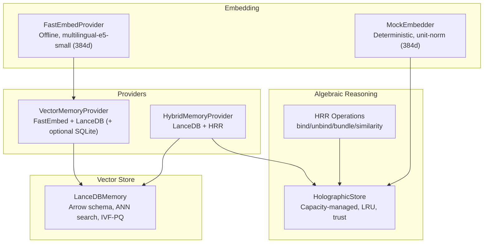
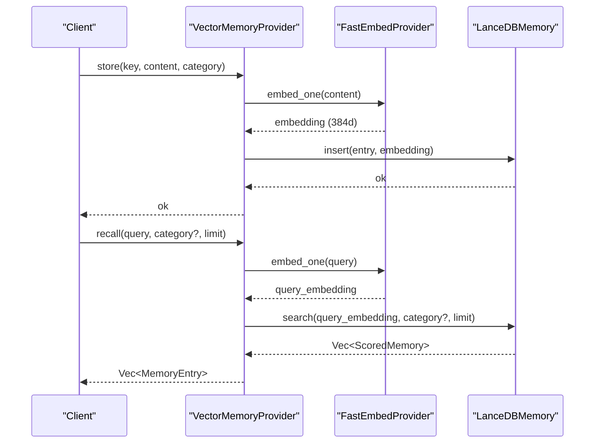
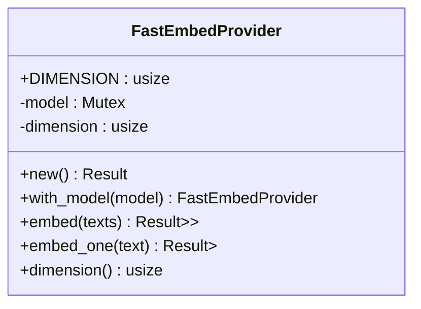
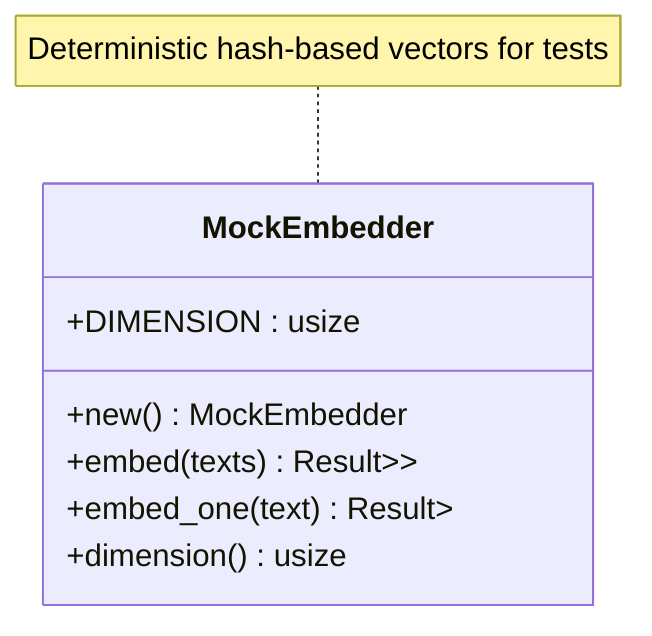
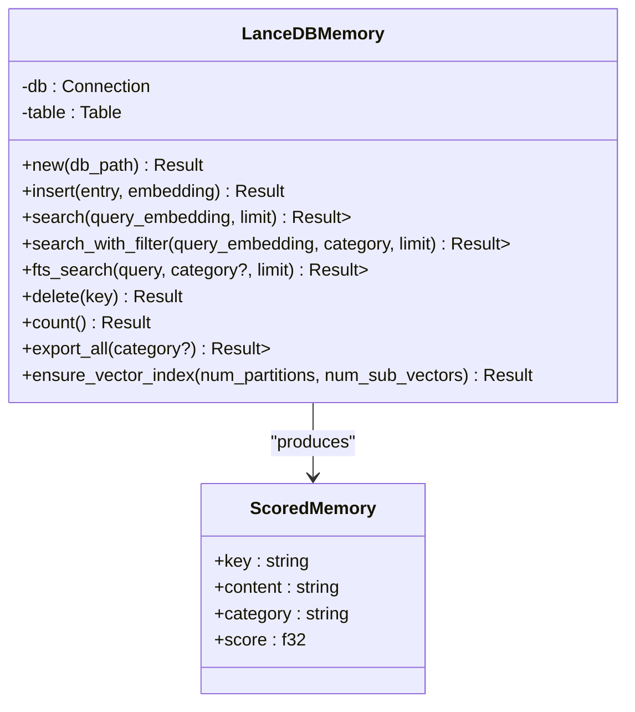
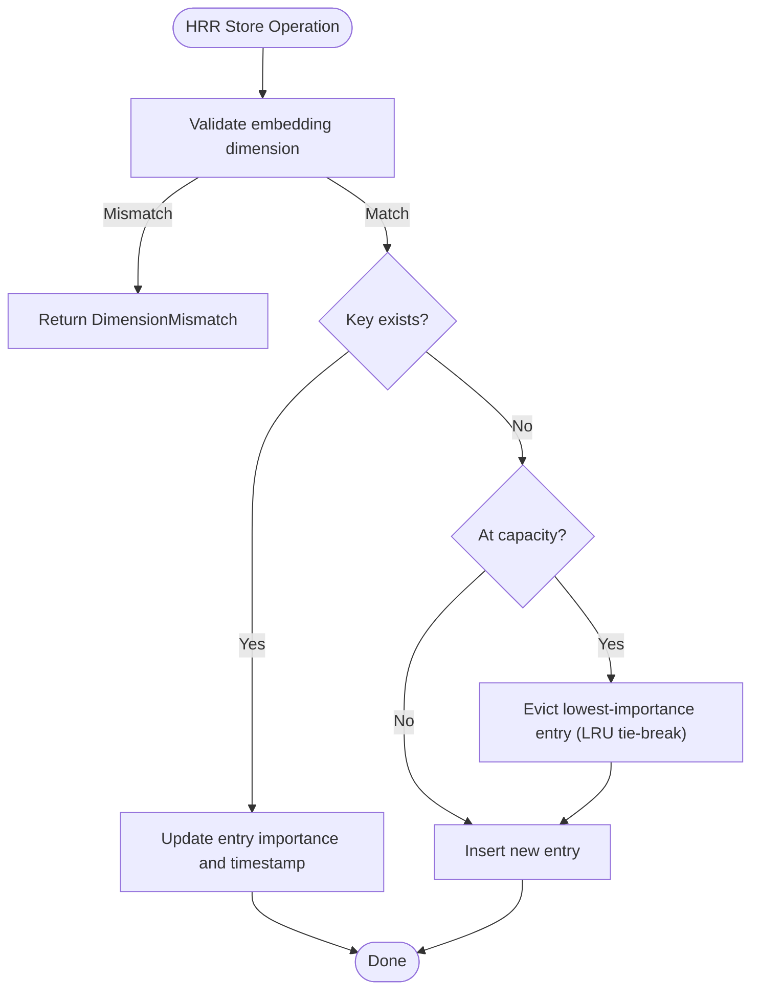
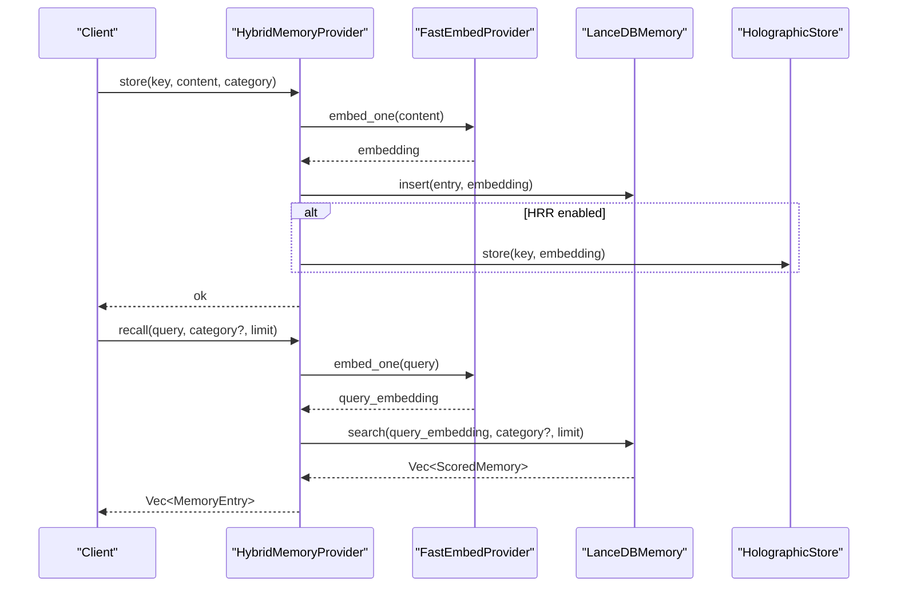
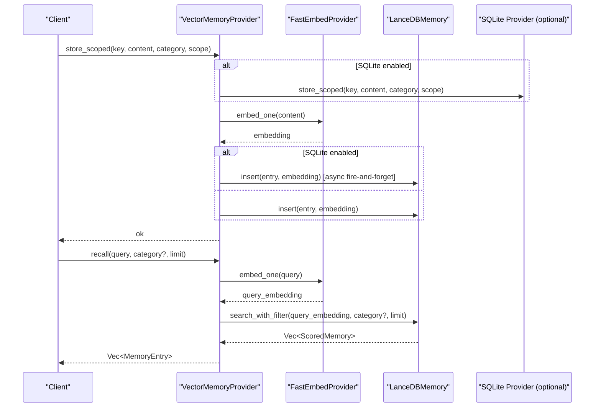
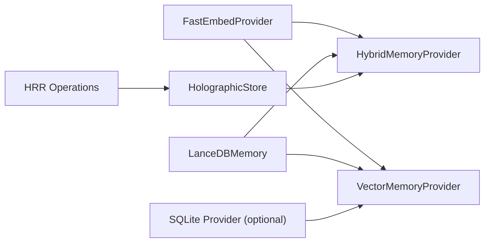

# Vector Database Integration

<cite>
**Referenced Files in This Document**
- [embedding/mod.rs](file://src-tauri/src/modules/memory/embedding/mod.rs)
- [embedding/fastembed.rs](file://src-tauri/src/modules/memory/embedding/fastembed.rs)
- [embedding/mock.rs](file://src-tauri/src/modules/memory/embedding/mock.rs)
- [providers/lancedb.rs](file://src-tauri/src/modules/memory/providers/lancedb.rs)
- [providers/vector_provider.rs](file://src-tauri/src/modules/memory/providers/vector_provider.rs)
- [hrr/mod.rs](file://src-tauri/src/modules/memory/hrr/mod.rs)
- [hrr/operations.rs](file://src-tauri/src/modules/memory/hrr/operations.rs)
- [hrr/store.rs](file://src-tauri/src/modules/memory/hrr/store.rs)
- [hrr/integration.rs](file://src-tauri/src/modules/memory/hrr/integration.rs)
</cite>

## Table of Contents
1. [Introduction](#introduction)
2. [Project Structure](#project-structure)
3. [Core Components](#core-components)
4. [Architecture Overview](#architecture-overview)
5. [Detailed Component Analysis](#detailed-component-analysis)
6. [Dependency Analysis](#dependency-analysis)
7. [Performance Considerations](#performance-considerations)
8. [Troubleshooting Guide](#troubleshooting-guide)
9. [Conclusion](#conclusion)
10. [Appendices](#appendices)

## Introduction
This document explains the vector database integration in If2Ai’s memory system. It covers:
- FastEmbed-based text embedding generation for offline, CPU-friendly embeddings
- Holographic Reduced Representations (HRR) for algebraic memory operations and memory encoding
- Semantic search powered by LanceDB with ANN vector search and optional full-text search
- The embedding pipeline from text to vector storage and retrieval
- Similarity scoring mechanisms and hybrid search fusion
- Mock embedding system for testing
- Vector indexing strategies and performance optimization
- Practical examples of vector queries, ranking, and integration with the broader memory architecture

## Project Structure
The vector memory system is implemented in Rust under the memory module with clear separation of concerns:
- Embedding providers: FastEmbed and a deterministic mock
- Vector store: LanceDB with Arrow schema and IVF-PQ indexing
- HRR algebraic reasoning: bind/unbind/bundle/similarity with a capacity-managed store
- Hybrid provider: combines LanceDB and HRR for semantic and algebraic memory operations
- Vector provider: primary provider integrating FastEmbed and LanceDB with optional SQLite dual-write

**Diagram sources**
- [embedding/fastembed.rs:31-106](file://src-tauri/src/modules/memory/embedding/fastembed.rs#L31-L106)
- [embedding/mock.rs:27-104](file://src-tauri/src/modules/memory/embedding/mock.rs#L27-L104)
- [providers/lancedb.rs:108-353](file://src-tauri/src/modules/memory/providers/lancedb.rs#L108-L353)
- [hrr/operations.rs:8-141](file://src-tauri/src/modules/memory/hrr/operations.rs#L8-L141)
- [hrr/store.rs:43-299](file://src-tauri/src/modules/memory/hrr/store.rs#L43-L299)
- [providers/vector_provider.rs:98-282](file://src-tauri/src/modules/memory/providers/vector_provider.rs#L98-L282)
- [hrr/integration.rs:59-263](file://src-tauri/src/modules/memory/hrr/integration.rs#L59-L263)

**Section sources**
- [embedding/mod.rs:1-11](file://src-tauri/src/modules/memory/embedding/mod.rs#L1-L11)
- [providers/vector_provider.rs:1-25](file://src-tauri/src/modules/memory/providers/vector_provider.rs#L1-L25)
- [providers/lancedb.rs:1-11](file://src-tauri/src/modules/memory/providers/lancedb.rs#L1-L11)
- [hrr/mod.rs:1-24](file://src-tauri/src/modules/memory/hrr/mod.rs#L1-L24)

## Core Components
- FastEmbedProvider: generates 384-dimensional embeddings using a multilingual model, with thread-safe access and dimension validation
- MockEmbedder: deterministic, unit-norm embeddings for testing without external model downloads
- LanceDBMemory: persistent vector store with Arrow schema, ANN vector search, optional full-text filtering, and IVF-PQ index management
- VectorMemoryProvider: orchestrates embedding and storage, supports SQLite dual-write, hybrid search, and scope-aware operations
- HRR operations and store: bind/unbind/bundle/similarity with a capacity-managed store supporting algebraic reasoning and contradiction detection
- HybridMemoryProvider: integrates LanceDB and HRR for semantic and algebraic memory capabilities

**Section sources**
- [embedding/fastembed.rs:31-106](file://src-tauri/src/modules/memory/embedding/fastembed.rs#L31-L106)
- [embedding/mock.rs:27-104](file://src-tauri/src/modules/memory/embedding/mock.rs#L27-L104)
- [providers/lancedb.rs:108-353](file://src-tauri/src/modules/memory/providers/lancedb.rs#L108-L353)
- [providers/vector_provider.rs:98-282](file://src-tauri/src/modules/memory/providers/vector_provider.rs#L98-L282)
- [hrr/operations.rs:8-141](file://src-tauri/src/modules/memory/hrr/operations.rs#L8-L141)
- [hrr/store.rs:43-299](file://src-tauri/src/modules/memory/hrr/store.rs#L43-L299)
- [hrr/integration.rs:59-263](file://src-tauri/src/modules/memory/hrr/integration.rs#L59-L263)

## Architecture Overview
The system integrates three pillars:
- Embedding: FastEmbed for production, MockEmbedder for tests
- Storage: LanceDB for persistent ANN vector search
- Algebraic reasoning: HRR for symbolic memory operations

**Diagram sources**
- [providers/vector_provider.rs:314-390](file://src-tauri/src/modules/memory/providers/vector_provider.rs#L314-L390)
- [embedding/fastembed.rs:82-101](file://src-tauri/src/modules/memory/embedding/fastembed.rs#L82-L101)
- [providers/lancedb.rs:166-181](file://src-tauri/src/modules/memory/providers/lancedb.rs#L166-L181)

## Detailed Component Analysis

### FastEmbed Integration
FastEmbedProvider wraps the fastembed crate to produce offline, CPU-friendly 384-dimensional embeddings. It validates dimensions, handles empty inputs, and exposes batch and single-vector embedding APIs.

Key behaviors:
- Model initialization with multilingual-e5-small
- Thread-safe access via a mutex-guarded TextEmbedding instance
- Dimension validation and error propagation for mismatched embeddings
- Batch embedding for improved throughput

**Diagram sources**
- [embedding/fastembed.rs:31-106](file://src-tauri/src/modules/memory/embedding/fastembed.rs#L31-L106)

**Section sources**
- [embedding/fastembed.rs:31-106](file://src-tauri/src/modules/memory/embedding/fastembed.rs#L31-L106)

### Mock Embedding System (Testing)
MockEmbedder provides deterministic, unit-norm 384-dimensional vectors derived from a hash of the input text. It mirrors the FastEmbedProvider surface for seamless test substitution.

Properties:
- Deterministic: identical inputs yield identical vectors
- Distinct: different inputs rarely collide
- Unit-norm: cosine similarity approximates dot product
- Non-semantic: designed for structural and integration tests, not semantic accuracy

**Diagram sources**
- [embedding/mock.rs:27-104](file://src-tauri/src/modules/memory/embedding/mock.rs#L27-L104)

**Section sources**
- [embedding/mock.rs:1-155](file://src-tauri/src/modules/memory/embedding/mock.rs#L1-L155)

### LanceDB Vector Store
LanceDBMemory implements a persistent vector store with:
- Arrow schema for semantic_memory table (key, content, category, embedding, created_at)
- ANN vector search using LanceDB’s vector_search
- Optional full-text filtering on content and category
- IVF-PQ index creation with best-effort semantics and graceful degradation
- RecordBatch conversion and streaming extraction of results

**Diagram sources**
- [providers/lancedb.rs:108-353](file://src-tauri/src/modules/memory/providers/lancedb.rs#L108-L353)

**Section sources**
- [providers/lancedb.rs:56-106](file://src-tauri/src/modules/memory/providers/lancedb.rs#L56-L106)
- [providers/lancedb.rs:117-164](file://src-tauri/src/modules/memory/providers/lancedb.rs#L117-L164)
- [providers/lancedb.rs:166-202](file://src-tauri/src/modules/memory/providers/lancedb.rs#L166-L202)
- [providers/lancedb.rs:204-239](file://src-tauri/src/modules/memory/providers/lancedb.rs#L204-L239)
- [providers/lancedb.rs:241-265](file://src-tauri/src/modules/memory/providers/lancedb.rs#L241-L265)
- [providers/lancedb.rs:267-342](file://src-tauri/src/modules/memory/providers/lancedb.rs#L267-L342)

### HRR (Hash-Reduced Representation) Operations and Store
HRR enables algebraic memory operations:
- bind: wraps value into key’s binding space
- unbind: retrieves bound value using inverse convolution
- bundle: weighted superposition with normalization
- similarity: cosine similarity between vectors

HolographicStore manages capacity (O(√dim)), LRU eviction, and trust adjustments.

**Diagram sources**
- [hrr/store.rs:102-141](file://src-tauri/src/modules/memory/hrr/store.rs#L102-L141)

**Section sources**
- [hrr/operations.rs:42-141](file://src-tauri/src/modules/memory/hrr/operations.rs#L42-L141)
- [hrr/store.rs:43-299](file://src-tauri/src/modules/memory/hrr/store.rs#L43-L299)

### Hybrid Memory Provider (LanceDB + HRR)
HybridMemoryProvider combines:
- Primary vector search via LanceDB
- Optional HRR store for algebraic reasoning and contradiction detection
- Configurable HRR enablement and capacity overrides

**Diagram sources**
- [hrr/integration.rs:294-402](file://src-tauri/src/modules/memory/hrr/integration.rs#L294-L402)
- [providers/lancedb.rs:166-181](file://src-tauri/src/modules/memory/providers/lancedb.rs#L166-L181)
- [embedding/fastembed.rs:82-101](file://src-tauri/src/modules/memory/embedding/fastembed.rs#L82-L101)

**Section sources**
- [hrr/integration.rs:59-263](file://src-tauri/src/modules/memory/hrr/integration.rs#L59-L263)
- [hrr/integration.rs:294-402](file://src-tauri/src/modules/memory/hrr/integration.rs#L294-L402)

### Vector Provider (Primary Integration)
VectorMemoryProvider integrates FastEmbed and LanceDB with optional SQLite dual-write:
- Embedding and insertion into LanceDB
- Vector search with optional category filtering
- Full-text search via LanceDB
- Hybrid search combining vector and full-text results using Reciprocal Rank Fusion (RRF)
- Scope-aware operations and importance decay delegation to SQLite when enabled

**Diagram sources**
- [providers/vector_provider.rs:314-390](file://src-tauri/src/modules/memory/providers/vector_provider.rs#L314-L390)
- [providers/vector_provider.rs:400-456](file://src-tauri/src/modules/memory/providers/vector_provider.rs#L400-L456)
- [providers/vector_provider.rs:651-688](file://src-tauri/src/modules/memory/providers/vector_provider.rs#L651-L688)
- [embedding/fastembed.rs:82-101](file://src-tauri/src/modules/memory/embedding/fastembed.rs#L82-L101)
- [providers/lancedb.rs:183-202](file://src-tauri/src/modules/memory/providers/lancedb.rs#L183-L202)

**Section sources**
- [providers/vector_provider.rs:98-282](file://src-tauri/src/modules/memory/providers/vector_provider.rs#L98-L282)
- [providers/vector_provider.rs:314-456](file://src-tauri/src/modules/memory/providers/vector_provider.rs#L314-L456)
- [providers/vector_provider.rs:651-688](file://src-tauri/src/modules/memory/providers/vector_provider.rs#L651-L688)

## Dependency Analysis
The providers depend on embedding and storage modules, with optional SQLite integration.

**Diagram sources**
- [providers/vector_provider.rs:30-37](file://src-tauri/src/modules/memory/providers/vector_provider.rs#L30-L37)
- [hrr/integration.rs:19-23](file://src-tauri/src/modules/memory/hrr/integration.rs#L19-L23)

**Section sources**
- [providers/vector_provider.rs:26-37](file://src-tauri/src/modules/memory/providers/vector_provider.rs#L26-L37)
- [hrr/integration.rs:15-23](file://src-tauri/src/modules/memory/hrr/integration.rs#L15-L23)

## Performance Considerations
- Embedding
  - FastEmbedProvider uses a 384-dimensional multilingual model; dimension validation prevents costly runtime errors
  - Batch embedding reduces overhead for multiple texts
- Vector search
  - IVF-PQ index is created when sufficient rows exist; soft failures degrade gracefully to brute-force scan
  - Index parameters (number of partitions and sub-vectors) balance recall and latency
- HRR store
  - Capacity is O(√dimension) with a scaling factor; practical headroom avoids excessive interference
  - LRU eviction prioritizes importance and recency
- Hybrid search
  - RRF fusion combines vector and full-text results; k-parameter controls mixing of ranks
- Storage
  - Arrow schema ensures efficient columnar storage and streaming
  - Category filtering in LanceDB narrows search scope

[No sources needed since this section provides general guidance]

## Troubleshooting Guide
Common issues and resolutions:
- Embedding errors
  - Empty text input leads to an error; ensure non-empty queries and content
  - Dimension mismatch indicates model or pipeline misconfiguration
- Vector store errors
  - Schema errors occur if required columns are missing or types differ
  - Dimension mismatch during insert indicates embedding dimension mismatch
  - Index creation failures are logged as warnings and do not block operation
- Hybrid search
  - If vector search is disabled, hybrid search falls back to full-text search
  - RRF fusion deduplicates results by key; verify query correctness if duplicates appear
- Scope-aware operations
  - Promote/demote scope require SQLite dual-write; otherwise, operations return explicit errors

**Section sources**
- [embedding/fastembed.rs:18-29](file://src-tauri/src/modules/memory/embedding/fastembed.rs#L18-L29)
- [providers/lancedb.rs:25-39](file://src-tauri/src/modules/memory/providers/lancedb.rs#L25-L39)
- [providers/lancedb.rs:148-148](file://src-tauri/src/modules/memory/providers/lancedb.rs#L148-L148)
- [providers/vector_provider.rs:41-53](file://src-tauri/src/modules/memory/providers/vector_provider.rs#L41-L53)
- [providers/vector_provider.rs:620-632](file://src-tauri/src/modules/memory/providers/vector_provider.rs#L620-L632)

## Conclusion
If2Ai’s memory system integrates FastEmbed for robust, offline embeddings, LanceDB for scalable ANN vector search, and HRR for algebraic reasoning. The VectorMemoryProvider and HybridMemoryProvider offer flexible deployment modes, from pure semantic search to hybrid semantic plus algebraic reasoning. The design emphasizes resilience (soft index failures), testability (mock embeddings), and performance (IVF-PQ, RRF fusion, and capacity-managed HRR).

[No sources needed since this section summarizes without analyzing specific files]

## Appendices

### Practical Examples

- Vector query and ranking
  - Embed the query using FastEmbedProvider
  - Perform vector search on LanceDBMemory with optional category filter
  - Results are ordered by similarity score; convert to MemoryEntry for consumption

- Hybrid search
  - Embed query and run parallel vector and full-text searches
  - Fuse results using RRF with a k-parameter; take top-N results

- HRR algebraic reasoning
  - Bind key-value pairs into composite vectors
  - Probe the HRR store with a query vector to retrieve ranked matches
  - Detect contradictions by measuring cosine similarity between opposing vectors

- Mock embedding usage
  - Replace FastEmbedProvider with MockEmbedder in tests to avoid model downloads
  - Validate HRR operations and hybrid search logic deterministically

**Section sources**
- [providers/lancedb.rs:166-202](file://src-tauri/src/modules/memory/providers/lancedb.rs#L166-L202)
- [providers/vector_provider.rs:241-275](file://src-tauri/src/modules/memory/providers/vector_provider.rs#L241-L275)
- [hrr/integration.rs:131-153](file://src-tauri/src/modules/memory/hrr/integration.rs#L131-L153)
- [hrr/store.rs:188-202](file://src-tauri/src/modules/memory/hrr/store.rs#L188-L202)
- [embedding/mock.rs:27-104](file://src-tauri/src/modules/memory/embedding/mock.rs#L27-L104)