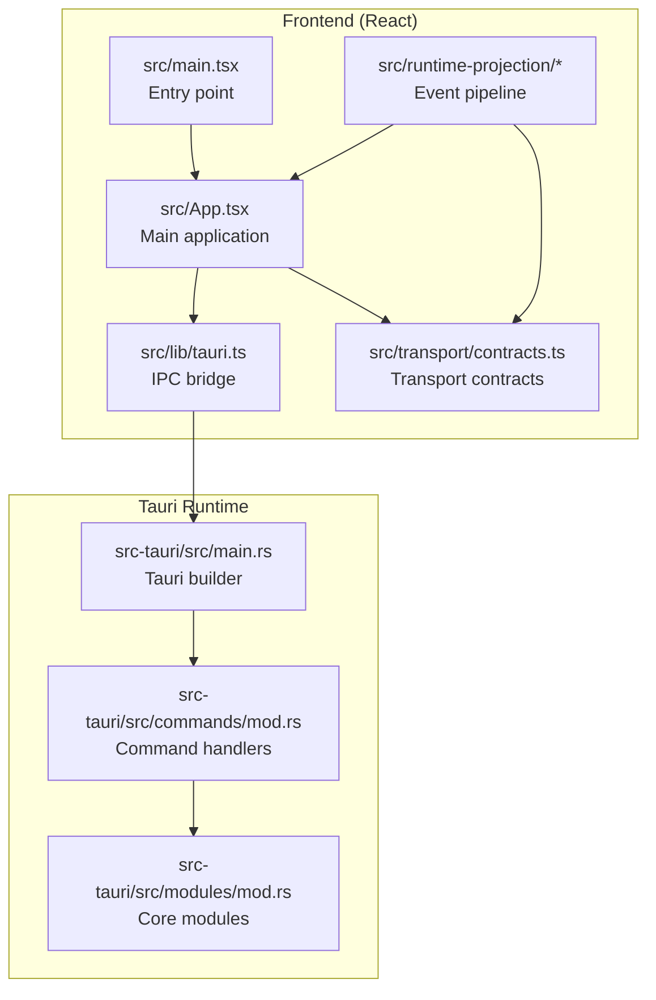
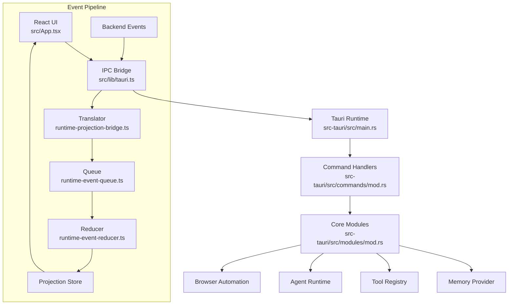
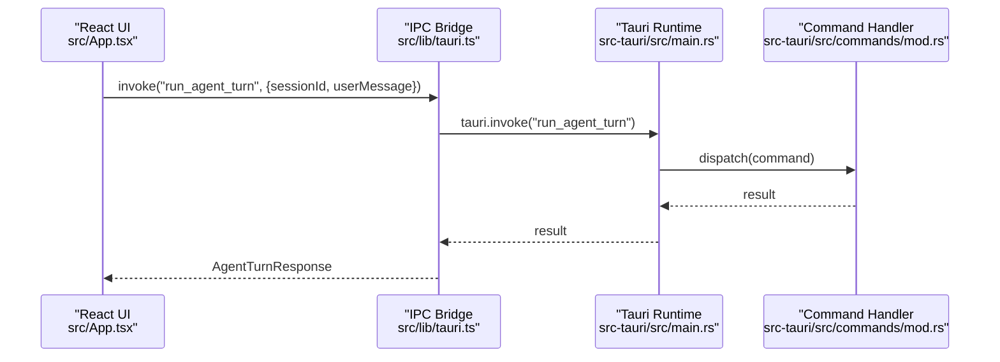
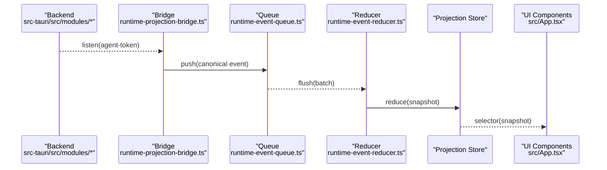
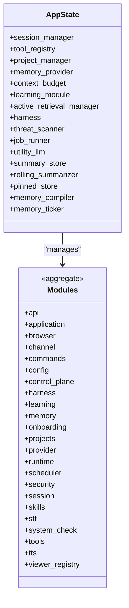
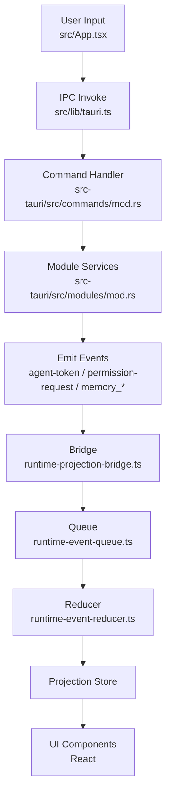
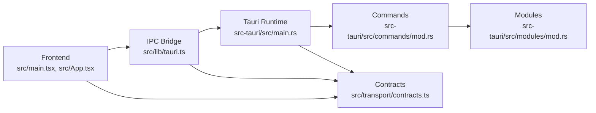

# Architecture Overview

<cite>
**Referenced Files in This Document**
- [src/main.tsx](file://src/main.tsx)
- [src/App.tsx](file://src/App.tsx)
- [src/lib/tauri.ts](file://src/lib/tauri.ts)
- [src-tauri/src/main.rs](file://src-tauri/src/main.rs)
- [src-tauri/Cargo.toml](file://src-tauri/Cargo.toml)
- [package.json](file://package.json)
- [src/transport/contracts.ts](file://src/transport/contracts.ts)
- [src/runtime-projection/index.ts](file://src/runtime-projection/index.ts)
- [src/runtime-projection/runtime-projection-bridge.ts](file://src/runtime-projection/runtime-projection-bridge.ts)
- [src/runtime-projection/runtime-event-queue.ts](file://src/runtime-projection/runtime-event-queue.ts)
- [src/runtime-projection/runtime-event-reducer.ts](file://src/runtime-projection/runtime-event-reducer.ts)
- [src-tauri/src/modules/mod.rs](file://src-tauri/src/modules/mod.rs)
- [src-tauri/src/commands/mod.rs](file://src-tauri/src/commands/mod.rs)
- [src/modules/app-shell/types.ts](file://src/modules/app-shell/types.ts)
- [src/boot/BootShell.tsx](file://src/boot/BootShell.tsx)
</cite>

## Table of Contents
1. [Introduction](#introduction)
2. [Project Structure](#project-structure)
3. [Core Components](#core-components)
4. [Architecture Overview](#architecture-overview)
5. [Detailed Component Analysis](#detailed-component-analysis)
6. [Dependency Analysis](#dependency-analysis)
7. [Performance Considerations](#performance-considerations)
8. [Troubleshooting Guide](#troubleshooting-guide)
9. [Conclusion](#conclusion)

## Introduction
This document describes the If2Ai system architecture, focusing on the layered design connecting the React frontend, the Rust backend, and the Tauri IPC communication layer. It explains the microkernel pattern with pluggable modules, the event-driven architecture with reactive updates, and component interaction patterns. Technology stack rationale is provided for Tauri 2.0, Rust, and React. System context diagrams illustrate data flows between frontend components, backend services, and external integrations. Architectural patterns such as Provider pattern for dependency injection, Command pattern for IPC communication, and Observer pattern for reactive state management are highlighted.

## Project Structure
The project follows a clear separation of concerns:
- React frontend (TypeScript/JSX) under src/ manages UI, routing, and IPC bridging.
- Tauri 2.0 desktop runtime integrates the frontend with the Rust backend.
- Rust backend (src-tauri/) implements modular services and command handlers.
- Transport contracts define canonical event and data shapes for IPC.
- Runtime projection pipeline transforms backend events into a reactive store.

**Diagram sources**
- [src/main.tsx:1-44](file://src/main.tsx#L1-L44)
- [src/App.tsx:1-120](file://src/App.tsx#L1-L120)
- [src/lib/tauri.ts:1-60](file://src/lib/tauri.ts#L1-L60)
- [src-tauri/src/main.rs:406-437](file://src-tauri/src/main.rs#L406-L437)
- [src-tauri/src/commands/mod.rs:28-169](file://src-tauri/src/commands/mod.rs#L28-L169)
- [src-tauri/src/modules/mod.rs:1-68](file://src-tauri/src/modules/mod.rs#L1-L68)
- [src/transport/contracts.ts:1-50](file://src/transport/contracts.ts#L1-L50)
- [src/runtime-projection/index.ts:1-15](file://src/runtime-projection/index.ts#L1-L15)

**Section sources**
- [src/main.tsx:1-44](file://src/main.tsx#L1-L44)
- [src/App.tsx:1-120](file://src/App.tsx#L1-L120)
- [src/lib/tauri.ts:1-60](file://src/lib/tauri.ts#L1-L60)
- [src-tauri/src/main.rs:406-437](file://src-tauri/src/main.rs#L406-L437)
- [src-tauri/src/commands/mod.rs:28-169](file://src-tauri/src/commands/mod.rs#L28-L169)
- [src-tauri/src/modules/mod.rs:1-68](file://src-tauri/src/modules/mod.rs#L1-L68)
- [src/transport/contracts.ts:1-50](file://src/transport/contracts.ts#L1-L50)
- [src/runtime-projection/index.ts:1-15](file://src/runtime-projection/index.ts#L1-L15)

## Core Components
- React frontend entry and routing:
  - src/main.tsx mounts the application and selects surfaces based on URL parameters.
  - src/App.tsx orchestrates boot, onboarding, and main shell rendering, and wires IPC calls.
- IPC bridge:
  - src/lib/tauri.ts encapsulates all Tauri IPC invocations and event listeners, exposing typed helpers for commands and events.
- Backend runtime:
  - src-tauri/src/main.rs initializes AppState and registers command handlers.
  - src-tauri/src/commands/mod.rs defines the AppState structure and exports command modules.
  - src-tauri/src/modules/mod.rs aggregates core modules (memory, tools, runtime, browser, etc.).
- Transport contracts:
  - src/transport/contracts.ts defines canonical event and payload shapes for IPC.
- Runtime projection pipeline:
  - src/runtime-projection/* implements a queue, translator, reducer, and store to transform backend events into a reactive snapshot consumed by UI.

**Section sources**
- [src/main.tsx:16-44](file://src/main.tsx#L16-L44)
- [src/App.tsx:89-197](file://src/App.tsx#L89-L197)
- [src/lib/tauri.ts:14-65](file://src/lib/tauri.ts#L14-L65)
- [src-tauri/src/main.rs:406-782](file://src-tauri/src/main.rs#L406-L782)
- [src-tauri/src/commands/mod.rs:28-252](file://src-tauri/src/commands/mod.rs#L28-L252)
- [src-tauri/src/modules/mod.rs:1-68](file://src-tauri/src/modules/mod.rs#L1-L68)
- [src/transport/contracts.ts:26-73](file://src/transport/contracts.ts#L26-L73)
- [src/runtime-projection/index.ts:1-15](file://src/runtime-projection/index.ts#L1-L15)

## Architecture Overview
The system employs a layered architecture:
- Presentation Layer (React): Renders UI, manages user interactions, and invokes IPC via src/lib/tauri.ts.
- IPC Layer (Tauri 2.0): Bridges frontend and backend, handling commands and events.
- Business Logic Layer (Rust): Implements microkernel modules (memory, tools, runtime, browser, etc.) and command handlers.
- Data Contracts: Canonical event and payload shapes defined in src/transport/contracts.ts.

**Diagram sources**
- [src/App.tsx:1-60](file://src/App.tsx#L1-L60)
- [src/lib/tauri.ts:14-65](file://src/lib/tauri.ts#L14-L65)
- [src-tauri/src/main.rs:406-782](file://src-tauri/src/main.rs#L406-L782)
- [src-tauri/src/commands/mod.rs:28-252](file://src-tauri/src/commands/mod.rs#L28-L252)
- [src-tauri/src/modules/mod.rs:1-68](file://src-tauri/src/modules/mod.rs#L1-L68)
- [src/runtime-projection/runtime-projection-bridge.ts:88-194](file://src/runtime-projection/runtime-projection-bridge.ts#L88-L194)
- [src/runtime-projection/runtime-event-queue.ts:54-123](file://src/runtime-projection/runtime-event-queue.ts#L54-L123)
- [src/runtime-projection/runtime-event-reducer.ts:40-287](file://src/runtime-projection/runtime-event-reducer.ts#L40-L287)

**Section sources**
- [src/App.tsx:1-60](file://src/App.tsx#L1-L60)
- [src/lib/tauri.ts:14-65](file://src/lib/tauri.ts#L14-L65)
- [src-tauri/src/main.rs:406-782](file://src-tauri/src/main.rs#L406-L782)
- [src-tauri/src/commands/mod.rs:28-252](file://src-tauri/src/commands/mod.rs#L28-L252)
- [src-tauri/src/modules/mod.rs:1-68](file://src-tauri/src/modules/mod.rs#L1-L68)
- [src/runtime-projection/runtime-projection-bridge.ts:88-194](file://src/runtime-projection/runtime-projection-bridge.ts#L88-L194)
- [src/runtime-projection/runtime-event-queue.ts:54-123](file://src/runtime-projection/runtime-event-queue.ts#L54-L123)
- [src/runtime-projection/runtime-event-reducer.ts:40-287](file://src/runtime-projection/runtime-event-reducer.ts#L40-L287)

## Detailed Component Analysis

### IPC Communication Layer (Command Pattern)
The frontend invokes backend commands through typed helpers in src/lib/tauri.ts. These helpers wrap Tauri’s invoke/listen APIs and map to backend command handlers defined in src-tauri/src/commands/mod.rs. The AppState struct aggregates shared services (memory provider, tool registry, session manager, etc.), enabling a Provider-like dependency injection pattern at the backend.

**Diagram sources**
- [src/App.tsx:196-212](file://src/App.tsx#L196-L212)
- [src/lib/tauri.ts:202-212](file://src/lib/tauri.ts#L202-L212)
- [src-tauri/src/main.rs:406-437](file://src-tauri/src/main.rs#L406-L437)
- [src-tauri/src/commands/mod.rs:28-169](file://src-tauri/src/commands/mod.rs#L28-L169)

**Section sources**
- [src/App.tsx:196-212](file://src/App.tsx#L196-L212)
- [src/lib/tauri.ts:202-212](file://src/lib/tauri.ts#L202-L212)
- [src-tauri/src/commands/mod.rs:28-169](file://src-tauri/src/commands/mod.rs#L28-L169)

### Event-Driven Architecture (Observer Pattern)
Backend emits events (agent-token, permission-request, memory_event, memory_after_turn) that the frontend consumes via listeners. The runtime projection bridge subscribes to these events, translates them into canonical events, enqueues them, and reduces them into a snapshot. UI components observe the snapshot via hooks.

**Diagram sources**
- [src/runtime-projection/runtime-projection-bridge.ts:88-194](file://src/runtime-projection/runtime-projection-bridge.ts#L88-L194)
- [src/runtime-projection/runtime-event-queue.ts:54-123](file://src/runtime-projection/runtime-event-queue.ts#L54-L123)
- [src/runtime-projection/runtime-event-reducer.ts:40-287](file://src/runtime-projection/runtime-event-reducer.ts#L40-L287)
- [src/App.tsx:755-766](file://src/App.tsx#L755-L766)

**Section sources**
- [src/runtime-projection/runtime-projection-bridge.ts:88-194](file://src/runtime-projection/runtime-projection-bridge.ts#L88-L194)
- [src/runtime-projection/runtime-event-queue.ts:54-123](file://src/runtime-projection/runtime-event-queue.ts#L54-L123)
- [src/runtime-projection/runtime-event-reducer.ts:40-287](file://src/runtime-projection/runtime-event-reducer.ts#L40-L287)
- [src/App.tsx:755-766](file://src/App.tsx#L755-L766)

### Microkernel Pattern with Pluggable Modules
The backend uses a microkernel architecture with pluggable modules. Core modules are aggregated in src-tauri/src/modules/mod.rs and initialized in src-tauri/src/main.rs. AppState acts as a service container, injecting shared collaborators (memory provider, tool registry, job runner, etc.) into command handlers.

**Diagram sources**
- [src-tauri/src/commands/mod.rs:28-252](file://src-tauri/src/commands/mod.rs#L28-L252)
- [src-tauri/src/modules/mod.rs:1-68](file://src-tauri/src/modules/mod.rs#L1-L68)

**Section sources**
- [src-tauri/src/commands/mod.rs:28-252](file://src-tauri/src/commands/mod.rs#L28-L252)
- [src-tauri/src/modules/mod.rs:1-68](file://src-tauri/src/modules/mod.rs#L1-L68)

### Component Interaction Patterns
- Provider pattern (dependency injection):
  - Backend: AppState holds shared services and exposes them to command handlers.
  - Frontend: src/lib/tauri.ts acts as a façade around Tauri APIs, hiding low-level details from UI.
- Command pattern (IPC):
  - Frontend calls typed functions in src/lib/tauri.ts to invoke backend commands.
  - Backend routes commands to appropriate modules and returns structured results.
- Observer pattern (reactive state):
  - Backend emits events; frontend subscribes via listeners and reducers.
  - UI observes the projection store via selectors and reacts to state changes.

**Section sources**
- [src-tauri/src/commands/mod.rs:28-169](file://src-tauri/src/commands/mod.rs#L28-L169)
- [src/lib/tauri.ts:14-65](file://src/lib/tauri.ts#L14-L65)
- [src/App.tsx:755-766](file://src/App.tsx#L755-L766)

### Conceptual Overview
The following diagram illustrates the end-to-end flow from user input to backend processing and event emission, and back to UI updates.

[No sources needed since this diagram shows conceptual workflow, not actual code structure]

## Dependency Analysis
The frontend depends on Tauri APIs via a thin bridge, while the backend composes modules through AppState. Transport contracts ensure IPC compatibility across layers.

**Diagram sources**
- [src/main.tsx:1-12](file://src/main.tsx#L1-L12)
- [src/App.tsx:1-34](file://src/App.tsx#L1-L34)
- [src/lib/tauri.ts:14-65](file://src/lib/tauri.ts#L14-L65)
- [src-tauri/src/main.rs:406-437](file://src-tauri/src/main.rs#L406-L437)
- [src-tauri/src/commands/mod.rs:28-169](file://src-tauri/src/commands/mod.rs#L28-L169)
- [src-tauri/src/modules/mod.rs:1-68](file://src-tauri/src/modules/mod.rs#L1-L68)
- [src/transport/contracts.ts:26-73](file://src/transport/contracts.ts#L26-L73)

**Section sources**
- [src/main.tsx:1-12](file://src/main.tsx#L1-L12)
- [src/App.tsx:1-34](file://src/App.tsx#L1-L34)
- [src/lib/tauri.ts:14-65](file://src/lib/tauri.ts#L14-L65)
- [src-tauri/src/main.rs:406-437](file://src-tauri/src/main.rs#L406-L437)
- [src-tauri/src/commands/mod.rs:28-169](file://src-tauri/src/commands/mod.rs#L28-L169)
- [src-tauri/src/modules/mod.rs:1-68](file://src-tauri/src/modules/mod.rs#L1-L68)
- [src/transport/contracts.ts:26-73](file://src/transport/contracts.ts#L26-L73)

## Performance Considerations
- Event batching: The runtime event queue uses micro-task flushing to batch frequent events (e.g., stream tokens) without introducing latency.
- Immutable projections: The reducer produces immutable snapshots, enabling efficient UI updates via shallow equality checks.
- Lazy initialization: Backend components (e.g., TTS providers) are lazily initialized to reduce cold-start costs.
- Shared services: AppState minimizes duplication of expensive services (e.g., memory provider, job runner) across command handlers.

[No sources needed since this section provides general guidance]

## Troubleshooting Guide
- IPC invocation failures: Inspect src/lib/tauri.ts for typed helpers and ensure backend command handlers are registered in src-tauri/src/commands/mod.rs.
- Event subscription issues: Verify runtime-projection-bridge.ts wiring and ensure listeners are properly disposed.
- State not updating: Confirm that events are translated and reduced correctly in runtime-event-reducer.ts and that UI selectors read from the projection store.

**Section sources**
- [src/lib/tauri.ts:202-212](file://src/lib/tauri.ts#L202-L212)
- [src/runtime-projection/runtime-projection-bridge.ts:88-194](file://src/runtime-projection/runtime-projection-bridge.ts#L88-L194)
- [src/runtime-projection/runtime-event-reducer.ts:40-287](file://src/runtime-projection/runtime-event-reducer.ts#L40-L287)

## Conclusion
If2Ai’s architecture cleanly separates presentation, IPC, and business logic layers. The microkernel pattern organizes backend services into pluggable modules, while the event-driven projection pipeline enables reactive UI updates. Tauri 2.0 provides a robust cross-platform foundation, Rust delivers performance-critical capabilities, and React ensures a modern, responsive user experience. The transport contracts and runtime projection system enforce IPC stability and enable future extensibility.