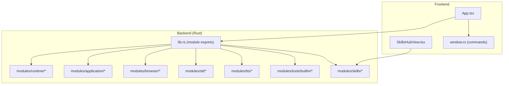
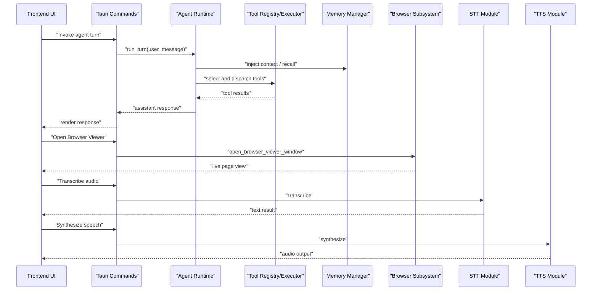
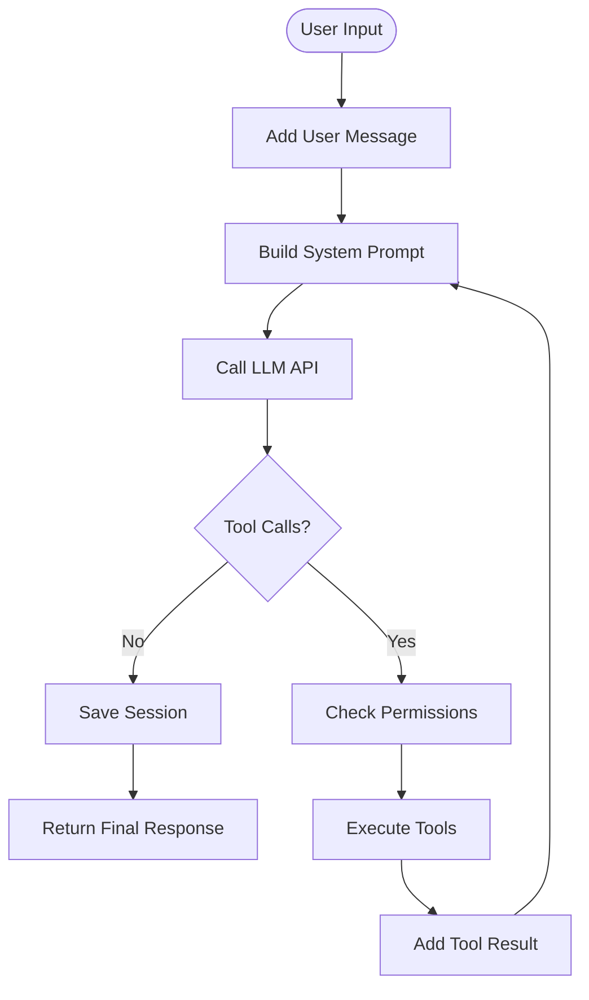
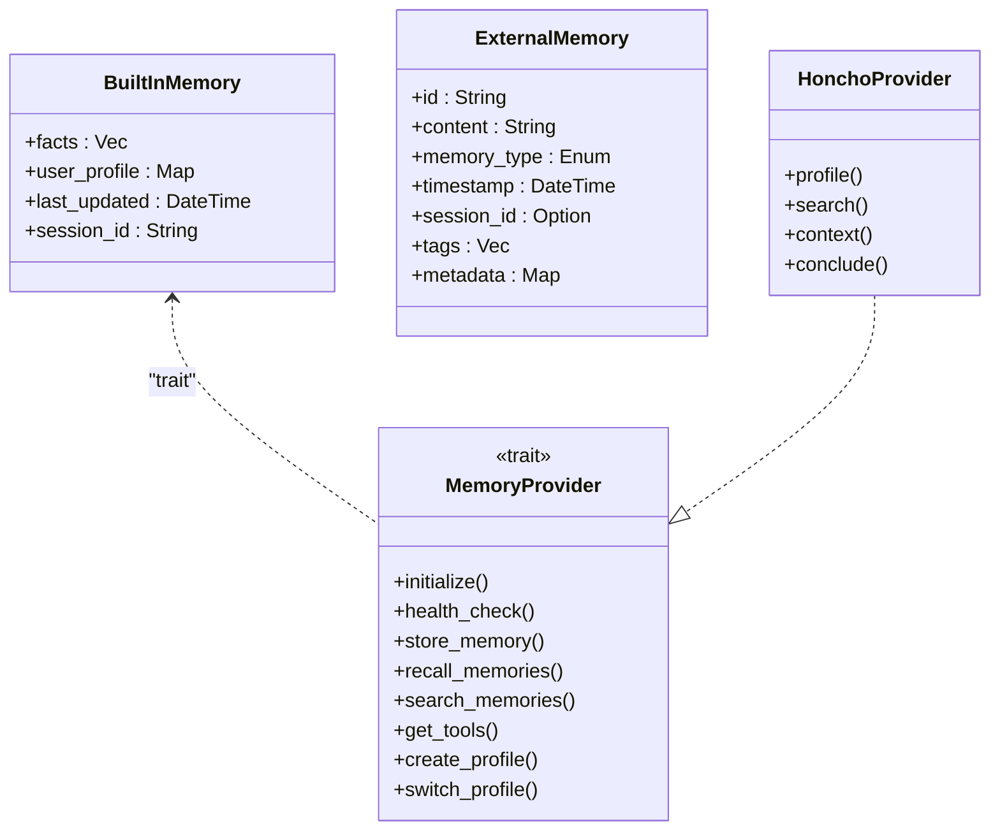
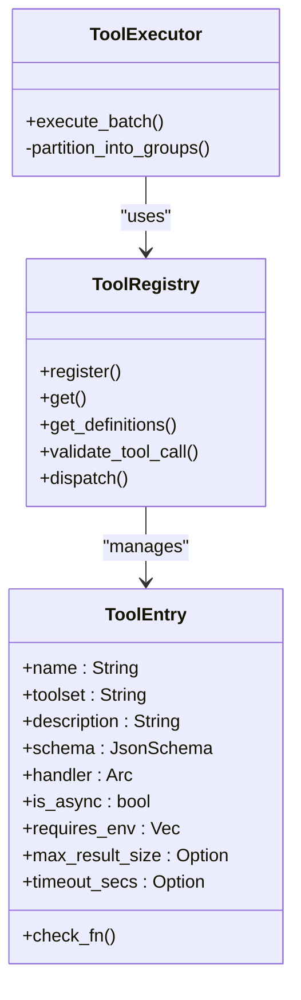
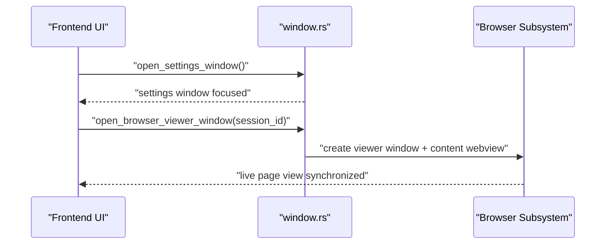
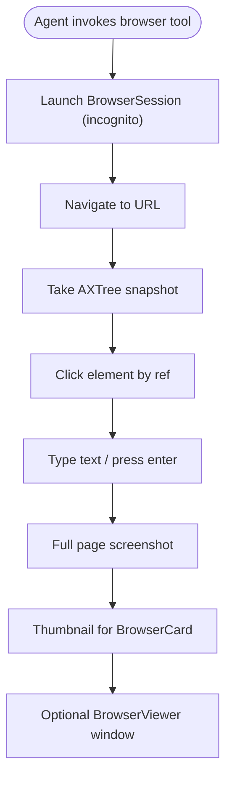
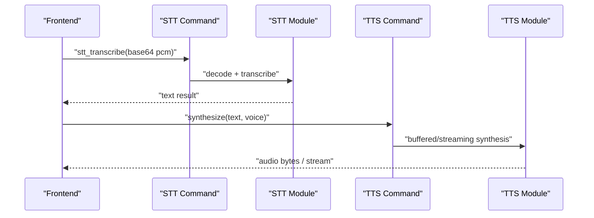
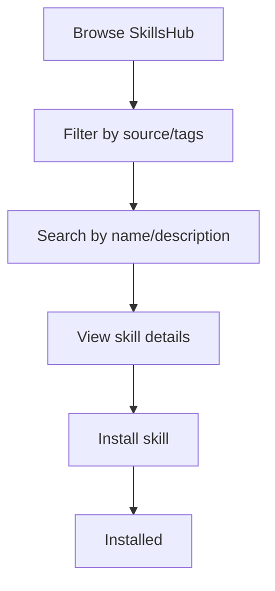
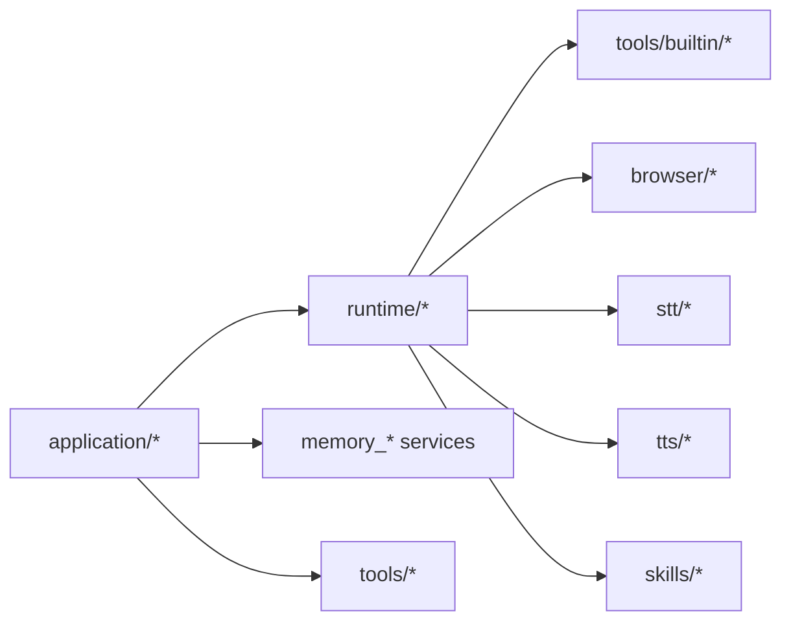

# Feature Highlights

<cite>
**Referenced Files in This Document**
- [DESIGN.md](file://DESIGN.md)
- [App.tsx](file://src/App.tsx)
- [lib.rs](file://src-tauri/src/lib.rs)
- [memory-system.md](file://docs/design-docs/memory-system.md)
- [tool-system.md](file://docs/design-docs/tool-system.md)
- [agent-loop.md](file://docs/design-docs/agent-loop.md)
- [browser-control-system.md](file://docs/design-docs/postCLI/browser-control-system.md)
- [mod.rs (browser)](file://src-tauri/src/modules/browser/mod.rs)
- [mod.rs (stt)](file://src-tauri/src/modules/stt/mod.rs)
- [mod.rs (tts)](file://src-tauri/src/modules/tts/mod.rs)
- [SkillsHubView.tsx](file://src/modules/skills/SkillsHubView.tsx)
- [mod.rs (skills)](file://src-tauri/src/modules/skills/mod.rs)
- [mod.rs (application)](file://src-tauri/src/modules/application/mod.rs)
- [window.rs](file://src-tauri/src/commands/window.rs)
- [mod.rs (runtime)](file://src-tauri/src/modules/runtime/mod.rs)
- [builtin/mod.rs](file://src-tauri/src/modules/tools/builtin/mod.rs)
</cite>

## Table of Contents
1. [Introduction](#introduction)
2. [Project Structure](#project-structure)
3. [Core Components](#core-components)
4. [Architecture Overview](#architecture-overview)
5. [Detailed Component Analysis](#detailed-component-analysis)
6. [Dependency Analysis](#dependency-analysis)
7. [Performance Considerations](#performance-considerations)
8. [Troubleshooting Guide](#troubleshooting-guide)
9. [Conclusion](#conclusion)
10. [Appendices](#appendices)

## Introduction
This document presents If2Ai’s feature highlights derived from the repository’s design documents and source modules. It focuses on the AI agent orchestration system with multi-turn conversation management and tool execution coordination, advanced memory management with vector-based semantic search and hierarchical organization, the extensible tool system with dynamic registration and parallel execution capabilities, the cross-platform desktop experience with native OS integration and window management, browser automation with headless and visible modes, speech processing with STT/TTS capabilities, and the skills hub for plugin marketplace. Practical examples, workflow demonstrations, and integration scenarios are included, along with performance characteristics and scalability considerations.

## Project Structure
If2Ai adopts a layered, modular architecture:
- Frontend (React + Tauri) handles UI surfaces, window management, and runtime projection.
- Backend (Rust) provides the agent runtime, tool system, memory coordination, browser control, STT/TTS, and skills management.
- Documentation drives design decisions and execution plans.

**Diagram sources**
- [App.tsx:1-120](file://src/App.tsx#L1-L120)
- [lib.rs:1-23](file://src-tauri/src/lib.rs#L1-L23)
- [mod.rs (runtime):1-38](file://src-tauri/src/modules/runtime/mod.rs#L1-L38)
- [mod.rs (application):1-117](file://src-tauri/src/modules/application/mod.rs#L1-L117)
- [mod.rs (browser):1-40](file://src-tauri/src/modules/browser/mod.rs#L1-L40)
- [mod.rs (stt):1-40](file://src-tauri/src/modules/stt/mod.rs#L1-L40)
- [mod.rs (tts):1-209](file://src-tauri/src/modules/tts/mod.rs#L1-L209)
- [builtin/mod.rs:1-131](file://src-tauri/src/modules/tools/builtin/mod.rs#L1-L131)
- [mod.rs (skills):1-22](file://src-tauri/src/modules/skills/mod.rs#L1-L22)
- [window.rs:1-303](file://src-tauri/src/commands/window.rs#L1-L303)

**Section sources**
- [DESIGN.md:37-138](file://DESIGN.md#L37-L138)
- [lib.rs:1-23](file://src-tauri/src/lib.rs#L1-L23)

## Core Components
- Agent Orchestration Engine: Implements multi-turn conversation loops, tool selection, and execution with permission gating and session persistence.
- Tool System: Dynamic registration, schema-based tool definitions, and executor with dependency-aware ordering.
- Memory Management: Built-in SQLite-backed memory plus external providers (e.g., Honcho) with scoped recall and write policies.
- Cross-Platform Desktop: Native window management, embedded browser viewer, and OS-integrated dialogs.
- Browser Automation: Headless Chromium control with DOM snapshots, screenshots, and a visible viewer window.
- Speech Processing: STT (OpenFlow) and TTS (MOSS-TTS-Nano) with streaming and voice cloning.
- Skills Hub: Multi-source marketplace UI for discovering, reviewing, and installing skills.

**Section sources**
- [agent-loop.md:11-94](file://docs/design-docs/agent-loop.md#L11-L94)
- [tool-system.md:33-158](file://docs/design-docs/tool-system.md#L33-L158)
- [memory-system.md:22-84](file://docs/design-docs/memory-system.md#L22-L84)
- [browser-control-system.md:11-81](file://docs/design-docs/postCLI/browser-control-system.md#L11-L81)
- [mod.rs (stt):1-40](file://src-tauri/src/modules/stt/mod.rs#L1-L40)
- [mod.rs (tts):1-209](file://src-tauri/src/modules/tts/mod.rs#L1-L209)
- [SkillsHubView.tsx:1-120](file://src/modules/skills/SkillsHubView.tsx#L1-L120)

## Architecture Overview
The system integrates a Rust-based runtime with a React frontend via Tauri. The runtime orchestrates agent turns, manages tool execution, coordinates memory, and exposes commands for UI and window management. The frontend provides chat surfaces, memory browser, skills hub, and browser viewer windows.

**Diagram sources**
- [agent-loop.md:138-221](file://docs/design-docs/agent-loop.md#L138-L221)
- [tool-system.md:329-368](file://docs/design-docs/tool-system.md#L329-L368)
- [memory-system.md:495-566](file://docs/design-docs/memory-system.md#L495-L566)
- [browser-control-system.md:40-81](file://docs/design-docs/postCLI/browser-control-system.md#L40-L81)
- [mod.rs (stt):15-24](file://src-tauri/src/modules/stt/mod.rs#L15-L24)
- [mod.rs (tts):11-24](file://src-tauri/src/modules/tts/mod.rs#L11-L24)
- [window.rs:41-160](file://src-tauri/src/commands/window.rs#L41-L160)

## Detailed Component Analysis

### Agent Orchestration System
- Multi-turn loop: Adds user messages, builds system prompts, calls LLM, parses tool calls, executes tools, and persists sessions.
- Permissions and approvals: Runtime projection bridge feeds canonical approval state to UI.
- Execution mode preview: Classifier preview informs UX without auto-routing the agent loop.

**Diagram sources**
- [agent-loop.md:138-221](file://docs/design-docs/agent-loop.md#L138-L221)

**Section sources**
- [agent-loop.md:11-94](file://docs/design-docs/agent-loop.md#L11-L94)
- [App.tsx:749-766](file://src/App.tsx#L749-L766)

### Advanced Memory Management
- Built-in memory: SQLite-backed facts and user profile with size limits and automatic compression.
- External providers: Honcho integration with dialectic Q&A, semantic search, and multi-agent user modeling.
- Scoped memory: session/project/global scopes with configurable write policies and promotion rules.
- Multi-provider coordination: registry pattern enabling dynamic activation and health checks.

**Diagram sources**
- [memory-system.md:109-183](file://docs/design-docs/memory-system.md#L109-L183)
- [memory-system.md:444-491](file://docs/design-docs/memory-system.md#L444-L491)

**Section sources**
- [memory-system.md:22-84](file://docs/design-docs/memory-system.md#L22-L84)
- [memory-system.md:495-566](file://docs/design-docs/memory-system.md#L495-L566)

### Extensible Tool System
- Dynamic registration: ToolRegistry holds entries with handlers, schemas, and constraints.
- Tool sets: Predefined categories (web, files, terminal, vision, browser, memory, code, delegation).
- Executor: Dependency-aware batching and parallel execution with safety checks (timeouts, sizes, environments).
- Built-in tools: Rich set including web search, file ops, terminal, browser control, memory tools, and skills.

**Diagram sources**
- [tool-system.md:63-158](file://docs/design-docs/tool-system.md#L63-L158)
- [tool-system.md:329-368](file://docs/design-docs/tool-system.md#L329-L368)

**Section sources**
- [tool-system.md:33-158](file://docs/design-docs/tool-system.md#L33-L158)
- [builtin/mod.rs:1-131](file://src-tauri/src/modules/tools/builtin/mod.rs#L1-L131)

### Cross-Platform Desktop Experience
- Window management: Commands to open settings, focus main window, and prefill prompts; BrowserViewer window with native child webview.
- Native OS integration: Overlay title bars, resizable windows, and platform-specific behaviors.
- Runtime projection: Canonical store for approvals and telemetry, bridged to UI surfaces.

**Diagram sources**
- [window.rs:244-303](file://src-tauri/src/commands/window.rs#L244-L303)
- [browser-control-system.md:3-23](file://docs/design-docs/postCLI/browser-control-system.md#L3-L23)

**Section sources**
- [window.rs:1-303](file://src-tauri/src/commands/window.rs#L1-L303)
- [App.tsx:749-766](file://src/App.tsx#L749-L766)

### Browser Automation
- Headless control: chromiumoxide engine for navigation, clicking, typing, screenshots, and DOM AXTree snapshots.
- Session isolation: Incognito contexts per session with persistent cold state.
- Visible viewer: Optional BrowserViewer window embedding a native WKWebView for live page inspection.

**Diagram sources**
- [browser-control-system.md:40-81](file://docs/design-docs/postCLI/browser-control-system.md#L40-L81)
- [mod.rs (browser):1-40](file://src-tauri/src/modules/browser/mod.rs#L1-L40)

**Section sources**
- [browser-control-system.md:11-81](file://docs/design-docs/postCLI/browser-control-system.md#L11-L81)
- [mod.rs (browser):1-40](file://src-tauri/src/modules/browser/mod.rs#L1-L40)

### Speech Processing (STT/TTS)
- STT: OpenFlow (SenseVoice ONNX) transcription with PCM16LE input, decoding, resampling, and inference.
- TTS: MOSS-TTS-Nano ONNX integration for multilingual synthesis, streaming audio output, voice cloning, and continuation modes.

**Diagram sources**
- [mod.rs (stt):15-24](file://src-tauri/src/modules/stt/mod.rs#L15-L24)
- [mod.rs (tts):11-24](file://src-tauri/src/modules/tts/mod.rs#L11-L24)

**Section sources**
- [mod.rs (stt):1-40](file://src-tauri/src/modules/stt/mod.rs#L1-L40)
- [mod.rs (tts):1-209](file://src-tauri/src/modules/tts/mod.rs#L1-L209)

### Skills Hub (Plugin Marketplace)
- Multi-source discovery: GitHub, skills.sh, ClawHub, marketplace, and builtin sources.
- Trust levels and filtering: Tags, badges, and source tabs for curated browsing.
- Install workflow: Search, review, and install skills with status indicators.

**Diagram sources**
- [SkillsHubView.tsx:44-120](file://src/modules/skills/SkillsHubView.tsx#L44-L120)

**Section sources**
- [SkillsHubView.tsx:1-425](file://src/modules/skills/SkillsHubView.tsx#L1-L425)
- [mod.rs (skills):1-22](file://src-tauri/src/modules/skills/mod.rs#L1-L22)

## Dependency Analysis
The backend modules are organized into clear boundaries:
- modules/runtime: conversation, session, prompt building, stream emitter, and related utilities.
- modules/application: higher-level orchestration services (provider resolution, prompt planner, turn service, memory injection, etc.).
- modules/browser: session registry, snapshot, events, and cold state.
- modules/stt/tts: providers and inference abstractions.
- modules/tools/builtin: tool definitions and handlers.
- modules/skills: discovery, management, and security scanning.

**Diagram sources**
- [mod.rs (application):1-117](file://src-tauri/src/modules/application/mod.rs#L1-L117)
- [mod.rs (runtime):1-38](file://src-tauri/src/modules/runtime/mod.rs#L1-L38)
- [builtin/mod.rs:1-131](file://src-tauri/src/modules/tools/builtin/mod.rs#L1-L131)
- [mod.rs (browser):1-40](file://src-tauri/src/modules/browser/mod.rs#L1-L40)
- [mod.rs (stt):1-40](file://src-tauri/src/modules/stt/mod.rs#L1-L40)
- [mod.rs (tts):1-209](file://src-tauri/src/modules/tts/mod.rs#L1-L209)
- [mod.rs (skills):1-22](file://src-tauri/src/modules/skills/mod.rs#L1-L22)

**Section sources**
- [DESIGN.md:37-138](file://DESIGN.md#L37-L138)
- [lib.rs:1-23](file://src-tauri/src/lib.rs#L1-L23)

## Performance Considerations
- Asynchronous I/O and structured logging are enforced across the backend to minimize blocking and improve observability.
- Tool execution includes timeouts, size limits, and environment checks to prevent resource exhaustion.
- Memory systems balance built-in SQLite with external providers, with caching and TTL to reduce latency.
- Browser automation uses headless Chromium with efficient snapshot and screenshot strategies.
- STT/TTS leverage ONNX inference with streaming synthesis and warmup routines to optimize latency.

[No sources needed since this section provides general guidance]

## Troubleshooting Guide
- Permission prompts: The runtime projection bridge feeds canonical approval state to the UI; ensure listeners are wired and approvals are resolved.
- Browser viewer: Verify Chrome/Chromium availability and that the viewer window bounds are recalculated on resize.
- Memory provider health: Use the provider registry’s health checks and logs to diagnose connectivity or configuration issues.
- Tool execution failures: Validate tool schemas, environment variables, and output size limits; inspect tool result parsing for structured memory store fields.

**Section sources**
- [App.tsx:256-275](file://src/App.tsx#L256-L275)
- [browser-control-system.md:287-308](file://docs/design-docs/postCLI/browser-control-system.md#L287-L308)
- [memory-system.md:444-491](file://docs/design-docs/memory-system.md#L444-L491)
- [tool-system.md:412-421](file://docs/design-docs/tool-system.md#L412-L421)

## Conclusion
If2Ai delivers a robust, extensible AI agent platform with strong orchestration, memory, tooling, desktop integration, browser automation, and speech capabilities. The layered architecture, documented design decisions, and modular backend enable scalable enhancements while maintaining clarity and testability.

[No sources needed since this section summarizes without analyzing specific files]

## Appendices

### Practical Examples and Workflows
- Multi-turn research: Agent uses web search and extraction tools iteratively, with memory injected into system prompts and session persisted.
- Browser automation: Agent navigates to a page, snapshots DOM, clicks actionable elements, and takes screenshots; optional BrowserViewer displays live page.
- Skills hub: User browses, filters, and installs skills; the system validates trust levels and manages installation state.
- Speech-enabled chat: Microphone input transcribed via STT, agent responds, synthesized speech delivered via TTS.

[No sources needed since this section provides general guidance]