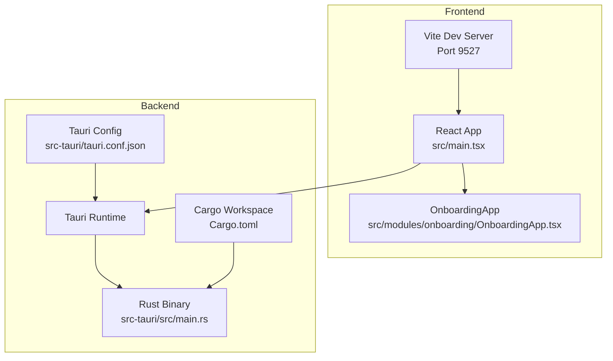
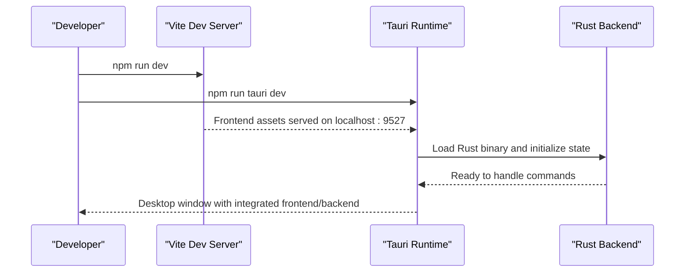
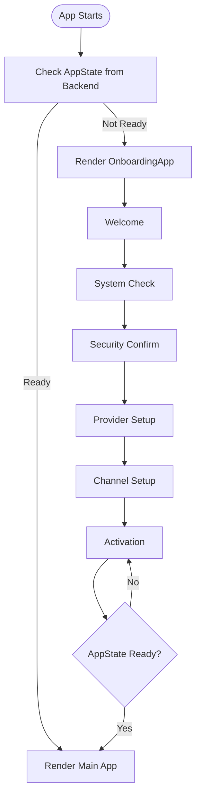
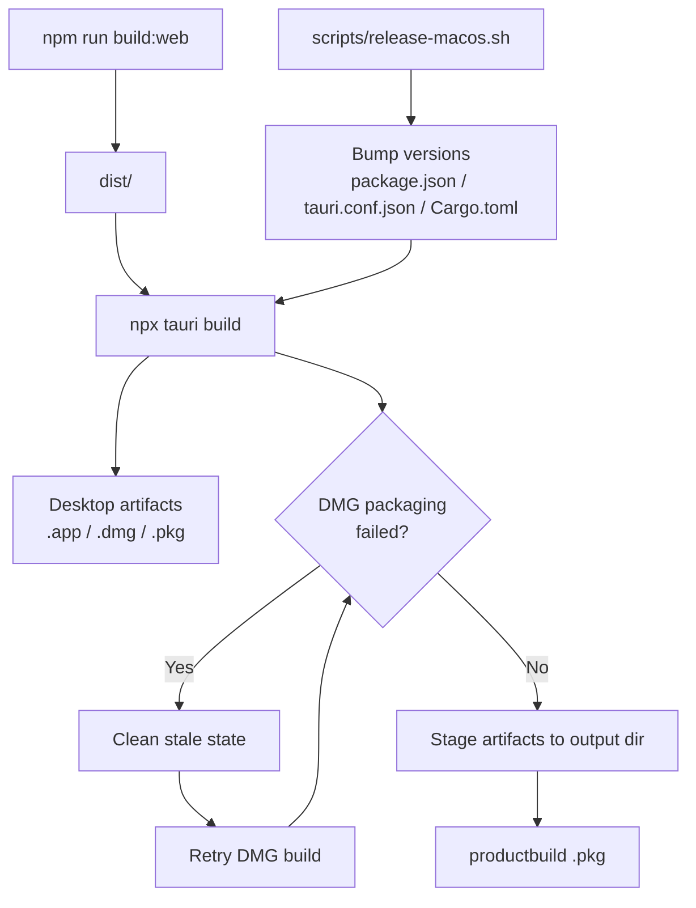

# Getting Started

<cite>
**Referenced Files in This Document**
- [package.json](file://package.json)
- [vite.config.ts](file://vite.config.ts)
- [tauri.conf.json](file://src-tauri/tauri.conf.json)
- [Cargo.toml](file://Cargo.toml)
- [src-tauri/Cargo.toml](file://src-tauri/Cargo.toml)
- [src-tauri/build.rs](file://src-tauri/build.rs)
- [src-tauri/Info.plist](file://src-tauri/Info.plist)
- [src/main.tsx](file://src/main.tsx)
- [src-tauri/src/main.rs](file://src-tauri/src/main.rs)
- [src/modules/onboarding/OnboardingApp.tsx](file://src/modules/onboarding/OnboardingApp.tsx)
- [scripts/release-macos.sh](file://scripts/release-macos.sh)
- [QUICKSTART.md](file://QUICKSTART.md)
- [DEVELOPER_GUIDE.md](file://DEVELOPER_GUIDE.md)
- [DESIGN.md](file://DESIGN.md)
</cite>

## Table of Contents
1. [Introduction](#introduction)
2. [Project Structure](#project-structure)
3. [Prerequisites and Platform Setup](#prerequisites-and-platform-setup)
4. [Installation Steps](#installation-steps)
5. [Development Workflow](#development-workflow)
6. [First-Time User Onboarding](#first-time-user-onboarding)
7. [Verification Checklist](#verification-checklist)
8. [Build and Distribution](#build-and-distribution)
9. [Troubleshooting](#troubleshooting)
10. [Conclusion](#conclusion)

## Introduction
This guide helps you set up the If2Ai desktop application for development and first-time user onboarding. It covers prerequisites, environment setup per platform, installation steps, development server launch, verification, and both development and production build processes.

## Project Structure
If2Ai is a Tauri desktop application with a React/TypeScript frontend and a Rust backend. The frontend is built with Vite and TailwindCSS, while the backend is organized under src-tauri with a Cargo workspace.

**Diagram sources**
- [vite.config.ts:12-34](file://vite.config.ts#L12-L34)
- [src/main.tsx:16-43](file://src/main.tsx#L16-L43)
- [src/modules/onboarding/OnboardingApp.tsx:156-211](file://src/modules/onboarding/OnboardingApp.tsx#L156-L211)
- [src-tauri/src/main.rs:406-800](file://src-tauri/src/main.rs#L406-L800)
- [Cargo.toml:1-48](file://Cargo.toml#L1-L48)
- [tauri.conf.json:5-10](file://src-tauri/tauri.conf.json#L5-L10)

**Section sources**
- [vite.config.ts:12-34](file://vite.config.ts#L12-L34)
- [src/main.tsx:16-43](file://src/main.tsx#L16-L43)
- [src-tauri/src/main.rs:406-800](file://src-tauri/src/main.rs#L406-L800)
- [tauri.conf.json:5-10](file://src-tauri/tauri.conf.json#L5-L10)
- [Cargo.toml:1-48](file://Cargo.toml#L1-L48)

## Prerequisites and Platform Setup
- Node.js: >= 18.x
- Rust: >= 1.70 (Rust 1.60+ requirement noted; 1.70+ recommended)
- Tauri environment per platform:
  - Windows: MSVC toolchain (required for building native components)
  - macOS: Xcode Command Line Tools (CLT) and Xcode
  - Linux: build-essential, libwebkit2gtk-4.0-dev, libappindicator3-1.0, libsecret-1-dev, librsvg2-dev

Notes:
- The macOS Info.plist declares microphone and camera usage descriptions required for STT and WebView features.
- The release script enforces a minimum macOS deployment target suitable for native dependencies.

**Section sources**
- [src-tauri/Info.plist:5-11](file://src-tauri/Info.plist#L5-L11)
- [scripts/release-macos.sh:32](file://scripts/release-macos.sh#L32)

## Installation Steps
1. Clone the repository and enter the project directory.
2. Install Node.js dependencies:
   - Run: npm install
3. Build the Rust backend:
   - From repo root: cargo build
   - From src-tauri/: cargo build
4. Launch the development server:
   - Frontend dev server: npm run dev (Vite on port 9527)
   - Tauri dev: npm run tauri dev (launches the desktop app with hot reload)

Key configuration points:
- Vite dev server port is configured to 9527.
- Tauri build configuration specifies beforeDevCommand and devUrl.
- Frontend dist output is directed to ../dist.

**Section sources**
- [package.json:6-16](file://package.json#L6-L16)
- [vite.config.ts:22-24](file://vite.config.ts#L22-L24)
- [tauri.conf.json:7-8](file://src-tauri/tauri.conf.json#L7-L8)
- [tauri.conf.json:9](file://src-tauri/tauri.conf.json#L9)

## Development Workflow
- Frontend development:
  - Edit files under src/.
  - Vite serves on http://localhost:9527 and proxies Tauri commands.
- Backend development:
  - Edit Rust code under src-tauri/src/.
  - Use cargo build or cargo run for iterative testing.
- Tauri integration:
  - Commands are registered in src-tauri/src/main.rs and invoked from the frontend.
  - The frontend entry (src/main.tsx) renders either the main app, settings, or browser viewer based on URL parameters.

**Diagram sources**
- [package.json:7](file://package.json#L7)
- [vite.config.ts:22-24](file://vite.config.ts#L22-L24)
- [src-tauri/src/main.rs:406-800](file://src-tauri/src/main.rs#L406-L800)

**Section sources**
- [src/main.tsx:16-43](file://src/main.tsx#L16-L43)
- [src-tauri/src/main.rs:406-800](file://src-tauri/src/main.rs#L406-L800)

## First-Time User Onboarding
The first-time user experience is driven by the OnboardingApp component. It orchestrates six steps: welcome, system check, security confirmation, provider setup, channel setup, and activation. The component conditionally renders based on backend state and coordinates navigation between steps.

**Diagram sources**
- [src/modules/onboarding/OnboardingApp.tsx:156-211](file://src/modules/onboarding/OnboardingApp.tsx#L156-L211)

**Section sources**
- [src/modules/onboarding/OnboardingApp.tsx:156-211](file://src/modules/onboarding/OnboardingApp.tsx#L156-L211)

## Verification Checklist
- Environment:
  - Node.js >= 18.x and npm install succeed.
  - Rust >= 1.70 and cargo build succeeds for both workspace and src-tauri.
- Development server:
  - Vite dev server starts on port 9527.
  - Tauri dev launches the desktop window.
- Frontend:
  - src/main.tsx renders the intended window type based on URL params.
- Backend:
  - src-tauri/src/main.rs initializes state and registers commands.
- Onboarding:
  - OnboardingApp renders and progresses through steps until Ready state.

**Section sources**
- [package.json:6-16](file://package.json#L6-L16)
- [vite.config.ts:22-24](file://vite.config.ts#L22-L24)
- [src-tauri/src/main.rs:406-800](file://src-tauri/src/main.rs#L406-L800)
- [src/main.tsx:16-43](file://src/main.tsx#L16-L43)
- [src/modules/onboarding/OnboardingApp.tsx:156-211](file://src/modules/onboarding/OnboardingApp.tsx#L156-L211)

## Build and Distribution
- Development build:
  - Frontend: npm run build:web
  - Desktop: npm run build (Tauri build)
- Production build (macOS example):
  - The release script automates version bumping across package.json, tauri.conf.json, and Cargo.toml, then builds .app, .dmg, and .pkg artifacts. It enforces a minimum macOS deployment target and retries DMG packaging if needed.

**Diagram sources**
- [package.json:8](file://package.json#L8)
- [package.json:9](file://package.json#L9)
- [scripts/release-macos.sh:105-133](file://scripts/release-macos.sh#L105-L133)
- [scripts/release-macos.sh:111-126](file://scripts/release-macos.sh#L111-L126)
- [scripts/release-macos.sh:135-145](file://scripts/release-macos.sh#L135-L145)

**Section sources**
- [package.json:8](file://package.json#L8)
- [package.json:9](file://package.json#L9)
- [scripts/release-macos.sh:105-145](file://scripts/release-macos.sh#L105-L145)

## Troubleshooting
Common issues and resolutions:
- Rust toolchain mismatch:
  - Ensure rustc --version >= 1.70 and cargo build succeeds.
- Node.js version mismatch:
  - Verify node --version >= 18.x and npm install completes without peer dependency errors.
- Tauri build failures:
  - Check tauri.conf.json validity and rebuild after cleaning src-tauri/target.
- Frontend not loading in Tauri:
  - Confirm devUrl in tauri.conf.json matches Vite’s server port (9527).
- macOS permissions:
  - The app requires microphone usage description; ensure Info.plist is included and not stripped by bundling.
- Onboarding stuck:
  - Confirm backend AppState transitions to Ready and OnboardingApp invokes completion callbacks.

**Section sources**
- [tauri.conf.json:7-8](file://src-tauri/tauri.conf.json#L7-L8)
- [src-tauri/Info.plist:5-11](file://src-tauri/Info.plist#L5-L11)
- [src/modules/onboarding/OnboardingApp.tsx:172-178](file://src/modules/onboarding/OnboardingApp.tsx#L172-L178)

## Conclusion
You now have a complete guide to set up If2Ai for development, launch the integrated desktop app, onboard first-time users, and build for production. Follow the platform-specific prerequisites, use the provided scripts and configurations, and leverage the verification checklist to ensure a smooth development experience.