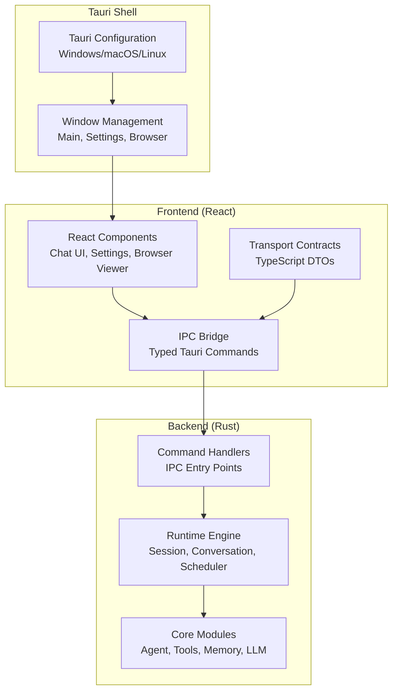
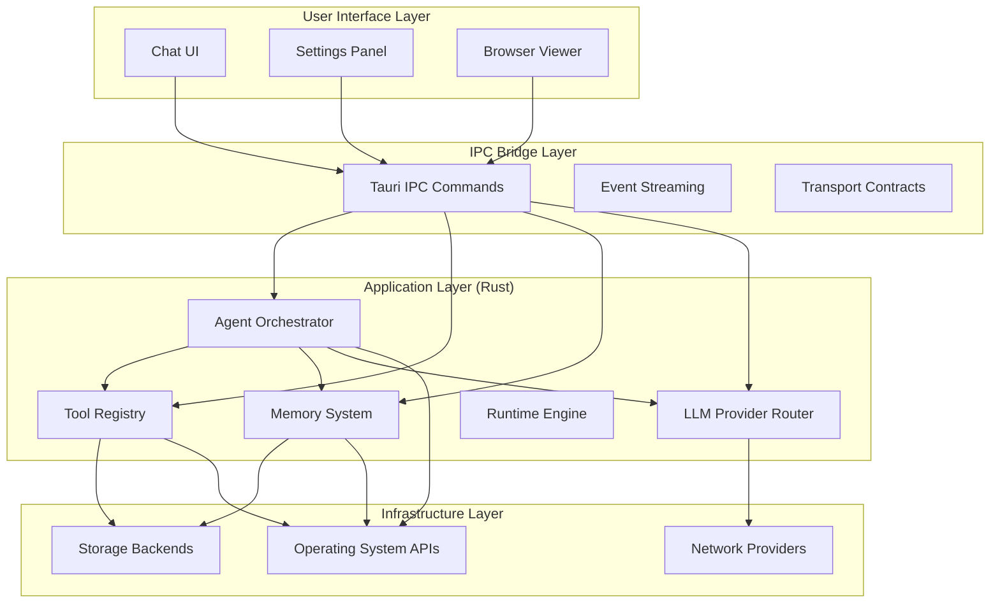
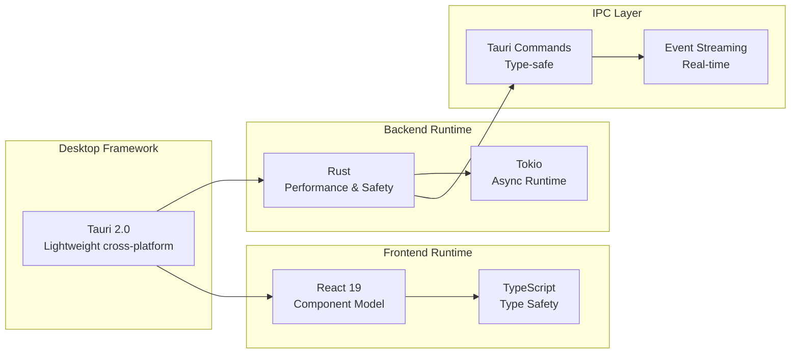
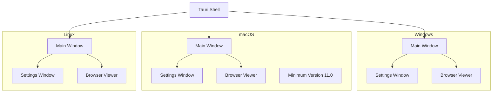
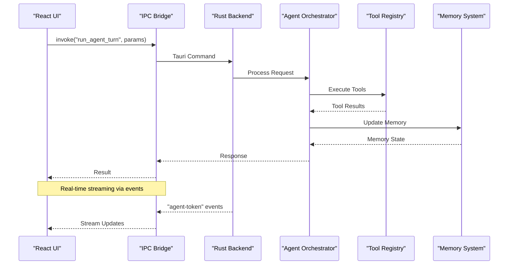
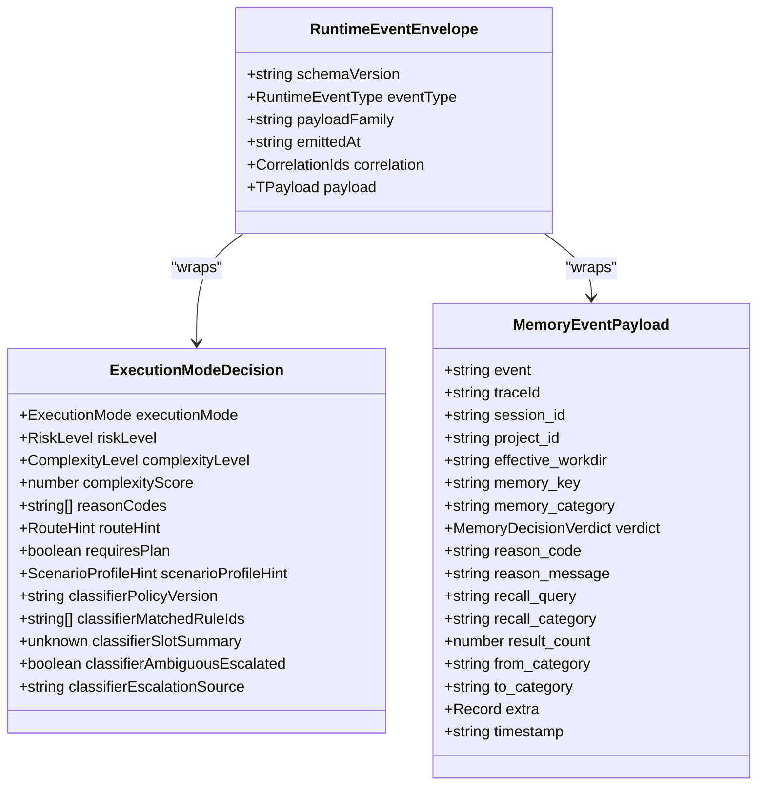
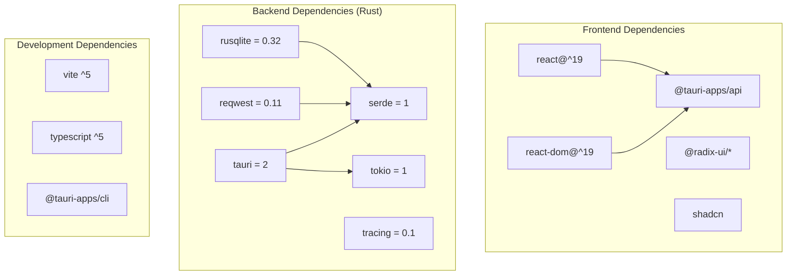

# Project Overview

<cite>
**Referenced Files in This Document**
- [README.md](file://README.md)
- [DESIGN.md](file://DESIGN.md)
- [ARCHITECTURE.md](file://ARCHITECTURE.md)
- [IMPLEMENTATION_PLAN.md](file://IMPLEMENTATION_PLAN.md)
- [src-tauri/tauri.conf.json](file://src-tauri/tauri.conf.json)
- [src-tauri/Cargo.toml](file://src-tauri/Cargo.toml)
- [package.json](file://package.json)
- [src-tauri/src/lib.rs](file://src-tauri/src/lib.rs)
- [src-tauri/src/main.rs](file://src-tauri/src/main.rs)
- [src/main.tsx](file://src/main.tsx)
- [src/App.tsx](file://src/App.tsx)
- [src/lib/tauri.ts](file://src/lib/tauri.ts)
- [src/transport/contracts.ts](file://src/transport/contracts.ts)
</cite>

## Table of Contents
1. [Introduction](#introduction)
2. [Project Structure](#project-structure)
3. [Core Components](#core-components)
4. [Architecture Overview](#architecture-overview)
5. [Detailed Component Analysis](#detailed-component-analysis)
6. [Dependency Analysis](#dependency-analysis)
7. [Performance Considerations](#performance-considerations)
8. [Troubleshooting Guide](#troubleshooting-guide)
9. [Conclusion](#conclusion)

## Introduction
If2Ai is a cross-platform desktop AI assistant built with Tauri + Rust + React. Its mission is to bridge AI agent technologies with practical desktop application needs by delivering a modern, secure, and extensible desktop environment for AI-powered workflows. The project emphasizes agent-first engineering, observability, composability, and structured testing to enable reliable, transparent, and self-improving AI systems.

Key value propositions:
- Agent-first engineering with a robust orchestration framework and modular tool system
- Cross-platform desktop deployment with Tauri for native performance and security
- Structured runtime contracts and canonical event models for predictable IPC and UI projections
- Comprehensive memory and learning infrastructure for autonomous knowledge management
- Extensible provider and plugin architecture for integrating diverse LLMs, tools, and services

Target audience:
- Power users and professionals who need a capable desktop agent for research, automation, and productivity
- Developers building AI-powered workflows and integrations
- Organizations seeking a secure, auditable, and extensible desktop AI platform

Key differentiators:
- Unified, agent-centric architecture with canonical runtime contracts
- First-class memory and learning infrastructure with governance and quality gates
- Strong separation of concerns with structured IPC and runtime projection
- Extensive harness framework for testing, evaluation, and self-improvement

## Project Structure
The project follows a hybrid monorepo structure with clear separation between frontend React components, Rust backend services, and Tauri IPC communication:

**Diagram sources**
- [src-tauri/tauri.conf.json:1-57](file://src-tauri/tauri.conf.json#L1-L57)
- [src-tauri/src/lib.rs:1-23](file://src-tauri/src/lib.rs#L1-L23)
- [src-tauri/src/main.rs:1-800](file://src-tauri/src/main.rs#L1-L800)

**Section sources**
- [README.md:24-46](file://README.md#L24-L46)
- [src-tauri/tauri.conf.json:1-57](file://src-tauri/tauri.conf.json#L1-L57)

## Core Components
The system is composed of several interconnected layers that work together to deliver a seamless AI desktop experience:

### Frontend Layer (React)
- React-based UI with TypeScript for type safety
- Modular component architecture with clear separation of concerns
- Window management for main, settings, and browser viewer interfaces
- Transport contracts defining canonical event schemas and DTOs

### Backend Layer (Rust)
- Agent orchestration engine managing conversation loops and tool execution
- Modular service architecture with providers for LLMs, memory, and tools
- Runtime management for sessions, conversations, and scheduling
- Comprehensive IPC command handlers bridging frontend and backend

### IPC Communication Layer
- Typed Tauri commands for structured communication
- Canonical event contracts ensuring consistent data exchange
- Event streaming for real-time updates (tokens, permissions, memory events)

**Section sources**
- [src-tauri/src/lib.rs:1-23](file://src-tauri/src/lib.rs#L1-L23)
- [src-tauri/src/main.rs:1-800](file://src-tauri/src/main.rs#L1-L800)
- [src/lib/tauri.ts:1-800](file://src/lib/tauri.ts#L1-L800)
- [src/transport/contracts.ts:1-539](file://src/transport/contracts.ts#L1-L539)

## Architecture Overview
The architecture follows a strict layering principle with clear boundaries and unidirectional data flow:

**Diagram sources**
- [ARCHITECTURE.md:5-32](file://ARCHITECTURE.md#L5-L32)
- [src-tauri/src/main.rs:1-800](file://src-tauri/src/main.rs#L1-L800)
- [src/lib/tauri.ts:1-800](file://src/lib/tauri.ts#L1-L800)

The architecture enforces:
- Strict layering with unidirectional dependencies
- Provider injection pattern for external dependencies
- Canonical event contracts for IPC consistency
- Asynchronous processing with Tokio runtime

**Section sources**
- [ARCHITECTURE.md:195-254](file://ARCHITECTURE.md#L195-L254)
- [DESIGN.md:37-138](file://DESIGN.md#L37-L138)

## Detailed Component Analysis

### Technology Stack Rationale
The stack selection prioritizes performance, security, and maintainability:

**Diagram sources**
- [README.md:15-23](file://README.md#L15-L23)
- [src-tauri/Cargo.toml:1-161](file://src-tauri/Cargo.toml#L1-L161)
- [package.json:1-85](file://package.json#L1-L85)

Key technical decisions:
- Tauri provides native performance with web technologies
- Rust ensures memory safety and high performance
- React with TypeScript enables maintainable UI development
- Canonical contracts guarantee IPC reliability

**Section sources**
- [README.md:15-23](file://README.md#L15-L23)
- [src-tauri/Cargo.toml:1-161](file://src-tauri/Cargo.toml#L1-L161)
- [package.json:1-85](file://package.json#L1-L85)

### Platform Support
The application supports Windows, macOS, and Linux through Tauri's cross-platform capabilities:

**Diagram sources**
- [src-tauri/tauri.conf.json:12-54](file://src-tauri/tauri.conf.json#L12-L54)

Platform-specific configurations include:
- Windows: Native window management and system integration
- macOS: Minimum system version 11.0 with proper Info.plist configuration
- Linux: Standard window management and build toolchain requirements

**Section sources**
- [src-tauri/tauri.conf.json:1-57](file://src-tauri/tauri.conf.json#L1-L57)

### IPC Communication Flow
The IPC system provides structured communication between frontend and backend:

**Diagram sources**
- [src/lib/tauri.ts:200-320](file://src/lib/tauri.ts#L200-L320)
- [src-tauri/src/main.rs:178-189](file://src-tauri/src/main.rs#L178-L189)

**Section sources**
- [src/lib/tauri.ts:1-800](file://src/lib/tauri.ts#L1-L800)
- [src-tauri/src/main.rs:1-800](file://src-tauri/src/main.rs#L1-L800)

### Runtime Contracts and Event Model
The system uses canonical contracts to ensure consistent data exchange:

**Diagram sources**
- [src/transport/contracts.ts:61-73](file://src/transport/contracts.ts#L61-L73)
- [src/transport/contracts.ts:203-218](file://src/transport/contracts.ts#L203-L218)
- [src/transport/contracts.ts:290-327](file://src/transport/contracts.ts#L290-L327)

**Section sources**
- [src/transport/contracts.ts:1-539](file://src/transport/contracts.ts#L1-L539)

## Dependency Analysis
The project maintains strict dependency management through Rust's module system and Tauri's plugin architecture:

**Diagram sources**
- [package.json:27-83](file://package.json#L27-L83)
- [src-tauri/Cargo.toml:8-95](file://src-tauri/Cargo.toml#L8-L95)

**Section sources**
- [package.json:1-85](file://package.json#L1-L85)
- [src-tauri/Cargo.toml:1-161](file://src-tauri/Cargo.toml#L1-L161)

## Performance Considerations
The architecture is designed for optimal performance through several key mechanisms:

- **Asynchronous Processing**: All I/O operations use async/await with Tokio runtime
- **Parallel Tool Execution**: Up to 8 tools can execute concurrently
- **Efficient Memory Management**: Dual-layer memory system with SQLite and optional vector databases
- **Streaming Responses**: Real-time token streaming reduces perceived latency
- **Context Compression**: Automatic context management prevents token overflow

## Troubleshooting Guide
Common issues and their solutions:

### Development Environment Setup
- Ensure Node.js 18+ and Rust 1.60+ are installed
- Install platform-specific Tauri dependencies (Xcode for macOS, MSVC for Windows, build tools for Linux)
- Verify Tauri CLI installation with `npm install --save-dev @tauri-apps/cli`

### Build Issues
- Clean Rust dependencies: `cargo clean`
- Update Cargo.lock: `cargo update`
- Clear node_modules: `rm -rf node_modules && npm install`

### Runtime Problems
- Check backend logs in `~/.if2ai/log/backend.log`
- Verify IPC command registration in `src-tauri/src/main.rs`
- Monitor memory provider initialization failures

**Section sources**
- [README.md:50-82](file://README.md#L50-L82)
- [src-tauri/src/main.rs:406-466](file://src-tauri/src/main.rs#L406-L466)

## Conclusion
If2Ai represents a sophisticated approach to bringing AI agent technologies into practical desktop applications. By combining Tauri's native performance with Rust's safety guarantees and React's developer experience, the project delivers a robust foundation for AI-powered workflows. The agent-first engineering philosophy, combined with comprehensive observability and structured testing frameworks, positions If2Ai as a platform for building reliable, transparent, and self-improving AI systems.

The project's evolution from initial concept to current implementation demonstrates a clear commitment to architectural principles, with ongoing improvements to memory systems, tool registries, and runtime orchestration. The canonical contract system and strict layering ensure maintainability and extensibility for future enhancements.