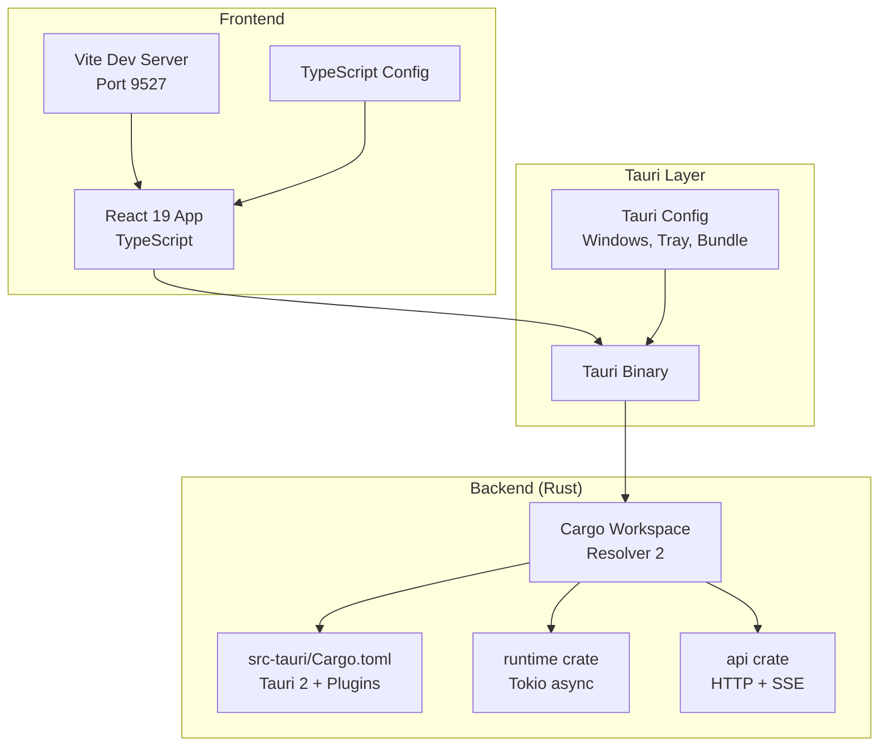
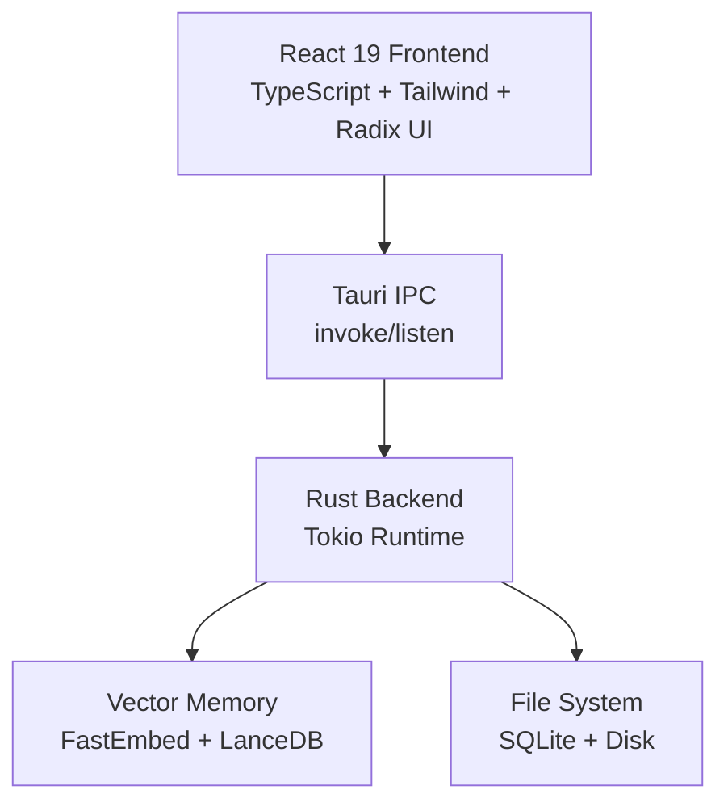
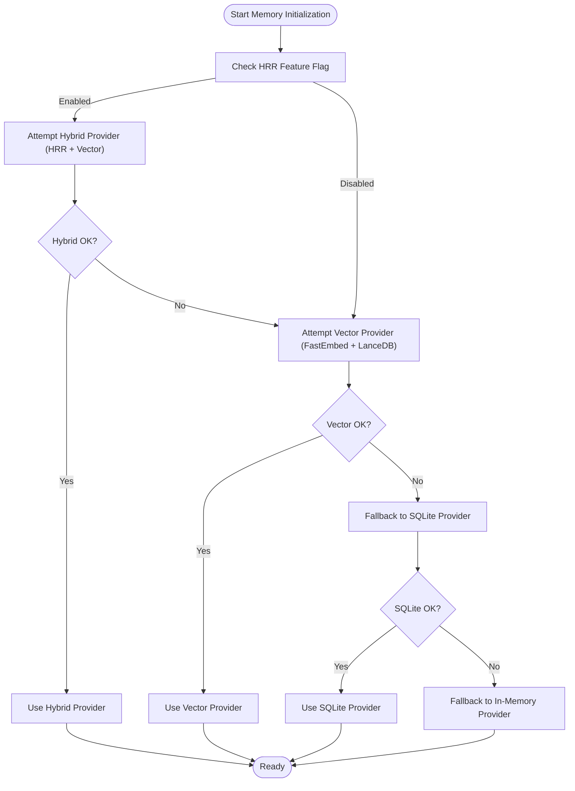
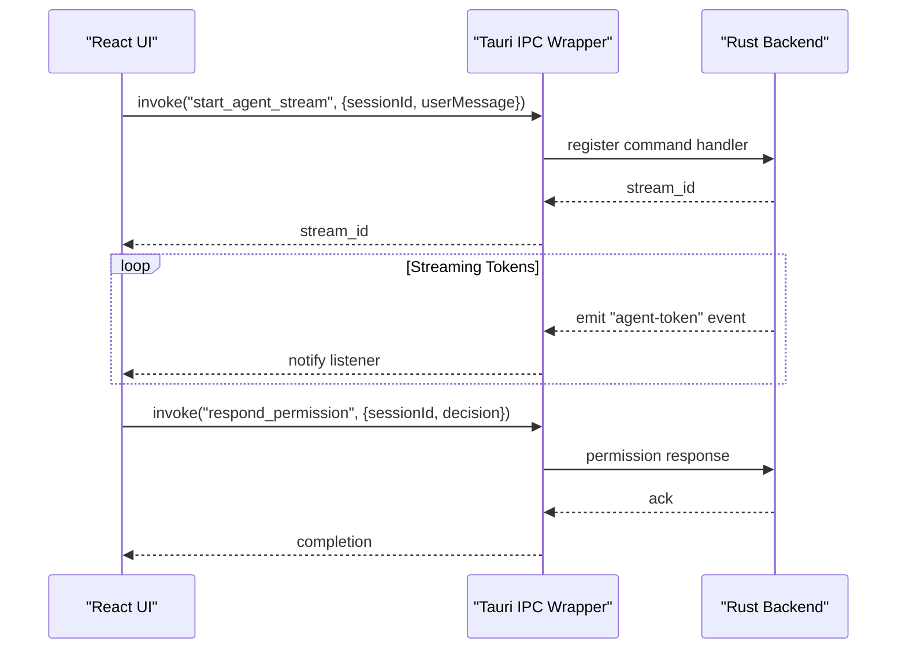
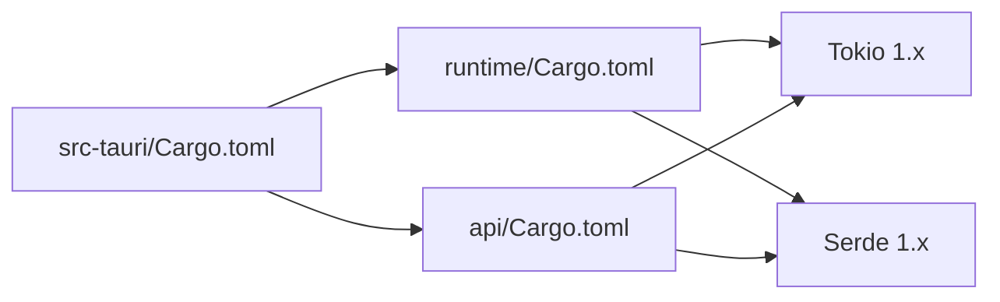

# Technology Stack

<cite>
**Referenced Files in This Document**
- [package.json](file://package.json)
- [vite.config.ts](file://vite.config.ts)
- [tsconfig.json](file://tsconfig.json)
- [src/main.tsx](file://src/main.tsx)
- [src/App.tsx](file://src/App.tsx)
- [src/lib/tauri.ts](file://src/lib/tauri.ts)
- [src-tauri/tauri.conf.json](file://src-tauri/tauri.conf.json)
- [src-tauri/src/main.rs](file://src-tauri/src/main.rs)
- [src-tauri/Cargo.toml](file://src-tauri/Cargo.toml)
- [Cargo.toml](file://Cargo.toml)
- [rust/crates/api/Cargo.toml](file://rust/crates/api/Cargo.toml)
- [rust/crates/runtime/Cargo.toml](file://rust/crates/runtime/Cargo.toml)
</cite>

## Table of Contents
1. [Introduction](#introduction)
2. [Project Structure](#project-structure)
3. [Core Components](#core-components)
4. [Architecture Overview](#architecture-overview)
5. [Detailed Component Analysis](#detailed-component-analysis)
6. [Dependency Analysis](#dependency-analysis)
7. [Performance Considerations](#performance-considerations)
8. [Troubleshooting Guide](#troubleshooting-guide)
9. [Conclusion](#conclusion)

## Introduction
This document describes the complete technology stack powering If2Ai, a cross-platform desktop application built on Tauri 2.0. It covers the frontend (React 19 with TypeScript), backend (Rust with Tokio async runtime), and supporting libraries, along with integration patterns, version requirements, performance characteristics, and deployment considerations. The stack emphasizes fast startup, efficient resource usage, and robust asynchronous processing for AI agent workflows, vector memory, and tool execution.

## Project Structure
The project follows a hybrid structure:
- Frontend: React 19 application built with Vite and TypeScript, packaged into dist/ for Tauri bundling.
- Backend: Rust workspace with Tauri 2.0, organized into crates for API clients, runtime orchestration, tools, and server components.
- Tauri integration: tauri.conf.json defines build, bundling, and window configuration; Vite serves the frontend during development and builds static assets for production.

**Diagram sources**
- [vite.config.ts:12-34](file://vite.config.ts#L12-L34)
- [src-tauri/tauri.conf.json:5-10](file://src-tauri/tauri.conf.json#L5-L10)
- [Cargo.toml:1-48](file://Cargo.toml#L1-L48)
- [src-tauri/Cargo.toml:8-161](file://src-tauri/Cargo.toml#L8-L161)

**Section sources**
- [package.json:6-16](file://package.json#L6-L16)
- [vite.config.ts:12-34](file://vite.config.ts#L12-L34)
- [src-tauri/tauri.conf.json:5-10](file://src-tauri/tauri.conf.json#L5-L10)
- [Cargo.toml:1-48](file://Cargo.toml#L1-L48)

## Core Components
- Cross-platform desktop framework: Tauri 2.0 with window management, tray icon, and secure IPC.
- Backend runtime: Rust with Tokio async runtime for concurrency, HTTP clients, SSE parsing, and vector memory operations.
- Frontend framework: React 19 with TypeScript, styled via Tailwind CSS and UI primitives from Radix UI.
- Vector and embedding: FastEmbed for embeddings and LanceDB for vector storage.
- Build and tooling: Vite for dev/build, TypeScript compiler, and Tauri CLI for packaging.

**Section sources**
- [src-tauri/Cargo.toml:9-13](file://src-tauri/Cargo.toml#L9-L13)
- [package.json:27-83](file://package.json#L27-L83)
- [src-tauri/src/main.rs:228-236](file://src-tauri/src/main.rs#L228-L236)

## Architecture Overview
The application architecture separates concerns across layers:
- Frontend (React 19) communicates with the backend via Tauri IPC commands and event streams.
- Backend (Rust) orchestrates agent conversations, tool execution, memory operations, and integrates vector memory.
- Tauri bridges the web runtime and native OS capabilities, enabling secure, fast desktop apps.

**Diagram sources**
- [src/App.tsx:1-800](file://src/App.tsx#L1-L800)
- [src/lib/tauri.ts:14-34](file://src/lib/tauri.ts#L14-L34)
- [src-tauri/src/main.rs:250-327](file://src-tauri/src/main.rs#L250-L327)

**Section sources**
- [src/App.tsx:1-800](file://src/App.tsx#L1-L800)
- [src/lib/tauri.ts:14-34](file://src/lib/tauri.ts#L14-L34)
- [src-tauri/src/main.rs:250-327](file://src-tauri/src/main.rs#L250-L327)

## Detailed Component Analysis

### Frontend Technologies
- React 19: Component-driven UI with hooks and concurrent features.
- TypeScript: Strict typing for IPC contracts and UI logic.
- Vite: Fast dev server (port 9527), build pipeline, and asset handling.
- Tailwind CSS: Utility-first styling with Tailwind 4.
- Radix UI: Accessible UI primitives for dialogs, tooltips, selects, and more.
- Additional libraries: React Router-like routing via Tauri window types, Sonner for notifications, shadcn for component composition, and CodeMirror for editor experiences.

Integration patterns:
- Frontend initializes window routes based on URL parameters and renders themed providers.
- IPC calls are centralized in a typed wrapper module that exposes strongly-typed functions for invoking backend commands and listening to events.

**Section sources**
- [package.json:27-83](file://package.json#L27-L83)
- [vite.config.ts:12-34](file://vite.config.ts#L12-L34)
- [tsconfig.json:1-38](file://tsconfig.json#L1-L38)
- [src/main.tsx:16-43](file://src/main.tsx#L16-L43)
- [src/lib/tauri.ts:14-34](file://src/lib/tauri.ts#L14-L34)

### Backend Technologies (Rust + Tokio)
- Tauri 2.0: Desktop framework with secure command registration and event emission.
- Tokio: Async runtime for network I/O, SSE parsing, and background tasks.
- FastEmbed: Embedding generation for vector memory.
- LanceDB: Vector database for similarity search and retrieval.
- reqwest: HTTP client with JSON and streaming support.
- SQLite: Local persistence for sessions, memory, and tool registries.
- serde/json: Serialization/deserialization for IPC and configuration.

Key backend initialization highlights:
- Memory provider selection prioritizes hybrid/vector providers with FastEmbed + LanceDB, falling back to SQLite and in-memory providers.
- JobRunner and background schedulers enable asynchronous memory operations.
- Logging configured via tracing with rolling file appender.

**Section sources**
- [src-tauri/Cargo.toml:9-161](file://src-tauri/Cargo.toml#L9-L161)
- [src-tauri/src/main.rs:250-327](file://src-tauri/src/main.rs#L250-L327)
- [src-tauri/src/main.rs:406-484](file://src-tauri/src/main.rs#L406-L484)

### Vector Memory and Embeddings
- FastEmbed: Efficient sentence transformers for generating dense vectors.
- LanceDB: Columnar vector storage with optimized ANN search.
- Dual-write strategy: Writes to both vector store and SQLite to preserve scoping metadata and enable robust recall across scopes.

**Diagram sources**
- [src-tauri/src/main.rs:250-327](file://src-tauri/src/main.rs#L250-L327)

**Section sources**
- [src-tauri/src/main.rs:250-327](file://src-tauri/src/main.rs#L250-L327)

### IPC and Event Flow (Frontend ↔ Backend)
The frontend invokes backend commands and listens to events for streaming tokens, permissions, and memory updates.

**Diagram sources**
- [src/lib/tauri.ts:221-265](file://src/lib/tauri.ts#L221-L265)
- [src/App.tsx:103-197](file://src/App.tsx#L103-L197)

**Section sources**
- [src/lib/tauri.ts:221-265](file://src/lib/tauri.ts#L221-L265)
- [src/App.tsx:103-197](file://src/App.tsx#L103-L197)

### Build Tools and Scripts
- Vite: Development server, build pipeline, and asset resolution.
- TypeScript: Compiler configuration with strictness and bundler mode.
- Tauri CLI: Builds and bundles the desktop app, integrating the built frontend.
- Scripts: Dev, build, preview, and Tauri-specific commands.

**Section sources**
- [package.json:6-16](file://package.json#L6-L16)
- [vite.config.ts:12-34](file://vite.config.ts#L12-L34)
- [tsconfig.json:1-38](file://tsconfig.json#L1-L38)

### Testing and Quality Assurance
- Vitest: Unit and component testing framework.
- Tauri integration tests: Rust-side tests for commands and modules.
- CI workflows: GitHub Actions for continuous integration.

**Section sources**
- [package.json:14-15](file://package.json#L14-L15)

## Dependency Analysis
The Rust workspace enforces a layered dependency model:
- src-tauri depends on internal crates (runtime, api, tools, server).
- runtime and api crates depend on tokio and serde for async and serialization.
- Workspace resolver is set to "2" for deterministic builds.

**Diagram sources**
- [src-tauri/Cargo.toml:8-161](file://src-tauri/Cargo.toml#L8-L161)
- [rust/crates/runtime/Cargo.toml:1-21](file://rust/crates/runtime/Cargo.toml#L1-L21)
- [rust/crates/api/Cargo.toml:1-17](file://rust/crates/api/Cargo.toml#L1-L17)

**Section sources**
- [Cargo.toml:1-48](file://Cargo.toml#L1-L48)
- [src-tauri/Cargo.toml:8-161](file://src-tauri/Cargo.toml#L8-L161)
- [rust/crates/runtime/Cargo.toml:1-21](file://rust/crates/runtime/Cargo.toml#L1-L21)
- [rust/crates/api/Cargo.toml:1-17](file://rust/crates/api/Cargo.toml#L1-L17)

## Performance Considerations
- Rust async with Tokio enables efficient concurrency for I/O-bound tasks (HTTP requests, SSE parsing, background memory jobs).
- Vector memory initialization includes timeouts and fallbacks to prevent slow startups.
- Workspace Cargo profiles optimize dependency builds while keeping first-party crates at debug speed for rapid iteration.
- Tauri 2.0 reduces bundle sizes and improves startup compared to traditional Electron setups.

**Section sources**
- [src-tauri/src/main.rs:282-306](file://src-tauri/src/main.rs#L282-L306)
- [Cargo.toml:13-47](file://Cargo.toml#L13-L47)

## Troubleshooting Guide
Common areas to inspect:
- Tauri configuration for build/dev URLs and frontend distribution paths.
- Frontend IPC wrappers for missing command handlers or incorrect event names.
- Backend logging via tracing to diagnose memory provider initialization failures or permission prompts.
- Vector memory initialization timeouts and fallback behavior.

**Section sources**
- [src-tauri/tauri.conf.json:5-10](file://src-tauri/tauri.conf.json#L5-L10)
- [src/lib/tauri.ts:83-107](file://src/lib/tauri.ts#L83-L107)
- [src-tauri/src/main.rs:417-428](file://src-tauri/src/main.rs#L417-L428)
- [src-tauri/src/main.rs:308-326](file://src-tauri/src/main.rs#L308-L326)

## Conclusion
If2Ai leverages Tauri 2.0 for a modern, secure desktop foundation, Rust with Tokio for high-performance async processing, and a React 19 frontend with TypeScript for a responsive user experience. Supporting libraries like FastEmbed and LanceDB power vector memory, while Vite and Tailwind streamline development and styling. The architecture balances performance, maintainability, and cross-platform compatibility, with clear IPC boundaries and robust fallback strategies for reliability.