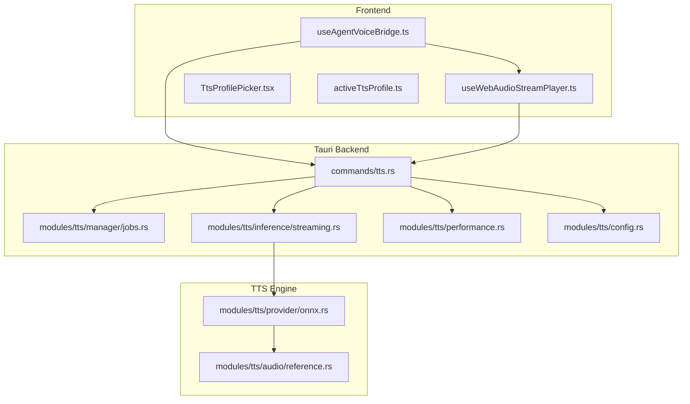
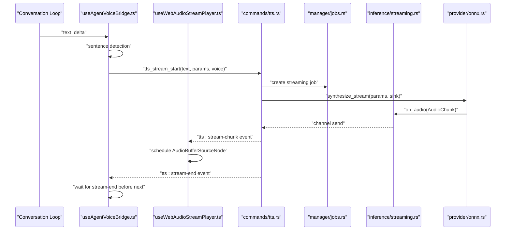
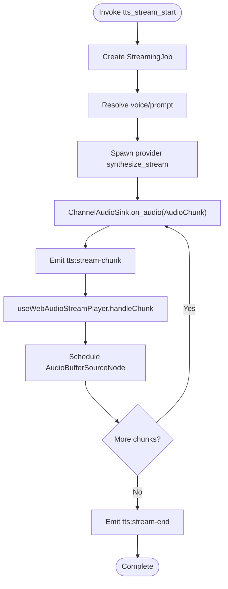
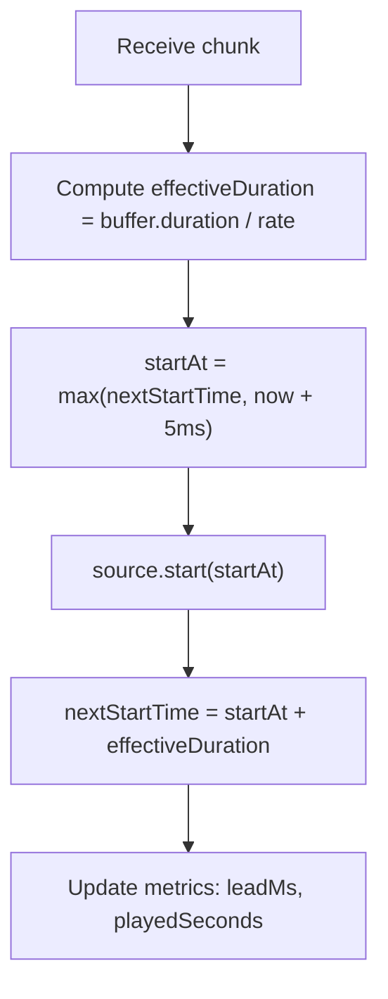
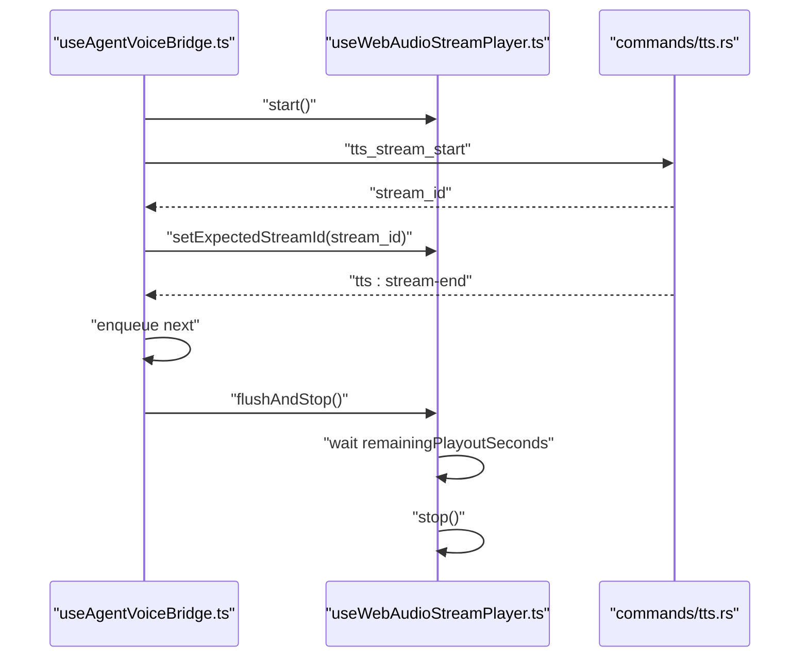
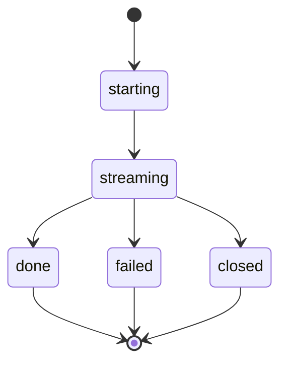
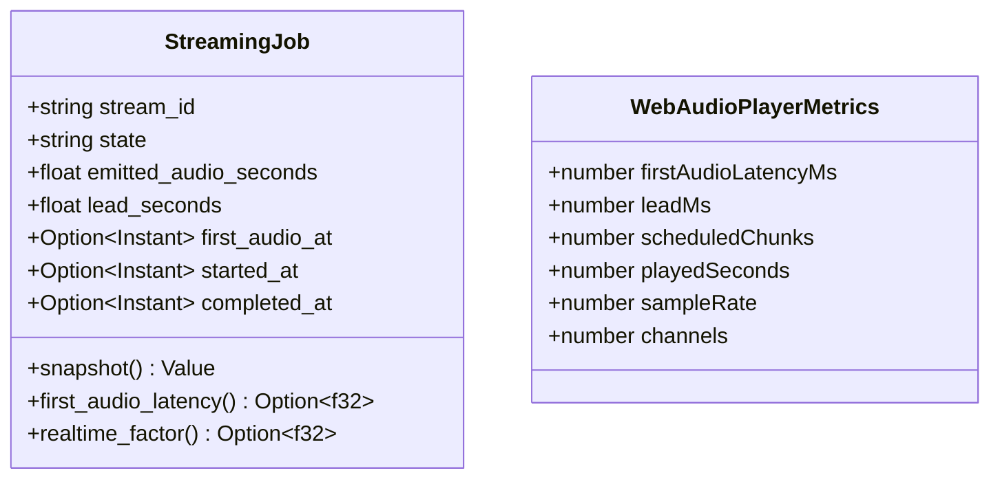
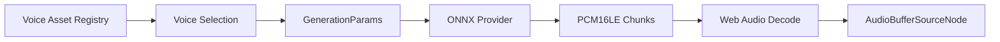
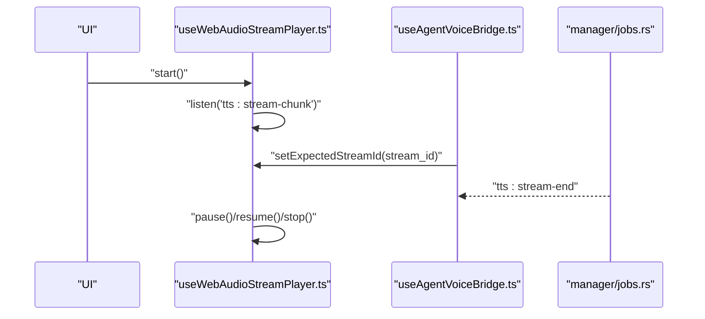
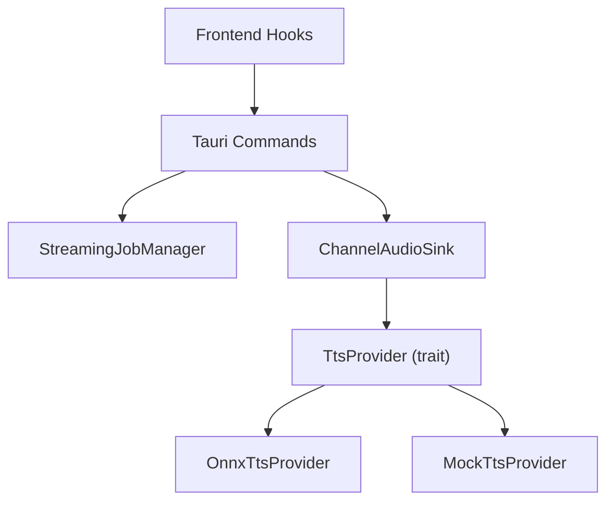

# Audio Streaming and Performance

<cite>
**Referenced Files in This Document**
- [tauri.ts](file://src/lib/tauri.ts)
- [useWebAudioStreamPlayer.ts](file://src/modules/settings/pages/useWebAudioStreamPlayer.ts)
- [useAgentVoiceBridge.ts](file://src/modules/chat/useAgentVoiceBridge.ts)
- [SttButton.tsx](file://src/modules/chat/SttButton.tsx)
- [tts.rs](file://src-tauri/src/commands/tts.rs)
- [mod.rs (tts)](file://src-tauri/src/modules/tts/mod.rs)
- [jobs.rs](file://src-tauri/src/modules/tts/manager/jobs.rs)
- [streaming.rs](file://src-tauri/src/modules/tts/inference/streaming.rs)
- [performance.rs](file://src-tauri/src/modules/tts/performance.rs)
- [config.rs](file://src-tauri/src/modules/tts/config.rs)
- [reference.rs](file://src-tauri/src/modules/tts/audio/reference.rs)
- [onnx.rs](file://src-tauri/src/modules/tts/provider/onnx.rs)
- [mock.rs](file://src-tauri/src/modules/tts/provider/mock.rs)
- [TtsProfilePicker.tsx](file://src/modules/chat/TtsProfilePicker.tsx)
- [activeTtsProfile.ts](file://src/modules/chat/activeTtsProfile.ts)
- [TtsTestPage.tsx](file://src/modules/settings/pages/TtsTestPage.tsx)
</cite>

## Table of Contents
1. [Introduction](#introduction)
2. [Project Structure](#project-structure)
3. [Core Components](#core-components)
4. [Architecture Overview](#architecture-overview)
5. [Detailed Component Analysis](#detailed-component-analysis)
6. [Dependency Analysis](#dependency-analysis)
7. [Performance Considerations](#performance-considerations)
8. [Troubleshooting Guide](#troubleshooting-guide)
9. [Conclusion](#conclusion)
10. [Appendices](#appendices)

## Introduction
This document explains If2Ai’s audio streaming architecture and performance optimization for real-time text-to-speech (TTS) and speech-to-text (STT). It covers the end-to-end pipeline from conversation text deltas to gapless audio playback, including streaming synthesis, buffering, latency management, job coordination, metrics collection, and device handling. Practical examples demonstrate streaming in conversations, tool execution, and background processing, along with cross-platform audio device considerations and performance tuning.

## Project Structure
The audio system spans three layers:
- Frontend (React + Web Audio API): streaming event consumption, gapless scheduling, metrics, and playback controls.
- Tauri backend (Rust): TTS commands, streaming job management, provider lifecycle, and audio channel emission.
- TTS engine (ONNX): inference pipeline producing PCM chunks and emitting metadata.

**Diagram sources**
- [useAgentVoiceBridge.ts:1-352](file://src/modules/chat/useAgentVoiceBridge.ts#L1-L352)
- [useWebAudioStreamPlayer.ts:1-272](file://src/modules/settings/pages/useWebAudioStreamPlayer.ts#L1-L272)
- [TtsProfilePicker.tsx:1-177](file://src/modules/chat/TtsProfilePicker.tsx#L1-L177)
- [activeTtsProfile.ts:1-80](file://src/modules/chat/activeTtsProfile.ts#L1-L80)
- [tts.rs:1-800](file://src-tauri/src/commands/tts.rs#L1-L800)
- [jobs.rs:1-374](file://src-tauri/src/modules/tts/manager/jobs.rs#L1-L374)
- [streaming.rs:1-196](file://src-tauri/src/modules/tts/inference/streaming.rs#L1-L196)
- [performance.rs:1-214](file://src-tauri/src/modules/tts/performance.rs#L1-L214)
- [config.rs:1-169](file://src-tauri/src/modules/tts/config.rs#L1-L169)
- [onnx.rs:533-563](file://src-tauri/src/modules/tts/provider/onnx.rs#L533-L563)
- [reference.rs:192-416](file://src-tauri/src/modules/tts/audio/reference.rs#L192-L416)

**Section sources**
- [tts.rs:1-800](file://src-tauri/src/commands/tts.rs#L1-L800)
- [mod.rs (tts):1-209](file://src-tauri/src/modules/tts/mod.rs#L1-L209)
- [jobs.rs:1-374](file://src-tauri/src/modules/tts/manager/jobs.rs#L1-L374)
- [streaming.rs:1-196](file://src-tauri/src/modules/tts/inference/streaming.rs#L1-L196)
- [useWebAudioStreamPlayer.ts:1-272](file://src/modules/settings/pages/useWebAudioStreamPlayer.ts#L1-L272)
- [useAgentVoiceBridge.ts:1-352](file://src/modules/chat/useAgentVoiceBridge.ts#L1-L352)

## Core Components
- TTS Commands: Frontend invokes Tauri commands to warm up, synthesize, start streaming, poll status, and close jobs.
- Streaming Job Manager: Tracks per-stream state, timestamps, emitted audio, lead seconds, and completion.
- Audio Sink and Channel: Async channel-based PCM chunk delivery from provider to backend, then to frontend via Tauri events.
- Web Audio Player: Gapless playback using AudioBufferSourceNode scheduling, with metrics and dynamic playback rate.
- Agent Voice Bridge: Converts conversation text deltas into sentences, enqueues for synthesis, and ensures strict ordering via stream-end events.
- STT Pipeline: Local SenseVoice transcription from MediaRecorder PCM16LE to text.
- Profiles and Voices: Profile-driven generation parameters, voice selection, and voice preview caching.

**Section sources**
- [tauri.ts:1962-2066](file://src/lib/tauri.ts#L1962-L2066)
- [tts.rs:406-767](file://src-tauri/src/commands/tts.rs#L406-L767)
- [jobs.rs:30-165](file://src-tauri/src/modules/tts/manager/jobs.rs#L30-L165)
- [streaming.rs:23-74](file://src-tauri/src/modules/tts/inference/streaming.rs#L23-L74)
- [useWebAudioStreamPlayer.ts:101-272](file://src/modules/settings/pages/useWebAudioStreamPlayer.ts#L101-L272)
- [useAgentVoiceBridge.ts:51-352](file://src/modules/chat/useAgentVoiceBridge.ts#L51-L352)
- [SttButton.tsx:1-118](file://src/modules/chat/SttButton.tsx#L1-L118)
- [TtsProfilePicker.tsx:1-177](file://src/modules/chat/TtsProfilePicker.tsx#L1-L177)
- [activeTtsProfile.ts:56-80](file://src/modules/chat/activeTtsProfile.ts#L56-L80)

## Architecture Overview
The streaming pipeline emits PCM chunks from Rust to the frontend, which schedules them for gapless playback. The backend coordinates jobs and ensures ordered synthesis across multiple sentences.

**Diagram sources**
- [useAgentVoiceBridge.ts:231-291](file://src/modules/chat/useAgentVoiceBridge.ts#L231-L291)
- [useWebAudioStreamPlayer.ts:123-185](file://src/modules/settings/pages/useWebAudioStreamPlayer.ts#L123-L185)
- [tts.rs:530-709](file://src-tauri/src/commands/tts.rs#L530-L709)
- [jobs.rs:30-165](file://src-tauri/src/modules/tts/manager/jobs.rs#L30-L165)
- [streaming.rs:64-74](file://src-tauri/src/modules/tts/inference/streaming.rs#L64-L74)
- [onnx.rs:533-563](file://src-tauri/src/modules/tts/provider/onnx.rs#L533-L563)

## Detailed Component Analysis

### Audio Streaming Pipeline
- Command surface: warmup, buffered synthesis, streaming start/status/result/close, voice listing, demo audio retrieval.
- Streaming synthesis: provider emits AudioChunk via ChannelAudioSink into a bounded channel; backend emits Tauri events with PCM16LE and metadata.
- Frontend playback: Web Audio API decodes PCM16LE to Float32 planar buffers and schedules AudioBufferSourceNode at precise start times to avoid gaps.

**Diagram sources**
- [tts.rs:530-709](file://src-tauri/src/commands/tts.rs#L530-L709)
- [streaming.rs:64-74](file://src-tauri/src/modules/tts/inference/streaming.rs#L64-L74)
- [useWebAudioStreamPlayer.ts:123-185](file://src/modules/settings/pages/useWebAudioStreamPlayer.ts#L123-L185)

**Section sources**
- [tauri.ts:1962-2066](file://src/lib/tauri.ts#L1962-L2066)
- [tts.rs:518-767](file://src-tauri/src/commands/tts.rs#L518-L767)
- [streaming.rs:23-74](file://src-tauri/src/modules/tts/inference/streaming.rs#L23-L74)
- [useWebAudioStreamPlayer.ts:101-272](file://src/modules/settings/pages/useWebAudioStreamPlayer.ts#L101-L272)

### Real-time Audio Delivery and Latency Management
- Gapless scheduling: precise start times and effective duration accounting for playbackRate adjustments ensure seamless transitions.
- Lead seconds: emitted_audio_seconds minus elapsed wall-clock seconds; positive lead indicates ahead-of-playback buffering.
- First audio latency: measured from start to first chunk emission; tracked in job state and exposed to frontend metrics.
- Playback rate control: per-chunk playbackRate applied to AudioBufferSourceNode; effective duration shrinks accordingly.

**Diagram sources**
- [useWebAudioStreamPlayer.ts:171-174](file://src/modules/settings/pages/useWebAudioStreamPlayer.ts#L171-L174)
- [streaming.rs:116-118](file://src-tauri/src/modules/tts/inference/streaming.rs#L116-L118)

**Section sources**
- [useWebAudioStreamPlayer.ts:123-185](file://src/modules/settings/pages/useWebAudioStreamPlayer.ts#L123-L185)
- [streaming.rs:99-118](file://src-tauri/src/modules/tts/inference/streaming.rs#L99-L118)
- [jobs.rs:92-120](file://src-tauri/src/modules/tts/manager/jobs.rs#L92-L120)

### Buffering Strategies and Queue Management
- Bounded channel: 32 chunks provide ~3.2 seconds of buffering at 100ms per chunk, balancing latency and stability.
- Strict ordering: Agent Voice Bridge waits for tts:stream-end before starting the next sentence to prevent chunk loss across stream switches.
- Flush and stop: Waits for queue drain and remaining playout seconds before closing AudioContext to avoid truncating the last sentence.

**Diagram sources**
- [useAgentVoiceBridge.ts:231-338](file://src/modules/chat/useAgentVoiceBridge.ts#L231-L338)
- [useWebAudioStreamPlayer.ts:217-233](file://src/modules/settings/pages/useWebAudioStreamPlayer.ts#L217-L233)
- [tts.rs:696-707](file://src-tauri/src/commands/tts.rs#L696-L707)

**Section sources**
- [streaming.rs:23-33](file://src-tauri/src/modules/tts/inference/streaming.rs#L23-L33)
- [useAgentVoiceBridge.ts:170-229](file://src/modules/chat/useAgentVoiceBridge.ts#L170-L229)
- [useWebAudioStreamPlayer.ts:217-244](file://src/modules/settings/pages/useWebAudioStreamPlayer.ts#L217-L244)

### Audio Job Management System
- Lifecycle: starting → streaming → done/failed/closed.
- Snapshot exposes state, emitted seconds, lead seconds, first audio latency, realtime factor, and readiness.
- Close semantics: marks closed without overriding done/failed states.

**Diagram sources**
- [jobs.rs:8-12](file://src-tauri/src/modules/tts/manager/jobs.rs#L8-L12)

**Section sources**
- [jobs.rs:30-165](file://src-tauri/src/modules/tts/manager/jobs.rs#L30-L165)
- [tts.rs:711-767](file://src-tauri/src/commands/tts.rs#L711-L767)

### Audio Performance Monitoring and Metrics
- Backend metrics: emitted_audio_seconds, lead_seconds, first_audio_latency_seconds, realtime_factor, current_chunk_index.
- Frontend metrics: firstAudioLatencyMs, leadMs, scheduledChunks, playedSeconds, sampleRate/channels.
- Testing page displays emitted/lead/first_audio/RTF and active chunk index.

**Diagram sources**
- [jobs.rs:34-165](file://src-tauri/src/modules/tts/manager/jobs.rs#L34-L165)
- [useWebAudioStreamPlayer.ts:34-73](file://src/modules/settings/pages/useWebAudioStreamPlayer.ts#L34-L73)

**Section sources**
- [jobs.rs:92-120](file://src-tauri/src/modules/tts/manager/jobs.rs#L92-L120)
- [useWebAudioStreamPlayer.ts:119-185](file://src/modules/settings/pages/useWebAudioStreamPlayer.ts#L119-L185)
- [TtsTestPage.tsx:562-583](file://src/modules/settings/pages/TtsTestPage.tsx#L562-L583)

### Audio Format Support, Codec Management, and Quality Adaptation
- Output format: PCM16LE frames with configurable sample rate and channels; runtime sample rate discovery from chunks.
- Reference audio handling: resampling and channel conversion for voice cloning prompts.
- Quality presets: profile-driven generation parameters (temperature, top-p/k, repetition penalty, max frames).
- Voice assets: builtin, bundled, and user-uploaded; voice preview caching and demo audio retrieval.

**Diagram sources**
- [tts.rs:31-112](file://src-tauri/src/commands/tts.rs#L31-L112)
- [config.rs:58-109](file://src-tauri/src/modules/tts/config.rs#L58-L109)
- [reference.rs:192-416](file://src-tauri/src/modules/tts/audio/reference.rs#L192-L416)
- [onnx.rs:533-563](file://src-tauri/src/modules/tts/provider/onnx.rs#L533-L563)

**Section sources**
- [tts.rs:31-112](file://src-tauri/src/commands/tts.rs#L31-L112)
- [config.rs:58-131](file://src-tauri/src/modules/tts/config.rs#L58-L131)
- [reference.rs:192-416](file://src-tauri/src/modules/tts/audio/reference.rs#L192-L416)
- [onnx.rs:533-563](file://src-tauri/src/modules/tts/provider/onnx.rs#L533-L563)

### Audio Manager Responsibilities
- Coordinating multiple streams: strict per-stream ordering via stream-id gating and stream-end synchronization.
- Managing concurrent playback: single AudioContext per sample rate; dynamic recreation when sample rate changes.
- Handling interruptions: pause/resume via suspend/resume; stop closes context and clears listeners.
- Cross-window profile synchronization: active profile resolution and playback rate propagation.

**Diagram sources**
- [useWebAudioStreamPlayer.ts:187-233](file://src/modules/settings/pages/useWebAudioStreamPlayer.ts#L187-L233)
- [useAgentVoiceBridge.ts:170-229](file://src/modules/chat/useAgentVoiceBridge.ts#L170-L229)
- [jobs.rs:170-209](file://src-tauri/src/modules/tts/manager/jobs.rs#L170-L209)

**Section sources**
- [useWebAudioStreamPlayer.ts:101-272](file://src/modules/settings/pages/useWebAudioStreamPlayer.ts#L101-L272)
- [useAgentVoiceBridge.ts:51-352](file://src/modules/chat/useAgentVoiceBridge.ts#L51-L352)

### Practical Examples
- Conversations: Agent Voice Bridge detects sentence boundaries, cleans text, applies profile postprocessing, and streams per-sentence audio with strict ordering.
- Tool execution: TTS commands invoked from tool results; streaming status polled until completion; stream closed on demand.
- Background processing: warmup triggered to prime the provider; health endpoint exposes provider state and queue depth.

**Section sources**
- [useAgentVoiceBridge.ts:231-291](file://src/modules/chat/useAgentVoiceBridge.ts#L231-L291)
- [tauri.ts:1962-2066](file://src/lib/tauri.ts#L1962-L2066)
- [tts.rs:406-455](file://src-tauri/src/commands/tts.rs#L406-L455)

### STT Integration
- Local SenseVoice transcription from MediaRecorder PCM16LE to text; frontend extracts PCM16LE and sends base64 to backend; result inserted into input composer.

**Section sources**
- [SttButton.tsx:31-118](file://src/modules/chat/SttButton.tsx#L31-L118)
- [mod.rs (tts):1-39](file://src-tauri/src/modules/tts/mod.rs#L1-L39)

## Dependency Analysis
- Frontend depends on Tauri commands and Web Audio APIs.
- Backend depends on TTS module traits and providers; job manager encapsulates concurrency.
- Provider abstraction enables pluggable inference backends; ONNX implementation produces PCM chunks.

**Diagram sources**
- [useWebAudioStreamPlayer.ts:1-272](file://src/modules/settings/pages/useWebAudioStreamPlayer.ts#L1-L272)
- [tts.rs:1-800](file://src-tauri/src/commands/tts.rs#L1-L800)
- [mod.rs (tts):60-124](file://src-tauri/src/modules/tts/mod.rs#L60-L124)
- [onnx.rs:533-563](file://src-tauri/src/modules/tts/provider/onnx.rs#L533-L563)
- [mock.rs:45-71](file://src-tauri/src/modules/tts/provider/mock.rs#L45-L71)

**Section sources**
- [mod.rs (tts):60-124](file://src-tauri/src/modules/tts/mod.rs#L60-L124)
- [jobs.rs:167-268](file://src-tauri/src/modules/tts/manager/jobs.rs#L167-L268)
- [streaming.rs:35-74](file://src-tauri/src/modules/tts/inference/streaming.rs#L35-L74)

## Performance Considerations
- Thread and memory budgets: configurable ONNX thread count and memory budget with validation; default 4 threads and 2GB memory.
- Throughput profiling: synthesis profile computes elapsed time, input tokens, generated frames, and frames-per-second.
- Latency targets: acceptance criteria compare against Python ONNX reference latency.
- Playback rate: adjustable per-chunk playbackRate with clamp to [0.5, 2.0]; effective duration adjusted to maintain gapless timing.
- Warmup: provider lazy-load and warmup reduce cold-start latency.

**Section sources**
- [performance.rs:25-105](file://src-tauri/src/modules/tts/performance.rs#L25-L105)
- [performance.rs:107-145](file://src-tauri/src/modules/tts/performance.rs#L107-L145)
- [useWebAudioStreamPlayer.ts:156-170](file://src/modules/settings/pages/useWebAudioStreamPlayer.ts#L156-L170)
- [tts.rs:447-455](file://src-tauri/src/commands/tts.rs#L447-L455)

## Troubleshooting Guide
- No audio or truncated playback: ensure flushAndStop waits for remaining playout seconds before stopping; verify stream-end events are received.
- Wrong voice or missing assets: confirm voice resolution and asset registry scanning; check demo audio availability.
- High latency: monitor first_audio_latency and lead_seconds; adjust generation parameters (max frames, sampling); consider warmup.
- Cross-window desync: verify active profile synchronization and playback rate propagation.
- STT model not ready: check model download status and prompt user to install required models.

**Section sources**
- [useAgentVoiceBridge.ts:315-338](file://src/modules/chat/useAgentVoiceBridge.ts#L315-L338)
- [useWebAudioStreamPlayer.ts:217-244](file://src/modules/settings/pages/useWebAudioStreamPlayer.ts#L217-L244)
- [tts.rs:31-112](file://src-tauri/src/commands/tts.rs#L31-L112)
- [SttButton.tsx:82-89](file://src/modules/chat/SttButton.tsx#L82-L89)
- [activeTtsProfile.ts:56-80](file://src/modules/chat/activeTtsProfile.ts#L56-L80)

## Conclusion
If2Ai’s audio streaming architecture integrates a robust Rust backend with a responsive Web Audio frontend to deliver low-latency, gapless TTS playback. The system emphasizes strict job ordering, dynamic buffering, and comprehensive metrics to ensure reliable real-time audio. Profiles and voice management provide flexibility, while performance tuning and warmup mitigate latency. STT complements the pipeline with local transcription for voice input.

## Appendices

### API Surface Summary
- TTS Commands: health, warmup, synthesize, stream_start, stream_status, stream_result, stream_close, demo_audio, list_voices, split_text, list_voice_assets, voice_audio, preview_voice.
- STT Command: transcribe from PCM16LE base64.

**Section sources**
- [tauri.ts:1962-2066](file://src/lib/tauri.ts#L1962-L2066)
- [mod.rs (tts):1-59](file://src-tauri/src/modules/tts/mod.rs#L1-L59)