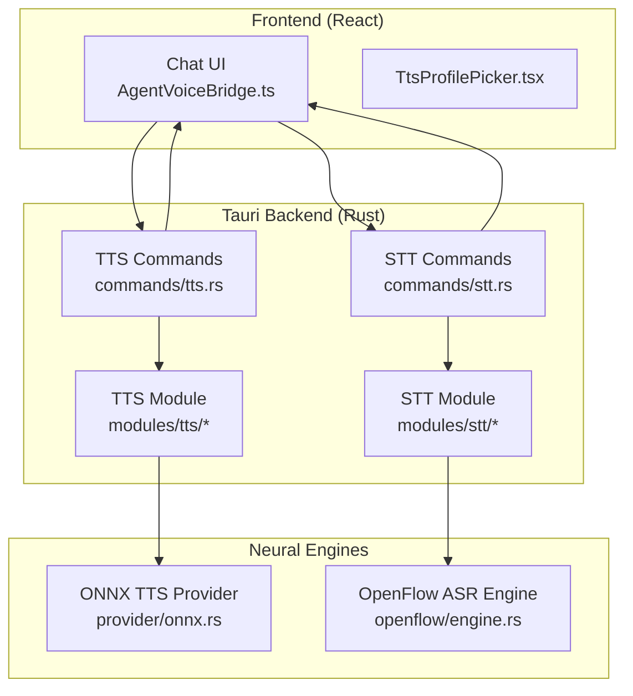
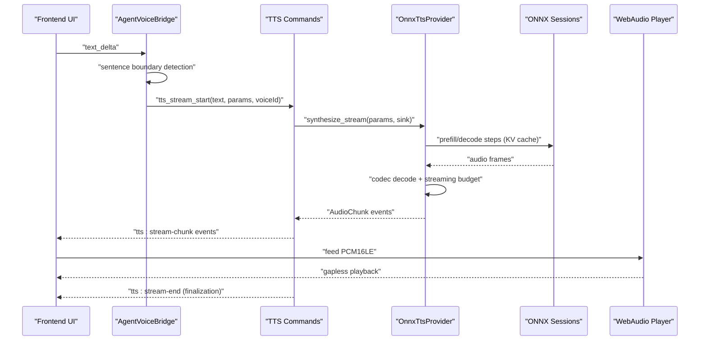
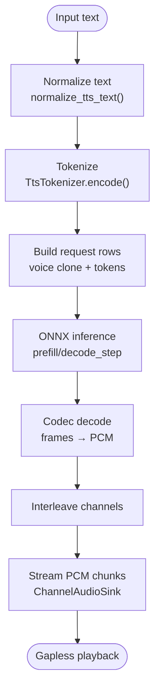
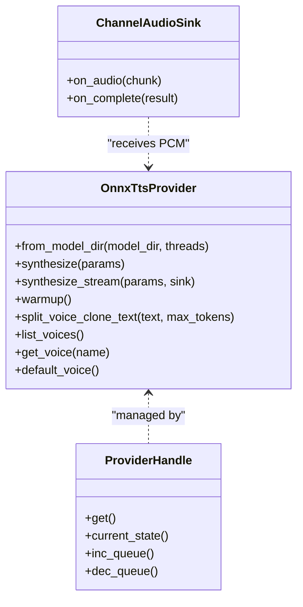
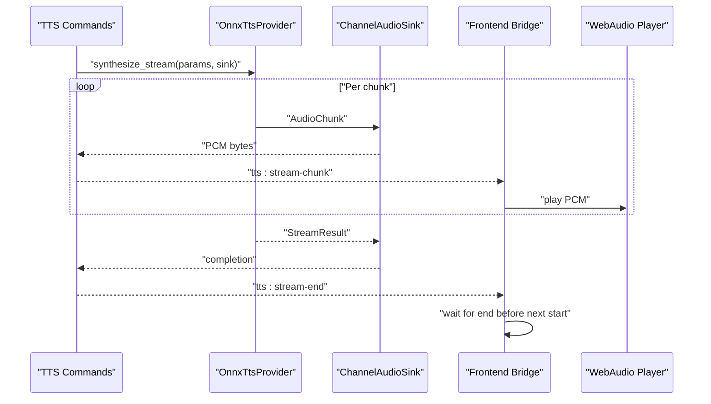
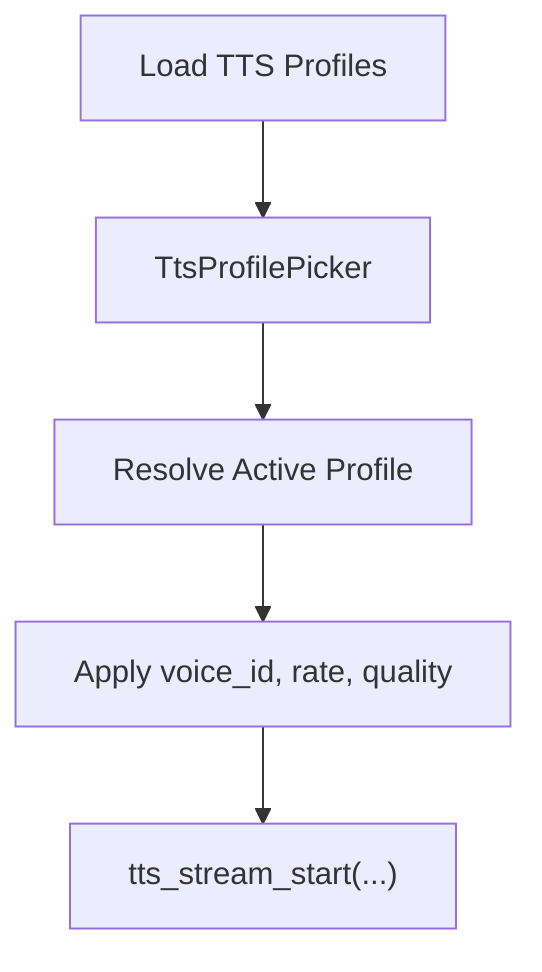
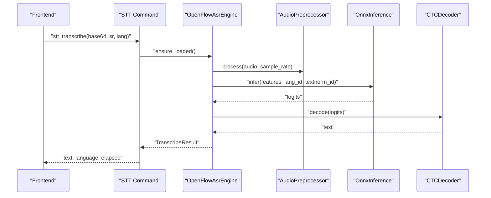
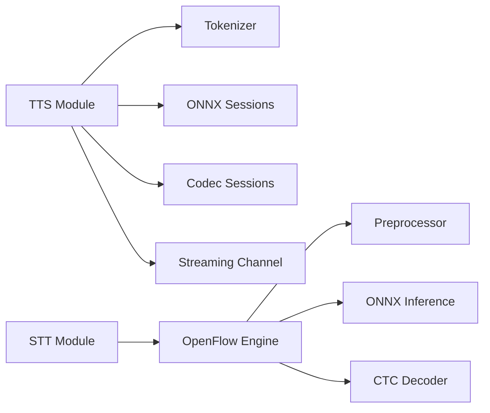

# Speech Processing (TTS/STT)

<cite>
**Referenced Files in This Document**
- [tts/mod.rs](file://src-tauri/src/modules/tts/mod.rs)
- [tts/provider/onnx.rs](file://src-tauri/src/modules/tts/provider/onnx.rs)
- [tts/text/normalizer.rs](file://src-tauri/src/modules/tts/text/normalizer.rs)
- [tts/inference/streaming.rs](file://src-tauri/src/modules/tts/inference/streaming.rs)
- [stt/mod.rs](file://src-tauri/src/modules/stt/mod.rs)
- [stt/openflow/engine.rs](file://src-tauri/src/modules/stt/openflow/engine.rs)
- [commands/tts.rs](file://src-tauri/src/commands/tts.rs)
- [commands/stt.rs](file://src-tauri/src/commands/stt.rs)
- [chat/useAgentVoiceBridge.ts](file://src/modules/chat/useAgentVoiceBridge.ts)
- [chat/TtsProfilePicker.tsx](file://src/modules/chat/TtsProfilePicker.tsx)
</cite>

## Table of Contents
1. [Introduction](#introduction)
2. [Project Structure](#project-structure)
3. [Core Components](#core-components)
4. [Architecture Overview](#architecture-overview)
5. [Detailed Component Analysis](#detailed-component-analysis)
6. [Dependency Analysis](#dependency-analysis)
7. [Performance Considerations](#performance-considerations)
8. [Troubleshooting Guide](#troubleshooting-guide)
9. [Conclusion](#conclusion)
10. [Appendices](#appendices)

## Introduction
This document explains If2Ai’s speech processing capabilities for Text-to-Speech (TTS) and Speech-to-Text (STT). It covers:
- ONNX Runtime integration for neural network inference
- Audio streaming architecture and gapless playback
- Voice management and profile-driven synthesis
- TTS pipeline from text normalization to audio synthesis, including voice selection, prosody control, and streaming output
- STT processing for speech recognition, audio preprocessing, and transcription quality optimization
- Voice profile management, audio format support, and performance tuning
- Practical examples of speech integration in conversations and tool execution
- Audio device management, latency optimization, and quality settings
- Troubleshooting guides for audio issues and performance optimization

## Project Structure
The speech subsystem is implemented primarily in Rust (Tauri backend) with TypeScript/React UI components bridging synthesis and playback.

**Diagram sources**
- [commands/tts.rs:1-1369](file://src-tauri/src/commands/tts.rs#L1-L1369)
- [commands/stt.rs:1-222](file://src-tauri/src/commands/stt.rs#L1-L222)
- [tts/mod.rs:1-209](file://src-tauri/src/modules/tts/mod.rs#L1-L209)
- [stt/mod.rs:1-40](file://src-tauri/src/modules/stt/mod.rs#L1-L40)
- [tts/provider/onnx.rs:1-671](file://src-tauri/src/modules/tts/provider/onnx.rs#L1-L671)
- [stt/openflow/engine.rs:1-203](file://src-tauri/src/modules/stt/openflow/engine.rs#L1-L203)

**Section sources**
- [commands/tts.rs:1-1369](file://src-tauri/src/commands/tts.rs#L1-L1369)
- [commands/stt.rs:1-222](file://src-tauri/src/commands/stt.rs#L1-L222)
- [tts/mod.rs:1-209](file://src-tauri/src/modules/tts/mod.rs#L1-L209)
- [stt/mod.rs:1-40](file://src-tauri/src/modules/stt/mod.rs#L1-L40)

## Core Components
- TTS Provider abstraction and ONNX-backed implementation
- Text normalization and chunking for robust synthesis
- Streaming audio delivery with gapless playback
- STT OpenFlow (SenseVoice) engine with ONNX inference
- Frontend voice bridge for agent speech synthesis
- Voice profile management and UI controls

Key responsibilities:
- TTS: normalize text → tokenize → build requests → ONNX inference → codec decode → streaming PCM → Web Audio playback
- STT: PCM16LE base64 decoding → float conversion → OpenFlow preprocessing → ONNX inference → CTC decoding → text result

**Section sources**
- [tts/mod.rs:60-209](file://src-tauri/src/modules/tts/mod.rs#L60-L209)
- [tts/provider/onnx.rs:301-655](file://src-tauri/src/modules/tts/provider/onnx.rs#L301-L655)
- [tts/text/normalizer.rs:56-71](file://src-tauri/src/modules/tts/text/normalizer.rs#L56-L71)
- [tts/inference/streaming.rs:23-97](file://src-tauri/src/modules/tts/inference/streaming.rs#L23-L97)
- [stt/mod.rs:1-40](file://src-tauri/src/modules/stt/mod.rs#L1-L40)
- [stt/openflow/engine.rs:127-175](file://src-tauri/src/modules/stt/openflow/engine.rs#L127-L175)
- [chat/useAgentVoiceBridge.ts:1-352](file://src/modules/chat/useAgentVoiceBridge.ts#L1-L352)
- [chat/TtsProfilePicker.tsx:1-177](file://src/modules/chat/TtsProfilePicker.tsx#L1-L177)

## Architecture Overview
High-level flow for TTS and STT:

**Diagram sources**
- [commands/tts.rs:518-767](file://src-tauri/src/commands/tts.rs#L518-L767)
- [tts/provider/onnx.rs:404-591](file://src-tauri/src/modules/tts/provider/onnx.rs#L404-L591)
- [tts/inference/streaming.rs:35-74](file://src-tauri/src/modules/tts/inference/streaming.rs#L35-L74)
- [chat/useAgentVoiceBridge.ts:231-272](file://src/modules/chat/useAgentVoiceBridge.ts#L231-L272)

## Detailed Component Analysis

### TTS Pipeline: Text Normalization to Audio Synthesis
- Text normalization cleans and standardizes input, preserving URLs, emails, mentions, and filenames, while normalizing punctuation and spacing.
- Tokenization produces token IDs for the TTS model.
- Request building composes voice clone prompts and text tokens.
- ONNX inference performs autoregressive decoding with KV cache reuse.
- Codec decoding converts audio frames to PCM, interleaved to stereo.
- Streaming delivers PCM chunks with lead/latency metrics for gapless playback.

**Diagram sources**
- [tts/text/normalizer.rs:56-71](file://src-tauri/src/modules/tts/text/normalizer.rs#L56-L71)
- [tts/provider/onnx.rs:194-230](file://src-tauri/src/modules/tts/provider/onnx.rs#L194-L230)
- [tts/inference/streaming.rs:35-74](file://src-tauri/src/modules/tts/inference/streaming.rs#L35-L74)

**Section sources**
- [tts/text/normalizer.rs:1-583](file://src-tauri/src/modules/tts/text/normalizer.rs#L1-L583)
- [tts/provider/onnx.rs:194-299](file://src-tauri/src/modules/tts/provider/onnx.rs#L194-L299)
- [tts/inference/streaming.rs:1-196](file://src-tauri/src/modules/tts/inference/streaming.rs#L1-L196)

### ONNX Runtime Integration for Neural Network Inference
- Provider encapsulates model sessions (prefill and decode_step), tokenizer, and codec sessions.
- Concurrency is controlled via a semaphore to limit simultaneous streams.
- Warmup runs a short synthesis to prime models and measure device performance.
- Voice selection supports built-in voices and user-provided reference audio.

**Diagram sources**
- [tts/provider/onnx.rs:66-141](file://src-tauri/src/modules/tts/provider/onnx.rs#L66-L141)
- [commands/tts.rs:241-393](file://src-tauri/src/commands/tts.rs#L241-L393)
- [tts/inference/streaming.rs:40-74](file://src-tauri/src/modules/tts/inference/streaming.rs#L40-L74)

**Section sources**
- [tts/provider/onnx.rs:1-671](file://src-tauri/src/modules/tts/provider/onnx.rs#L1-L671)
- [commands/tts.rs:241-393](file://src-tauri/src/commands/tts.rs#L241-L393)
- [tts/inference/streaming.rs:1-196](file://src-tauri/src/modules/tts/inference/streaming.rs#L1-L196)

### Audio Streaming Architecture and Gapless Playback
- Streaming uses an async channel delivering PCM16LE chunks with metadata (sample rate, channels, emitted seconds, lead).
- The frontend bridge waits for a stream-end event before starting the next sentence to avoid dropping residual chunks.
- Lead seconds and first-audio latency are computed to optimize real-time playback.

**Diagram sources**
- [commands/tts.rs:587-709](file://src-tauri/src/commands/tts.rs#L587-L709)
- [tts/inference/streaming.rs:35-74](file://src-tauri/src/modules/tts/inference/streaming.rs#L35-L74)
- [chat/useAgentVoiceBridge.ts:170-229](file://src/modules/chat/useAgentVoiceBridge.ts#L170-L229)

**Section sources**
- [commands/tts.rs:587-709](file://src-tauri/src/commands/tts.rs#L587-L709)
- [tts/inference/streaming.rs:1-196](file://src-tauri/src/modules/tts/inference/streaming.rs#L1-L196)
- [chat/useAgentVoiceBridge.ts:170-229](file://src/modules/chat/useAgentVoiceBridge.ts#L170-L229)

### Voice Management and Profile System
- Voice registry resolves builtin, bundled, and user voices; supports demo voice resolution.
- TTS profile picker lists available profiles and allows switching active profile.
- Active profile drives voice selection, playback rate, and text postprocessing for each sentence.

**Diagram sources**
- [commands/tts.rs:62-112](file://src-tauri/src/commands/tts.rs#L62-L112)
- [chat/TtsProfilePicker.tsx:49-80](file://src/modules/chat/TtsProfilePicker.tsx#L49-L80)
- [chat/useAgentVoiceBridge.ts:80-98](file://src/modules/chat/useAgentVoiceBridge.ts#L80-L98)

**Section sources**
- [commands/tts.rs:62-112](file://src-tauri/src/commands/tts.rs#L62-L112)
- [chat/TtsProfilePicker.tsx:1-177](file://src/modules/chat/TtsProfilePicker.tsx#L1-L177)
- [chat/useAgentVoiceBridge.ts:80-98](file://src/modules/chat/useAgentVoiceBridge.ts#L80-L98)

### STT Processing: Speech Recognition and Quality Optimization
- PCM16LE base64 is decoded to f32 samples and processed by OpenFlow preprocessor.
- ONNX inference runs the SenseVoice model; CTC decoder produces text.
- Language ID resolution supports auto-detection and explicit languages.
- Model readiness checks and lazy engine initialization reduce cold-start overhead.

**Diagram sources**
- [commands/stt.rs:130-160](file://src-tauri/src/commands/stt.rs#L130-L160)
- [stt/openflow/engine.rs:127-175](file://src-tauri/src/modules/stt/openflow/engine.rs#L127-L175)

**Section sources**
- [stt/mod.rs:1-40](file://src-tauri/src/modules/stt/mod.rs#L1-L40)
- [commands/stt.rs:1-222](file://src-tauri/src/commands/stt.rs#L1-L222)
- [stt/openflow/engine.rs:1-203](file://src-tauri/src/modules/stt/openflow/engine.rs#L1-L203)

### Practical Examples: Speech Integration in Conversations and Tools
- Agent voice bridge integrates streaming TTS into the chat UI:
  - Sentence boundary detection prevents premature synthesis of fenced code blocks
  - Waits for stream-end before starting the next sentence to ensure gapless playback
  - Applies active profile’s voice and postprocessing per sentence
- Example flows:
  - Auto TTS during agent response generation
  - Manual “Generate audio” from selected text
  - STT button to capture microphone audio and transcribe

**Section sources**
- [chat/useAgentVoiceBridge.ts:293-351](file://src/modules/chat/useAgentVoiceBridge.ts#L293-L351)
- [chat/TtsProfilePicker.tsx:76-80](file://src/modules/chat/TtsProfilePicker.tsx#L76-L80)
- [commands/stt.rs:130-160](file://src-tauri/src/commands/stt.rs#L130-L160)

## Dependency Analysis
- TTS depends on:
  - Text normalization and tokenizer
  - ONNX sessions (prefill/decode_step)
  - Codec sessions for frame encoding/decoding
  - Streaming channel for audio delivery
- STT depends on:
  - OpenFlow engine with ONNX inference and CTC decoding
  - Audio preprocessor and optional CMVN normalization

**Diagram sources**
- [tts/mod.rs:25-40](file://src-tauri/src/modules/tts/mod.rs#L25-L40)
- [stt/mod.rs:28-29](file://src-tauri/src/modules/stt/mod.rs#L28-L29)
- [tts/provider/onnx.rs:34-49](file://src-tauri/src/modules/tts/provider/onnx.rs#L34-L49)
- [stt/openflow/engine.rs:45-56](file://src-tauri/src/modules/stt/openflow/engine.rs#L45-L56)

**Section sources**
- [tts/mod.rs:1-209](file://src-tauri/src/modules/tts/mod.rs#L1-L209)
- [stt/mod.rs:1-40](file://src-tauri/src/modules/stt/mod.rs#L1-L40)

## Performance Considerations
- Concurrency control: semaphore limits concurrent streams to balance memory and latency
- Streaming budget: adaptive frame budgeting balances latency and throughput
- Warmup: primes models to reduce first-request latency
- Real-time factor: emitted seconds vs elapsed seconds indicates streaming headroom
- Audio format: PCM16LE streaming with dynamic sample rate/channels avoids hardcoding
- Latency optimization:
  - Lead seconds metric enables lookahead buffering
  - First-audio latency measured end-to-end for accurate scheduling
- Quality presets and postprocessing:
  - Profiles control voice, speed, and punctuation softening
  - Postprocessing applied per sentence for readability

[No sources needed since this section provides general guidance]

## Troubleshooting Guide
Common issues and remedies:
- TTS provider not loaded or evicted:
  - Trigger warmup and poll health; ensure provider state transitions to loaded
  - Check queue depth and concurrency limits
- Empty or invalid text:
  - Ensure normalized text is non-empty before synthesis
- Stream end not received:
  - Frontend must wait for tts:stream-end before starting next stream
  - Timeout protection prevents deadlocks
- STT model missing:
  - Verify SenseVoice model directory and required files
  - Use download command to fetch quantized/fp16 variants
- Audio device/playback issues:
  - Ensure WebAudio player is started before feeding chunks
  - Flush and stop only after remaining playout completes
- Performance bottlenecks:
  - Reduce concurrent streams or adjust generation parameters
  - Monitor real-time factor and lead seconds to tune buffering

**Section sources**
- [commands/tts.rs:406-455](file://src-tauri/src/commands/tts.rs#L406-L455)
- [commands/tts.rs:587-709](file://src-tauri/src/commands/tts.rs#L587-L709)
- [commands/stt.rs:180-221](file://src-tauri/src/commands/stt.rs#L180-L221)
- [chat/useAgentVoiceBridge.ts:315-348](file://src/modules/chat/useAgentVoiceBridge.ts#L315-L348)

## Conclusion
If2Ai’s speech processing combines a robust TTS pipeline with ONNX Runtime inference and a responsive STT engine. The system emphasizes streaming, gapless playback, and profile-driven customization, enabling high-quality, low-latency voice synthesis and transcription. The architecture cleanly separates concerns between frontend orchestration, backend synthesis, and neural engines, facilitating maintainability and performance tuning.

[No sources needed since this section summarizes without analyzing specific files]

## Appendices

### Audio Formats and Capabilities
- TTS output:
  - Buffered: WAV (48 kHz, stereo, 16-bit PCM)
  - Streaming: PCM16LE frames delivered via events
- STT input:
  - PCM16LE base64 decoded to f32 samples
  - Automatic resampling to model’s target rate
- Codec:
  - Frame-based streaming decode with adaptive budgeting

**Section sources**
- [tts/mod.rs:155-199](file://src-tauri/src/modules/tts/mod.rs#L155-L199)
- [tts/inference/streaming.rs:23-33](file://src-tauri/src/modules/tts/inference/streaming.rs#L23-L33)
- [commands/stt.rs:130-160](file://src-tauri/src/commands/stt.rs#L130-L160)