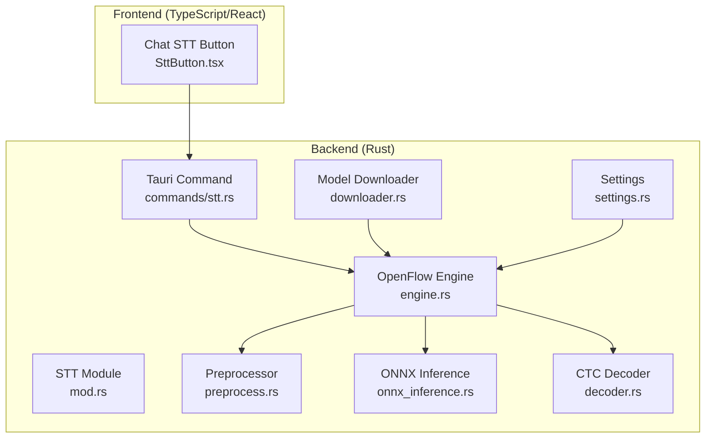
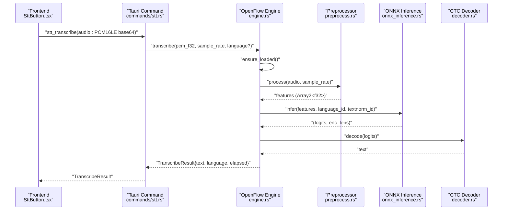
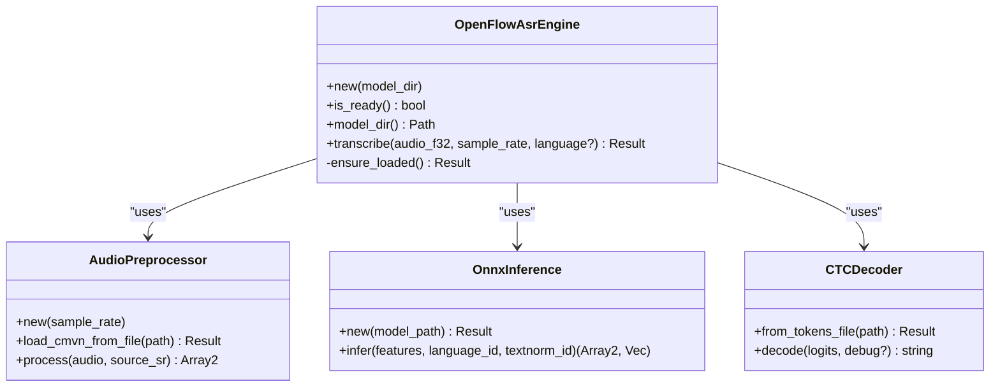
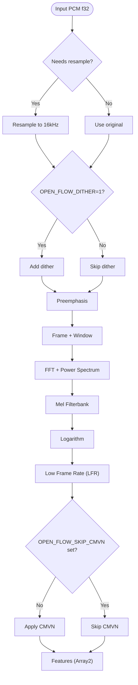
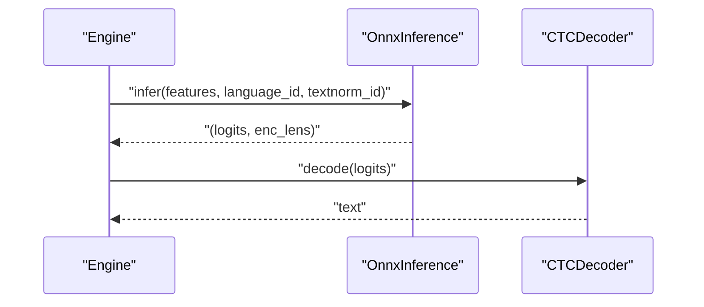
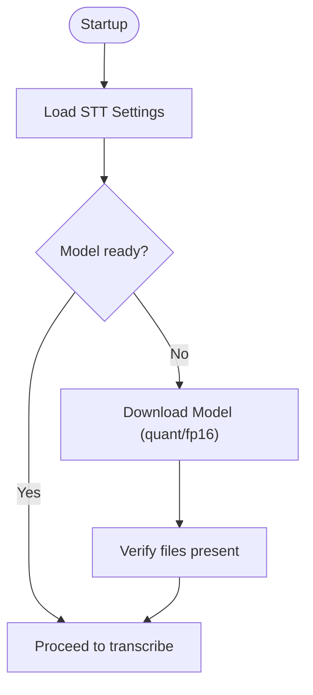
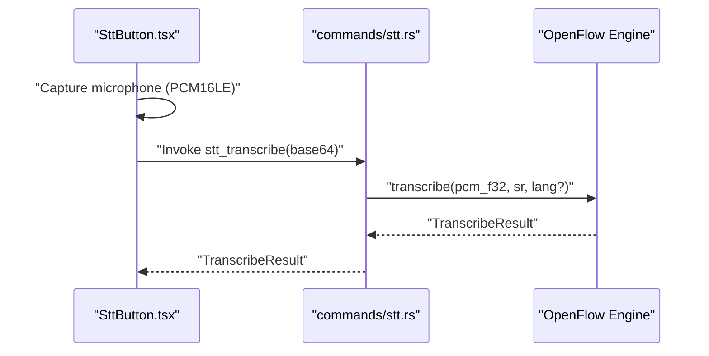
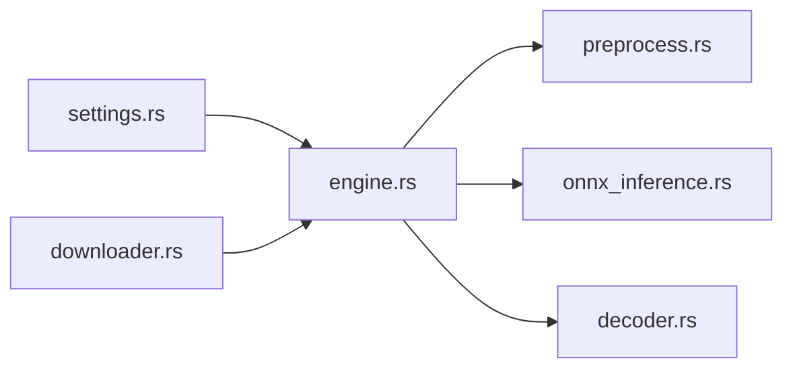

# Speech-to-Text Processing

<cite>
**Referenced Files in This Document**
- [mod.rs](file://src-tauri/src/modules/stt/mod.rs)
- [settings.rs](file://src-tauri/src/modules/stt/settings.rs)
- [engine.rs](file://src-tauri/src/modules/stt/openflow/engine.rs)
- [onnx_inference.rs](file://src-tauri/src/modules/stt/openflow/onnx_inference.rs)
- [preprocess.rs](file://src-tauri/src/modules/stt/openflow/preprocess.rs)
- [decoder.rs](file://src-tauri/src/modules/stt/openflow/decoder.rs)
- [downloader.rs](file://src-tauri/src/modules/stt/openflow/downloader.rs)
- [stt.rs](file://src-tauri/src/commands/stt.rs)
- [SttButton.tsx](file://src/modules/chat/SttButton.tsx)
</cite>

## Table of Contents
1. [Introduction](#introduction)
2. [Project Structure](#project-structure)
3. [Core Components](#core-components)
4. [Architecture Overview](#architecture-overview)
5. [Detailed Component Analysis](#detailed-component-analysis)
6. [Dependency Analysis](#dependency-analysis)
7. [Performance Considerations](#performance-considerations)
8. [Troubleshooting Guide](#troubleshooting-guide)
9. [Conclusion](#conclusion)
10. [Appendices](#appendices)

## Introduction
This document describes If2Ai’s Speech-to-Text (STT) processing system. The system integrates a local ONNX-based speech recognition backend (SenseVoice via OpenFlow) to provide real-time transcription from microphone or recorded audio. It covers the audio capture and preprocessing pipeline, ONNX model integration, feature extraction, transcription generation, streaming architecture, and practical usage patterns for conversational flows and voice commands. It also documents model lifecycle management, environment controls for performance tuning, and troubleshooting common audio issues.

## Project Structure
The STT subsystem is implemented in Rust under the Tauri backend and exposes a command interface consumed by the frontend. The key areas are:
- STT module entry and shared result type
- OpenFlow ASR engine (preprocessing, ONNX inference, decoding)
- Model downloader and settings persistence
- Frontend integration via a chat STT button

**Diagram sources**
- [mod.rs:1-40](file://src-tauri/src/modules/stt/mod.rs#L1-L40)
- [engine.rs:1-203](file://src-tauri/src/modules/stt/openflow/engine.rs#L1-L203)
- [preprocess.rs:1-556](file://src-tauri/src/modules/stt/openflow/preprocess.rs#L1-L556)
- [onnx_inference.rs:1-126](file://src-tauri/src/modules/stt/openflow/onnx_inference.rs#L1-L126)
- [decoder.rs:1-354](file://src-tauri/src/modules/stt/openflow/decoder.rs#L1-L354)
- [downloader.rs:1-205](file://src-tauri/src/modules/stt/openflow/downloader.rs#L1-L205)
- [settings.rs:1-53](file://src-tauri/src/modules/stt/settings.rs#L1-L53)
- [stt.rs](file://src-tauri/src/commands/stt.rs)
- [SttButton.tsx](file://src/modules/chat/SttButton.tsx)

**Section sources**
- [mod.rs:1-40](file://src-tauri/src/modules/stt/mod.rs#L1-L40)
- [settings.rs:1-53](file://src-tauri/src/modules/stt/settings.rs#L1-L53)

## Core Components
- STT module and shared result type: Defines the TranscribeResult structure and module layout.
- OpenFlow ASR engine: Orchestrates preprocessing, ONNX inference, and decoding; supports lazy initialization and reuse of the ONNX session.
- Preprocessor: Implements audio resampling, optional dither, preemphasis, framing, Mel spectrogram, LFR, and CMVN normalization.
- ONNX inference: Loads the model and runs inference with dynamic output handling for both FP32 and FP16 models.
- CTC decoder: Greedy decoding from logits to text, with special token filtering and optional “best non-blank” mode.
- Model downloader: Downloads SenseVoice ONNX weights and auxiliary files from primary or fallback sources.
- Settings: Persistently stores provider selection and related flags.
- Tauri command: Bridges frontend audio input to the backend engine.
- Frontend button: Provides a user interface to trigger STT.

**Section sources**
- [mod.rs:31-40](file://src-tauri/src/modules/stt/mod.rs#L31-L40)
- [engine.rs:52-176](file://src-tauri/src/modules/stt/openflow/engine.rs#L52-L176)
- [preprocess.rs:21-113](file://src-tauri/src/modules/stt/openflow/preprocess.rs#L21-L113)
- [onnx_inference.rs:23-126](file://src-tauri/src/modules/stt/openflow/onnx_inference.rs#L23-L126)
- [decoder.rs:28-208](file://src-tauri/src/modules/stt/openflow/decoder.rs#L28-L208)
- [downloader.rs:89-124](file://src-tauri/src/modules/stt/openflow/downloader.rs#L89-L124)
- [settings.rs:16-29](file://src-tauri/src/modules/stt/settings.rs#L16-L29)
- [stt.rs](file://src-tauri/src/commands/stt.rs)
- [SttButton.tsx](file://src/modules/chat/SttButton.tsx)

## Architecture Overview
The STT pipeline transforms raw PCM audio into text:
- Frontend captures audio and sends PCM16LE frames to the backend command.
- Backend decodes base64 to PCM f32 and invokes the OpenFlow engine.
- The engine lazily loads the ONNX session and performs preprocessing to Mel-filterbank features with LFR and optional CMVN.
- ONNX inference produces logits; CTC greedy decoding yields the final text.
- Results include the recognized text, detected language, and elapsed time.

**Diagram sources**
- [engine.rs:127-175](file://src-tauri/src/modules/stt/openflow/engine.rs#L127-L175)
- [preprocess.rs:68-112](file://src-tauri/src/modules/stt/openflow/preprocess.rs#L68-L112)
- [onnx_inference.rs:55-124](file://src-tauri/src/modules/stt/openflow/onnx_inference.rs#L55-L124)
- [decoder.rs:88-201](file://src-tauri/src/modules/stt/openflow/decoder.rs#L88-L201)
- [stt.rs](file://src-tauri/src/commands/stt.rs)

## Detailed Component Analysis

### OpenFlow ASR Engine
The engine encapsulates the entire STT pipeline and manages model readiness and session caching:
- Lazy initialization: First transcribe triggers loading of preprocessor, ONNX session, and decoder.
- Thread safety: Uses a mutex-guarded session; blocking calls are executed inside spawn_blocking to avoid blocking the async runtime.
- Feature pipeline: Resampling to 16 kHz, optional dither, preemphasis, framing, Mel spectrogram, LFR, optional CMVN.
- Inference: Handles both FP32 and FP16 outputs; trims control frames and adjusts shape as needed.
- Decoding: Greedy CTC decoding with special token filtering and optional “best non-blank” mode.

**Diagram sources**
- [engine.rs:52-176](file://src-tauri/src/modules/stt/openflow/engine.rs#L52-L176)
- [preprocess.rs:21-113](file://src-tauri/src/modules/stt/openflow/preprocess.rs#L21-L113)
- [onnx_inference.rs:23-126](file://src-tauri/src/modules/stt/openflow/onnx_inference.rs#L23-L126)
- [decoder.rs:28-208](file://src-tauri/src/modules/stt/openflow/decoder.rs#L28-L208)

**Section sources**
- [engine.rs:52-176](file://src-tauri/src/modules/stt/openflow/engine.rs#L52-L176)

### Audio Preprocessing Pipeline
The preprocessor aligns with FunASR/WavFrontend and Kaldi conventions:
- Resampling to 16 kHz when needed.
- Optional dither controlled by environment variable.
- Preemphasis filter.
- Framing with Hamming window and FFT to compute power spectrum.
- Mel filterbank computation with configurable frequency range.
- Logarithmic compression and LFR downsampling.
- Optional CMVN normalization using Kaldi-style stats.

**Diagram sources**
- [preprocess.rs:68-112](file://src-tauri/src/modules/stt/openflow/preprocess.rs#L68-L112)

**Section sources**
- [preprocess.rs:21-113](file://src-tauri/src/modules/stt/openflow/preprocess.rs#L21-L113)

### ONNX Inference and Decoding
- Inference: Builds an ONNX Runtime session with graph optimization and thread settings; constructs tensors for speech, lengths, language, and text normalization IDs; extracts logits safely from either FP32 or FP16 outputs; trims control frames and adjusts shape.
- Decoding: Greedy CTC decoding with blank token handling; filters special tokens and normalizes whitespace; supports optional “best non-blank” mode for environments with strong blank frames.

**Diagram sources**
- [onnx_inference.rs:55-124](file://src-tauri/src/modules/stt/openflow/onnx_inference.rs#L55-L124)
- [decoder.rs:88-201](file://src-tauri/src/modules/stt/openflow/decoder.rs#L88-L201)

**Section sources**
- [onnx_inference.rs:23-126](file://src-tauri/src/modules/stt/openflow/onnx_inference.rs#L23-L126)
- [decoder.rs:28-208](file://src-tauri/src/modules/stt/openflow/decoder.rs#L28-L208)

### Model Lifecycle and Settings
- Settings: Persisted JSON file storing provider selection; normalized to a single provider for compatibility.
- Model downloader: Supports quantized and FP16 presets; downloads required files with fallback mirrors; emits progress callbacks.
- Model readiness: Checks for essential files before allowing transcription.

**Diagram sources**
- [settings.rs:35-52](file://src-tauri/src/modules/stt/settings.rs#L35-L52)
- [downloader.rs:89-124](file://src-tauri/src/modules/stt/openflow/downloader.rs#L89-L124)
- [engine.rs:27-34](file://src-tauri/src/modules/stt/openflow/engine.rs#L27-L34)

**Section sources**
- [settings.rs:16-29](file://src-tauri/src/modules/stt/settings.rs#L16-L29)
- [downloader.rs:44-65](file://src-tauri/src/modules/stt/openflow/downloader.rs#L44-L65)
- [engine.rs:27-34](file://src-tauri/src/modules/stt/openflow/engine.rs#L27-L34)

### Frontend Integration and Streaming
- Frontend button triggers the STT command with PCM16LE audio captured from the microphone.
- The backend command decodes the incoming base64 PCM and routes it to the engine.
- Streaming architecture: The pipeline is designed for continuous audio chunks; buffering and latency are managed by the frontend capture loop and the backend’s blocking inference stage.

**Diagram sources**
- [SttButton.tsx](file://src/modules/chat/SttButton.tsx)
- [stt.rs](file://src-tauri/src/commands/stt.rs)
- [engine.rs:127-175](file://src-tauri/src/modules/stt/openflow/engine.rs#L127-L175)

**Section sources**
- [SttButton.tsx](file://src/modules/chat/SttButton.tsx)
- [stt.rs](file://src-tauri/src/commands/stt.rs)

## Dependency Analysis
- Internal dependencies: The engine composes the preprocessor, ONNX inference, and decoder. Settings and downloader support lifecycle management.
- External dependencies: ONNX Runtime session, ndarray arrays, tracing for logging, and environment variables for runtime toggles.
- Coupling: Low to moderate; the engine isolates the pipeline stages behind well-defined interfaces.

**Diagram sources**
- [engine.rs:14-17](file://src-tauri/src/modules/stt/openflow/engine.rs#L14-L17)
- [preprocess.rs:1-7](file://src-tauri/src/modules/stt/openflow/preprocess.rs#L1-L7)
- [onnx_inference.rs:1-8](file://src-tauri/src/modules/stt/openflow/onnx_inference.rs#L1-L8)
- [decoder.rs:1-3](file://src-tauri/src/modules/stt/openflow/decoder.rs#L1-L3)
- [settings.rs:1-14](file://src-tauri/src/modules/stt/settings.rs#L1-L14)
- [downloader.rs:1-11](file://src-tauri/src/modules/stt/openflow/downloader.rs#L1-L11)

**Section sources**
- [engine.rs:14-17](file://src-tauri/src/modules/stt/openflow/engine.rs#L14-L17)

## Performance Considerations
- Model optimization: Graph optimization level and intra-op threads are configured during session creation.
- Feature computation: FFT and Mel operations are vectorized; consider adjusting hop length or frame size if CPU-bound.
- Decoding: Greedy decoding is fast; avoid enabling verbose debug logs in production.
- Environment controls:
  - OPEN_FLOW_DITHER: Enable dither for robustness at the cost of minor overhead.
  - OPEN_FLOW_SKIP_CMVN: Disable CMVN to skip normalization if needed.
  - OPEN_FLOW_LFR_LEFT_PAD: Toggle left padding for LFR to match export specifics.
  - OPEN_FLOW_BEST_NON_BLANK: Switch to “best non-blank” decoding to mitigate strong blank frames.
- Latency: Blocking inference is invoked per chunk; batching or overlapping inference could reduce latency further.

[No sources needed since this section provides general guidance]

## Troubleshooting Guide
Common issues and remedies:
- Model not ready: Ensure model files are present in the expected directory; use the downloader to fetch required files.
- Download failures: Network issues or rate limits; retry or use a different preset; fallback mirrors are supported.
- Silence or garbled output: Verify audio source and sample rate; ensure resampling is applied when needed.
- Slow inference: Confirm optimization settings and available CPU cores; consider reducing workload or upgrading hardware.
- Special tokens in output: Expected for language/emotion tags; decoder filters them automatically.

**Section sources**
- [engine.rs:77-125](file://src-tauri/src/modules/stt/openflow/engine.rs#L77-L125)
- [downloader.rs:126-160](file://src-tauri/src/modules/stt/openflow/downloader.rs#L126-L160)
- [decoder.rs:5-17](file://src-tauri/src/modules/stt/openflow/decoder.rs#L5-L17)

## Conclusion
If2Ai’s STT system provides a robust, local-first speech recognition pipeline built on SenseVoice via OpenFlow. It offers precise preprocessing, efficient ONNX inference, and reliable decoding, with a clean backend/frontend boundary and tunable runtime behaviors. The design supports real-time transcription and can be extended to incorporate advanced features like voice activity detection and speaker diarization in future iterations.

[No sources needed since this section summarizes without analyzing specific files]

## Appendices

### Practical Integration Examples
- Conversational flows: Trigger STT from the chat UI to capture user speech, send PCM to the backend, and append the resulting text to the conversation timeline.
- Voice commands: Use language hints and short utterances to improve accuracy; handle partial results if streaming is introduced later.

[No sources needed since this section provides general guidance]

### Cross-Platform Audio Handling Notes
- The frontend captures PCM16LE audio; ensure platform-specific permission prompts and device enumeration are handled by the UI layer.
- Backend expects PCM f32 internally; the provided pipeline handles resampling and normalization.

[No sources needed since this section provides general guidance]