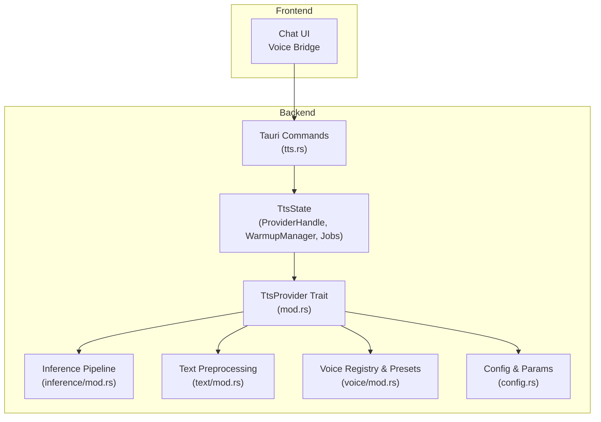
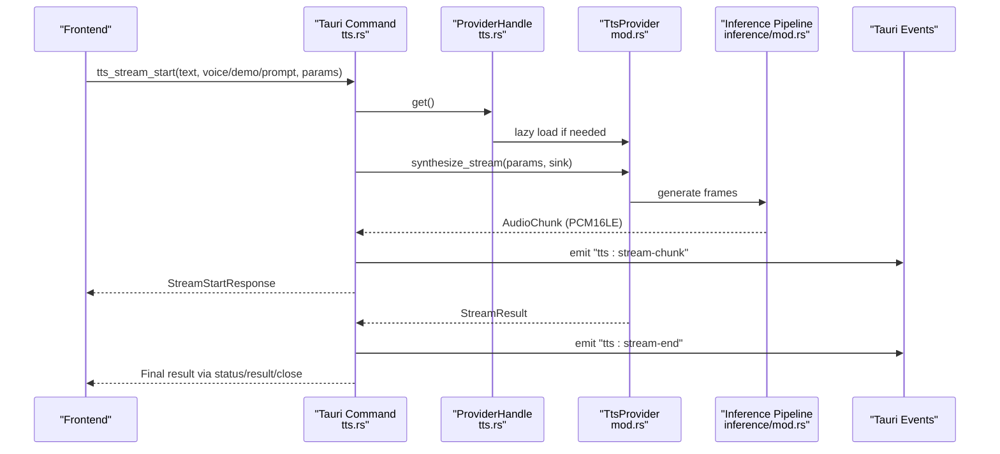
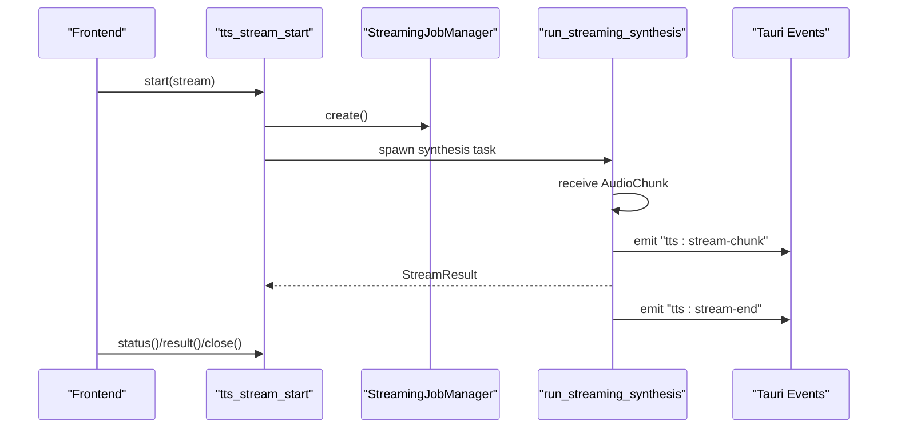
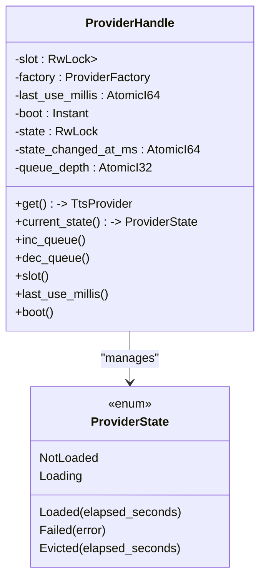
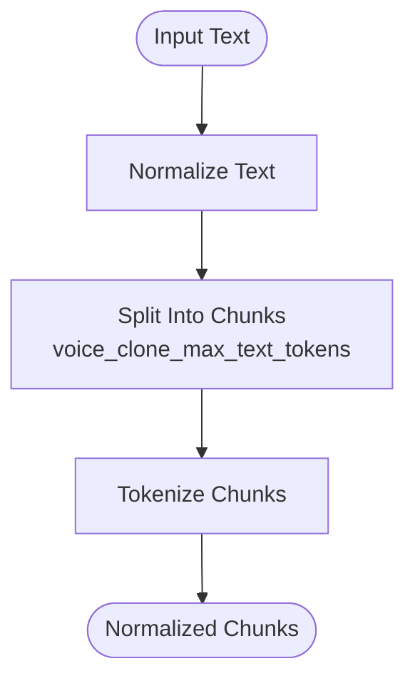
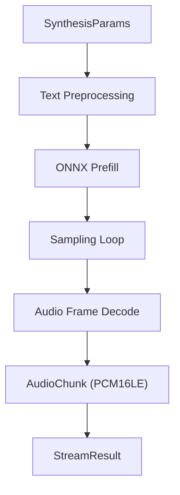
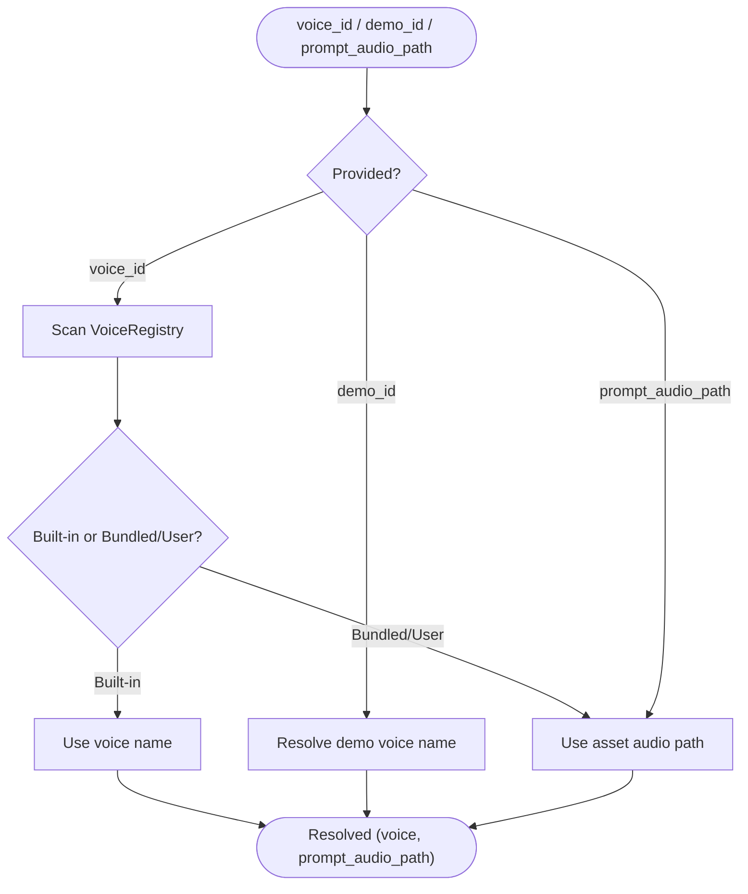
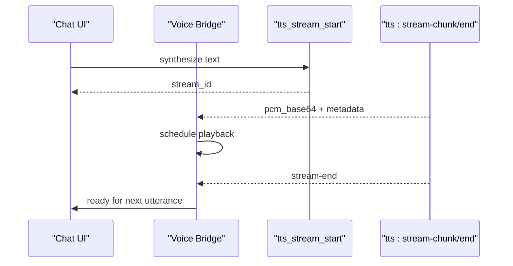
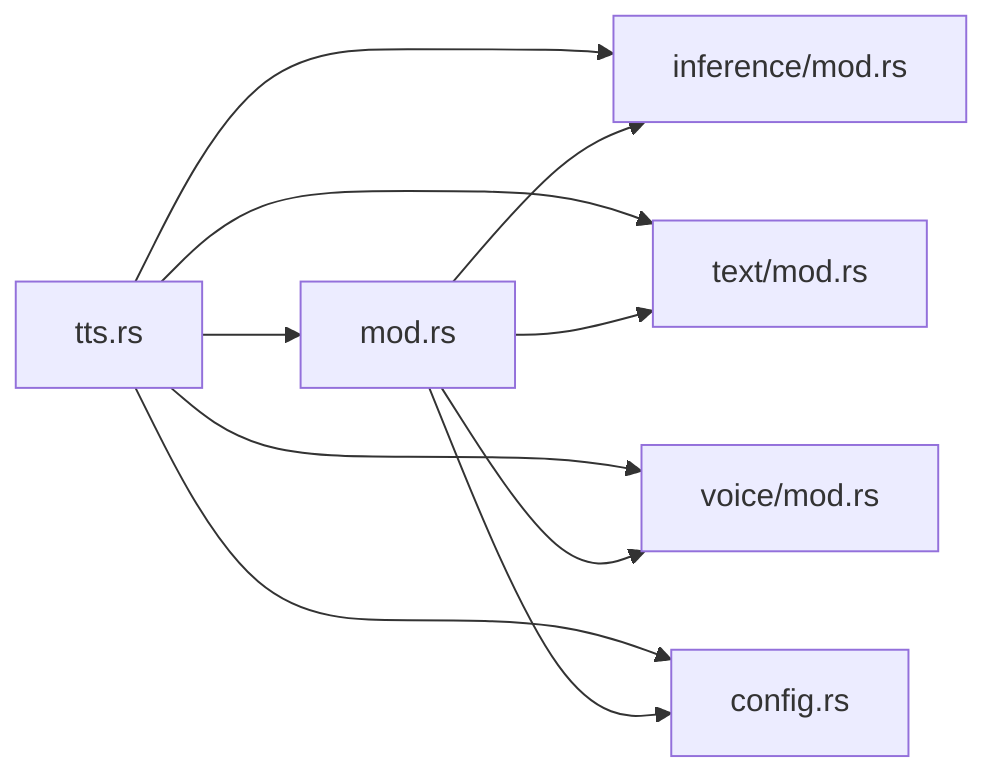

# Text-to-Speech Pipeline

<cite>
**Referenced Files in This Document**
- [tts.rs](file://src-tauri/src/commands/tts.rs)
- [mod.rs](file://src-tauri/src/modules/tts/mod.rs)
- [config.rs](file://src-tauri/src/modules/tts/config.rs)
- [text/mod.rs](file://src-tauri/src/modules/tts/text/mod.rs)
- [inference/mod.rs](file://src-tauri/src/modules/tts/inference/mod.rs)
- [voice/mod.rs](file://src-tauri/src/modules/tts/voice/mod.rs)
- [ttsSanitize.ts](file://src/modules/chat/ttsSanitize.ts)
- [tts_e2e_smoke.rs](file://src-tauri/tests/tts_e2e_smoke.rs)
- [tts_integration.rs](file://src-tauri/tests/tts_integration.rs)
- [tts_user_voice_smoke.rs](file://src-tauri/tests/tts_user_voice_smoke.rs)
</cite>

## Table of Contents
1. [Introduction](#introduction)
2. [Project Structure](#project-structure)
3. [Core Components](#core-components)
4. [Architecture Overview](#architecture-overview)
5. [Detailed Component Analysis](#detailed-component-analysis)
6. [Dependency Analysis](#dependency-analysis)
7. [Performance Considerations](#performance-considerations)
8. [Troubleshooting Guide](#troubleshooting-guide)
9. [Conclusion](#conclusion)
10. [Appendices](#appendices)

## Introduction
This document describes If2Ai’s Text-to-Speech (TTS) pipeline from end-to-end. It covers the complete workflow from text input through audio synthesis, including text normalization, tokenization, and audio generation. It documents the ONNX Runtime integration for neural network inference, model loading and initialization, and the inference pipeline architecture. It also explains text preprocessing stages (normalization, chunking, and tokenization), audio synthesis process, sampling strategies, and audio output formatting. Practical examples of TTS integration in conversations and tool execution are included, along with performance optimization techniques, memory management, streaming capabilities, model selection, voice profiles, and quality settings.

## Project Structure
The TTS system is implemented primarily in Rust within the backend and exposed via Tauri commands. The frontend integrates with the backend through typed commands and events. Key areas:
- Backend TTS module: orchestrates providers, inference, text processing, voice management, and streaming.
- Tauri commands: expose TTS functionality to the frontend and manage streaming lifecycle.
- Frontend integration: chat UI and voice bridge consume TTS results and events.

**Diagram sources**
- [tts.rs:1-1369](file://src-tauri/src/commands/tts.rs#L1-L1369)
- [mod.rs:1-209](file://src-tauri/src/modules/tts/mod.rs#L1-L209)
- [config.rs:1-169](file://src-tauri/src/modules/tts/config.rs#L1-L169)
- [text/mod.rs:1-8](file://src-tauri/src/modules/tts/text/mod.rs#L1-L8)
- [inference/mod.rs:1-32](file://src-tauri/src/modules/tts/inference/mod.rs#L1-L32)
- [voice/mod.rs:1-16](file://src-tauri/src/modules/tts/voice/mod.rs#L1-L16)

**Section sources**
- [tts.rs:1-1369](file://src-tauri/src/commands/tts.rs#L1-L1369)
- [mod.rs:1-209](file://src-tauri/src/modules/tts/mod.rs#L1-L209)
- [config.rs:1-169](file://src-tauri/src/modules/tts/config.rs#L1-L169)
- [text/mod.rs:1-8](file://src-tauri/src/modules/tts/text/mod.rs#L1-L8)
- [inference/mod.rs:1-32](file://src-tauri/src/modules/tts/inference/mod.rs#L1-L32)
- [voice/mod.rs:1-16](file://src-tauri/src/modules/tts/voice/mod.rs#L1-L16)

## Core Components
- TTS Provider trait: defines buffered synthesis, streaming synthesis, warmup, text splitting, voice listing, and presets.
- Generation parameters: sampling controls, token budgets, and batch sizing.
- Audio chunk model: PCM16LE frames with metadata for gapless playback.
- Provider handle: lazy initialization and idle eviction for memory efficiency.
- Voice registry and presets: built-in voices and demo assets.
- Tauri commands: health checks, warmup, buffered synthesis, streaming start/status/result/close, and demo audio retrieval.

Key responsibilities:
- Provider handle manages lifecycle and concurrency metrics.
- Commands route voice selection and dispatch synthesis requests.
- Inference pipeline executes ONNX Runtime sessions for text-to-audio generation.
- Text preprocessing ensures normalized, chunked input for tokenizers.

**Section sources**
- [mod.rs:62-124](file://src-tauri/src/modules/tts/mod.rs#L62-L124)
- [config.rs:55-131](file://src-tauri/src/modules/tts/config.rs#L55-L131)
- [tts.rs:241-393](file://src-tauri/src/commands/tts.rs#L241-L393)
- [voice/mod.rs:1-16](file://src-tauri/src/modules/tts/voice/mod.rs#L1-L16)

## Architecture Overview
The TTS pipeline is structured around a provider abstraction backed by ONNX Runtime. The frontend triggers synthesis via Tauri commands. The backend lazily initializes the provider, ensures readiness via warmup, and executes either buffered or streaming synthesis. Streaming emits PCM chunks via Tauri events for immediate playback.

**Diagram sources**
- [tts.rs:530-709](file://src-tauri/src/commands/tts.rs#L530-L709)
- [mod.rs:89-101](file://src-tauri/src/modules/tts/mod.rs#L89-L101)
- [inference/mod.rs:13-31](file://src-tauri/src/modules/tts/inference/mod.rs#L13-L31)

**Section sources**
- [tts.rs:518-709](file://src-tauri/src/commands/tts.rs#L518-L709)
- [mod.rs:83-124](file://src-tauri/src/modules/tts/mod.rs#L83-L124)
- [inference/mod.rs:13-31](file://src-tauri/src/modules/tts/inference/mod.rs#L13-L31)

## Detailed Component Analysis

### Tauri Commands and Streaming Lifecycle
- Health and warmup: exposes provider state and warmup progress.
- Buffered synthesis: returns a complete WAV as base64 with metadata.
- Streaming synthesis: starts a job, streams PCM chunks, and ends with a completion event.
- Job management: status polling, blocking result retrieval, and close/cancel.

**Diagram sources**
- [tts.rs:530-709](file://src-tauri/src/commands/tts.rs#L530-L709)

**Section sources**
- [tts.rs:406-767](file://src-tauri/src/commands/tts.rs#L406-L767)

### Provider Handle and Lazy Initialization
- Lazy load: constructs provider on first use and transitions provider state.
- Idle eviction: releases provider after inactivity to free memory.
- Queue depth tracking: monitors concurrent requests and semaphore waits.

**Diagram sources**
- [tts.rs:241-393](file://src-tauri/src/commands/tts.rs#L241-L393)

**Section sources**
- [tts.rs:241-393](file://src-tauri/src/commands/tts.rs#L241-L393)

### Text Preprocessing: Normalization, Chunking, and Tokenization
- Normalization: robust normalization for multilingual input.
- Chunking: splits text for voice clone mode respecting token budgets.
- Tokenization: integrated with audio tokenizer model for frame generation.

**Diagram sources**
- [text/mod.rs:1-8](file://src-tauri/src/modules/tts/text/mod.rs#L1-L8)
- [config.rs:55-109](file://src-tauri/src/modules/tts/config.rs#L55-L109)

**Section sources**
- [text/mod.rs:1-8](file://src-tauri/src/modules/tts/text/mod.rs#L1-L8)
- [config.rs:55-109](file://src-tauri/src/modules/tts/config.rs#L55-L109)

### Audio Synthesis and Sampling Strategies
- Buffered synthesis: produces complete WAV with metadata.
- Streaming synthesis: emits PCM16LE frames with timing metadata for gapless playback.
- Sampling parameters: text and audio temperature, top-p, top-k, repetition penalty, and optional seed.

**Diagram sources**
- [mod.rs:126-209](file://src-tauri/src/modules/tts/mod.rs#L126-L209)
- [inference/mod.rs:13-31](file://src-tauri/src/modules/tts/inference/mod.rs#L13-L31)
- [config.rs:55-109](file://src-tauri/src/modules/tts/config.rs#L55-L109)

**Section sources**
- [mod.rs:126-209](file://src-tauri/src/modules/tts/mod.rs#L126-L209)
- [inference/mod.rs:13-31](file://src-tauri/src/modules/tts/inference/mod.rs#L13-L31)
- [config.rs:55-109](file://src-tauri/src/modules/tts/config.rs#L55-L109)

### Voice Profiles, Selection, and Demos
- Built-in voice presets: 15+ voices with embedded demo audio.
- Voice registry: scans builtins, bundled, and user-uploaded assets.
- Priority routing: voice_id > demo_id > prompt_audio_path.

**Diagram sources**
- [tts.rs:39-112](file://src-tauri/src/commands/tts.rs#L39-L112)
- [voice/mod.rs:1-16](file://src-tauri/src/modules/tts/voice/mod.rs#L1-L16)

**Section sources**
- [tts.rs:39-112](file://src-tauri/src/commands/tts.rs#L39-L112)
- [voice/mod.rs:1-16](file://src-tauri/src/modules/tts/voice/mod.rs#L1-L16)

### Frontend Integration Examples
- Chat UI: TTS commands integrate with conversation flows for agent speech.
- Voice bridge: listens for stream events to schedule gapless playback.
- Sanitization: text sanitization ensures safe input for TTS.

**Diagram sources**
- [tts.rs:591-709](file://src-tauri/src/commands/tts.rs#L591-L709)
- [ttsSanitize.ts](file://src/modules/chat/ttsSanitize.ts)

**Section sources**
- [tts.rs:591-709](file://src-tauri/src/commands/tts.rs#L591-L709)
- [ttsSanitize.ts](file://src/modules/chat/ttsSanitize.ts)

## Dependency Analysis
The TTS module composes several subsystems:
- Provider trait depends on inference runners, text processors, and voice registry.
- Commands depend on provider handle, warmup manager, and streaming job manager.
- Frontend depends on Tauri commands and events for streaming.

**Diagram sources**
- [tts.rs:1-1369](file://src-tauri/src/commands/tts.rs#L1-L1369)
- [mod.rs:1-209](file://src-tauri/src/modules/tts/mod.rs#L1-L209)
- [inference/mod.rs:1-32](file://src-tauri/src/modules/tts/inference/mod.rs#L1-L32)
- [text/mod.rs:1-8](file://src-tauri/src/modules/tts/text/mod.rs#L1-L8)
- [voice/mod.rs:1-16](file://src-tauri/src/modules/tts/voice/mod.rs#L1-L16)
- [config.rs:1-169](file://src-tauri/src/modules/tts/config.rs#L1-L169)

**Section sources**
- [tts.rs:1-1369](file://src-tauri/src/commands/tts.rs#L1-L1369)
- [mod.rs:1-209](file://src-tauri/src/modules/tts/mod.rs#L1-L209)
- [inference/mod.rs:1-32](file://src-tauri/src/modules/tts/inference/mod.rs#L1-L32)
- [text/mod.rs:1-8](file://src-tauri/src/modules/tts/text/mod.rs#L1-L8)
- [voice/mod.rs:1-16](file://src-tauri/src/modules/tts/voice/mod.rs#L1-L16)
- [config.rs:1-169](file://src-tauri/src/modules/tts/config.rs#L1-L169)

## Performance Considerations
- Lazy provider initialization: defers ONNX session creation until first use to reduce cold-start latency.
- Idle eviction: releases provider after inactivity to reclaim ~1.5 GB RAM; reloads on next request.
- Concurrency control: queue depth monitoring prevents overload and tracks semaphore waits.
- Streaming PCM delivery: enables gapless playback and reduces latency by emitting chunks as they are produced.
- Batch sizing: configurable TTS and codec batch sizes for throughput tuning.
- Sampling parameters: temperature, top-p, top-k, and repetition penalty balance quality and speed.

[No sources needed since this section provides general guidance]

## Troubleshooting Guide
Common issues and remedies:
- Provider failed to load: check model cache paths and ONNX availability; inspect provider state transitions.
- Warmup stuck: verify warmup text and frames; ensure network access for model downloads.
- Streaming gaps: ensure frontend waits for “tts:stream-end” before starting the next sentence.
- Voice not found: confirm voice_id exists in registry or fallback to a built-in voice name.
- Audio quality: adjust sampling parameters and batch sizes; verify input normalization and chunking.

**Section sources**
- [tts.rs:406-455](file://src-tauri/src/commands/tts.rs#L406-L455)
- [tts.rs:591-709](file://src-tauri/src/commands/tts.rs#L591-L709)

## Conclusion
If2Ai’s TTS pipeline integrates a provider abstraction with ONNX Runtime for multilingual, voice-cloned audio synthesis. The system supports both buffered and streaming modes, with robust text preprocessing, voice management, and frontend-friendly PCM streaming. The architecture emphasizes lazy initialization, idle eviction, and queue-aware concurrency to optimize performance and memory usage.

[No sources needed since this section summarizes without analyzing specific files]

## Appendices

### API Surface and Responses
- Health: provider state, warmup status, queue depth.
- Warmup: progress and status snapshot.
- Buffered synthesis: WAV base64, sample rate, duration, voice, and text chunks.
- Streaming start: stream_id, sample rate, channels.
- Stream events: PCM16LE chunks and completion end event.

**Section sources**
- [tts.rs:114-195](file://src-tauri/src/commands/tts.rs#L114-L195)
- [tts.rs:406-767](file://src-tauri/src/commands/tts.rs#L406-L767)

### Tests and Smoke Checks
- End-to-end smoke tests for TTS.
- Integration tests covering command flows.
- User voice smoke tests validating uploaded voice assets.

**Section sources**
- [tts_e2e_smoke.rs](file://src-tauri/tests/tts_e2e_smoke.rs)
- [tts_integration.rs](file://src-tauri/tests/tts_integration.rs)
- [tts_user_voice_smoke.rs](file://src-tauri/tests/tts_user_voice_smoke.rs)