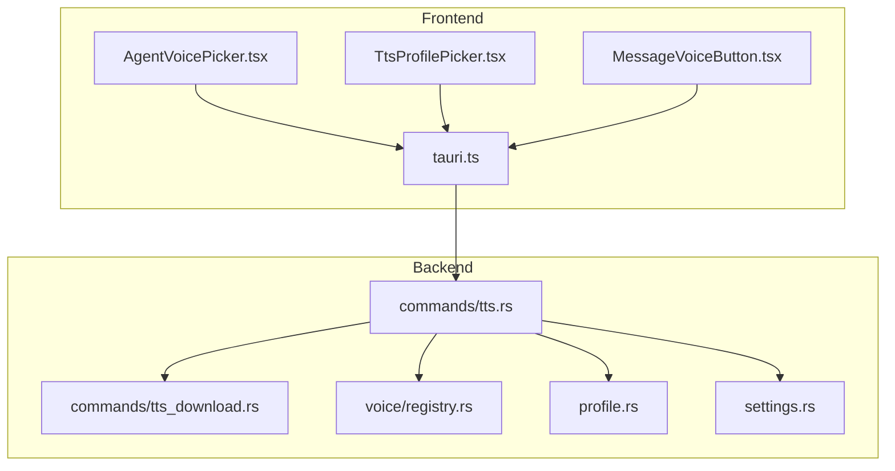
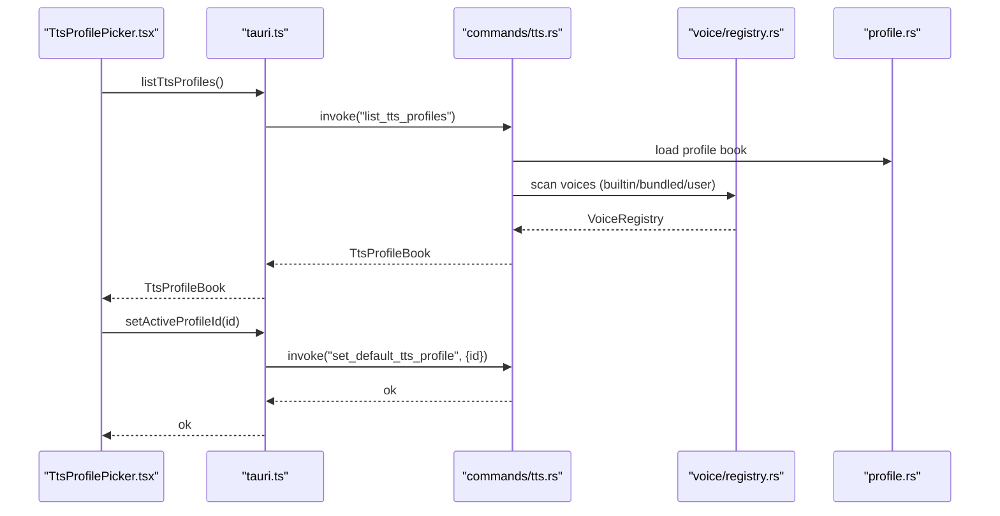
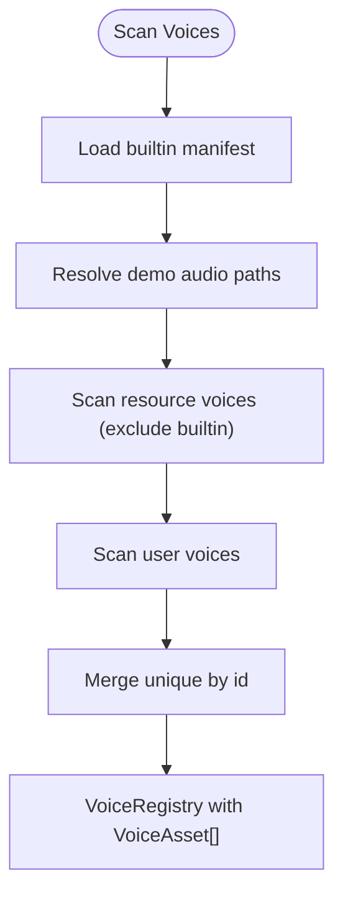
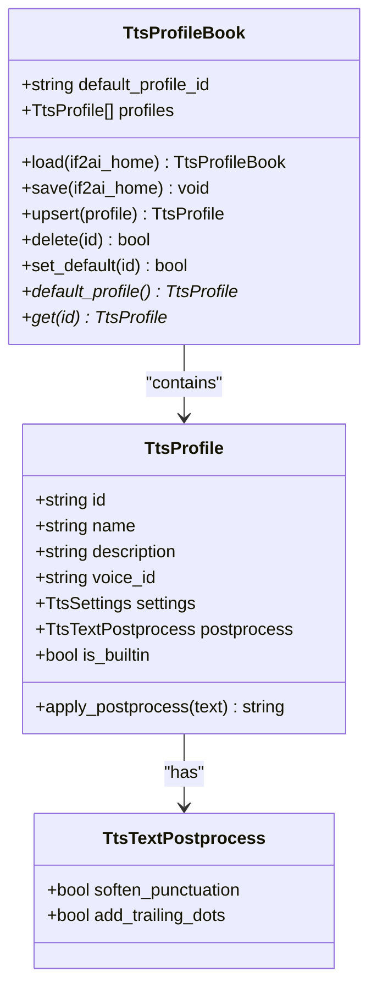
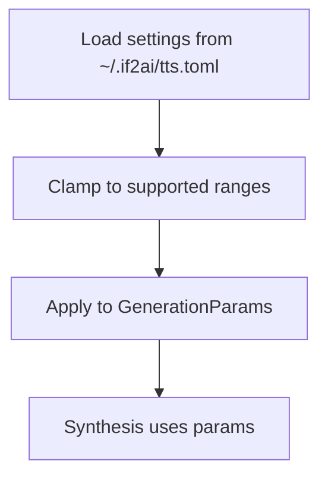
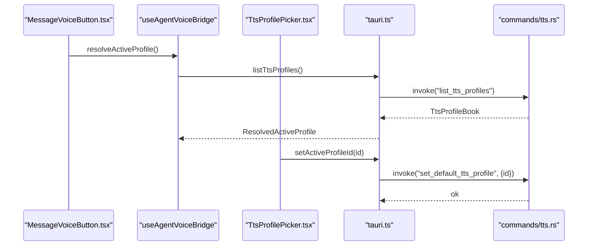
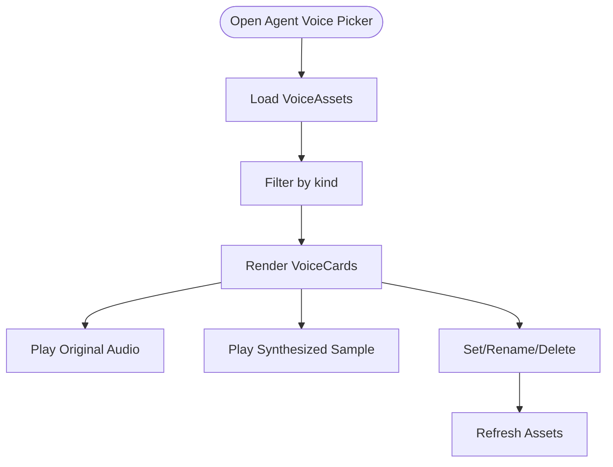
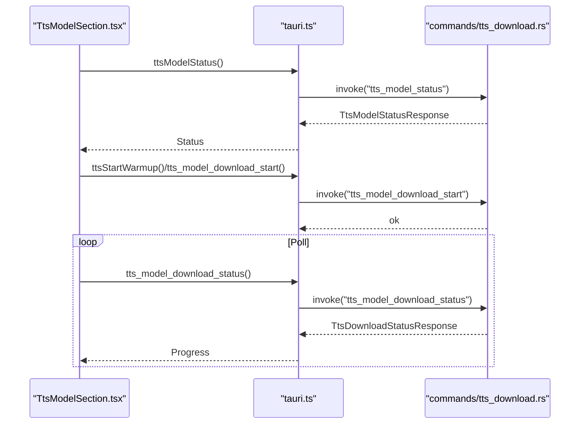
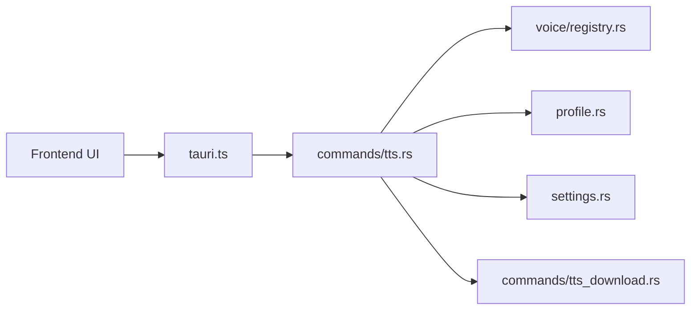

# Voice Management and Profiles

<cite>
**Referenced Files in This Document**
- [registry.rs](file://src-tauri/src/modules/tts/voice/registry.rs)
- [profile.rs](file://src-tauri/src/modules/tts/profile.rs)
- [settings.rs](file://src-tauri/src/modules/tts/settings.rs)
- [tts.rs](file://src-tauri/src/commands/tts.rs)
- [tts_download.rs](file://src-tauri/src/commands/tts_download.rs)
- [TtsProfilePicker.tsx](file://src/modules/chat/TtsProfilePicker.tsx)
- [MessageVoiceButton.tsx](file://src/modules/chat/MessageVoiceButton.tsx)
- [AgentVoicePicker.tsx](file://src/modules/settings/pages/AgentVoicePicker.tsx)
- [tauri.ts](file://src/lib/tauri.ts)
- [tts_user_voice_smoke.rs](file://src-tauri/tests/tts_user_voice_smoke.rs)
- [TtsModelSection.tsx](file://src/modules/settings/pages/TtsModelSection.tsx)
</cite>

## Table of Contents
1. [Introduction](#introduction)
2. [Project Structure](#project-structure)
3. [Core Components](#core-components)
4. [Architecture Overview](#architecture-overview)
5. [Detailed Component Analysis](#detailed-component-analysis)
6. [Dependency Analysis](#dependency-analysis)
7. [Performance Considerations](#performance-considerations)
8. [Troubleshooting Guide](#troubleshooting-guide)
9. [Conclusion](#conclusion)
10. [Appendices](#appendices)

## Introduction
This document describes If2Ai’s voice management system with a focus on the voice registry architecture, voice profile configuration, and voice selection mechanisms. It explains how voices are discovered and categorized (builtin, bundled, user-uploaded), how profiles encapsulate voice + settings + postprocessing, and how the chat UI integrates voice selection and preview. It also covers voice model download/installation, compatibility/version checks, and practical examples for configuration, switching, and customization. Finally, it provides troubleshooting and optimization guidance for voice quality and latency.

## Project Structure
The voice management system spans both the Tauri backend and the React frontend:
- Backend modules define voice registries, profiles, settings, and TTS commands.
- Frontend components provide the voice picker UI, profile picker, and voice preview.
- Commands bridge frontend requests to backend orchestration and model downloads.

**Diagram sources**
- [AgentVoicePicker.tsx:1-527](file://src/modules/settings/pages/AgentVoicePicker.tsx#L1-L527)
- [TtsProfilePicker.tsx:1-177](file://src/modules/chat/TtsProfilePicker.tsx#L1-L177)
- [MessageVoiceButton.tsx:32-59](file://src/modules/chat/MessageVoiceButton.tsx#L32-L59)
- [tauri.ts:1800-2000](file://src/lib/tauri.ts#L1800-L2000)
- [tts.rs:1-200](file://src-tauri/src/commands/tts.rs#L1-L200)
- [tts_download.rs:1-481](file://src-tauri/src/commands/tts_download.rs#L1-L481)
- [registry.rs:1-308](file://src-tauri/src/modules/tts/voice/registry.rs#L1-L308)
- [profile.rs:1-536](file://src-tauri/src/modules/tts/profile.rs#L1-L536)
- [settings.rs:1-405](file://src-tauri/src/modules/tts/settings.rs#L1-L405)

**Section sources**
- [registry.rs:1-308](file://src-tauri/src/modules/tts/voice/registry.rs#L1-L308)
- [profile.rs:1-536](file://src-tauri/src/modules/tts/profile.rs#L1-L536)
- [settings.rs:1-405](file://src-tauri/src/modules/tts/settings.rs#L1-L405)
- [tts.rs:1-200](file://src-tauri/src/commands/tts.rs#L1-L200)
- [tts_download.rs:1-481](file://src-tauri/src/commands/tts_download.rs#L1-L481)
- [TtsProfilePicker.tsx:1-177](file://src/modules/chat/TtsProfilePicker.tsx#L1-L177)
- [MessageVoiceButton.tsx:32-59](file://src/modules/chat/MessageVoiceButton.tsx#L32-L59)
- [AgentVoicePicker.tsx:1-527](file://src/modules/settings/pages/AgentVoicePicker.tsx#L1-L527)
- [tauri.ts:1800-2000](file://src/lib/tauri.ts#L1800-L2000)

## Core Components
- Voice Registry: Scans and categorizes voices from builtin manifests, bundled resources, and user uploads. Produces VoiceAsset entries with kind, display name, language, and preview availability.
- TTS Profiles: Named recipes combining a voice id, TTS settings snapshot, and lightweight postprocessing flags. Persisted in a profile book with a default profile id.
- TTS Settings: User preferences for playback rate, quality preset, frame limits, repetition penalty, seed, and normalization. Applied to generation parameters.
- TTS Commands: Orchestrates voice resolution, provider lifecycle, streaming synthesis, and health/warmup status. Exposes commands for buffered synthesis, streaming, and model downloads.
- Voice Picker UI: Settings page for managing voices (upload, rename, delete, set as agent voice) and previewing original vs synthesized audio. Chat-side profile picker for quick switching.

**Section sources**
- [registry.rs:44-144](file://src-tauri/src/modules/tts/voice/registry.rs#L44-L144)
- [profile.rs:64-142](file://src-tauri/src/modules/tts/profile.rs#L64-L142)
- [settings.rs:90-124](file://src-tauri/src/modules/tts/settings.rs#L90-L124)
- [tts.rs:39-112](file://src-tauri/src/commands/tts.rs#L39-L112)
- [AgentVoicePicker.tsx:81-110](file://src/modules/settings/pages/AgentVoicePicker.tsx#L81-L110)
- [TtsProfilePicker.tsx:43-80](file://src/modules/chat/TtsProfilePicker.tsx#L43-L80)

## Architecture Overview
The system separates concerns across layers:
- Voice discovery and metadata live in the backend registry.
- Profiles and settings persist user choices and are synchronized to the UI.
- Commands coordinate synthesis, streaming, and model lifecycle.
- Frontend components render pickers, previews, and integrate with active profile selection.

**Diagram sources**
- [TtsProfilePicker.tsx:49-80](file://src/modules/chat/TtsProfilePicker.tsx#L49-L80)
- [tauri.ts:1836-1854](file://src/lib/tauri.ts#L1836-L1854)
- [tts.rs:118-125](file://src-tauri/src/commands/tts.rs#L118-L125)
- [registry.rs:77-144](file://src-tauri/src/modules/tts/voice/registry.rs#L77-L144)
- [profile.rs:144-159](file://src-tauri/src/modules/tts/profile.rs#L144-L159)

## Detailed Component Analysis

### Voice Registry and Manifest System
The registry scans three sources:
- Builtin: From manifest with prebaked codes; audio preview files are resolved from resource or demo directories.
- Bundled: Files in the application resource voices directory not covered by the manifest.
- User Uploaded: Files in the user data voices directory with optional sidecar metadata.

Key behaviors:
- Audio preview availability is computed from the presence of a valid audio file path.
- Sidecar metadata (display_name) augments user-uploaded voice identity.
- Language inference supports zh/en/jp and similar prefixes.

**Diagram sources**
- [registry.rs:77-144](file://src-tauri/src/modules/tts/voice/registry.rs#L77-L144)
- [registry.rs:146-184](file://src-tauri/src/modules/tts/voice/registry.rs#L146-L184)
- [registry.rs:186-198](file://src-tauri/src/modules/tts/voice/registry.rs#L186-L198)

**Section sources**
- [registry.rs:44-144](file://src-tauri/src/modules/tts/voice/registry.rs#L44-L144)
- [registry.rs:146-198](file://src-tauri/src/modules/tts/voice/registry.rs#L146-L198)
- [tts_user_voice_smoke.rs:21-78](file://src-tauri/tests/tts_user_voice_smoke.rs#L21-L78)

### TTS Profiles and Postprocessing
Profiles encapsulate:
- Voice id (maps to a VoiceAsset)
- Flattened TTS settings snapshot
- Lightweight postprocessing flags (soften punctuation, add trailing dots)

Built-in profiles seed the profile book on first run. Upsert operations enforce built-in immutability for protected fields while allowing user edits to name, description, voice id, settings, and postprocess flags.

**Diagram sources**
- [profile.rs:64-142](file://src-tauri/src/modules/tts/profile.rs#L64-L142)
- [profile.rs:135-142](file://src-tauri/src/modules/tts/profile.rs#L135-L142)
- [profile.rs:91-119](file://src-tauri/src/modules/tts/profile.rs#L91-L119)

**Section sources**
- [profile.rs:64-142](file://src-tauri/src/modules/tts/profile.rs#L64-L142)
- [profile.rs:272-382](file://src-tauri/src/modules/tts/profile.rs#L272-L382)

### TTS Settings and Quality Presets
Settings define:
- Playback rate (frontend WebAudio playback rate)
- Quality preset (Natural/Balanced/Precise) mapping to sampler parameters
- Max new frames per chunk (latency vs truncation tradeoff)
- Audio repetition penalty
- Optional fixed RNG seed
- Robust text normalization flag

These settings are persisted to a TOML file and applied to generation parameters across synthesis paths.

**Diagram sources**
- [settings.rs:126-207](file://src-tauri/src/modules/tts/settings.rs#L126-L207)
- [settings.rs:179-190](file://src-tauri/src/modules/tts/settings.rs#L179-L190)

**Section sources**
- [settings.rs:90-124](file://src-tauri/src/modules/tts/settings.rs#L90-L124)
- [settings.rs:126-207](file://src-tauri/src/modules/tts/settings.rs#L126-L207)

### Voice Selection and Chat Integration
The chat-side profile picker lists available profiles and shows effective voice id, playback rate, and quality. It integrates with active profile management and cross-window synchronization.

**Diagram sources**
- [MessageVoiceButton.tsx:43-59](file://src/modules/chat/MessageVoiceButton.tsx#L43-L59)
- [TtsProfilePicker.tsx:49-80](file://src/modules/chat/TtsProfilePicker.tsx#L49-L80)
- [tauri.ts:1836-1854](file://src/lib/tauri.ts#L1836-L1854)
- [tts.rs:118-125](file://src-tauri/src/commands/tts.rs#L118-L125)

**Section sources**
- [TtsProfilePicker.tsx:43-80](file://src/modules/chat/TtsProfilePicker.tsx#L43-L80)
- [MessageVoiceButton.tsx:32-59](file://src/modules/chat/MessageVoiceButton.tsx#L32-L59)
- [tauri.ts:1800-1884](file://src/lib/tauri.ts#L1800-L1884)

### Voice Picker UI and Preview
The Settings voice picker allows:
- Filtering by voice kind (all/builtin/bundled/user)
- Uploading user voices with drag-and-drop and file selection
- Renaming and deleting user voices
- Setting a voice as the agent voice and enabling chat voice replies
- Previewing original audio and synthesized voice samples

**Diagram sources**
- [AgentVoicePicker.tsx:397-407](file://src/modules/settings/pages/AgentVoicePicker.tsx#L397-L407)
- [AgentVoicePicker.tsx:81-110](file://src/modules/settings/pages/AgentVoicePicker.tsx#L81-L110)
- [AgentVoicePicker.tsx:327-372](file://src/modules/settings/pages/AgentVoicePicker.tsx#L327-L372)
- [AgentVoicePicker.tsx:485-523](file://src/modules/settings/pages/AgentVoicePicker.tsx#L485-L523)

**Section sources**
- [AgentVoicePicker.tsx:81-110](file://src/modules/settings/pages/AgentVoicePicker.tsx#L81-L110)
- [AgentVoicePicker.tsx:327-372](file://src/modules/settings/pages/AgentVoicePicker.tsx#L327-L372)
- [AgentVoicePicker.tsx:485-523](file://src/modules/settings/pages/AgentVoicePicker.tsx#L485-L523)

### Voice Download and Installation
The system supports downloading and installing TTS model files from Hugging Face with progress tracking and resumable transfers. The Settings UI surfaces readiness and provides controls to start downloads.

**Diagram sources**
- [TtsModelSection.tsx:227-257](file://src/modules/settings/pages/TtsModelSection.tsx#L227-L257)
- [tts_download.rs:176-218](file://src-tauri/src/commands/tts_download.rs#L176-L218)
- [tts_download.rs:242-277](file://src-tauri/src/commands/tts_download.rs#L242-L277)
- [tts_download.rs:282-403](file://src-tauri/src/commands/tts_download.rs#L282-L403)

**Section sources**
- [tts_download.rs:176-218](file://src-tauri/src/commands/tts_download.rs#L176-L218)
- [tts_download.rs:242-277](file://src-tauri/src/commands/tts_download.rs#L242-L277)
- [tts_download.rs:282-403](file://src-tauri/src/commands/tts_download.rs#L282-L403)
- [TtsModelSection.tsx:227-257](file://src/modules/settings/pages/TtsModelSection.tsx#L227-L257)

## Dependency Analysis
The voice system exhibits clear separation of concerns:
- Frontend UI components depend on typed APIs in tauri.ts for invoking backend commands.
- Backend commands depend on registry, profile, and settings modules.
- Model lifecycle and downloads are isolated in dedicated modules.

**Diagram sources**
- [tauri.ts:1800-2000](file://src/lib/tauri.ts#L1800-L2000)
- [tts.rs:1-200](file://src-tauri/src/commands/tts.rs#L1-L200)
- [registry.rs:1-308](file://src-tauri/src/modules/tts/voice/registry.rs#L1-L308)
- [profile.rs:1-536](file://src-tauri/src/modules/tts/profile.rs#L1-L536)
- [settings.rs:1-405](file://src-tauri/src/modules/tts/settings.rs#L1-L405)
- [tts_download.rs:1-481](file://src-tauri/src/commands/tts_download.rs#L1-L481)

**Section sources**
- [tauri.ts:1800-2000](file://src/lib/tauri.ts#L1800-L2000)
- [tts.rs:1-200](file://src-tauri/src/commands/tts.rs#L1-L200)
- [registry.rs:1-308](file://src-tauri/src/modules/tts/voice/registry.rs#L1-L308)
- [profile.rs:1-536](file://src-tauri/src/modules/tts/profile.rs#L1-L536)
- [settings.rs:1-405](file://src-tauri/src/modules/tts/settings.rs#L1-L405)
- [tts_download.rs:1-481](file://src-tauri/src/commands/tts_download.rs#L1-L481)

## Performance Considerations
- Provider lazy loading and eviction reduce cold-start overhead and memory footprint; the provider handle tracks state and queue depth for streaming synthesis.
- Playback rate is applied at the frontend WebAudio layer for immediate, artifact-free speed adjustments.
- Quality presets tune sampler parameters to balance naturalness and stability; lower temperatures and tighter tops improve predictability for formal narration.
- First-byte latency can be reduced by lowering max_new_frames per chunk, with potential sentence truncation tradeoffs.
- Thread count and memory budgets are configurable and validated in tests to constrain resource usage.

[No sources needed since this section provides general guidance]

## Troubleshooting Guide
Common issues and remedies:
- No voices appear in the picker:
  - Verify bundled voices exist in the resource voices directory and user voices in the app data voices directory.
  - Confirm sidecar metadata for user voices if renaming is expected.
- Profile changes not reflected:
  - Ensure the default profile id is valid; the profile book normalizes invalid ids on load.
  - Cross-window changes are propagated via broadcast events; confirm listeners are active.
- Download failures:
  - Check network connectivity and mirror URL configuration; downloads use HEAD requests to fetch sizes and streaming writes with periodic progress updates.
- Provider state errors:
  - Inspect health and warmup status; the provider handle transitions through notLoaded/loading/loaded/failed/evicted states.

**Section sources**
- [registry.rs:146-198](file://src-tauri/src/modules/tts/voice/registry.rs#L146-L198)
- [profile.rs:244-265](file://src-tauri/src/modules/tts/profile.rs#L244-L265)
- [tts.rs:200-223](file://src-tauri/src/commands/tts.rs#L200-L223)
- [tts_download.rs:405-422](file://src-tauri/src/commands/tts_download.rs#L405-L422)

## Conclusion
If2Ai’s voice management system cleanly separates voice discovery, profile composition, and user settings, while integrating seamlessly with the chat UI and model lifecycle. The registry supports multiple voice sources, profiles encapsulate user preferences, and the Settings UI provides powerful tools for uploading, previewing, and organizing voices. Download and warmup orchestration ensures reliable model availability, and performance tuning options help balance latency, quality, and resource usage.

[No sources needed since this section summarizes without analyzing specific files]

## Appendices

### Practical Examples
- Configure a profile:
  - Open Settings → TTS Profiles, create or edit a profile, choose a voice id, adjust playback rate and quality preset, and save.
- Switch voices in chat:
  - Use the chat-side profile picker to quickly switch the active profile; the effective voice and parameters are derived from the selected profile.
- Create a custom voice:
  - Upload a 5–30 second human voice sample (.wav/.mp3/.flac/.ogg/.m4a) via the voice picker; optionally add a sidecar JSON with display_name; preview original and synthesized samples.
- Optimize quality and latency:
  - For faster first-byte latency, reduce max_new_frames; for formal narration, choose Precise preset and increase repetition penalty slightly to avoid repetition loops.

[No sources needed since this section provides general guidance]