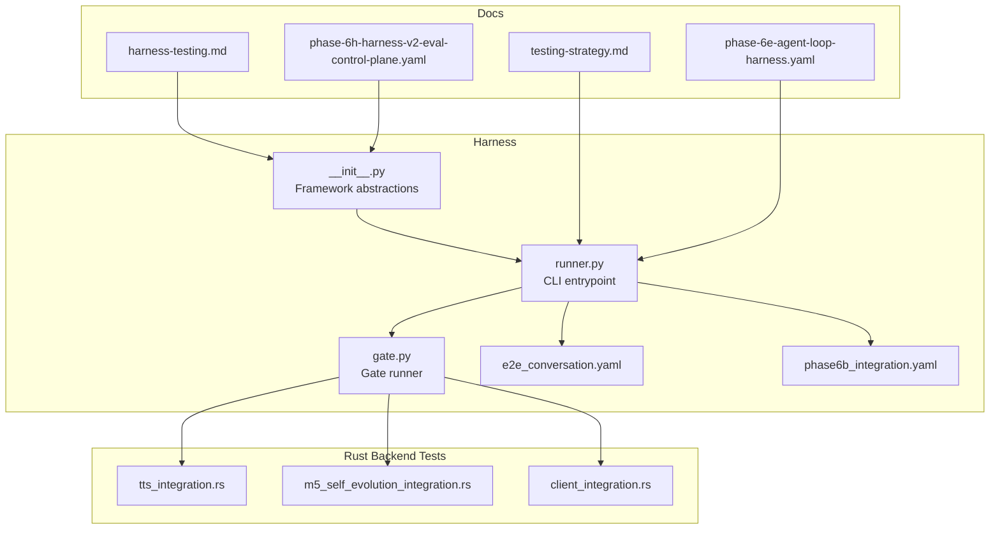
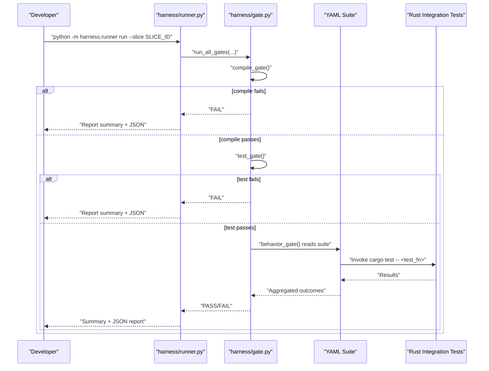
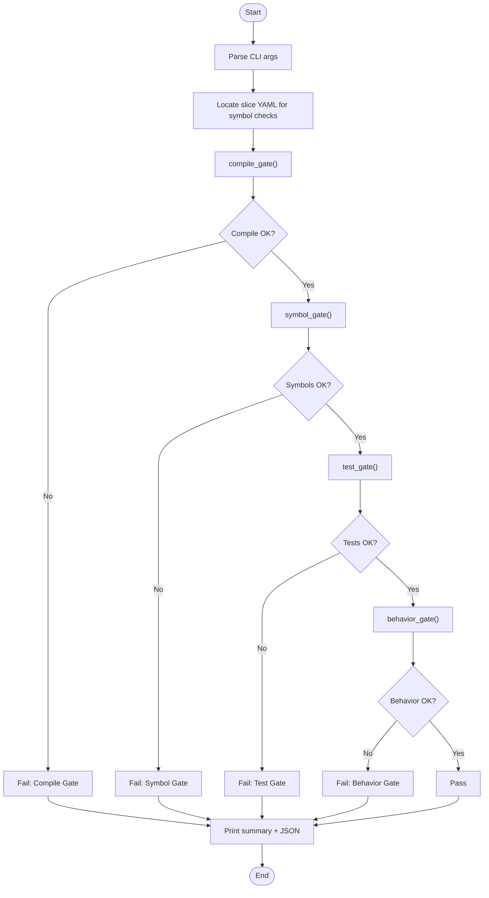
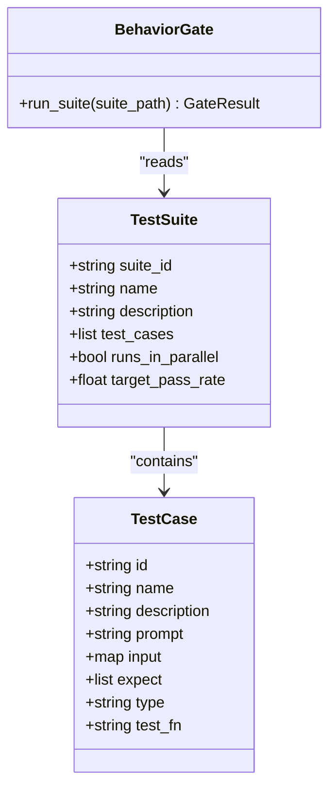
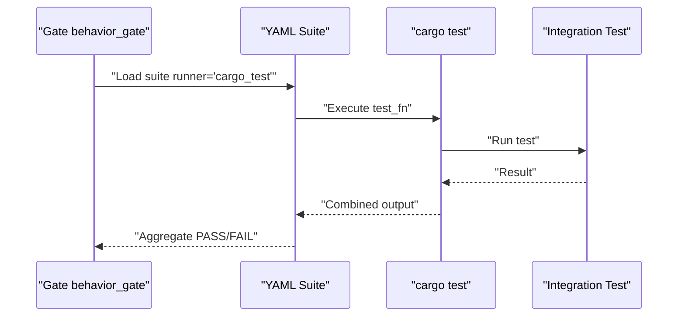
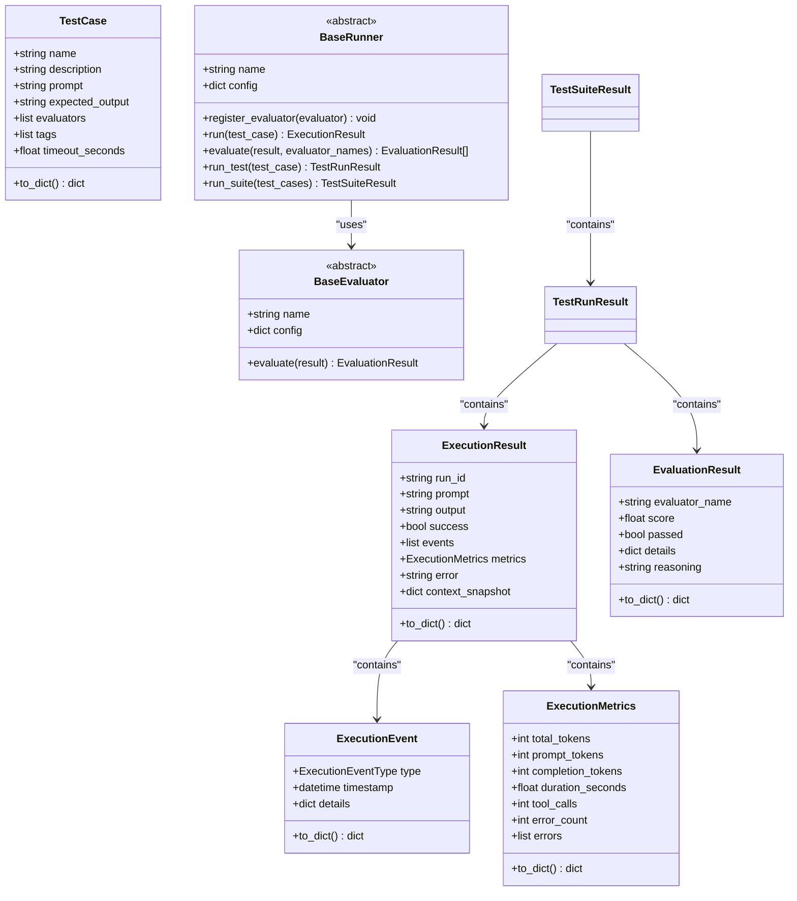
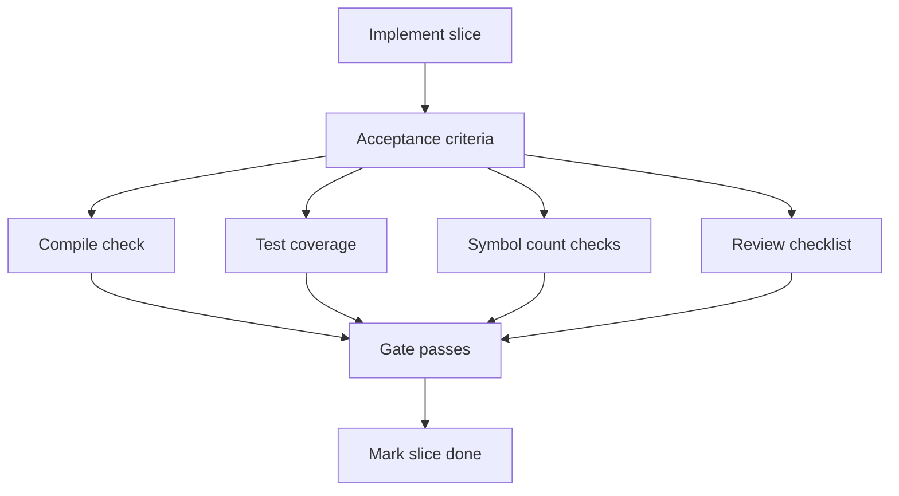
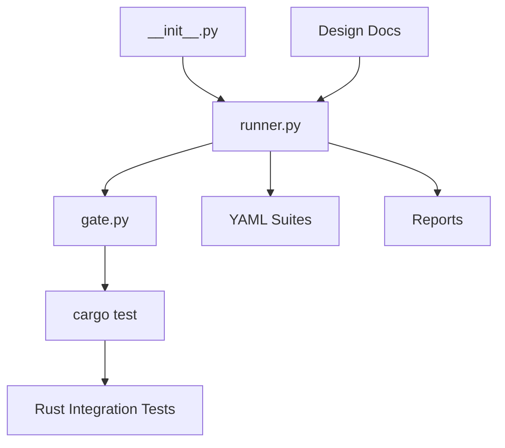

# Testing Framework

<cite>
**Referenced Files in This Document**
- [runner.py](file://harness/runner.py)
- [gate.py](file://harness/gate.py)
- [__init__.py](file://harness/__init__.py)
- [e2e_conversation.yaml](file://harness/suites/e2e_conversation.yaml)
- [phase6b_integration.yaml](file://harness/suites/phase6b_integration.yaml)
- [testing-strategy.md](file://docs/design-docs/testing-strategy.md)
- [harness-testing.md](file://docs/design-docs/harness-testing.md)
- [phase-6e-agent-loop-harness.yaml](file://docs/_legacy/exec-plans/active/phase-6e-agent-loop-harness.yaml)
- [phase-6h-harness-v2-eval-control-plane.yaml](file://docs/_legacy/exec-plans/active/phase-6h-harness-v2-eval-control-plane.yaml)
- [tts_integration.rs](file://src-tauri/tests/tts_integration.rs)
- [m5_self_evolution_integration.rs](file://src-tauri/tests/m5_self_evolution_integration.rs)
- [client_integration.rs](file://rust/crates/api/tests/client_integration.rs)
- [copilot-instructions.md](file://.github/copilot-instructions.md)
</cite>

## Table of Contents
1. [Introduction](#introduction)
2. [Project Structure](#project-structure)
3. [Core Components](#core-components)
4. [Architecture Overview](#architecture-overview)
5. [Detailed Component Analysis](#detailed-component-analysis)
6. [Dependency Analysis](#dependency-analysis)
7. [Performance Considerations](#performance-considerations)
8. [Troubleshooting Guide](#troubleshooting-guide)
9. [Conclusion](#conclusion)
10. [Appendices](#appendices)

## Introduction
This document describes If2Ai's comprehensive testing framework for quality assurance. It covers the harness-based gate system for integration and behavior validation, the evaluation framework for measuring agent performance and system reliability, and the execution environment for unit, integration, and end-to-end scenarios. It also documents test data management, reporting mechanisms, continuous integration setup, best practices, debugging strategies, and coverage maintenance.

## Project Structure
The testing system spans multiple layers:
- Harness runner and gates for compile-time, test-time, and behavior validation
- Test suites (YAML) that define behavior tests mapped to Rust integration tests
- Rust integration tests validating backend behavior and cross-module interactions
- Harness framework abstractions for execution, evaluation, and reporting
- Legacy execution plans that define acceptance criteria and review checkpoints

**Diagram sources**
- [runner.py:1-718](file://harness/runner.py#L1-L718)
- [gate.py:1-414](file://harness/gate.py#L1-L414)
- [__init__.py:1-366](file://harness/__init__.py#L1-L366)
- [e2e_conversation.yaml:1-120](file://harness/suites/e2e_conversation.yaml#L1-L120)
- [phase6b_integration.yaml:1-145](file://harness/suites/phase6b_integration.yaml#L1-L145)
- [testing-strategy.md:1-496](file://docs/design-docs/testing-strategy.md#L1-L496)
- [harness-testing.md:1-675](file://docs/design-docs/harness-testing.md#L1-L675)
- [phase-6e-agent-loop-harness.yaml:1-203](file://docs/_legacy/exec-plans/active/phase-6e-agent-loop-harness.yaml#L1-L203)
- [phase-6h-harness-v2-eval-control-plane.yaml:1-434](file://docs/_legacy/exec-plans/active/phase-6h-harness-v2-eval-control-plane.yaml#L1-L434)

**Section sources**
- [runner.py:1-718](file://harness/runner.py#L1-L718)
- [gate.py:1-414](file://harness/gate.py#L1-L414)
- [__init__.py:1-366](file://harness/__init__.py#L1-L366)
- [testing-strategy.md:1-496](file://docs/design-docs/testing-strategy.md#L1-L496)
- [harness-testing.md:1-675](file://docs/design-docs/harness-testing.md#L1-L675)
- [phase-6e-agent-loop-harness.yaml:1-203](file://docs/_legacy/exec-plans/active/phase-6e-agent-loop-harness.yaml#L1-L203)
- [phase-6h-harness-v2-eval-control-plane.yaml:1-434](file://docs/_legacy/exec-plans/active/phase-6h-harness-v2-eval-control-plane.yaml#L1-L434)

## Core Components
- Harness Runner: CLI entrypoint that executes gates and suites, emitting structured reports and summaries.
- Gate System: Three-layer validation (compile, test, behavior) with timeouts and structured results.
- Test Suites: YAML-defined behavior tests that map to Rust integration tests.
- Rust Integration Tests: Unit and integration tests validating backend behavior, including TTS, M5 self-evolution, and API client.
- Harness Framework Abstractions: Execution, metrics, evaluation, and reporting models for agent behavior assessment.

Key responsibilities:
- Compile Gate: Fast syntax/type checks using cargo check.
- Test Gate: Unit tests with single-threaded execution to reduce flakiness.
- Behavior Gate: Executes suite-defined test functions and aggregates results.
- Reporting: JSON and summary outputs for CI consumption.

**Section sources**
- [runner.py:26-75](file://harness/runner.py#L26-L75)
- [gate.py:190-352](file://harness/gate.py#L190-L352)
- [e2e_conversation.yaml:12-120](file://harness/suites/e2e_conversation.yaml#L12-L120)
- [phase6b_integration.yaml:10-145](file://harness/suites/phase6b_integration.yaml#L10-L145)
- [tts_integration.rs:1-463](file://src-tauri/tests/tts_integration.rs#L1-L463)
- [m5_self_evolution_integration.rs:1-383](file://src-tauri/tests/m5_self_evolution_integration.rs#L1-L383)
- [client_integration.rs:1-484](file://rust/crates/api/tests/client_integration.rs#L1-L484)
- [__init__.py:30-366](file://harness/__init__.py#L30-L366)

## Architecture Overview
The testing architecture enforces a strict gate flow and leverages YAML suites to drive behavior validation against Rust integration tests.

**Diagram sources**
- [runner.py:26-75](file://harness/runner.py#L26-L75)
- [gate.py:359-413](file://harness/gate.py#L359-L413)
- [e2e_conversation.yaml:12-120](file://harness/suites/e2e_conversation.yaml#L12-L120)

## Detailed Component Analysis

### Harness Runner and Gate System
The runner parses CLI arguments, locates slice YAML for symbol checks, executes gates, and prints structured reports. Gates enforce:
- Compile Gate: cargo check with timeout
- Symbol Gate: verifies required symbols exist in impl targets
- Test Gate: cargo test with single-threaded execution
- Behavior Gate: executes suite-defined test functions and aggregates results

**Diagram sources**
- [runner.py:26-75](file://harness/runner.py#L26-L75)
- [gate.py:359-413](file://harness/gate.py#L359-L413)

**Section sources**
- [runner.py:26-75](file://harness/runner.py#L26-L75)
- [gate.py:190-352](file://harness/gate.py#L190-L352)

### Test Suites and Behavior Validation
Test suites define behavior tests with runner types and test cases. The behavior gate executes suite-defined test functions, aggregating outputs and returning PASS/FAIL.

Examples:
- E2E Conversation Suite: Validates end-to-end conversation flows, tool usage, budget enforcement, persistence, and concurrency.
- Phase 6B Integration Suite: Validates memory control plane modules, token budget, vector search, HRR, self-learning, trajectory learning, and upstream compatibility.

**Diagram sources**
- [e2e_conversation.yaml:6-120](file://harness/suites/e2e_conversation.yaml#L6-L120)
- [phase6b_integration.yaml:5-145](file://harness/suites/phase6b_integration.yaml#L5-L145)
- [gate.py:249-352](file://harness/gate.py#L249-L352)

**Section sources**
- [e2e_conversation.yaml:12-120](file://harness/suites/e2e_conversation.yaml#L12-L120)
- [phase6b_integration.yaml:10-145](file://harness/suites/phase6b_integration.yaml#L10-L145)
- [gate.py:249-352](file://harness/gate.py#L249-L352)

### Rust Integration Tests
Rust integration tests validate backend behavior without external dependencies:
- TTS Integration: Buffered synthesis, streaming lifecycle, warmup integration, voice presets, and edge cases.
- M5 Self-Evolution Integration: Cross-module integration covering registration, evaluation, promotion, activation, rollback, and reflection generation.
- API Client Integration: Message posting, streaming SSE events, retries, provider dispatch, and error handling.

**Diagram sources**
- [gate.py:249-352](file://harness/gate.py#L249-L352)
- [tts_integration.rs:22-462](file://src-tauri/tests/tts_integration.rs#L22-L462)
- [m5_self_evolution_integration.rs:96-382](file://src-tauri/tests/m5_self_evolution_integration.rs#L96-L382)
- [client_integration.rs:15-483](file://rust/crates/api/tests/client_integration.rs#L15-L483)

**Section sources**
- [tts_integration.rs:1-463](file://src-tauri/tests/tts_integration.rs#L1-L463)
- [m5_self_evolution_integration.rs:1-383](file://src-tauri/tests/m5_self_evolution_integration.rs#L1-L383)
- [client_integration.rs:1-484](file://rust/crates/api/tests/client_integration.rs#L1-L484)

### Harness Framework Abstractions
The framework defines execution events, metrics, evaluation results, test cases, and runners for consistent evaluation and reporting.

**Diagram sources**
- [__init__.py:30-366](file://harness/__init__.py#L30-L366)

**Section sources**
- [__init__.py:30-366](file://harness/__init__.py#L30-L366)

### Execution Plans and Acceptance Criteria
Legacy execution plans define acceptance criteria and review checklists for slices, ensuring implementation completeness and quality gates before marking slices done.

**Diagram sources**
- [phase-6e-agent-loop-harness.yaml:19-182](file://docs/_legacy/exec-plans/active/phase-6e-agent-loop-harness.yaml#L19-L182)
- [phase-6h-harness-v2-eval-control-plane.yaml:35-297](file://docs/_legacy/exec-plans/active/phase-6h-harness-v2-eval-control-plane.yaml#L35-L297)

**Section sources**
- [phase-6e-agent-loop-harness.yaml:19-182](file://docs/_legacy/exec-plans/active/phase-6e-agent-loop-harness.yaml#L19-L182)
- [phase-6h-harness-v2-eval-control-plane.yaml:35-297](file://docs/_legacy/exec-plans/active/phase-6h-harness-v2-eval-control-plane.yaml#L35-L297)

## Dependency Analysis
The testing system exhibits clear separation of concerns:
- Runner depends on Gate for validation and on YAML suites for behavior tests.
- Gate depends on cargo commands and suite YAML to execute Rust tests.
- Rust integration tests depend on internal modules and providers.
- Harness framework abstractions are reused across evaluation and reporting.

**Diagram sources**
- [runner.py:26-75](file://harness/runner.py#L26-L75)
- [gate.py:359-413](file://harness/gate.py#L359-L413)
- [__init__.py:230-332](file://harness/__init__.py#L230-L332)

**Section sources**
- [runner.py:26-75](file://harness/runner.py#L26-L75)
- [gate.py:359-413](file://harness/gate.py#L359-L413)
- [__init__.py:230-332](file://harness/__init__.py#L230-L332)

## Performance Considerations
- Gate timeouts: compile (≤120s), test (≤180s), behavior (≤120s) ensure CI responsiveness.
- Single-threaded test execution reduces flakiness from concurrent resource contention.
- Symbol checks provide fast feedback on implementation completeness.
- YAML suites enable targeted behavior validation without full E2E overhead.

[No sources needed since this section provides general guidance]

## Troubleshooting Guide
Common issues and resolutions:
- Compile failures: Inspect cargo check output; fix syntax/type errors before proceeding.
- Test failures: Run unit tests locally with single-threaded execution; verify fixtures and environment.
- Behavior gate failures: Validate suite runner type and test function names; ensure cargo test filters match suite entries.
- Harness reports: Review JSON reports and summaries for first failure details; check gate durations and outputs.
- Diff gate failures: Ensure meaningful code changes; minimum line thresholds prevent docs-only updates from completing slices.

**Section sources**
- [runner.py:133-228](file://harness/runner.py#L133-L228)
- [gate.py:359-413](file://harness/gate.py#L359-L413)

## Conclusion
If2Ai’s testing framework combines a robust gate system, YAML-driven behavior suites, and comprehensive Rust integration tests to ensure reliable agent behavior and system quality. The framework emphasizes determinism, observability, and continuous validation through structured reports and acceptance criteria aligned with execution plans.

[No sources needed since this section summarizes without analyzing specific files]

## Appendices

### Practical Examples

- Running a slice with harness runner:
  - Use the runner to execute gates and suites for a specific slice, capturing JSON reports and summaries for CI.
  - Reference: [runner.py:26-75](file://harness/runner.py#L26-L75)

- Writing a behavior suite:
  - Define runner type and test cases mapping to cargo test functions.
  - Reference: [e2e_conversation.yaml:12-120](file://harness/suites/e2e_conversation.yaml#L12-L120), [phase6b_integration.yaml:10-145](file://harness/suites/phase6b_integration.yaml#L10-L145)

- Executing Rust integration tests:
  - Run specific test modules or functions to validate backend behavior.
  - References: [tts_integration.rs:22-462](file://src-tauri/tests/tts_integration.rs#L22-L462), [m5_self_evolution_integration.rs:96-382](file://src-tauri/tests/m5_self_evolution_integration.rs#L96-L382), [client_integration.rs:15-483](file://rust/crates/api/tests/client_integration.rs#L15-L483)

- Harness evaluation abstractions:
  - Use execution events, metrics, and evaluation results to assess agent behavior comprehensively.
  - Reference: [__init__.py:30-366](file://harness/__init__.py#L30-L366)

### Continuous Integration Setup
- CI jobs should run unit tests, coverage checks, integration tests, and harness evaluation in sequence.
- Upload artifacts and reports for visibility and regression tracking.
- References: [testing-strategy.md:307-345](file://docs/design-docs/testing-strategy.md#L307-L345), [harness-testing.md:612-675](file://docs/design-docs/harness-testing.md#L612-L675)

### Best Practices
- Prefer deterministic tests; avoid flaky concurrency.
- Use symbol checks to ensure implementation completeness.
- Maintain acceptance criteria and review checklists in execution plans.
- Keep test data minimal and reproducible; leverage fixtures and temporary directories for integration tests.
- Reference: [testing-strategy.md:422-479](file://docs/design-docs/testing-strategy.md#L422-L479), [phase-6e-agent-loop-harness.yaml:37-90](file://docs/_legacy/exec-plans/active/phase-6e-agent-loop-harness.yaml#L37-L90)

### Test Data Management
- Harness suites define structured inputs and expectations for behavior validation.
- Integration tests use temporary directories and mock providers to isolate environments.
- References: [e2e_conversation.yaml:19-119](file://harness/suites/e2e_conversation.yaml#L19-L119), [m5_self_evolution_integration.rs:96-114](file://src-tauri/tests/m5_self_evolution_integration.rs#L96-L114)

### Project Context
- Copilot instructions outline project structure and development workflow.
- Reference: [copilot-instructions.md:1-34](file://.github/copilot-instructions.md#L1-L34)