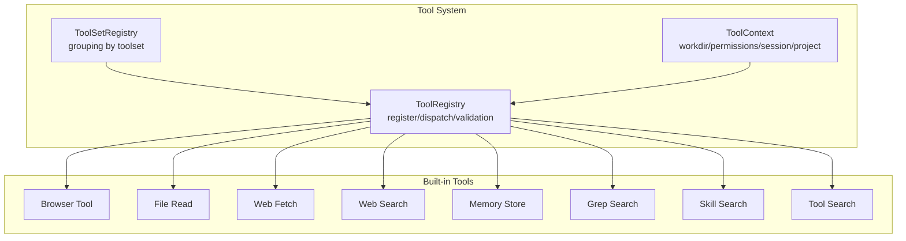
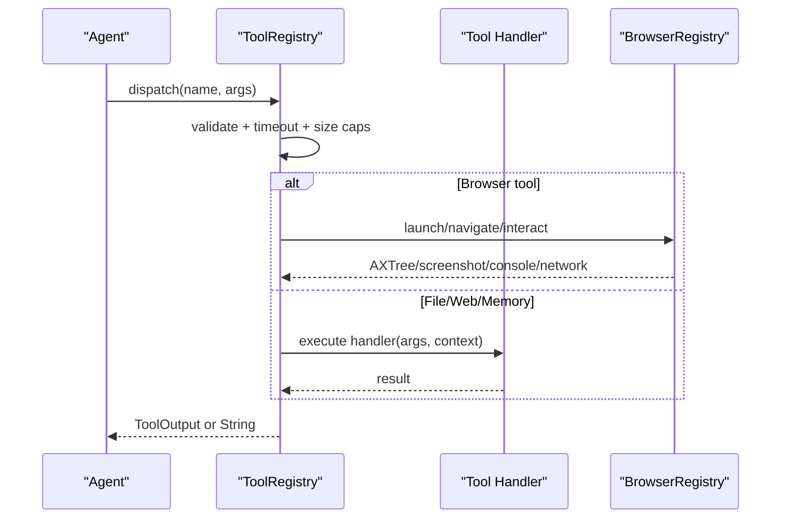
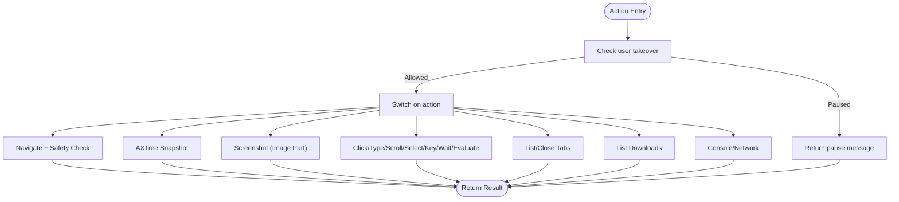
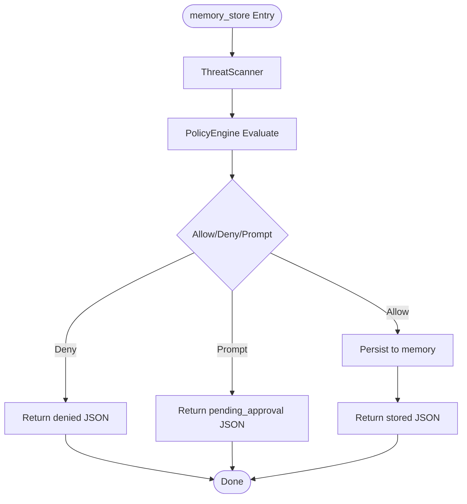
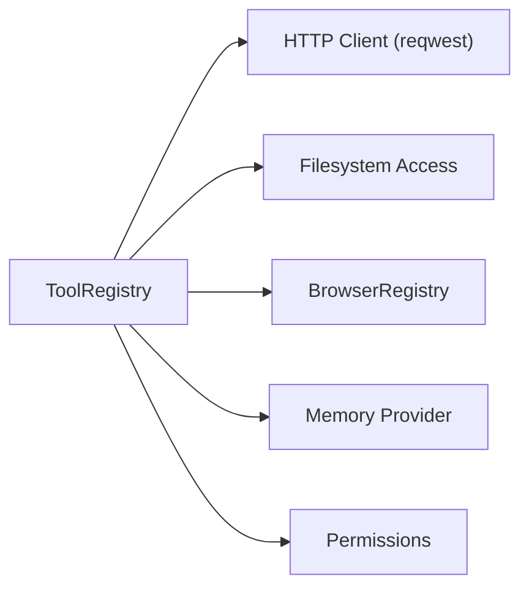

# Built-in Tools Reference

<cite>
**Referenced Files in This Document**
- [mod.rs](file://src-tauri/src/modules/tools/mod.rs)
- [registry.rs](file://src-tauri/src/modules/tools/registry.rs)
- [toolset.rs](file://src-tauri/src/modules/tools/toolset.rs)
- [context.rs](file://src-tauri/src/modules/tools/context.rs)
- [file_read.rs](file://src-tauri/src/modules/tools/builtin/file_read.rs)
- [web_search.rs](file://src-tauri/src/modules/tools/builtin/web_search.rs)
- [web_fetch.rs](file://src-tauri/src/modules/tools/builtin/web_fetch.rs)
- [memory_store.rs](file://src-tauri/src/modules/tools/builtin/memory_store.rs)
- [browser_tool.rs](file://src-tauri/src/modules/tools/builtin/browser_tool.rs)
- [grep_search.rs](file://src-tauri/src/modules/tools/builtin/grep_search.rs)
- [skill_search.rs](file://src-tauri/src/modules/tools/builtin/skill_search.rs)
- [tool_search.rs](file://src-tauri/src/modules/tools/builtin/tool_search.rs)
</cite>

## Table of Contents
1. [Introduction](#introduction)
2. [Project Structure](#project-structure)
3. [Core Components](#core-components)
4. [Architecture Overview](#architecture-overview)
5. [Detailed Component Analysis](#detailed-component-analysis)
6. [Dependency Analysis](#dependency-analysis)
7. [Performance Considerations](#performance-considerations)
8. [Troubleshooting Guide](#troubleshooting-guide)
9. [Conclusion](#conclusion)

## Introduction
This document provides a comprehensive reference for If2Ai’s built-in tool system. It explains how tools are registered, dispatched, and constrained, and documents each built-in tool with its purpose, parameters, return values, security and performance characteristics, and practical usage patterns. The tool system supports browser automation, file operations, web search/research/fetch, memory management, system commands, and utility tasks.

## Project Structure
The tool system is organized into:
- A registry that stores tool entries and dispatches calls with timeouts and size limits
- A toolset registry that groups tools by functional categories
- A context system that carries workdir and permission scope
- A collection of built-in tools under modules/tools/builtin

**Diagram sources**
- [mod.rs:26-172](file://src-tauri/src/modules/tools/mod.rs#L26-L172)
- [registry.rs:353-584](file://src-tauri/src/modules/tools/registry.rs#L353-L584)
- [toolset.rs:73-155](file://src-tauri/src/modules/tools/toolset.rs#L73-L155)
- [context.rs:9-29](file://src-tauri/src/modules/tools/context.rs#L9-L29)

**Section sources**
- [mod.rs:26-172](file://src-tauri/src/modules/tools/mod.rs#L26-L172)
- [registry.rs:353-584](file://src-tauri/src/modules/tools/registry.rs#L353-L584)
- [toolset.rs:73-155](file://src-tauri/src/modules/tools/toolset.rs#L73-L155)
- [context.rs:9-29](file://src-tauri/src/modules/tools/context.rs#L9-L29)

## Core Components
- ToolRegistry: central registry with concurrent access, validation, and dispatch with timeouts and size enforcement
- ToolEntry: encapsulates tool metadata, input schema, handler, and limits
- ToolSetRegistry: defines tool categories and membership
- ToolContext: carries session/project scope, workdir, and permission mode

Key behaviors:
- Dispatch validates existence and enabled state, applies timeouts, and enforces per-tool size caps
- High-risk tools require explicit per-session context unless explicitly allowed
- Tool definitions can be filtered by toolsets for controlled exposure

**Section sources**
- [registry.rs:147-183](file://src-tauri/src/modules/tools/registry.rs#L147-L183)
- [registry.rs:486-540](file://src-tauri/src/modules/tools/registry.rs#L486-L540)
- [registry.rs:114-139](file://src-tauri/src/modules/tools/registry.rs#L114-L139)
- [toolset.rs:21-71](file://src-tauri/src/modules/tools/toolset.rs#L21-L71)
- [context.rs:9-29](file://src-tauri/src/modules/tools/context.rs#L9-L29)

## Architecture Overview
The tool system integrates with the broader runtime and browser subsystems. Tools are registered at startup and exposed to the agent via OpenAI-compatible function definitions. Browser actions leverage a managed Chromium session with strict URL safety and observability.

**Diagram sources**
- [registry.rs:486-540](file://src-tauri/src/modules/tools/registry.rs#L486-L540)
- [browser_tool.rs:350-740](file://src-tauri/src/modules/tools/builtin/browser_tool.rs#L350-L740)

## Detailed Component Analysis

### Browser Automation Tools
- Tool: browser
- Purpose: control a headless Chromium session for navigation, interaction, and observation
- Toolset: browser
- Security:
  - Strict URL safety: rejects file://, javascript:, data:, and RFC-1918/cloud metadata addresses
  - User takeover pause: tool execution halts while user controls the browser
- Parameters:
  - action: start | stop | navigate | snapshot | screenshot | click | type | scroll | select | key | wait | evaluate | tabs | switch_tab | close_tab | downloads | console | network
  - Additional fields vary by action (e.g., url for navigate, ref for click/type/select)
- Return values:
  - Text snapshots, base64 JPEG for screenshots, lists of tabs/downloads, or console/network diagnostics
- Usage examples:
  - Start a browser, navigate to a URL, capture a screenshot, and click a target element by its data-if2ai-ref number
- Configuration options:
  - wait state: load | domcontentloaded | networkidle
  - timeout_ms for wait operations
- Performance characteristics:
  - Default timeout: 60s
  - Separate text and image size caps to accommodate screenshots
- Error scenarios:
  - URL safety violations, blocked hostnames/IP ranges, user takeover pause, CDPTab errors

**Diagram sources**
- [browser_tool.rs:350-740](file://src-tauri/src/modules/tools/builtin/browser_tool.rs#L350-L740)
- [browser_tool.rs:47-141](file://src-tauri/src/modules/tools/builtin/browser_tool.rs#L47-L141)

**Section sources**
- [browser_tool.rs:149-257](file://src-tauri/src/modules/tools/builtin/browser_tool.rs#L149-L257)
- [browser_tool.rs:350-740](file://src-tauri/src/modules/tools/builtin/browser_tool.rs#L350-L740)
- [browser_tool.rs:47-141](file://src-tauri/src/modules/tools/builtin/browser_tool.rs#L47-L141)

### File Operation Tools
- Tool: read_file
- Purpose: safely read file contents with offset/limit and UTF-8 validation
- Toolset: files
- Security:
  - Workdir allowlist and canonicalization
  - Sensitive path denylist (e.g., /etc/passwd, /etc/shadow, ~/.ssh/, ~/.aws/)
- Parameters:
  - path (required): file path
  - offset: byte offset
  - limit: max bytes to read (default 1MB)
- Return values:
  - UTF-8 decoded text or error messages
- Usage examples:
  - Read a log file from a specific offset with a size limit
- Configuration options:
  - Built-in max size: 1MB
  - Timeout: 30s
- Performance characteristics:
  - Reads up to 1MB by default; seeks to offset before reading
- Error scenarios:
  - Missing path, not a regular file, invalid UTF-8, sensitive path matched

**Section sources**
- [file_read.rs:22-98](file://src-tauri/src/modules/tools/builtin/file_read.rs#L22-L98)
- [file_read.rs:102-166](file://src-tauri/src/modules/tools/builtin/file_read.rs#L102-L166)

### Web Search and Research Tools
- Tool: web_search
- Purpose: search the web using configured providers (Tavily/Brave/Serper/SearXNG) or DuckDuckGo fallback
- Toolset: web
- Parameters:
  - query (required): search string
  - max_results: default 10
- Return values:
  - Formatted results with titles, snippets, and URLs
- Usage examples:
  - Search for technical documentation or current events
- Configuration options:
  - Provider selection and API keys via configuration
  - Notice returned when no key is configured
- Performance characteristics:
  - Default timeout: 25s
  - Max result size: 16KB
- Error scenarios:
  - Missing provider API key, HTTP errors, parsing failures

**Section sources**
- [web_search.rs:496-638](file://src-tauri/src/modules/tools/builtin/web_search.rs#L496-L638)

- Tool: web_fetch
- Purpose: fetch web page content with multiple extraction modes
- Toolset: web
- Parameters:
  - url (required): target URL
  - mode: auto | article | selector | text
  - selector: CSS selector for article extraction
  - max_length: max UTF-8 bytes (default 49152)
- Return values:
  - Extracted text content
- Usage examples:
  - Extract main article content from news sites or specific DOM sections
- Security:
  - SSRF protections for cloud metadata endpoints and blocked IP ranges
- Performance characteristics:
  - Max raw bytes: 2MB; max returned text: 49152 bytes
  - Default timeout: 30s
- Error scenarios:
  - Invalid URL, blocked SSRF, oversized responses

**Section sources**
- [web_fetch.rs:130-266](file://src-tauri/src/modules/tools/builtin/web_fetch.rs#L130-L266)
- [web_fetch.rs:61-125](file://src-tauri/src/modules/tools/builtin/web_fetch.rs#L61-L125)

### Memory Tools
- Tool: memory_store
- Purpose: store facts in long-term memory with policy evaluation and audit
- Toolset: memory
- Parameters:
  - key (required): unique identifier
  - content (required): text to store
  - category: core | daily | conversation | custom
- Return values:
  - JSON object indicating status: stored | pending_approval | denied
- Usage examples:
  - Persist key facts for later recall; handle prompt/deny decisions gracefully
- Security and policy:
  - Threat scanning precedes policy evaluation
  - Enforce mode loaded from disk on each invocation
- Performance characteristics:
  - Max result size: 2KB
  - Default timeout: 10s

**Diagram sources**
- [memory_store.rs:226-432](file://src-tauri/src/modules/tools/builtin/memory_store.rs#L226-L432)

**Section sources**
- [memory_store.rs:226-432](file://src-tauri/src/modules/tools/builtin/memory_store.rs#L226-L432)

### System Command Tools
- Tool: grep_search
- Purpose: search file contents with regex using ripgrep
- Toolset: read
- Parameters:
  - pattern (required): regex
  - path: directory to search
  - glob: glob filter
  - output_mode: content | files_with_matches | count
  - context: context lines around match
  - head_limit: max results
- Return values:
  - Matching lines or “No matches found.”
- Usage examples:
  - Find all occurrences of a pattern in a project
- Security:
  - Respects workdir boundaries and canonicalization
- Performance characteristics:
  - Max result size: 50KB
  - Default timeout: 10s

**Section sources**
- [grep_search.rs:28-105](file://src-tauri/src/modules/tools/builtin/grep_search.rs#L28-L105)

### Utility Tools
- Tool: tool_search
- Purpose: discover available tools by fuzzy name/description
- Toolset: utility
- Parameters:
  - query: search term
- Return values:
  - OpenAI-style function definitions
- Usage examples:
  - Help the agent find tools when unsure of names

**Section sources**
- [tool_search.rs:19-80](file://src-tauri/src/modules/tools/builtin/tool_search.rs#L19-L80)

- Tool: skill_search
- Purpose: search available skills by name or description
- Toolset: utility
- Parameters:
  - query: search term
- Return values:
  - Matching skills with name, description, path, and source
- Usage examples:
  - Discover skills for specialized tasks

**Section sources**
- [skill_search.rs:26-91](file://src-tauri/src/modules/tools/builtin/skill_search.rs#L26-L91)

## Dependency Analysis
The tool system integrates with:
- Runtime permissions and memory providers
- Browser subsystem for headless automation
- HTTP clients for web operations
- Filesystem boundary resolver for safe paths

**Diagram sources**
- [registry.rs:353-584](file://src-tauri/src/modules/tools/registry.rs#L353-L584)
- [mod.rs:37-43](file://src-tauri/src/modules/tools/mod.rs#L37-L43)

**Section sources**
- [mod.rs:37-43](file://src-tauri/src/modules/tools/mod.rs#L37-L43)
- [registry.rs:353-584](file://src-tauri/src/modules/tools/registry.rs#L353-L584)

## Performance Considerations
- Timeouts: most tools specify per-tool timeouts to prevent hangs
- Size caps: separate text and image caps to balance throughput and memory
- Concurrency: registry uses DashMap for high-throughput concurrent access
- Network: bounded request sizes and timeouts for web tools
- File IO: strict limits and UTF-8 validation to avoid heavy payloads

[No sources needed since this section provides general guidance]

## Troubleshooting Guide
Common issues and resolutions:
- Tool not found or disabled: verify toolset exposure and enablement
- Timeout errors: reduce workload or adjust tool parameters (e.g., smaller max results)
- Output too large: reduce max_length or use more specific selectors
- Permission errors: ensure workdir allowlist and canonicalization are respected
- Browser safety errors: verify URL scheme/host/IP and avoid blocked ranges
- Memory policy denials: adjust content length or category; review policy mode

**Section sources**
- [registry.rs:147-183](file://src-tauri/src/modules/tools/registry.rs#L147-L183)
- [registry.rs:486-540](file://src-tauri/src/modules/tools/registry.rs#L486-L540)

## Conclusion
If2Ai’s tool system provides a secure, extensible, and well-structured foundation for agent-driven tasks. Tools are rigorously validated, constrained, and integrated with memory, browser, and filesystem capabilities. By leveraging toolsets, context scoping, and policy engines, developers can compose reliable workflows that balance power and safety.