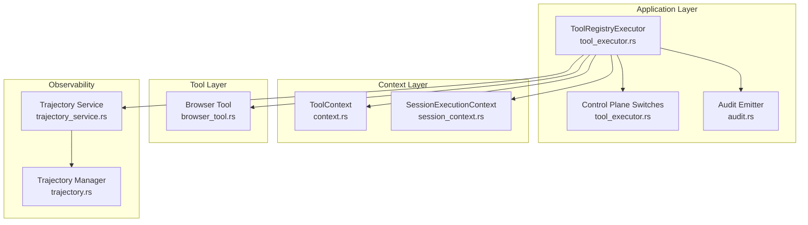
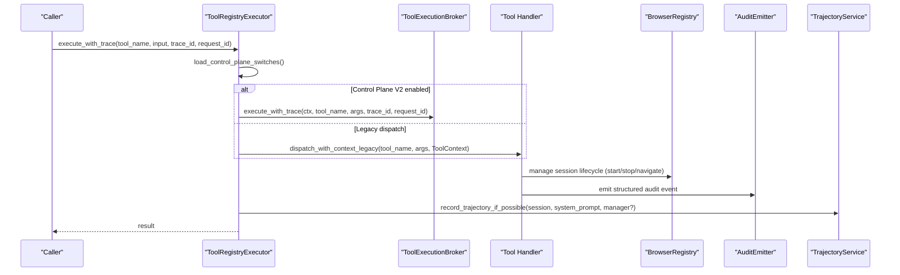
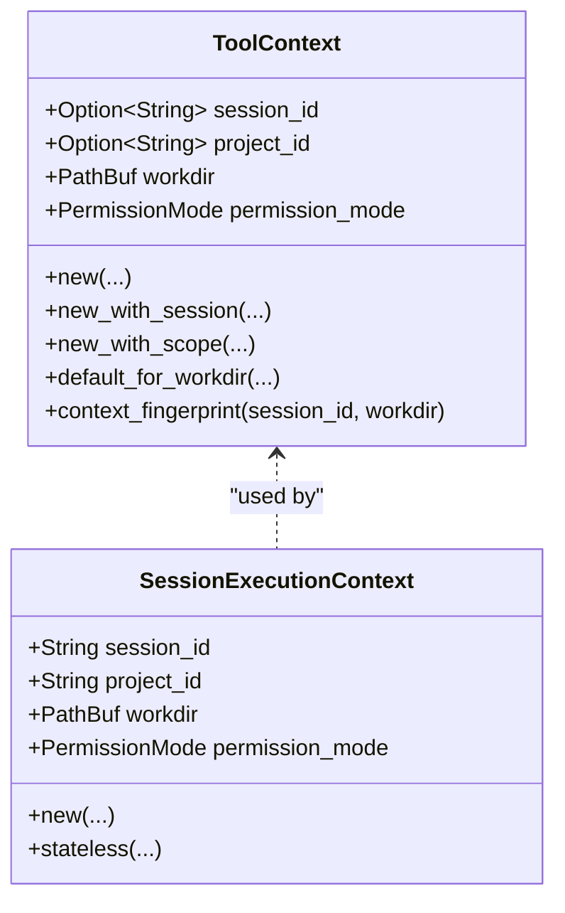
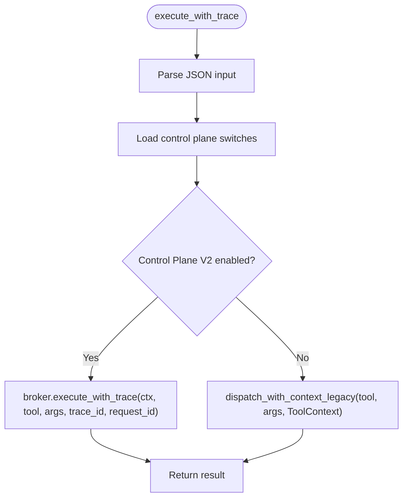
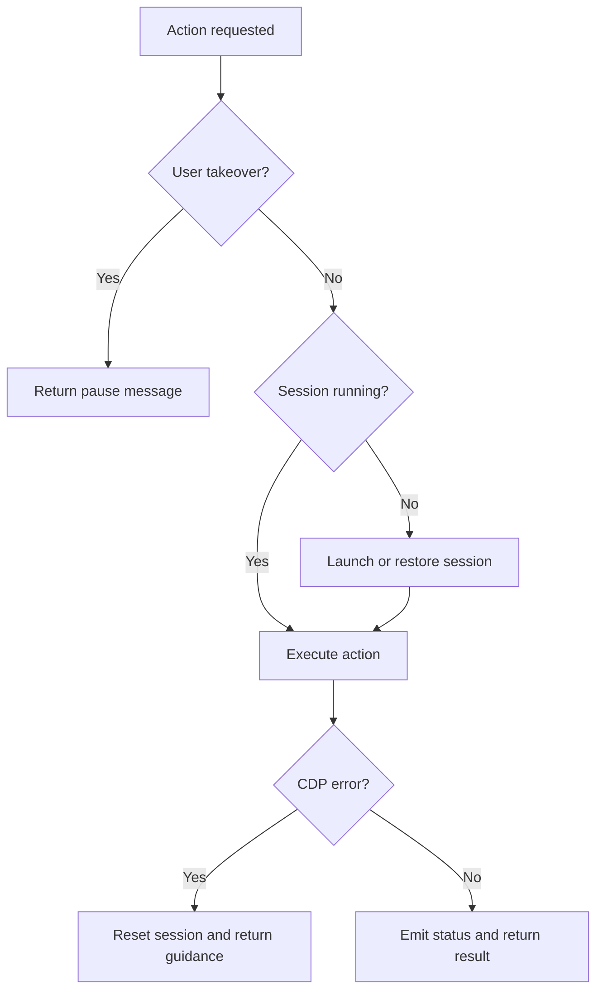
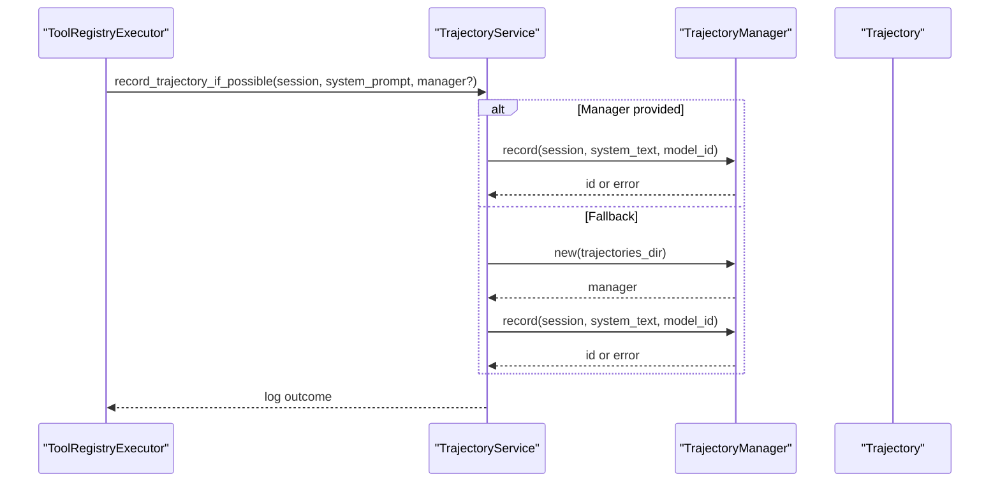
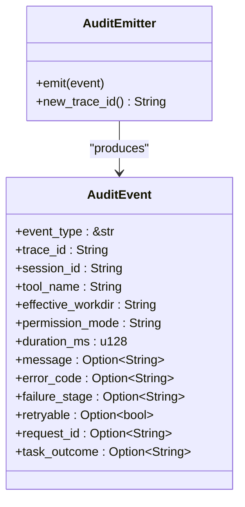
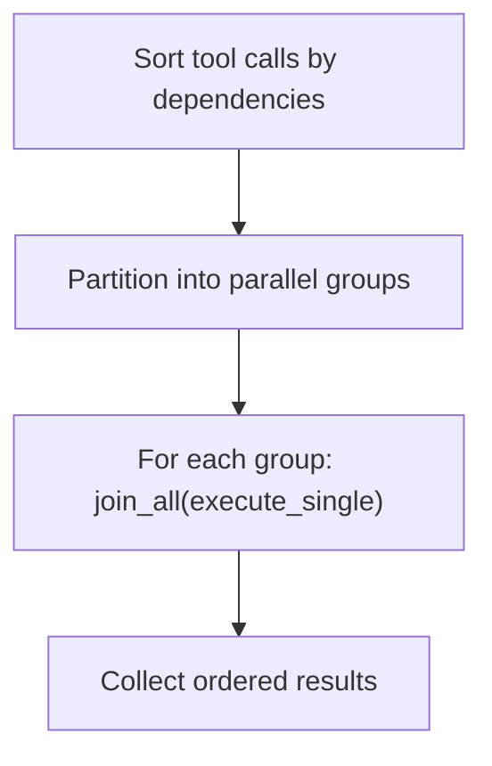
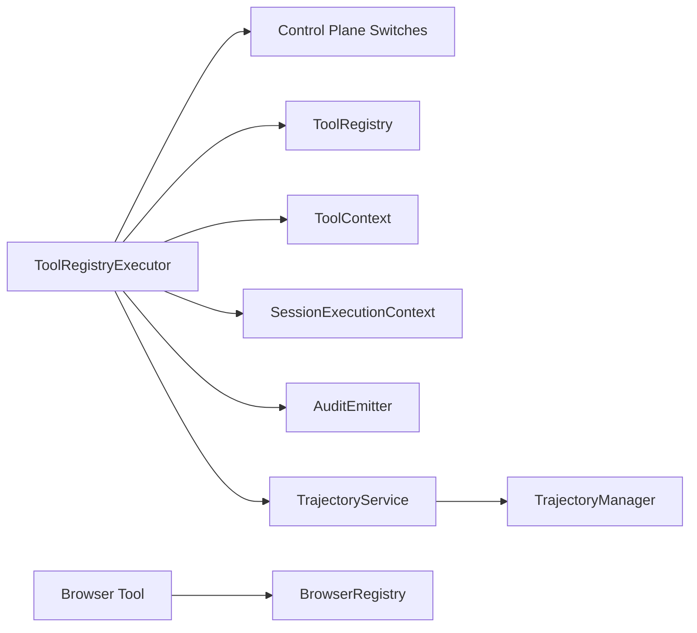

# Context Management & Execution

<cite>
**Referenced Files in This Document**
- [tool_executor.rs](file://src-tauri/src/modules/application/tool_executor.rs)
- [context.rs](file://src-tauri/src/modules/tools/context.rs)
- [session_context.rs](file://src-tauri/src/modules/control_plane/session_context.rs)
- [browser_tool.rs](file://src-tauri/src/modules/tools/builtin/browser_tool.rs)
- [trajectory_service.rs](file://src-tauri/src/modules/application/trajectory_service.rs)
- [trajectory.rs](file://src-tauri/src/modules/learning/trajectory.rs)
- [audit.rs](file://src-tauri/src/modules/control_plane/audit.rs)
- [integration_phase4.rs](file://src-tauri/src/modules/tools/integration_phase4.rs)
</cite>

## Table of Contents
1. [Introduction](#introduction)
2. [Project Structure](#project-structure)
3. [Core Components](#core-components)
4. [Architecture Overview](#architecture-overview)
5. [Detailed Component Analysis](#detailed-component-analysis)
6. [Dependency Analysis](#dependency-analysis)
7. [Performance Considerations](#performance-considerations)
8. [Troubleshooting Guide](#troubleshooting-guide)
9. [Conclusion](#conclusion)

## Introduction
This document explains the context management and tool execution system in If2Ai. It focuses on how ToolContext coordinates tool execution with application state, including memory access, browser sessions, and system resources. It details the execution pipeline from tool invocation to result processing, including parallel execution, context propagation, and state synchronization. It also covers trajectory service integration for tool execution tracking, the tool executor’s role in managing concurrent operations, examples of context sharing between tools, execution timeouts, resource cleanup, error propagation, retry mechanisms, and execution monitoring.

## Project Structure
The execution and context management spans Rust modules under the Tauri backend:
- Application-level tool execution bridge and configuration
- Tool context and session-scoped execution context
- Built-in tools (e.g., browser tool) and their resource lifecycle
- Trajectory recording for execution tracking and reinforcement learning
- Audit logging for structured monitoring and retries

**Diagram sources**
- [tool_executor.rs:1-143](file://src-tauri/src/modules/application/tool_executor.rs#L1-L143)
- [context.rs:1-109](file://src-tauri/src/modules/tools/context.rs#L1-L109)
- [session_context.rs:1-138](file://src-tauri/src/modules/control_plane/session_context.rs#L1-L138)
- [browser_tool.rs:1-800](file://src-tauri/src/modules/tools/builtin/browser_tool.rs#L1-L800)
- [trajectory_service.rs:1-58](file://src-tauri/src/modules/application/trajectory_service.rs#L1-L58)
- [trajectory.rs:118-163](file://src-tauri/src/modules/learning/trajectory.rs#L118-L163)
- [audit.rs:1-47](file://src-tauri/src/modules/control_plane/audit.rs#L1-L47)

**Section sources**
- [tool_executor.rs:1-143](file://src-tauri/src/modules/application/tool_executor.rs#L1-L143)
- [context.rs:1-109](file://src-tauri/src/modules/tools/context.rs#L1-L109)
- [session_context.rs:1-138](file://src-tauri/src/modules/control_plane/session_context.rs#L1-L138)
- [browser_tool.rs:1-800](file://src-tauri/src/modules/tools/builtin/browser_tool.rs#L1-L800)
- [trajectory_service.rs:1-58](file://src-tauri/src/modules/application/trajectory_service.rs#L1-L58)
- [trajectory.rs:118-163](file://src-tauri/src/modules/learning/trajectory.rs#L118-L163)
- [audit.rs:1-47](file://src-tauri/src/modules/control_plane/audit.rs#L1-L47)

## Core Components
- ToolContext: Encapsulates workdir, permission mode, and optional session/project scoping for tools. Supports deterministic context fingerprinting for tracing.
- SessionExecutionContext: Immutable snapshot of session/project/workdir/permission mode for a single execution flow.
- ToolRegistryExecutor: Bridges async tool registry to the synchronous executor interface, loading control plane switches and dispatching with trace IDs.
- Browser Tool: A built-in tool that manages per-session browser lifecycle, enforces safety checks, and integrates with the registry for state synchronization and diagnostics.
- Trajectory Service: Records agent conversations as JSONL trajectories for RL training, preferring a shared AppState-level manager when available.
- Audit Emitter: Produces structured audit events for tool execution, including trace IDs, durations, and failure metadata.

**Section sources**
- [context.rs:1-109](file://src-tauri/src/modules/tools/context.rs#L1-L109)
- [session_context.rs:1-138](file://src-tauri/src/modules/control_plane/session_context.rs#L1-L138)
- [tool_executor.rs:1-143](file://src-tauri/src/modules/application/tool_executor.rs#L1-L143)
- [browser_tool.rs:1-800](file://src-tauri/src/modules/tools/builtin/browser_tool.rs#L1-L800)
- [trajectory_service.rs:1-58](file://src-tauri/src/modules/application/trajectory_service.rs#L1-L58)
- [audit.rs:1-47](file://src-tauri/src/modules/control_plane/audit.rs#L1-L47)

## Architecture Overview
The execution pipeline begins with a session-bound execution context. The tool executor resolves control plane switches, optionally uses a broker to execute tools with trace IDs, and propagates ToolContext to tool handlers. Tools may access system resources (e.g., browser sessions) and emit structured audit events. Trajectory service records execution traces for later RL training.

**Diagram sources**
- [tool_executor.rs:73-115](file://src-tauri/src/modules/application/tool_executor.rs#L73-L115)
- [browser_tool.rs:350-740](file://src-tauri/src/modules/tools/builtin/browser_tool.rs#L350-L740)
- [trajectory_service.rs:23-57](file://src-tauri/src/modules/application/trajectory_service.rs#L23-L57)
- [audit.rs:31-47](file://src-tauri/src/modules/control_plane/audit.rs#L31-L47)

## Detailed Component Analysis

### Tool Context and Session Context
- ToolContext defines workdir, permission mode, and optional session/project scoping. It supports deterministic fingerprinting to trace cross-session interference.
- SessionExecutionContext resolves session/project boundaries and workdir from managers, ensuring consistent execution context across tools.

**Diagram sources**
- [context.rs:14-108](file://src-tauri/src/modules/tools/context.rs#L14-L108)
- [session_context.rs:12-50](file://src-tauri/src/modules/control_plane/session_context.rs#L12-L50)

**Section sources**
- [context.rs:1-109](file://src-tauri/src/modules/tools/context.rs#L1-L109)
- [session_context.rs:1-138](file://src-tauri/src/modules/control_plane/session_context.rs#L1-L138)

### Tool Execution Bridge and Control Plane Switches
- ToolRegistryExecutor loads control plane switches from configuration and environment variables, logs them, and executes tools either via the broker (with trace IDs) or legacy dispatch.
- It implements the synchronous ToolExecutor trait for compatibility with the runtime.

**Diagram sources**
- [tool_executor.rs:73-115](file://src-tauri/src/modules/application/tool_executor.rs#L73-L115)

**Section sources**
- [tool_executor.rs:1-143](file://src-tauri/src/modules/application/tool_executor.rs#L1-L143)

### Browser Tool Execution and Resource Lifecycle
- The browser tool enforces strict URL safety, manages per-session Chromium processes, and synchronizes state with the viewer and events.
- It supports lifecycle actions (start/stop), navigation with safety checks, perception (snapshot/screenshot), interaction (click/type/scroll/select/key), waits, evaluation, tabs, downloads, and diagnostics.
- It integrates with the registry to ensure the browser is running or restored before operations and handles CDP crashes gracefully.

**Diagram sources**
- [browser_tool.rs:350-740](file://src-tauri/src/modules/tools/builtin/browser_tool.rs#L350-L740)

**Section sources**
- [browser_tool.rs:1-800](file://src-tauri/src/modules/tools/builtin/browser_tool.rs#L1-L800)

### Trajectory Service Integration
- The trajectory service records agent conversations as JSONL entries for RL training. It prefers a shared AppState-level manager to avoid repeated directory scans and falls back to a temporary manager when unavailable.
- Privacy controls can filter content and anonymize user data.

**Diagram sources**
- [trajectory_service.rs:23-57](file://src-tauri/src/modules/application/trajectory_service.rs#L23-L57)
- [trajectory.rs:118-163](file://src-tauri/src/modules/learning/trajectory.rs#L118-L163)

**Section sources**
- [trajectory_service.rs:1-58](file://src-tauri/src/modules/application/trajectory_service.rs#L1-L58)
- [trajectory.rs:118-163](file://src-tauri/src/modules/learning/trajectory.rs#L118-L163)

### Audit Logging and Monitoring
- Audit events capture structured metadata for each tool execution, including trace ID, session, tool name, effective workdir, permission mode, duration, and optional failure details.
- These events support monitoring, retry decisions, and compliance tracking.

**Diagram sources**
- [audit.rs:8-47](file://src-tauri/src/modules/control_plane/audit.rs#L8-L47)

**Section sources**
- [audit.rs:1-47](file://src-tauri/src/modules/control_plane/audit.rs#L1-L47)

### Parallel Execution and Context Propagation
- The executor supports parallel execution by sorting tool calls, partitioning into groups, and joining futures for each group. Context is propagated via ToolContext and SessionExecutionContext.
- Tests demonstrate concurrent limits and context switching while preserving workdir isolation.

**Diagram sources**
- [tool_executor.rs:73-115](file://src-tauri/src/modules/application/tool_executor.rs#L73-L115)
- [integration_phase4.rs:341-379](file://src-tauri/src/modules/tools/integration_phase4.rs#L341-L379)

**Section sources**
- [tool_executor.rs:73-115](file://src-tauri/src/modules/application/tool_executor.rs#L73-L115)
- [integration_phase4.rs:341-379](file://src-tauri/src/modules/tools/integration_phase4.rs#L341-L379)

## Dependency Analysis
- ToolRegistryExecutor depends on control plane switches, the tool registry, and the session execution context.
- Tool handlers receive a shared ToolContext for thread-safe access and context updates.
- Browser tool depends on BrowserRegistry for session lifecycle and state synchronization.
- Trajectory service depends on TrajectoryManager and runtime session data.
- Audit emitter produces structured events consumed by monitoring systems.

**Diagram sources**
- [tool_executor.rs:52-115](file://src-tauri/src/modules/application/tool_executor.rs#L52-L115)
- [browser_tool.rs:1-800](file://src-tauri/src/modules/tools/builtin/browser_tool.rs#L1-L800)
- [trajectory_service.rs:1-58](file://src-tauri/src/modules/application/trajectory_service.rs#L1-L58)

**Section sources**
- [tool_executor.rs:1-143](file://src-tauri/src/modules/application/tool_executor.rs#L1-L143)
- [browser_tool.rs:1-800](file://src-tauri/src/modules/tools/builtin/browser_tool.rs#L1-L800)
- [trajectory_service.rs:1-58](file://src-tauri/src/modules/application/trajectory_service.rs#L1-L58)

## Performance Considerations
- Parallel execution reduces total latency by running independent tool calls concurrently within groups.
- Context fingerprinting enables tracing and detecting cross-session interference without heavy overhead.
- Browser tool delays and asynchronous status emission avoid blocking and keep UI responsive.
- Trajectory recording uses append-only files with rotation to manage disk usage and avoid scanning costs.

## Troubleshooting Guide
- Execution timeouts: Browser tool actions define explicit timeouts and wait states; adjust parameters per use case.
- Resource cleanup: Browser tool resets sessions on CDP errors and ensures proper shutdown; always stop sessions explicitly when done.
- Error propagation: Tool handlers return structured errors; browser tool surfaces CDP and snapshot errors with guidance.
- Retry mechanisms: Jobs can track attempts and reset state; use structured audit events to determine retry eligibility and stages.
- Execution monitoring: Emit audit events with trace IDs and failure metadata; correlate with trajectory entries for end-to-end visibility.

**Section sources**
- [browser_tool.rs:250-256](file://src-tauri/src/modules/tools/builtin/browser_tool.rs#L250-L256)
- [browser_tool.rs:462-475](file://src-tauri/src/modules/tools/builtin/browser_tool.rs#L462-L475)
- [audit.rs:8-47](file://src-tauri/src/modules/control_plane/audit.rs#L8-L47)

## Conclusion
If2Ai’s context management and tool execution system centers on robust context propagation, secure resource access, and observable execution. ToolContext and SessionExecutionContext ensure tools operate within defined scopes and permissions. The tool executor bridges modern control plane features with legacy contracts, enabling parallel execution and traceable auditing. The browser tool exemplifies safe, session-scoped resource management, while trajectory service and audit emitter provide comprehensive monitoring and RL-ready data. Together, these components deliver a secure, observable, and scalable execution environment.