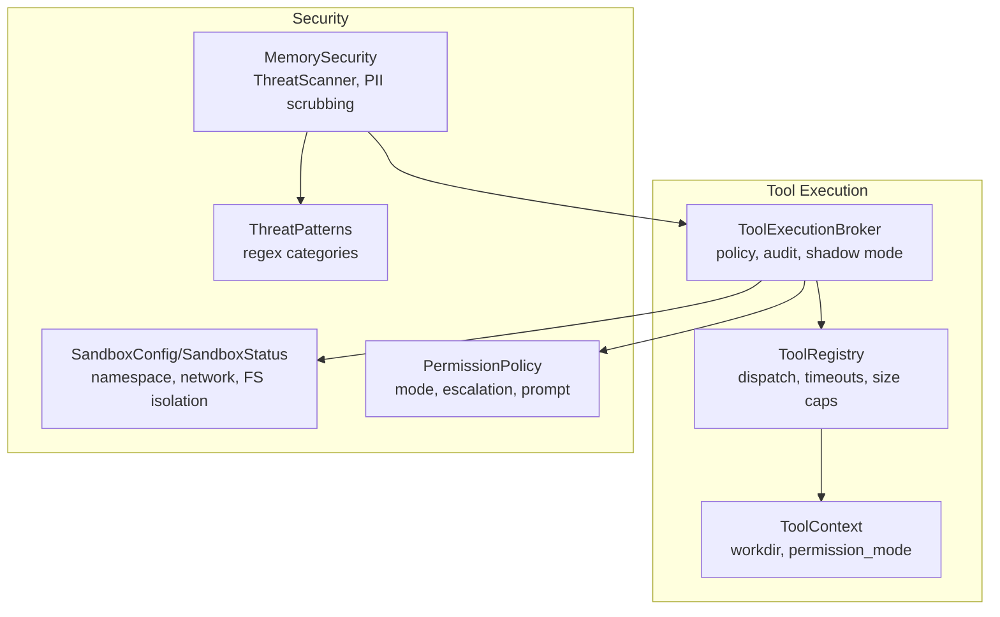
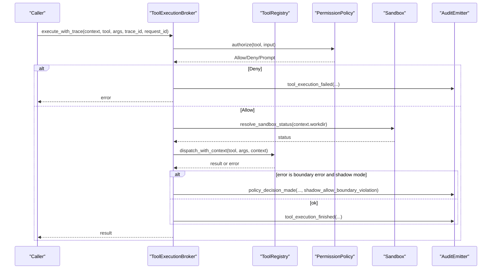
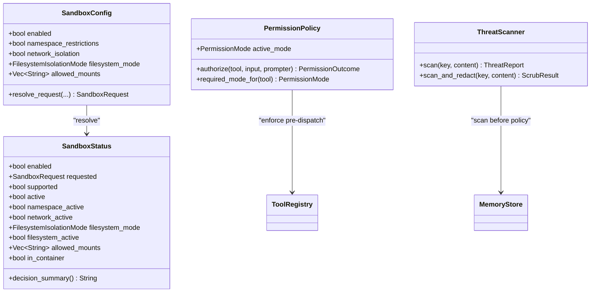
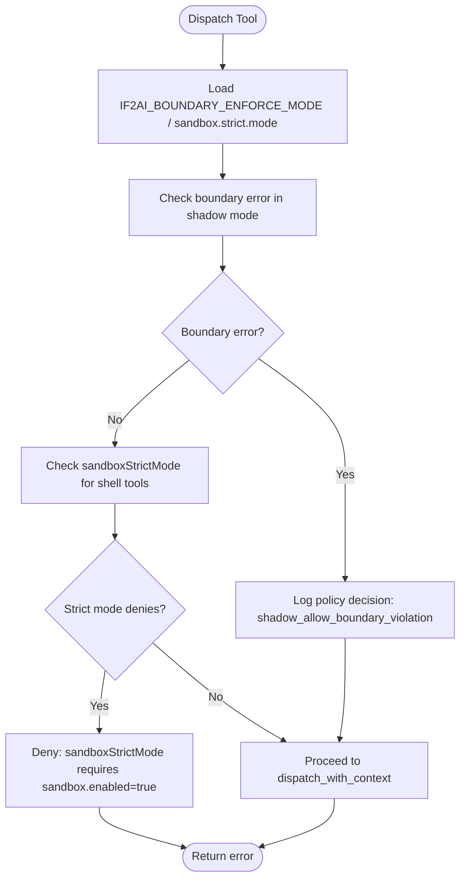
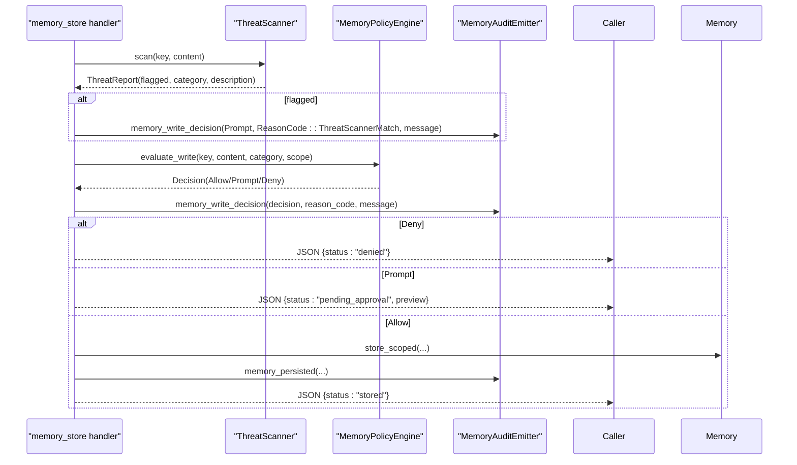
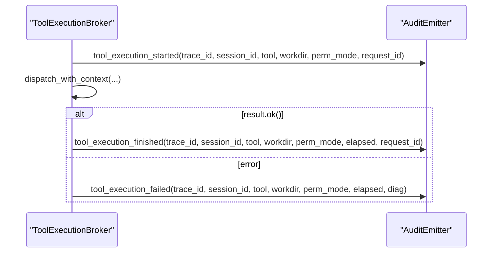
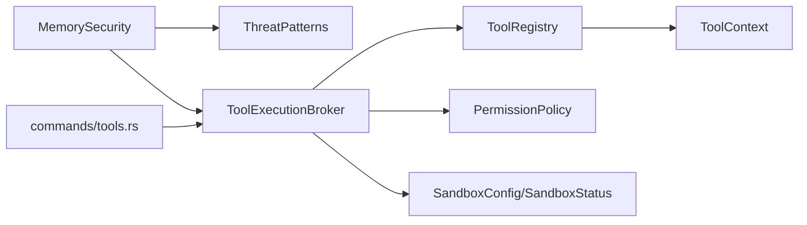

# Security & Performance Considerations

<cite>
**Referenced Files in This Document**
- [src-tauri/src/modules/tools/registry.rs](file://src-tauri/src/modules/tools/registry.rs)
- [src-tauri/src/modules/tools/context.rs](file://src-tauri/src/modules/tools/context.rs)
- [src-tauri/src/modules/tools/builtin/memory_store.rs](file://src-tauri/src/modules/tools/builtin/memory_store.rs)
- [src-tauri/src/modules/control_plane/tool_execution_broker.rs](file://src-tauri/src/modules/control_plane/tool_execution_broker.rs)
- [src-tauri/src/modules/runtime/sandbox.rs](file://src-tauri/src/modules/runtime/sandbox.rs)
- [src-tauri/src/modules/runtime/permissions.rs](file://src-tauri/src/modules/runtime/permissions.rs)
- [src-tauri/src/modules/memory/security.rs](file://src-tauri/src/modules/memory/security.rs)
- [src-tauri/src/modules/skills/guard/threat_patterns.rs](file://src-tauri/src/modules/skills/guard/threat_patterns.rs)
- [src-tauri/src/commands/tools.rs](file://src-tauri/src/commands/tools.rs)
</cite>

## Table of Contents
1. [Introduction](#introduction)
2. [Project Structure](#project-structure)
3. [Core Components](#core-components)
4. [Architecture Overview](#architecture-overview)
5. [Detailed Component Analysis](#detailed-component-analysis)
6. [Dependency Analysis](#dependency-analysis)
7. [Performance Considerations](#performance-considerations)
8. [Troubleshooting Guide](#troubleshooting-guide)
9. [Conclusion](#conclusion)
10. [Appendices](#appendices)

## Introduction
This document focuses on the security and performance considerations for tool execution in If2Ai. It explains the security model (sandboxing, permission management, threat detection), the integration with the permission service, and the performance optimization strategies (caching, parallel processing, resource pooling). It also covers security scanning for tool content, execution monitoring, audit logging, guidelines for secure tool development, vulnerability assessment, incident response, and performance profiling and optimization techniques for high-throughput tool execution.

## Project Structure
The security and performance controls are implemented across several modules:
- Tool registry and dispatch with timeouts and output caps
- Tool execution context and session/project scoping
- Control plane broker enforcing boundary and policy rules
- Sandbox configuration and detection
- Permission policy and escalation prompts
- Memory security scanning and policy enforcement
- Threat pattern definitions and scanning utilities

**Diagram sources**
- [src-tauri/src/modules/tools/registry.rs:353-540](file://src-tauri/src/modules/tools/registry.rs#L353-L540)
- [src-tauri/src/modules/tools/context.rs:9-29](file://src-tauri/src/modules/tools/context.rs#L9-L29)
- [src-tauri/src/modules/control_plane/tool_execution_broker.rs:116-144](file://src-tauri/src/modules/control_plane/tool_execution_broker.rs#L116-L144)
- [src-tauri/src/modules/runtime/sandbox.rs:29-70](file://src-tauri/src/modules/runtime/sandbox.rs#L29-L70)
- [src-tauri/src/modules/runtime/permissions.rs:62-150](file://src-tauri/src/modules/runtime/permissions.rs#L62-L150)
- [src-tauri/src/modules/memory/security.rs:56-96](file://src-tauri/src/modules/memory/security.rs#L56-L96)
- [src-tauri/src/modules/skills/guard/threat_patterns.rs:91-91](file://src-tauri/src/modules/skills/guard/threat_patterns.rs#L91-L91)

**Section sources**
- [src-tauri/src/modules/tools/registry.rs:353-540](file://src-tauri/src/modules/tools/registry.rs#L353-L540)
- [src-tauri/src/modules/tools/context.rs:9-29](file://src-tauri/src/modules/tools/context.rs#L9-L29)
- [src-tauri/src/modules/control_plane/tool_execution_broker.rs:116-144](file://src-tauri/src/modules/control_plane/tool_execution_broker.rs#L116-L144)
- [src-tauri/src/modules/runtime/sandbox.rs:29-70](file://src-tauri/src/modules/runtime/sandbox.rs#L29-L70)
- [src-tauri/src/modules/runtime/permissions.rs:62-150](file://src-tauri/src/modules/runtime/permissions.rs#L62-L150)
- [src-tauri/src/modules/memory/security.rs:56-96](file://src-tauri/src/modules/memory/security.rs#L56-L96)
- [src-tauri/src/modules/skills/guard/threat_patterns.rs:91-91](file://src-tauri/src/modules/skills/guard/threat_patterns.rs#L91-L91)

## Core Components
- ToolRegistry: Concurrent registry with dispatch, timeouts, and output size enforcement. Supports multimodal outputs and explicit context for high-risk tools.
- ToolContext: Captures session/project scope and workdir for filesystem boundary enforcement.
- ToolExecutionBroker: Orchestrates execution with policy checks, shadow mode handling, and audit emission.
- SandboxConfig/SandboxStatus: Describes and resolves sandbox capability, fallback reasons, and Linux launcher generation.
- PermissionPolicy: Defines permission modes, escalation rules, and prompt integration.
- MemorySecurity: ThreatScanner with built-in patterns and PII scrubbing; integrated into memory_store tool.
- ThreatPatterns: Comprehensive regex-based pattern catalog across 15 threat categories.

**Section sources**
- [src-tauri/src/modules/tools/registry.rs:353-540](file://src-tauri/src/modules/tools/registry.rs#L353-L540)
- [src-tauri/src/modules/tools/context.rs:9-29](file://src-tauri/src/modules/tools/context.rs#L9-L29)
- [src-tauri/src/modules/control_plane/tool_execution_broker.rs:116-144](file://src-tauri/src/modules/control_plane/tool_execution_broker.rs#L116-L144)
- [src-tauri/src/modules/runtime/sandbox.rs:29-70](file://src-tauri/src/modules/runtime/sandbox.rs#L29-L70)
- [src-tauri/src/modules/runtime/permissions.rs:62-150](file://src-tauri/src/modules/runtime/permissions.rs#L62-L150)
- [src-tauri/src/modules/memory/security.rs:56-96](file://src-tauri/src/modules/memory/security.rs#L56-L96)
- [src-tauri/src/modules/skills/guard/threat_patterns.rs:91-91](file://src-tauri/src/modules/skills/guard/threat_patterns.rs#L91-L91)

## Architecture Overview
The tool execution pipeline integrates security and performance controls at multiple layers:
- Pre-dispatch: Permission checks, boundary enforcement, and shadow mode handling
- Dispatch: Timeout protection, output size caps, and explicit context gating for high-risk tools
- Post-execution: Audit emission and policy decisions

**Diagram sources**
- [src-tauri/src/modules/control_plane/tool_execution_broker.rs:146-265](file://src-tauri/src/modules/control_plane/tool_execution_broker.rs#L146-L265)
- [src-tauri/src/modules/tools/registry.rs:486-540](file://src-tauri/src/modules/tools/registry.rs#L486-L540)
- [src-tauri/src/modules/runtime/permissions.rs:101-149](file://src-tauri/src/modules/runtime/permissions.rs#L101-L149)
- [src-tauri/src/modules/runtime/sandbox.rs:175-227](file://src-tauri/src/modules/runtime/sandbox.rs#L175-L227)

**Section sources**
- [src-tauri/src/modules/control_plane/tool_execution_broker.rs:146-265](file://src-tauri/src/modules/control_plane/tool_execution_broker.rs#L146-L265)
- [src-tauri/src/modules/tools/registry.rs:486-540](file://src-tauri/src/modules/tools/registry.rs#L486-L540)
- [src-tauri/src/modules/runtime/permissions.rs:101-149](file://src-tauri/src/modules/runtime/permissions.rs#L101-L149)
- [src-tauri/src/modules/runtime/sandbox.rs:175-227](file://src-tauri/src/modules/runtime/sandbox.rs#L175-L227)

## Detailed Component Analysis

### Security Model: Sandbox, Permissions, and Threat Detection
- Sandbox: Configurable namespace, network, and filesystem isolation with fallback detection and Linux launcher generation.
- Permissions: Hierarchical modes with escalation prompts and tool-specific requirements.
- Threat Detection: Static scanning of tool content and memory writes using regex-based patterns.

**Diagram sources**
- [src-tauri/src/modules/runtime/sandbox.rs:29-70](file://src-tauri/src/modules/runtime/sandbox.rs#L29-L70)
- [src-tauri/src/modules/runtime/sandbox.rs:175-227](file://src-tauri/src/modules/runtime/sandbox.rs#L175-L227)
- [src-tauri/src/modules/runtime/permissions.rs:62-150](file://src-tauri/src/modules/runtime/permissions.rs#L62-L150)
- [src-tauri/src/modules/memory/security.rs:56-96](file://src-tauri/src/modules/memory/security.rs#L56-L96)

**Section sources**
- [src-tauri/src/modules/runtime/sandbox.rs:29-70](file://src-tauri/src/modules/runtime/sandbox.rs#L29-L70)
- [src-tauri/src/modules/runtime/sandbox.rs:175-227](file://src-tauri/src/modules/runtime/sandbox.rs#L175-L227)
- [src-tauri/src/modules/runtime/permissions.rs:62-150](file://src-tauri/src/modules/runtime/permissions.rs#L62-L150)
- [src-tauri/src/modules/memory/security.rs:56-96](file://src-tauri/src/modules/memory/security.rs#L56-L96)

### Permission Service Integration
- ToolExecutionBroker translates session execution context into ToolContext and enforces policy decisions.
- Boundary enforcement mode can be configured via environment variable or runtime config; shadow mode logs violations without blocking.
- Strict mode blocks shell tools when sandbox is disabled.

**Diagram sources**
- [src-tauri/src/modules/control_plane/tool_execution_broker.rs:217-234](file://src-tauri/src/modules/control_plane/tool_execution_broker.rs#L217-L234)
- [src-tauri/src/modules/control_plane/tool_execution_broker.rs:325-357](file://src-tauri/src/modules/control_plane/tool_execution_broker.rs#L325-L357)

**Section sources**
- [src-tauri/src/modules/control_plane/tool_execution_broker.rs:217-234](file://src-tauri/src/modules/control_plane/tool_execution_broker.rs#L217-L234)
- [src-tauri/src/modules/control_plane/tool_execution_broker.rs:325-357](file://src-tauri/src/modules/control_plane/tool_execution_broker.rs#L325-L357)

### Security Scanning for Tool Content and Memory Writes
- ThreatScanner scans key and content for secrets and returns first-match category/description.
- MemoryStore tool integrates scanning before policy evaluation and emits audit events for prompt decisions.
- ThreatPatterns define 60+ regex patterns across 15 categories (e.g., exfiltration, injection, destructive, persistence, network, obfuscation, mining, supply_chain, privilege_escalation, credential_exposure, agent_config_persistence, context_exfiltration, jailbreak, invisible_unicode, structural_limits, traversal, execution).

**Diagram sources**
- [src-tauri/src/modules/tools/builtin/memory_store.rs:271-311](file://src-tauri/src/modules/tools/builtin/memory_store.rs#L271-L311)
- [src-tauri/src/modules/memory/security.rs:84-95](file://src-tauri/src/modules/memory/security.rs#L84-L95)
- [src-tauri/src/modules/skills/guard/threat_patterns.rs:91-91](file://src-tauri/src/modules/skills/guard/threat_patterns.rs#L91-L91)

**Section sources**
- [src-tauri/src/modules/tools/builtin/memory_store.rs:271-311](file://src-tauri/src/modules/tools/builtin/memory_store.rs#L271-L311)
- [src-tauri/src/modules/memory/security.rs:84-95](file://src-tauri/src/modules/memory/security.rs#L84-L95)
- [src-tauri/src/modules/skills/guard/threat_patterns.rs:91-91](file://src-tauri/src/modules/skills/guard/threat_patterns.rs#L91-L91)

### Execution Monitoring and Audit Logging
- ToolExecutionBroker emits tool_execution_started, tool_execution_finished, and tool_execution_failed with diagnostics.
- MemoryStore emits memory_captured, memory_write_decision, memory_rejected, and memory_persisted.
- Shadow mode preserves original error semantics while logging policy decisions.

**Diagram sources**
- [src-tauri/src/modules/control_plane/tool_execution_broker.rs:171-264](file://src-tauri/src/modules/control_plane/tool_execution_broker.rs#L171-L264)

**Section sources**
- [src-tauri/src/modules/control_plane/tool_execution_broker.rs:171-264](file://src-tauri/src/modules/control_plane/tool_execution_broker.rs#L171-L264)

### Secure Tool Development Guidelines
- Use explicit context for high-risk tools (e.g., file IO, shell, memory manipulation) and avoid shared contexts.
- Respect workdir boundaries and enforce filesystem isolation via sandbox configuration.
- Apply output size caps and timeouts to prevent resource exhaustion.
- Integrate ThreatScanner in write paths and adopt prompt/deny decisions for suspicious content.
- Follow permission escalation patterns: prefer Allow/Prompt modes and prompt for dangerous escalations.

**Section sources**
- [src-tauri/src/modules/tools/registry.rs:486-540](file://src-tauri/src/modules/tools/registry.rs#L486-L540)
- [src-tauri/src/modules/runtime/sandbox.rs:175-227](file://src-tauri/src/modules/runtime/sandbox.rs#L175-L227)
- [src-tauri/src/modules/tools/builtin/memory_store.rs:271-311](file://src-tauri/src/modules/tools/builtin/memory_store.rs#L271-L311)
- [src-tauri/src/modules/runtime/permissions.rs:101-149](file://src-tauri/src/modules/runtime/permissions.rs#L101-L149)

### Vulnerability Assessment and Incident Response
- Use ThreatPatterns to statically detect suspicious constructs in tool inputs and memory writes.
- Monitor shadow mode logs for boundary violations and policy bypass attempts.
- For incidents, review audit payloads and policy decisions; escalate to Deny mode if necessary.
- Validate sandbox status and fallback reasons to ensure isolation.

**Section sources**
- [src-tauri/src/modules/skills/guard/threat_patterns.rs:91-91](file://src-tauri/src/modules/skills/guard/threat_patterns.rs#L91-L91)
- [src-tauri/src/modules/control_plane/tool_execution_broker.rs:217-234](file://src-tauri/src/modules/control_plane/tool_execution_broker.rs#L217-L234)
- [src-tauri/src/modules/runtime/sandbox.rs:175-227](file://src-tauri/src/modules/runtime/sandbox.rs#L175-L227)

## Dependency Analysis
The following diagram highlights key dependencies among security and execution components.

**Diagram sources**
- [src-tauri/src/modules/control_plane/tool_execution_broker.rs:116-144](file://src-tauri/src/modules/control_plane/tool_execution_broker.rs#L116-L144)
- [src-tauri/src/modules/tools/registry.rs:353-540](file://src-tauri/src/modules/tools/registry.rs#L353-L540)
- [src-tauri/src/modules/tools/context.rs:9-29](file://src-tauri/src/modules/tools/context.rs#L9-L29)
- [src-tauri/src/modules/runtime/sandbox.rs:29-70](file://src-tauri/src/modules/runtime/sandbox.rs#L29-L70)
- [src-tauri/src/modules/runtime/permissions.rs:62-150](file://src-tauri/src/modules/runtime/permissions.rs#L62-L150)
- [src-tauri/src/modules/memory/security.rs:56-96](file://src-tauri/src/modules/memory/security.rs#L56-L96)
- [src-tauri/src/modules/skills/guard/threat_patterns.rs:91-91](file://src-tauri/src/modules/skills/guard/threat_patterns.rs#L91-L91)
- [src-tauri/src/commands/tools.rs:194-232](file://src-tauri/src/commands/tools.rs#L194-L232)

**Section sources**
- [src-tauri/src/modules/control_plane/tool_execution_broker.rs:116-144](file://src-tauri/src/modules/control_plane/tool_execution_broker.rs#L116-L144)
- [src-tauri/src/modules/tools/registry.rs:353-540](file://src-tauri/src/modules/tools/registry.rs#L353-L540)
- [src-tauri/src/modules/tools/context.rs:9-29](file://src-tauri/src/modules/tools/context.rs#L9-L29)
- [src-tauri/src/modules/runtime/sandbox.rs:29-70](file://src-tauri/src/modules/runtime/sandbox.rs#L29-L70)
- [src-tauri/src/modules/runtime/permissions.rs:62-150](file://src-tauri/src/modules/runtime/permissions.rs#L62-L150)
- [src-tauri/src/modules/memory/security.rs:56-96](file://src-tauri/src/modules/memory/security.rs#L56-L96)
- [src-tauri/src/modules/skills/guard/threat_patterns.rs:91-91](file://src-tauri/src/modules/skills/guard/threat_patterns.rs#L91-L91)
- [src-tauri/src/commands/tools.rs:194-232](file://src-tauri/src/commands/tools.rs#L194-L232)

## Performance Considerations
- Concurrency and Dispatch
  - ToolRegistry uses a concurrent map for high-throughput dispatch and supports multimodal outputs.
  - Explicit context gating prevents cross-session leakage and reduces contention.
- Timeouts and Output Caps
  - Per-tool timeouts and size enforcement prevent runaway tool execution and memory growth.
- Parallel Execution
  - While not shown in the referenced files, the design supports parallel execution patterns via async dispatch and shared contexts.
- Resource Pooling
  - Consider pooling expensive resources (e.g., sandbox containers) when scaling; monitor fallback reasons and supported features to optimize availability.
- Observability
  - Audit emissions and tracing provide visibility into execution latency and policy outcomes.

[No sources needed since this section provides general guidance]

## Troubleshooting Guide
- Permission Denied
  - Verify active mode and required mode for the tool; use prompt escalation when appropriate.
- Boundary Violations
  - Check boundary enforce mode; in shadow mode, violations are logged but not blocked.
- Sandbox Not Active
  - Inspect fallback reasons (unsupported OS, missing dependencies, allow-list without mounts).
- Memory Write Blocked
  - Investigate ThreatScanner matches and MemoryPolicyEngine decisions; adjust enforce mode or content.

**Section sources**
- [src-tauri/src/modules/runtime/permissions.rs:101-149](file://src-tauri/src/modules/runtime/permissions.rs#L101-L149)
- [src-tauri/src/modules/control_plane/tool_execution_broker.rs:217-234](file://src-tauri/src/modules/control_plane/tool_execution_broker.rs#L217-L234)
- [src-tauri/src/modules/runtime/sandbox.rs:175-227](file://src-tauri/src/modules/runtime/sandbox.rs#L175-L227)
- [src-tauri/src/modules/tools/builtin/memory_store.rs:271-311](file://src-tauri/src/modules/tools/builtin/memory_store.rs#L271-L311)

## Conclusion
If2Ai’s tool execution pipeline integrates robust security controls—sandboxing, permission management, and threat detection—alongside performance-oriented mechanisms such as timeouts, output caps, and concurrent dispatch. The system emphasizes observability through audit logging and tracing, enabling effective incident response and continuous improvement.

[No sources needed since this section summarizes without analyzing specific files]

## Appendices

### Appendix A: Environment Variables and Configuration
- IF2AI_BOUNDARY_ENFORCE_MODE: shadow or enforce
- IF2AI_SANDBOX_STRICT_MODE: enable strict mode for shell tools
- IF2AI_ALLOW_SHARED_CONTEXT_DISPATCH: allow shared context for low-risk tools
- IF2AI_CONTROL_PLANE_V2_ENABLED: control plane v2 enablement
- IF2AI_SKILLS_SIGNING_KEY: remote skill distribution signature verification

**Section sources**
- [src-tauri/src/modules/control_plane/tool_execution_broker.rs:208-222](file://src-tauri/src/modules/control_plane/tool_execution_broker.rs#L208-L222)
- [src-tauri/src/modules/tools/registry.rs:142-145](file://src-tauri/src/modules/tools/registry.rs#L142-L145)
- [src-tauri/src/modules/tools/registry.rs:58-95](file://src-tauri/src/modules/tools/registry.rs#L58-L95)