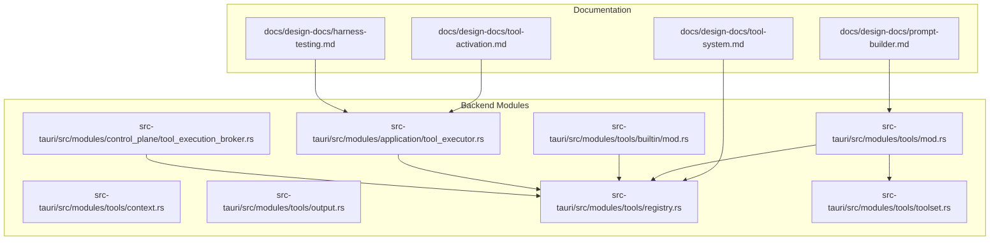
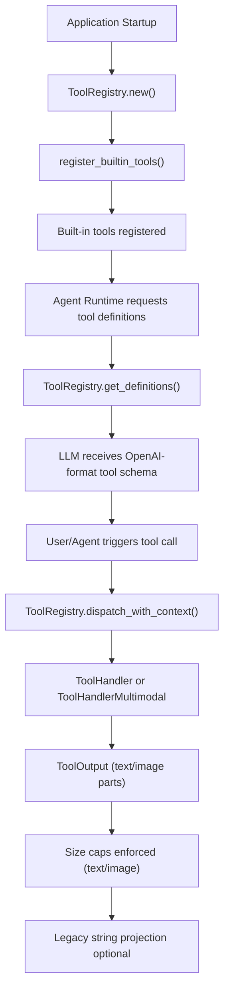
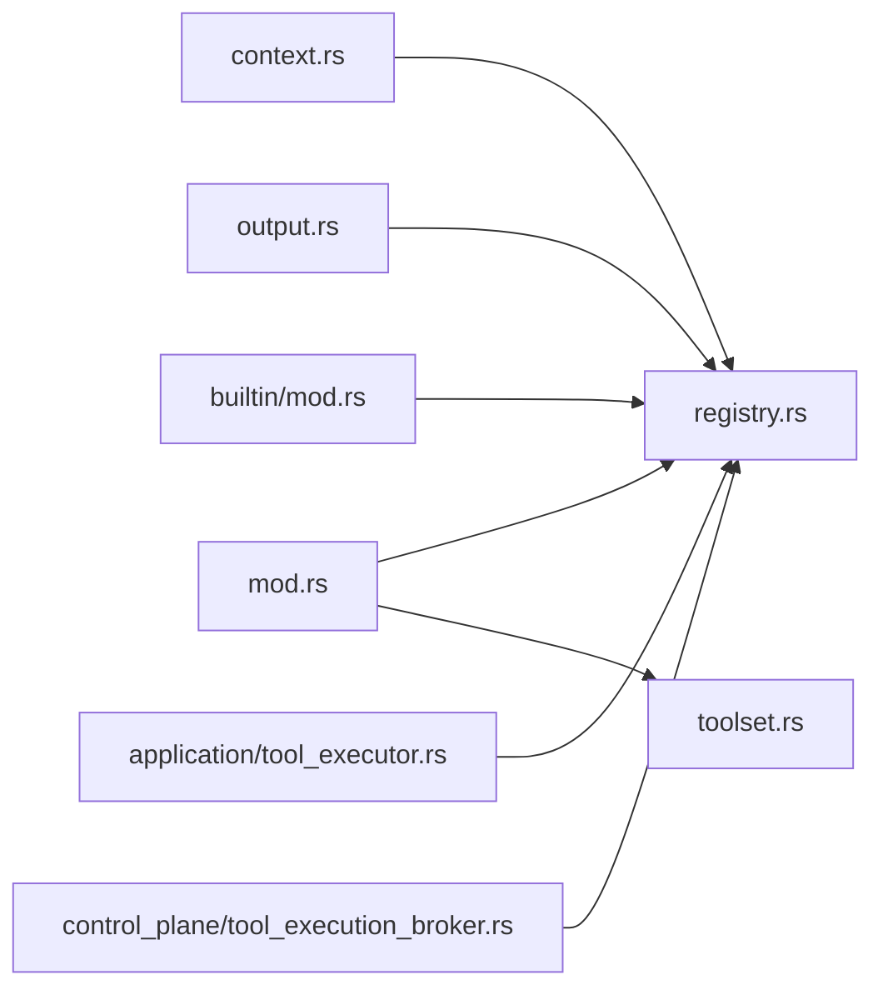

# Tool Development Guide

<cite>
**Referenced Files in This Document**
- [tool-system.md](file://docs/design-docs/tool-system.md)
- [prompt-builder.md](file://docs/design-docs/prompt-builder.md)
- [tool-activation.md](file://docs/design-docs/tool-activation.md)
- [harness-testing.md](file://docs/design-docs/harness-testing.md)
- [context.rs](file://src-tauri/src/modules/tools/context.rs)
- [output.rs](file://src-tauri/src/modules/tools/output.rs)
- [registry.rs](file://src-tauri/src/modules/tools/registry.rs)
- [mod.rs](file://src-tauri/src/modules/tools/mod.rs)
- [toolset.rs](file://src-tauri/src/modules/tools/toolset.rs)
- [application/tool_executor.rs](file://src-tauri/src/modules/application/tool_executor.rs)
- [control_plane/tool_execution_broker.rs](file://src-tauri/src/modules/control_plane/tool_execution_broker.rs)
- [tool_vision_integration.rs](file://src-tauri/tests/tool_vision_integration.rs)
- [builtin/mod.rs](file://src-tauri/src/modules/tools/builtin/mod.rs)
- [structured_output.rs](file://src-tauri/src/modules/tools/builtin/structured_output.rs)
</cite>

## Table of Contents
1. [Introduction](#introduction)
2. [Project Structure](#project-structure)
3. [Core Components](#core-components)
4. [Architecture Overview](#architecture-overview)
5. [Detailed Component Analysis](#detailed-component-analysis)
6. [Dependency Analysis](#dependency-analysis)
7. [Performance Considerations](#performance-considerations)
8. [Troubleshooting Guide](#troubleshooting-guide)
9. [Conclusion](#conclusion)
10. [Appendices](#appendices)

## Introduction
This guide explains how to extend If2Ai’s tool system with robust, secure, and testable custom tools. It documents the tool definition schema, parameter specification, output formatting, ToolContext usage, ToolOutput handling, and the tool execution lifecycle. It also provides step-by-step examples, testing strategies, debugging techniques, performance optimization tips, security and sandboxing practices, and packaging/distribution guidance.

## Project Structure
The tool system spans Rust modules under the backend, with documentation and harness testing frameworks supporting design and evaluation.

**Diagram sources**
- [tool-system.md](file://docs/design-docs/tool-system.md)
- [prompt-builder.md](file://docs/design-docs/prompt-builder.md)
- [tool-activation.md](file://docs/design-docs/tool-activation.md)
- [harness-testing.md](file://docs/design-docs/harness-testing.md)
- [context.rs](file://src-tauri/src/modules/tools/context.rs)
- [output.rs](file://src-tauri/src/modules/tools/output.rs)
- [registry.rs](file://src-tauri/src/modules/tools/registry.rs)
- [toolset.rs](file://src-tauri/src/modules/tools/toolset.rs)
- [mod.rs](file://src-tauri/src/modules/tools/mod.rs)
- [builtin/mod.rs](file://src-tauri/src/modules/tools/builtin/mod.rs)
- [application/tool_executor.rs](file://src-tauri/src/modules/application/tool_executor.rs)
- [control_plane/tool_execution_broker.rs](file://src-tauri/src/modules/control_plane/tool_execution_broker.rs)

**Section sources**
- [tool-system.md](file://docs/design-docs/tool-system.md)
- [tool-activation.md](file://docs/design-docs/tool-activation.md)
- [harness-testing.md](file://docs/design-docs/harness-testing.md)
- [context.rs](file://src-tauri/src/modules/tools/context.rs)
- [output.rs](file://src-tauri/src/modules/tools/output.rs)
- [registry.rs](file://src-tauri/src/modules/tools/registry.rs)
- [toolset.rs](file://src-tauri/src/modules/tools/toolset.rs)
- [mod.rs](file://src-tauri/src/modules/tools/mod.rs)
- [builtin/mod.rs](file://src-tauri/src/modules/tools/builtin/mod.rs)
- [application/tool_executor.rs](file://src-tauri/src/modules/application/tool_executor.rs)
- [control_plane/tool_execution_broker.rs](file://src-tauri/src/modules/control_plane/tool_execution_broker.rs)

## Core Components
- ToolEntry: Defines tool metadata, schemas, handlers, timeouts, size limits, and flags.
- ToolRegistry: Central registry with concurrent access, validation, dispatch, and size enforcement.
- ToolContext: Passes workdir and permission mode to tools for isolation and safety.
- ToolOutput: Multimodal result container supporting text and images with per-modality size checks.
- ToolSet and ToolSetRegistry: Group tools into logical sets for filtering and distribution.
- Built-in tools: Reference implementations for file ops, web, memory, scheduler, and utilities.

Key implementation references:
- ToolEntry and ToolRegistry APIs: [registry.rs](file://src-tauri/src/modules/tools/registry.rs)
- ToolContext: [context.rs](file://src-tauri/src/modules/tools/context.rs)
- ToolOutput: [output.rs](file://src-tauri/src/modules/tools/output.rs)
- ToolSet: [toolset.rs](file://src-tauri/src/modules/tools/toolset.rs)
- Built-in tools: [builtin/mod.rs](file://src-tauri/src/modules/tools/builtin/mod.rs)

**Section sources**
- [registry.rs](file://src-tauri/src/modules/tools/registry.rs)
- [context.rs](file://src-tauri/src/modules/tools/context.rs)
- [output.rs](file://src-tauri/src/modules/tools/output.rs)
- [toolset.rs](file://src-tauri/src/modules/tools/toolset.rs)
- [builtin/mod.rs](file://src-tauri/src/modules/tools/builtin/mod.rs)

## Architecture Overview
The tool system integrates with the application runtime and control plane. Tools are registered at startup, exposed to the agent via definitions, and executed with context-aware isolation and size/timeouts enforced.

**Diagram sources**
- [mod.rs](file://src-tauri/src/modules/tools/mod.rs)
- [registry.rs](file://src-tauri/src/modules/tools/registry.rs)
- [application/tool_executor.rs](file://src-tauri/src/modules/application/tool_executor.rs)

**Section sources**
- [mod.rs](file://src-tauri/src/modules/tools/mod.rs)
- [registry.rs](file://src-tauri/src/modules/tools/registry.rs)
- [application/tool_executor.rs](file://src-tauri/src/modules/application/tool_executor.rs)

## Detailed Component Analysis

### Tool Definition Schema and Parameter Specification
- Define a ToolEntry with:
  - name, toolset, description, emoji
  - input_schema as a JSON Schema (properties, required, types)
  - output_schema (optional)
  - handler or multimodal_handler
  - is_async flag (via async handler)
  - check_fn, requires_env, max_result_size, max_text_bytes, max_image_bytes, timeout_secs, disabled
- Tool definitions are exported in OpenAI-compatible function format for LLM consumption.

References:
- ToolEntry fields and dispatch: [registry.rs](file://src-tauri/src/modules/tools/registry.rs)
- ToolDefinitionBuilder for documentation and examples: [prompt-builder.md](file://docs/design-docs/prompt-builder.md)

**Section sources**
- [registry.rs](file://src-tauri/src/modules/tools/registry.rs)
- [prompt-builder.md](file://docs/design-docs/prompt-builder.md)

### ToolContext System
- Purpose: Provide workdir and permission mode to tools for safe, scoped operations.
- Construction helpers:
  - new(workdir, permission_mode)
  - new_with_session(session_id, workdir, permission_mode)
  - new_with_scope(session_id, project_id, workdir, permission_mode)
  - default_for_workdir(workdir)
- Context fingerprinting supports tracing and isolation.

References:
- ToolContext and helpers: [context.rs](file://src-tauri/src/modules/tools/context.rs)

**Section sources**
- [context.rs](file://src-tauri/src/modules/tools/context.rs)

### ToolOutput Structure and Multimodal Results
- ToolOutput parts:
  - Text: plain text content
  - Image: base64-encoded data with MIME type and optional alt text
- Helpers:
  - text(), image(), image_with_alt(), text_then_image()
  - text_byte_size(), image_byte_size(), to_legacy_string()
- Legacy compatibility: dispatch_with_context_legacy() returns a flattened string.

References:
- ToolOutput and ToolResultPart: [output.rs](file://src-tauri/src/modules/tools/output.rs)

**Section sources**
- [output.rs](file://src-tauri/src/modules/tools/output.rs)

### Tool Execution Lifecycle
- Validation: validate(name, args) checks existence and required parameters.
- Dispatch:
  - dispatch(name, args) uses default context
  - dispatch_with_context(name, args, context) isolates per-session/project
- Enforcement:
  - Timeout via timeout_secs
  - Size caps via max_text_bytes/max_image_bytes (or max_result_size fallback)
- Error handling: ToolError variants for not found, disabled, timeout, oversized, register, handler.

References:
- Dispatch and validation: [registry.rs](file://src-tauri/src/modules/tools/registry.rs)
- Executor bridge: [application/tool_executor.rs](file://src-tauri/src/modules/application/tool_executor.rs)

**Section sources**
- [registry.rs](file://src-tauri/src/modules/tools/registry.rs)
- [application/tool_executor.rs](file://src-tauri/src/modules/application/tool_executor.rs)

### Step-by-Step: Creating a Custom Tool
- Define ToolEntry
  - Choose name, toolset, description, emoji
  - Build input_schema with properties and required fields
  - Implement handler or multimodal_handler
  - Set timeouts and size caps
- Implement Handler
  - Accept args: &Value and context: SharedToolContext
  - Validate parameters from args
  - Perform operation (file IO, HTTP, memory, etc.)
  - Return ToolOutput or String (legacy)
- Register Tool
  - registry.register(entry)?
- Test
  - Unit tests for handler
  - Integration tests validating size/timeouts and multimodal output
- Document
  - Add examples and cost/safety notes using ToolDefinitionBuilder pattern

References:
- Adding tools and handler pattern: [tool-system.md](file://docs/design-docs/tool-system.md)
- ToolDefinitionBuilder: [prompt-builder.md](file://docs/design-docs/prompt-builder.md)
- Built-in examples: [builtin/mod.rs](file://src-tauri/src/modules/tools/builtin/mod.rs)
- StructuredOutput example: [structured_output.rs](file://src-tauri/src/modules/tools/builtin/structured_output.rs)

**Section sources**
- [tool-system.md](file://docs/design-docs/tool-system.md)
- [prompt-builder.md](file://docs/design-docs/prompt-builder.md)
- [builtin/mod.rs](file://src-tauri/src/modules/tools/builtin/mod.rs)
- [structured_output.rs](file://src-tauri/src/modules/tools/builtin/structured_output.rs)

### Asynchronous Operations and Multimodal Outputs
- Use ToolHandlerMultimodal when emitting images or mixed content.
- Compose ToolOutput parts with text_then_image() to pair captions with images.
- Enforce per-modality caps; fallback to legacy string projection when needed.

References:
- Multimodal output and caps: [output.rs](file://src-tauri/src/modules/tools/output.rs)
- Caps enforcement: [registry.rs](file://src-tauri/src/modules/tools/registry.rs)
- Integration tests: [tool_vision_integration.rs](file://src-tauri/tests/tool_vision_integration.rs)

**Section sources**
- [output.rs](file://src-tauri/src/modules/tools/output.rs)
- [registry.rs](file://src-tauri/src/modules/tools/registry.rs)
- [tool_vision_integration.rs](file://src-tauri/tests/tool_vision_integration.rs)

### Tool Testing Strategies and Debugging
- Unit tests:
  - Validate handler logic with mocked args and context
  - Assert ToolError conditions (not found, disabled, timeout, oversized)
- Integration tests:
  - Verify multimodal output shapes and serialization
  - Confirm size caps and legacy projection
- Harness-based evaluation:
  - Correctness, behavior, performance, reliability evaluators
  - Tool usage validation and iteration/token budgets

References:
- Harness testing framework: [harness-testing.md](file://docs/design-docs/harness-testing.md)
- Tool vision integration tests: [tool_vision_integration.rs](file://src-tauri/tests/tool_vision_integration.rs)

**Section sources**
- [harness-testing.md](file://docs/design-docs/harness-testing.md)
- [tool_vision_integration.rs](file://src-tauri/tests/tool_vision_integration.rs)

### Security, Resource Management, and Sandboxing
- Permission gating and sandbox policy hints are carried by the control plane.
- High-risk tools require explicit session-scoped context unless explicitly allowed.
- Strict mode denial reasons for sandboxed environments.

References:
- Control plane sandbox policy and denials: [control_plane/tool_execution_broker.rs](file://src-tauri/src/modules/control_plane/tool_execution_broker.rs)

**Section sources**
- [control_plane/tool_execution_broker.rs](file://src-tauri/src/modules/control_plane/tool_execution_broker.rs)

### Packaging and Distribution
- ToolSet classification enables grouping tools for distribution and enablement.
- Tool definitions exported in OpenAI format for LLM consumption.
- Built-in tool registration centralized for startup.

References:
- ToolSet and ToolSetRegistry: [toolset.rs](file://src-tauri/src/modules/tools/toolset.rs)
- Tool definitions export: [registry.rs](file://src-tauri/src/modules/tools/registry.rs)
- Built-in registration: [mod.rs](file://src-tauri/src/modules/tools/mod.rs)

**Section sources**
- [toolset.rs](file://src-tauri/src/modules/tools/toolset.rs)
- [registry.rs](file://src-tauri/src/modules/tools/registry.rs)
- [mod.rs](file://src-tauri/src/modules/tools/mod.rs)

## Dependency Analysis
The tool system composes several modules with clear boundaries and low coupling.

**Diagram sources**
- [context.rs](file://src-tauri/src/modules/tools/context.rs)
- [output.rs](file://src-tauri/src/modules/tools/output.rs)
- [registry.rs](file://src-tauri/src/modules/tools/registry.rs)
- [mod.rs](file://src-tauri/src/modules/tools/mod.rs)
- [toolset.rs](file://src-tauri/src/modules/tools/toolset.rs)
- [builtin/mod.rs](file://src-tauri/src/modules/tools/builtin/mod.rs)
- [application/tool_executor.rs](file://src-tauri/src/modules/application/tool_executor.rs)
- [control_plane/tool_execution_broker.rs](file://src-tauri/src/modules/control_plane/tool_execution_broker.rs)

**Section sources**
- [registry.rs](file://src-tauri/src/modules/tools/registry.rs)
- [mod.rs](file://src-tauri/src/modules/tools/mod.rs)
- [toolset.rs](file://src-tauri/src/modules/tools/toolset.rs)
- [builtin/mod.rs](file://src-tauri/src/modules/tools/builtin/mod.rs)
- [application/tool_executor.rs](file://src-tauri/src/modules/application/tool_executor.rs)
- [control_plane/tool_execution_broker.rs](file://src-tauri/src/modules/control_plane/tool_execution_broker.rs)

## Performance Considerations
- Prefer per-modality size caps (max_text_bytes, max_image_bytes) to avoid rejecting mixed outputs due to total byte sums.
- Use timeouts appropriate to tool workload to prevent long-running operations.
- Minimize unnecessary conversions; leverage ToolOutput::to_legacy_string only when required by legacy consumers.
- Keep input schemas minimal and precise to reduce validation overhead.

[No sources needed since this section provides general guidance]

## Troubleshooting Guide
Common issues and resolutions:
- Tool not found: Ensure registration succeeded and name matches exactly.
- Tool disabled: Check disabled flag and governance controls.
- Timeout: Increase timeout_secs or optimize handler logic.
- Output too large: Reduce output size or adjust max_text_bytes/max_image_bytes.
- High-risk tool errors: Use dispatch_with_context with explicit session/project context.

References:
- ToolError variants and dispatch behavior: [registry.rs](file://src-tauri/src/modules/tools/registry.rs)
- Integration tests for size/timeouts: [tool_vision_integration.rs](file://src-tauri/tests/tool_vision_integration.rs)

**Section sources**
- [registry.rs](file://src-tauri/src/modules/tools/registry.rs)
- [tool_vision_integration.rs](file://src-tauri/tests/tool_vision_integration.rs)

## Conclusion
If2Ai’s tool system provides a robust, extensible framework for building safe, observable, and testable tools. By adhering to the ToolEntry schema, leveraging ToolContext for isolation, using ToolOutput for multimodal results, and enforcing size/timeouts, developers can create powerful integrations. Combined with harness-based testing and ToolSet-based distribution, the system supports both rapid iteration and controlled rollout.

[No sources needed since this section summarizes without analyzing specific files]

## Appendices

### A. Tool Definition Builder Pattern
Use ToolDefinitionBuilder to generate human-readable tool docs and provider-specific schemas.

References:
- ToolDefinitionBuilder: [prompt-builder.md](file://docs/design-docs/prompt-builder.md)

**Section sources**
- [prompt-builder.md](file://docs/design-docs/prompt-builder.md)

### B. Frontend Tool Activation Flow
- Backend exposes execute_tool, list_tools, get_tool_definitions commands.
- Frontend invokes these commands to trigger tools directly or populate tool lists.

References:
- Tool activation design: [tool-activation.md](file://docs/design-docs/tool-activation.md)

**Section sources**
- [tool-activation.md](file://docs/design-docs/tool-activation.md)