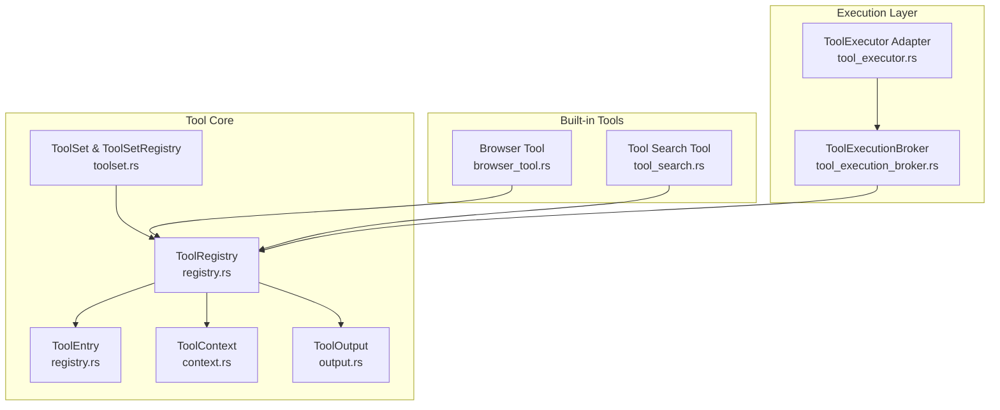
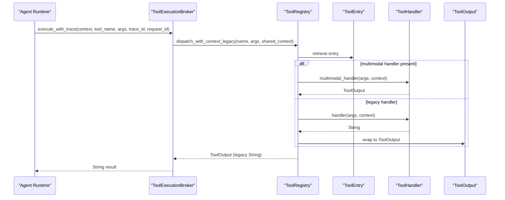
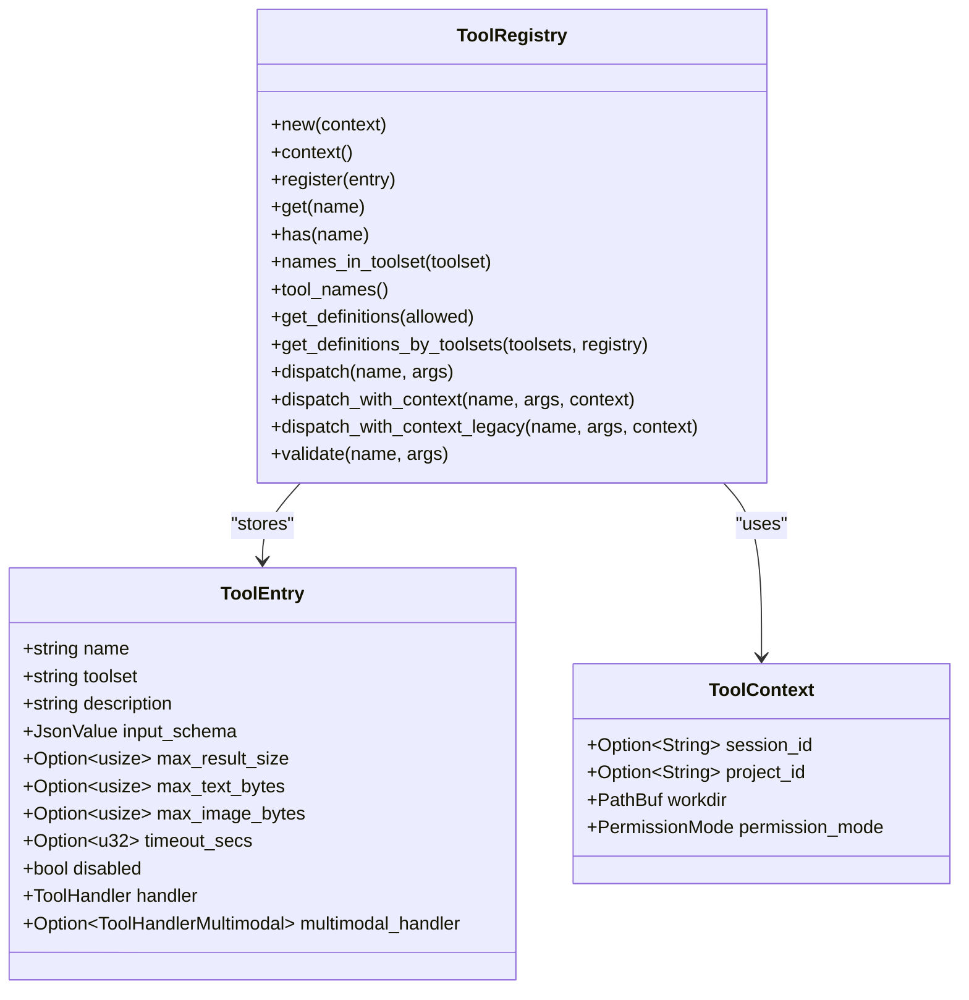
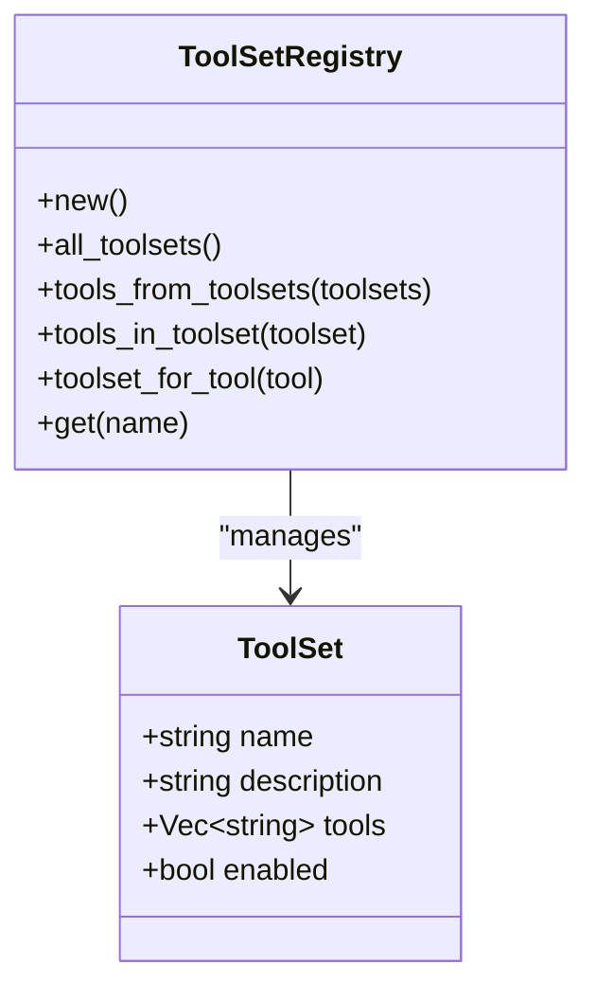
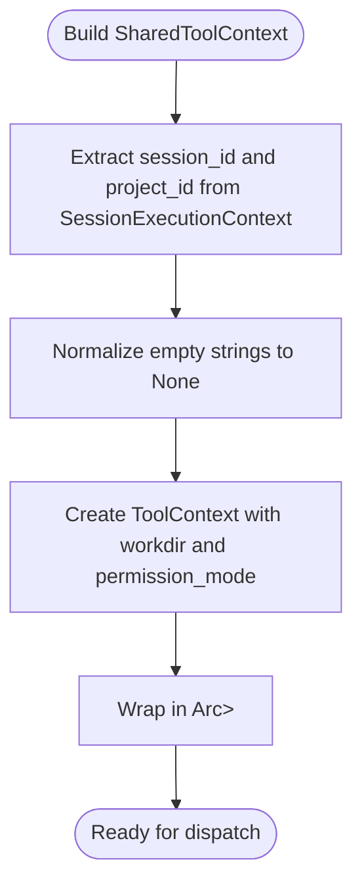
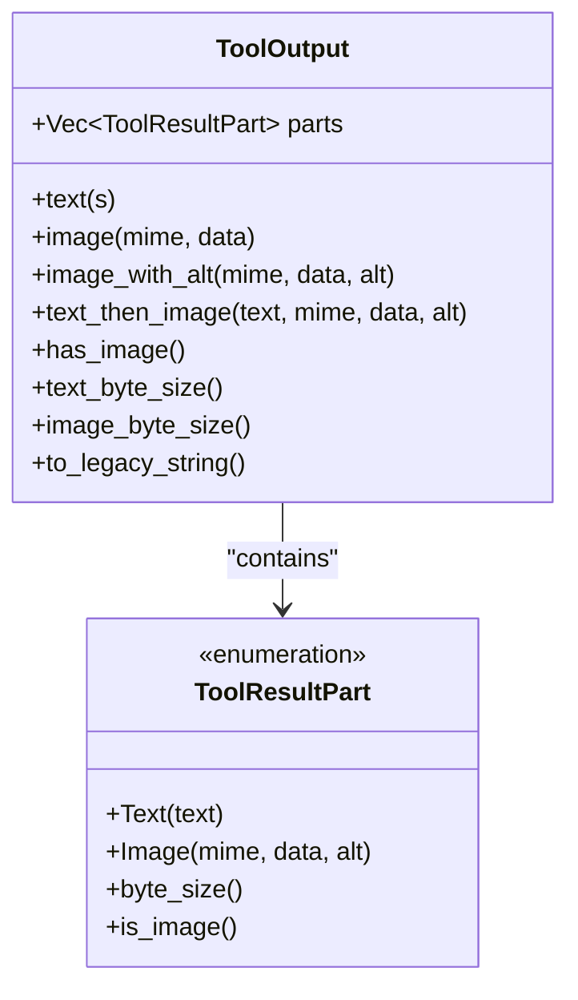
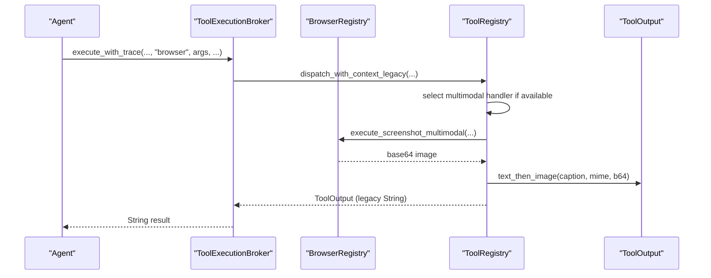
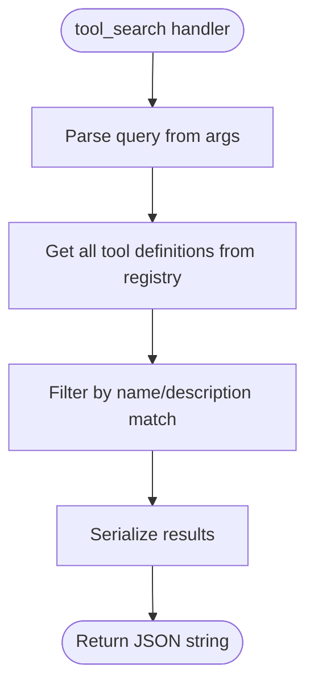
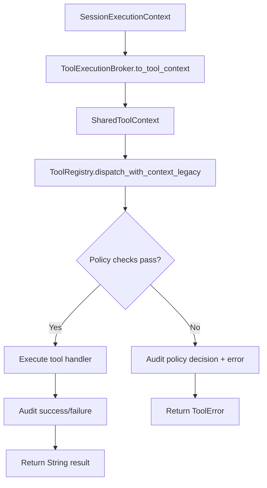
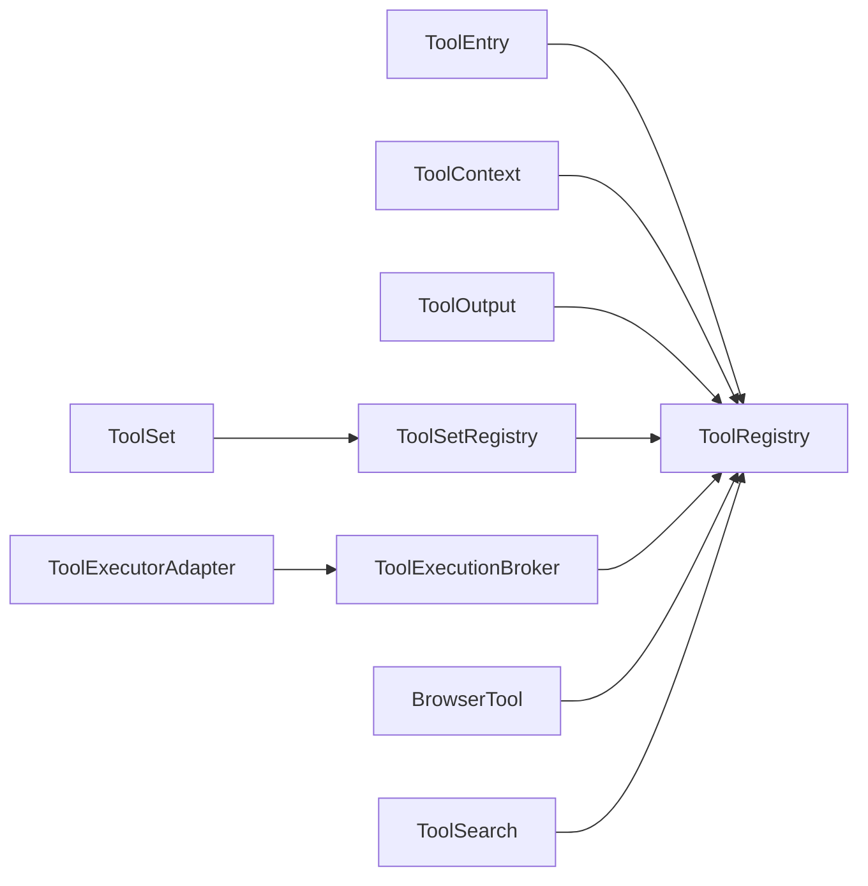

# Tool Registry & Execution Framework

<cite>
**Referenced Files in This Document**
- [registry.rs](file://src-tauri/src/modules/tools/registry.rs)
- [toolset.rs](file://src-tauri/src/modules/tools/toolset.rs)
- [context.rs](file://src-tauri/src/modules/tools/context.rs)
- [output.rs](file://src-tauri/src/modules/tools/output.rs)
- [browser_tool.rs](file://src-tauri/src/modules/tools/builtin/browser_tool.rs)
- [tool_search.rs](file://src-tauri/src/modules/tools/builtin/tool_search.rs)
- [tool_execution_broker.rs](file://src-tauri/src/modules/control_plane/tool_execution_broker.rs)
- [tool_executor.rs](file://src-tauri/src/modules/application/tool_executor.rs)
- [phase-4-tool-and-boundary.yaml](file://docs/_legacy/exec-plans/active/phase-4-tool-and-boundary.yaml)
- [tool-system.md](file://docs/design-docs/tool-system.md)
</cite>

## Table of Contents
1. [Introduction](#introduction)
2. [Project Structure](#project-structure)
3. [Core Components](#core-components)
4. [Architecture Overview](#architecture-overview)
5. [Detailed Component Analysis](#detailed-component-analysis)
6. [Dependency Analysis](#dependency-analysis)
7. [Performance Considerations](#performance-considerations)
8. [Troubleshooting Guide](#troubleshooting-guide)
9. [Conclusion](#conclusion)
10. [Appendices](#appendices)

## Introduction
This document describes the Tool Registry and Execution Framework in If2Ai, focusing on dynamic tool registration, the ToolEntry structure, tool lifecycle management, ToolSet grouping, and the integration phase 4 architecture. It explains the tool execution pipeline, including context passing, parameter validation, and result handling, and covers discovery mechanisms, error handling strategies, and performance optimization techniques. Practical examples demonstrate registering custom tools, managing dependencies, and implementing execution contracts. Versioning, compatibility checking, and upgrade paths are addressed through multimodal output evolution and backward-compatible dispatch.

## Project Structure
The tool system spans Rust modules under src-tauri/src/modules/tools and integrates with control plane and runtime modules for execution and auditing.

**Diagram sources**
- [registry.rs:353-584](file://src-tauri/src/modules/tools/registry.rs#L353-L584)
- [toolset.rs:73-155](file://src-tauri/src/modules/tools/toolset.rs#L73-L155)
- [context.rs:9-35](file://src-tauri/src/modules/tools/context.rs#L9-L35)
- [output.rs:22-84](file://src-tauri/src/modules/tools/output.rs#L22-L84)
- [browser_tool.rs:145-257](file://src-tauri/src/modules/tools/builtin/browser_tool.rs#L145-L257)
- [tool_search.rs:13-80](file://src-tauri/src/modules/tools/builtin/tool_search.rs#L13-L80)
- [tool_execution_broker.rs:15-144](file://src-tauri/src/modules/control_plane/tool_execution_broker.rs#L15-L144)
- [tool_executor.rs:52-142](file://src-tauri/src/modules/application/tool_executor.rs#L52-L142)

**Section sources**
- [registry.rs:1-100](file://src-tauri/src/modules/tools/registry.rs#L1-L100)
- [toolset.rs:1-71](file://src-tauri/src/modules/tools/toolset.rs#L1-L71)
- [context.rs:1-35](file://src-tauri/src/modules/tools/context.rs#L1-L35)
- [output.rs:1-30](file://src-tauri/src/modules/tools/output.rs#L1-L30)
- [browser_tool.rs:1-35](file://src-tauri/src/modules/tools/builtin/browser_tool.rs#L1-L35)
- [tool_search.rs:1-18](file://src-tauri/src/modules/tools/builtin/tool_search.rs#L1-L18)
- [tool_execution_broker.rs:1-20](file://src-tauri/src/modules/control_plane/tool_execution_broker.rs#L1-L20)
- [tool_executor.rs:1-20](file://src-tauri/src/modules/application/tool_executor.rs#L1-L20)

## Core Components
- ToolRegistry: Concurrent registry backed by DashMap, supporting registration, retrieval, definition export, validation, and dispatch with timeouts and size caps. It holds a shared ToolContext and supports both legacy and multimodal handlers.
- ToolEntry: Describes a tool’s metadata, schemas, handler functions, and controls (timeout, size limits, disable flag).
- ToolContext: Passes workdir, permission mode, and optional session/project scopes to tool handlers.
- ToolOutput: Multimodal result container enabling text and image parts; provides legacy string projection for backward compatibility.
- ToolSet and ToolSetRegistry: Group tools into logical sets with predefined constants and lookup utilities.
- Built-in tools: Examples include the browser tool (with multimodal screenshot) and tool search utility.
- Execution Broker and Executor: Bridge async registry to synchronous executor contracts, enforcing policies and emitting audit events.

**Section sources**
- [registry.rs:185-351](file://src-tauri/src/modules/tools/registry.rs#L185-L351)
- [registry.rs:353-584](file://src-tauri/src/modules/tools/registry.rs#L353-L584)
- [context.rs:9-35](file://src-tauri/src/modules/tools/context.rs#L9-L35)
- [output.rs:22-84](file://src-tauri/src/modules/tools/output.rs#L22-L84)
- [toolset.rs:8-71](file://src-tauri/src/modules/tools/toolset.rs#L8-L71)
- [browser_tool.rs:145-257](file://src-tauri/src/modules/tools/builtin/browser_tool.rs#L145-L257)
- [tool_search.rs:13-80](file://src-tauri/src/modules/tools/builtin/tool_search.rs#L13-L80)
- [tool_execution_broker.rs:15-144](file://src-tauri/src/modules/control_plane/tool_execution_broker.rs#L15-L144)
- [tool_executor.rs:52-142](file://src-tauri/src/modules/application/tool_executor.rs#L52-L142)

## Architecture Overview
The system separates concerns across registry, execution, and control planes. Tools are registered statically or dynamically, then dispatched with a session-aware context. The broker enforces policy and audits outcomes, while the executor adapts to legacy contracts.

**Diagram sources**
- [tool_execution_broker.rs:146-265](file://src-tauri/src/modules/control_plane/tool_execution_broker.rs#L146-L265)
- [registry.rs:496-555](file://src-tauri/src/modules/tools/registry.rs#L496-L555)
- [output.rs:86-148](file://src-tauri/src/modules/tools/output.rs#L86-L148)

**Section sources**
- [tool_execution_broker.rs:146-265](file://src-tauri/src/modules/control_plane/tool_execution_broker.rs#L146-L265)
- [registry.rs:496-555](file://src-tauri/src/modules/tools/registry.rs#L496-L555)
- [output.rs:86-148](file://src-tauri/src/modules/tools/output.rs#L86-L148)

## Detailed Component Analysis

### ToolRegistry and ToolEntry
- Registration: Ensures uniqueness and records toolset mapping.
- Retrieval: Thread-safe lookup by name.
- Definitions: Produces OpenAI-compatible function definitions, filtering disabled tools and optionally constrained by allowed names.
- Validation: Performs basic schema checks for required parameters.
- Dispatch: Supports both shared and explicit session contexts; enforces timeouts and per-modality size caps; selects multimodal handler when available.

**Diagram sources**
- [registry.rs:353-584](file://src-tauri/src/modules/tools/registry.rs#L353-L584)
- [registry.rs:185-308](file://src-tauri/src/modules/tools/registry.rs#L185-L308)
- [context.rs:9-35](file://src-tauri/src/modules/tools/context.rs#L9-L35)

**Section sources**
- [registry.rs:353-584](file://src-tauri/src/modules/tools/registry.rs#L353-L584)
- [registry.rs:185-308](file://src-tauri/src/modules/tools/registry.rs#L185-L308)
- [context.rs:9-35](file://src-tauri/src/modules/tools/context.rs#L9-L35)

### ToolSet and ToolSetRegistry
- Defines groups of tools (e.g., files, terminal, web, memory, scheduler, development).
- Maintains bidirectional mappings for tool-to-toolset and toolset membership.
- Provides utilities to enumerate tools across selected toolsets and to resolve a tool’s toolset.

**Diagram sources**
- [toolset.rs:8-71](file://src-tauri/src/modules/tools/toolset.rs#L8-L71)
- [toolset.rs:73-155](file://src-tauri/src/modules/tools/toolset.rs#L73-L155)

**Section sources**
- [toolset.rs:8-71](file://src-tauri/src/modules/tools/toolset.rs#L8-L71)
- [toolset.rs:73-155](file://src-tauri/src/modules/tools/toolset.rs#L73-L155)

### Tool Context and Session Scoping
- Encapsulates workdir, permission mode, and optional session/project identifiers.
- Fingerprinting enables tracing cross-session interference.
- Execution broker constructs a shared context from session execution context.

**Diagram sources**
- [tool_execution_broker.rs:116-144](file://src-tauri/src/modules/control_plane/tool_execution_broker.rs#L116-L144)
- [context.rs:37-45](file://src-tauri/src/modules/tools/context.rs#L37-L45)

**Section sources**
- [tool_execution_broker.rs:116-144](file://src-tauri/src/modules/control_plane/tool_execution_broker.rs#L116-L144)
- [context.rs:37-45](file://src-tauri/src/modules/tools/context.rs#L37-L45)

### Multimodal ToolOutput and Backward Compatibility
- ToolOutput replaces legacy string returns for tools that emit images.
- Provides constructors for text-only, image-only, and text-then-image outputs.
- Legacy adapters convert ToolOutput to string for existing executor contracts.

**Diagram sources**
- [output.rs:22-84](file://src-tauri/src/modules/tools/output.rs#L22-L84)
- [output.rs:86-224](file://src-tauri/src/modules/tools/output.rs#L86-L224)

**Section sources**
- [output.rs:22-224](file://src-tauri/src/modules/tools/output.rs#L22-L224)

### Built-in Tools

#### Browser Tool (Multimodal)
- Provides a unified action interface for browser automation.
- Uses a multimodal handler for screenshots, emitting a structured image part plus a text caption.
- Enforces URL safety and session takeover checks.

**Diagram sources**
- [browser_tool.rs:266-334](file://src-tauri/src/modules/tools/builtin/browser_tool.rs#L266-L334)
- [tool_execution_broker.rs:204-212](file://src-tauri/src/modules/control_plane/tool_execution_broker.rs#L204-L212)
- [registry.rs:506-555](file://src-tauri/src/modules/tools/registry.rs#L506-L555)

**Section sources**
- [browser_tool.rs:145-257](file://src-tauri/src/modules/tools/builtin/browser_tool.rs#L145-L257)
- [browser_tool.rs:266-334](file://src-tauri/src/modules/tools/builtin/browser_tool.rs#L266-L334)

#### Tool Search (Discovery)
- Implements a tool discovery utility that searches registered tools by name or description.
- Returns OpenAI-format definitions for matched tools.

**Diagram sources**
- [tool_search.rs:19-80](file://src-tauri/src/modules/tools/builtin/tool_search.rs#L19-L80)

**Section sources**
- [tool_search.rs:13-80](file://src-tauri/src/modules/tools/builtin/tool_search.rs#L13-L80)

### Execution Pipeline and Broker
- The broker translates session execution context into a shared tool context and routes tool calls through the registry.
- Audits start/end/failure events and summarizes error categories for diagnostics.
- Enforces policy gates (e.g., skill reload guard, sandbox strict mode) and boundary enforcement modes.

**Diagram sources**
- [tool_execution_broker.rs:146-265](file://src-tauri/src/modules/control_plane/tool_execution_broker.rs#L146-L265)

**Section sources**
- [tool_execution_broker.rs:146-265](file://src-tauri/src/modules/control_plane/tool_execution_broker.rs#L146-L265)

### Integration Phase 4 Architecture Notes
- The registry maintains a shared ToolContext to pass workdir and permission mode to handlers.
- High-risk tools require explicit session-scoped context unless explicitly allowed.

**Section sources**
- [phase-4-tool-and-boundary.yaml:134-171](file://docs/_legacy/exec-plans/active/phase-4-tool-and-boundary.yaml#L134-L171)
- [registry.rs:486-494](file://src-tauri/src/modules/tools/registry.rs#L486-L494)

## Dependency Analysis
- ToolRegistry depends on ToolEntry, ToolContext, and ToolOutput.
- ToolSetRegistry depends on ToolSet and maintains tool-to-toolset mappings.
- ToolExecutionBroker depends on ToolRegistry and SessionExecutionContext.
- Built-in tools depend on ToolRegistry and ToolOutput for multimodal results.
- ToolExecutor adapter depends on the broker and runtime conversion utilities.

**Diagram sources**
- [registry.rs:353-584](file://src-tauri/src/modules/tools/registry.rs#L353-L584)
- [toolset.rs:73-155](file://src-tauri/src/modules/tools/toolset.rs#L73-L155)
- [tool_execution_broker.rs:15-144](file://src-tauri/src/modules/control_plane/tool_execution_broker.rs#L15-L144)
- [tool_executor.rs:52-142](file://src-tauri/src/modules/application/tool_executor.rs#L52-L142)
- [browser_tool.rs:145-257](file://src-tauri/src/modules/tools/builtin/browser_tool.rs#L145-L257)
- [tool_search.rs:13-80](file://src-tauri/src/modules/tools/builtin/tool_search.rs#L13-L80)

**Section sources**
- [registry.rs:353-584](file://src-tauri/src/modules/tools/registry.rs#L353-L584)
- [toolset.rs:73-155](file://src-tauri/src/modules/tools/toolset.rs#L73-L155)
- [tool_execution_broker.rs:15-144](file://src-tauri/src/modules/control_plane/tool_execution_broker.rs#L15-L144)
- [tool_executor.rs:52-142](file://src-tauri/src/modules/application/tool_executor.rs#L52-L142)
- [browser_tool.rs:145-257](file://src-tauri/src/modules/tools/builtin/browser_tool.rs#L145-L257)
- [tool_search.rs:13-80](file://src-tauri/src/modules/tools/builtin/tool_search.rs#L13-L80)

## Performance Considerations
- Concurrency: DashMap-backed registry ensures high-throughput concurrent access.
- Timeouts: Per-tool timeout_secs protect against slow or stuck tools.
- Size caps: Separate text and image byte budgets enable efficient resource allocation for multimodal tools.
- Legacy compatibility: Legacy adapters minimize overhead by collapsing multimodal outputs to strings only when required.
- Policy gating: Early exits in the broker reduce unnecessary dispatches for denied operations.

[No sources needed since this section provides general guidance]

## Troubleshooting Guide
Common errors and strategies:
- Tool not found: Verify registration and name spelling; confirm tool is not disabled.
- Tool disabled: Check administrative flags and toolset configurations.
- Timeout: Increase timeout_secs or optimize tool logic; inspect handler for blocking operations.
- Output too large: Reduce result size or adjust max_text_bytes/max_image_bytes; consider streaming or truncation.
- Handler error: Inspect tool-specific logic and environment; validate input schemas.
- Boundary violations: Adjust workdir or permission mode; review sandbox and boundary enforcement settings.
- High-risk tool without explicit context: Provide session-scoped ToolContext via dispatch_with_context.

**Section sources**
- [registry.rs:147-183](file://src-tauri/src/modules/tools/registry.rs#L147-L183)
- [registry.rs:486-540](file://src-tauri/src/modules/tools/registry.rs#L486-L540)
- [tool_execution_broker.rs:325-357](file://src-tauri/src/modules/control_plane/tool_execution_broker.rs#L325-L357)

## Conclusion
The Tool Registry and Execution Framework in If2Ai provides a robust, extensible foundation for dynamic tool management. It supports safe, session-scoped execution, multimodal outputs, and policy-enforced dispatch. The design balances backward compatibility with forward-looking capabilities, enabling incremental upgrades and rich tool capabilities such as vision-enabled browser automation.

[No sources needed since this section summarizes without analyzing specific files]

## Appendices

### Practical Examples

- Registering a custom tool
  - Define a ToolEntry with name, toolset, description, input_schema, handler/multimodal_handler, and optional size/timeouts.
  - Register via ToolRegistry.register.
  - Example path: [ToolEntry fields:185-308](file://src-tauri/src/modules/tools/registry.rs#L185-L308), [register method:380-396](file://src-tauri/src/modules/tools/registry.rs#L380-L396)

- Managing tool dependencies
  - Use ToolSetRegistry to group related tools and query unions of tools across multiple toolsets.
  - Example path: [tools_from_toolsets:113-130](file://src-tauri/src/modules/tools/toolset.rs#L113-L130)

- Implementing execution contracts
  - For legacy consumers, use dispatch_with_context_legacy to obtain a String result.
  - For modern consumers, use dispatch_with_context to receive ToolOutput and handle multimodal results.
  - Example path: [dispatch_with_context:506-540](file://src-tauri/src/modules/tools/registry.rs#L506-L540), [legacy adapter:546-555](file://src-tauri/src/modules/tools/registry.rs#L546-L555)

- Tool discovery
  - Use tool_search to list available tools by fuzzy name/description matching.
  - Example path: [tool_search tool entry:13-80](file://src-tauri/src/modules/tools/builtin/tool_search.rs#L13-L80)

- Versioning and compatibility
  - Multimodal evolution: Prefer multimodal_handler for tools emitting images; legacy handlers remain supported via adapters.
  - Backward compatibility: enforce_size_caps and to_legacy_string preserve existing contracts.
  - Example path: [enforce_size_caps:310-351](file://src-tauri/src/modules/tools/registry.rs#L310-L351), [to_legacy_string:196-223](file://src-tauri/src/modules/tools/output.rs#L196-L223)

- Upgrade paths
  - Migrate tools to multimodal handlers gradually; keep legacy handlers for backward compatibility until full rollout.
  - Example path: [multimodal handler selection:523-530](file://src-tauri/src/modules/tools/registry.rs#L523-L530), [browser multimodal screenshot:266-334](file://src-tauri/src/modules/tools/builtin/browser_tool.rs#L266-L334)

**Section sources**
- [registry.rs:185-351](file://src-tauri/src/modules/tools/registry.rs#L185-L351)
- [toolset.rs:113-130](file://src-tauri/src/modules/tools/toolset.rs#L113-L130)
- [tool_search.rs:13-80](file://src-tauri/src/modules/tools/builtin/tool_search.rs#L13-L80)
- [output.rs:196-223](file://src-tauri/src/modules/tools/output.rs#L196-L223)
- [browser_tool.rs:266-334](file://src-tauri/src/modules/tools/builtin/browser_tool.rs#L266-L334)