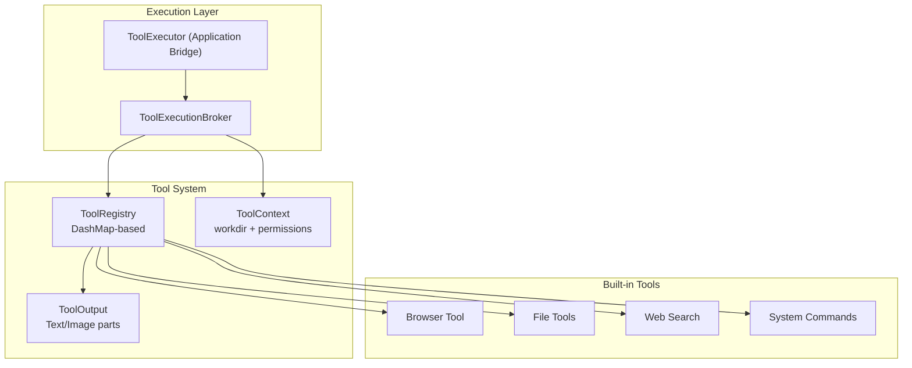
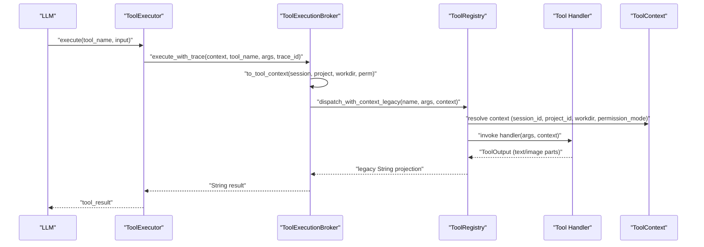
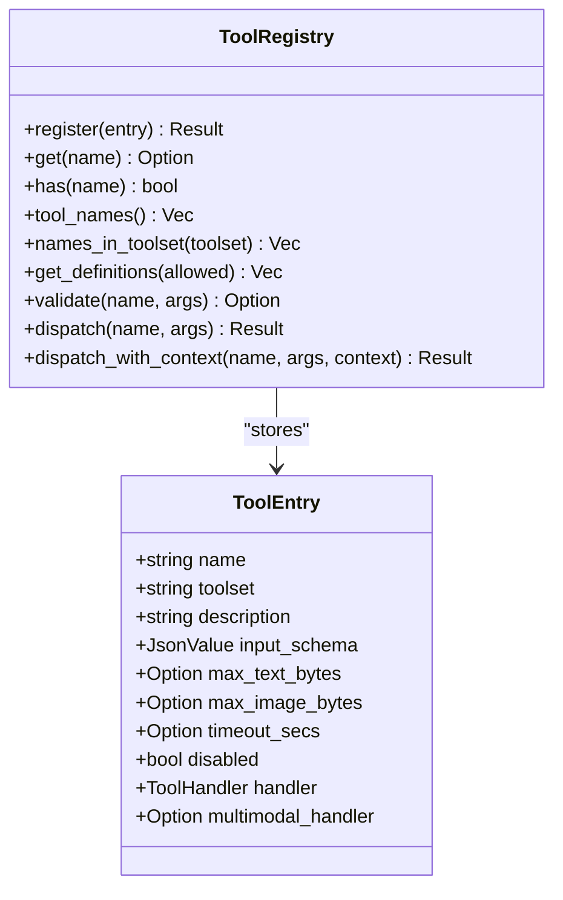
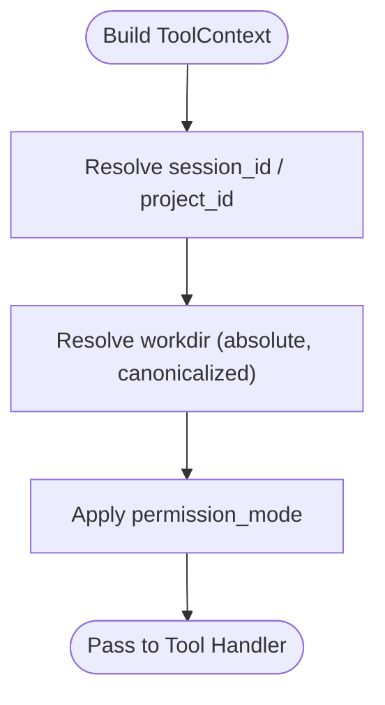
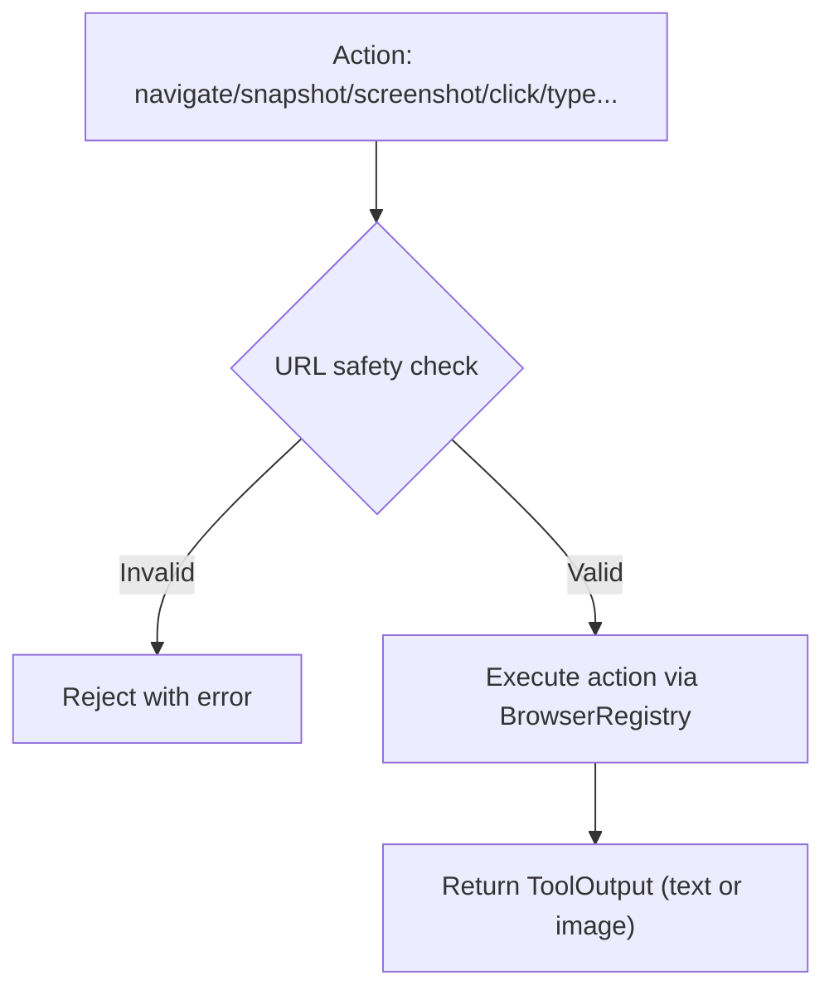
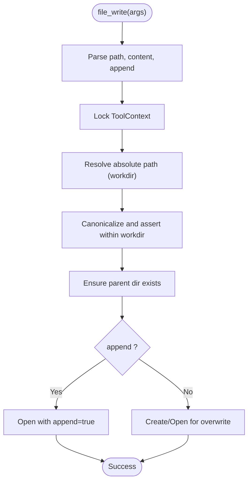
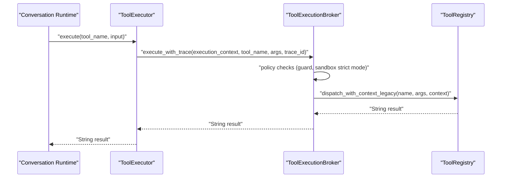
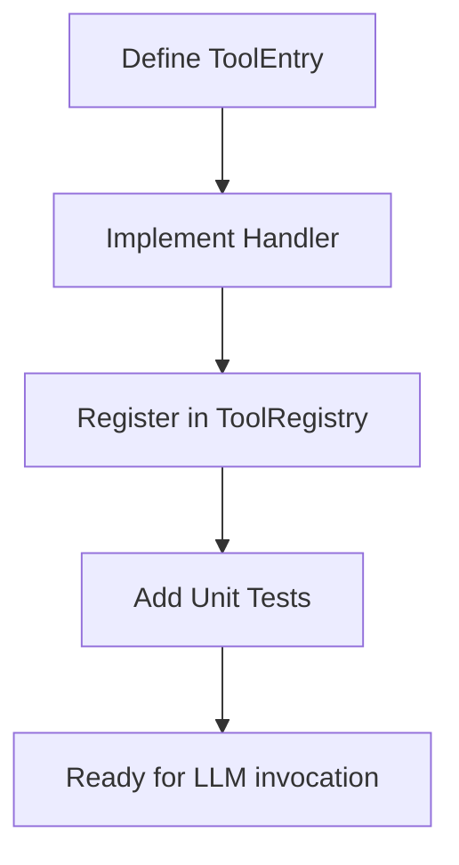
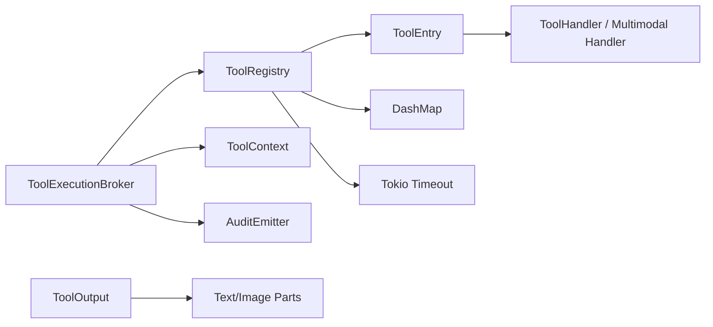

# Tool System

<cite>
**Referenced Files in This Document**
- [tool-system.md](file://docs/design-docs/tool-system.md)
- [registry.rs](file://src-tauri/src/modules/tools/registry.rs)
- [context.rs](file://src-tauri/src/modules/tools/context.rs)
- [output.rs](file://src-tauri/src/modules/tools/output.rs)
- [mod.rs](file://src-tauri/src/modules/tools/mod.rs)
- [browser_tool.rs](file://src-tauri/src/modules/tools/builtin/browser_tool.rs)
- [file_write.rs](file://src-tauri/src/modules/tools/builtin/file_write.rs)
- [web_search.rs](file://src-tauri/src/modules/tools/builtin/web_search.rs)
- [bash.rs](file://src-tauri/src/modules/tools/builtin/bash.rs)
- [tool_execution_broker.rs](file://src-tauri/src/modules/control_plane/tool_execution_broker.rs)
- [tool_executor.rs](file://src-tauri/src/modules/application/tool_executor.rs)
- [scope.rs](file://src-tauri/src/modules/memory/scope.rs)
- [agent-prompt-architecture-v1.md](file://docs/design-docs/postCLI/agent-prompt-architecture-v1.md)
- [prompt_tools_guide.rs](file://src-tauri/src/modules/runtime/prompt_tools_guide.rs)
- [web_research.rs](file://src-tauri/src/modules/runtime/prompt_tools_guide.rs)
- [phase-4-tool-and-boundary.yaml](file://docs/_legacy/exec-plans/active/phase-4-tool-and-boundary.yaml)
- [tool-activation.md](file://docs/design-docs/tool-activation.md)
</cite>

## Table of Contents
1. [Introduction](#introduction)
2. [Project Structure](#project-structure)
3. [Core Components](#core-components)
4. [Architecture Overview](#architecture-overview)
5. [Detailed Component Analysis](#detailed-component-analysis)
6. [Dependency Analysis](#dependency-analysis)
7. [Performance Considerations](#performance-considerations)
8. [Troubleshooting Guide](#troubleshooting-guide)
9. [Conclusion](#conclusion)
10. [Appendices](#appendices)

## Introduction
This document describes If2Ai’s extensible tool execution framework. It covers dynamic tool registration, context management for secure execution, parallel processing capabilities, tool definition schema, parameter validation, output handling, built-in tools (browser automation, file operations, web search, system commands), development patterns for custom tools, testing strategies, error handling, performance characteristics, security and sandboxing, and practical usage examples.

## Project Structure
The tool system is implemented primarily in Rust under the Tauri application module tree. Key areas:
- Tool registry and execution orchestration
- Built-in tools (browser, file ops, web search, terminal, memory, skills, etc.)
- Tool execution broker and application bridge
- Context and output abstractions for secure, multimodal results



**Diagram sources**
- [registry.rs:353-584](file://src-tauri/src/modules/tools/registry.rs#L353-L584)
- [context.rs:9-29](file://src-tauri/src/modules/tools/context.rs#L9-L29)
- [output.rs:24-84](file://src-tauri/src/modules/tools/output.rs#L24-L84)
- [mod.rs:26-172](file://src-tauri/src/modules/tools/mod.rs#L26-L172)
- [tool_execution_broker.rs:15-26](file://src-tauri/src/modules/control_plane/tool_execution_broker.rs#L15-L26)
- [tool_executor.rs:52-116](file://src-tauri/src/modules/application/tool_executor.rs#L52-L116)

**Section sources**
- [mod.rs:1-173](file://src-tauri/src/modules/tools/mod.rs#L1-L173)

## Core Components
- ToolRegistry: Concurrent registry storing ToolEntry definitions with OpenAI-compatible function schemas, timeouts, size limits, and multimodal handler support.
- ToolContext: Passes session/project scoping, working directory, and permission mode to tools for boundary enforcement.
- ToolOutput: Multimodal result container supporting text and image parts with per-modality size enforcement.
- ToolExecutionBroker: Bridges session execution context to registry dispatch, applies policy decisions, audit, and error summarization.
- Application ToolExecutor: Bridges async registry to the synchronous executor interface used by the conversation runtime.

Key behaviors:
- Dynamic registration of built-in tools at startup.
- Per-call context isolation for high-risk tools.
- Timeout protection and output size caps.
- OpenAI-format tool definitions for LLM invocation.

**Section sources**
- [registry.rs:147-184](file://src-tauri/src/modules/tools/registry.rs#L147-L184)
- [registry.rs:185-308](file://src-tauri/src/modules/tools/registry.rs#L185-L308)
- [registry.rs:353-584](file://src-tauri/src/modules/tools/registry.rs#L353-L584)
- [context.rs:9-29](file://src-tauri/src/modules/tools/context.rs#L9-L29)
- [output.rs:24-84](file://src-tauri/src/modules/tools/output.rs#L24-L84)
- [tool_execution_broker.rs:146-265](file://src-tauri/src/modules/control_plane/tool_execution_broker.rs#L146-L265)
- [tool_executor.rs:52-142](file://src-tauri/src/modules/application/tool_executor.rs#L52-L142)

## Architecture Overview
End-to-end flow from LLM invocation to tool execution and result handling.



**Diagram sources**
- [tool_executor.rs:73-115](file://src-tauri/src/modules/application/tool_executor.rs#L73-L115)
- [tool_execution_broker.rs:146-265](file://src-tauri/src/modules/control_plane/tool_execution_broker.rs#L146-L265)
- [registry.rs:506-555](file://src-tauri/src/modules/tools/registry.rs#L506-L555)
- [output.rs:196-224](file://src-tauri/src/modules/tools/output.rs#L196-L224)

## Detailed Component Analysis

### Tool Registry and Definition Schema
- ToolEntry encapsulates tool metadata, JSON Schema input validation, timeout, size caps, and handler variants:
  - Legacy handler returns String; multimodal handler returns ToolOutput.
- ToolRegistry supports:
  - Registration with uniqueness checks.
  - OpenAI-format function definitions export.
  - Validation of required parameters.
  - Dispatch with timeout and size enforcement.
  - Context-aware dispatch for high-risk tools.



**Diagram sources**
- [registry.rs:185-308](file://src-tauri/src/modules/tools/registry.rs#L185-L308)
- [registry.rs:353-584](file://src-tauri/src/modules/tools/registry.rs#L353-L584)

**Section sources**
- [registry.rs:185-308](file://src-tauri/src/modules/tools/registry.rs#L185-L308)
- [registry.rs:426-471](file://src-tauri/src/modules/tools/registry.rs#L426-L471)
- [registry.rs:557-583](file://src-tauri/src/modules/tools/registry.rs#L557-L583)

### Tool Context Management
- ToolContext carries:
  - Optional session_id and project_id for scope-aware tooling.
  - workdir for filesystem boundary enforcement.
  - permission_mode for capability gating.
- Context fingerprinting enables tracing and detecting cross-session interference.
- Memory scope resolution integrates ToolContext into memory queries.



**Diagram sources**
- [context.rs:38-45](file://src-tauri/src/modules/tools/context.rs#L38-L45)
- [context.rs:84-96](file://src-tauri/src/modules/tools/context.rs#L84-L96)
- [scope.rs:90-107](file://src-tauri/src/modules/memory/scope.rs#L90-L107)

**Section sources**
- [context.rs:9-29](file://src-tauri/src/modules/tools/context.rs#L9-L29)
- [context.rs:38-45](file://src-tauri/src/modules/tools/context.rs#L38-L45)
- [context.rs:84-96](file://src-tauri/src/modules/tools/context.rs#L84-L96)
- [scope.rs:90-107](file://src-tauri/src/modules/memory/scope.rs#L90-L107)

### Output Handling and Multimodal Results
- ToolOutput supports ordered parts:
  - Text parts for conventional results.
  - Image parts with MIME type and base64 data, plus optional alt text.
- Size enforcement per modality:
  - max_text_bytes and max_image_bytes enforced separately.
- Legacy compatibility:
  - to_legacy_string collapses images to placeholders for older consumers.

```mermaid
classDiagram
class ToolResultPart {
<<union>>
+Text{text : string}
+Image{mime : string, data : string, alt : Option<string>}
}
class ToolOutput {
+Vec<ToolResultPart> parts
+text(s) ToolOutput
+image(mime, data) ToolOutput
+image_with_alt(mime, data, alt) ToolOutput
+text_then_image(text, mime, data, alt) ToolOutput
+has_image() bool
+text_byte_size() usize
+image_byte_size() usize
+to_legacy_string() string
}
ToolOutput --> ToolResultPart : "contains"
```

**Diagram sources**
- [output.rs:24-84](file://src-tauri/src/modules/tools/output.rs#L24-L84)
- [output.rs:86-224](file://src-tauri/src/modules/tools/output.rs#L86-L224)

**Section sources**
- [output.rs:24-84](file://src-tauri/src/modules/tools/output.rs#L24-L84)
- [output.rs:310-351](file://src-tauri/src/modules/tools/output.rs#L310-L351)
- [output.rs:196-224](file://src-tauri/src/modules/tools/output.rs#L196-L224)

### Built-in Tools

#### Browser Automation Tool
- Capabilities: lifecycle (start/stop/navigate), perception (snapshot/screenshot), interaction (click/type/scroll/select/key/wait/evaluate), tabs, downloads, diagnostics.
- Safety: URL scheme and address checks to prevent SSRF and internal access.
- Multimodal: screenshot returns ToolOutput with image part.



**Diagram sources**
- [browser_tool.rs:39-141](file://src-tauri/src/modules/tools/builtin/browser_tool.rs#L39-L141)
- [browser_tool.rs:145-200](file://src-tauri/src/modules/tools/builtin/browser_tool.rs#L145-L200)

**Section sources**
- [browser_tool.rs:1-200](file://src-tauri/src/modules/tools/builtin/browser_tool.rs#L1-L200)

#### File Operations Tools
- file_write: Writes content to files with workdir boundary enforcement and optional append mode.
- Additional file tools include read, edit, glob/grep/content search, and more.



**Diagram sources**
- [file_write.rs:23-106](file://src-tauri/src/modules/tools/builtin/file_write.rs#L23-L106)

**Section sources**
- [file_write.rs:1-200](file://src-tauri/src/modules/tools/builtin/file_write.rs#L1-L200)

#### Web Search Tool
- Providers: prioritized selection among Tavily, SearXNG, Brave, Serper, Gemini, DuckDuckGo APIs and fallbacks.
- Output: formatted markdown with results and notices when keys are missing.

**Section sources**
- [web_search.rs:1-200](file://src-tauri/src/modules/tools/builtin/web_search.rs#L1-L200)

#### System Commands Tool (Bash)
- Sandboxing: dangerous command patterns blocked; timeout enforced; execution occurs in workdir.
- Output: structured JSON with stdout/stderr/exit_code.

**Section sources**
- [bash.rs:1-200](file://src-tauri/src/modules/tools/builtin/bash.rs#L1-L200)

### Tool Execution Broker and Application Integration
- ToolExecutionBroker:
  - Builds ToolContext from session execution context.
  - Applies policy decisions (e.g., skill reload guard, sandbox strict mode).
  - Emits audit events and summarizes errors.
- ToolExecutor (application bridge):
  - Converts async registry calls to the synchronous interface used by the conversation runtime.
  - Supports legacy string projection for backward compatibility.



**Diagram sources**
- [tool_execution_broker.rs:146-265](file://src-tauri/src/modules/control_plane/tool_execution_broker.rs#L146-L265)
- [tool_executor.rs:73-115](file://src-tauri/src/modules/application/tool_executor.rs#L73-L115)

**Section sources**
- [tool_execution_broker.rs:146-265](file://src-tauri/src/modules/control_plane/tool_execution_broker.rs#L146-L265)
- [tool_executor.rs:52-142](file://src-tauri/src/modules/application/tool_executor.rs#L52-L142)

### Tool Development Guide
- Define ToolEntry with:
  - name, toolset, description, input_schema (JSON Schema), handler (String-returning) or multimodal_handler (ToolOutput-returning), timeouts, size caps.
- Register at startup via register_builtin_tools.
- Implement handler with:
  - Parameter extraction and validation.
  - Context locking and workdir/path resolution.
  - Boundary enforcement and permission checks.
  - Timeout and size caps.
- Add unit tests validating schema, boundary, and error conditions.



**Diagram sources**
- [mod.rs:26-172](file://src-tauri/src/modules/tools/mod.rs#L26-L172)
- [registry.rs:380-396](file://src-tauri/src/modules/tools/registry.rs#L380-L396)

**Section sources**
- [mod.rs:26-172](file://src-tauri/src/modules/tools/mod.rs#L26-L172)
- [registry.rs:380-396](file://src-tauri/src/modules/tools/registry.rs#L380-L396)

## Dependency Analysis
- ToolRegistry depends on:
  - DashMap for concurrency.
  - Tokio timeout for execution protection.
  - ToolEntry for metadata and handlers.
- ToolContext and ToolOutput are foundational abstractions used by all tools.
- ToolExecutionBroker depends on:
  - ToolRegistry for dispatch.
  - SessionExecutionContext for context building.
  - Audit emitter for observability.



**Diagram sources**
- [registry.rs:1-14](file://src-tauri/src/modules/tools/registry.rs#L1-L14)
- [tool_execution_broker.rs:11-13](file://src-tauri/src/modules/control_plane/tool_execution_broker.rs#L11-L13)
- [output.rs:24-84](file://src-tauri/src/modules/tools/output.rs#L24-L84)

**Section sources**
- [registry.rs:1-14](file://src-tauri/src/modules/tools/registry.rs#L1-L14)
- [tool_execution_broker.rs:11-13](file://src-tauri/src/modules/control_plane/tool_execution_broker.rs#L11-L13)

## Performance Considerations
- Concurrency: DashMap-backed registry ensures low-contention concurrent access.
- Timeouts: Per-tool timeout_secs protect against slow or stuck tools.
- Size caps: Separate max_text_bytes and max_image_bytes enable efficient memory usage for multimodal outputs.
- Legacy string projection: Enables incremental migration to ToolOutput without impacting existing consumers.

[No sources needed since this section provides general guidance]

## Troubleshooting Guide
Common errors and resolutions:
- Tool not found: Verify registration and tool name spelling.
- Tool disabled: Check admin controls and tool entry disabled flag.
- Timeout: Increase timeout_secs or optimize tool logic.
- Output too large: Reduce result size or adjust max_text_bytes/max_image_bytes.
- Handler error: Inspect tool-specific error messages and logs.
- Boundary violations: Ensure paths are within workdir and context is properly set.

Audit summaries categorize failures by stage (pre_dispatch, execution, post_execution) and retryability.

**Section sources**
- [registry.rs:147-184](file://src-tauri/src/modules/tools/registry.rs#L147-L184)
- [tool_execution_broker.rs:268-307](file://src-tauri/src/modules/control_plane/tool_execution_broker.rs#L268-L307)

## Conclusion
If2Ai’s tool system provides a robust, secure, and extensible framework for agent-driven actions. Its design emphasizes:
- Dynamic registration and OpenAI-compatible definitions.
- Strong context and boundary enforcement for safety.
- Multimodal outputs and size enforcement.
- Policy-aware execution with auditing and error summarization.
- Practical built-in tools covering browsing, file operations, web search, and system commands.

## Appendices

### Tool Execution Context and Security
- High-risk tools require explicit session-scoped context to prevent cross-session leakage.
- Sandbox strict mode can block shell tools when sandbox is disabled.
- Shadow boundary enforcement mode logs violations without changing behavior.

**Section sources**
- [registry.rs:114-145](file://src-tauri/src/modules/tools/registry.rs#L114-L145)
- [tool_execution_broker.rs:330-357](file://src-tauri/src/modules/control_plane/tool_execution_broker.rs#L330-L357)

### Tool Routing Guidance and Prompt Integration
- System prompts can include routing advice to guide LLM usage of web tools efficiently.
- Research tool composes multiple steps (search + fetch) with concurrency.

**Section sources**
- [prompt_tools_guide.rs:665-696](file://src-tauri/src/modules/runtime/prompt_tools_guide.rs#L665-L696)
- [web_research.rs:1492-1546](file://src-tauri/src/modules/runtime/prompt_tools_guide.rs#L1492-L1546)

### Frontend Activation and Tool Definitions
- Tool definitions exported in OpenAI format for LLM invocation.
- Frontend activation plan defines Tauri commands and UI integration.

**Section sources**
- [tool-system.md:107-113](file://docs/design-docs/tool-system.md#L107-L113)
- [tool-system.md:24-29](file://docs/design-docs/tool-system.md#L24-L29)
- [tool-system.md:422-438](file://docs/design-docs/tool-system.md#L422-L438)