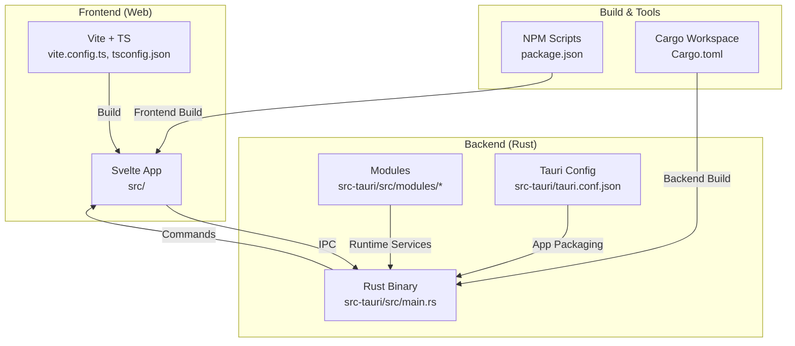
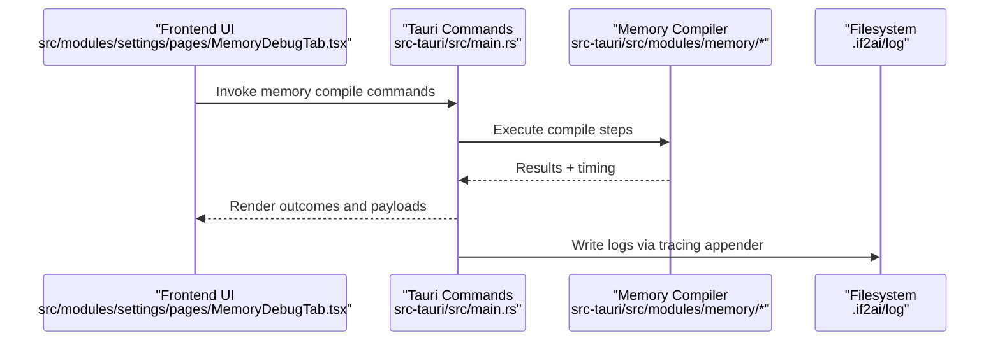
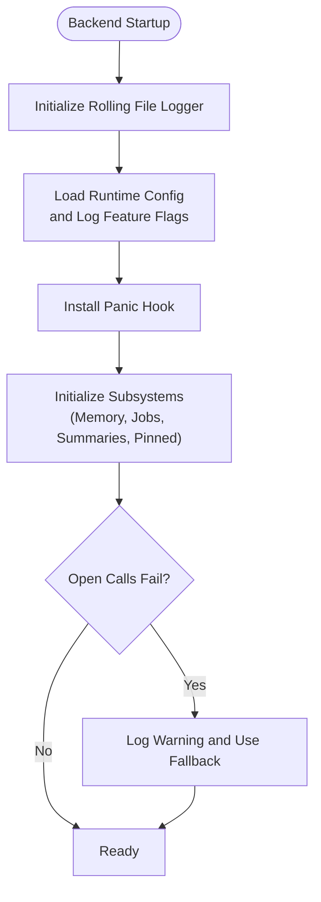
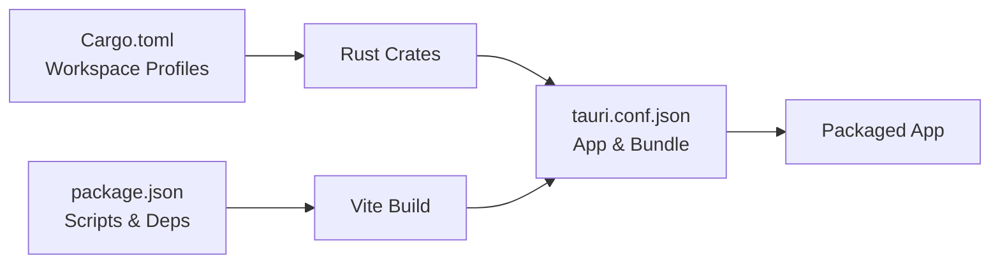

# Troubleshooting & FAQ

<cite>
**Referenced Files in This Document**
- [README.md](file://README.md)
- [DEVELOPER_GUIDE.md](file://DEVELOPER_GUIDE.md)
- [QUICKSTART.md](file://QUICKSTART.md)
- [COMPILATION_ERRORS_CHECKLIST.md](file://COMPILATION_ERRORS_CHECKLIST.md)
- [Cargo.toml](file://Cargo.toml)
- [package.json](file://package.json)
- [src-tauri/tauri.conf.json](file://src-tauri/tauri.conf.json)
- [src-tauri/src/main.rs](file://src-tauri/src/main.rs)
- [src-tauri/src/lib.rs](file://src-tauri/src/lib.rs)
- [src/modules/settings/pages/MemorySettingsPage.tsx](file://src/modules/settings/pages/MemorySettingsPage.tsx)
- [src/modules/settings/pages/MemoryDebugTab.tsx](file://src/modules/settings/pages/MemoryDebugTab.tsx)
- [src-tauri/src/modules/browser/session.rs](file://src-tauri/src/modules/browser/session.rs)
- [src-tauri/src/modules/skills/commands.rs](file://src-tauri/src/modules/skills/commands.rs)
- [src-tauri/resources/bundled-skills/qclaw-text-file/SKILL.md](file://src-tauri/resources/bundled-skills/qclaw-text-file/SKILL.md)
</cite>

## Table of Contents
1. [Introduction](#introduction)
2. [Project Structure](#project-structure)
3. [Core Components](#core-components)
4. [Architecture Overview](#architecture-overview)
5. [Detailed Component Analysis](#detailed-component-analysis)
6. [Dependency Analysis](#dependency-analysis)
7. [Performance Considerations](#performance-considerations)
8. [Troubleshooting Guide](#troubleshooting-guide)
9. [FAQ](#faq)
10. [Conclusion](#conclusion)
11. [Appendices](#appendices)

## Introduction
This document provides a comprehensive troubleshooting and FAQ guide for If2Ai users and developers. It covers installation and setup issues, build failures, runtime errors, performance tuning, platform-specific pitfalls, diagnostic strategies, and escalation paths. The goal is to help you quickly identify and resolve problems across the Tauri + Rust + Svelte stack while understanding the system’s architecture and logging mechanisms.

## Project Structure
If2Ai is a cross-platform desktop application composed of:
- Frontend (Svelte + Vite) under src/
- Backend (Rust) under src-tauri/
- Shared configuration and build scripts
- Documentation and design artifacts under docs/

**Diagram sources**
- [src-tauri/src/main.rs](file://src-tauri/src/main.rs)
- [src-tauri/tauri.conf.json](file://src-tauri/tauri.conf.json)
- [package.json](file://package.json)
- [Cargo.toml](file://Cargo.toml)

**Section sources**
- [README.md:24-46](file://README.md#L24-L46)
- [src-tauri/src/main.rs:406-437](file://src-tauri/src/main.rs#L406-L437)

## Core Components
- Tauri application lifecycle and logging: The backend initializes file logging, sets up panic hooks, and manages feature flags and runtime configuration.
- Memory subsystem: Initializes providers (fallback chain), job runner, summarization, and pinned store with graceful degradation.
- Browser control: Optional observability watchers for console/network events.
- Skills and platform compatibility: Utilities to normalize command keys and detect platform compatibility.
- Frontend diagnostics: Memory settings include a dedicated debug tab for memory compilation pipeline smoke tests.

Key runtime diagnostics and fallbacks are implemented in the backend entrypoint and modules.

**Section sources**
- [src-tauri/src/main.rs:406-782](file://src-tauri/src/main.rs#L406-L782)
- [src-tauri/src/main.rs:242-404](file://src-tauri/src/main.rs#L242-L404)
- [src-tauri/src/main.rs:329-361](file://src-tauri/src/main.rs#L329-L361)
- [src-tauri/src/modules/browser/session.rs:1288-1341](file://src-tauri/src/modules/browser/session.rs#L1288-L1341)
- [src-tauri/src/modules/skills/commands.rs:639-674](file://src-tauri/src/modules/skills/commands.rs#L639-L674)
- [src/modules/settings/pages/MemorySettingsPage.tsx:195-226](file://src/modules/settings/pages/MemorySettingsPage.tsx#L195-L226)
- [src/modules/settings/pages/MemoryDebugTab.tsx:101-106](file://src/modules/settings/pages/MemoryDebugTab.tsx#L101-L106)

## Architecture Overview
The system uses Tauri commands for IPC between frontend and backend. The backend logs to a rolling file and exposes structured telemetry via tracing. The frontend provides a settings UI with a memory debug panel to validate memory compilation steps.

**Diagram sources**
- [src/modules/settings/pages/MemoryDebugTab.tsx:101-106](file://src/modules/settings/pages/MemoryDebugTab.tsx#L101-L106)
- [src-tauri/src/main.rs:406-437](file://src-tauri/src/main.rs#L406-L437)

## Detailed Component Analysis

### Logging and Diagnostics
- File logging: The backend initializes a rolling file appender and logs to a user-local directory. Panic hooks are configured to capture panics and continue cleanup.
- Feature flags: At startup, runtime memory configuration is loaded and logged to confirm selected modes.
- Graceful degradation: Several subsystems (job runner, memory provider, session summary store, pinned store) log fallback behavior and continue operating with reduced capability.

**Diagram sources**
- [src-tauri/src/main.rs:406-466](file://src-tauri/src/main.rs#L406-L466)
- [src-tauri/src/main.rs:329-361](file://src-tauri/src/main.rs#L329-L361)
- [src-tauri/src/main.rs:242-404](file://src-tauri/src/main.rs#L242-L404)

**Section sources**
- [src-tauri/src/main.rs:406-466](file://src-tauri/src/main.rs#L406-L466)
- [src-tauri/src/main.rs:329-361](file://src-tauri/src/main.rs#L329-L361)
- [src-tauri/src/main.rs:242-404](file://src-tauri/src/main.rs#L242-L404)

### Browser Observability
- Console and network event watchers are spawned to collect logs and network errors. Failures are logged as warnings and do not block session creation.

**Section sources**
- [src-tauri/src/modules/browser/session.rs:1288-1341](file://src-tauri/src/modules/browser/session.rs#L1288-L1341)

### Skills Platform Compatibility
- Utilities normalize command keys and check platform compatibility against aliases and targets.

**Section sources**
- [src-tauri/src/modules/skills/commands.rs:639-674](file://src-tauri/src/modules/skills/commands.rs#L639-L674)

### Memory Debug UI
- The settings UI exposes a memory debug tab that runs a series of compile commands and renders outcomes inline, aiding quick smoke tests for the memory compilation pipeline.

**Section sources**
- [src/modules/settings/pages/MemorySettingsPage.tsx:195-226](file://src/modules/settings/pages/MemorySettingsPage.tsx#L195-L226)
- [src/modules/settings/pages/MemoryDebugTab.tsx:101-106](file://src/modules/settings/pages/MemoryDebugTab.tsx#L101-L106)

## Dependency Analysis
- Workspace configuration: The Rust workspace defines build profiles and dependency optimization for development and testing.
- Frontend dependencies: The package manifest lists Tauri CLI, React, and UI libraries; scripts integrate with Tauri build/dev flows.
- Tauri configuration: Defines app windows, tray icon, bundling resources, and macOS minimum system version.

**Diagram sources**
- [Cargo.toml:1-48](file://Cargo.toml#L1-L48)
- [package.json:1-85](file://package.json#L1-L85)
- [src-tauri/tauri.conf.json:1-57](file://src-tauri/tauri.conf.json#L1-L57)

**Section sources**
- [Cargo.toml:1-48](file://Cargo.toml#L1-L48)
- [package.json:1-85](file://package.json#L1-L85)
- [src-tauri/tauri.conf.json:1-57](file://src-tauri/tauri.conf.json#L1-L57)

## Performance Considerations
- Build profiles: The workspace disables incremental compilation in dev to improve caching with sccache and applies opt-level 1 to dependencies for faster runtime.
- Memory subsystem: Fallbacks ensure the app remains usable even if vector or SQLite components fail to initialize.
- Browser observability: Watchers are best-effort and do not block session startup.

Recommendations:
- Prefer nightly builds for development if using sccache to maximize cache hits.
- Monitor memory usage via the frontend memory debug UI and reduce unnecessary concurrent operations.
- Keep dependencies updated and leverage the provided build scripts to avoid rebuild bottlenecks.

**Section sources**
- [Cargo.toml:13-47](file://Cargo.toml#L13-L47)
- [src-tauri/src/main.rs:242-404](file://src-tauri/src/main.rs#L242-L404)
- [src-tauri/src/modules/browser/session.rs:1288-1341](file://src-tauri/src/modules/browser/session.rs#L1288-L1341)

## Troubleshooting Guide

### Installation and Setup
Common symptoms and resolutions:
- Missing prerequisites
  - Symptoms: Build fails due to missing toolchains or environment.
  - Resolution: Install Node.js 18+, Rust 1.60+, and platform-specific Tauri prerequisites. Verify with rustc --version and node --version.
- Tauri configuration invalid
  - Symptoms: Tauri build fails or dev server cannot start.
  - Resolution: Validate tauri.conf.json and ensure devUrl and frontendDist are correct. Rebuild after fixing.

**Section sources**
- [README.md:50-68](file://README.md#L50-L68)
- [src-tauri/tauri.conf.json:5-10](file://src-tauri/tauri.conf.json#L5-L10)

### Build Failures
- Compilation errors checklist
  - Symptoms: Multiple E0433, E0015, E0282, E0432, E0277, and warnings.
  - Resolution: Follow the structured checklist to fix module imports, const function issues, type annotations, exports, closure parameter types, and unused variables. Prioritize E0433 first, then E0015, then E0282, and finally E0432 and E0277.
- Workspace and profile issues
  - Symptoms: Slow builds or inconsistent test performance.
  - Resolution: Review workspace build profiles and dependency optimization settings. Disable incremental in dev if using sccache as recommended.

**Section sources**
- [COMPILATION_ERRORS_CHECKLIST.md:9-331](file://COMPILATION_ERRORS_CHECKLIST.md#L9-L331)
- [Cargo.toml:13-47](file://Cargo.toml#L13-L47)

### Runtime Errors
- Backend logging and panics
  - Symptoms: App crashes or unexpected behavior.
  - Resolution: Check the rolling backend.log in the user-local directory. Panic hooks capture panics and continue cleanup. Confirm feature flags and fallback behavior at startup.
- Memory subsystem failures
  - Symptoms: Memory operations fail or degrade.
  - Resolution: The system logs fallbacks for job runner, memory provider, session summary store, and pinned store. Investigate the logged reasons and retry operations.
- Browser observability
  - Symptoms: Console/network logs not captured.
  - Resolution: Watchers log warnings on enable failures but do not block session creation.

**Section sources**
- [src-tauri/src/main.rs:406-466](file://src-tauri/src/main.rs#L406-L466)
- [src-tauri/src/main.rs:329-361](file://src-tauri/src/main.rs#L329-L361)
- [src-tauri/src/main.rs:242-404](file://src-tauri/src/main.rs#L242-L404)
- [src-tauri/src/modules/browser/session.rs:1288-1341](file://src-tauri/src/modules/browser/session.rs#L1288-L1341)

### Frontend Issues
- Dev server not starting
  - Symptoms: npm run tauri dev fails.
  - Resolution: Ensure beforeDevCommand points to npm run dev and devUrl matches the Vite server. Check port availability.
- Build artifacts mismatch
  - Symptoms: App loads blank or outdated UI.
  - Resolution: Run npm run build:web and ensure frontendDist points to dist. Restart dev server after rebuilding.

**Section sources**
- [src-tauri/tauri.conf.json:5-10](file://src-tauri/tauri.conf.json#L5-L10)
- [package.json:6-16](file://package.json#L6-L16)

### Platform-Specific Issues
- macOS minimum system version
  - Symptoms: App fails to run on older macOS versions.
  - Resolution: Ensure macOS 11.0 or newer as required by the bundle configuration.
- Platform detection in skills
  - Symptoms: Skills behave differently across platforms.
  - Resolution: Use platform detection utilities and follow the platform decision rules for skills to ensure correct behavior.

**Section sources**
- [src-tauri/tauri.conf.json:51-54](file://src-tauri/tauri.conf.json#L51-L54)
- [src-tauri/src/modules/skills/commands.rs:639-674](file://src-tauri/src/modules/skills/commands.rs#L639-L674)
- [src-tauri/resources/bundled-skills/qclaw-text-file/SKILL.md:81-299](file://src-tauri/resources/bundled-skills/qclaw-text-file/SKILL.md#L81-L299)

### Diagnostic Tools and Logging Strategies
- Backend logs
  - Location: User-local log directory created at startup.
  - Strategy: Tail the rolling backend.log during development and reproduction attempts. Use INFO-level directives by default; adjust via environment if needed.
- Frontend memory debug UI
  - Use the memory debug tab to run compile commands and inspect outcomes inline.
- Browser observability
  - Watchers log warnings on enable failures; inspect logs for console/network events.

**Section sources**
- [src-tauri/src/main.rs:406-437](file://src-tauri/src/main.rs#L406-L437)
- [src/modules/settings/pages/MemorySettingsPage.tsx:195-226](file://src/modules/settings/pages/MemorySettingsPage.tsx#L195-L226)
- [src/modules/settings/pages/MemoryDebugTab.tsx:101-106](file://src/modules/settings/pages/MemoryDebugTab.tsx#L101-L106)
- [src-tauri/src/modules/browser/session.rs:1288-1341](file://src-tauri/src/modules/browser/session.rs#L1288-L1341)

### Escalation Procedures
- Gather information
  - OS version, If2Ai version, tauri.conf.json contents, backend.log excerpts, and steps to reproduce.
- Community and support
  - Use the project’s documentation navigation and consider filing issues or discussions as indicated in developer resources.

**Section sources**
- [DEVELOPER_GUIDE.md:355-360](file://DEVELOPER_GUIDE.md#L355-L360)

## FAQ

### System Requirements and Compatibility
- What versions of Node.js, Rust, and Tauri are required?
  - Node.js 18+ and npm; Rust 1.60+; platform-specific Tauri environment per OS.
- Which operating systems are supported?
  - Windows, macOS, and Linux are supported; macOS requires minimum version 11.0.

**Section sources**
- [README.md:50-54](file://README.md#L50-L54)
- [src-tauri/tauri.conf.json:51-54](file://src-tauri/tauri.conf.json#L51-L54)

### Installation and Setup
- How do I install dependencies and start development?
  - Install Node.js and Rust, then run npm install and npm run tauri dev.

**Section sources**
- [README.md:56-75](file://README.md#L56-L75)

### Build and Packaging
- Why does cargo check show module import errors?
  - Fix imports to use crate::modules::... instead of runtime::... after integrating crates into a unified library.
- How do I resolve type annotation and export errors?
  - Add explicit type annotations for generic inference and ensure all submodules are exported via mod.rs and lib.rs.

**Section sources**
- [COMPILATION_ERRORS_CHECKLIST.md:11-128](file://COMPILATION_ERRORS_CHECKLIST.md#L11-L128)
- [src-tauri/src/lib.rs:16-23](file://src-tauri/src/lib.rs#L16-L23)

### Runtime Behavior
- The app crashes on startup. What should I check?
  - Inspect backend.log for panic details and feature flag logs. Confirm fallback behavior for memory subsystems.

**Section sources**
- [src-tauri/src/main.rs:406-466](file://src-tauri/src/main.rs#L406-L466)

### Performance and Resource Management
- How can I optimize build performance?
  - Use sccache with incremental disabled in dev as recommended by the workspace profile settings.
- How do I monitor memory usage?
  - Use the memory debug tab in settings to run compile commands and observe outcomes.

**Section sources**
- [Cargo.toml:13-47](file://Cargo.toml#L13-L47)
- [src/modules/settings/pages/MemoryDebugTab.tsx:101-106](file://src/modules/settings/pages/MemoryDebugTab.tsx#L101-L106)

### Platform-Specific Notes
- How do I ensure skills behave correctly across platforms?
  - Use platform detection utilities and follow the platform decision rules for skills.

**Section sources**
- [src-tauri/src/modules/skills/commands.rs:639-674](file://src-tauri/src/modules/skills/commands.rs#L639-L674)
- [src-tauri/resources/bundled-skills/qclaw-text-file/SKILL.md:81-299](file://src-tauri/resources/bundled-skills/qclaw-text-file/SKILL.md#L81-L299)

## Conclusion
This guide consolidates actionable steps to troubleshoot If2Ai across installation, build, runtime, and performance domains. By leveraging the built-in logging, diagnostics, and platform-aware utilities, most issues can be resolved quickly. For complex scenarios, gather logs and environment details and consult the developer resources.

## Appendices

### Quick Reference: Common Commands
- Frontend: npm run tauri dev, npm run build:web, npm run build
- Backend: cargo build, cargo check, cargo test
- Harness: python -m harness runner suite --suite default

**Section sources**
- [DEVELOPER_GUIDE.md:234-266](file://DEVELOPER_GUIDE.md#L234-L266)