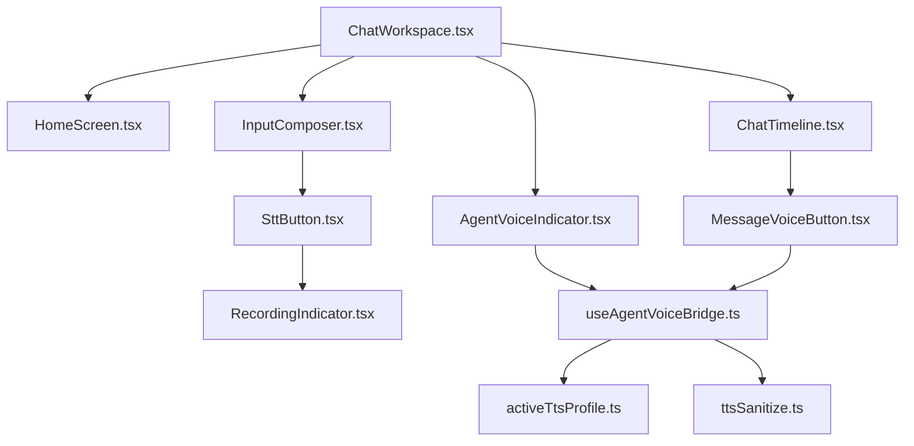
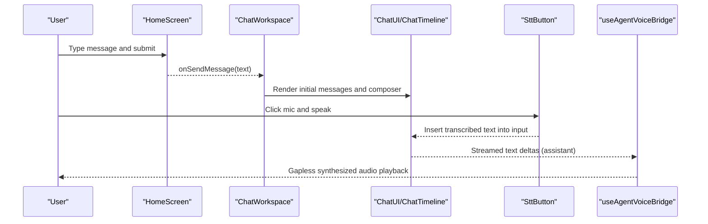
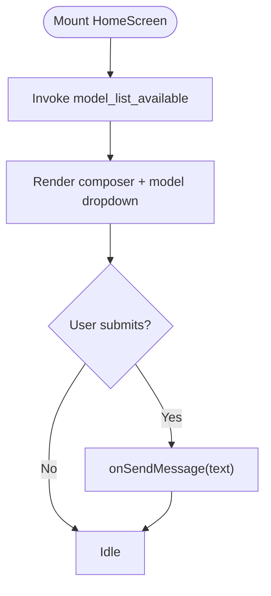
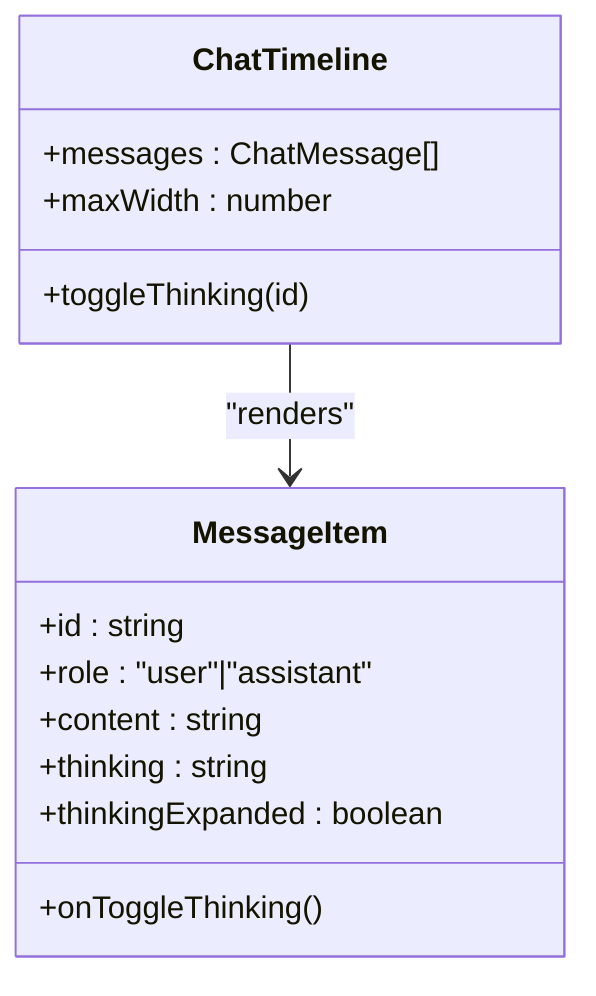
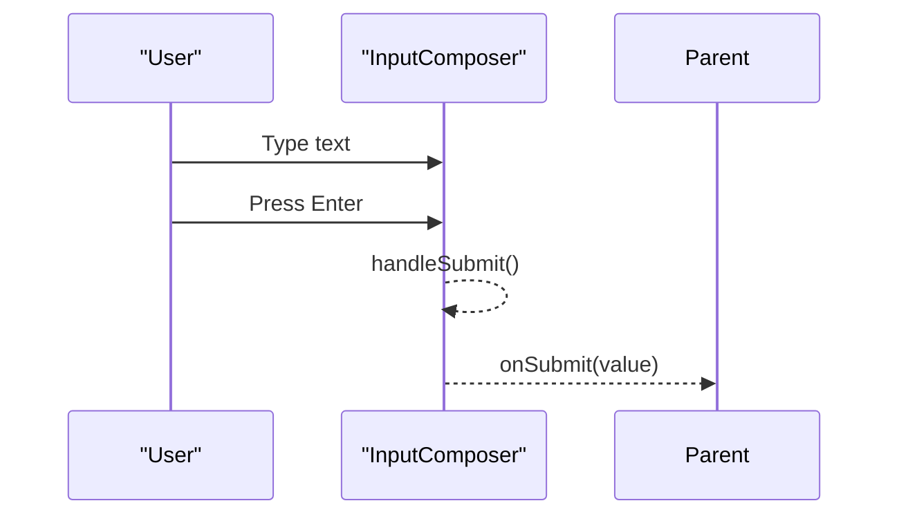
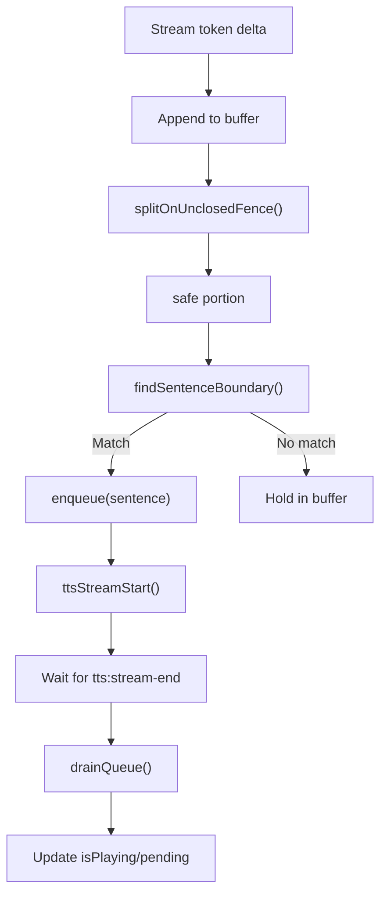
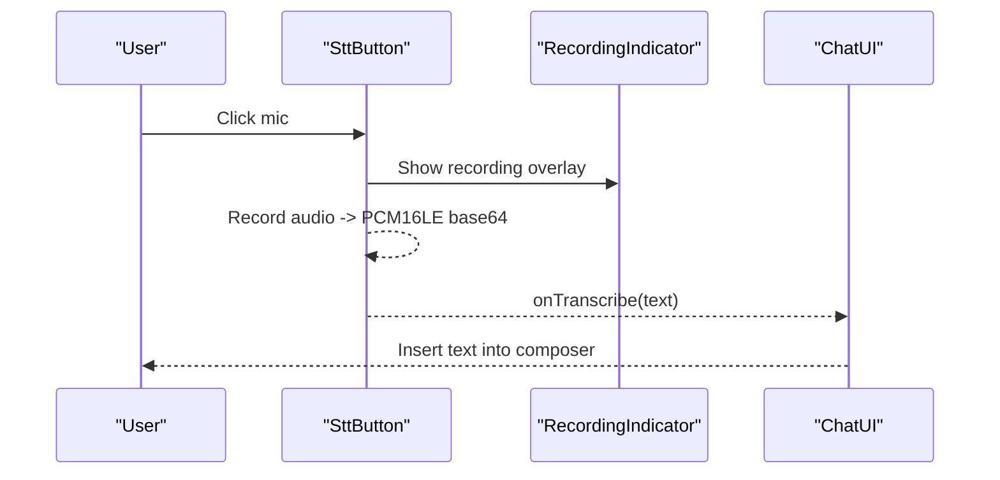
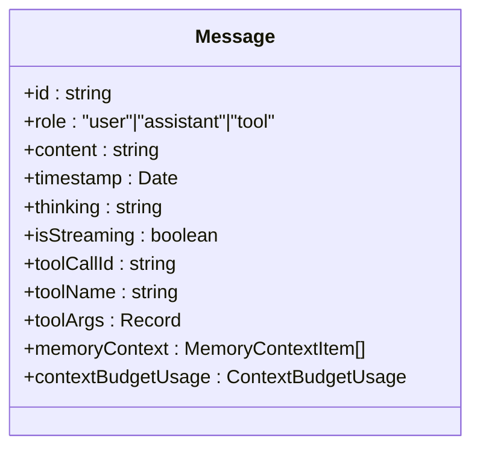
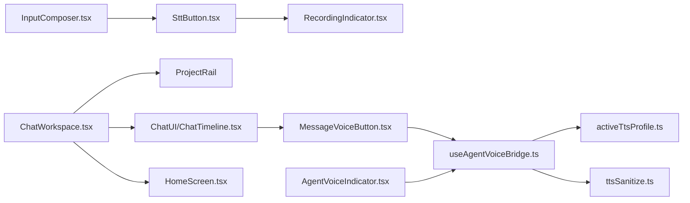

# Chat Interface & Messaging System

<cite>
**Referenced Files in This Document**
- [ChatWorkspace.tsx](file://src/modules/chat/components/ChatWorkspace.tsx)
- [HomeScreen.tsx](file://src/modules/chat/components/HomeScreen.tsx)
- [AgentVoiceIndicator.tsx](file://src/modules/chat/AgentVoiceIndicator.tsx)
- [MessageVoiceButton.tsx](file://src/modules/chat/MessageVoiceButton.tsx)
- [RecordingIndicator.tsx](file://src/modules/chat/RecordingIndicator.tsx)
- [SttButton.tsx](file://src/modules/chat/SttButton.tsx)
- [useAgentVoiceBridge.ts](file://src/modules/chat/useAgentVoiceBridge.ts)
- [activeTtsProfile.ts](file://src/modules/chat/activeTtsProfile.ts)
- [ttsSanitize.ts](file://src/modules/chat/ttsSanitize.ts)
- [types.ts](file://src/modules/chat/types.ts)
- [ChatTimeline.tsx](file://src/components/ds/ChatTimeline.tsx)
- [InputComposer.tsx](file://src/components/ds/InputComposer.tsx)
</cite>

## Table of Contents
1. [Introduction](#introduction)
2. [Project Structure](#project-structure)
3. [Core Components](#core-components)
4. [Architecture Overview](#architecture-overview)
5. [Detailed Component Analysis](#detailed-component-analysis)
6. [Dependency Analysis](#dependency-analysis)
7. [Performance Considerations](#performance-considerations)
8. [Troubleshooting Guide](#troubleshooting-guide)
9. [Conclusion](#conclusion)
10. [Appendices](#appendices)

## Introduction
This document explains the chat interface and messaging system, focusing on the ChatWorkspace layout, message rendering pipeline, streaming response handling, voice interaction components, message composition workflow, real-time updates, conversation state management, accessibility features, and responsive design patterns. It also covers custom message types, voice command handling, and cross-platform UI consistency.

## Project Structure
The chat system is organized around a workspace-centric layout with a collapsible left rail (ProjectRail), a central ChatUI surface, and optional floating overlays for voice feedback. Voice features integrate with STT and TTS via Tauri commands and a Web Audio stream player.

**Diagram sources**
- [ChatWorkspace.tsx:1-401](file://src/modules/chat/components/ChatWorkspace.tsx#L1-L401)
- [HomeScreen.tsx:1-489](file://src/modules/chat/components/HomeScreen.tsx#L1-L489)
- [ChatTimeline.tsx:1-63](file://src/components/ds/ChatTimeline.tsx#L1-L63)
- [InputComposer.tsx:1-147](file://src/components/ds/InputComposer.tsx#L1-L147)
- [AgentVoiceIndicator.tsx:1-74](file://src/modules/chat/AgentVoiceIndicator.tsx#L1-L74)
- [MessageVoiceButton.tsx:1-154](file://src/modules/chat/MessageVoiceButton.tsx#L1-L154)
- [SttButton.tsx:1-191](file://src/modules/chat/SttButton.tsx#L1-L191)
- [RecordingIndicator.tsx:1-99](file://src/modules/chat/RecordingIndicator.tsx#L1-L99)
- [useAgentVoiceBridge.ts:1-352](file://src/modules/chat/useAgentVoiceBridge.ts#L1-L352)
- [activeTtsProfile.ts:1-80](file://src/modules/chat/activeTtsProfile.ts#L1-L80)
- [ttsSanitize.ts:1-165](file://src/modules/chat/ttsSanitize.ts#L1-L165)

**Section sources**
- [ChatWorkspace.tsx:1-401](file://src/modules/chat/components/ChatWorkspace.tsx#L1-L401)
- [HomeScreen.tsx:1-489](file://src/modules/chat/components/HomeScreen.tsx#L1-L489)
- [ChatTimeline.tsx:1-63](file://src/components/ds/ChatTimeline.tsx#L1-L63)
- [InputComposer.tsx:1-147](file://src/components/ds/InputComposer.tsx#L1-L147)

## Core Components
- ChatWorkspace: Orchestrates the left ProjectRail, header controls, ChatUI, and optional BrowserCard overlay. Manages layout modes (density/font), pane resizing, and global error boundaries.
- HomeScreen: Provides the initial landing experience with project/context selection, model picker, permission mode selector, and a composer for initiating chats.
- ChatTimeline: Scrollable message list with thinking block toggles and controlled width.
- InputComposer: Composable input with attach/mic/send actions and metadata bar.
- Voice subsystem:
  - SttButton: Microphone-based speech-to-text with recording indicator.
  - RecordingIndicator: Floating overlay during recording/processing.
  - AgentVoiceIndicator: Persistent agent voice status and quick toggle.
  - MessageVoiceButton: Per-message TTS playback with state machine.
  - useAgentVoiceBridge: Streamed TTS bridge with sentence segmentation, queueing, and gapless playback.
  - activeTtsProfile: Active TTS profile resolution and persistence.
  - ttsSanitize: Text preprocessing for TTS (code fences, URLs, markdown, emoji).

**Section sources**
- [ChatWorkspace.tsx:92-401](file://src/modules/chat/components/ChatWorkspace.tsx#L92-L401)
- [HomeScreen.tsx:42-489](file://src/modules/chat/components/HomeScreen.tsx#L42-L489)
- [ChatTimeline.tsx:29-63](file://src/components/ds/ChatTimeline.tsx#L29-L63)
- [InputComposer.tsx:35-147](file://src/components/ds/InputComposer.tsx#L35-L147)
- [SttButton.tsx:53-191](file://src/modules/chat/SttButton.tsx#L53-L191)
- [RecordingIndicator.tsx:26-99](file://src/modules/chat/RecordingIndicator.tsx#L26-L99)
- [AgentVoiceIndicator.tsx:25-74](file://src/modules/chat/AgentVoiceIndicator.tsx#L25-L74)
- [MessageVoiceButton.tsx:32-154](file://src/modules/chat/MessageVoiceButton.tsx#L32-L154)
- [useAgentVoiceBridge.ts:51-352](file://src/modules/chat/useAgentVoiceBridge.ts#L51-L352)
- [activeTtsProfile.ts:61-80](file://src/modules/chat/activeTtsProfile.ts#L61-L80)
- [ttsSanitize.ts:152-165](file://src/modules/chat/ttsSanitize.ts#L152-L165)

## Architecture Overview
The chat UI is a layered composition:
- Layout: ChatWorkspace hosts the left sidebar, header, and main content area.
- Content: When a session is active, ChatUI renders messages and input; otherwise HomeScreen renders the welcome/composer.
- Voice: STT captures audio and emits text deltas; TTS bridges agent text streams to audio via a Web Audio player with strict sequencing.

**Diagram sources**
- [HomeScreen.tsx:140-155](file://src/modules/chat/components/HomeScreen.tsx#L140-L155)
- [ChatWorkspace.tsx:376-393](file://src/modules/chat/components/ChatWorkspace.tsx#L376-L393)
- [SttButton.tsx:137-143](file://src/modules/chat/SttButton.tsx#L137-L143)
- [useAgentVoiceBridge.ts:293-313](file://src/modules/chat/useAgentVoiceBridge.ts#L293-L313)

## Detailed Component Analysis

### ChatWorkspace: Layout, Sidebar, and Header
- Left sidebar (ProjectRail) is collapsible and resizable, with error boundaries to keep the workspace usable on failures.
- Header provides window drag affordance, session/project badges, browser activity indicator, model/perms controls, and right-rail toggle.
- When no active session exists, HomeScreen is shown; otherwise ChatUI is rendered.

```mermaid
flowchart TD
Start(["Render ChatWorkspace"]) --> HasSession{"activeSessionId?"}
HasSession -- "No" --> ShowHome["Show HomeScreen"]
HasSession -- "Yes" --> ShowChat["Show ChatUI<br/>with optional BrowserCard"]
ShowChat --> VoiceOverlay["AgentVoiceIndicator (floating)"]
VoiceOverlay --> End(["Done"])
ShowHome --> End
```

**Diagram sources**
- [ChatWorkspace.tsx:344-393](file://src/modules/chat/components/ChatWorkspace.tsx#L344-L393)
- [ChatWorkspace.tsx:303-312](file://src/modules/chat/components/ChatWorkspace.tsx#L303-L312)

**Section sources**
- [ChatWorkspace.tsx:138-401](file://src/modules/chat/components/ChatWorkspace.tsx#L138-L401)

### HomeScreen: Composer, Permissions, and Project Context
- Dynamically loads available models via Tauri and exposes a model selector.
- Composer supports auto-resize, Enter submission, and permission mode selection.
- Project/context pills enable switching projects and viewing workdir/branch.
- Recent sessions list allows quick resumption.

**Diagram sources**
- [HomeScreen.tsx:60-83](file://src/modules/chat/components/HomeScreen.tsx#L60-L83)
- [HomeScreen.tsx:140-155](file://src/modules/chat/components/HomeScreen.tsx#L140-L155)

**Section sources**
- [HomeScreen.tsx:42-489](file://src/modules/chat/components/HomeScreen.tsx#L42-L489)

### ChatTimeline: Message Rendering Pipeline
- Renders a centered column of messages with optional thinking blocks.
- Supports toggling thinking visibility per message.

**Diagram sources**
- [ChatTimeline.tsx:29-63](file://src/components/ds/ChatTimeline.tsx#L29-L63)

**Section sources**
- [ChatTimeline.tsx:29-63](file://src/components/ds/ChatTimeline.tsx#L29-L63)

### InputComposer: Composition Workflow
- Controlled input with submit on Enter.
- Emits submit events to parent for message creation.
- Includes model/language/branch metadata and action buttons.

**Diagram sources**
- [InputComposer.tsx:52-64](file://src/components/ds/InputComposer.tsx#L52-L64)

**Section sources**
- [InputComposer.tsx:35-147](file://src/components/ds/InputComposer.tsx#L35-L147)

### Streaming Response Handling and Conversation State
- Messages include streaming flags and tool-call metadata for granular updates.
- The bridge segments streamed text into sentences, sanitizes content, and queues synthesis to ensure gapless playback.
- Sentence detection avoids splitting mid-code fence.

**Diagram sources**
- [useAgentVoiceBridge.ts:293-313](file://src/modules/chat/useAgentVoiceBridge.ts#L293-L313)
- [useAgentVoiceBridge.ts:231-272](file://src/modules/chat/useAgentVoiceBridge.ts#L231-L272)
- [ttsSanitize.ts:41-51](file://src/modules/chat/ttsSanitize.ts#L41-L51)

**Section sources**
- [types.ts:21-74](file://src/modules/chat/types.ts#L21-L74)
- [useAgentVoiceBridge.ts:51-352](file://src/modules/chat/useAgentVoiceBridge.ts#L51-L352)
- [ttsSanitize.ts:152-165](file://src/modules/chat/ttsSanitize.ts#L152-L165)

### Voice Interaction Components
- SttButton: Records microphone audio, converts to PCM16LE base64, invokes stt_transcribe, and inserts recognized text into the composer.
- RecordingIndicator: Floating overlay with pulsing dot, amplitude bars, and stopwatch during recording; spinner during processing.
- AgentVoiceIndicator: Persistent indicator showing agent voice status, pending synthesis count, and quick toggle.
- MessageVoiceButton: Per-assistant-message play/stop with state machine and profile resolution.
- useAgentVoiceBridge: Centralized bridge managing enabled state, voice ID/profile, queueing, and stream sequencing.
- activeTtsProfile: Resolves active TTS profile and persists selection across windows.
- ttsSanitize: Preprocesses text to remove code fences, URLs, markdown, and emoji for natural TTS.

**Diagram sources**
- [SttButton.tsx:137-143](file://src/modules/chat/SttButton.tsx#L137-L143)
- [RecordingIndicator.tsx:26-99](file://src/modules/chat/RecordingIndicator.tsx#L26-L99)
- [ChatWorkspace.tsx:349-372](file://src/modules/chat/components/ChatWorkspace.tsx#L349-L372)

**Section sources**
- [SttButton.tsx:53-191](file://src/modules/chat/SttButton.tsx#L53-L191)
- [RecordingIndicator.tsx:26-99](file://src/modules/chat/RecordingIndicator.tsx#L26-L99)
- [AgentVoiceIndicator.tsx:25-74](file://src/modules/chat/AgentVoiceIndicator.tsx#L25-L74)
- [MessageVoiceButton.tsx:32-154](file://src/modules/chat/MessageVoiceButton.tsx#L32-L154)
- [useAgentVoiceBridge.ts:51-352](file://src/modules/chat/useAgentVoiceBridge.ts#L51-L352)
- [activeTtsProfile.ts:61-80](file://src/modules/chat/activeTtsProfile.ts#L61-L80)
- [ttsSanitize.ts:152-165](file://src/modules/chat/ttsSanitize.ts#L152-L165)

### Custom Message Types and Tool Calls
- Message type supports roles (user, assistant, tool), timestamps, thinking content, streaming flags, tool-call metadata, memory context, and status labels.
- ToolCallMessage and ThinkingBlock are designed to render specialized content within the message list.

**Diagram sources**
- [types.ts:21-74](file://src/modules/chat/types.ts#L21-L74)

**Section sources**
- [types.ts:21-74](file://src/modules/chat/types.ts#L21-L74)

### Accessibility Features
- Keyboard navigation: Enter to submit, Escape to dismiss dropdowns, Tab order preserved.
- Focus states: Composer highlights on focus; buttons expose aria-labels and titles.
- Live regions: RecordingIndicator uses role="status" and aria-live="polite".
- Disabled states: Buttons reflect disabled state; loading states use spinners.
- ARIA attributes: Toggle buttons include aria-pressed and aria-labels.

**Section sources**
- [HomeScreen.tsx:122-138](file://src/modules/chat/components/HomeScreen.tsx#L122-L138)
- [RecordingIndicator.tsx:48-51](file://src/modules/chat/RecordingIndicator.tsx#L48-L51)
- [InputComposer.tsx:99-109](file://src/components/ds/InputComposer.tsx#L99-L109)

### Responsive Design Patterns and Cross-Platform Consistency
- Layout adapts via CSS transitions and pointer-driven resizing; left pane collapses with transform and opacity.
- Density and font modes persist in localStorage and are applied to ChatUI.
- Cross-window synchronization ensures settings changes (profiles, agent voice) propagate instantly across browser windows.
- Floating overlays (RecordingIndicator, AgentVoiceIndicator) use portals to avoid clipping and maintain consistent z-index stacking.

**Section sources**
- [ChatWorkspace.tsx:145-181](file://src/modules/chat/components/ChatWorkspace.tsx#L145-L181)
- [RecordingIndicator.tsx:47-90](file://src/modules/chat/RecordingIndicator.tsx#L47-L90)
- [AgentVoiceIndicator.tsx:28-36](file://src/modules/chat/AgentVoiceIndicator.tsx#L28-L36)

## Dependency Analysis
- ChatWorkspace depends on ProjectRail, ChatUI, HomeScreen, and BrowserCard.
- Voice components depend on Tauri commands (stt_transcribe, ttsStreamStart), Web Audio stream player, and cross-window sync.
- useAgentVoiceBridge depends on activeTtsProfile and ttsSanitize for voice selection and text preprocessing.

**Diagram sources**
- [ChatWorkspace.tsx:18-21](file://src/modules/chat/components/ChatWorkspace.tsx#L18-L21)
- [SttButton.tsx:17-19](file://src/modules/chat/SttButton.tsx#L17-L19)
- [AgentVoiceIndicator.tsx:16-18](file://src/modules/chat/AgentVoiceIndicator.tsx#L16-L18)
- [MessageVoiceButton.tsx:16-21](file://src/modules/chat/MessageVoiceButton.tsx#L16-L21)
- [useAgentVoiceBridge.ts:26-31](file://src/modules/chat/useAgentVoiceBridge.ts#L26-L31)

**Section sources**
- [ChatWorkspace.tsx:18-21](file://src/modules/chat/components/ChatWorkspace.tsx#L18-L21)
- [SttButton.tsx:17-19](file://src/modules/chat/SttButton.tsx#L17-L19)
- [AgentVoiceIndicator.tsx:16-18](file://src/modules/chat/AgentVoiceIndicator.tsx#L16-L18)
- [MessageVoiceButton.tsx:16-21](file://src/modules/chat/MessageVoiceButton.tsx#L16-L21)
- [useAgentVoiceBridge.ts:26-31](file://src/modules/chat/useAgentVoiceBridge.ts#L26-L31)

## Performance Considerations
- Streaming TTS sequencing prevents chunk drops by awaiting stream-end events before starting the next synthesis.
- Queue draining runs serially to guarantee gapless playback and correct stream association.
- Text sanitization is performed incrementally for streaming and proactively splits on sentence boundaries to minimize latency.
- Local storage reads/writes for layout preferences are guarded to avoid crashing the workspace.

[No sources needed since this section provides general guidance]

## Troubleshooting Guide
- STT model not downloaded: SttButton displays a guided toast and remains clickable to prompt the user to download the model.
- Microphone access denied: SttButton shows a toast prompting system permission checks.
- TTS synthesis errors: MessageVoiceButton enters error state and auto-resets after a delay; AgentVoiceIndicator shows pending count and can be toggled off.
- Cross-window settings not applying: useAgentVoiceBridge listens for cross-window changes and refreshes active profile and enabled state.

**Section sources**
- [SttButton.tsx:83-89](file://src/modules/chat/SttButton.tsx#L83-L89)
- [SttButton.tsx:129-134](file://src/modules/chat/SttButton.tsx#L129-L134)
- [MessageVoiceButton.tsx:111-116](file://src/modules/chat/MessageVoiceButton.tsx#L111-L116)
- [AgentVoiceIndicator.tsx:28-36](file://src/modules/chat/AgentVoiceIndicator.tsx#L28-L36)
- [useAgentVoiceBridge.ts:114-144](file://src/modules/chat/useAgentVoiceBridge.ts#L114-L144)

## Conclusion
The chat interface integrates a robust layout with a voice-first UX. The streaming TTS bridge ensures high-quality, gapless audio playback synchronized with agent responses, while STT enables hands-free input. The system balances responsiveness, accessibility, and cross-platform consistency through careful state management, event sequencing, and UI overlays.

[No sources needed since this section summarizes without analyzing specific files]

## Appendices

### Example Workflows

- Voice Command Handling
  - User clicks mic, starts recording; RecordingIndicator appears.
  - On stop, audio is converted and sent to stt_transcribe; recognized text is inserted into the composer.
  - The user submits the message; the assistant responds with streamed text.

- Custom Message Types
  - Tool-call messages carry tool metadata and status; thinking blocks can be expanded per message.
  - Memory context and budget usage are surfaced alongside messages for transparency.

- Real-Time Updates
  - Messages update progressively as tokens arrive; streaming flags and tool-call IDs enable precise UI updates.
  - Pending synthesis count and isPlaying state inform the AgentVoiceIndicator.

[No sources needed since this section provides general guidance]