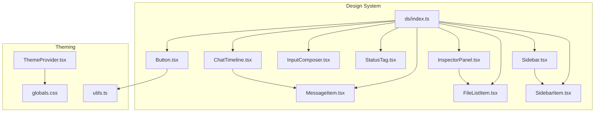
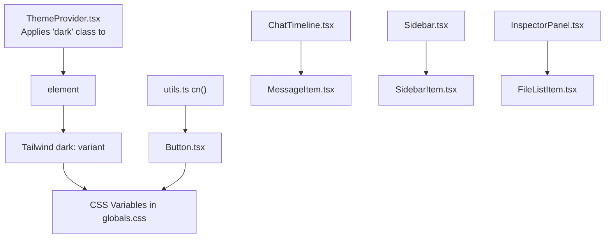
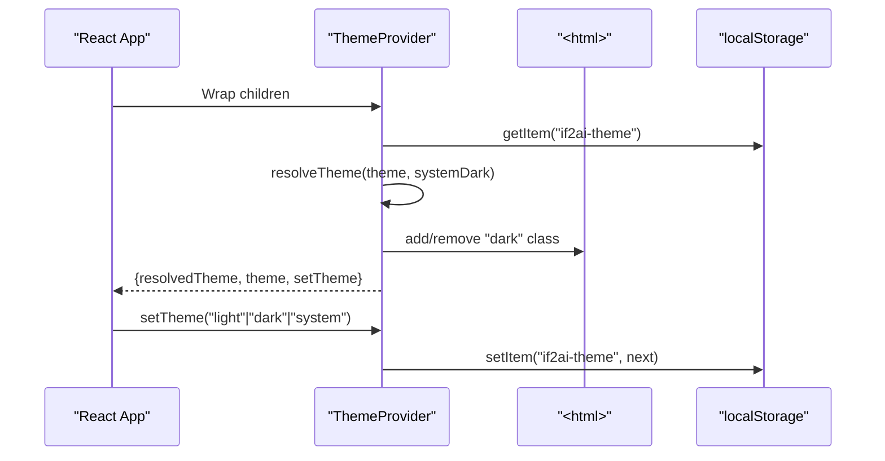
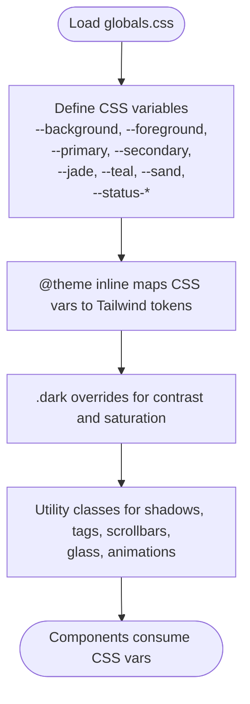
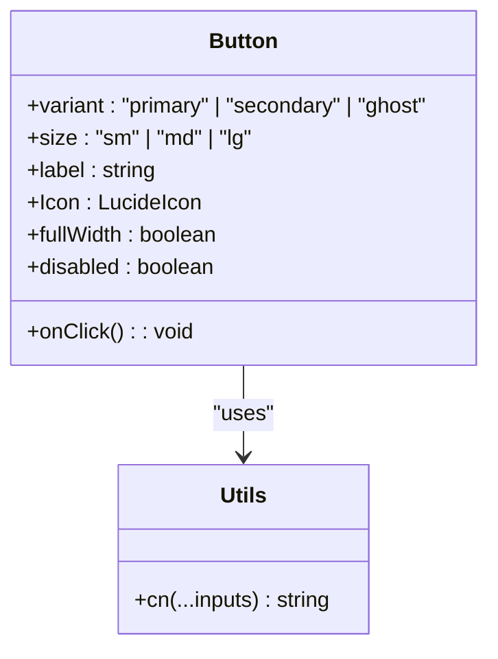
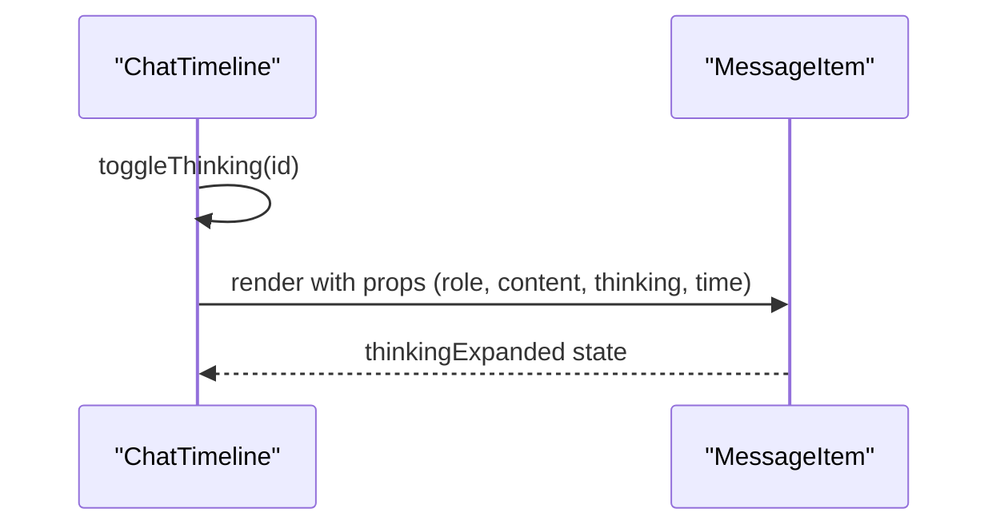
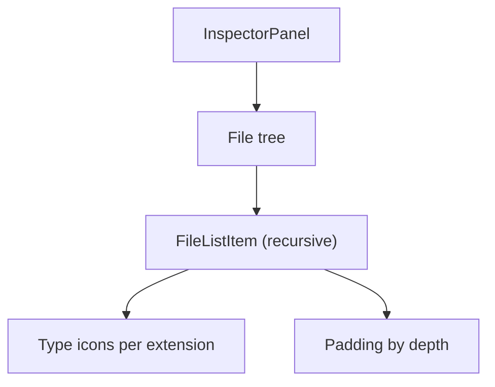
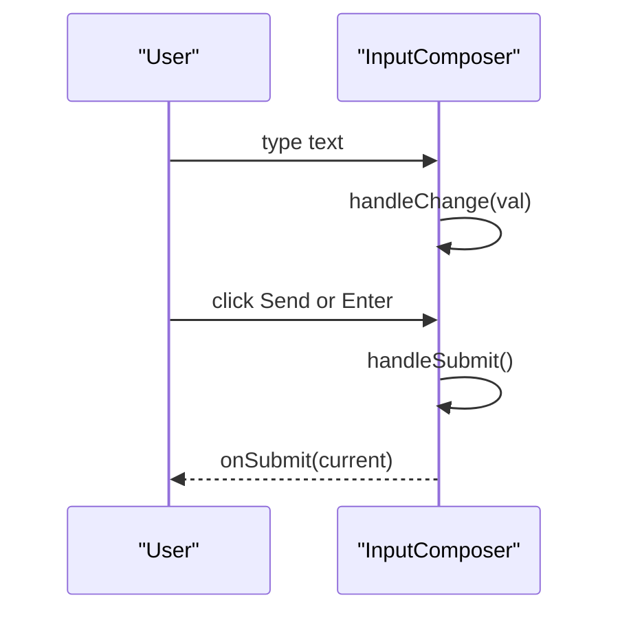
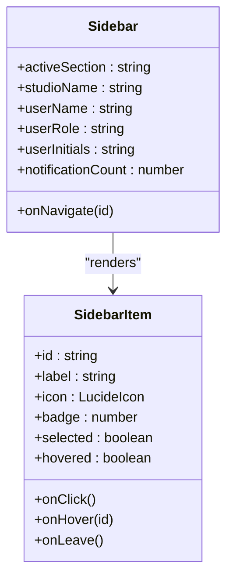
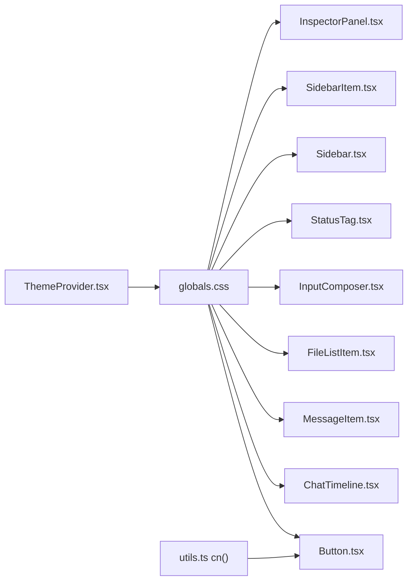

# Component Library & Theming

<cite>
**Referenced Files in This Document**
- [ThemeProvider.tsx](file://src/components/theme/ThemeProvider.tsx)
- [globals.css](file://src/styles/globals.css)
- [utils.ts](file://src/lib/utils.ts)
- [index.ts](file://src/components/ds/index.ts)
- [Button.tsx](file://src/components/ds/Button.tsx)
- [ChatTimeline.tsx](file://src/components/ds/ChatTimeline.tsx)
- [MessageItem.tsx](file://src/components/ds/MessageItem.tsx)
- [FileListItem.tsx](file://src/components/ds/FileListItem.tsx)
- [InputComposer.tsx](file://src/components/ds/InputComposer.tsx)
- [StatusTag.tsx](file://src/components/ds/StatusTag.tsx)
- [Sidebar.tsx](file://src/components/ds/Sidebar.tsx)
- [SidebarItem.tsx](file://src/components/ds/SidebarItem.tsx)
- [InspectorPanel.tsx](file://src/components/ds/InspectorPanel.tsx)
</cite>

## Table of Contents
1. [Introduction](#introduction)
2. [Project Structure](#project-structure)
3. [Core Components](#core-components)
4. [Architecture Overview](#architecture-overview)
5. [Detailed Component Analysis](#detailed-component-analysis)
6. [Dependency Analysis](#dependency-analysis)
7. [Performance Considerations](#performance-considerations)
8. [Troubleshooting Guide](#troubleshooting-guide)
9. [Conclusion](#conclusion)
10. [Appendices](#appendices)

## Introduction
This document describes the UI component library and theming system used in the project. It focuses on the foundational design system components (Button, ChatTimeline, FileListItem, InputComposer, and others), the Radix UI-inspired ThemeProvider for dark/light/system mode switching, and the Tailwind CSS configuration that powers design tokens and responsive patterns. It also explains component composition patterns, extending the library, maintaining design consistency, accessibility features, and cross-platform styling considerations.

## Project Structure
The design system lives under the components directory, with a dedicated design system folder exporting reusable building blocks. Theming is centralized in a ThemeProvider that integrates with Tailwind’s dark variant and CSS variables. Styles are configured globally via a Tailwind-based CSS file that defines a cohesive design token system.



**Diagram sources**
- [index.ts:1-32](file://src/components/ds/index.ts#L1-L32)
- [ThemeProvider.tsx:1-101](file://src/components/theme/ThemeProvider.tsx#L1-L101)
- [globals.css:1-680](file://src/styles/globals.css#L1-L680)
- [utils.ts:1-7](file://src/lib/utils.ts#L1-L7)
- [Button.tsx:1-69](file://src/components/ds/Button.tsx#L1-L69)
- [ChatTimeline.tsx:1-63](file://src/components/ds/ChatTimeline.tsx#L1-L63)
- [MessageItem.tsx:1-128](file://src/components/ds/MessageItem.tsx#L1-L128)
- [FileListItem.tsx:1-94](file://src/components/ds/FileListItem.tsx#L1-L94)
- [InputComposer.tsx:1-147](file://src/components/ds/InputComposer.tsx#L1-L147)
- [StatusTag.tsx:1-64](file://src/components/ds/StatusTag.tsx#L1-L64)
- [Sidebar.tsx:1-170](file://src/components/ds/Sidebar.tsx#L1-L170)
- [SidebarItem.tsx:1-93](file://src/components/ds/SidebarItem.tsx#L1-L93)
- [InspectorPanel.tsx:1-99](file://src/components/ds/InspectorPanel.tsx#L1-L99)

**Section sources**
- [index.ts:1-32](file://src/components/ds/index.ts#L1-L32)
- [ThemeProvider.tsx:1-101](file://src/components/theme/ThemeProvider.tsx#L1-L101)
- [globals.css:1-680](file://src/styles/globals.css#L1-L680)
- [utils.ts:1-7](file://src/lib/utils.ts#L1-L7)

## Core Components
This section outlines the foundational design system components and their roles in the UI.

- Button: A versatile button with variants (primary, secondary, ghost), sizes (sm, md, lg), and optional icons and full-width support. It uses CSS variables for colors and transitions for interactive feedback.
- ChatTimeline: A scrollable timeline container for chat messages with a centered content width and integrated MessageItem rendering.
- MessageItem: Renders assistant or user messages with optional collapsible thinking blocks, timestamps, and copy actions.
- FileListItem: A recursive file/folder tree item supporting indentation, chevron rotation, and file-type-specific icons.
- InputComposer: A chat input area with attachment, voice, and send controls, plus metadata rows for model, language, access level, branch, and settings.
- StatusTag: A semantic status badge using CSS variables for colors and a standardized tag pill style.
- Sidebar and SidebarItem: A left navigation sidebar with grouped items, badges, notifications, and a user card; individual items highlight on hover or selection.
- InspectorPanel: A right-side inspector panel with project header, skills badge, sort controls, and a file tree.

**Section sources**
- [Button.tsx:1-69](file://src/components/ds/Button.tsx#L1-L69)
- [ChatTimeline.tsx:1-63](file://src/components/ds/ChatTimeline.tsx#L1-L63)
- [MessageItem.tsx:1-128](file://src/components/ds/MessageItem.tsx#L1-L128)
- [FileListItem.tsx:1-94](file://src/components/ds/FileListItem.tsx#L1-L94)
- [InputComposer.tsx:1-147](file://src/components/ds/InputComposer.tsx#L1-L147)
- [StatusTag.tsx:1-64](file://src/components/ds/StatusTag.tsx#L1-L64)
- [Sidebar.tsx:1-170](file://src/components/ds/Sidebar.tsx#L1-L170)
- [SidebarItem.tsx:1-93](file://src/components/ds/SidebarItem.tsx#L1-L93)
- [InspectorPanel.tsx:1-99](file://src/components/ds/InspectorPanel.tsx#L1-L99)

## Architecture Overview
The design system components rely on:
- Tailwind CSS with a custom design token system mapped to CSS variables.
- A ThemeProvider that applies dark mode via a root class and persists user preferences.
- Utility functions for composing Tailwind classes safely.



**Diagram sources**
- [ThemeProvider.tsx:53-95](file://src/components/theme/ThemeProvider.tsx#L53-L95)
- [globals.css:7-94](file://src/styles/globals.css#L7-L94)
- [utils.ts:4-6](file://src/lib/utils.ts#L4-L6)
- [Button.tsx:44-68](file://src/components/ds/Button.tsx#L44-L68)
- [ChatTimeline.tsx:29-62](file://src/components/ds/ChatTimeline.tsx#L29-L62)
- [MessageItem.tsx:32-98](file://src/components/ds/MessageItem.tsx#L32-L98)
- [Sidebar.tsx:67-169](file://src/components/ds/Sidebar.tsx#L67-L169)
- [SidebarItem.tsx:39-92](file://src/components/ds/SidebarItem.tsx#L39-L92)
- [InspectorPanel.tsx:28-98](file://src/components/ds/InspectorPanel.tsx#L28-L98)
- [FileListItem.tsx:42-93](file://src/components/ds/FileListItem.tsx#L42-L93)

## Detailed Component Analysis

### ThemeProvider Implementation
The ThemeProvider manages theme resolution and persistence:
- Reads user preference from localStorage or defaults to system.
- Subscribes to OS color-scheme media query changes.
- Applies/removes the dark class on the root element to activate Tailwind dark variants.
- Exposes a hook to read and update the theme.



**Diagram sources**
- [ThemeProvider.tsx:53-95](file://src/components/theme/ThemeProvider.tsx#L53-L95)

**Section sources**
- [ThemeProvider.tsx:1-101](file://src/components/theme/ThemeProvider.tsx#L1-L101)

### Tailwind CSS Configuration and Design Tokens
The global stylesheet defines:
- A custom @theme directive mapping CSS variables to Tailwind tokens.
- A comprehensive palette including brand colors, surfaces, shadows, typography, spacing, and status tokens.
- Dark mode overrides that adjust colors while preserving the Jade Mist Teal aesthetic.
- Utility classes for shadows, fonts, text scales, scrollbars, status badges, tag pills, glass surfaces, and animations.



**Diagram sources**
- [globals.css:12-94](file://src/styles/globals.css#L12-L94)
- [globals.css:276-378](file://src/styles/globals.css#L276-L378)
- [globals.css:590-679](file://src/styles/globals.css#L590-L679)

**Section sources**
- [globals.css:1-680](file://src/styles/globals.css#L1-L680)

### Button Component
Button supports variants, sizes, icons, and full-width layout. It composes Tailwind classes via a utility function and uses CSS variables for colors and transitions.



**Diagram sources**
- [Button.tsx:33-68](file://src/components/ds/Button.tsx#L33-L68)
- [utils.ts:4-6](file://src/lib/utils.ts#L4-L6)

**Section sources**
- [Button.tsx:1-69](file://src/components/ds/Button.tsx#L1-L69)
- [utils.ts:1-7](file://src/lib/utils.ts#L1-L7)

### ChatTimeline and MessageItem
ChatTimeline renders a scrollable list of messages with a constrained max width and delegates message rendering to MessageItem. MessageItem handles assistant thinking blocks and user right-aligned bubbles.



**Diagram sources**
- [ChatTimeline.tsx:29-62](file://src/components/ds/ChatTimeline.tsx#L29-L62)
- [MessageItem.tsx:32-98](file://src/components/ds/MessageItem.tsx#L32-L98)

**Section sources**
- [ChatTimeline.tsx:1-63](file://src/components/ds/ChatTimeline.tsx#L1-L63)
- [MessageItem.tsx:1-128](file://src/components/ds/MessageItem.tsx#L1-L128)

### FileListItem and InspectorPanel
FileListItem recursively renders folders and files with indentation and type-specific icons. InspectorPanel hosts a file tree and related controls.



**Diagram sources**
- [InspectorPanel.tsx:28-98](file://src/components/ds/InspectorPanel.tsx#L28-L98)
- [FileListItem.tsx:42-93](file://src/components/ds/FileListItem.tsx#L42-L93)

**Section sources**
- [FileListItem.tsx:1-94](file://src/components/ds/FileListItem.tsx#L1-L94)
- [InspectorPanel.tsx:1-99](file://src/components/ds/InspectorPanel.tsx#L1-L99)

### InputComposer
InputComposer provides a chat input with attach, mic, and send controls, and a metadata row for model, language, access level, branch, and settings. It manages controlled/uncontrolled value states and keyboard shortcuts.



**Diagram sources**
- [InputComposer.tsx:35-146](file://src/components/ds/InputComposer.tsx#L35-L146)

**Section sources**
- [InputComposer.tsx:1-147](file://src/components/ds/InputComposer.tsx#L1-L147)

### StatusTag
StatusTag renders semantic status indicators using CSS variables for colors and a standardized tag pill style.

```mermaid
classDiagram
class StatusTag {
+status : "active" | "pending" | "warning" | "success" | "error" | "neutral"
+label : string
+dot : boolean
}
StatusTag --> CSSVars["Uses --status-* CSS variables"]
```

**Diagram sources**
- [StatusTag.tsx:39-62](file://src/components/ds/StatusTag.tsx#L39-L62)
- [globals.css:235-247](file://src/styles/globals.css#L235-L247)

**Section sources**
- [StatusTag.tsx:1-64](file://src/components/ds/StatusTag.tsx#L1-L64)

### Sidebar and SidebarItem
Sidebar provides a fixed-width navigation with grouped items, badges, notifications, and a user card. SidebarItem handles hover/selected states and optional badges.



**Diagram sources**
- [Sidebar.tsx:67-169](file://src/components/ds/Sidebar.tsx#L67-L169)
- [SidebarItem.tsx:39-92](file://src/components/ds/SidebarItem.tsx#L39-L92)

**Section sources**
- [Sidebar.tsx:1-170](file://src/components/ds/Sidebar.tsx#L1-L170)
- [SidebarItem.tsx:1-93](file://src/components/ds/SidebarItem.tsx#L1-L93)

## Dependency Analysis
The design system components depend on:
- CSS variables defined in globals.css for colors, typography, spacing, and shadows.
- Tailwind utilities and dark variants for responsive and theme-aware styling.
- A shared utility function for merging Tailwind classes.



**Diagram sources**
- [globals.css:12-94](file://src/styles/globals.css#L12-L94)
- [utils.ts:4-6](file://src/lib/utils.ts#L4-L6)
- [Button.tsx:44-68](file://src/components/ds/Button.tsx#L44-L68)
- [ChatTimeline.tsx:40-61](file://src/components/ds/ChatTimeline.tsx#L40-L61)
- [MessageItem.tsx:78-97](file://src/components/ds/MessageItem.tsx#L78-L97)
- [FileListItem.tsx:50-91](file://src/components/ds/FileListItem.tsx#L50-L91)
- [InputComposer.tsx:71-110](file://src/components/ds/InputComposer.tsx#L71-L110)
- [StatusTag.tsx:47-62](file://src/components/ds/StatusTag.tsx#L47-L62)
- [Sidebar.tsx:80-166](file://src/components/ds/Sidebar.tsx#L80-L166)
- [SidebarItem.tsx:52-91](file://src/components/ds/SidebarItem.tsx#L52-L91)
- [InspectorPanel.tsx:37-96](file://src/components/ds/InspectorPanel.tsx#L37-L96)
- [ThemeProvider.tsx:72-79](file://src/components/theme/ThemeProvider.tsx#L72-L79)

**Section sources**
- [index.ts:1-32](file://src/components/ds/index.ts#L1-L32)
- [globals.css:1-680](file://src/styles/globals.css#L1-L680)
- [utils.ts:1-7](file://src/lib/utils.ts#L1-L7)
- [ThemeProvider.tsx:1-101](file://src/components/theme/ThemeProvider.tsx#L1-L101)

## Performance Considerations
- Prefer CSS variables for theming to avoid reflows and enable efficient dark mode switching.
- Use shallow props and memoization patterns in parent containers (e.g., ChatTimeline) to minimize re-renders of child components.
- Keep component styles scoped and avoid excessive nesting to reduce cascade complexity.
- Use Tailwind utilities judiciously; prefer design tokens for consistent sizing and spacing.

## Troubleshooting Guide
- Theme not applying: Verify the ThemeProvider wraps the app root and that the dark class is toggling on the html element.
- Colors appear incorrect in dark mode: Confirm dark mode overrides are present and CSS variables are defined for all tokens.
- Button styles not merging: Ensure the cn utility is used to merge classes consistently.
- Scrollbars not styled: Confirm the scrollbar-thin utility is applied and browser supports custom scrollbars.

**Section sources**
- [ThemeProvider.tsx:72-79](file://src/components/theme/ThemeProvider.tsx#L72-L79)
- [globals.css:618-626](file://src/styles/globals.css#L618-L626)
- [utils.ts:4-6](file://src/lib/utils.ts#L4-L6)

## Conclusion
The design system leverages a robust token-driven approach with Tailwind and CSS variables, complemented by a ThemeProvider that supports system-aware dark/light mode. Components are modular, accessible, and maintainable, enabling consistent UI across platforms and use cases.

## Appendices

### Extending the Component Library
- Add new components under the design system directory and export them from the index file.
- Use CSS variables for colors and spacing to keep themes consistent.
- Compose Tailwind classes with the shared utility function for predictable merges.

**Section sources**
- [index.ts:1-32](file://src/components/ds/index.ts#L1-L32)
- [utils.ts:4-6](file://src/lib/utils.ts#L4-L6)

### Creating Custom Variants and Sizes
- Extend component prop types and define mappings for new variants or sizes.
- Add corresponding CSS variable tokens and Tailwind utilities as needed.

**Section sources**
- [Button.tsx:5-31](file://src/components/ds/Button.tsx#L5-L31)
- [globals.css:12-94](file://src/styles/globals.css#L12-L94)

### Maintaining Design Consistency
- Centralize design tokens in the global stylesheet and reference them via CSS variables.
- Use semantic status tokens for badges and indicators.
- Apply consistent spacing and typography scales across components.

**Section sources**
- [globals.css:100-270](file://src/styles/globals.css#L100-L270)
- [StatusTag.tsx:22-29](file://src/components/ds/StatusTag.tsx#L22-L29)

### Accessibility Features
- Provide aria-labels for icon buttons (e.g., attach, mic, send).
- Ensure sufficient color contrast in both light and dark modes.
- Use semantic HTML and focus management for interactive elements.

**Section sources**
- [InputComposer.tsx:75-101](file://src/components/ds/InputComposer.tsx#L75-L101)
- [SidebarItem.tsx:54-91](file://src/components/ds/SidebarItem.tsx#L54-L91)

### Cross-Platform Styling Considerations
- Tailwind’s dark variant and CSS variables adapt to OS preferences.
- Test scrollbar styling across browsers and platforms.
- Validate font fallbacks and rendering across operating systems.

**Section sources**
- [globals.css:276-378](file://src/styles/globals.css#L276-L378)
- [globals.css:618-626](file://src/styles/globals.css#L618-L626)