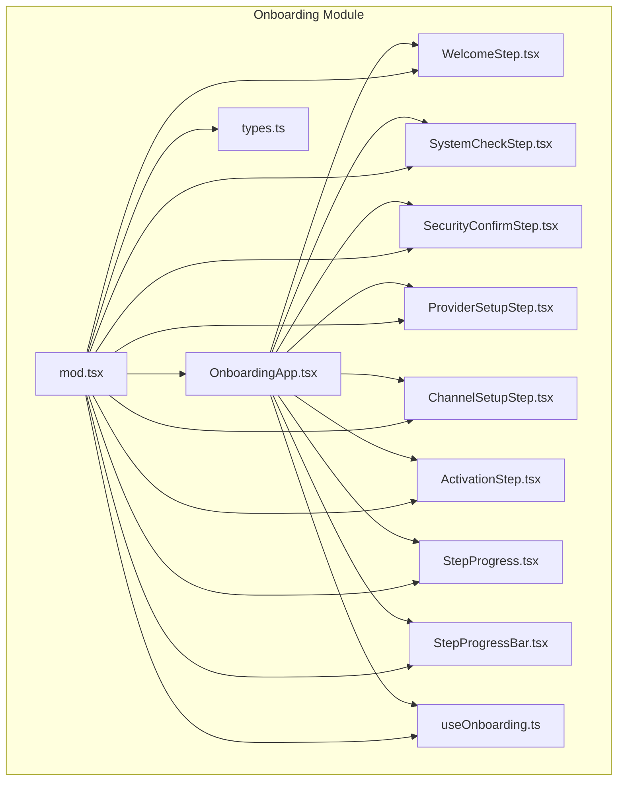
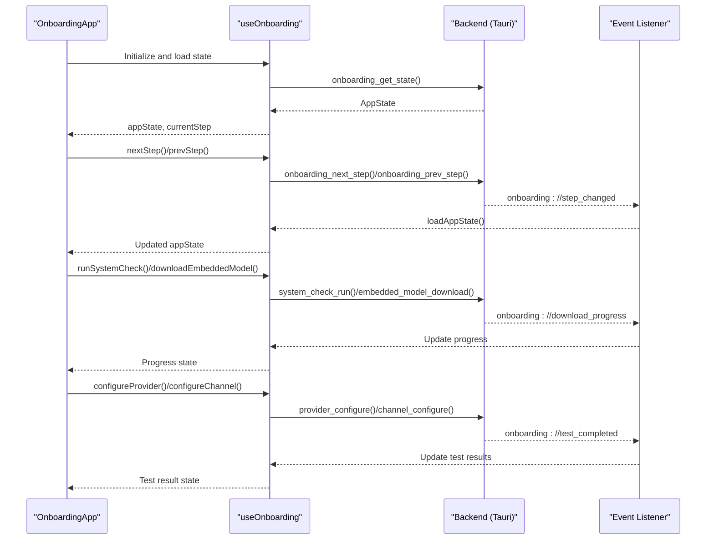
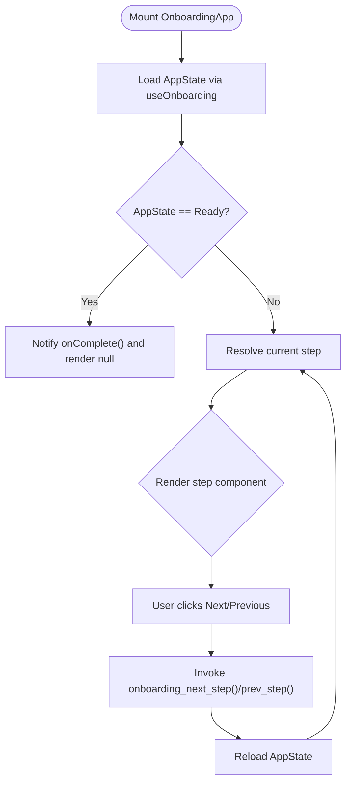
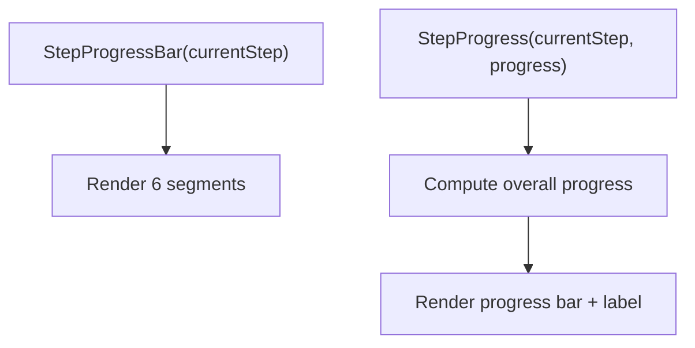
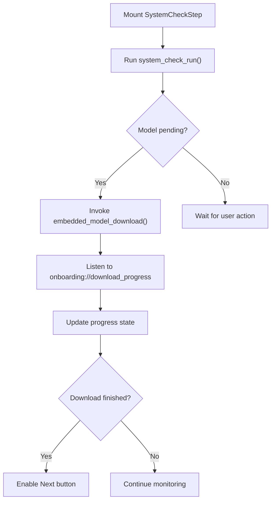
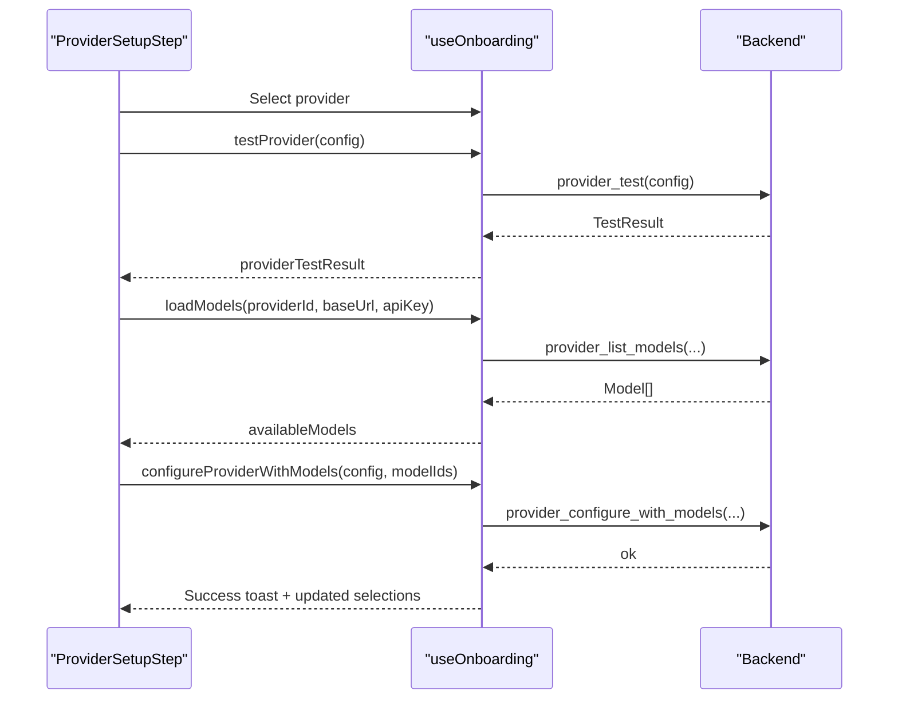
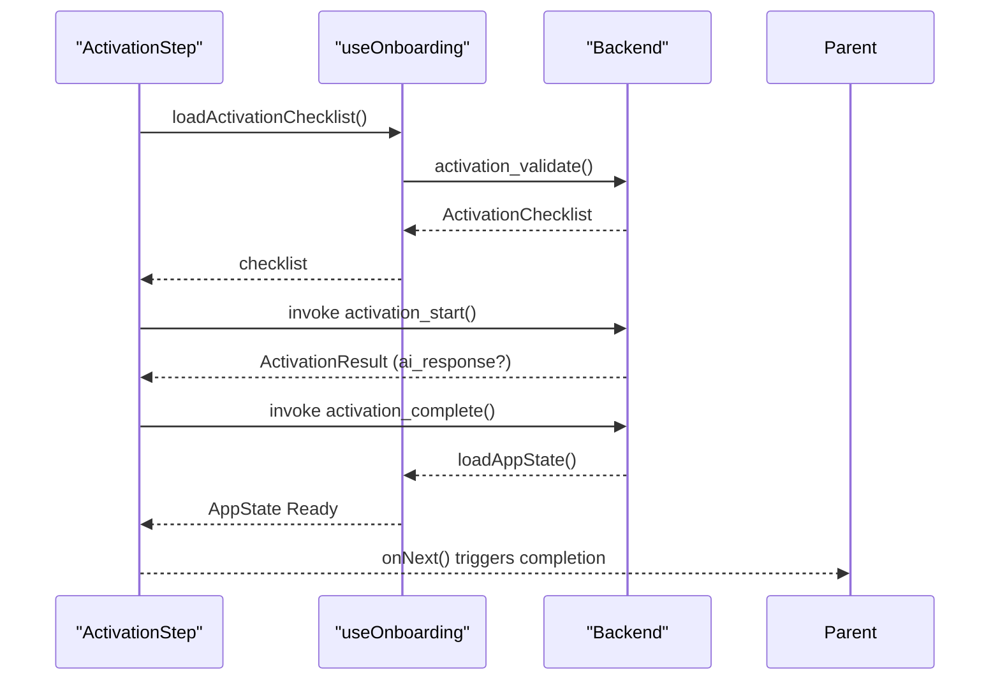
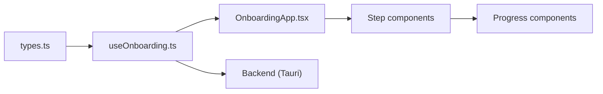

# Onboarding & User Flow

<cite>
**Referenced Files in This Document**
- [OnboardingApp.tsx](file://src/modules/onboarding/OnboardingApp.tsx)
- [mod.tsx](file://src/modules/onboarding/mod.tsx)
- [types.ts](file://src/modules/onboarding/types.ts)
- [useOnboarding.ts](file://src/modules/onboarding/hooks/useOnboarding.ts)
- [WelcomeStep.tsx](file://src/modules/onboarding/steps/WelcomeStep.tsx)
- [SystemCheckStep.tsx](file://src/modules/onboarding/steps/SystemCheckStep.tsx)
- [SecurityConfirmStep.tsx](file://src/modules/onboarding/steps/SecurityConfirmStep.tsx)
- [ProviderSetupStep.tsx](file://src/modules/onboarding/steps/ProviderSetupStep.tsx)
- [ChannelSetupStep.tsx](file://src/modules/onboarding/steps/ChannelSetupStep.tsx)
- [ActivationStep.tsx](file://src/modules/onboarding/steps/ActivationStep.tsx)
- [StepProgress.tsx](file://src/modules/onboarding/components/StepProgress.tsx)
- [StepProgressBar.tsx](file://src/modules/onboarding/components/StepProgressBar.tsx)
</cite>

## Table of Contents
1. [Introduction](#introduction)
2. [Project Structure](#project-structure)
3. [Core Components](#core-components)
4. [Architecture Overview](#architecture-overview)
5. [Detailed Component Analysis](#detailed-component-analysis)
6. [Dependency Analysis](#dependency-analysis)
7. [Performance Considerations](#performance-considerations)
8. [Troubleshooting Guide](#troubleshooting-guide)
9. [Conclusion](#conclusion)
10. [Appendices](#appendices)

## Introduction
This document explains the onboarding system and user flow management for the application. It covers the OnboardingApp architecture, the six-step onboarding workflow, progress tracking, validation mechanisms, error handling, and integration points with the backend. It also provides guidance for customizing onboarding steps, adding new validations, integrating external systems, and ensuring user experience and accessibility compliance.

## Project Structure
The onboarding module is organized around a root component that orchestrates step-specific pages, a centralized hook for state and backend integration, shared UI components for progress and navigation, and typed contracts for backend events and state.

**Diagram sources**
- [OnboardingApp.tsx:156-211](file://src/modules/onboarding/OnboardingApp.tsx#L156-L211)
- [mod.tsx:9-73](file://src/modules/onboarding/mod.tsx#L9-L73)
- [types.ts:10-261](file://src/modules/onboarding/types.ts#L10-L261)
- [useOnboarding.ts:67-420](file://src/modules/onboarding/hooks/useOnboarding.ts#L67-L420)
- [WelcomeStep.tsx:50-222](file://src/modules/onboarding/steps/WelcomeStep.tsx#L50-L222)
- [SystemCheckStep.tsx:177-616](file://src/modules/onboarding/steps/SystemCheckStep.tsx#L177-L616)
- [SecurityConfirmStep.tsx:36-192](file://src/modules/onboarding/steps/SecurityConfirmStep.tsx#L36-L192)
- [ProviderSetupStep.tsx:718-1200](file://src/modules/onboarding/steps/ProviderSetupStep.tsx#L718-L1200)
- [ChannelSetupStep.tsx:48-339](file://src/modules/onboarding/steps/ChannelSetupStep.tsx#L48-L339)
- [ActivationStep.tsx:34-324](file://src/modules/onboarding/steps/ActivationStep.tsx#L34-L324)
- [StepProgress.tsx:21-52](file://src/modules/onboarding/components/StepProgress.tsx#L21-L52)
- [StepProgressBar.tsx:18-57](file://src/modules/onboarding/components/StepProgressBar.tsx#L18-L57)

**Section sources**
- [mod.tsx:1-73](file://src/modules/onboarding/mod.tsx#L1-L73)

## Core Components
- OnboardingApp: Orchestrates the onboarding flow, renders the current step, and notifies completion when the backend transitions to Ready.
- useOnboarding: Centralized hook managing app state, system checks, provider/channel configuration, activation, and Tauri IPC calls/events.
- Step components: Each step implements a specific onboarding stage with its own UI and validation logic.
- Progress components: Shared components for step progress and overall progress bar.

Key responsibilities:
- State synchronization via Tauri invoke/listen.
- Real-time progress updates for downloads and tests.
- Validation gating for step progression and activation.
- Error handling and user feedback.

**Section sources**
- [OnboardingApp.tsx:156-211](file://src/modules/onboarding/OnboardingApp.tsx#L156-L211)
- [useOnboarding.ts:67-420](file://src/modules/onboarding/hooks/useOnboarding.ts#L67-L420)
- [types.ts:10-261](file://src/modules/onboarding/types.ts#L10-L261)

## Architecture Overview
The onboarding system follows a frontend-driven state machine controlled by the backend. The frontend subscribes to backend events and invokes backend commands to advance steps, run checks, and persist configurations.

**Diagram sources**
- [OnboardingApp.tsx:174-183](file://src/modules/onboarding/OnboardingApp.tsx#L174-L183)
- [useOnboarding.ts:92-136](file://src/modules/onboarding/hooks/useOnboarding.ts#L92-L136)
- [useOnboarding.ts:329-356](file://src/modules/onboarding/hooks/useOnboarding.ts#L329-L356)
- [useOnboarding.ts:143-169](file://src/modules/onboarding/hooks/useOnboarding.ts#L143-L169)
- [useOnboarding.ts:176-185](file://src/modules/onboarding/hooks/useOnboarding.ts#L176-L185)
- [useOnboarding.ts:280-290](file://src/modules/onboarding/hooks/useOnboarding.ts#L280-L290)

## Detailed Component Analysis

### OnboardingApp: Flow Orchestration
- Renders step-specific components based on current step.
- Monitors backend AppState; when Ready, triggers completion callback to replace onboarding UI.
- Provides placeholders for future steps.

**Diagram sources**
- [OnboardingApp.tsx:174-210](file://src/modules/onboarding/OnboardingApp.tsx#L174-L210)
- [useOnboarding.ts:133-141](file://src/modules/onboarding/hooks/useOnboarding.ts#L133-L141)

**Section sources**
- [OnboardingApp.tsx:156-211](file://src/modules/onboarding/OnboardingApp.tsx#L156-L211)

### Step Progress Indicators
- StepProgressBar: Top-of-step progress bar showing current step segment highlighted.
- StepProgress: Sub-progress within a step (e.g., download percentage).

**Diagram sources**
- [StepProgressBar.tsx:18-57](file://src/modules/onboarding/components/StepProgressBar.tsx#L18-L57)
- [StepProgress.tsx:21-52](file://src/modules/onboarding/components/StepProgress.tsx#L21-L52)

**Section sources**
- [StepProgressBar.tsx:18-57](file://src/modules/onboarding/components/StepProgressBar.tsx#L18-L57)
- [StepProgress.tsx:21-52](file://src/modules/onboarding/components/StepProgress.tsx#L21-L52)

### Step 1: Welcome
- Introduces the 6-step process, highlights benefits, and prepares users mentally.
- Navigation is forward-only at this stage.

**Section sources**
- [WelcomeStep.tsx:50-222](file://src/modules/onboarding/steps/WelcomeStep.tsx#L50-L222)

### Step 2: System Check
- Automatically runs CPU/GPU/memory checks and downloads the embedded model.
- Provides live download progress, speed, and ETA.
- Blocks continuation until model download completes.

**Diagram sources**
- [SystemCheckStep.tsx:190-221](file://src/modules/onboarding/steps/SystemCheckStep.tsx#L190-L221)
- [useOnboarding.ts:338-356](file://src/modules/onboarding/hooks/useOnboarding.ts#L338-L356)
- [useOnboarding.ts:155-169](file://src/modules/onboarding/hooks/useOnboarding.ts#L155-L169)

**Section sources**
- [SystemCheckStep.tsx:177-616](file://src/modules/onboarding/steps/SystemCheckStep.tsx#L177-L616)
- [useOnboarding.ts:143-169](file://src/modules/onboarding/hooks/useOnboarding.ts#L143-L169)

### Step 3: Security Confirmation
- Presents seven risk disclosures and requires explicit confirmation before proceeding.
- Acts as a gating step for activation.

**Section sources**
- [SecurityConfirmStep.tsx:36-192](file://src/modules/onboarding/steps/SecurityConfirmStep.tsx#L36-L192)

### Step 4: Provider Configuration
- Lists domestic and international providers; supports sub-choices (e.g., regional endpoints).
- Tests provider connectivity and loads available models.
- Supports multi-select model saving and pre-selection of previously configured models.
- Includes auto-connect for local providers (e.g., Ollama).

**Diagram sources**
- [ProviderSetupStep.tsx:718-1200](file://src/modules/onboarding/steps/ProviderSetupStep.tsx#L718-L1200)
- [useOnboarding.ts:227-235](file://src/modules/onboarding/hooks/useOnboarding.ts#L227-L235)
- [useOnboarding.ts:261-278](file://src/modules/onboarding/hooks/useOnboarding.ts#L261-L278)
- [useOnboarding.ts:180-185](file://src/modules/onboarding/hooks/useOnboarding.ts#L180-L185)

**Section sources**
- [ProviderSetupStep.tsx:718-1200](file://src/modules/onboarding/steps/ProviderSetupStep.tsx#L718-L1200)
- [useOnboarding.ts:176-235](file://src/modules/onboarding/hooks/useOnboarding.ts#L176-L235)
- [useOnboarding.ts:261-278](file://src/modules/onboarding/hooks/useOnboarding.ts#L261-L278)

### Step 5: Channel Setup
- Displays a grid of supported channels; users configure tokens/secrets/webhooks.
- Tests connections and marks channels as connected.
- Requires at least one channel to proceed (unless skipped).

**Section sources**
- [ChannelSetupStep.tsx:48-339](file://src/modules/onboarding/steps/ChannelSetupStep.tsx#L48-L339)
- [useOnboarding.ts:280-290](file://src/modules/onboarding/hooks/useOnboarding.ts#L280-L290)

### Step 6: Activation
- Shows a configuration summary checklist and security badges.
- Gating: system_check + security_confirmed + provider_configured (channels optional).
- Initiates activation with a greeting to the configured model, then marks complete and transitions to Ready.

**Diagram sources**
- [ActivationStep.tsx:34-108](file://src/modules/onboarding/steps/ActivationStep.tsx#L34-L108)
- [useOnboarding.ts:292-299](file://src/modules/onboarding/hooks/useOnboarding.ts#L292-L299)
- [useOnboarding.ts:301-308](file://src/modules/onboarding/hooks/useOnboarding.ts#L301-L308)

**Section sources**
- [ActivationStep.tsx:34-324](file://src/modules/onboarding/steps/ActivationStep.tsx#L34-L324)
- [useOnboarding.ts:292-308](file://src/modules/onboarding/hooks/useOnboarding.ts#L292-L308)

## Dependency Analysis
- Frontend-to-backend contracts are defined in types.ts and mirrored in the Rust backend.
- useOnboarding encapsulates all IPC calls and event subscriptions, minimizing coupling in step components.
- Steps depend on shared components for progress and navigation.

**Diagram sources**
- [types.ts:10-261](file://src/modules/onboarding/types.ts#L10-L261)
- [useOnboarding.ts:67-420](file://src/modules/onboarding/hooks/useOnboarding.ts#L67-L420)
- [OnboardingApp.tsx:156-211](file://src/modules/onboarding/OnboardingApp.tsx#L156-L211)

**Section sources**
- [types.ts:10-261](file://src/modules/onboarding/types.ts#L10-L261)
- [useOnboarding.ts:67-420](file://src/modules/onboarding/hooks/useOnboarding.ts#L67-L420)

## Performance Considerations
- Debounce and throttle UI updates during long-running tasks (e.g., download metrics).
- Use event-driven updates for progress to avoid polling.
- Preselect previously configured models to reduce rework.
- Keep UI responsive by deferring heavy operations off the main thread.

## Troubleshooting Guide
Common issues and remedies:
- System check failures: Verify hardware specs and network connectivity; re-run checks.
- Model download errors: Retry download; check disk space and firewall settings.
- Provider test failures: Validate API keys and base URLs; ensure network access.
- Channel configuration errors: Confirm tokens/secrets; test again; check platform-specific requirements.
- Activation failures: Ensure system_check and security_confirmed are satisfied; retry greeting.

Where to look:
- Error messages returned by testProvider/testChannel/activation_start.
- Event payloads for onboarding://error.
- Console logs for IPC failures.

**Section sources**
- [useOnboarding.ts:232-234](file://src/modules/onboarding/hooks/useOnboarding.ts#L232-L234)
- [useOnboarding.ts:946-953](file://src/modules/onboarding/hooks/useOnboarding.ts#L946-L953)
- [useOnboarding.ts:99-100](file://src/modules/onboarding/hooks/useOnboarding.ts#L99-L100)
- [types.ts:254-260](file://src/modules/onboarding/types.ts#L254-L260)

## Conclusion
The onboarding system is a robust, event-driven flow that guides users through six essential steps, validates configurations, and safely activates the agent. Its modular design, strong typing, and centralized state management enable extensibility and maintainability. By following the guidance herein, teams can customize steps, integrate new providers/channels, and uphold high standards for UX and accessibility.

## Appendices

### A. Extending the Onboarding Flow
- Add a new step:
  - Create a new step component under steps/.
  - Register it in OnboardingApp switch statement.
  - Define step metadata (titles, labels, bullets) in OnboardingApp.
- Add a new validation:
  - Extend the AppState and backend state machine.
  - Emit onboarding://test_completed events with appropriate payloads.
  - Update useOnboarding to listen and surface results.
- Integrate external systems:
  - Add Tauri commands in the backend.
  - Define types in types.ts and mirror in the frontend hook.
  - Surface results in the step UI and gating logic.

### B. Accessibility and UX Best Practices
- Keyboard navigation and focus management.
- Sufficient color contrast and readable typography.
- ARIA labels for interactive elements and progress indicators.
- Clear error messages with actionable next steps.
- Animated feedback for long-running operations (e.g., download progress).
- Skip options where appropriate (e.g., channels in ActivationStep).