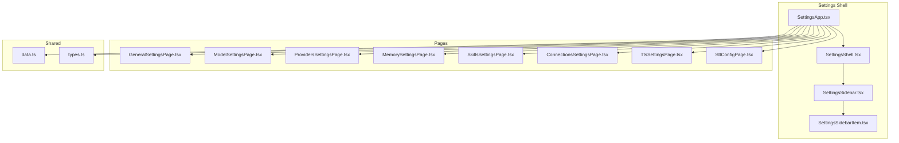
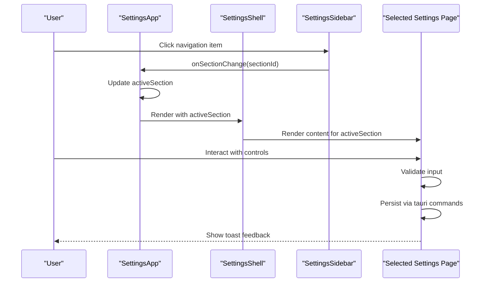
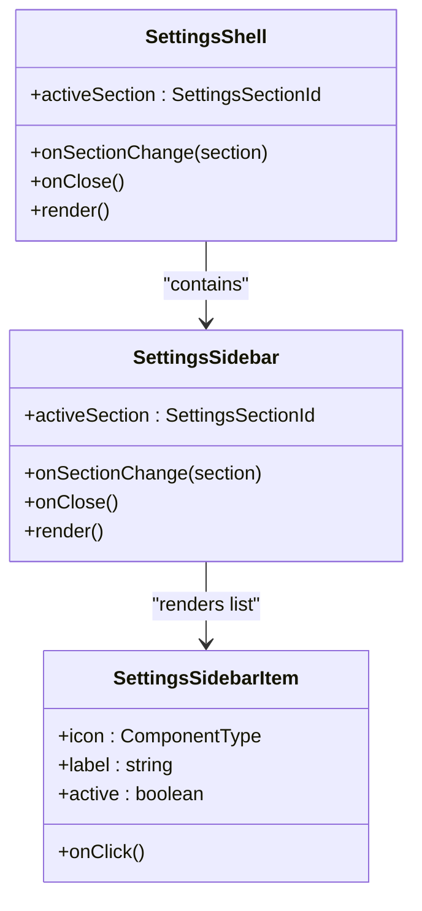
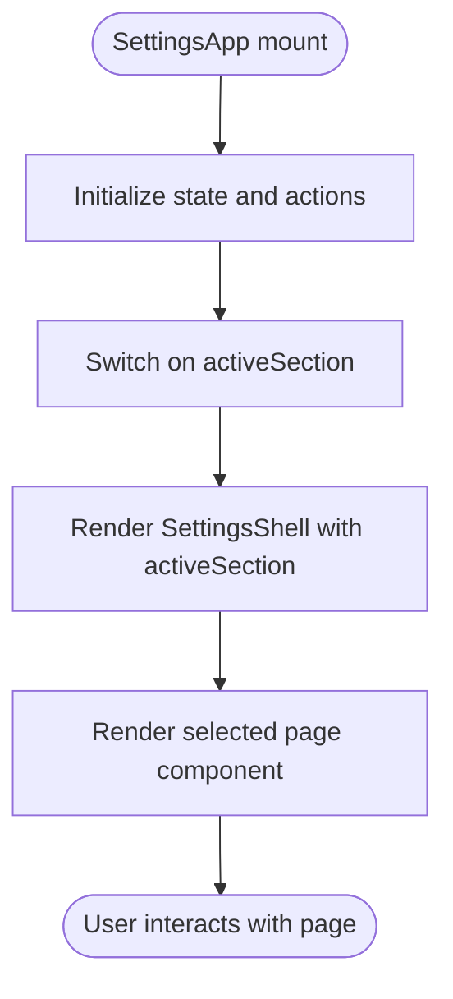
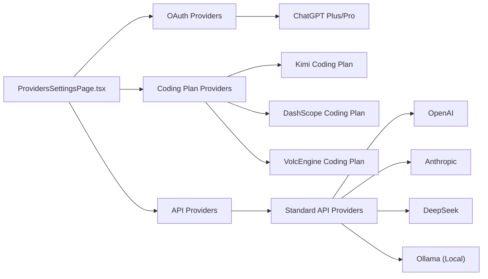
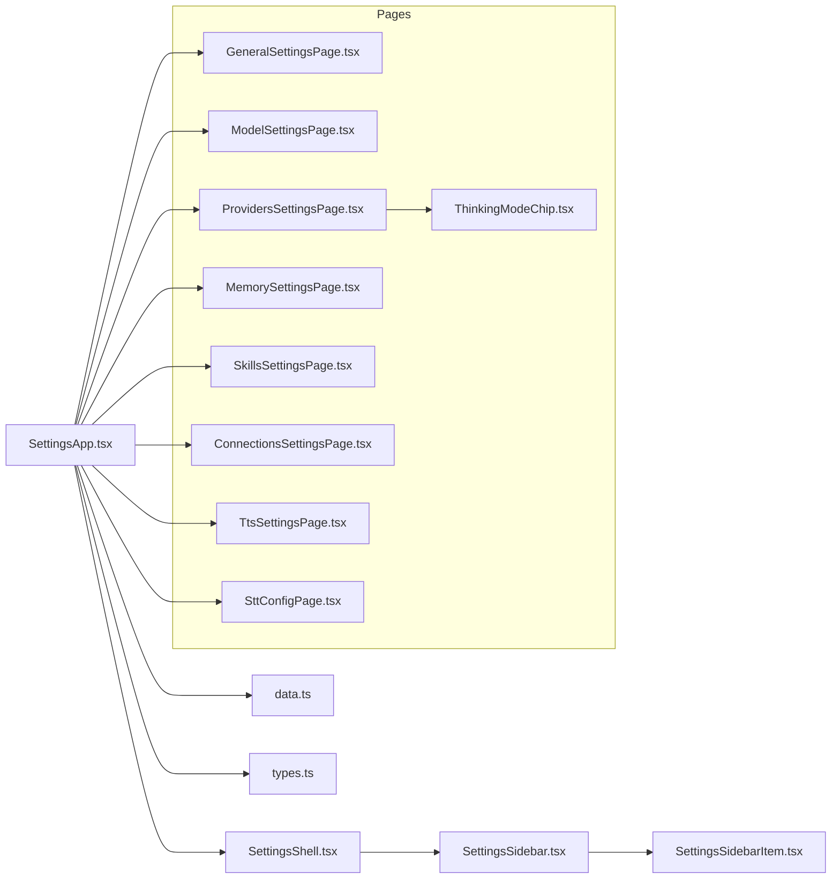
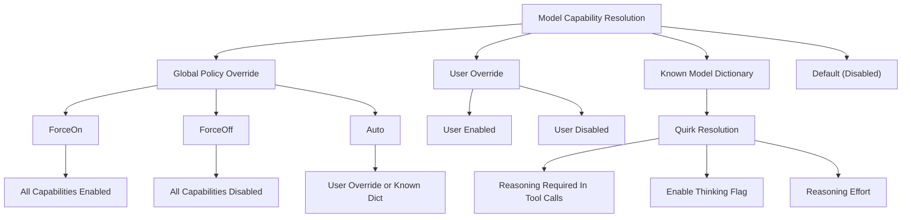

# Settings & Configuration Management

<cite>
**Referenced Files in This Document**
- [SettingsApp.tsx](file://src/modules/settings/SettingsApp.tsx)
- [SettingsShell.tsx](file://src/modules/settings/components/SettingsShell.tsx)
- [SettingsSidebar.tsx](file://src/modules/settings/components/SettingsSidebar.tsx)
- [SettingsSidebarItem.tsx](file://src/modules/settings/components/SettingsSidebarItem.tsx)
- [data.ts](file://src/modules/settings/data.ts)
- [types.ts](file://src/modules/settings/types.ts)
- [GeneralSettingsPage.tsx](file://src/modules/settings/pages/GeneralSettingsPage.tsx)
- [ModelSettingsPage.tsx](file://src/modules/settings/pages/ModelSettingsPage.tsx)
- [ProvidersSettingsPage.tsx](file://src/modules/settings/pages/ProvidersSettingsPage.tsx)
- [MemorySettingsPage.tsx](file://src/modules/settings/pages/MemorySettingsPage.tsx)
- [SkillsSettingsPage.tsx](file://src/modules/settings/pages/SkillsSettingsPage.tsx)
- [ConnectionsSettingsPage.tsx](file://src/modules/settings/pages/ConnectionsSettingsPage.tsx)
- [TtsSettingsPage.tsx](file://src/modules/settings/pages/TtsSettingsPage.tsx)
- [SttConfigPage.tsx](file://src/modules/settings/pages/SttConfigPage.tsx)
- [ThinkingModeChip.tsx](file://src/components/chat/ThinkingModeChip.tsx)
- [capabilities.rs](file://src-tauri/src/modules/provider/capabilities.rs)
</cite>

## Update Summary
**Changes Made**
- Added comprehensive documentation for the new ProvidersSettingsPage with OAuth, Coding Plan, and API sections
- Enhanced ModelSettingsPage documentation with reasoning capability flags and ThinkingModeChip integration
- Updated architecture diagrams to reflect the new provider management system
- Added documentation for the reasoning capability resolution system

## Table of Contents
1. [Introduction](#introduction)
2. [Project Structure](#project-structure)
3. [Core Components](#core-components)
4. [Architecture Overview](#architecture-overview)
5. [Detailed Component Analysis](#detailed-component-analysis)
6. [Dependency Analysis](#dependency-analysis)
7. [Performance Considerations](#performance-considerations)
8. [Troubleshooting Guide](#troubleshooting-guide)
9. [Conclusion](#conclusion)
10. [Appendices](#appendices)

## Introduction
This document describes the Settings & Configuration Management system in the application. It covers the SettingsShell architecture, sidebar navigation, and page routing. It documents the settings pages for General, Model, Providers, Memory, Skills, Connections, TTS, and STT configurations, along with the settings data flow, preference persistence, validation mechanisms, synchronization, and extension points for adding new settings pages and custom configuration options.

**Updated** Added comprehensive documentation for the new ProvidersSettingsPage that manages LLM providers with OAuth, Coding Plan, and API sections, plus enhanced model settings with reasoning capability flags.

## Project Structure
The settings system is organized around a central SettingsApp shell that hosts a sidebar-driven navigation and a content area rendering the active settings page. Pages are grouped under a dedicated pages directory and share common UI components and types.

**Diagram sources**
- [SettingsApp.tsx:29-39](file://src/modules/settings/SettingsApp.tsx#L29-L39)
- [SettingsShell.tsx:27-69](file://src/modules/settings/components/SettingsShell.tsx#L27-L69)
- [SettingsSidebar.tsx:31-92](file://src/modules/settings/components/SettingsSidebar.tsx#L31-L92)
- [SettingsSidebarItem.tsx:11-39](file://src/modules/settings/components/SettingsSidebarItem.tsx#L11-L39)
- [data.ts:19-142](file://src/modules/settings/data.ts#L19-L142)
- [types.ts:3-63](file://src/modules/settings/types.ts#L3-L63)

**Section sources**
- [SettingsApp.tsx:29-39](file://src/modules/settings/SettingsApp.tsx#L29-L39)
- [SettingsShell.tsx:27-69](file://src/modules/settings/components/SettingsShell.tsx#L27-L69)
- [SettingsSidebar.tsx:31-92](file://src/modules/settings/components/SettingsSidebar.tsx#L31-L92)
- [SettingsSidebarItem.tsx:11-39](file://src/modules/settings/components/SettingsSidebarItem.tsx#L11-L39)
- [data.ts:19-142](file://src/modules/settings/data.ts#L19-L142)
- [types.ts:3-63](file://src/modules/settings/types.ts#L3-L63)

## Core Components
- SettingsApp: Central orchestrator managing active section, shared state/actions, and page rendering. It wires up the SettingsShell and renders the appropriate page based on the active section.
- SettingsShell: Provides the layout, header with dynamic icon/label, and integrates the sidebar and content area.
- SettingsSidebar: Renders the navigation list from SETTINGS_SECTIONS and handles window drag and close actions.
- SettingsSidebarItem: Individual clickable navigation item with active state styling.
- Shared Types and Data: Defines SettingsSectionId, SettingsState, SettingsActions, and the SETTINGS_SECTIONS metadata used by the sidebar.

Key responsibilities:
- Routing: SettingsApp switch-case determines the active page.
- State: Shared state (theme, fontMode, language, etc.) is passed down to pages via props.
- Persistence: Pages trigger backend invocations (e.g., TTS/STT settings, memory config) via tauri commands.
- Validation: Pages validate inputs and show user feedback via toast messages.

**Section sources**
- [SettingsApp.tsx:190-266](file://src/modules/settings/SettingsApp.tsx#L190-L266)
- [SettingsShell.tsx:27-69](file://src/modules/settings/components/SettingsShell.tsx#L27-L69)
- [SettingsSidebar.tsx:31-92](file://src/modules/settings/components/SettingsSidebar.tsx#L31-L92)
- [SettingsSidebarItem.tsx:11-39](file://src/modules/settings/components/SettingsSidebarItem.tsx#L11-L39)
- [data.ts:19-142](file://src/modules/settings/data.ts#L19-L142)
- [types.ts:3-63](file://src/modules/settings/types.ts#L3-L63)

## Architecture Overview
The settings architecture follows a shell-and-pages pattern:
- SettingsApp holds state and routes to the active page.
- SettingsShell composes the layout and header.
- SettingsSidebar reads metadata from SETTINGS_SECTIONS to render navigation.
- Pages implement domain-specific configuration UIs and persist changes via tauri commands.

**Diagram sources**
- [SettingsApp.tsx:228-229](file://src/modules/settings/SettingsApp.tsx#L228-L229)
- [SettingsShell.tsx:33-60](file://src/modules/settings/components/SettingsShell.tsx#L33-L60)
- [SettingsSidebar.tsx:80-88](file://src/modules/settings/components/SettingsSidebar.tsx#L80-L88)
- [data.ts:19-142](file://src/modules/settings/data.ts#L19-L142)

## Detailed Component Analysis

### SettingsShell and Sidebar Navigation
- SettingsShell dynamically sets the page header icon and description based on the active section and renders the sidebar and content area.
- SettingsSidebar renders the full navigation list from SETTINGS_SECTIONS and supports window dragging and closing.
- SettingsSidebarItem renders individual items with active highlighting and click handlers.

**Diagram sources**
- [SettingsShell.tsx:27-69](file://src/modules/settings/components/SettingsShell.tsx#L27-L69)
- [SettingsSidebar.tsx:31-92](file://src/modules/settings/components/SettingsSidebar.tsx#L31-L92)
- [SettingsSidebarItem.tsx:11-39](file://src/modules/settings/components/SettingsSidebarItem.tsx#L11-L39)

**Section sources**
- [SettingsShell.tsx:27-69](file://src/modules/settings/components/SettingsShell.tsx#L27-L69)
- [SettingsSidebar.tsx:31-92](file://src/modules/settings/components/SettingsSidebar.tsx#L31-L92)
- [SettingsSidebarItem.tsx:11-39](file://src/modules/settings/components/SettingsSidebarItem.tsx#L11-L39)

### Settings Routing and Page Rendering
- SettingsApp maintains activeSection and constructs the content via a switch statement over SETTINGS_SECTION ids.
- It passes a shared SettingsState and SettingsActions to each page.

**Diagram sources**
- [SettingsApp.tsx:190-266](file://src/modules/settings/SettingsApp.tsx#L190-L266)

**Section sources**
- [SettingsApp.tsx:190-266](file://src/modules/settings/SettingsApp.tsx#L190-L266)

### General Settings Page
- Manages user profile, account info, preferences (language, startup mode, theme, density, font), and behavior toggles (auto-scroll, notifications).
- Uses shared state/actions to update values and persists locally (e.g., fontMode in localStorage).

Validation and persistence highlights:
- Preference updates are immediate and reflected in the UI.
- Font mode is persisted to localStorage and applies a body class for serif mode.

**Section sources**
- [GeneralSettingsPage.tsx:26-226](file://src/modules/settings/pages/GeneralSettingsPage.tsx#L26-L226)
- [SettingsApp.tsx:159-188](file://src/modules/settings/SettingsApp.tsx#L159-L188)

### Providers Settings Page
**New** Comprehensive provider configuration with OAuth, Coding Plan, and API sections.

- **OAuth Section**: Manages ChatGPT Plus/Pro (Codex) connections with OAuth authentication.
- **Coding Plan Section**: Handles subscription-based models (Kimi Coding Plan, 百炼 Coding Plan, 火山引擎 Coding Plan) with API key authentication.
- **API Section**: Manages standard API providers (OpenAI, Anthropic, DeepSeek, Moonshot, Ollama, OpenRouter, Google Gemini, etc.) with configurable API types and model selection.

Key features:
- Three-column layout: left sidebar with grouped provider list, middle section with credential management, and right section with model selection.
- Real-time model loading from configured providers.
- Provider configuration validation and testing.
- Integrated ThinkingModeChip for reasoning capability visualization.
- Cross-window synchronization for model availability updates.

**Diagram sources**
- [ProvidersSettingsPage.tsx:45-109](file://src/modules/settings/pages/ProvidersSettingsPage.tsx#L45-L109)
- [ProvidersSettingsPage.tsx:111-115](file://src/modules/settings/pages/ProvidersSettingsPage.tsx#L111-L115)

**Section sources**
- [ProvidersSettingsPage.tsx:1-516](file://src/modules/settings/pages/ProvidersSettingsPage.tsx#L1-L516)

### Model Settings Page
Enhanced with reasoning capability flags and ThinkingModeChip integration.

- Configures LLM role assignments (chat, utility, utility_large, summarizer, compiler) with a dropdown picker grouped by provider.
- Manages the local fastembed vectorization model name and HuggingFace mirror source.
- **Enhanced**: Now displays reasoning capability flags (reasoning, reasoning_required_in_tool_calls, supports_reasoning_effort) via ThinkingModeChip.
- **Enhanced**: Supports reasoning capability policy overrides (Auto, ForceOn, ForceOff) for troubleshooting.

Key behaviors:
- Loads available models with reasoning capability metadata on mount.
- Displays ThinkingModeChip next to each model showing reasoning support level.
- Supports saving role configs individually and bulk operations.
- Validates total token budget distribution and shows warnings.

**Section sources**
- [ModelSettingsPage.tsx:38-84](file://src/modules/settings/pages/ModelSettingsPage.tsx#L38-L84)
- [ModelSettingsPage.tsx:203-210](file://src/modules/settings/pages/ModelSettingsPage.tsx#L203-L210)
- [ModelSettingsPage.tsx:236-400](file://src/modules/settings/pages/ModelSettingsPage.tsx#L236-L400)

### Memory Settings Page
- Controls token budget allocation across memory slots (system, episodic, semantic, working).
- Enables Memory Control Plane V1 feature flags (recall_mode, policy_enforce_mode).
- Manages promotion thresholds for memory upgrades across session/project/global scopes.
- Provides trajectory export and a two-step destructive "Clear all memories" operation.
- Integrates with compiled memory viewer and narrative timeline viewers.

Validation and safety:
- Enforces 100% total percentage across slots.
- Two-step confirmation for destructive actions with auto-disarming.

**Section sources**
- [MemorySettingsPage.tsx:45-629](file://src/modules/settings/pages/MemorySettingsPage.tsx#L45-L629)

### Skills Settings Page
- Provides three tabs: Installed, Market, and Proposals.
- Supports filtering by category, source, and search; toggling skills; and performing lifecycle actions (review, approve, rollback).
- Integrates with skills hub (GitHub and skills.sh) for discovery and installation.
- Implements caching and pagination for market listings.

Operational flow:
- Loads skills list and refreshes on tab change.
- Handles installation from market and manual distribution.
- Uses toasts for user feedback and error handling.

**Section sources**
- [SkillsSettingsPage.tsx:110-800](file://src/modules/settings/pages/SkillsSettingsPage.tsx#L110-L800)

### Connections Settings Page
- Presents a catalog of communication channels (e.g., Feishu, WeChat, QQ, DingTalk, Telegram, Discord, Slack, Teams, LINE, Signal, iMessage, WhatsApp, Mattermost, Matrix).
- Shows connection status and provides "Connect" or "Manage" actions per channel.
- Organizes channels by priority (high/low).

**Section sources**
- [ConnectionsSettingsPage.tsx:189-229](file://src/modules/settings/pages/ConnectionsSettingsPage.tsx#L189-L229)

### TTS Settings Page
- Manages text-to-speech runtime parameters persisted to a TOML file.
- Sections: Speed (playback_rate), Quality (three presets mapping to server-side sampling parameters), and Advanced (power-user parameters).
- Persists on every change and broadcasts updates to other windows for immediate effect.

Validation and UX:
- Range sliders and numeric inputs clamp values to safe bounds.
- Reset to defaults confirmation dialog.
- Real-time feedback via toasts.

**Section sources**
- [TtsSettingsPage.tsx:73-384](file://src/modules/settings/pages/TtsSettingsPage.tsx#L73-L384)

### STT Config Page
- Manages the SenseVoice (OpenFlow) speech-to-text model: status checks, download progress events, and one-click download.
- Broadcasts readiness to other windows upon successful download.

UX:
- Progress bar and percentage display during download.
- Clear status indicators and instructions for first-time microphone usage.

**Section sources**
- [SttConfigPage.tsx:29-202](file://src/modules/settings/pages/SttConfigPage.tsx#L29-L202)

## Dependency Analysis
- SettingsApp depends on:
  - SETTINGS_SECTIONS metadata for navigation.
  - Shared SettingsState/Actions for page props.
  - Tauri commands for persistence in specialized pages (e.g., TTS, STT, memory).
- Pages depend on:
  - Shared UI components (SettingsSurface, SettingsRow, CompactInput, etc.).
  - Tauri APIs for backend operations.
  - Cross-window sync utilities for broadcasting changes.
  - **New**: ProvidersSettingsPage depends on onboarding hooks for provider management.

**Diagram sources**
- [SettingsApp.tsx:29-39](file://src/modules/settings/SettingsApp.tsx#L29-L39)
- [data.ts:19-142](file://src/modules/settings/data.ts#L19-L142)
- [types.ts:3-63](file://src/modules/settings/types.ts#L3-L63)
- [SettingsShell.tsx:1-6](file://src/modules/settings/components/SettingsShell.tsx#L1-L6)
- [SettingsSidebar.tsx:1-5](file://src/modules/settings/components/SettingsSidebar.tsx#L1-L5)
- [SettingsSidebarItem.tsx:1-9](file://src/modules/settings/components/SettingsSidebarItem.tsx#L1-L9)
- [ProvidersSettingsPage.tsx:20-29](file://src/modules/settings/pages/ProvidersSettingsPage.tsx#L20-L29)

**Section sources**
- [SettingsApp.tsx:29-39](file://src/modules/settings/SettingsApp.tsx#L29-L39)
- [data.ts:19-142](file://src/modules/settings/data.ts#L19-L142)
- [types.ts:3-63](file://src/modules/settings/types.ts#L3-L63)

## Performance Considerations
- Minimize re-renders by memoizing derived values (e.g., filtered lists in SkillsSettingsPage).
- Debounce or batch frequent updates (e.g., numeric inputs in TTS/STT pages) to reduce unnecessary tauri calls.
- Use lazy loading for heavy pages (e.g., Skills Market) and cache results where appropriate.
- Keep UI updates synchronous for immediate feedback while deferring expensive operations.
- **New**: ProvidersSettingsPage uses efficient state management with Set and Map data structures for provider configuration tracking.

## Troubleshooting Guide
Common issues and remedies:
- Settings not persisting:
  - Verify tauri command invocations succeed and toast errors are visible.
  - For TTS/STT, ensure cross-window sync is functioning and broadcasts are received.
- Validation failures:
  - Memory settings require 100% total slot allocation; adjust sliders until valid.
  - Model settings require a non-empty model name; ensure input is trimmed and validated.
- Destructive operations:
  - Two-step confirmation for clearing all memories; ensure the second click occurs within the disarm window.
- Network-dependent pages:
  - Skills Market relies on external APIs; use cached data or retry after network stabilization.
- **New**: Providers configuration issues:
  - Ensure API Key and Base URL are correctly formatted for the selected provider type.
  - Use "测试连接" (Test Connection) to validate provider credentials before saving.
  - For OAuth providers, check that the OAuth flow is properly configured.

**Section sources**
- [MemorySettingsPage.tsx:116-143](file://src/modules/settings/pages/MemorySettingsPage.tsx#L116-L143)
- [ModelSettingsPage.tsx:325-344](file://src/modules/settings/pages/ModelSettingsPage.tsx#L325-L344)
- [SkillsSettingsPage.tsx:149-171](file://src/modules/settings/pages/SkillsSettingsPage.tsx#L149-L171)
- [ProvidersSettingsPage.tsx:282-304](file://src/modules/settings/pages/ProvidersSettingsPage.tsx#L282-L304)

## Conclusion
The settings system is a cohesive shell-and-pages architecture with strong separation of concerns. It provides a scalable foundation for adding new configuration pages, integrating with backend persistence, and ensuring a responsive user experience through validation and immediate feedback. The addition of comprehensive provider management and reasoning capability support enhances the system's flexibility for diverse AI model configurations.

## Appendices

### Adding a New Settings Page
Steps:
1. Define a new SettingsSectionMeta in SETTINGS_SECTIONS with an id, label, description, and icon.
2. Create a new page component under pages/.
3. Extend SettingsState/Actions in types.ts if needed.
4. Wire the new page in SettingsApp's switch statement and pass state/actions.
5. Optionally integrate tauri commands for persistence and cross-window sync.

Example references:
- [data.ts:19-142](file://src/modules/settings/data.ts#L19-L142)
- [types.ts:3-63](file://src/modules/settings/types.ts#L3-L63)
- [SettingsApp.tsx:228-229](file://src/modules/settings/SettingsApp.tsx#L228-L229)

**Section sources**
- [data.ts:19-142](file://src/modules/settings/data.ts#L19-L142)
- [types.ts:3-63](file://src/modules/settings/types.ts#L3-L63)
- [SettingsApp.tsx:228-229](file://src/modules/settings/SettingsApp.tsx#L228-L229)

### Custom Configuration Options
- Use SettingsRow/SettingsSurface components for consistent layouts.
- For complex forms, implement controlled inputs with validation and clamping.
- Persist via tauri commands and broadcast changes to keep other windows in sync.

**Section sources**
- [TtsSettingsPage.tsx:95-111](file://src/modules/settings/pages/TtsSettingsPage.tsx#L95-L111)
- [SttConfigPage.tsx:47-61](file://src/modules/settings/pages/SttConfigPage.tsx#L47-L61)

### User Preference Management
- General preferences (theme, language, density, font) are stored in component state and persisted locally where applicable.
- Apply preferences immediately (e.g., fontMode affects body class) for instant feedback.

**Section sources**
- [GeneralSettingsPage.tsx:121-131](file://src/modules/settings/pages/GeneralSettingsPage.tsx#L121-L131)
- [SettingsApp.tsx:159-188](file://src/modules/settings/SettingsApp.tsx#L159-L188)

### Settings Synchronization
- Cross-window synchronization is used to propagate TTS/STT changes without reopening the settings window.
- Use broadcastChange for settings that affect runtime behavior.
- **New**: ProvidersSettingsPage automatically dispatches "if2ai:models-changed" events to keep model dropdowns updated.

**Section sources**
- [TtsSettingsPage.tsx:95-111](file://src/modules/settings/pages/TtsSettingsPage.tsx#L95-L111)
- [SttConfigPage.tsx:76-84](file://src/modules/settings/pages/SttConfigPage.tsx#L76-L84)
- [ProvidersSettingsPage.tsx:135](file://src/modules/settings/pages/ProvidersSettingsPage.tsx#L135)

### Backup and Restore Functionality
- Memory trajectory export enables exporting runtime traces for diagnostics and potential restoration workflows.
- No explicit backup/restore API is exposed in the current settings pages; consider extending tauri commands for broader configuration backups.

**Section sources**
- [MemorySettingsPage.tsx:173-185](file://src/modules/settings/pages/MemorySettingsPage.tsx#L173-L185)

### Configuration Migration Strategies
- For model settings, validate defaults and migrate embedded model names on first load.
- For TTS/STT, maintain backward compatibility by falling back to defaults when persisted values are missing or invalid.
- Use feature flags (e.g., Memory Control Plane V1) to gate new behavior and allow gradual rollout.
- **New**: Implement reasoning capability policy overrides (Auto, ForceOn, ForceOff) for troubleshooting provider compatibility issues.

**Section sources**
- [ModelSettingsPage.tsx:263-271](file://src/modules/settings/pages/ModelSettingsPage.tsx#L263-L271)
- [TtsSettingsPage.tsx:153-156](file://src/modules/settings/pages/TtsSettingsPage.tsx#L153-L156)
- [MemorySettingsPage.tsx:362-386](file://src/modules/settings/pages/MemorySettingsPage.tsx#L362-L386)

### Reasoning Capability System
**New** Comprehensive reasoning capability management system.

The system provides three levels of reasoning capability support:
- **Optional Reasoning**: Basic reasoning support without tool call requirements
- **Required Reasoning**: Models that require reasoning_content in tool calls (e.g., Kimi-thinking, DeepSeek-R1)
- **Reasoning Effort**: Models supporting reasoning_effort parameter (e.g., OpenAI o1/o3/GPT-5)

**Diagram sources**
- [capabilities.rs:84-142](file://src-tauri/src/modules/provider/capabilities.rs#L84-L142)
- [ThinkingModeChip.tsx:19-67](file://src/components/chat/ThinkingModeChip.tsx#L19-L67)

**Section sources**
- [capabilities.rs:1-171](file://src-tauri/src/modules/provider/capabilities.rs#L1-L171)
- [ThinkingModeChip.tsx:19-67](file://src/components/chat/ThinkingModeChip.tsx#L19-L67)
- [ModelSettingsPage.tsx:42-46](file://src/modules/settings/pages/ModelSettingsPage.tsx#L42-L46)