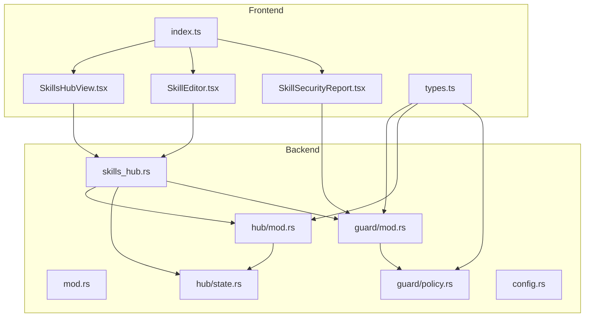
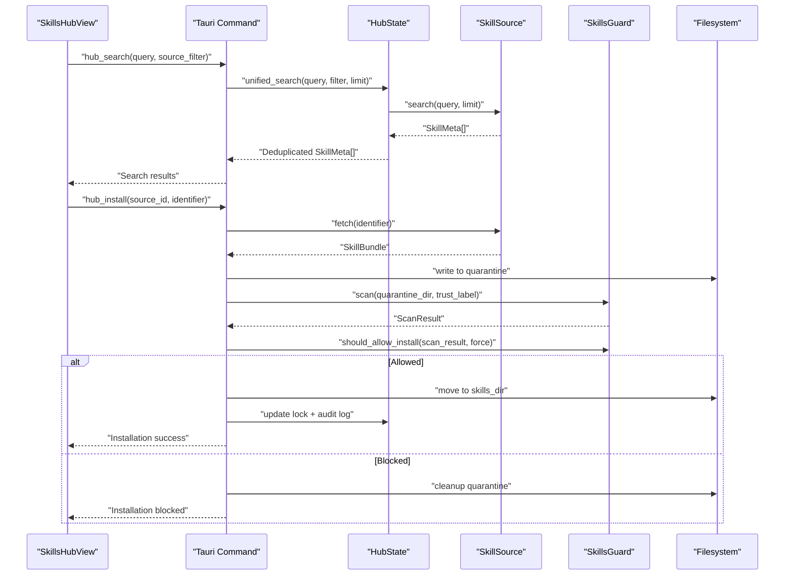
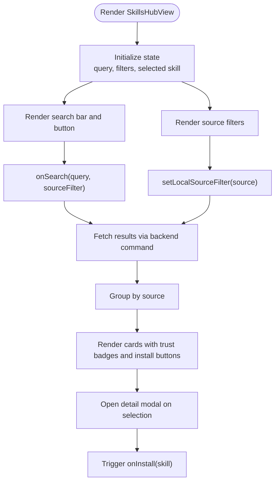
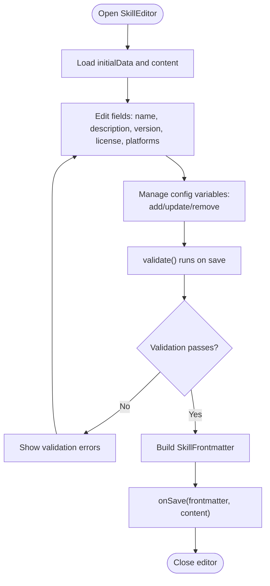
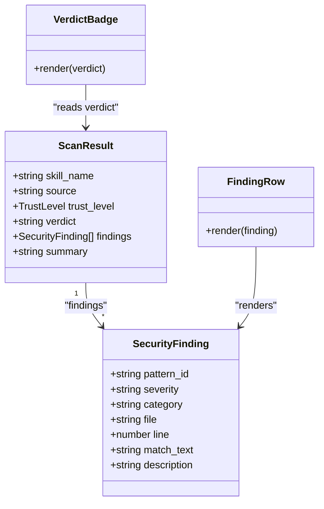
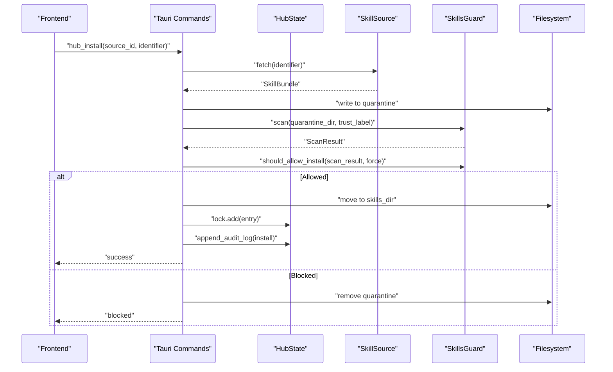
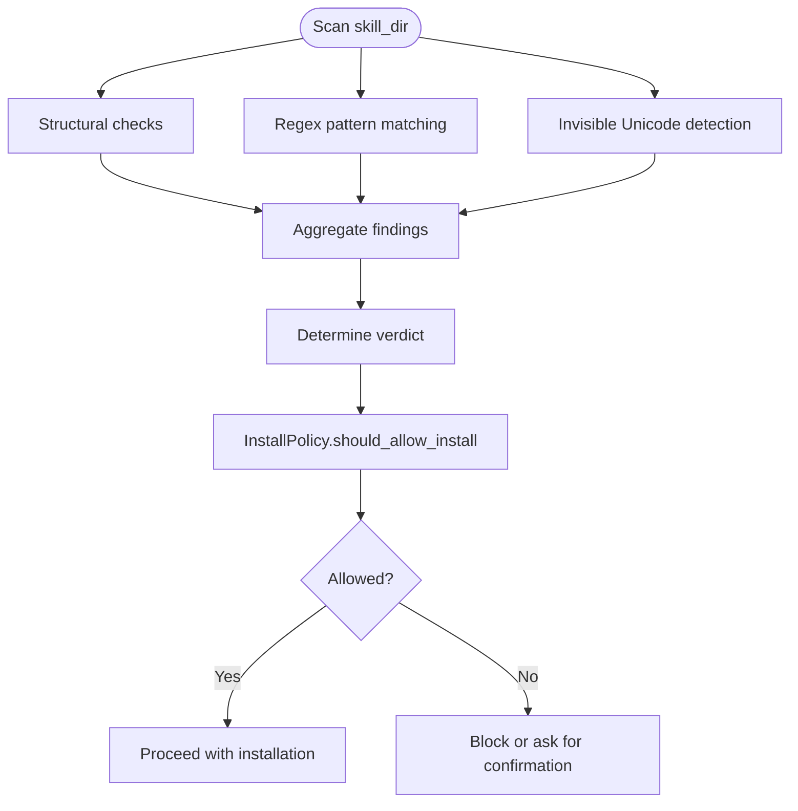
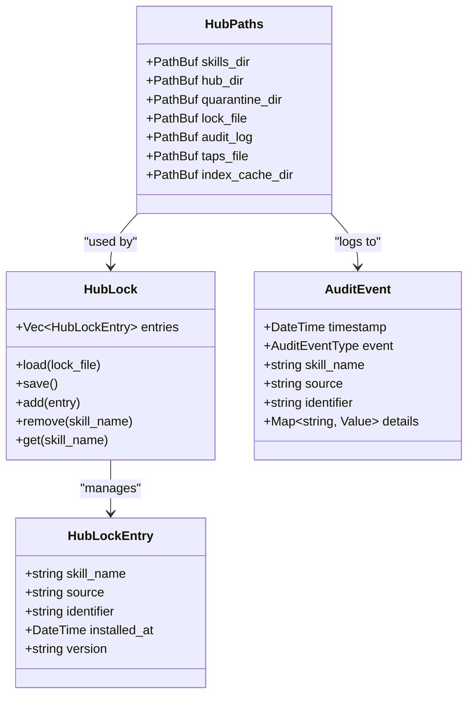
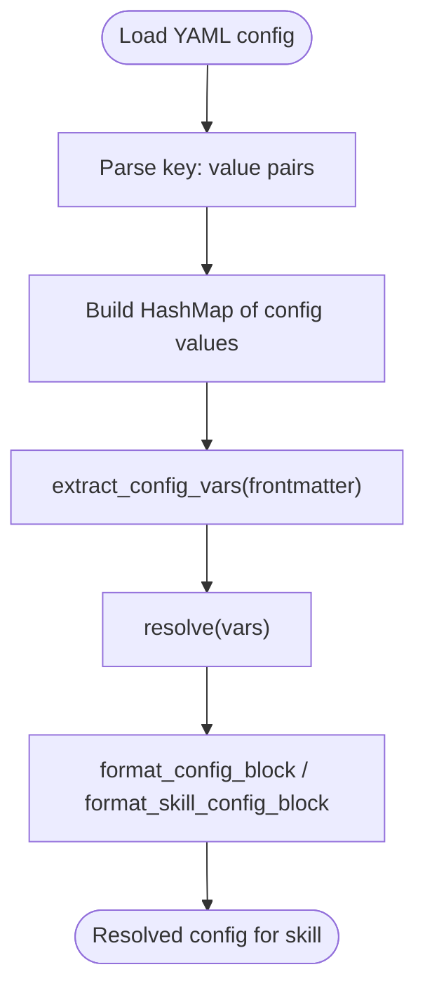
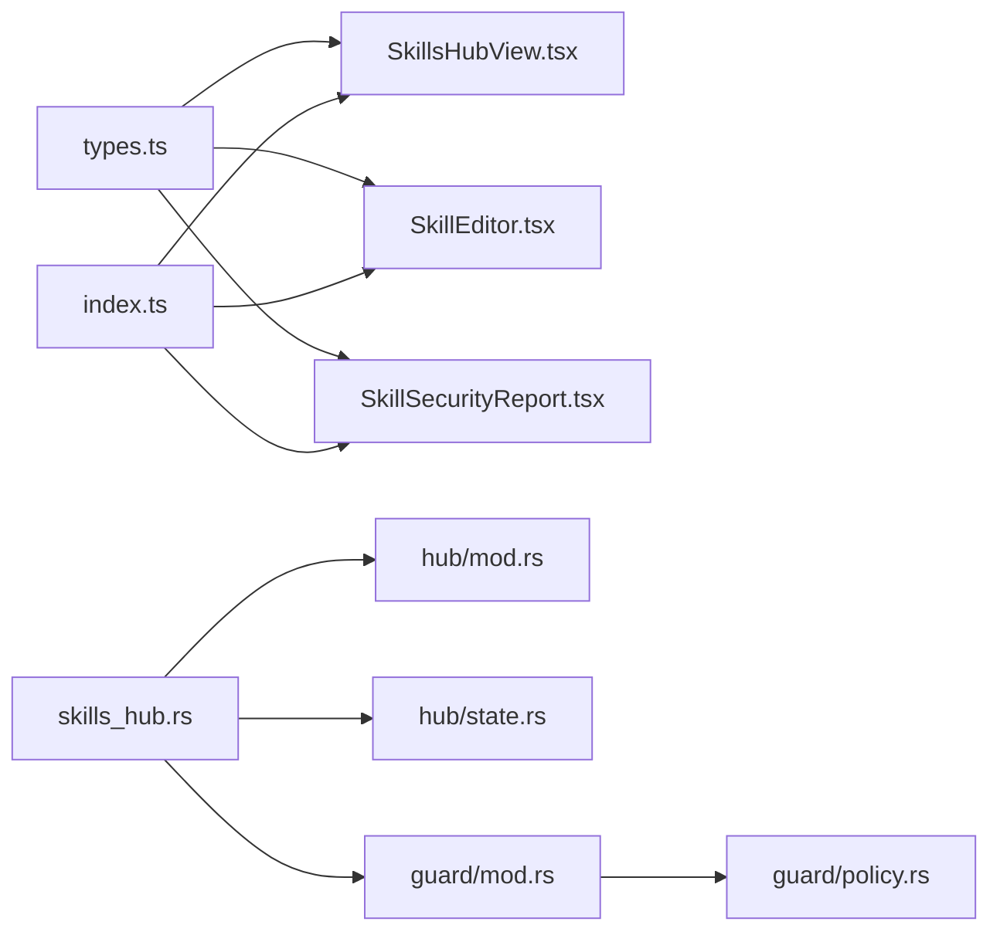

# Skills Hub & Tool Management

<cite>
**Referenced Files in This Document**
- [SkillsHubView.tsx](file://src/modules/skills/SkillsHubView.tsx)
- [SkillEditor.tsx](file://src/modules/skills/SkillEditor.tsx)
- [SkillSecurityReport.tsx](file://src/modules/skills/SkillSecurityReport.tsx)
- [types.ts](file://src/modules/skills/types.ts)
- [index.ts](file://src/modules/skills/index.ts)
- [skills_hub.rs](file://src-tauri/src/commands/skills_hub.rs)
- [mod.rs](file://src-tauri/src/modules/skills/mod.rs)
- [hub/mod.rs](file://src-tauri/src/modules/skills/hub/mod.rs)
- [hub/state.rs](file://src-tauri/src/modules/skills/hub/state.rs)
- [guard/mod.rs](file://src-tauri/src/modules/skills/guard/mod.rs)
- [guard/policy.rs](file://src-tauri/src/modules/skills/guard/policy.rs)
- [config.rs](file://src-tauri/src/modules/skills/config.rs)
</cite>

## Table of Contents
1. [Introduction](#introduction)
2. [Project Structure](#project-structure)
3. [Core Components](#core-components)
4. [Architecture Overview](#architecture-overview)
5. [Detailed Component Analysis](#detailed-component-analysis)
6. [Dependency Analysis](#dependency-analysis)
7. [Performance Considerations](#performance-considerations)
8. [Troubleshooting Guide](#troubleshooting-guide)
9. [Conclusion](#conclusion)

## Introduction
This document describes the skills hub and tool management system, covering the SkillsHubView component architecture, skill discovery and installation workflows, the SkillEditor for creating and modifying skills, the SkillSecurityReport for vulnerability assessment, skills synchronization and repository management, and local skill lifecycle management. It also provides practical guidance for developing custom skills, implementing security policies, and integrating with the skills marketplace.

## Project Structure
The skills system spans both the frontend React components and the Rust backend services:
- Frontend: React components for browsing, editing, and security reporting
- Backend: Tauri commands for marketplace operations, security scanning, and hub state management
- Shared types: TypeScript interfaces that mirror Rust backend structures

**Diagram sources**
- [SkillsHubView.tsx:1-425](file://src/modules/skills/SkillsHubView.tsx#L1-L425)
- [SkillEditor.tsx:1-360](file://src/modules/skills/SkillEditor.tsx#L1-L360)
- [SkillSecurityReport.tsx:1-188](file://src/modules/skills/SkillSecurityReport.tsx#L1-L188)
- [types.ts:1-157](file://src/modules/skills/types.ts#L1-L157)
- [index.ts:1-9](file://src/modules/skills/index.ts#L1-L9)
- [skills_hub.rs:1-851](file://src-tauri/src/commands/skills_hub.rs#L1-L851)
- [mod.rs:1-22](file://src-tauri/src/modules/skills/mod.rs#L1-L22)
- [hub/mod.rs:1-101](file://src-tauri/src/modules/skills/hub/mod.rs#L1-L101)
- [hub/state.rs:1-617](file://src-tauri/src/modules/skills/hub/state.rs#L1-L617)
- [guard/mod.rs:1-809](file://src-tauri/src/modules/skills/guard/mod.rs#L1-L809)
- [guard/policy.rs:1-369](file://src-tauri/src/modules/skills/guard/policy.rs#L1-L369)
- [config.rs:1-419](file://src-tauri/src/modules/skills/config.rs#L1-L419)

**Section sources**
- [index.ts:1-9](file://src/modules/skills/index.ts#L1-L9)
- [mod.rs:1-22](file://src-tauri/src/modules/skills/mod.rs#L1-L22)

## Core Components
- SkillsHubView: A React component that renders a unified search interface across multiple skill sources, supports filtering by source and trust level, and triggers installation actions.
- SkillEditor: A React form component for editing SKILL.md frontmatter with real-time validation and preview generation.
- SkillSecurityReport: A React component that renders security scan results with severity and category indicators.
- Shared Types: TypeScript interfaces mirroring Rust backend structures for security findings, scan results, trust levels, and skill metadata.
- Backend Commands: Tauri commands implementing hub operations (browse, search, install, audit, uninstall, snapshot, tap).
- Security Guard: Rust-based scanner that performs static analysis and enforces trust-aware installation policy.
- Hub State: Manages quarantine, lock file, audit logs, and unified search across sources.
- Configuration Resolver: Resolves skill configuration variables from YAML config files.

**Section sources**
- [SkillsHubView.tsx:1-425](file://src/modules/skills/SkillsHubView.tsx#L1-L425)
- [SkillEditor.tsx:1-360](file://src/modules/skills/SkillEditor.tsx#L1-L360)
- [SkillSecurityReport.tsx:1-188](file://src/modules/skills/SkillSecurityReport.tsx#L1-L188)
- [types.ts:1-157](file://src/modules/skills/types.ts#L1-L157)
- [skills_hub.rs:1-851](file://src-tauri/src/commands/skills_hub.rs#L1-L851)
- [guard/mod.rs:1-809](file://src-tauri/src/modules/skills/guard/mod.rs#L1-L809)
- [hub/state.rs:1-617](file://src-tauri/src/modules/skills/hub/state.rs#L1-L617)
- [config.rs:1-419](file://src-tauri/src/modules/skills/config.rs#L1-L419)

## Architecture Overview
The system integrates frontend UI components with backend Tauri commands and Rust modules. The frontend emits user actions (search, install, edit), while the backend orchestrates fetching bundles, quarantine, scanning, policy enforcement, and installation.

**Diagram sources**
- [skills_hub.rs:132-559](file://src-tauri/src/commands/skills_hub.rs#L132-L559)
- [hub/state.rs:434-486](file://src-tauri/src/modules/skills/hub/state.rs#L434-L486)
- [guard/mod.rs:130-183](file://src-tauri/src/modules/skills/guard/mod.rs#L130-L183)
- [guard/policy.rs:162-215](file://src-tauri/src/modules/skills/guard/policy.rs#L162-L215)

## Detailed Component Analysis

### SkillsHubView Component
SkillsHubView provides a unified search interface across multiple sources (GitHub, skills.sh, ClawHub, Claude Marketplace, LobeHub, Well-Known, Optional). It supports:
- Search input with Enter key handling
- Source filtering tabs
- Trust-level badges
- Installed skill highlighting
- Detail modal for skill inspection
- Responsive grid layout for results

**Diagram sources**
- [SkillsHubView.tsx:62-322](file://src/modules/skills/SkillsHubView.tsx#L62-L322)

**Section sources**
- [SkillsHubView.tsx:1-425](file://src/modules/skills/SkillsHubView.tsx#L1-L425)
- [types.ts:60-94](file://src/modules/skills/types.ts#L60-L94)

### SkillEditor Component
SkillEditor offers a structured form for editing SKILL.md frontmatter with:
- Real-time validation for name, description, platforms, and config variables
- Config variable management (add, edit, remove)
- Platform selection toggles
- Frontmatter preview
- Save and cancel actions

**Diagram sources**
- [SkillEditor.tsx:37-113](file://src/modules/skills/SkillEditor.tsx#L37-L113)

**Section sources**
- [SkillEditor.tsx:1-360](file://src/modules/skills/SkillEditor.tsx#L1-L360)
- [types.ts:112-131](file://src/modules/skills/types.ts#L112-L131)

### SkillSecurityReport Component
SkillSecurityReport renders security scan results with:
- Verdict badges (safe/caution/dangerous)
- Severity-colored findings with pattern ID, category, location, and truncated match text
- Compact vs detailed modes
- Trust level and source metadata

**Diagram sources**
- [SkillSecurityReport.tsx:115-185](file://src/modules/skills/SkillSecurityReport.tsx#L115-L185)
- [types.ts:33-48](file://src/modules/skills/types.ts#L33-L48)
- [types.ts:12-27](file://src/modules/skills/types.ts#L12-L27)

**Section sources**
- [SkillSecurityReport.tsx:1-188](file://src/modules/skills/SkillSecurityReport.tsx#L1-L188)
- [types.ts:1-157](file://src/modules/skills/types.ts#L1-L157)

### Backend Commands and Hub Operations
The backend exposes Tauri commands for:
- Browse: List skills from all sources
- Search: Unified search across sources with trust-based sorting
- Inspect: Retrieve skill metadata and file listing
- Install: Fetch → quarantine → scan → policy check → install → update lock and audit
- Audit: Scan all installed skills
- Uninstall: Remove skill and update lock
- Snapshot: Export/import skill configurations
- Tap: Manage custom GitHub sources

**Diagram sources**
- [skills_hub.rs:448-559](file://src-tauri/src/commands/skills_hub.rs#L448-L559)
- [guard/mod.rs:341-356](file://src-tauri/src/modules/skills/guard/mod.rs#L341-L356)
- [hub/state.rs:417-432](file://src-tauri/src/modules/skills/hub/state.rs#L417-L432)

**Section sources**
- [skills_hub.rs:1-851](file://src-tauri/src/commands/skills_hub.rs#L1-L851)
- [hub/mod.rs:34-47](file://src-tauri/src/modules/skills/hub/mod.rs#L34-L47)

### Security Guard and Policy
SkillsGuard performs:
- Structural checks and regex-based threat pattern matching
- Invisible Unicode detection
- Runtime command scanning
- Verdict determination (Safe/Caution/Dangerous)
- Trust-aware policy enforcement

**Diagram sources**
- [guard/mod.rs:130-183](file://src-tauri/src/modules/skills/guard/mod.rs#L130-L183)
- [guard/policy.rs:162-215](file://src-tauri/src/modules/skills/guard/policy.rs#L162-L215)

**Section sources**
- [guard/mod.rs:1-809](file://src-tauri/src/modules/skills/guard/mod.rs#L1-L809)
- [guard/policy.rs:1-369](file://src-tauri/src/modules/skills/guard/policy.rs#L1-L369)

### Hub State and Local Management
HubState manages:
- Directory structure for skills, quarantine, lock, audit, taps, and index cache
- Lock file for installed skills
- Audit logging
- Unified search with trust-based deduplication
- Quarantine and installation workflows

**Diagram sources**
- [hub/state.rs:16-94](file://src-tauri/src/modules/skills/hub/state.rs#L16-L94)
- [hub/state.rs:72-85](file://src-tauri/src/modules/skills/hub/state.rs#L72-L85)
- [hub/state.rs:189-205](file://src-tauri/src/modules/skills/hub/state.rs#L189-L205)

**Section sources**
- [hub/state.rs:1-617](file://src-tauri/src/modules/skills/hub/state.rs#L1-L617)

### Skill Configuration Resolution
The configuration resolver extracts and resolves skill configuration variables from YAML:
- Extract config variables from frontmatter (including hermes config)
- Resolve values from a YAML config file, with defaults
- Format resolved values for skill invocation

**Diagram sources**
- [config.rs:106-173](file://src-tauri/src/modules/skills/config.rs#L106-L173)
- [config.rs:214-281](file://src-tauri/src/modules/skills/config.rs#L214-L281)

**Section sources**
- [config.rs:1-419](file://src-tauri/src/modules/skills/config.rs#L1-L419)

## Dependency Analysis
The frontend components depend on shared types and re-export them via the skills module index. The backend commands depend on hub modules, guard modules, and state management.

**Diagram sources**
- [types.ts:1-157](file://src/modules/skills/types.ts#L1-L157)
- [index.ts:1-9](file://src/modules/skills/index.ts#L1-L9)
- [skills_hub.rs:1-851](file://src-tauri/src/commands/skills_hub.rs#L1-L851)
- [hub/mod.rs:1-101](file://src-tauri/src/modules/skills/hub/mod.rs#L1-L101)
- [hub/state.rs:1-617](file://src-tauri/src/modules/skills/hub/state.rs#L1-L617)
- [guard/mod.rs:1-809](file://src-tauri/src/modules/skills/guard/mod.rs#L1-L809)
- [guard/policy.rs:1-369](file://src-tauri/src/modules/skills/guard/policy.rs#L1-L369)

**Section sources**
- [index.ts:1-9](file://src/modules/skills/index.ts#L1-L9)
- [mod.rs:1-22](file://src-tauri/src/modules/skills/mod.rs#L1-L22)

## Performance Considerations
- Frontend
  - Memoization of filtered and grouped results reduces re-renders during search and filtering.
  - Debouncing search input could further reduce backend calls.
- Backend
  - Unified search deduplicates results by name and ranks by trust to minimize redundant processing.
  - Structural checks and regex scanning scale with file count and size; consider limiting max file sizes or counts.
  - Quarantine and filesystem operations should be performed asynchronously to avoid blocking the UI.

## Troubleshooting Guide
- Installation blocked by security scan
  - Review the security report for critical or high severity findings and adjust the skill accordingly.
  - Use the trust-aware policy guidance to understand why a skill was blocked.
- Audit failures
  - Check the audit log for blocked or failed install events and their reasons.
- Snapshot import/export issues
  - Verify snapshot file format and ensure required fields are present.
- Configuration resolution problems
  - Confirm YAML format and key prefixes for skill-specific configuration.

**Section sources**
- [guard/policy.rs:162-215](file://src-tauri/src/modules/skills/guard/policy.rs#L162-L215)
- [hub/state.rs:488-498](file://src-tauri/src/modules/skills/hub/state.rs#L488-L498)
- [skills_hub.rs:598-705](file://src-tauri/src/commands/skills_hub.rs#L598-L705)
- [config.rs:106-173](file://src-tauri/src/modules/skills/config.rs#L106-L173)

## Conclusion
The skills hub and tool management system combines a user-friendly frontend with robust backend orchestration. SkillsHubView enables discovery and installation across multiple sources, SkillEditor supports secure authoring with validation, and SkillSecurityReport provides actionable security insights. The backend’s SkillsGuard and HubState modules enforce trust-aware policies, manage lifecycle events, and maintain integrity through quarantine, scanning, and audit logging. Together, these components deliver a secure, scalable, and extensible skills ecosystem.