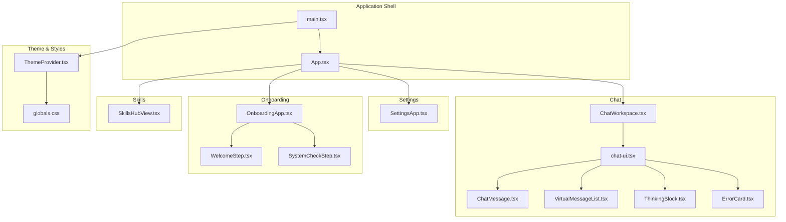
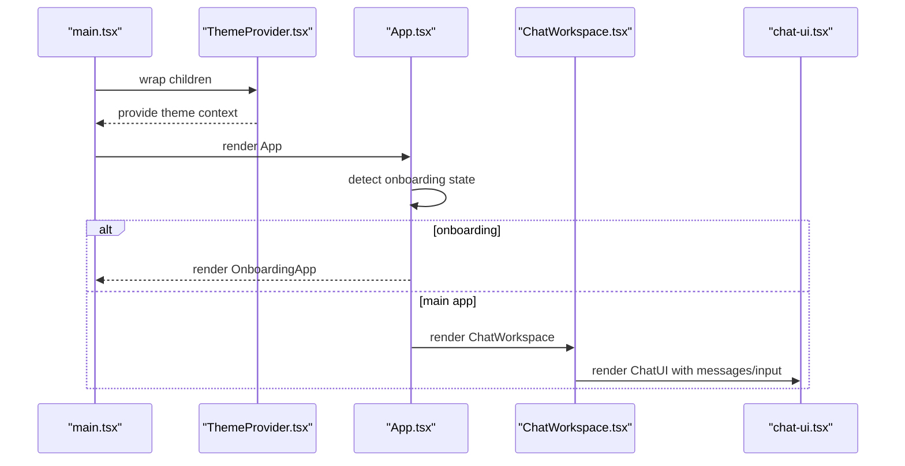
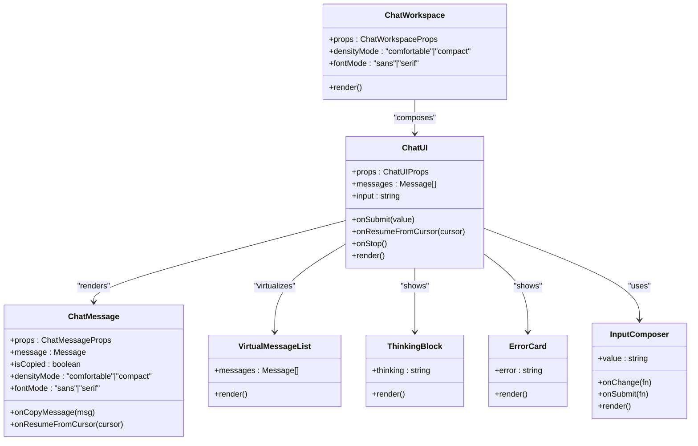
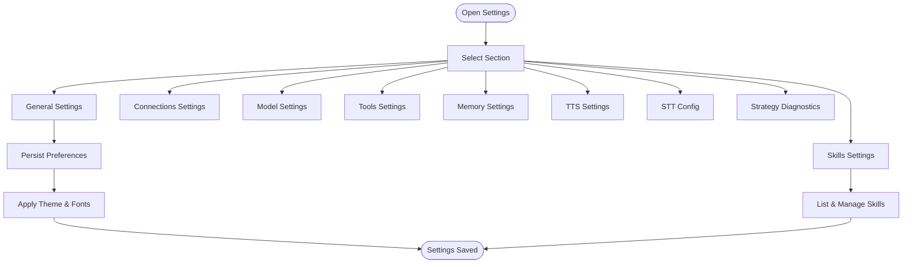
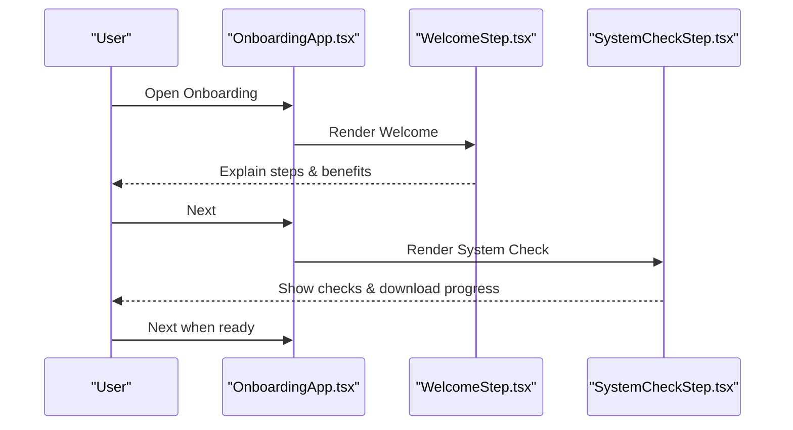
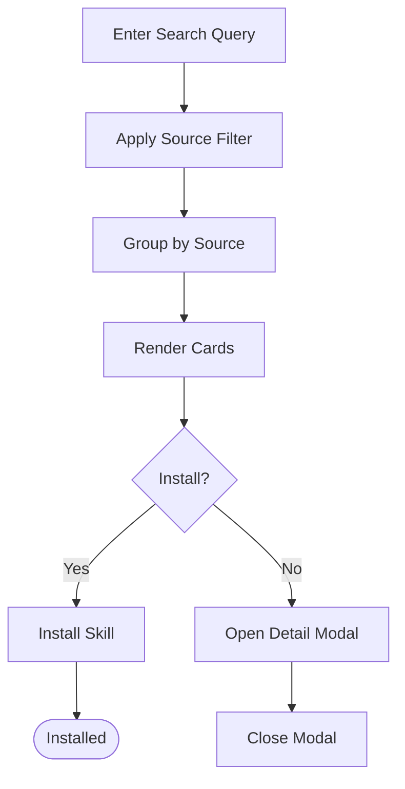
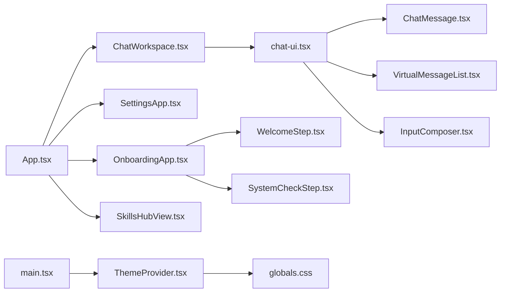

# User Interface Components

<cite>
**Referenced Files in This Document**
- [App.tsx](file://src/App.tsx)
- [main.tsx](file://src/main.tsx)
- [ChatWorkspace.tsx](file://src/modules/chat/components/ChatWorkspace.tsx)
- [chat-ui.tsx](file://src/components/ui/chat-ui.tsx)
- [ChatMessage.tsx](file://src/components/chat/ChatMessage.tsx)
- [VirtualMessageList.tsx](file://src/components/chat/VirtualMessageList.tsx)
- [ThinkingBlock.tsx](file://src/components/chat/ThinkingBlock.tsx)
- [ErrorCard.tsx](file://src/components/chat/ErrorCard.tsx)
- [ThemeProvider.tsx](file://src/components/theme/ThemeProvider.tsx)
- [globals.css](file://src/styles/globals.css)
- [SettingsApp.tsx](file://src/modules/settings/SettingsApp.tsx)
- [OnboardingApp.tsx](file://src/modules/onboarding/OnboardingApp.tsx)
- [WelcomeStep.tsx](file://src/modules/onboarding/steps/WelcomeStep.tsx)
- [SystemCheckStep.tsx](file://src/modules/onboarding/steps/SystemCheckStep.tsx)
- [SkillsHubView.tsx](file://src/modules/skills/SkillsHubView.tsx)
- [InputComposer.tsx](file://src/components/ds/InputComposer.tsx)
- [ChatTimeline.tsx](file://src/components/ds/ChatTimeline.tsx)
</cite>

## Table of Contents
1. [Introduction](#introduction)
2. [Project Structure](#project-structure)
3. [Core Components](#core-components)
4. [Architecture Overview](#architecture-overview)
5. [Detailed Component Analysis](#detailed-component-analysis)
6. [Dependency Analysis](#dependency-analysis)
7. [Performance Considerations](#performance-considerations)
8. [Troubleshooting Guide](#troubleshooting-guide)
9. [Conclusion](#conclusion)
10. [Appendices](#appendices)

## Introduction
This document describes If2Ai’s user interface system with a focus on:
- Chat interface: message rendering, streaming responses, and interactive elements
- Settings management: configuration options, preference storage, and user customization
- Onboarding flow: step-by-step guidance and setup validation
- Skills hub: browsing, filtering, and installing tools and plugins
- Composition patterns, state management integration, responsive design, accessibility, theming, and cross-platform consistency

## Project Structure
The UI is organized around modular React components and pages:
- Application shell and routing orchestration live in the root application file
- Chat workspace and related UI components are under dedicated modules and components
- Settings and onboarding are implemented as separate apps with their own shells
- Theming and design tokens are centralized in a theme provider and global CSS

**Diagram sources**
- [main.tsx:16-43](file://src/main.tsx#L16-L43)
- [App.tsx:48-51](file://src/App.tsx#L48-L51)
- [ChatWorkspace.tsx:92-401](file://src/modules/chat/components/ChatWorkspace.tsx#L92-L401)
- [chat-ui.tsx:116-139](file://src/components/ui/chat-ui.tsx#L116-L139)
- [ChatMessage.tsx:39-69](file://src/components/chat/ChatMessage.tsx#L39-L69)
- [VirtualMessageList.tsx](file://src/components/chat/VirtualMessageList.tsx)
- [ThinkingBlock.tsx](file://src/components/chat/ThinkingBlock.tsx)
- [ErrorCard.tsx](file://src/components/chat/ErrorCard.tsx)
- [SettingsApp.tsx:36-227](file://src/modules/settings/SettingsApp.tsx#L36-L227)
- [OnboardingApp.tsx:156-212](file://src/modules/onboarding/OnboardingApp.tsx#L156-L212)
- [WelcomeStep.tsx:50-222](file://src/modules/onboarding/steps/WelcomeStep.tsx#L50-L222)
- [SystemCheckStep.tsx:177-616](file://src/modules/onboarding/steps/SystemCheckStep.tsx#L177-L616)
- [SkillsHubView.tsx:62-425](file://src/modules/skills/SkillsHubView.tsx#L62-L425)
- [ThemeProvider.tsx:53-101](file://src/components/theme/ThemeProvider.tsx#L53-L101)
- [globals.css:12-94](file://src/styles/globals.css#L12-L94)

**Section sources**
- [main.tsx:16-43](file://src/main.tsx#L16-L43)
- [App.tsx:48-51](file://src/App.tsx#L48-L51)

## Core Components
- ChatWorkspace: orchestrates the chat area, sidebar, and header controls; manages layout, density, and font modes; integrates with the chat UI and browser overlay
- ChatUI: renders the message list, input composer, tool-call cards, memory chips, and interactive panels; supports streaming and virtualization
- SettingsApp: central settings shell with sections for general, connections, model, skills, memory, tools, and diagnostics; persists preferences
- OnboardingApp: stepwise guided setup with welcome, system checks, security, provider/channel selection, and activation
- SkillsHubView: unified search and installation hub for skills across multiple sources with trust levels and filtering
- ThemeProvider: system-aware theme switching with persistent storage and dark mode support

**Section sources**
- [ChatWorkspace.tsx:92-401](file://src/modules/chat/components/ChatWorkspace.tsx#L92-L401)
- [chat-ui.tsx:116-139](file://src/components/ui/chat-ui.tsx#L116-L139)
- [SettingsApp.tsx:36-227](file://src/modules/settings/SettingsApp.tsx#L36-L227)
- [OnboardingApp.tsx:156-212](file://src/modules/onboarding/OnboardingApp.tsx#L156-L212)
- [SkillsHubView.tsx:62-425](file://src/modules/skills/SkillsHubView.tsx#L62-L425)
- [ThemeProvider.tsx:53-101](file://src/components/theme/ThemeProvider.tsx#L53-L101)

## Architecture Overview
The UI architecture follows a layered pattern:
- Root renderer mounts ThemeProvider and TooltipProvider, then selects the surface (main app, settings, or browser viewer)
- App orchestrates onboarding detection, project/session state, and routes to ChatWorkspace or Onboarding
- ChatWorkspace composes ProjectRail, ChatUI, and optional BrowserCard
- ChatUI composes message renderers, virtualization, and interactive panels
- SettingsApp composes a settings shell with section-specific pages
- OnboardingApp composes step components and uses hooks for state
- ThemeProvider centralizes theme resolution and persistence

**Diagram sources**
- [main.tsx:37-43](file://src/main.tsx#L37-L43)
- [ThemeProvider.tsx:53-101](file://src/components/theme/ThemeProvider.tsx#L53-L101)
- [App.tsx:92-197](file://src/App.tsx#L92-L197)
- [ChatWorkspace.tsx:92-401](file://src/modules/chat/components/ChatWorkspace.tsx#L92-L401)
- [chat-ui.tsx:116-139](file://src/components/ui/chat-ui.tsx#L116-L139)

## Detailed Component Analysis

### Chat Interface
The chat interface is composed of:
- ChatWorkspace: layout, density/font controls, left/right rails, and integration with the chat UI
- ChatUI: message rendering, streaming, input composer, tool-call cards, memory chips, and panels
- Message renderers: ChatMessage, VirtualMessageList, ThinkingBlock, ErrorCard
- Input composer: InputComposer (DS component) integrated into ChatUI

**Diagram sources**
- [ChatWorkspace.tsx:92-401](file://src/modules/chat/components/ChatWorkspace.tsx#L92-L401)
- [chat-ui.tsx:116-139](file://src/components/ui/chat-ui.tsx#L116-L139)
- [ChatMessage.tsx:39-69](file://src/components/chat/ChatMessage.tsx#L39-L69)
- [VirtualMessageList.tsx](file://src/components/chat/VirtualMessageList.tsx)
- [ThinkingBlock.tsx](file://src/components/chat/ThinkingBlock.tsx)
- [ErrorCard.tsx](file://src/components/chat/ErrorCard.tsx)
- [InputComposer.tsx](file://src/components/ds/InputComposer.tsx)

Key behaviors:
- Streaming responses: ChatUI tracks streaming state and renders incremental updates; virtualization activates above a threshold to maintain performance
- Interactive elements: copy actions, resume from cursor, stop generation, permission mode toggles, and model selection
- Accessibility: semantic roles and keyboard navigation are supported through underlying DS components and proper ARIA attributes

**Section sources**
- [chat-ui.tsx:84-114](file://src/components/ui/chat-ui.tsx#L84-L114)
- [chat-ui.tsx:116-139](file://src/components/ui/chat-ui.tsx#L116-L139)
- [ChatWorkspace.tsx:145-182](file://src/modules/chat/components/ChatWorkspace.tsx#L145-L182)

### Settings Management
SettingsApp provides a comprehensive configuration surface:
- Sections: general, usage, connections, remote, model, tools, web search, memory, skills, TTS/STT, strategy diagnostics, about
- Persistence: theme, font mode, language, startup mode, density, auto-scroll, notifications; font mode also toggles a body class for typography
- Skills management: list, enable/disable, review drafts, approve proposals, rollback, and create a starter conversation

**Diagram sources**
- [SettingsApp.tsx:36-227](file://src/modules/settings/SettingsApp.tsx#L36-L227)

**Section sources**
- [SettingsApp.tsx:36-227](file://src/modules/settings/SettingsApp.tsx#L36-L227)

### Onboarding Flow
OnboardingApp coordinates six steps:
- WelcomeStep: introduces the process and highlights benefits
- SystemCheckStep: runs hardware checks and downloads the embedded model
- SecurityConfirmStep: reviews security notes
- ProviderSetupStep: selects model providers
- ChannelSetupStep: connects messaging channels
- ActivationStep: final activation

**Diagram sources**
- [OnboardingApp.tsx:156-212](file://src/modules/onboarding/OnboardingApp.tsx#L156-L212)
- [WelcomeStep.tsx:50-222](file://src/modules/onboarding/steps/WelcomeStep.tsx#L50-L222)
- [SystemCheckStep.tsx:177-616](file://src/modules/onboarding/steps/SystemCheckStep.tsx#L177-L616)

Validation and setup:
- SystemCheckStep auto-runs checks and triggers model download; continues only when model is ready
- SecurityConfirmStep requires explicit confirmation before proceeding
- ProviderSetupStep and ChannelSetupStep validate selections and connectivity

**Section sources**
- [WelcomeStep.tsx:50-222](file://src/modules/onboarding/steps/WelcomeStep.tsx#L50-L222)
- [SystemCheckStep.tsx:177-616](file://src/modules/onboarding/steps/SystemCheckStep.tsx#L177-L616)

### Skills Hub
SkillsHubView provides a unified interface to browse, filter, and install skills:
- Search by name, description, or tags
- Filter by source (GitHub, skills.sh, ClawHub, Marketplace, Built-in)
- Trust level badges and tag chips
- Install actions with disabled states for already-installed skills
- Detail modal with repository/path/identifier

**Diagram sources**
- [SkillsHubView.tsx:62-425](file://src/modules/skills/SkillsHubView.tsx#L62-L425)

**Section sources**
- [SkillsHubView.tsx:62-425](file://src/modules/skills/SkillsHubView.tsx#L62-L425)

### Component Composition Patterns
- Container components (ChatWorkspace, SettingsApp, OnboardingApp) manage state and props for child components
- Presentational components (ChatUI, ChatMessage, SkillsHubView) are props-driven and reusable
- DS components (Button, Input, Dialog, Tooltip) provide consistent UI primitives
- Virtualization: ChatUI switches to a virtualized list when message count exceeds a threshold to preserve performance

**Section sources**
- [ChatWorkspace.tsx:92-401](file://src/modules/chat/components/ChatWorkspace.tsx#L92-L401)
- [chat-ui.tsx:64-71](file://src/components/ui/chat-ui.tsx#L64-L71)

### State Management Integration
- App orchestrates global state: projects, sessions, conversations, input, loading flags, permission mode, and execution mode preview
- Runtime projection bridge integrates permission requests and memory events into a canonical store
- SettingsApp persists preferences to localStorage and applies them immediately (e.g., font mode toggles a body class)

**Section sources**
- [App.tsx:214-284](file://src/App.tsx#L214-L284)
- [App.tsx:755-766](file://src/App.tsx#L755-L766)
- [SettingsApp.tsx:121-131](file://src/modules/settings/SettingsApp.tsx#L121-L131)

### Responsive Design and Layout
- ChatWorkspace supports resizable left pane and collapsible sidebar; header controls adjust for density and font modes
- ChatUI enforces a maximum content width and uses a centered column for readability
- Onboarding uses a two-panel layout with a right info panel and left step content
- SettingsApp adapts to different screen sizes with a sidebar navigation and content area

**Section sources**
- [ChatWorkspace.tsx:184-246](file://src/modules/chat/components/ChatWorkspace.tsx#L184-L246)
- [ChatWorkspace.tsx:248-399](file://src/modules/chat/components/ChatWorkspace.tsx#L248-L399)
- [chat-ui.tsx:154-161](file://src/components/ui/chat-ui.tsx#L154-L161)

### Accessibility Features
- Semantic markup and ARIA attributes are applied in DS components and ChatUI
- Keyboard navigation support through focus management and accessible buttons
- Screen reader-friendly labels and status indicators for streaming and error states

**Section sources**
- [chat-ui.tsx:116-139](file://src/components/ui/chat-ui.tsx#L116-L139)

### Theming Support and Cross-Platform Consistency
- ThemeProvider resolves theme from system preference and user overrides, applying a class to the root element
- Design tokens are defined in globals.css and mapped to Tailwind-compatible CSS variables
- Dark mode overrides ensure consistent appearance across platforms

**Section sources**
- [ThemeProvider.tsx:53-101](file://src/components/theme/ThemeProvider.tsx#L53-L101)
- [globals.css:12-94](file://src/styles/globals.css#L12-L94)
- [globals.css:276-378](file://src/styles/globals.css#L276-L378)

## Dependency Analysis
The UI components depend on:
- DS primitives for buttons, inputs, dialogs, tooltips
- Tauri integration for streaming, permissions, settings, and skills
- Runtime projection for canonical state and permission decisions
- ThemeProvider and design tokens for consistent theming

**Diagram sources**
- [App.tsx:48-51](file://src/App.tsx#L48-L51)
- [ChatWorkspace.tsx:92-401](file://src/modules/chat/components/ChatWorkspace.tsx#L92-L401)
- [chat-ui.tsx:116-139](file://src/components/ui/chat-ui.tsx#L116-L139)
- [ChatMessage.tsx:39-69](file://src/components/chat/ChatMessage.tsx#L39-L69)
- [VirtualMessageList.tsx](file://src/components/chat/VirtualMessageList.tsx)
- [InputComposer.tsx](file://src/components/ds/InputComposer.tsx)
- [SettingsApp.tsx:36-227](file://src/modules/settings/SettingsApp.tsx#L36-L227)
- [OnboardingApp.tsx:156-212](file://src/modules/onboarding/OnboardingApp.tsx#L156-L212)
- [WelcomeStep.tsx:50-222](file://src/modules/onboarding/steps/WelcomeStep.tsx#L50-L222)
- [SystemCheckStep.tsx:177-616](file://src/modules/onboarding/steps/SystemCheckStep.tsx#L177-L616)
- [SkillsHubView.tsx:62-425](file://src/modules/skills/SkillsHubView.tsx#L62-L425)
- [main.tsx:37-43](file://src/main.tsx#L37-L43)
- [ThemeProvider.tsx:53-101](file://src/components/theme/ThemeProvider.tsx#L53-L101)
- [globals.css:12-94](file://src/styles/globals.css#L12-L94)

**Section sources**
- [App.tsx:48-51](file://src/App.tsx#L48-L51)
- [main.tsx:37-43](file://src/main.tsx#L37-L43)

## Performance Considerations
- Virtualization: ChatUI switches to a virtualized message list when the number of messages exceeds a threshold to maintain smooth scrolling
- Storage caching: ChatWorkspace persists density and font mode to localStorage; SettingsApp caches font mode preference
- Lazy loading: Voice and STT components are lazy-loaded to reduce initial bundle size
- Efficient updates: Streaming updates modify message content incrementally without re-rendering the entire list

**Section sources**
- [chat-ui.tsx:64-71](file://src/components/ui/chat-ui.tsx#L64-L71)
- [ChatWorkspace.tsx:145-182](file://src/modules/chat/components/ChatWorkspace.tsx#L145-L182)
- [SettingsApp.tsx:121-131](file://src/modules/settings/SettingsApp.tsx#L121-L131)

## Troubleshooting Guide
Common issues and resolutions:
- Chat not rendering or lagging: verify message count thresholds and ensure virtualization is active for long transcripts
- Streaming interruptions: check for permission prompts and memory policy decisions; ensure runtime projection listeners are wired
- Settings not persisting: confirm localStorage availability and that theme/font mode setters are invoked
- Onboarding stuck: ensure system checks complete and model download finishes before proceeding to next steps

**Section sources**
- [App.tsx:755-766](file://src/App.tsx#L755-L766)
- [SystemCheckStep.tsx:177-616](file://src/modules/onboarding/steps/SystemCheckStep.tsx#L177-L616)
- [SettingsApp.tsx:121-131](file://src/modules/settings/SettingsApp.tsx#L121-L131)

## Conclusion
If2Ai’s UI system combines modular components, robust state management, and a cohesive design system to deliver a responsive, accessible, and customizable experience. The chat interface supports streaming and interactive elements, settings provide comprehensive customization, onboarding ensures smooth setup, and the skills hub simplifies tool discovery and installation. Theming and design tokens ensure consistent visuals across platforms.

## Appendices
- Example usage patterns:
  - Chat: compose ChatWorkspace with ChatUI and integrate streaming handlers
  - Settings: mount SettingsApp and switch sections to manage preferences
  - Onboarding: render OnboardingApp and navigate steps based on backend state
  - Skills: render SkillsHubView with search and install callbacks
- Customization options:
  - Density and font modes in ChatWorkspace
  - Theme selection and persistence via ThemeProvider
  - Settings for model, tools, memory, and diagnostics