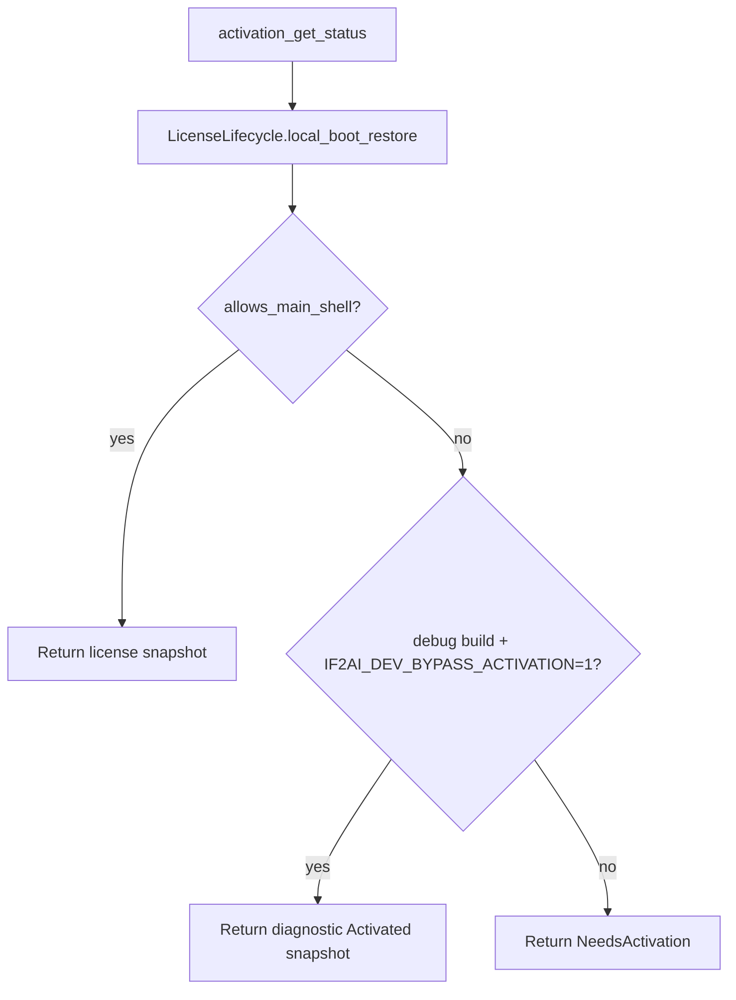

# ACT-001 Activation Gate Debug Persistence Design

Status: draft
Owner: Staff Systems Architecture
Pack: `ACT-001`

## Problem

The app can show the activation gate after a debug rebuild even when onboarding
was completed earlier. The root cause is a deliberate truth-source split:
onboarding config says the ceremony finished, while the new activation gate only
trusts `~/.if2ai/activation/license.json`.

That strict license truth is correct for production because a revoked or missing
license must not be silently re-promoted by legacy onboarding state. The missing
piece is debug ergonomics and diagnostics.

## Target Behavior

- Production boot remains license-only.
- Missing or invalid `license.json` returns `NeedsActivation`.
- Debug builds may opt into a local bypass with
  `IF2AI_DEV_BYPASS_ACTIVATION=1`.
- The bypass emits an `Activated` snapshot with a clear diagnostic message.
- License store logs explain whether the cache was missing, loaded, saved, or
  cleared without leaking secrets.

## Architecture

## Non-Goals

- Do not treat onboarding completion as activation.
- Do not persist a fake license file.
- Do not change the activation IPC or projection contract.
